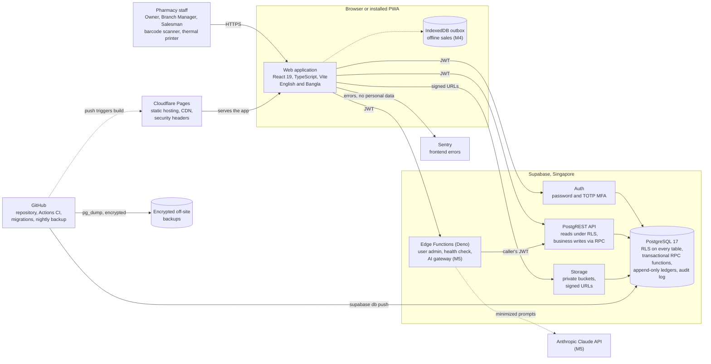

# Pharmacy Inventory Management System (PIMS)

A multi-branch, multi-tenant inventory, point-of-sale (POS) and loyalty platform for retail pharmacies in
Bangladesh. PIMS is built first for a pharmacy business in Mohammadpur, Dhaka, designed to grow to any
number of branches, and ready to be offered to other pharmacies as a hosted service later.

> **Status: M0 Foundation in progress.** The design documentation, repository tooling and CI pipeline are
> in place and under review; a first draft of the M1 database schema exists. There is no user interface
> beyond the application shell yet, and PIMS is **not ready for production use**. See
> [Project status](#project-status).

## Contents

- [Why PIMS](#why-pims)
- [Key features](#key-features)
- [AI roadmap](#ai-roadmap)
- [Architecture at a glance](#architecture-at-a-glance)
- [Technology stack](#technology-stack)
- [Repository layout](#repository-layout)
- [Project status](#project-status)
- [Quick start](#quick-start)
- [Documentation](#documentation)
- [Security](#security)
- [Contributing](#contributing)
- [License](#license)

## Why PIMS

Retail pharmacies in Bangladesh often run on paper registers and spreadsheets, which makes expiry losses,
stock discrepancies, unrecorded customer dues (বাকি) and controlled-drug record keeping hard to manage,
especially across several shops. PIMS gives the Owner, Branch Managers and counter staff (Salesmen) one
accurate, auditable system. Its business objectives, defined in the
[SRS](docs/requirements/SRS.md#12-scope), include:

| Objective            | Target                                                                                         |
| -------------------- | ---------------------------------------------------------------------------------------------- |
| Accurate stock       | Book-to-physical variance below 0.5 % of stock value at the quarterly count (BO-01)            |
| Fewer expiry losses  | Expired write-off value reduced by 50 % within 12 months (BO-02)                               |
| Fast counter service | A typical three-line cash sale completed in 30 seconds or less (BO-03)                         |
| Owner visibility     | Same-day sales, stock, cash and dues of every branch, remotely (BO-04)                         |
| Regulatory records   | 100 % of controlled-drug sales with complete prescription details and a register entry (BO-05) |
| Growth readiness     | A new branch operational through configuration only, in 30 minutes or less (BO-07)             |

## Key features

Each capability lists the milestone in which it is first delivered; the [roadmap](docs/roadmap.md) is
authoritative for scope and dates, and the [SRS](docs/requirements/SRS.md) for the detailed requirements.

| Area                       | Capabilities                                                                                                                                                                                                                                                             | Milestone        |
| -------------------------- | ------------------------------------------------------------------------------------------------------------------------------------------------------------------------------------------------------------------------------------------------------------------------ | ---------------- |
| Organizations and branches | Unlimited branches per organization; branches are deactivated, never deleted; data model multi-tenant from day one                                                                                                                                                       | M1, M2           |
| Users and access           | Roles Owner, Branch Manager and Salesman (Accountant and Auditor later); branch assignment; invitations; mandatory TOTP two-factor authentication for Owner and Branch Manager; approval overrides for actions beyond a user's limits                                    | M1 (DB), M2 (UI) |
| Catalog                    | Brand, generic, manufacturer, dosage form and strength; pack hierarchy (box, strip, piece) with conversion factors; multiple barcodes; schedule OTC, Rx or Controlled; per-branch reorder level and rack location; CSV and XLSX import                                   | M1, M2           |
| Inventory                  | Batch-level stock per branch in base units; immutable append-only stock ledger; first-expiry-first-out (FEFO) allocation; stock can never go negative; audited adjustments with reasons; blind cycle counts; expiry alerts at 30, 60 and 90 days                         | M1, M2           |
| Purchasing                 | Suppliers, optional purchase orders, goods receipt (GRN) creating batches, supplier invoices, payments and dues, purchase returns such as near-expiry returns                                                                                                            | M1, M2, M3       |
| Point of sale              | Fast search by brand, generic, barcode or fuzzy name; discounts within role limits; split payments in Cash, bKash, Nagad, Rocket, Card and Credit (বাকি); held bills; voids with approval; receipts on 58 mm and 80 mm thermal printers and A4; keyboard-first operation | M1 (DB), M2 (UI) |
| Pricing integrity          | Prices and totals always computed by the database, never trusted from the browser; sale price never above MRP; gapless invoice numbers per branch per fiscal year, for example `MPR-2026-000123`                                                                         | M1               |
| Controlled drugs           | Prescription details (patient, prescriber, BMDC registration number, date) required for narcotic and psychotropic sales; immutable controlled-drug register with running balance                                                                                         | M1 to M3         |
| Customers and dues         | Customer profiles with a mobile number unique per organization, credit limits, due (বাকি) ledger, collections and purchase history                                                                                                                                       | M1, M2           |
| Returns                    | Returns against the original invoice, restocking the original batch, credit notes, refunds in cash, by MFS or card, or to the due ledger                                                                                                                                 | M3               |
| Loyalty card program       | See [below](#loyalty-card-program)                                                                                                                                                                                                                                       | M3               |
| Stock transfers            | Branch-to-branch transfers by batch: request, dispatch, in transit, receive, with recall                                                                                                                                                                                 | M3               |
| Cash and expenses          | Cash sessions with opening float, closing count and variance; branch petty-cash expenses with approval limits                                                                                                                                                            | M3               |
| Reports and dashboards     | Daily and monthly sales, profit on batch cost, stock value, expiry, low stock, slow and fast movers, supplier and customer dues, branch comparison, loyalty, controlled-drug register; export to CSV, XLSX and PDF                                                       | M2, M3           |
| Audit and notifications    | Append-only audit log of sensitive changes with before and after values; in-app notifications for expiry, low stock, loyalty expiry and pending transfers                                                                                                                | M1 to M3         |
| Offline counter sales      | Installable PWA that keeps cash and MFS sales going during internet outages, synchronized safely with idempotency keys                                                                                                                                                   | M4               |
| Backup and recovery        | Encrypted nightly backups, a documented restore procedure drilled quarterly, data export                                                                                                                                                                                 | Pilot, M4        |
| Languages                  | English and Bangla (bn-BD) throughout, including receipts                                                                                                                                                                                                                | M2               |

### Loyalty card program

The Owner has not yet decided whether membership is paid or free, whether the benefit is a discount or
reward points, or whether SMS reminders will be used. PIMS therefore implements every loyalty rule as
**configuration, not code** (SRS 3.3.8):

- **Plans** with any duration; a 3-month and a 6-month plan are seeded. The fee is configurable and may be
  ৳0 (free membership).
- **Benefits:** a discount percentage on eligible items, reward points (configurable earn and redemption
  rates), or both, with an optional maximum discount per invoice.
- **Cards:** a card number unique within the organization, printed with a QR code and a barcode; lookup
  by card or by phone; the same card number is kept across renewals.
- **Memberships** with start and end dates, status (active, expired, cancelled), renewals and in-app
  expiry reminders; SMS reminders through a Bangladeshi SMS gateway are planned for later.
- **Exclusions:** medicines can be marked not loyalty-eligible; controlled drugs are excluded by default.
- **Works across all branches**, with every discount and point use recorded for **abuse detection**
  (seven configurable rules, such as usage frequency per card).
- **Reports:** active members, revenue from members, discount given and renewal rate.

## AI roadmap

AI features are planned for milestone **M5** (release label v3), after the production launch. They are
assistive only:

| Feature               | What it does                                                                                        |
| --------------------- | --------------------------------------------------------------------------------------------------- |
| Smart medicine search | From a symptom description or a generic name to matching brands, with current stock                 |
| Prescription reading  | Reads a prescription photo and suggests cart lines that a pharmacist must confirm one by one        |
| Reorder forecasting   | Suggests reorder quantities per branch from sales history                                           |
| Expiry-risk detection | Flags batches unlikely to sell before expiry, in time to transfer, promote or return them           |
| Ask your data         | Lets the Owner ask business questions in plain language; answered with validated, read-only queries |
| Weekly insights       | A weekly business summary for the Owner                                                             |

Guardrails, specified in the [SRS](docs/requirements/SRS.md) (FR-AI) and the
[architecture](docs/architecture/architecture.md) (section 16):

- AI never gives medical advice or dosing and **never writes data**; people confirm every suggestion.
- All AI calls go through a server-side Supabase Edge Function that holds the Anthropic Claude API key;
  the browser never talks to an AI provider.
- Row level security still applies: ask-your-data runs as a read-only role on allow-listed views within
  the user's own organization and branches, and generated SQL is validated before it runs.
- Customer personal data is minimized and redacted before anything is sent to the AI provider.
- AI is off by default, can be switched off per organization and per feature, has a monthly budget, and
  every request is metered and logged.

## Architecture at a glance

PIMS is a single-page web application on Cloudflare Pages backed by Supabase in Singapore
(`ap-southeast-1`), the region with the lowest latency to Dhaka. The full description, with C4 views and
runtime flows, is in the [architecture document](docs/architecture/architecture.md).



Principles that shape every change (each backed by an [ADR](docs/adr/README.md)):

- **The database is the authority.** The browser is untrusted. Reads go through PostgREST under row level
  security; business-critical writes (`create_sale`, `receive_goods`, `adjust_stock`,
  `process_sale_return`, `request_stock_transfer`, `enroll_loyalty` and others) run only as PostgreSQL
  functions in a single transaction (ADR-0007).
- **Tenant and branch isolation in the database.** Every tenant-owned row carries `organization_id`, and
  branch-scoped rows also carry `branch_id`; RLS is enabled on every table and the `anon` role has no
  access to business data (ADR-0006).
- **Stock is a ledger.** An append-only movement ledger is the source of truth; batch quantities are
  projections updated in the same transaction, allocated FEFO and never negative (ADR-0008).
- **Exact money.** Amounts are integer paisa (1 taka = 100 paisa), never floating point (ADR-0005);
  quantities are integer base units; business dates are computed in Asia/Dhaka.
- **Nothing is hard-deleted.** Records are archived or deactivated; ledgers and the audit log are
  append-only.
- **Secrets stay on the server.** Only public values reach the browser; service keys and AI or SMS keys
  live in Edge Function secrets and CI environments.

## Technology stack

Exact versions are pinned in `package.json` and `pnpm-lock.yaml`; the rationale for each choice is in
[architecture section 7](docs/architecture/architecture.md#7-technology-stack).

| Layer                    | Technology                                                                                                           | Status                                               |
| ------------------------ | -------------------------------------------------------------------------------------------------------------------- | ---------------------------------------------------- |
| Language                 | TypeScript (strict); SQL and PL/pgSQL in the database                                                                | In place                                             |
| Web application          | React 19, Vite, React Router                                                                                         | Shell in place; screens from M2                      |
| Server state and forms   | TanStack Query; React Hook Form with Zod schemas shared with RPC payloads                                            | Dependencies in place; used from M2                  |
| UI and styling           | Tailwind CSS; shadcn/ui on Radix primitives (accessible, WCAG 2.1 AA)                                                | Tailwind in place; shadcn/ui from M2                 |
| Internationalization     | i18next and react-i18next with English and Bangla resources                                                          | In place                                             |
| Charts                   | Recharts, loaded only in reports                                                                                     | From M2                                              |
| Offline and installation | PWA with a service worker (vite-plugin-pwa) and an IndexedDB outbox                                                  | M4                                                   |
| Backend platform         | Supabase: PostgreSQL 17 (design requires 15 or later), Auth with TOTP MFA, PostgREST, Edge Functions (Deno), Storage | Database schema drafted (M1); Edge Functions from M2 |
| Hosting                  | Cloudflare Pages with PR preview deployments; security headers in `public/_headers`                                  | Headers in place; project set up in M0               |
| Testing                  | Vitest, Testing Library, fast-check; pgTAP through `supabase test db`; Playwright                                    | In place                                             |
| Code quality             | ESLint, Prettier, Husky with lint-staged, commitlint (Conventional Commits)                                          | In place                                             |
| CI and supply chain      | GitHub Actions; CodeQL; gitleaks; Dependabot; dependency review; `pnpm audit`                                        | In place; deploy and backup workflows planned        |
| Observability            | Sentry (frontend), Supabase logs, external uptime monitor                                                            | Sentry from M2; uptime monitor in M4                 |
| AI                       | Anthropic Claude API through a server-side Edge Function                                                             | M5                                                   |
| Toolchain                | Node.js 24 LTS (24.15.0 or later), pnpm 10.28.0, Supabase CLI 2.120, Docker                                          | In place                                             |

## Repository layout

A single application repository. The planned structure, including the feature-sliced layout of `src/`
from M2, is described in [architecture section 8](docs/architecture/architecture.md#8-repository-layout).

```text
Pharmacy_Inventory/
├── .github/
│   ├── workflows/ci.yml        # quality, database (pgTAP incl. RLS), e2e, gitleaks, dependency review
│   ├── workflows/codeql.yml    # CodeQL static analysis
│   ├── ISSUE_TEMPLATE/         # bug report and feature request forms
│   ├── CODEOWNERS              # owner review for supabase/, .github/ and security headers
│   ├── dependabot.yml
│   └── pull_request_template.md
├── .husky/                     # Git hooks: lint-staged on commit, commitlint on message
├── docs/                       # documentation set; start at docs/README.md
├── e2e/                        # Playwright end-to-end tests
├── public/                     # static files: _headers (security headers), favicon
├── scripts/db/                 # local pgTAP runner that does not need Docker
├── src/
│   ├── app/                    # application shell
│   ├── domain/                 # pure business logic, such as money in paisa
│   ├── i18n/                   # i18next set-up and en/bn resources
│   ├── lib/                    # Supabase client, environment validation, utilities
│   ├── styles/                 # Tailwind CSS entry point
│   └── test/                   # test set-up
├── supabase/
│   ├── config.toml             # local Supabase stack configuration
│   ├── migrations/             # forward-only SQL migrations (M1 draft: 7 files)
│   └── tests/database/         # pgTAP (13 files): platform guards, tenancy, purchase-to-sale flow,
│                               # regressions, dblink interleavings, RLS matrix, area suites
├── .env.example                # public VITE_* variables only; never secrets
├── CONTRIBUTING.md
├── README.md
├── SECURITY.md
└── package.json, pnpm-lock.yaml, vite.config.ts, tsconfig*.json, eslint.config.js, playwright.config.ts
```

Planned additions: `supabase/seed.sql` and `.github/workflows/deploy.yml` (M1),
`supabase/functions/` (M2), the nightly backup workflow (before the pilot) and `CHANGELOG.md` (M0).

## Project status

**Current milestone: M0 Foundation, in progress** (started 2026-10-06, target exit 2026-10-29).

| Area                         | State                                                                                                                                                                                                                                 |
| ---------------------------- | ------------------------------------------------------------------------------------------------------------------------------------------------------------------------------------------------------------------------------------- |
| Design documentation         | Complete draft set in review: SRS, architecture, database design, security model, engineering standards, testing strategy, eight ADRs, glossary, roadmap, operations runbook                                                          |
| Tooling and CI               | In place: strict TypeScript, linting, formatting, unit and end-to-end test harnesses, pgTAP database tests, CodeQL, secret scanning, dependency review, Dependabot                                                                    |
| Database (M1, started early) | Seven draft migrations covering tenancy, catalog, inventory ledger, purchasing, customers, loyalty groundwork, sales and reports, with 13 pgTAP files (1,488 assertions); implementation deltas tracked in database design section 21 |
| Open M0 work                 | Branch protection and required checks, `CHANGELOG.md`, staging Supabase project, Cloudflare Pages project, SRS approval by the Owner                                                                                                  |
| Not started                  | Application screens (M2), Edge Functions (M2), production environment (pilot preparation)                                                                                                                                             |

Milestone plan (target dates; the [roadmap](docs/roadmap.md) is authoritative and re-baselined at each
milestone review):

| Milestone | Scope                                                                                                                | Target exit                              |
| --------- | -------------------------------------------------------------------------------------------------------------------- | ---------------------------------------- |
| M0        | Foundation: documentation, repository tooling, CI, environments                                                      | 2026-10-29                               |
| M1        | Database core: tenancy, roles, catalog, inventory ledger, purchases, sales, customers, audit, RLS and tests          | 2026-12-03                               |
| M2        | Web application core: authentication with MFA, POS, inventory, purchasing, customers, basic reports, printing        | 2027-02-25                               |
| Pilot     | Live use at the Mohammadpur branch                                                                                   | Go-live 2027-03-21                       |
| M3        | Multi-branch operations and loyalty: returns, transfers, loyalty, cash sessions, expenses, reports, exports          | 2027-06-10                               |
| M4        | Hardening and launch: offline mode, backups and restore drill, monitoring, performance, security review, user manual | Production launch `v1.0.0` on 2027-08-22 |
| M5        | AI features                                                                                                          | 2027-11-25                               |
| Later     | SMS, SaaS onboarding and billing, mobile app, e-commerce                                                             | Unscheduled                              |

## Quick start

> This section is a placeholder. The complete and authoritative set-up guide, including prerequisites,
> seed accounts and troubleshooting, is [CONTRIBUTING.md](CONTRIBUTING.md) (sections 2 and 3).

You need Git, Node.js 24.15 or later, Corepack (for pnpm 10.28.0) and Docker. In outline:

```bash
corepack enable && pnpm install   # dependencies and Git hooks
pnpm db:start                     # local Supabase stack in Docker
cp .env.example .env.local        # then add the local API URL and anon key (public values only)
pnpm db:reset                     # apply all migrations
pnpm dev                          # http://localhost:5173
pnpm check                        # lint, format check, type check, unit tests
```

## Documentation

Start with the [documentation index](docs/README.md), which gives a reading order for new engineers.

| Document                                                           | Purpose                                                    |
| ------------------------------------------------------------------ | ---------------------------------------------------------- |
| [Documentation index](docs/README.md)                              | Map of all documents, reading order, canonical owners      |
| [Glossary](docs/glossary.md)                                       | Pharmacy, Bangladesh and technical terms                   |
| [Roadmap](docs/roadmap.md)                                         | Milestones, exit criteria and timeline                     |
| [Software requirements specification](docs/requirements/SRS.md)    | Requirements with IDs and acceptance criteria              |
| [Architecture](docs/architecture/architecture.md)                  | Structure, technology, environments, offline and AI design |
| [Database design](docs/database/database-design.md)                | Schema, RPC functions, algorithms, RLS, migration policy   |
| [Security model](docs/security/security-model.md)                  | Threat model, roles and permissions, security controls     |
| [Architecture decision records](docs/adr/README.md)                | Decisions and their rationale                              |
| [Engineering standards](docs/engineering/engineering-standards.md) | Branching, commits, reviews, Definition of Done, releases  |
| [Testing strategy](docs/engineering/testing-strategy.md)           | Test levels, RLS matrix, coverage, CI gates                |
| [Operations runbook](docs/operations/runbook.md)                   | Deployment, backup, restore and incident procedures        |

## Security

PIMS handles prescriptions, customer data and money, so security is designed in rather than added later:
row level security on every table, two-factor authentication for privileged roles, server-side
calculation of every price and total, an append-only audit log, secret scanning in CI and strict security
headers. The controls and the threat model are in the [security model](docs/security/security-model.md).

**Do not report vulnerabilities in public issues.** Follow [SECURITY.md](SECURITY.md) to report privately
through GitHub Security Advisories. Never commit secrets or put them in `VITE_*` variables; everything in
the web bundle is public.

## Contributing

Contributions are accepted only from people authorized by the Owner. Read [CONTRIBUTING.md](CONTRIBUTING.md)
and the [engineering standards](docs/engineering/engineering-standards.md) before opening a pull request.
In short: short-lived branches from `main`, Conventional Commits, a pull request with green CI and an
approved review, tests and documentation updated in the same change, and requirement IDs (for example
FR-POS-030) cited in the pull request.

## License

**Proprietary — all rights reserved.**

Copyright © 2026 the owner of the Pharmacy Inventory Management System. This repository, including its
source code and documentation, is confidential and proprietary. No licence is granted to use, copy,
modify, distribute or sublicense any part of it without the prior written permission of the copyright
holder. `package.json` declares `"license": "UNLICENSED"` accordingly.

Third-party components remain under their own licences; anything shipped to clients must use a permissive
open-source licence compatible with commercial use (SRS constraint C-15).
