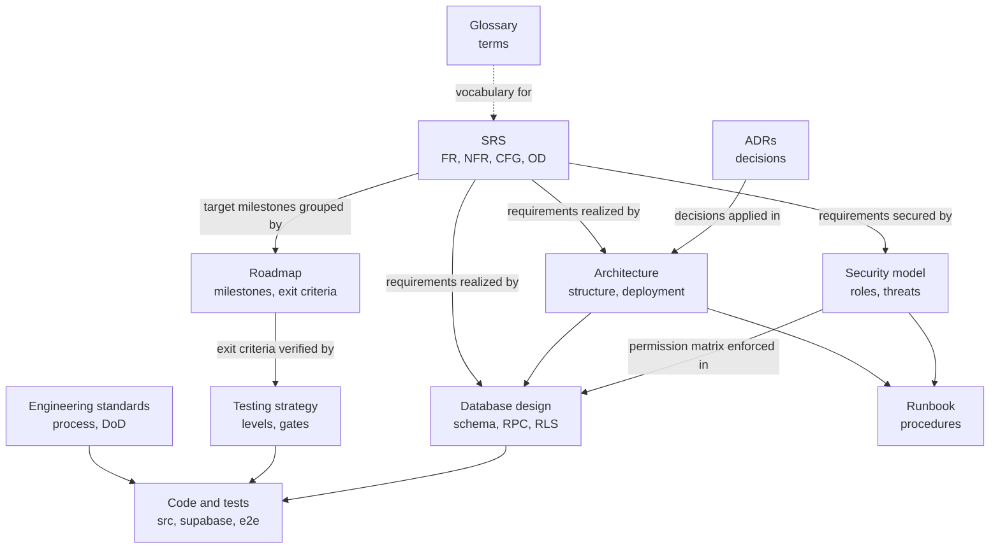

# PIMS Documentation

Index of the design, engineering and operations documentation of the Pharmacy Inventory Management
System (PIMS): what each document is for, which topics it owns, and the order in which a new engineer
should read them.

| Field          | Value                                                                     |
| -------------- | ------------------------------------------------------------------------- |
| Document ID    | PIMS-DOC-000                                                              |
| Version        | 1.0                                                                       |
| Status         | Draft for M0 review                                                       |
| Owner          | Engineering lead                                                          |
| Last updated   | 2026-10-06                                                                |
| Change control | Updated in the same pull request that adds, renames or removes a document |

## Contents

1. [Start here](#1-start-here)
2. [Document index](#2-document-index)
3. [Reading order for new engineers](#3-reading-order-for-new-engineers)
4. [Reading paths by role](#4-reading-paths-by-role)
5. [Single source of truth](#5-single-source-of-truth)
6. [Identifier registry](#6-identifier-registry)
7. [Documentation conventions](#7-documentation-conventions)
8. [Planned documents](#8-planned-documents)
9. [Open documentation issues](#9-open-documentation-issues)
10. [Revision history](#10-revision-history)

---

## 1. Start here

PIMS is a web-based, multi-branch and multi-tenant inventory, point-of-sale and loyalty system for retail
pharmacies in Bangladesh, built first for a pharmacy business in Mohammadpur, Dhaka. The project overview,
feature list, technology stack and current status are in the [repository README](../README.md).

The documentation is **docs-as-code**: Markdown files in this repository, reviewed in pull requests and
changed in the same pull request as the code they describe. Each topic has exactly one canonical document
(section 5); other documents summarize it in a sentence or two and link to it.

The project is in milestone **M0 Foundation**. Every document below is a draft for the M0 review; the SRS
becomes the requirements baseline when the Owner and the lead engineer approve it at the M0 exit
([roadmap](roadmap.md), M0-X2).

## 2. Document index

### 2.1 Overview and planning

| Document                          | ID           | What it gives you                                                                                                         |
| --------------------------------- | ------------ | ------------------------------------------------------------------------------------------------------------------------- |
| [Repository README](../README.md) | n/a          | Project overview, key features including loyalty and the AI roadmap, architecture summary, stack, layout and status       |
| [Documentation index](README.md)  | PIMS-DOC-000 | This page: what to read, in which order, and which document owns which topic                                              |
| [Glossary](glossary.md)           | PIMS-GLO-001 | Definitions of pharmacy terms (FEFO, MRP, base unit), Bangladesh terms (বাকি, bKash, DGDA) and technical terms (RLS, RPC) |
| [Roadmap](roadmap.md)             | PIMS-RMP-001 | Milestones M0 to M5 and Later, with deliverables, exit criteria, dependencies, the pilot and a dated timeline             |

### 2.2 Requirements

| Document                                                         | ID           | What it gives you                                                                                                                                                                                               |
| ---------------------------------------------------------------- | ------------ | --------------------------------------------------------------------------------------------------------------------------------------------------------------------------------------------------------------- |
| [Software requirements specification (SRS)](requirements/SRS.md) | PIMS-SRS-001 | What PIMS must do: business objectives, use cases, functional (`FR-*`) and non-functional (`NFR-*`) requirements with acceptance criteria, configuration parameters (`CFG-*`) and open Owner decisions (`OD-*`) |

### 2.3 Design

| Document                                                 | ID            | What it gives you                                                                                                                                                                                |
| -------------------------------------------------------- | ------------- | ------------------------------------------------------------------------------------------------------------------------------------------------------------------------------------------------ |
| [Architecture description](architecture/architecture.md) | PIMS-ARCH-001 | C4 context, container and component views; technology choices; runtime flows; environments and delivery pipeline; offline (M4) and AI (M5) designs; budgets and cost                             |
| [Database design](database/database-design.md)           | (none yet)    | Schemas, conventions, the full table and RPC catalog, core algorithms (FEFO, gapless numbering, idempotency, valuation), RLS strategy, migration policy and the deltas against the M1 migrations |
| [Security model](security/security-model.md)             | PIMS-SEC-001  | Assets, trust boundaries, STRIDE threat model, the canonical role and permission matrix, authentication, authorization, privacy, incident response and the ASVS target                           |
| [Architecture decision records](adr/README.md)           | PIMS-ADR-000  | The ADR process and the index of accepted decisions with their rationale and trade-offs                                                                                                          |

Accepted decisions at this version (status is maintained in the [ADR index](adr/README.md)):

| ADR                                                                        | Decision                                                                                  |
| -------------------------------------------------------------------------- | ----------------------------------------------------------------------------------------- |
| [ADR-0001](adr/0001-record-architecture-decisions.md)                      | Record architecture decisions as MADR documents in the repository                         |
| [ADR-0002](adr/0002-supabase-postgresql-over-firebase.md)                  | Use Supabase (managed PostgreSQL) as the backend platform                                 |
| [ADR-0003](adr/0003-react-vite-typescript-spa.md)                          | Build the client as a React, TypeScript and Vite single-page application                  |
| [ADR-0004](adr/0004-cloudflare-pages-hosting.md)                           | Host the web application on Cloudflare Pages                                              |
| [ADR-0005](adr/0005-money-as-integer-paisa.md)                             | Represent money as integer paisa and rates as integer basis points                        |
| [ADR-0006](adr/0006-multi-tenant-organization-branch-model-with-rls.md)    | Pooled multi-tenancy with an organization and branch model enforced by row level security |
| [ADR-0007](adr/0007-business-logic-in-transactional-postgres-functions.md) | Put business-critical writes in transactional PostgreSQL functions (RPC-first)            |
| [ADR-0008](adr/0008-append-only-inventory-ledger-with-fefo.md)             | Keep stock in an append-only ledger with batch projections and FEFO allocation            |

### 2.4 Engineering

| Document                                                      | ID            | What it gives you                                                                                                                                              |
| ------------------------------------------------------------- | ------------- | -------------------------------------------------------------------------------------------------------------------------------------------------------------- |
| [Engineering standards](engineering/engineering-standards.md) | PIMS-ENG-001  | Branching, Conventional Commits, pull requests, the review checklist, Definition of Ready and Done, TypeScript, React and SQL standards, releases and CI gates |
| [Testing strategy](engineering/testing-strategy.md)           | PIMS-TEST-001 | Test pyramid and tools, the RLS isolation matrix, RPC and concurrency tests, property-based money tests, end-to-end journeys, coverage and traceability        |
| [Contributing guide](../CONTRIBUTING.md)                      | n/a           | Local setup in about 30 minutes, seed accounts, scripts, day-to-day workflow and troubleshooting                                                               |

### 2.5 Operations and security

| Document                                    | ID           | What it gives you                                                                             |
| ------------------------------------------- | ------------ | --------------------------------------------------------------------------------------------- |
| [Operations runbook](operations/runbook.md) | PIMS-OPS-001 | Step-by-step procedures for deployment, migrations, backup, restore, monitoring and incidents |
| [Security policy](../SECURITY.md)           | n/a          | How to report a vulnerability privately, what to expect, and what is in scope                 |

## 3. Reading order for new engineers

Read in this order. The times are estimates for a careful first reading; skim where a section is marked
"skim".

**Day 1: the domain and the shape of the system (about 4 hours)**

| Step | Read                                                                                     | Time   | Why                                                                                         |
| ---- | ---------------------------------------------------------------------------------------- | ------ | ------------------------------------------------------------------------------------------- |
| 1    | [Repository README](../README.md)                                                        | 15 min | What PIMS is, who uses it, where the project stands                                         |
| 2    | [Glossary](glossary.md), sections 1 to 5                                                 | 30 min | Base unit, lot, FEFO, MRP, বাকি, paisa and fiscal year are used on every page               |
| 3    | [SRS](requirements/SRS.md), sections 1 and 2; skim the module headings of 3.3            | 45 min | Business objectives, users, constraints C-01 to C-16 and assumptions                        |
| 4    | [Architecture](architecture/architecture.md), sections 2 to 5 and 10.3 to 10.5           | 45 min | System context, containers, trust boundaries, "reads through PostgREST, writes through RPC" |
| 5    | ADR-0002, ADR-0005, ADR-0006, ADR-0007 and ADR-0008 ([index](adr/README.md))             | 45 min | The five decisions that shape every line of code                                            |
| 6    | [CONTRIBUTING.md](../CONTRIBUTING.md), sections 1 to 5, and set up the local environment | 60 min | A running stack with `pnpm check` and `pnpm test:db` green                                  |

**Week 1: how we build (about 8 hours, spread over the week)**

| Step | Read                                                                                  | Why                                                                                           |
| ---- | ------------------------------------------------------------------------------------- | --------------------------------------------------------------------------------------------- |
| 7    | [Engineering standards](engineering/engineering-standards.md), sections 3 to 7 and 12 | Branching, commits, pull requests, review, Definition of Done; money, quantity and time rules |
| 8    | [Testing strategy](engineering/testing-strategy.md), sections 2 to 7                  | What to test at which level, the RLS matrix and RPC test requirements                         |
| 9    | [Database design](database/database-design.md), sections 2 to 4, 9 and 10             | Conventions, schemas and privileges, core algorithms and the RLS strategy                     |
| 10   | [Security model](security/security-model.md), sections 2, 6 and 8                     | Security principles, roles and permissions, authorization layers                              |
| 11   | [Roadmap](roadmap.md), the current milestone in section 5                             | What is being built now and how "done" is judged                                              |
| 12   | The SRS module and the database design section for the first issue you take           | The requirement IDs and the exact tables and functions you will touch                         |

**Before your first production deployment or on-call shift:** the [runbook](operations/runbook.md) and
[security model section 17](security/security-model.md#17-incident-response-summary) (incident response).

## 4. Reading paths by role

| Role                            | Read first                                                                                              | Then                                                                                               |
| ------------------------------- | ------------------------------------------------------------------------------------------------------- | -------------------------------------------------------------------------------------------------- |
| Frontend engineer               | Architecture 9 (frontend), 11 (runtime flows), 15 (offline); engineering standards 8 to 10, 14 and 15   | SRS 3.1.1 (user interfaces), 3.3.6 (POS) and Appendix C (keyboard map); testing strategy 4.3 and 9 |
| Database or backend engineer    | Database design 3 to 4, 8 to 11 and 18; ADR-0006 to ADR-0008                                            | Security model 6 and 8; testing strategy 5 to 7                                                    |
| Security reviewer               | Security model (whole); architecture 5.3, 10.5 and 10.6                                                 | Database design 4 and 10; [SECURITY.md](../SECURITY.md)                                            |
| Tester                          | SRS 3.3 and 4; testing strategy (whole)                                                                 | Glossary; roadmap exit criteria of the current milestone                                           |
| Operations and on-call          | Runbook; architecture 14, 17 and 20                                                                     | Security model 16 and 17; database design 17 (scheduled jobs and integrity checks)                 |
| Owner and product decisions     | Repository README; SRS 1, 2, 3.3.8 (loyalty), 3.3.16 (controlled drugs), Appendix A and B; roadmap 3, 7 | Architecture 20 (cost model); ADR index                                                            |
| Future auditor or SaaS customer | SRS 2, 3.3.11, 3.3.12, 3.4.5 and 3.4.11; security model 3, 13 and 14                                    | Database design 15 (retention)                                                                     |

## 5. Single source of truth

Each topic below is defined in exactly one document. Other documents may summarize it but must link to the
canonical document, and when they disagree the canonical document wins and the other is corrected in a
pull request.

| Topic                                                             | Canonical document                                            |
| ----------------------------------------------------------------- | ------------------------------------------------------------- |
| Definitions of terms                                              | [Glossary](glossary.md)                                       |
| Requirement IDs, priorities, acceptance criteria, `CFG-*`, `OD-*` | [SRS](requirements/SRS.md)                                    |
| Milestones, deliverables, exit criteria, dates                    | [Roadmap](roadmap.md)                                         |
| System structure, environments, delivery pipeline, budgets, cost  | [Architecture](architecture/architecture.md)                  |
| Tables, columns, constraints, functions, error codes, migrations  | [Database design](database/database-design.md)                |
| Roles, permission matrix, threat model, security controls         | [Security model](security/security-model.md)                  |
| Decisions and their rationale                                     | [ADRs](adr/README.md)                                         |
| Coding, review, branching and release rules; Definition of Done   | [Engineering standards](engineering/engineering-standards.md) |
| Test levels, coverage targets, CI test gates                      | [Testing strategy](engineering/testing-strategy.md)           |
| Operational procedures                                            | [Runbook](operations/runbook.md)                              |
| Vulnerability reporting                                           | [SECURITY.md](../SECURITY.md)                                 |

How the documents depend on each other:

## 6. Identifier registry

Identifiers are permanent and are cited across documents. To avoid ambiguity, cite an identifier together
with its document when the prefix is shared (see the notes).

| Prefix                                                             | Meaning                                                                                                                                      | Defined in                                   |
| ------------------------------------------------------------------ | -------------------------------------------------------------------------------------------------------------------------------------------- | -------------------------------------------- |
| `PIMS-<DOC>-NNN`                                                   | Document ID                                                                                                                                  | Header of each document                      |
| `FR-<MODULE>-NNN`, `NFR-<CATEGORY>-NNN`                            | Functional and non-functional requirements                                                                                                   | SRS 3.3, 3.4                                 |
| `IF-*`, `UC-NN`, `LDB-NN`, `OE-NN`                                 | Interface requirements, use cases, logical database requirements, operating environment                                                      | SRS 3.1, 3.2, 3.5, 2.5                       |
| `BO-NN`, `C-NN`, `A-NN`, `RK-NN`                                   | Business objectives, constraints, assumptions, requirement-level risks                                                                       | SRS 1.2, 2.6, 2.7, 2.8                       |
| `OD-NN`, `CFG-NN`                                                  | Open Owner decisions, configuration parameters                                                                                               | SRS Appendix B and 3.3.8.8, Appendix A       |
| `D-NN`                                                             | **Shared prefix:** dependencies in the SRS (D-01 to D-08); implementation deltas in the database design (D-01 to D-28)                       | SRS 2.7; database design 21                  |
| `R1` to `R7`                                                       | Loyalty abuse rules                                                                                                                          | SRS 3.3.8.6                                  |
| `R-NN`, `R-N`                                                      | **Shared prefix:** architecture risks (R-01 to R-10); database rounding rules (R-1 to R-5)                                                   | Architecture 22.1; database design 3.7       |
| `ADR-NNNN`, `F-N`                                                  | Architecture decision records and their follow-up actions                                                                                    | [ADR index](adr/README.md)                   |
| `OI-NN`, `QAS-NN`, `TB-N`                                          | Architecture open issues, quality attribute scenarios, trust boundaries                                                                      | Architecture 22.3, 21, 5.3                   |
| `DB-OI-NN`                                                         | Database design open issues                                                                                                                  | Database design 22                           |
| `P-NN`, `PD-NN`, `SEC-TC-NN`, `SEC-GAP-NN`, `DEV-NN`, `SEV-N`      | Permission matrix rows, personal-data items, security test cases, security gaps, ASVS deviations, incident severities                        | Security model 6.3, 3.4, 8.6, 22, 20.3, 17.1 |
| `ENG-NN`                                                           | Engineering standards open issues                                                                                                            | Engineering standards 25                     |
| `TST-NN`                                                           | Testing strategy open issues                                                                                                                 | Testing strategy 19                          |
| `Mn-Dk`, `Mn-Xk`, `PL-En`, `PA-NN`, `RD-NN`, `RMP-NN`, `RMP-OI-NN` | Milestone deliverables and exit criteria, pilot entry criteria, planning assumptions, roadmap decisions, schedule risks, roadmap open issues | [Roadmap](roadmap.md)                        |
| `DOC-OI-NN`                                                        | Documentation open issues                                                                                                                    | This page, section 9                         |

## 7. Documentation conventions

| Topic              | Convention                                                                                                                                                                                   |
| ------------------ | -------------------------------------------------------------------------------------------------------------------------------------------------------------------------------------------- |
| Format             | GitHub-flavored Markdown, formatted by Prettier (`pnpm format:check` in CI covers `docs/`). File names in kebab-case; ADRs as `NNNN-short-title.md`.                                         |
| Header and history | Each document starts with a field table (document ID, version, status, owner, approver, last updated) and ends with a revision history.                                                      |
| Status lifecycle   | Draft, then In review, then Approved (for the SRS: Baselined), then Superseded. A superseded document links to its successor.                                                                |
| Language           | Clear professional English. Bangla terms in parentheses with a romanized spelling, for example due (বাকি, _baki_). No emojis.                                                                |
| Normative words    | "shall", "should" and "may" as defined in SRS 1.5 (RFC 2119 and RFC 8174).                                                                                                                   |
| Units and formats  | Dates ISO 8601 (2026-10-06); times Asia/Dhaka unless marked UTC; amounts as ৳1,234.50 with storage in integer paisa; quantities in base units.                                               |
| Diagrams           | Mermaid, so that diagrams render on GitHub and are reviewed as text. C4 views are drawn as flowcharts with the legend of architecture 1.4. A diagram must parse without errors before merge. |
| Links              | Relative links between documents, with section anchors where useful. Link instead of copying; one or two sentences of summary are allowed.                                                   |
| Code identifiers   | In `monospace`; the database design is authoritative for database names, the security model for permission keys.                                                                             |
| Volatile facts     | Vendor prices and free-tier limits are dated ("as checked in October 2026") so the next reviewer can re-verify them.                                                                         |
| Same-change rule   | A change to behaviour, schema, permissions or process updates the canonical document in the same pull request (Definition of Done, engineering standards 7.2).                               |

## 8. Planned documents

| Document                                             | Purpose                                                                                     | Milestone | Reference                     |
| ---------------------------------------------------- | ------------------------------------------------------------------------------------------- | --------- | ----------------------------- |
| `CHANGELOG.md` (repository root)                     | Release history following Keep a Changelog                                                  | M0        | ENG-02                        |
| POS UX specification                                 | Wireframes and the final POS keyboard map                                                   | M2        | Roadmap M2-D4; SRS Appendix C |
| Data import templates and pilot quick guide (Bangla) | Templates for catalog, opening stock and dues; a counter guide for the pilot                | M2        | Roadmap M2-D12                |
| Privacy notice (English and Bangla)                  | Data collected, purposes, retention, hosting location and AI processing                     | M4        | NFR-PRIV-009                  |
| User manual (English and Bangla)                     | Task-based guide for Owner, Branch Manager and Salesman, with counter quick-reference cards | M4        | Roadmap M4-D7                 |
| AI ADRs and evaluation reports                       | AI gateway, provider data terms, evaluation thresholds and results                          | M5        | Roadmap M5-D1, M5-D3          |

## 9. Open documentation issues

| ID        | Issue                                                                                                                                                                                                                                                        | Owner            | Needed by |
| --------- | ------------------------------------------------------------------------------------------------------------------------------------------------------------------------------------------------------------------------------------------------------------ | ---------------- | --------- |
| DOC-OI-01 | Prefix `D-NN` is used for SRS dependencies and for database design deltas, and `R-NN` for architecture risks and database rounding rules. Rename one of each pair (for example deltas to `DD-NN`, rounding rules to `RND-N`) before more documents cite them | Engineering lead | M1        |
| DOC-OI-02 | The database design has no document ID; assign `PIMS-DB-001`                                                                                                                                                                                                 | Engineering lead | M0 exit   |
| DOC-OI-03 | Add a documentation check to CI: relative-link and anchor validation and Mermaid parsing for `docs/**/*.md` and the root Markdown files                                                                                                                      | Engineering lead | M1        |
| DOC-OI-04 | Closed 2026-10-06: the runbook is published as `PIMS-OPS-001` and listed in section 2.5                                                                                                                                                                      | Engineering lead | M0 exit   |

## 10. Revision history

| Version | Date       | Author           | Change                                                                                |
| ------- | ---------- | ---------------- | ------------------------------------------------------------------------------------- |
| 1.0     | 2026-10-06 | Engineering lead | First documentation index: document map, reading order, canonical owners, identifiers |
