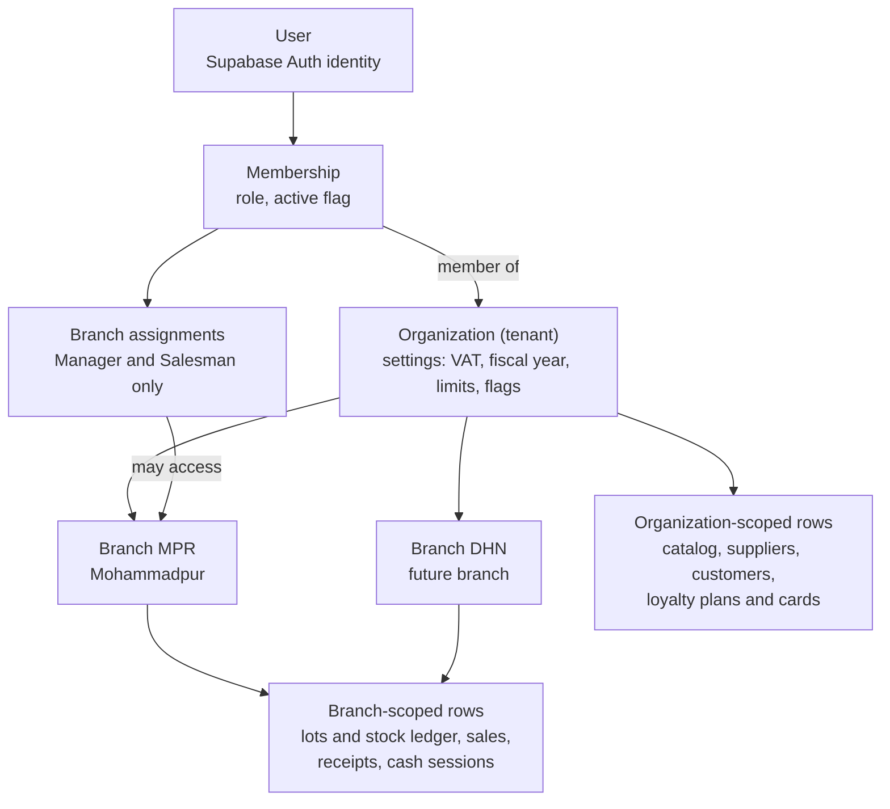

# ADR-0006: Pooled multi-tenancy with an organization and branch model enforced by row level security

## Context and Problem Statement

PIMS starts with one pharmacy business and one shop (Mohammadpur, branch code `MPR`). The owner plans an
unknown number of further branches and may later sell the software to other pharmacies as a service.
The data model therefore has to support two levels of separation from day one:

- **Between businesses (tenants).** Pharmacy A must never see, change or reference Pharmacy B's data,
  whatever request a signed-in user crafts against the public API (NFR-SEC-003, NFR-SCAL-002).
- **Between branches of one business.** A Salesman at Mohammadpur sells only from Mohammadpur stock and
  sees only Mohammadpur documents; a Branch Manager sees the branches assigned to them; the Owner,
  Accountant and Auditor see every branch. At the same time much data is shared across branches: the
  medicine catalog, suppliers, customers and their dues, loyalty plans and cards (a card works in every
  branch), and stock transfers move goods between branches.

Further forces:

- The browser talks to PostgREST directly ([ADR-0002](0002-supabase-postgresql-over-firebase.md)), and
  the API URL and publishable key are in the public bundle. Isolation must therefore be enforced by the
  database for every table and every access path, not by the client.
- Role changes and deactivations must take effect on the user's next request (FR-IAM-010), and Owner and
  Branch Manager access requires a TOTP-verified session (AAL2) enforced in the database (FR-IAM-005,
  NFR-SEC-004).
- Opening a branch must take configuration only, within 30 minutes (NFR-SCAL-001); onboarding another
  pharmacy must need no schema change (NFR-SCAL-002).
- Cost: the Supabase Free plan allows two active projects, and each additional project on Pro adds its
  own compute charge (about USD 10 per month for the smallest instance at the time of writing).

The question: **how are tenants and branches modelled and isolated in the database, and where does the
authorization context come from?**

## Decision Drivers

1. Strong isolation that holds for every access path, including bugs in our own functions.
2. A new branch or a new organization is data, not a deployment or a schema change.
3. Organization-wide sharing (catalog, customers, loyalty) and inter-branch operations remain simple
   queries.
4. Immediate revocation of access after a role change or deactivation.
5. Operational simplicity: one migration path, one backup, one set of tests.
6. Cost at one tenant today and at tens of tenants later.
7. Performance: policies must not push POS search above 200 ms p95 (NFR-PERF-001).

## Considered Options

Tenancy model:

1. **Silo:** one Supabase project (database) per pharmacy organization.
2. **Bridge:** one database with one PostgreSQL schema per organization.
3. **Pool:** one shared schema, an `organization_id` on every tenant-owned row, and row level security
   (RLS).

Branch model:

- A. Each branch as an independent tenant.
- B. Organization owns branches; branch-scoped rows carry both `organization_id` and `branch_id`.

Source of the authorization context:

- i. Organization IDs, roles and branches as custom claims in the JWT (Supabase custom access token hook).
- ii. Look-ups of the `memberships` and `branch_assignments` tables on every request through
  `SECURITY DEFINER` helper functions.

## Decision Outcome

Chosen options: **pool (3), organization owns branches (B), and membership look-ups (ii)**, because
together they make isolation a property of the database that holds for every request (driver 1), turn new
branches and tenants into inserted rows (drivers 2 and 5), keep shared data and transfers simple
(driver 3), and revoke access on the very next request (driver 4), at no extra infrastructure cost
(driver 6).

The model ([architecture section 12](../architecture/architecture.md#12-multi-tenancy-model) describes
it; the [database design](../database/database-design.md#33-tenant-and-branch-columns) is canonical for
columns and tables):

Rules:

| Rule                   | Implementation                                                                                                                                                                                                                                                                                     |
| ---------------------- | -------------------------------------------------------------------------------------------------------------------------------------------------------------------------------------------------------------------------------------------------------------------------------------------------- |
| Tenant column          | Every tenant-owned row has `organization_id uuid NOT NULL`; every branch-scoped row, including child and allocation rows, also has `branch_id uuid NOT NULL`, so a policy never needs a join. Both are immutable after insert (guard triggers).                                                    |
| Tenant-safe references | Every tenant table declares `UNIQUE (organization_id, id)`; children reference parents with composite foreign keys `(organization_id, <parent>_id)`. A row can never point at another tenant's row, even from privileged code (NFR-REL-008).                                                       |
| RLS everywhere         | RLS is enabled on every table in every exposed schema; `anon` has no privileges on business data; a table without a policy returns nothing.                                                                                                                                                        |
| Policy helpers         | Policies call helpers in the private `app` schema: `app.user_org_ids()`, `app.user_branch_ids()`, `app.has_branch_access(branch_id)`, `app.has_permission(organization_id, permission)` and `app.can(branch_id, permission)`. Helpers are `STABLE`, `SECURITY DEFINER` and `SET search_path = ''`. |
| Policy shape           | Set-returning helpers are wrapped in a sub-select, for example `branch_id in (select app.user_branch_ids())`, so PostgreSQL evaluates them once per statement rather than once per row; every `organization_id` and `branch_id` column is indexed.                                                 |
| Branch scope by role   | Owner, Accountant and Auditor reach every active branch; Branch Manager and Salesman reach only branches in `branch_assignments`. The role and permission matrix is canonical in the [security model](../security/security-model.md#63-permission-matrix).                                         |
| Authorization source   | Helpers read `memberships` and `branch_assignments` for `auth.uid()` on each request; no organization, role or branch is trusted from JWT claims. Only `aal` (MFA level) and the user ID come from the token.                                                                                      |
| MFA                    | Permission helpers refuse every permission of an MFA-required role without an `aal2` session while the organization enforces MFA (default on). The security model makes Owner, Branch Manager, Accountant and Auditor MFA-required; the M1 code covers Owner and Manager (delta D-01).             |
| RPC checks             | `SECURITY DEFINER` functions bypass RLS, so each one starts with `app.require_branch_permission(...)` or `app.require_permission(...)` and checks that every ID it receives belongs to the caller's organization ([ADR-0007](0007-business-logic-in-transactional-postgres-functions.md)).         |
| Uniqueness             | Business keys are unique per organization (customer phone, loyalty card number, barcode, SKU) or per branch and fiscal year (invoice number), never globally.                                                                                                                                      |
| Lifecycle              | Branches and organizations are deactivated, never deleted; a branch code cannot change once used in document numbers.                                                                                                                                                                              |
| Storage                | Object paths start with the organization ID (and branch ID where relevant) and storage policies check them.                                                                                                                                                                                        |

### Consequences

- Good, because isolation is enforced in one place for PostgREST reads, RPC calls, Storage and any future
  client (mobile app, e-commerce, AI views), and composite foreign keys add a structural second layer
  that does not depend on policies being correct.
- Good, because a new branch is a call to `create_branch` and a new organization a call to
  `create_organization`; one migration upgrades every tenant at once.
- Good, because organization-wide features (one catalog, customers and loyalty cards valid in every
  branch, consolidated Owner reports, inter-branch transfers) are ordinary queries within one schema.
- Good, because deactivating a user or changing a role is effective on the next request (under one
  minute, architecture QAS-06), instead of after the JWT expires (3,600 seconds in the current
  configuration).
- Good, because every row carries `organization_id`, a large tenant can later be moved to its own
  Supabase project (silo) without schema changes, and a tenant's data can be exported with simple
  filters.
- Bad, because all tenants share one database: a defect in one policy or one `SECURITY DEFINER` function
  could expose data across tenants (risk R-01). The layered defences above and the isolation test suite
  are mandatory, not optional.
- Bad, because each statement performs membership look-ups; with indexes on `memberships (user_id)` and
  the sub-select pattern the cost is a few index probes per statement, but it must be verified in the M4
  load test.
- Bad, because in a SaaS future one tenant's heavy reports could slow others ("noisy neighbour");
  per-organization rate limits, summary tables and a read replica are the planned mitigations
  ([architecture section 19](../architecture/architecture.md#19-scalability-path)).
- Bad, because composite keys make every foreign key two columns wide and every child table repeat
  `organization_id` and `branch_id`, which costs some storage and typing.
- Neutral, because a user can belong to several organizations; the client shows an organization switcher
  only when needed and scopes every query key by organization and branch.

### Confirmation

- `supabase/tests/database/001_platform_guards.test.sql` fails if any table in `public` lacks RLS, if a
  `SECURITY DEFINER` function does not pin `search_path`, or if `anon` can write to any table.
- `supabase/tests/database/010_tenancy.test.sql` and the full isolation suite specified in
  [security model 8.6](../security/security-model.md#86-tenant-and-branch-isolation-tests) (two
  organizations, several branches, every role, `aal1` variants, a deactivated member) run on every pull
  request; any cross-tenant or cross-branch row blocks the merge.
- The nightly integrity check IC-10 verifies that every child row has the same `organization_id` as its
  parent ([database design 17.2](../database/database-design.md#172-integrity-checks)).
- Code review checklist: every new table declares its scope, tenant columns, composite foreign keys,
  indexes, RLS policies and isolation tests in the same pull request.
- Known gap: the read helpers `app.user_org_ids()` and `app.user_branch_ids()` do not yet check the MFA
  level, so an Owner or Manager with an `aal1` session can read branch data (architecture open issue
  OI-08, database design delta D-01). The fix and its tests are required before M2 delivers sign-in.
- Review triggers: a tenant whose data or load exceeds about 20 percent of the shared database; a
  contractual or legal demand for physical separation of a tenant's data; or more than 100 organizations,
  at which point schema-level controls and per-tenant quotas are reassessed.

## Pros and Cons of the Options

### Silo: one project per organization

- Good, because isolation is physical; a policy bug cannot leak data between tenants, and per-tenant
  backup, restore and hosting location are trivial.
- Bad, because every new tenant needs a new project, secrets, deployment configuration and a separate
  frontend build or runtime routing, which contradicts "onboarding without schema or deployment change".
- Bad, because cost grows linearly (about USD 10 per month of compute per additional project on Pro), and
  the Free plan allows only two active projects.
- Bad, because every migration must be applied and verified N times, and cross-tenant operations (SaaS
  billing, platform statistics) need a separate control plane.
- Bad, because it solves only tenant isolation; branch-level isolation inside each project still needs
  RLS.

### Bridge: one schema per organization

- Good, because tenant data is separated by namespace and can be dumped per schema.
- Bad, because PostgREST exposes only configured schemas: each new tenant requires a configuration change
  and reload, and the client must select the schema per request.
- Bad, because migrations must loop over all schemas, and hundreds of schemas with about 70 tables each
  bloat the system catalog and slow tooling.
- Bad, because branch isolation within a tenant still requires RLS, so the policy work is not avoided.

### Pool: shared schema with `organization_id` and RLS (chosen)

- Good, because it is the simplest model to operate and the cheapest at every scale considered.
- Good, because Supabase is designed around it: `auth.uid()` and RLS are first-class.
- Bad, because correctness depends on disciplined policies, functions and tests, which this ADR makes
  mandatory.

### Branch as tenant (A)

- Bad, because the catalog, customers, dues and loyalty cards would be duplicated per branch or need
  cross-tenant sharing, and transfers and consolidated reports would cross tenant boundaries by design.

### Organization owns branches (B, chosen)

- Good, because it matches the business: one owner, one catalog and one customer base, many shops.

### Authorization context in JWT claims (i)

- Good, because policies avoid table look-ups and are slightly faster.
- Bad, because claims stay valid until the token expires, so a dismissed Salesman keeps access for up to
  an hour, and branch lists in the token grow with every branch.
- Bad, because a bug in the claims hook would grant access everywhere at once.

### Membership look-ups (ii, chosen)

- Good, because the database state is the single source of truth and changes apply on the next request.
- Bad, because of the per-statement look-up cost discussed above.

## More Information

- [Architecture description](../architecture/architecture.md): sections 10.5 (row level security) and 12
  (multi-tenancy model)
- [Database design](../database/database-design.md): sections 3.2 (keys), 3.3 (tenant and branch
  columns), 10 (row level security strategy) and 17.2 (integrity checks)
- [Security model](../security/security-model.md): sections 6 (roles and permissions, canonical), 8.2
  (RLS rules), 8.3 (`SECURITY DEFINER` rules) and 8.6 (isolation tests)
- [SRS](../requirements/SRS.md): C-03, FR-IAM-005, FR-IAM-010, NFR-SEC-002, NFR-SEC-003, NFR-SEC-004,
  NFR-REL-008, NFR-SCAL-001, NFR-SCAL-002
- Code: `supabase/migrations/20261006120100_tenancy_and_access.sql`
- Related decisions: [ADR-0002](0002-supabase-postgresql-over-firebase.md),
  [ADR-0007](0007-business-logic-in-transactional-postgres-functions.md)
