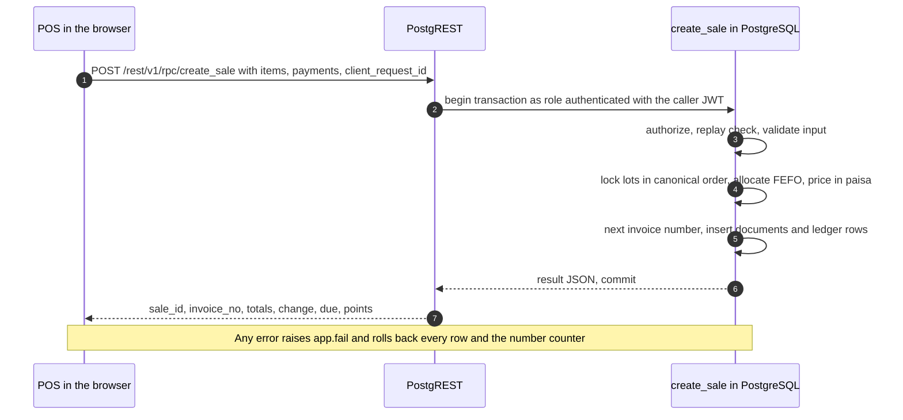

# ADR-0007: Put business-critical writes in transactional PostgreSQL functions (RPC-first)

## Context and Problem Statement

With Supabase ([ADR-0002](0002-supabase-postgresql-over-firebase.md)) the browser can read and write
tables directly through PostgREST, protected by row level security
([ADR-0006](0006-multi-tenant-organization-branch-model-with-rls.md)). That is convenient for simple
records, but PIMS's important operations are multi-table, concurrent and money-sensitive.

A single sale in the M1 implementation (`create_sale`) does all of the following, and all of it must
happen or none of it (NFR-REL-001):

1. checks the caller's branch access, permission, role discount limit and MFA level;
2. replays the original result if the same request was already committed (idempotency);
3. locks the sellable lots of each medicine and allocates quantities first-expiry-first-out
   ([ADR-0008](0008-append-only-inventory-ledger-with-fefo.md));
4. prices every allocation from the lot's sale price, never above MRP, applies line, invoice and loyalty
   discounts, VAT and optional cash rounding in integer paisa ([ADR-0005](0005-money-as-integer-paisa.md));
5. validates split payments, the customer's credit limit and loyalty points;
6. takes the next gapless invoice number for the branch and fiscal year;
7. writes rows in up to 12 tables: `sales`, `sale_items`, `sale_item_batches`, `sale_payments`,
   `inventory_movements`, `batches` (on-hand projection), `prescriptions`, `controlled_drug_register`,
   `customer_ledger_entries`, `loyalty_point_ledger`, `daily_branch_sales` and the document counter.

The client cannot be trusted with any of this. The API URL and publishable key are in the public bundle,
so anyone with a valid Salesman login can send hand-crafted requests: a zero price, a 90 percent
discount, a sale from another branch's stock, or a second sale with the same invoice number. Prices and
totals must therefore be computed by the server from database data (C-02, NFR-MAINT-003,
NFR-SEC-008).

Concurrency and the network add constraints: up to four terminals per branch sell at the same time, the
last strip of a medicine must not be sold twice (NFR-REL-002), and each request from Dhaka to Singapore
costs roughly 50 to 120 ms (SRS OE-05) against a sale budget of 500 ms p95 server time (NFR-PERF-002).

The question: **where does business logic for writes run, and how are prices and totals made
authoritative?**

## Decision Drivers

1. Atomicity of multi-table operations, with rollback of everything (including number counters) on any
   error.
2. Integrity under concurrency: no overselling, no deadlocks, gapless numbering.
3. Server authority for prices, discounts, limits and totals; one source of truth for business rules.
4. A single authorization choke point per operation, consistent with RLS.
5. Latency: one network round trip per business action.
6. Testability of every rule, including permission denials and concurrency.
7. Safe retries over unreliable shop internet and, from M4, replay of offline sales.
8. Maintainability by a small team.

## Considered Options

1. **Client-side orchestration:** the browser inserts and updates tables through PostgREST under RLS, with
   triggers deriving secondary effects.
2. **Edge-only API:** Supabase Edge Functions (Deno, TypeScript) implement the operations, either through
   several `supabase-js` calls or through a direct PostgreSQL connection with explicit transactions.
3. **RPC-first:** each business-critical write is one PL/pgSQL function, called through PostgREST's
   `/rpc/` endpoint, running in a single transaction; reads use PostgREST and read-only functions under
   RLS.
4. **Separate application server** (Node.js or Django) holding the business logic; rejected at platform
   level in ADR-0002 and not evaluated further here.

## Decision Outcome

Chosen option: **"RPC-first"**, because a PostgreSQL function executed by PostgREST runs in exactly one
transaction next to the data (drivers 1 and 2), can lock rows in a deterministic order and rely on
constraints as a final guard, computes prices from data the client cannot alter (driver 3), performs the
whole operation in one HTTP request (driver 5), and is testable with pgTAP inside the same database
(driver 6). Each function is also the single place where the operation is authorized (driver 4), and a
stored idempotency key makes a retried or replayed request return the original result instead of a
second sale (driver 7).

Rules (conventions are specified in
[architecture 10.3 and 10.4](../architecture/architecture.md#104-rpc-design-conventions) and the
[database design 8.1](../database/database-design.md#81-conventions), which are canonical):

| Topic               | Rule                                                                                                                                                                                                                                                                                                                                                                                                                                     |
| ------------------- | ---------------------------------------------------------------------------------------------------------------------------------------------------------------------------------------------------------------------------------------------------------------------------------------------------------------------------------------------------------------------------------------------------------------------------------------- |
| Write tiers         | **Tier 1** (stock, sales, returns, purchases, payments, transfers, cash, loyalty usage, dues): writes only through RPC; `authenticated` has no `INSERT`, `UPDATE` or `DELETE` privilege. **Tier 2** (master data such as medicines, suppliers, customer profiles, plans, settings): PostgREST DML under RLS `WITH CHECK` and column grants, or RPC when validation spans rows. **Tier 3** (ledgers, audit log): no client writes at all. |
| Client input        | The client sends identifiers, quantities, requested discounts, tenders and a `client_request_id`. It never sends a price, line total, invoice total, cost, VAT, invoice number or point balance that the server would store.                                                                                                                                                                                                             |
| Server-side pricing | All amounts are computed inside the function from lots, settings, role limits and loyalty membership terms. A client may pass `p_expected_total_paisa`; when it differs from the computed total the function raises `price_changed` and the cashier confirms the new total (database design 8.6).                                                                                                                                        |
| Previews            | The browser shows instant totals with `src/domain/money.ts`; from M2 the read-only `preview_sale` RPC uses the same pricing code as `create_sale`, so the confirmed total equals the committed total.                                                                                                                                                                                                                                    |
| Security            | Functions are `SECURITY DEFINER` with `SET search_path = ''` and schema-qualified names; `EXECUTE` is revoked from `PUBLIC` and `anon`. Because RLS is bypassed, the first statement is `app.require_branch_permission(...)` or `app.require_permission(...)`, and every received ID is checked against the caller's organization.                                                                                                       |
| Concurrency         | `READ COMMITTED` with explicit row locks in one canonical order and a two-phase rule (locks first, writes after); `lock_timeout` of 3 seconds; deadlock or timeout surfaces as `busy_retry` ([database design 9.3](../database/database-design.md#93-locking-strategy-and-canonical-lock-order)).                                                                                                                                        |
| Numbering           | Document numbers come from a counter row incremented inside the transaction, as late as possible, so a rollback leaves no gap ([database design 9.4](../database/database-design.md#94-gapless-document-numbering)).                                                                                                                                                                                                                     |
| Idempotency         | Document-creating functions take `p_client_request_id uuid`, unique per organization; a retry with the same key returns the original result with `replayed = true` ([database design 9.5](../database/database-design.md#95-idempotency)).                                                                                                                                                                                               |
| Errors              | Business errors are raised with `app.fail(code, message, hint)`: SQLSTATE `P0001`, stable code in `DETAIL`, translated by the client (database design 8.2). SQL internals are never exposed.                                                                                                                                                                                                                                             |
| No external calls   | Functions never call HTTP services, send SMS or call AI inside a transaction. Edge Functions handle work that needs secrets or external services, and when they change business data they call the same RPCs with the user's JWT.                                                                                                                                                                                                        |
| Signatures          | Public RPCs are not overloaded (PostgREST resolves functions by name and named arguments). Changes follow expand, migrate, contract: add parameters with defaults, or add a new function and retire the old one after the client has moved.                                                                                                                                                                                              |

Implemented and planned functions (the [database design 8.5](../database/database-design.md#85-public-rpc-summary)
is the authoritative catalog): M1 implements `create_sale`, `void_sale`, `process_sale_return`,
`receive_goods`, `process_purchase_return`, `adjust_stock`, `add_opening_stock`, `set_batch_price`,
`record_customer_payment`, `record_supplier_payment`, `enroll_loyalty`, `create_organization`,
`create_branch`, `add_member` and `update_member`; stock transfers (`request_stock_transfer`,
`dispatch_stock_transfer`, `receive_stock_transfer` and related functions) and cash sessions follow in
M3. The SRS and the architecture use the canonical names of
[database design 8.5](../database/database-design.md#85-public-rpc-summary) (architecture OI-01 and
database design DB-OI-01, both closed).

### Consequences

- Good, because a sale, return, receipt or adjustment is all-or-nothing, including the invoice counter,
  stock projection, ledgers and daily summary.
- Good, because price manipulation from the client is impossible: a crafted request can only ask for a
  discount, which the database checks against the role limit.
- Good, because every business action costs one round trip from Dhaka, which keeps the 500 ms p95 sale
  budget achievable even at 120 ms network latency.
- Good, because the same functions serve every client: the web POS, the offline replay queue in M4, a
  future mobile app or e-commerce channel, and Edge Functions.
- Good, because pgTAP can test each function's happy path, every error code, denial for every role,
  cross-tenant denial and concurrent execution in the real database.
- Bad, because PL/pgSQL is less expressive than TypeScript, has weaker debugging tools and fewer
  developers who know it well; long functions (`create_sale` is several hundred lines in M1) must be
  split into internal `app.*` helpers such as `app.post_movement` and, per the design, `app.price_sale`
  and `app.allocate_fefo`.
- Bad, because pricing logic exists twice (SQL is authoritative, TypeScript previews); drift is controlled
  by shared test vectors (NFR-REL-011) and the `preview_sale` RPC, but it remains a maintenance cost.
- Bad, because `SECURITY DEFINER` bypasses RLS: a function that forgets its permission or ownership check
  is a vulnerability (risk R-01). Platform guard tests and per-function denial tests are mandatory.
- Bad, because the database does all business computation, so database CPU is the scaling limit; compute
  upgrades, summary tables and a read replica for reports are the planned levers
  ([architecture section 19](../architecture/architecture.md#19-scalability-path)).
- Bad, because changing a function signature needs a migration and coordination with the deployed client;
  expand, migrate, contract keeps old clients working during a release.

### Confirmation

- CI job "Database lint and pgTAP tests" runs `supabase db lint` (plpgsql_check) at warning level and
  `supabase test db` on every pull request.
- `001_platform_guards.test.sql` asserts that every `SECURITY DEFINER` function pins `search_path`;
  it is extended in M1 to assert that `authenticated` holds no `INSERT`, `UPDATE` or `DELETE` privilege on
  any Tier 1 or Tier 3 table and that no function is executable by `PUBLIC` or `anon`.
- Every public RPC has pgTAP tests for the happy path, each error code, denial per role and cross-tenant
  denial (100 percent of RPC functions, NFR-MAINT-002); `020_purchase_to_sale_flow.test.sql` is the
  current end-to-end example.
- A concurrency test with 20 parallel sessions selling the same lot ends with exactly the available
  quantity sold and no negative stock (NFR-REL-002); fault-injection tests confirm atomicity
  (NFR-REL-001).
- The M4 load test confirms `create_sale` under 500 ms p95 and 1 s p99 for invoices of up to 10 lines
  (NFR-PERF-002).
- The review checklist requires the RPC template (authorization first, ID ownership checks, idempotency,
  lock order, error codes, tests) for every new write function.
- Review triggers: a business operation that must call an external service atomically (for example an
  online payment capture), sustained database CPU above 70 percent at peak after compute upgrades, or a
  requirement for logic that cannot reasonably be expressed in SQL.

## Pros and Cons of the Options

### Client-side orchestration through PostgREST

- Good, because it needs the least server code and is the default Supabase style for simple apps.
- Bad, because each PostgREST request is its own transaction: a sale split into ten requests can fail
  half-way, leaving stock reduced without an invoice, and costs ten round trips (about 0.5 to 1.2 seconds
  of network time alone).
- Bad, because prices and totals would come from the client; RLS `WITH CHECK` can restrict which rows a
  user writes but cannot recompute an invoice from lot prices and discount rules.
- Bad, because pushing the logic into triggers makes behaviour implicit, order-dependent and hard to test,
  while still lacking a single place for authorization of the whole operation.

### Edge-only API (Supabase Edge Functions)

- Good, because the logic is written in TypeScript, the same language as the client, with familiar tools.
- Bad, because with `supabase-js` each call is still a separate PostgREST transaction, so atomicity is
  lost exactly as in option 1.
- Bad, because a direct database connection with explicit `BEGIN` and `COMMIT` restores atomicity but
  runs with privileged credentials that bypass RLS, so the function must re-implement tenant and branch
  authorization; it also needs connection pooling and holds locks across extra network hops.
- Bad, because it adds a hop and, on cold start, extra latency to every sale, and makes the POS depend
  on one more service being available.
- Neutral, because Edge Functions remain the right place for secrets and external calls (AI, SMS, email,
  scheduled jobs), where they call RPCs rather than replace them.

### RPC-first PostgreSQL functions (chosen)

- Good, because transaction, locks, constraints, numbering and authorization all live in one place next
  to the data.
- Good, because the approach is portable to any PostgreSQL with PostgREST, independent of Supabase-only
  features.
- Bad, because of the PL/pgSQL skills, duplicated preview logic and `SECURITY DEFINER` discipline it
  requires.

## More Information

- [Architecture description](../architecture/architecture.md): sections 10.3 (API surface), 10.4 (RPC
  design conventions), 11.2 (POS sale commit flow) and 22.3 (open issue OI-01)
- [Database design](../database/database-design.md): sections 4.4 (table classes and write paths), 8
  (RPC and function catalog), 9 (core algorithms) and 21 (implementation deltas D-02, D-04)
- [Security model](../security/security-model.md): sections 8.3 (`SECURITY DEFINER` rules) and 8.5 (Edge
  Function authorization pattern)
- [SRS](../requirements/SRS.md): C-02, NFR-REL-001, NFR-REL-002, NFR-REL-006, NFR-MAINT-002,
  NFR-MAINT-003, NFR-SEC-008, NFR-PERF-002
- Code: `supabase/migrations/20261006120500_sales.sql` (`create_sale`, `void_sale`,
  `process_sale_return`), `supabase/tests/database/020_purchase_to_sale_flow.test.sql`
- Related decisions: [ADR-0005](0005-money-as-integer-paisa.md),
  [ADR-0006](0006-multi-tenant-organization-branch-model-with-rls.md),
  [ADR-0008](0008-append-only-inventory-ledger-with-fefo.md)
