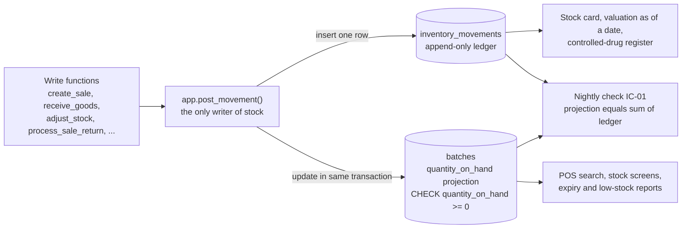

# ADR-0008: Keep stock in an append-only ledger with batch projections and FEFO allocation

## Context and Problem Statement

Medicines are perishable and regulated, and recalls are issued per batch, so a pharmacy cannot manage
stock as a single number per product:

- Every pack belongs to a manufacturer **batch** with an expiry date, a purchase cost and an MRP. Two
  deliveries of the same medicine can have different expiry dates, costs and even MRPs. The SRS requires
  stock per branch per batch (FR-INV-001).
- Expired stock must never be sold (FR-INV-009), recalled batches must be quarantined (FR-INV-010),
  near-expiry stock should be returned to suppliers in time (FR-PUR-015), and expiry write-offs are a
  direct loss to the owner.
- Every stock change must be recorded immutably with its reason, document and user (FR-INV-003); the
  owner needs a stock card with running balance for any date range (FR-INV-017) and stock value at cost
  and at MRP for any past date (FR-INV-018); controlled drugs need a register reconciled to physical
  stock (FR-CDR-013).
- Stock may never go negative, even when several terminals sell the last units at once (FR-INV-005,
  NFR-REL-002), and the on-hand figure must equal the sum of recorded movements with zero tolerance
  (NFR-REL-003).
- POS search must show sellable quantity per medicine in under 200 ms p95 (NFR-PERF-001), so on-hand
  quantities cannot be recomputed from history on every keystroke.
- Profit must be computed from the actual cost of the lots sold, not from an average (FR-RPT-006).

Quantities are integer **base units**, the smallest sellable unit (tablet, capsule, bottle), with pack
conversion factors in the catalog (C-05). At the reference workload (300 invoices of 3 lines per branch
per day) a branch records roughly 1,000 stock movements per day, about 365,000 per year; at the
20-branch capacity design that is about 7.3 million per year.

The questions: **how is stock recorded, and which lot does a sale take its units from?**

## Decision Drivers

1. Auditability: a complete, tamper-resistant history of every unit, by lot, with reason and actor.
2. Integrity: no negative stock and no drift between history and balance, under concurrency.
3. Expiry safety: sell the earliest-expiring sellable stock first and never sell expired or quarantined
   lots, with no extra effort at the counter.
4. Fast reads for POS search and stock screens.
5. Exact lot-cost profit and point-in-time stock valuation.
6. Corrections without destroying history (voids, returns, count corrections).
7. Growth to many branches and years of history without redesign.

## Considered Options

Stock recording:

1. **Mutable counters:** a quantity per medicine and branch (or per lot), updated in place, with the audit
   log as the only history.
2. **Pure event log:** an append-only movement ledger with no stored balances; on-hand is always
   `sum(quantity)` at read time.
3. **Ledger plus transactional projection:** an append-only ledger (`inventory_movements`) as the source
   of truth, and a per-lot on-hand projection (`batches.quantity_on_hand`) updated in the same
   transaction by one internal function.

Allocation policy at sale time:

- A. **FIFO** by receipt date.
- B. **Manual lot selection** by the cashier for every line.
- C. **FEFO** (first expiry, first out) chosen automatically by the database.

## Decision Outcome

Chosen options: **"ledger plus transactional projection" (3)** and **"FEFO chosen by the database" (C)**,
because the ledger gives a complete, immutable history (drivers 1, 5 and 6), the projection gives
constant-time reads protected by a non-negative constraint (drivers 2 and 4), and FEFO minimizes expiry
losses without any decision at the counter (driver 3).

Rules (the [database design](../database/database-design.md) is canonical for tables, movement types and
algorithms):

| Topic             | Rule                                                                                                                                                                                                                                                                                                                                       |
| ----------------- | ------------------------------------------------------------------------------------------------------------------------------------------------------------------------------------------------------------------------------------------------------------------------------------------------------------------------------------------ |
| Unit of stock     | A **lot** (`batches` row) is one batch of one medicine at one branch with its expiry date, cost and prices. Quantities are signed integers in base units.                                                                                                                                                                                  |
| Source of truth   | Every change of a lot's quantity is exactly one `inventory_movements` row with a movement type, signed quantity, reference document and user. A `CHECK` binds each movement type to a sign (for example `sale` negative, `purchase_receipt` positive).                                                                                     |
| Single writer     | Only `app.post_movement()` inserts movements and updates `batches.quantity_on_hand`, in the same transaction, inside the business functions of [ADR-0007](0007-business-logic-in-transactional-postgres-functions.md). Clients have no write privilege on either table.                                                                    |
| Never negative    | `CHECK (quantity_on_hand >= 0)` on `batches`, plus a conditional update that refuses to go below zero, so an oversell fails with `insufficient_stock` and rolls back the whole operation.                                                                                                                                                  |
| Immutability      | Trigger `inventory_movements_append_only` (`app.forbid_mutation()`) rejects `UPDATE` and `DELETE` for every role. Mistakes are corrected by compensating movements: `sale_void` and `sale_return` restock, `adjustment` and `count_correction` correct, `expiry_writeoff` removes.                                                         |
| Sellable lot      | `quantity_on_hand > 0`, not quarantined, and `expiry_date >= business_date + near_expiry_block_days` (setting CFG-40, default 0 days, so a lot expiring today can still be sold).                                                                                                                                                          |
| FEFO order        | Among sellable lots of the medicine at the branch: earliest `expiry_date`, then earliest `received_at`, then lot `id`. One line may draw from several lots, each priced at its own lot price (FR-POS-013). Insufficient stock rejects the whole sale (FR-POS-014).                                                                         |
| Locking           | Sellable lots are locked `FOR UPDATE` in the canonical order `(medicine_id, expiry_date, received_at, id)`, the same order for every function that changes stock, so concurrent sales serialize on the first lot and cannot deadlock ([database design 9.3](../database/database-design.md#93-locking-strategy-and-canonical-lock-order)). |
| Allocation record | Each sale line stores its lot allocations (`sale_item_batches`) with quantity, unit price and cost, which drive returns, voids, cost of goods sold and recalls ("who bought batch X?").                                                                                                                                                    |
| Returns and voids | A void restocks every allocation exactly. A return restocks the original lot (FR-POS-049) unless it has expired or the goods are damaged or opened, in which case the units are recorded and written off.                                                                                                                                  |
| Transfers (M3)    | Dispatch takes units from specific lots (FEFO suggested, editable, FR-TRF-003) with `transfer_out`; receipt adds them to the matching lot at the destination with `transfer_in`; differences are recorded as transfer loss.                                                                                                                |
| Valuation         | Cost of goods sold is the sum of the allocations' lot cost; stock value at any past date is derived from the ledger ([database design 9.6](../database/database-design.md#96-inventory-valuation-and-cost-of-goods-sold)).                                                                                                                 |
| Counts            | A count session records the highest movement ID at its snapshot; variance is computed against the snapshot plus later movements, so selling continues during a count (FR-INV-014).                                                                                                                                                         |
| Growth            | `inventory_movements` uses a `bigint` identity key and `created_at`, ready for monthly range partitioning when the table exceeds about 50 million rows or 10 GB ([database design 14](../database/database-design.md#14-partitioning-readiness)).                                                                                          |

Worked example (SRS scenario FR-POS-013, business date 2026-10-06): a branch holds lot X0 expiring
2026-09-30 (20 tablets), lot A1 expiring 2026-12-31 (6 tablets) and lot B7 expiring 2027-03-31
(50 tablets). A sale of 10 tablets ignores X0 (expired), takes 6 from A1 and 4 from B7, writes two `sale`
movements of -6 and -4, and leaves A1 at 0 and B7 at 46.

### Consequences

- Good, because every unit can be traced from receipt to sale, return, transfer or write-off, which
  supports theft investigation, recalls, DGDA inspections and supplier disputes.
- Good, because on-hand reads are a single indexed row per lot (index `batches_fefo_idx` covers branch,
  medicine and FEFO order for lots with stock), keeping POS search within budget.
- Good, because the non-negative constraint and row locks make overselling impossible, even for a bug in
  a future function.
- Good, because FEFO reduces expiry write-offs automatically, and the Salesman never has to choose a lot.
- Good, because profit uses real lot costs and the owner can value stock at the end of any day or fiscal
  year from the ledger.
- Bad, because the projection is redundant data that could drift if any code path updated it without a
  movement; the single-writer rule, the absence of client privileges, the nightly check IC-01 and (per
  the design) a guard trigger on `batches` (delta D-23) control this risk.
- Bad, because the ledger grows without bound (about 365,000 rows per branch per year); at 20 branches
  the partitioning threshold is reached after roughly six to seven years, so retention and partitioning
  must be planned (backlog item in the [ADR index](README.md#8-decision-backlog)).
- Bad, because the system allocates lots on paper: if a Salesman hands over a pack from a later lot than
  FEFO chose, per-lot quantities drift until the next count. Shelving earliest expiry at the front,
  printing batch and expiry on receipts and regular cycle counts limit this. The allocation algorithm
  accepts an optional explicit lot per line (database design 9.2); whether the counter exposes it is to
  be decided with the pharmacists.
- Bad, because locking all sellable lots of a medicine serializes concurrent sales of the same medicine
  at one branch; with one to five lots per medicine and at most four terminals the wait is a few
  milliseconds, but it is measured in the M4 load test.
- Neutral, because stock in transit between branches belongs to neither branch's sellable stock and is
  reported separately (FR-TRF-007).

### Confirmation

- pgTAP tests in `supabase/tests/database/` cover FEFO order across lots, rejection of expired lots,
  insufficient stock, voids and returns restocking the original lot, and the append-only trigger
  (`020_purchase_to_sale_flow.test.sql` covers the main path today).
- A concurrency test with 20 parallel sessions selling the same lot commits exactly the available
  quantity and never ends negative (NFR-REL-002).
- Vitest property tests check the client-side FEFO preview against the same scenarios.
- The nightly integrity check IC-01 (and IC-02 for the running balance) reports any lot whose projection
  differs from the sum of its movements; a non-empty result is an incident
  ([database design 17.2](../database/database-design.md#172-integrity-checks)).
- Known gaps against this decision, tracked in
  [database design section 21](../database/database-design.md#21-implementation-deltas): exact lot cost
  value (D-06), lots expiring today being blocked (D-07), a second lock order in void and return
  functions (D-02) and the projection guard trigger (D-23). They are fixed before the M1 freeze.
- Review triggers: a regulatory requirement for a different allocation rule; expiry write-offs above an
  agreed share of purchases despite FEFO; or the movement table approaching the partitioning threshold.

## Pros and Cons of the Options

### Mutable counters

- Good, because it is the simplest model and the fastest to build.
- Bad, because the history of why stock changed exists only in a generic audit log that is not designed
  for stock cards, valuation or the controlled-drug register.
- Bad, because a lost update or a bug silently corrupts the balance with nothing to reconcile against.
- Bad, because a counter per medicine cannot represent expiry dates, so expired stock cannot be blocked.

### Pure event log

- Good, because there is exactly one representation of stock and nothing can drift.
- Bad, because every POS search and stock screen must sum the ledger; even with indexes this means
  hundreds of thousands of rows per branch per year, which breaks the 200 ms search budget as history
  grows, and snapshots would be needed anyway.
- Bad, because enforcing "never negative" under concurrency requires locking and summing at every write,
  which is slower and more complex than a constrained projection.

### Ledger plus transactional projection (chosen)

- Good, because it combines a full history with fast, constraint-protected balances.
- Bad, because it requires the single-writer discipline and reconciliation checks described above.

### FIFO by receipt date (A)

- Good, because it is simple and common in general retail.
- Bad, because distributors frequently deliver a later shipment with an earlier expiry; FIFO then sells
  the longer-dated stock first and lets the shorter-dated lot expire on the shelf.

### Manual lot selection (B)

- Good, because the system always matches the physical pack handed over.
- Bad, because choosing a lot for every line slows the counter well beyond the 30-second target for a
  three-item sale (NFR-USAB-004) and invites errors, including selling an older lot by mistake.

### FEFO chosen by the database (C, chosen)

- Good, because it is the standard practice for pharmaceuticals and needs no input at the counter.
- Bad, because the system and the shelf can disagree, as described in the consequences.

## More Information

- [Database design](../database/database-design.md): sections 6 (movement types and signs), 7.3
  (inventory tables), 9.2 (FEFO allocation), 9.3 (locking), 9.6 (valuation), 9.7 (returns and voids), 14
  (partitioning) and 17.2 (integrity checks)
- [Architecture description](../architecture/architecture.md): sections 11.2 (POS sale commit) and 11.4
  (inter-branch transfer)
- [SRS](../requirements/SRS.md): C-05, FR-INV-001 to FR-INV-005, FR-INV-009, FR-INV-010, FR-INV-014,
  FR-INV-017, FR-INV-018, FR-POS-013, FR-POS-014, FR-POS-049, FR-TRF-003, FR-TRF-005, FR-TRF-007,
  FR-CDR-013, FR-RPT-006, NFR-REL-002, NFR-REL-003
- Code: `inventory_movements`, `batches` and `app.post_movement()` in
  `supabase/migrations/20261006120200_catalog_and_inventory.sql`; FEFO allocation in `create_sale` in
  `supabase/migrations/20261006120500_sales.sql`
- Related decisions: [ADR-0005](0005-money-as-integer-paisa.md),
  [ADR-0007](0007-business-logic-in-transactional-postgres-functions.md)
