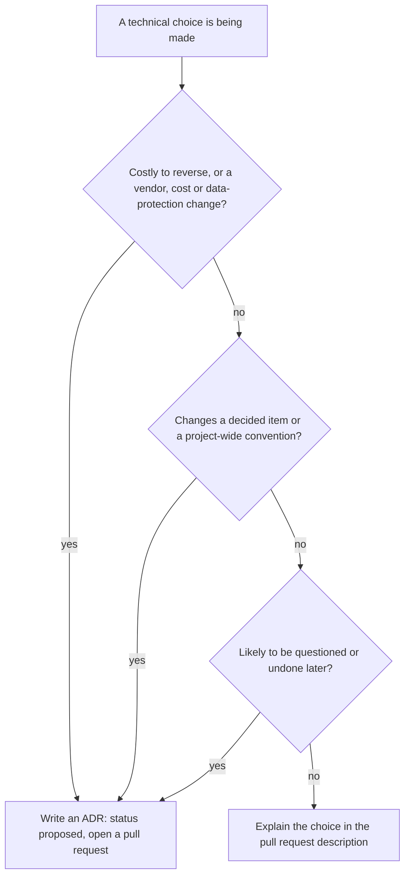
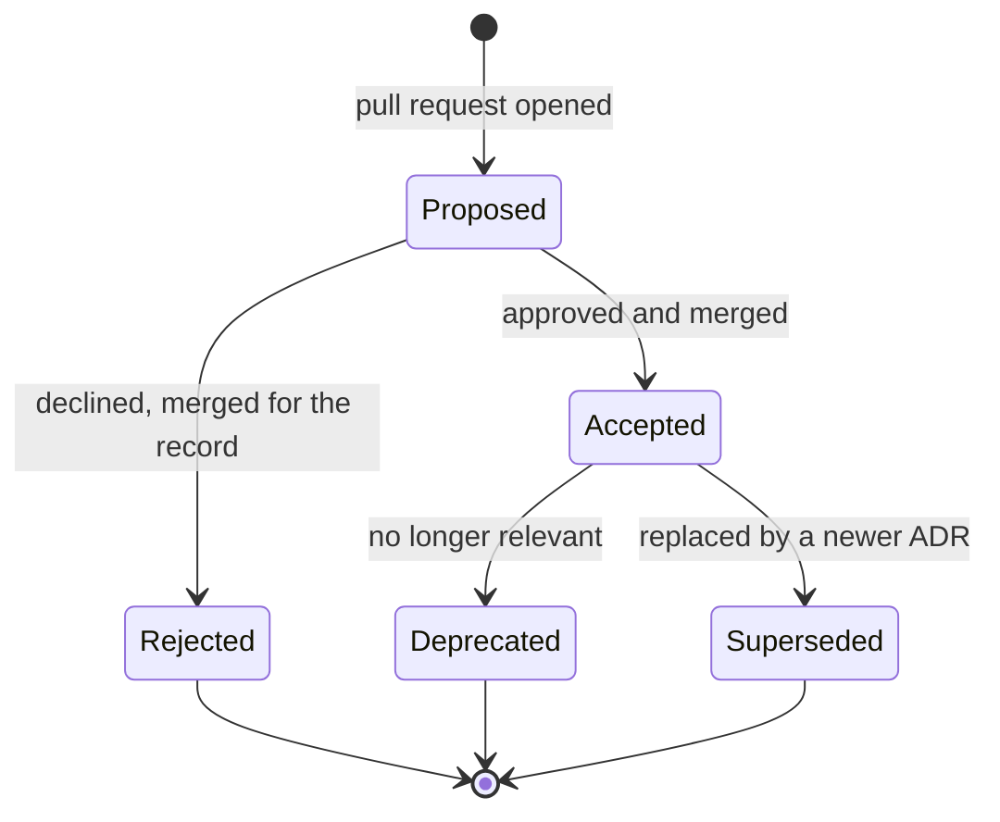

# Architecture Decision Records

The architecture decision records (ADRs) of the Pharmacy Inventory Management System (PIMS). Each ADR
captures one significant decision: the problem, the options that were considered, the option chosen and
why, and the consequences the project accepts.

| Field            | Value                                                                       |
| ---------------- | --------------------------------------------------------------------------- |
| Document ID      | PIMS-ADR-000                                                                |
| Owner            | Engineering lead                                                            |
| Approver         | Product owner (pharmacy owner) for decisions that affect cost or operations |
| Format           | MADR 4.0 (Markdown Architectural Decision Records), adapted                 |
| Process decision | [ADR-0001](0001-record-architecture-decisions.md)                           |
| Last updated     | 2026-10-06                                                                  |

## Contents

1. [What an ADR is](#1-what-an-adr-is)
2. [When an ADR is required](#2-when-an-adr-is-required)
3. [Index](#3-index)
4. [Status lifecycle](#4-status-lifecycle)
5. [Process](#5-process)
6. [File naming and numbering](#6-file-naming-and-numbering)
7. [Template](#7-template)
8. [Decision backlog](#8-decision-backlog)
9. [Writing guidelines](#9-writing-guidelines)
10. [Related documents](#10-related-documents)

---

## 1. What an ADR is

An architecture decision record is a short Markdown document that records a decision with long-lasting
effect on the structure, quality attributes, cost or operation of the system. ADRs answer the question
a new engineer, an auditor or a future buyer of the software will ask: "why is it built this way, and
what else was considered?"

Properties of a PIMS ADR:

- **One decision per record.** A record that mixes several decisions is split.
- **Immutable once accepted.** The decision text of an accepted ADR is not rewritten. A changed decision
  is a new ADR that supersedes the old one; both remain in the repository.
- **Versioned with the code.** ADRs live in `docs/adr/`, are reviewed in pull requests like code, and are
  referenced from code where the decision is visible (for example `src/domain/money.ts` cites
  [ADR-0005](0005-money-as-integer-paisa.md)).
- **Rationale, not specification.** ADRs explain why. The specifications they lead to stay in their
  canonical documents and are linked, not copied: requirement IDs in the [SRS](../requirements/SRS.md),
  tables and functions in the [database design](../database/database-design.md), roles and permissions
  in the [security model](../security/security-model.md), milestones in the [roadmap](../roadmap.md).

## 2. When an ADR is required

Write an ADR when at least one of the following is true:

| Trigger                                                                                        | Examples                                                          |
| ---------------------------------------------------------------------------------------------- | ----------------------------------------------------------------- |
| The decision is expensive to reverse (more than about one developer-week, or a data migration) | Backend platform, tenancy model, money representation             |
| It changes an accepted ADR or a decision described in architecture sections 5 to 16            | Adding a global state store, moving writes out of the database    |
| It introduces or removes a vendor, a paid service or a new data processor                      | AI provider, SMS gateway, hosting provider                        |
| It affects security, privacy, tenant isolation or data residency                               | Authorization source, storage of prescriptions, hosting location  |
| It changes a cross-cutting convention every contributor must follow                            | Error contract, idempotency keys, migration policy                |
| It is a deliberate trade-off that a reasonable engineer might later try to "fix"               | No SSR, no client-side writes to ledgers, no floating-point money |

An ADR is **not** needed for choices that are local and cheap to change (a helper library inside one
feature, a component name, a refactoring with no externally visible effect). When in doubt, raise the
question in the pull request; the reviewer decides.



## 3. Index

| ADR                                                                | Title                                                                                     | Status   | Date       | Area           |
| ------------------------------------------------------------------ | ----------------------------------------------------------------------------------------- | -------- | ---------- | -------------- |
| [0001](0001-record-architecture-decisions.md)                      | Record architecture decisions as MADR documents in the repository                         | Accepted | 2026-10-06 | Process        |
| [0002](0002-supabase-postgresql-over-firebase.md)                  | Use Supabase (managed PostgreSQL) as the backend platform                                 | Accepted | 2026-10-06 | Platform       |
| [0003](0003-react-vite-typescript-spa.md)                          | Build the client as a React, TypeScript and Vite single-page application                  | Accepted | 2026-10-06 | Frontend       |
| [0004](0004-cloudflare-pages-hosting.md)                           | Host the web application on Cloudflare Pages                                              | Accepted | 2026-10-06 | Hosting        |
| [0005](0005-money-as-integer-paisa.md)                             | Represent money as integer paisa and rates as integer basis points                        | Accepted | 2026-10-06 | Data           |
| [0006](0006-multi-tenant-organization-branch-model-with-rls.md)    | Pooled multi-tenancy with an organization and branch model enforced by row level security | Accepted | 2026-10-06 | Data, security |
| [0007](0007-business-logic-in-transactional-postgres-functions.md) | Put business-critical writes in transactional PostgreSQL functions (RPC-first)            | Accepted | 2026-10-06 | Backend        |
| [0008](0008-append-only-inventory-ledger-with-fefo.md)             | Keep stock in an append-only ledger with batch projections and FEFO allocation            | Accepted | 2026-10-06 | Inventory      |

### 3.1 Coverage of the architecture decision index

[Architecture section 23](../architecture/architecture.md#23-architecture-decision-index) lists the
decisions that the architecture description depends on. Their records:

| Decision in architecture section 23                                       | Record                                                                                                                                          |
| ------------------------------------------------------------------------- | ----------------------------------------------------------------------------------------------------------------------------------------------- |
| Supabase as the backend platform (Singapore region)                       | [ADR-0002](0002-supabase-postgresql-over-firebase.md)                                                                                           |
| Business-critical writes only through PostgreSQL RPC functions            | [ADR-0007](0007-business-logic-in-transactional-postgres-functions.md)                                                                          |
| Multi-tenancy with `organization_id` and RLS on every table               | [ADR-0006](0006-multi-tenant-organization-branch-model-with-rls.md)                                                                             |
| Money as `BIGINT` paisa, no floating point                                | [ADR-0005](0005-money-as-integer-paisa.md)                                                                                                      |
| Frontend stack                                                            | [ADR-0003](0003-react-vite-typescript-spa.md) (application style and core framework; supporting libraries are listed in architecture section 7) |
| Cloudflare Pages for hosting and PR previews                              | [ADR-0004](0004-cloudflare-pages-hosting.md)                                                                                                    |
| Testing stack; trunk-based development and CI; offline outbox; AI gateway | Not yet recorded, see [section 8](#8-decision-backlog)                                                                                          |
| ADR process (MADR in the repository)                                      | [ADR-0001](0001-record-architecture-decisions.md)                                                                                               |
| Append-only inventory ledger with batch projections and FEFO allocation   | [ADR-0008](0008-append-only-inventory-ledger-with-fefo.md)                                                                                      |

## 4. Status lifecycle



| Status                   | Meaning                                                                                      | Allowed edits to the record                                              |
| ------------------------ | -------------------------------------------------------------------------------------------- | ------------------------------------------------------------------------ |
| `proposed`               | Under discussion in an open pull request; not yet binding                                    | Any                                                                      |
| `accepted`               | Binding for all work; code and documents must conform                                        | Status, links, typo fixes, dated notes appended under "More Information" |
| `rejected`               | Considered and declined; kept so the discussion is not repeated                              | Links and typo fixes only                                                |
| `deprecated`             | No longer relevant (for example the feature was removed); nothing replaces it                | Status change with date and reason                                       |
| `superseded by ADR-NNNN` | Replaced by a newer decision; the newer ADR names this one in its "More Information" section | Status change and link to the newer ADR                                  |

Rules:

- Only the status line and the index change when a decision is superseded; the old reasoning stays
  readable as written.
- An ADR that is accepted but not yet implemented says so in its "Confirmation" section, with the
  milestone that will implement it.
- Known gaps between an accepted decision and the current implementation are tracked where the
  implementation is specified (for example
  [database design section 21](../database/database-design.md#21-implementation-deltas)), not by editing
  the ADR.

## 5. Process

1. **Draft.** Copy the [template](#7-template) to `docs/adr/NNNN-short-title.md` with the next free
   number and `status: proposed`.
2. **Open a pull request** whose title starts with `docs(adr): NNNN` (Conventional Commits) and tick the
   "Docs/ADR/threat model updated" item of the pull request template. Link the issue, the requirement
   IDs and the affected sections of other documents.
3. **Review.** The engineering lead reviews every ADR (CODEOWNERS). Decisions that change cost, vendors,
   data location or business behaviour also need the product owner's approval in the pull request.
   Leave at least two working days for comments unless the decision is an urgent fix.
4. **Decide.** On approval, set `status: accepted` and the decision date. On rejection, set
   `status: rejected`, add the reason under "More Information", and merge anyway so the record exists.
5. **Propagate in the same pull request.** Update this index, the architecture decision index
   (architecture section 23) and every canonical document whose content the decision changes.
6. **Supersede, do not edit.** To change an accepted decision, write a new ADR, set the old one to
   `superseded by ADR-NNNN`, and update the index.
7. **Review at milestone exits.** At the end of each milestone (see the [roadmap](../roadmap.md)) the
   engineering lead checks the review triggers listed in each ADR's "Confirmation" section and opens a
   new ADR where a trigger has fired.

## 6. File naming and numbering

- File name: `NNNN-kebab-case-title.md`, where `NNNN` is a zero-padded, strictly increasing number.
  Numbers are never reused, even for rejected records.
- The H1 heading repeats the number: `# ADR-NNNN: <title>`.
- Titles name the decision, not only the topic: "Represent money as integer paisa", not "Money".
- Cross-references use the form `ADR-NNNN` with a relative link.
- Metadata is YAML front matter (MADR 4.0), which GitHub renders as a table and scripts can parse.

## 7. Template

Copy this block into a new file. Sections marked optional may be omitted when they add nothing.

```markdown
---
status: proposed # proposed | accepted | rejected | deprecated | superseded by ADR-NNNN
date: YYYY-MM-DD # date of the last status change
decision-makers:
  - Engineering lead
  - Product owner (pharmacy owner) # when cost, vendors, data location or business behaviour change
consulted:
  - <roles whose input was sought>
informed:
  - <roles that must know the outcome>
---

# ADR-NNNN: <decision as a short imperative or noun phrase>

## Context and Problem Statement

<Two to six paragraphs: the situation, the forces at play, the requirement IDs involved (FR-_, NFR-_,
C-*), and the question being decided. Quantify where possible: volumes, latencies, costs.>

## Decision Drivers

- <driver 1, ideally traceable to a requirement or quality attribute>
- <driver 2>

## Considered Options

1. <option 1>
2. <option 2>
3. <option 3>

## Decision Outcome

Chosen option: "<option N>", because <justification tied to the decision drivers>.

<Scope and rules of the decision: what is now mandatory, what is forbidden, what remains open.>

### Consequences

- Good, because <positive consequence>
- Bad, because <negative consequence, cost or risk accepted>
- Neutral, because <effect that is neither, optional>

### Confirmation

<How compliance is verified: tests, CI checks, review checklist items, measurements. Include review
triggers: the conditions under which this decision must be revisited.>

## Pros and Cons of the Options

### <option 1>

- Good, because <argument>
- Bad, because <argument>

### <option 2>

- Good, because <argument>
- Bad, because <argument>

## More Information

<Links to related ADRs, canonical documents, external references (with access date), open issues and
follow-up work. Notes added after acceptance are dated.>
```

## 8. Decision backlog

Decisions that are already made in the design documents or will be needed soon, but are not yet
recorded. Each becomes an ADR before the milestone shown; numbers are assigned when the pull request is
opened.

| Candidate ADR                                                                                     | Source                                                                                           | Needed by                   |
| ------------------------------------------------------------------------------------------------- | ------------------------------------------------------------------------------------------------ | --------------------------- |
| Testing stack: Vitest with fast-check, pgTAP through `supabase test db`, Playwright with axe-core | Architecture section 7; [testing strategy](../engineering/testing-strategy.md)                   | M0 exit                     |
| Trunk-based development, Conventional Commits, semantic versioning and GitHub Actions CI          | Architecture section 14; [engineering standards](../engineering/engineering-standards.md)        | M0 exit                     |
| Static application security testing on a private repository: CodeQL licence or an alternative     | Architecture open issue OI-04                                                                    | M0 exit                     |
| Production starts on Supabase Pro at launch or on Free with nightly backups                       | Architecture open issue OI-05, section 20.3                                                      | M4                          |
| Offline point of sale with an IndexedDB outbox, provisional references and idempotent replay      | Architecture section 15; NFR-AVAIL-004                                                           | Before M4 implementation    |
| AI gateway in an Edge Function with read-only, row-level-secured data access                      | Architecture section 16                                                                          | Before M5 implementation    |
| AI provider data-handling terms and retention (FR-AI-028)                                         | Architecture section 16; [security model](../security/security-model.md)                         | Before M5 launch            |
| Monthly range partitioning of sales, stock movements and the audit log                            | [Database design section 14](../database/database-design.md#14-partitioning-readiness); DB-OI-07 | Before scalability stage S3 |
| Moving the security baseline from OWASP ASVS 4.0.3 to ASVS 5.0                                    | Security model                                                                                   | M4 review                   |

## 9. Writing guidelines

- **Be concrete.** Name tables, functions, limits and prices. A reader should be able to check every
  claim.
- **Date volatile facts.** Vendor prices, free-tier limits and terms of service change; write "at the
  time of writing (October 2026)" and link the source so the next reviewer can re-verify.
- **Show the trade-off honestly.** Every chosen option has "Bad, because" items; an ADR without them is
  incomplete.
- **Link, do not duplicate.** Summarize canonical content in one or two sentences and link it. If an ADR
  and a canonical document disagree, the canonical document is corrected in a pull request that cites
  the ADR, or a new ADR is written.
- **Make confirmation checkable.** Prefer automated checks (tests, CI jobs, lint rules) over
  "reviewers will check". State review triggers as measurable conditions.
- **Write for a mixed audience.** The product owner approves cost and vendor decisions; keep the
  context and outcome readable without deep technical knowledge, and put detail in "Pros and Cons".
- **Use project vocabulary.** Terms such as lot, base unit, business date and due (বাকি) follow the
  [glossary](../glossary.md).

## 10. Related documents

| Document                                                         | Relationship                                            |
| ---------------------------------------------------------------- | ------------------------------------------------------- |
| [Documentation index](../README.md)                              | Entry point to all project documentation                |
| [Software requirements specification](../requirements/SRS.md)    | Requirement IDs that ADRs trace to                      |
| [Architecture description](../architecture/architecture.md)      | Describes the architecture that these decisions produce |
| [Database design](../database/database-design.md)                | Canonical schema, functions and algorithms              |
| [Security model](../security/security-model.md)                  | Canonical roles, permissions and threat model           |
| [Engineering standards](../engineering/engineering-standards.md) | Definition of Done, review checklist, ADR obligations   |
| [Roadmap](../roadmap.md)                                         | Milestones referenced by decisions and the backlog      |
| [MADR project](https://adr.github.io/madr/)                      | Upstream template and guidance                          |
