# PIMS Architecture Description

Software architecture of the Pharmacy Inventory Management System (PIMS): C4 views, technology
choices, runtime flows, deployment, offline and AI designs, and the quality attributes they serve.

| Field        | Value                                                                  |
| ------------ | ---------------------------------------------------------------------- |
| Document ID  | PIMS-ARCH-001                                                          |
| Version      | 1.0                                                                    |
| Status       | Draft for M0 review                                                    |
| Owner        | Engineering lead (architecture owner)                                  |
| Approver     | Product owner (pharmacy owner)                                         |
| Last updated | 2026-10-06                                                             |
| Applies to   | Milestones M0 to M5 (see [roadmap](../roadmap.md))                     |
| Change rule  | Any change to a decision in this document requires an ADR (section 23) |

## Table of contents

1. [Introduction](#1-introduction)
2. [Architectural drivers](#2-architectural-drivers)
3. [Architecture principles](#3-architecture-principles)
4. [System context (C4 level 1)](#4-system-context-c4-level-1)
5. [Containers (C4 level 2)](#5-containers-c4-level-2)
6. [Components (C4 level 3)](#6-components-c4-level-3)
7. [Technology stack](#7-technology-stack)
8. [Repository layout](#8-repository-layout)
9. [Frontend architecture](#9-frontend-architecture)
10. [Backend architecture](#10-backend-architecture)
11. [Key runtime flows](#11-key-runtime-flows)
12. [Multi-tenancy model](#12-multi-tenancy-model)
13. [Cross-cutting concerns](#13-cross-cutting-concerns)
14. [Environments and deployment pipeline](#14-environments-and-deployment-pipeline)
15. [Offline strategy (M4)](#15-offline-strategy-m4)
16. [AI architecture (M5)](#16-ai-architecture-m5)
17. [Observability](#17-observability)
18. [Performance budgets](#18-performance-budgets)
19. [Scalability path](#19-scalability-path)
20. [Cost model](#20-cost-model)
21. [Quality attribute scenarios](#21-quality-attribute-scenarios)
22. [Risks, technical debt and open issues](#22-risks-technical-debt-and-open-issues)
23. [Architecture decision index](#23-architecture-decision-index)
24. [Revision history](#24-revision-history)

---

## 1. Introduction

### 1.1 Purpose

This document describes how PIMS is structured, why it is structured that way, and how the
structure meets the quality goals of a multi-branch pharmacy business in Dhaka, Bangladesh. It is
the reference for engineers implementing milestones M1 to M5, for reviewers judging whether a change
fits the architecture, and for the owner when deciding on cost and scaling.

### 1.2 Scope

In scope: the web application, the Supabase backend (database, API, authentication, Edge Functions,
storage), hosting, CI/CD, environments, observability, the offline mode (M4) and the AI features (M5).

Out of scope for v1, but the architecture must not block them: e-commerce and online ordering, home
delivery, general-ledger accounting, payroll, native mobile apps, supplier EDI, government reporting
integrations, and SMS (v2). Section 19 shows how the design leaves room for them.

### 1.3 Canonical sources and what this document does not redefine

To avoid contradictions, this document summarizes and links instead of redefining:

| Topic                                                | Canonical document                                               |
| ---------------------------------------------------- | ---------------------------------------------------------------- |
| Requirement IDs (FR-\*, NFR-\*)                      | [SRS](../requirements/SRS.md)                                    |
| Tables, columns, constraints, functions, error codes | [Database design](../database/database-design.md)                |
| Roles, permission matrix, threat model               | [Security model](../security/security-model.md)                  |
| Milestones and sequencing                            | [Roadmap](../roadmap.md)                                         |
| Coding conventions, review checklist, DoD            | [Engineering standards](../engineering/engineering-standards.md) |
| Test levels, coverage targets, test data             | [Testing strategy](../engineering/testing-strategy.md)           |
| Operational procedures (deploy, backup, restore)     | [Runbook](../operations/runbook.md)                              |
| Terms (FEFO, GRN, MRP, বাকি, RLS, RPC)               | [Glossary](../glossary.md)                                       |
| Decisions and their rationale                        | [ADR index](../adr/README.md)                                    |

Where this document names a table, function or error code, it does so for illustration; the database
design is authoritative. Where it names a role permission, the security model is authoritative.

### 1.4 Notation

Structure is described with the [C4 model](https://c4model.com): level 1 (system context), level 2
(containers) and level 3 (components). Diagrams are written in Mermaid so they render on GitHub and
are reviewed as code. Mermaid's native C4 syntax is still experimental, so C4 views are drawn as
Mermaid flowcharts with a consistent legend:

| Shape colour  | Meaning                                         |
| ------------- | ----------------------------------------------- |
| Dark blue     | Person (user role)                              |
| Blue          | Software system or container in scope (PIMS)    |
| Grey          | External system or third-party service          |
| Dashed border | Planned for a later milestone (label says when) |

Runtime behaviour is shown with Mermaid sequence diagrams (section 11).

### 1.5 Audience and reading paths

| Reader                         | Recommended sections                                       |
| ------------------------------ | ---------------------------------------------------------- |
| Owner / product decision maker | 2, 4, 15, 16, 19, 20, 21                                   |
| Frontend engineer              | 3, 5, 6.1, 8, 9, 11, 13, 15                                |
| Database / backend engineer    | 3, 5, 6.2, 10, 11, 12, 13, 14.5                            |
| Security reviewer              | 5.3, 10.5, 10.6, 12, 15.5, 16.4                            |
| Operations                     | 14, 17, 19, 20 and the [runbook](../operations/runbook.md) |

---

## 2. Architectural drivers

### 2.1 Business context

- A single pharmacy in the Mohammadpur area of Dhaka is the first tenant. More branches will open
  (number unknown), and the owner may later sell the software to other pharmacies (SaaS). The data
  model is therefore multi-tenant from day one (section 12).
- Counter staff (Salesman) must sell quickly and correctly during rush hours; Branch Managers handle
  purchasing, stock and approvals; the Owner needs cross-branch visibility and control.
- The business operates under DGDA rules. Medicines are OTC, prescription-only (Rx) or controlled
  (narcotic/psychotropic); controlled sales need prescription details and a controlled-drug register.
- Internet connectivity in Dhaka is generally good but outages (ISP faults, load-shedding) happen,
  which drives the offline mode in M4.
- The team is small (one to three developers) and the budget is tight, which favours managed
  services, a single repository and free tiers until clear upgrade triggers are reached (section 20).

### 2.2 Functional drivers and their architectural consequences

| Driver (summary; requirements in the [SRS](../requirements/SRS.md)) | Architectural consequence                                                                              |
| ------------------------------------------------------------------- | ------------------------------------------------------------------------------------------------------ |
| Batch-level stock per branch, FEFO allocation, stock never negative | All stock changes inside single-transaction database functions with row locks and `CHECK` constraints  |
| Immutable stock ledger is the source of truth                       | Append-only `inventory_movements`; on-hand quantities are a projection updated in the same transaction |
| Prices and totals are never trusted from the client                 | The `create_sale` function computes every amount; the client only previews                             |
| Gapless invoice numbers per branch per fiscal year                  | Numbers allocated from a locked counter row inside the sale transaction, never from a sequence         |
| Multi-branch now, multi-organization later                          | `organization_id` (and `branch_id`) on every tenant row, Row Level Security (RLS) on every table       |
| Configurable loyalty program (paid or free, discount and/or points) | Loyalty behaviour is data (plans, rules), not code; one code path handles all configurations           |
| Controlled-drug register, audit of sensitive changes                | Register rows written by the sale function; generic append-only audit trigger                          |
| English and Bangla UI, BDT currency, Asia/Dhaka time                | i18next, integer paisa money, business dates computed in Asia/Dhaka                                    |
| Thermal receipts and barcode scanners at the counter                | Browser printing with print stylesheets; keyboard-wedge scanner support; keyboard-first POS            |
| AI features later, strictly read-only and advisory                  | Server-side AI gateway with read-only data role, validated SQL, metering (section 16)                  |

### 2.3 Quality attribute priorities

Ranked; when two attributes conflict, the higher one wins.

| Rank | Quality attribute             | What it means for PIMS                                                                                 | Main sections  |
| ---- | ----------------------------- | ------------------------------------------------------------------------------------------------------ | -------------- |
| 1    | Data integrity                | Stock, money and invoice numbers are always correct and consistent, even under concurrency and retries | 10.4, 13, 15.4 |
| 2    | Security and tenant isolation | No user sees or changes data outside their organization, branches and role                             | 10.5, 10.6, 12 |
| 3    | Counter performance           | Search and sale commit feel instant (budgets in section 18)                                            | 18             |
| 4    | Availability                  | Selling continues during business hours, including short internet outages (M4)                         | 15, 17         |
| 5    | Usability                     | Keyboard-first POS, bilingual UI, WCAG 2.1 AA                                                          | 9.6, 9.7, 9.8  |
| 6    | Modifiability                 | Business policy changes are configuration; new features fit into feature slices                        | 9.1, 10.3      |
| 7    | Cost efficiency               | Free tiers first, explicit upgrade triggers                                                            | 20             |
| 8    | Operability                   | Few moving parts, automated deploys and backups, actionable alerts                                     | 14, 17         |

Example of the ranking in action: an offline sale whose price no longer matches the server is held
for a manager to resolve instead of being accepted automatically (integrity over availability, see
section 15.4).

### 2.4 Constraints

| ID   | Constraint                                                                                          | Source          |
| ---- | --------------------------------------------------------------------------------------------------- | --------------- |
| C-01 | Backend platform is Supabase (PostgreSQL, PostgREST, Auth, Edge Functions, Storage)                 | Design decision |
| C-02 | Supabase region Singapore (`ap-southeast-1`), the lowest-latency region to Dhaka                    | Design decision |
| C-03 | Frontend hosted on Cloudflare Pages (free tier permits commercial use)                              | Design decision |
| C-04 | Money stored as `BIGINT` paisa; no floating point for money anywhere                                | Design decision |
| C-05 | No hard deletes of business records; ledgers are immutable                                          | Design decision |
| C-06 | UI languages English and Bangla (bn-BD); currency BDT; time zone Asia/Dhaka (UTC+6, no DST)         | Business        |
| C-07 | DGDA rules for Rx and controlled medicines                                                          | Regulation      |
| C-08 | Start on free tiers; Supabase Pro (about USD 25 per month) only when triggers in section 20 are met | Budget          |
| C-09 | Small team: no self-managed servers, one repository, pnpm and Node 22 LTS                           | Team            |

### 2.5 Assumptions (to be validated with the owner)

| ID   | Assumption                                                                                                                                       | Used for                        |
| ---- | ------------------------------------------------------------------------------------------------------------------------------------------------ | ------------------------------- |
| A-01 | Counter terminals are Windows PCs running current Chrome or Edge; managers also use Android phones                                               | Browser support, PWA            |
| A-02 | USB barcode scanners operate in keyboard-wedge (HID) mode with an Enter suffix                                                                   | POS input design (9.8)          |
| A-03 | Thermal printers (58 or 80 mm) are installed through the operating system driver                                                                 | Printing (9.8)                  |
| A-04 | Load follows the SRS reference workload: 300 invoices per branch per day, 60 in the peak hour, 3 lines per invoice, up to 4 terminals per branch | Sizing (18, 19, 20)             |
| A-05 | Catalog of 30,000 medicines and 60,000 barcodes per organization; capacity design of 20 branches per organization (SRS reference workload)       | Search design, budgets          |
| A-06 | At least 6 years of history are retained; report targets apply to 1 year of data                                                                 | Capacity planning, partitioning |

The reference workload is defined in section 3.4 of the [SRS](../requirements/SRS.md); if it changes, the
sizing in sections 18 to 20 is revisited.

---

## 3. Architecture principles

| ID  | Principle                                      | Implication                                                                                                                     |
| --- | ---------------------------------------------- | ------------------------------------------------------------------------------------------------------------------------------- |
| P1  | The database is the authority                  | Rules that affect money, stock or numbering live in PostgreSQL functions and constraints; the UI validates only for convenience |
| P2  | Secure by default, deny by default             | RLS enabled on every table; `anon` has no access to business data; least privilege for every role and function                  |
| P3  | Ledgers are immutable                          | Corrections are new entries (reversals, adjustments), never updates or deletes                                                  |
| P4  | Tenancy is enforced by the server              | Every tenant row carries `organization_id`; isolation comes from RLS, never from client-side filters                            |
| P5  | Configuration over code for business policy    | Loyalty plans, VAT rate, discount limits and rounding are settings, not code branches                                           |
| P6  | Managed services first                         | No servers to patch; operational effort goes into backups, monitoring and tests                                                 |
| P7  | Typed end to end, tested at the right level    | TypeScript strict, generated database types, pgTAP tests for every function and policy                                          |
| P8  | Every critical write is idempotent             | Client-generated idempotency keys make retries safe online and offline                                                          |
| P9  | Fail safe, not open                            | When validation is uncertain (AI SQL, offline sync), reject and route to a human                                                |
| P10 | Observable without leaking personal data       | Errors carry correlation IDs; logs and telemetry exclude names, phones and prescriptions                                        |
| P11 | Accessible and bilingual from the first screen | Every screen meets WCAG 2.1 AA and ships with English and Bangla strings                                                        |
| P12 | Decisions are recorded                         | Significant decisions get an ADR; reversible options are preferred where cost is similar                                        |

---

## 4. System context (C4 level 1)

PIMS is used by pharmacy staff through a web browser. Customers do not use the system directly in v1;
they interact with a Salesman, present a loyalty card or phone number and receive a printed receipt.

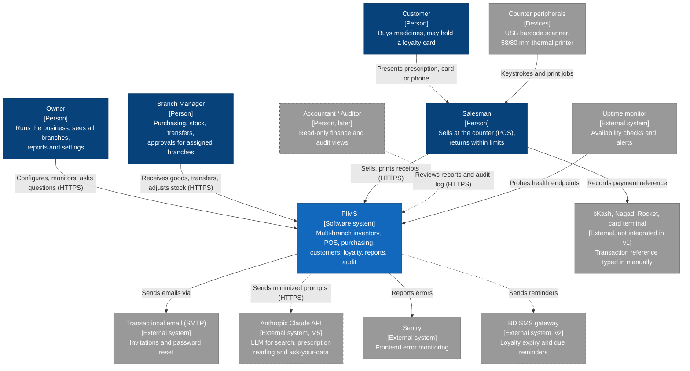

| External party             | Interaction                                                                     | Data exchanged                                                 | Milestone |
| -------------------------- | ------------------------------------------------------------------------------- | -------------------------------------------------------------- | --------- |
| Transactional email (SMTP) | Supabase Auth sends invitation, password-reset and email-change messages        | Email address, one-time links                                  | M2        |
| Anthropic Claude API       | AI gateway Edge Function calls the Messages API                                 | Minimized, PII-redacted prompts; prescription images on opt-in | M5        |
| Sentry                     | Browser SDK sends exceptions and performance samples                            | Stack traces, release, route; no PII (section 17)              | M2        |
| Uptime monitor             | External probe of the web app and the `health` Edge Function every 5 minutes    | None                                                           | M4        |
| BD SMS gateway             | Edge Function sends reminders                                                   | Phone number, message text                                     | v2        |
| Mobile financial services  | None in v1; the Salesman types the transaction ID shown on the customer's phone | Transaction reference only                                     | v1 manual |

---

## 5. Containers (C4 level 2)

### 5.1 Container diagram

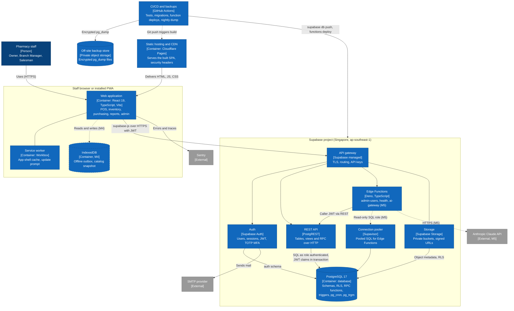

Supabase Realtime is not used in v1; notifications are polled (section 9.3). It is a candidate for
pushing transfer and stock alerts later without changing other containers.

### 5.2 Container responsibilities

| Container         | Technology                  | Responsibilities                                                                                          | Explicitly not responsible for                      |
| ----------------- | --------------------------- | --------------------------------------------------------------------------------------------------------- | --------------------------------------------------- |
| Web application   | React 19, TypeScript, Vite  | UI, input validation for usability, previews of totals, printing, i18n, offline outbox (M4)               | Authorization, final prices, numbering, stock rules |
| Service worker    | Workbox via vite-plugin-pwa | Precache the app shell, prompt for updates, installability                                                | Caching API responses                               |
| IndexedDB (M4)    | Browser storage             | Outbox of pending sales, catalog and loyalty snapshot for the branch                                      | Long-term storage; any data not needed offline      |
| Static hosting    | Cloudflare Pages            | Serve immutable assets, `index.html`, security headers from `public/_headers`, PR preview deployments     | Any server-side logic                               |
| API gateway       | Supabase managed            | TLS termination, routing of `/auth/v1`, `/rest/v1`, `/storage/v1`, `/functions/v1`, API key checks        | Business authorization                              |
| Auth              | Supabase Auth               | Password sign-in, TOTP MFA, JWT issue and refresh, invitations, password reset                            | Roles and branch access (held in the database)      |
| REST API          | PostgREST                   | Expose `public` tables, views and RPC functions; run each request in one transaction as `authenticated`   | Business logic of its own                           |
| PostgreSQL        | PostgreSQL 17 (minimum 15)  | Data, constraints, RLS, business functions (RPC), audit triggers, scheduled jobs, search indexes          | Calling external services                           |
| Edge Functions    | Deno, TypeScript            | Operations needing secrets or service privileges: user administration, AI gateway, SMS (v2), health check | Business writes to stock or money                   |
| Storage           | Supabase Storage            | Prescription images and organization assets in private buckets; signed URLs; RLS on object paths          | Public file hosting                                 |
| Connection pooler | Supavisor                   | Pooled direct SQL connections for Edge Functions that need a dedicated role (AI read-only role)           | Client connections                                  |
| CI/CD and backups | GitHub Actions              | Quality gates, migrations, Edge Function deploys, nightly encrypted backups on the free tier              | Building the frontend (Cloudflare builds it)        |

### 5.3 Trust boundaries

| Boundary | Between                           | Trust assumption and control                                                                                                     |
| -------- | --------------------------------- | -------------------------------------------------------------------------------------------------------------------------------- |
| TB-1     | Browser and everything else       | The browser is untrusted: code and requests can be modified. It holds only the public anon key and the user's JWT.               |
| TB-2     | Internet and Supabase API gateway | Every request carries an API key and, for business data, a valid JWT; gateway and Auth apply rate limits.                        |
| TB-3     | PostgREST and PostgreSQL          | The database re-checks everything: RLS on rows, explicit authorization inside every RPC, privileges on every object.             |
| TB-4     | Edge Functions and secrets        | Trusted server code; the only place where the service role key, the Anthropic API key and SMS keys exist.                        |
| TB-5     | PIMS and third parties            | Anthropic, Sentry, SMTP and SMS receive only the minimum data needed; no secrets or unredacted personal data in prompts or logs. |

The full threat model (STRIDE per trust boundary) is maintained in the
[security model](../security/security-model.md).

---

## 6. Components (C4 level 3)

### 6.1 Web application components

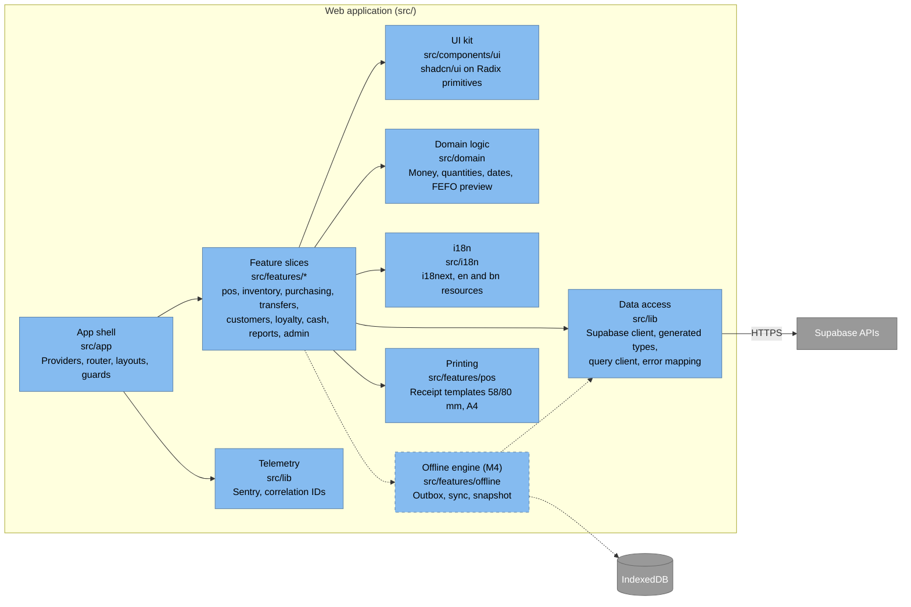

| Component      | Responsibility                                                                                           | Key rule                                                             |
| -------------- | -------------------------------------------------------------------------------------------------------- | -------------------------------------------------------------------- |
| App shell      | Compose providers (TanStack Query, i18n, auth, branch context), define routes, layouts, error boundaries | The only place that knows about all features                         |
| Feature slices | Screens, hooks, schemas and API calls for one business capability                                        | Talk to other slices only through their `index.ts` public API        |
| UI kit         | Accessible primitives (button, dialog, combobox, table) owned as source                                  | No business logic, no data fetching                                  |
| Domain logic   | Pure functions: paisa arithmetic and formatting, pack-to-base-unit conversion, Dhaka dates, previews     | No React, no Supabase; 90 percent line coverage threshold in Vitest  |
| Data access    | Single Supabase client, `database.types.ts`, query client defaults, RPC wrapper with error mapping       | The only module that imports `@supabase/supabase-js`                 |
| i18n           | Language detection and switching, resource loading, number and date formatting helpers                   | No hard-coded user-facing strings outside resource files             |
| Telemetry      | Sentry initialization, PII scrubbing, correlation IDs                                                    | Never sends customer names, phones or prescription data              |
| Offline engine | Outbox, sync loop, snapshot refresh, exception handling (M4)                                             | Uses the same Zod schemas and RPCs as online flows                   |
| Printing       | Receipt and report print layouts using CSS `@page`                                                       | Prints only server-confirmed data (invoice number from the database) |

### 6.2 Database components

The database is structured into schemas with distinct exposure and privileges. Objects inside each
schema are catalogued in the [database design](../database/database-design.md).

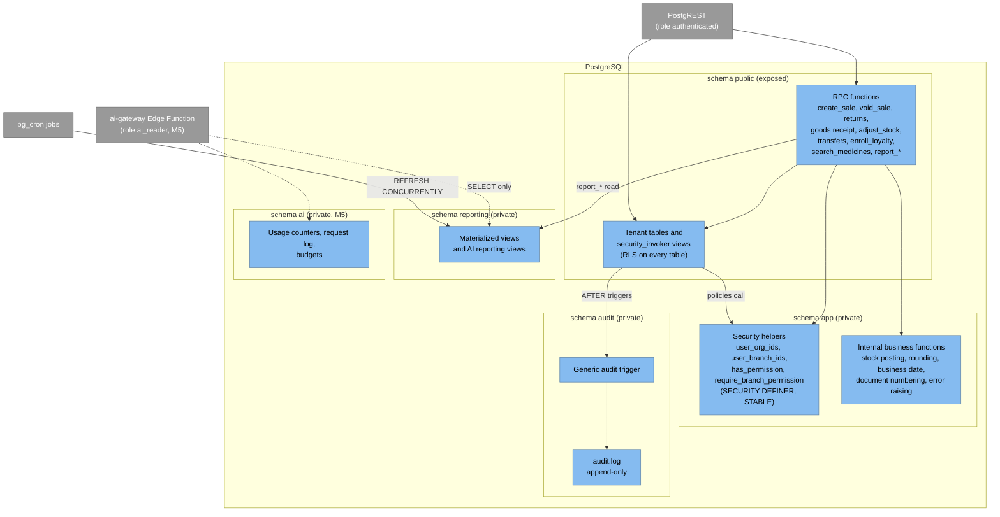

| Schema           | Exposed by PostgREST | Contents                                                                                | Access                                                                                |
| ---------------- | -------------------- | --------------------------------------------------------------------------------------- | ------------------------------------------------------------------------------------- |
| `public`         | Yes                  | Tenant tables and views the UI reads; RPC functions for business writes and heavy reads | `authenticated` through grants plus RLS; `anon` has no privileges on business objects |
| `app`            | No                   | Security helper functions used by RLS and RPCs; internal business functions             | Execute granted only where required; never called directly by clients                 |
| `audit`          | No                   | `audit.log` and the trigger function that writes it                                     | Insert only through the trigger; no `UPDATE` or `DELETE` privilege for any role       |
| `reporting`      | No                   | Materialized views for analytics; tenant-filtered, PII-free views for AI (M5)           | Read through `public.report_*` functions; `ai_reader` may select allow-listed views   |
| `ai` (M5)        | No                   | AI usage counters, request log, monthly budgets                                         | AI gateway only                                                                       |
| Supabase-managed | Partly               | `auth`, `storage`, `cron`, `extensions` (`pg_trgm`, `pgcrypto`, `pg_stat_statements`)   | Managed by Supabase; application code never writes to `auth` directly                 |

Materialized views do not support RLS, so they are never exposed directly; every read goes through a
function that checks tenant and branch access first.

### 6.3 Edge Function components

All functions live in `supabase/functions/` and share modules from `supabase/functions/_shared/`.

| Shared module   | Responsibility                                                                                   |
| --------------- | ------------------------------------------------------------------------------------------------ |
| `auth.ts`       | Verify the caller's JWT with Supabase Auth, load memberships, require AAL2 where needed          |
| `cors.ts`       | Allow only the production, staging and preview origins of the web app                            |
| `errors.ts`     | Uniform error envelope `{ error: { code, message, requestId } }` and HTTP status mapping         |
| `log.ts`        | Structured JSON logs (request ID, function, organization ID, latency, outcome); no personal data |
| `rate-limit.ts` | Per-user and per-organization counters stored in the database                                    |
| `schemas.ts`    | Zod schemas for every request body                                                               |

The internal components of the AI gateway are shown in section 16.3.

---

## 7. Technology stack

Exact versions are pinned in `package.json` and `pnpm-lock.yaml` and updated by Dependabot; this
table records the choice and the reason, not patch versions. The last column links the accepted ADR
that records the choice; "Backlog" marks a decision listed in the ADR backlog but not yet recorded, and
supporting libraries without their own ADR fall under the [ADR index](../adr/README.md) (section 23).

| Layer                    | Choice                                                                                  | Rationale                                                                                                               | Alternatives considered                     | Decision record                                                               |
| ------------------------ | --------------------------------------------------------------------------------------- | ----------------------------------------------------------------------------------------------------------------------- | ------------------------------------------- | ----------------------------------------------------------------------------- |
| Language                 | TypeScript (strict) in the web app and Edge Functions; SQL and PL/pgSQL in the database | One language across client and server code; strict mode catches null and type errors at build time                      | JavaScript, Go for functions                | [ADR-0003](../adr/0003-react-vite-typescript-spa.md)                          |
| UI framework             | React 19                                                                                | Largest ecosystem, mature accessibility libraries, easy hiring in Bangladesh                                            | Vue, Svelte, Angular                        | [ADR-0003](../adr/0003-react-vite-typescript-spa.md)                          |
| Build tool               | Vite                                                                                    | Fast dev server and builds, first-class TypeScript, simple static output for Cloudflare Pages                           | Next.js (server features not needed)        | [ADR-0003](../adr/0003-react-vite-typescript-spa.md)                          |
| Routing                  | React Router (data router, lazy route modules)                                          | Code splitting per feature, route-level error boundaries, navigation blocking for unsaved carts                         | TanStack Router                             | [ADR index](../adr/README.md)                                                 |
| Server state             | TanStack Query                                                                          | Caching, invalidation, retries and request de-duplication without a global store                                        | Redux Toolkit Query, SWR                    | [ADR index](../adr/README.md)                                                 |
| Forms and validation     | React Hook Form with Zod (via `@hookform/resolvers`)                                    | Performant uncontrolled forms; one Zod schema types the form and the RPC payload                                        | Formik, Yup                                 | [ADR index](../adr/README.md)                                                 |
| Styling and components   | Tailwind CSS with shadcn/ui on Radix primitives                                         | Accessible primitives (focus management, ARIA) owned as source code; consistent design tokens                           | MUI, Ant Design (heavier, harder to theme)  | [ADR index](../adr/README.md)                                                 |
| Internationalization     | i18next with react-i18next                                                              | Mature pluralization and interpolation, lazy resources, Bangla support                                                  | FormatJS                                    | [ADR index](../adr/README.md)                                                 |
| Charts                   | Recharts (lazy-loaded in reports only)                                                  | Declarative React charts, adequate for dashboards                                                                       | Chart.js, ECharts                           | [ADR index](../adr/README.md)                                                 |
| PWA                      | vite-plugin-pwa (Workbox), planned                                                      | Installable app, app-shell caching, controlled update prompts                                                           | Hand-written service worker                 | [ADR index](../adr/README.md)                                                 |
| Offline storage (M4)     | IndexedDB through the `idb` wrapper, planned                                            | Durable, transactional browser storage; tiny wrapper                                                                    | Dexie, localStorage (not durable enough)    | Backlog ([ADR index](../adr/README.md))                                       |
| Backend platform         | Supabase (managed PostgreSQL, PostgREST, Auth, Edge Functions, Storage)                 | Postgres-native security (RLS), no servers to run, generous free tier, portable SQL                                     | Firebase (no SQL), custom Node API on a VPS | [ADR-0002](../adr/0002-supabase-postgresql-over-firebase.md)                  |
| Database                 | PostgreSQL 17 (Supabase default; design requires 15 or later)                           | Transactions, constraints, RLS, `pg_trgm`, `pg_cron`, materialized views, partitioning                                  | MySQL                                       | [ADR-0002](../adr/0002-supabase-postgresql-over-firebase.md)                  |
| API style                | PostgREST for reads; RPC (PostgreSQL functions) for business writes                     | Business invariants enforced in one transaction next to the data; no hand-written CRUD API                              | Custom REST service                         | [ADR-0007](../adr/0007-business-logic-in-transactional-postgres-functions.md) |
| Authorization            | Row Level Security on every table with helper functions                                 | Isolation enforced by the database for every access path                                                                | Application-level checks only               | [ADR-0006](../adr/0006-multi-tenant-organization-branch-model-with-rls.md)    |
| Authentication           | Supabase Auth: email and password, TOTP MFA, PKCE                                       | Built in, MFA assurance level available to RLS                                                                          | Auth0, Clerk                                | [ADR-0002](../adr/0002-supabase-postgresql-over-firebase.md)                  |
| Server functions         | Supabase Edge Functions (Deno, TypeScript)                                              | Secrets stay server-side; same language as the web app                                                                  | Cloudflare Workers                          | [ADR-0002](../adr/0002-supabase-postgresql-over-firebase.md)                  |
| File storage             | Supabase Storage (private buckets, signed URLs)                                         | Same RLS model as the database                                                                                          | Cloudflare R2                               | [ADR-0002](../adr/0002-supabase-postgresql-over-firebase.md)                  |
| Scheduling               | `pg_cron` (Supabase Cron)                                                               | Jobs run next to the data; no extra scheduler                                                                           | GitHub Actions cron for everything          | [ADR-0002](../adr/0002-supabase-postgresql-over-firebase.md)                  |
| Money representation     | `BIGINT` paisa in the database, branded integer type in TypeScript                      | Exact arithmetic, deterministic rounding                                                                                | `NUMERIC` everywhere, floats (rejected)     | [ADR-0005](../adr/0005-money-as-integer-paisa.md)                             |
| Hosting                  | Cloudflare Pages                                                                        | Free tier allows commercial use, unlimited static bandwidth, PR previews, global CDN with edge locations close to Dhaka | Vercel (free tier non-commercial), Netlify  | [ADR-0004](../adr/0004-cloudflare-pages-hosting.md)                           |
| Unit and component tests | Vitest, Testing Library, fast-check (property tests)                                    | Fast, Vite-native; property tests for money and FEFO logic                                                              | Jest                                        | Backlog ([ADR index](../adr/README.md))                                       |
| Database tests           | pgTAP via `supabase test db`                                                            | Tests functions, constraints and RLS inside PostgreSQL                                                                  | Integration tests only                      | Backlog ([ADR index](../adr/README.md))                                       |
| End-to-end tests         | Playwright (Chromium), axe-core accessibility checks                                    | Reliable browser automation, trace viewer                                                                               | Cypress                                     | Backlog ([ADR index](../adr/README.md))                                       |
| Code quality             | ESLint (flat config, jsx-a11y), Prettier, Husky, lint-staged, commitlint                | Consistent style, Conventional Commits enforced locally and in CI                                                       | None                                        | [ADR index](../adr/README.md)                                                 |
| CI/CD                    | GitHub Actions                                                                          | Native to the repository, free minutes for small teams, Supabase CLI support                                            | GitLab CI                                   | Backlog ([ADR index](../adr/README.md))                                       |
| Monitoring               | Sentry (frontend), Supabase logs and reports, external uptime monitor                   | Low cost, adequate for one region and a small team                                                                      | Self-hosted Grafana stack                   | [ADR index](../adr/README.md)                                                 |
| Package manager, runtime | pnpm, Node 22 LTS                                                                       | Fast, strict dependency resolution; LTS runtime                                                                         | npm, Yarn                                   | [ADR index](../adr/README.md)                                                 |
| AI (M5)                  | Anthropic Claude API through the official TypeScript SDK in an Edge Function            | Strong reasoning and vision, structured outputs, prompt caching, batch discounts                                        | Other LLM providers                         | Backlog ([ADR index](../adr/README.md))                                       |

---

## 8. Repository layout

PIMS is a single application repository. Paths marked "planned" are created by the milestone that
needs them.

```text
Pharmacy_Inventory/
├── .github/
│   ├── workflows/
│   │   ├── ci.yml                 # quality, database (pgTAP), e2e, gitleaks, dependency review
│   │   ├── codeql.yml             # static analysis (weekly and per PR)
│   │   ├── deploy.yml             # planned: migrations and functions to staging (main) and production (tags)
│   │   └── backup.yml             # planned: nightly encrypted pg_dump while on the free tier
│   ├── ISSUE_TEMPLATE/
│   ├── pull_request_template.md
│   ├── CODEOWNERS                 # supabase/migrations and supabase/functions need a database owner review
│   └── dependabot.yml
├── .husky/                        # pre-commit (lint-staged), commit-msg (commitlint)
├── docs/                          # this documentation set, see docs/README.md
├── e2e/                           # Playwright specs, fixtures and page objects
├── public/                        # copied verbatim: _headers (security headers), icons, PWA manifest
├── scripts/                       # developer and operations scripts (seed generation, backup helpers, checks)
├── src/                           # web application, see section 9.1
├── supabase/
│   ├── config.toml                # local stack configuration (ports, auth, MFA)
│   ├── migrations/                # forward-only SQL migrations: <timestamp>_<description>.sql
│   ├── seed.sql                   # synthetic data for local and CI; never applied to production
│   ├── tests/                     # pgTAP tests: schema, functions, RLS isolation matrix
│   └── functions/
│       ├── _shared/               # auth, CORS, errors, logging, rate limiting, Zod schemas
│       ├── admin-users/           # invite, deactivate, revoke sessions, reset MFA (M2)
│       ├── health/                # uptime probe target (M4)
│       └── ai-gateway/            # all AI features (M5)
├── .env.example                   # public build-time variables only (VITE_*)
├── CHANGELOG.md, CONTRIBUTING.md, README.md, SECURITY.md
├── index.html, package.json, pnpm-lock.yaml
└── vite.config.ts, tsconfig*.json, eslint.config.js, playwright.config.ts
```

Rules:

- Generated files (`src/lib/database.types.ts`) are committed and regenerated with `pnpm gen:types`;
  CI fails when migrations change without regenerated types.
- Nothing in `public/` or any `VITE_*` variable may contain a secret; both ship to every browser.
- Environment-specific configuration lives in Cloudflare Pages, GitHub Environments and Supabase
  secrets (section 14.2), never in committed files.

---

## 9. Frontend architecture

### 9.1 Feature-sliced structure and dependency rules

The web app is organized by business capability ("feature slices") rather than by technical type,
so that a change to purchasing touches one folder.

```text
src/
├── app/                  # composition root: App, providers, router, layouts, route guards, error boundaries
├── features/
│   ├── auth/             # sign-in, MFA enrolment and challenge, invitation acceptance, password reset
│   ├── pos/              # search, cart, payments, receipt printing, parked bills
│   ├── sales/            # invoice list and detail, returns, voids
│   ├── catalog/          # medicines, generics, manufacturers, pack units, barcodes
│   ├── inventory/        # batch stock, adjustments, cycle counts, expiry views
│   ├── purchasing/       # suppliers, purchase orders, goods receipt, supplier payments and returns
│   ├── transfers/        # inter-branch transfer requests, dispatch, receipt
│   ├── customers/        # profiles, dues (বাকি), collections, purchase history
│   ├── loyalty/          # plans, memberships, card lookup, renewals
│   ├── cash/             # cash register sessions, expenses
│   ├── reports/          # dashboards, report viewers, CSV/XLSX/PDF export
│   ├── notifications/    # in-app notification centre
│   ├── admin/            # organization, branches, users, settings
│   ├── offline/          # M4: outbox, sync engine, snapshot
│   └── ai/               # M5: smart search, ask-your-data, prescription reading, insights
├── components/ui/        # shadcn/ui primitives (owned source, Radix based)
├── domain/               # pure TypeScript: money, quantities, dates, FEFO preview
├── i18n/                 # i18next initialization and locales/en.json, locales/bn.json
├── lib/                  # supabase client, env validation, database.types.ts, query client, telemetry, cn
├── styles/               # Tailwind entry and design tokens
└── test/                 # test setup and shared test utilities
```

Inside a slice:

```text
src/features/purchasing/
├── index.ts              # public API: route objects and the few exports other slices may use
├── routes/               # lazily loaded route modules (screens)
├── components/           # slice-specific components
├── api/                  # query keys, queryOptions, mutation hooks; the only code that calls Supabase
├── model/                # slice-local reducers and selectors
├── schemas/              # Zod schemas for forms and RPC payloads
└── *.test.ts(x)          # tests co-located with the code they test
```

| Layer           | May import                                                                | Must not import                |
| --------------- | ------------------------------------------------------------------------- | ------------------------------ |
| `app`           | Everything                                                                | Nothing is off limits          |
| `features/<x>`  | `components/ui`, `domain`, `i18n`, `lib`, another slice's `index.ts` only | Another slice's internal files |
| `components/ui` | `lib/cn`                                                                  | `features`, `domain`, Supabase |
| `domain`        | Nothing outside `domain`                                                  | React, Supabase, browser APIs  |
| `lib`           | `domain` types                                                            | `features`, `app`              |

These rules are enforced by ESLint import restrictions in CI (details in
[engineering standards](../engineering/engineering-standards.md)).

### 9.2 Routing and navigation

React Router's data router defines the route tree in `src/app/router.tsx`. Each feature exports
lazily loaded route modules, so a Salesman downloads the POS bundle without the reports bundle.

| Path pattern                         | Screen                                            | Guards (UI only; the database enforces) |
| ------------------------------------ | ------------------------------------------------- | --------------------------------------- |
| `/sign-in`, `/reset-password`        | Authentication                                    | Public                                  |
| `/mfa`                               | TOTP enrolment or challenge                       | Signed in                               |
| `/invite/accept`                     | Accept invitation, set password                   | Valid invitation link                   |
| `/b/:branchCode/pos`                 | Point of sale (full-screen layout)                | Signed in, MFA satisfied, branch access |
| `/b/:branchCode/sales`               | Invoices, returns, voids                          | Branch access                           |
| `/b/:branchCode/inventory`           | Batch stock, adjustments, counts, expiry          | Branch access                           |
| `/b/:branchCode/purchasing`          | Purchase orders, goods receipt, supplier payments | Branch access, purchasing permission    |
| `/b/:branchCode/transfers`           | Transfer requests, dispatch, receipt              | Branch access                           |
| `/b/:branchCode/cash`                | Cash sessions, expenses                           | Branch access                           |
| `/catalog`, `/customers`, `/loyalty` | Organization-wide master data                     | Permission per screen                   |
| `/reports/*`                         | Dashboards and reports                            | Report permission                       |
| `/settings/*`                        | Organization, branches, users, policies           | Settings permission (Owner by default)  |
| `/ai`                                | Ask-your-data, insights (M5)                      | Owner, AI enabled for the organization  |

Design decisions:

- **Branch in the URL.** The active branch is part of the path (`MPR` for Mohammadpur, for example),
  which makes deep links, bookmarks and multiple tabs on different branches safe. The last used
  branch is remembered per user in `localStorage` only to choose the landing page after sign-in.
- **Guards are for usability.** `RequireSession`, `RequireMfa`, `RequireBranchAccess` and
  `RequirePermission` redirect early so users do not see empty screens, but every request is
  re-authorized by RLS and RPC checks. The permission matrix lives in the
  [security model](../security/security-model.md).
- **Unsaved work.** The POS and goods-receipt screens use navigation blocking to warn before leaving
  with an unsaved cart or form.

### 9.3 State management

PIMS keeps client state minimal. Server data is cached, not copied into a store.

| Kind of state       | Examples                                                            | Owner                                         | Persistence                                                                          |
| ------------------- | ------------------------------------------------------------------- | --------------------------------------------- | ------------------------------------------------------------------------------------ |
| Server state        | Stock, medicines, invoices, customers, reports                      | TanStack Query cache                          | Memory (catalog snapshot in IndexedDB from M4)                                       |
| URL state           | Active branch, filters, date ranges, pagination, open tab           | React Router path and search params           | URL                                                                                  |
| Form state          | Goods receipt, customer profile, loyalty plan                       | React Hook Form                               | Memory; long forms keep a local draft                                                |
| Session state       | Auth session, current user, memberships, active organization        | supabase-js and an `AuthProvider` context     | supabase-js storage                                                                  |
| POS working state   | Cart lines, selected customer or loyalty card, payments in progress | `useReducer` inside the POS slice             | `sessionStorage` (survives reload of the tab)                                        |
| Parked (held) bills | Bills put aside while serving another customer                      | Server, per branch (FR-POS-037 to FR-POS-039) | Database; no invoice number, no stock reservation, discarded at end of business date |
| Ephemeral UI state  | Open dialogs, hover, focus                                          | Component `useState`                          | None                                                                                 |

There is no global client-state library (Redux, Zustand) in v1. Adding one requires an ADR.

Query conventions:

- **Tenant-scoped query keys.** Every key starts with the scope, for example
  `['org', orgId, 'branch', branchId, 'stock', filters]`, so switching organization or branch can never
  show another scope's cached data. Sign-out calls `queryClient.clear()`.
- **Defaults** (set in `src/main.tsx`): `staleTime` 30 seconds, one retry for queries, no refetch on
  window focus, and no automatic TanStack Query retry for mutations. Writes are retried only by the RPC
  wrapper (section 9.4), always with the same idempotency key.
- **Per-query overrides:** catalog 5 minutes; POS stock 15 seconds and invalidated after every sale;
  reports 5 minutes; settings 10 minutes; notifications polled every 60 seconds.
- **Invalidation after writes:** for example, a successful `create_sale` invalidates the branch stock,
  the sales list, the dashboard summary and, when relevant, the customer due and loyalty membership.
- **No optimistic updates for money or stock.** The server computes totals; the UI waits for the
  confirmed result. Optimistic updates are allowed for low-risk UI such as marking a notification read.

### 9.4 Data access layer

- **One client.** `src/lib/supabase.ts` creates the only Supabase client with the public anon key, PKCE
  flow and automatic token refresh. Build-time variables are validated with Zod in `src/lib/env.ts`.
- **Generated types.** `src/lib/database.types.ts` is generated from the local database
  (`pnpm gen:types`), so table rows and RPC arguments are type-checked.
- **Only `api/` modules call Supabase.** Components use hooks such as `useBranchStock()` or
  `useCreateSale()`; this keeps data access testable and replaceable.
- **RPC wrapper.** A small `callRpc(name, args)` helper adds the correlation ID header, applies the
  idempotency key (`p_client_request_id`) where required, retries network failures and server errors at
  most 3 times with exponential backoff using the same key (NFR-AVAIL-005), shows "saving", "saved" or
  "failed, retry", and converts database errors into a typed `AppError`
  (`code`, `messageKey`, `hint`, `retryable`). Business-rule errors are never retried.
- **Error contract.** Database functions raise errors through `app.fail(code, message, hint)`: SQLSTATE
  `P0001`, the stable machine-readable code in the error `DETAIL` and an optional user hint in `HINT`
  (codes are catalogued in the [database design](../database/database-design.md)). The client maps each
  code to an i18n key (`errors.<code>`) and never displays raw database messages. Unknown errors show a
  generic message with a short correlation ID and are reported to Sentry.
- **No personal data in URLs.** Lookups by phone number or card number use RPC `POST` bodies, not query
  strings, so they do not appear in gateway logs.
- **Pagination.** Keyset pagination (`created_at`, `id`) for ledgers and invoices; offset pagination for
  short lists. PostgREST `max_rows` is capped at 1,000 as a safety net.

### 9.5 Forms and validation

- React Hook Form with `zodResolver`; each slice keeps its Zod schemas in `schemas/`, and
  `z.infer` provides the TypeScript types for both the form and the RPC payload.
- Money is entered as text and parsed with `parseTaka()` from `src/domain/money.ts` into integer paisa;
  it is never parsed with `parseFloat`.
- Quantities are entered in pack units (box, strip, piece) and converted to base units with the
  conversion factors from the catalog; the RPC always receives base units.
- Server errors are mapped back to fields with `setError` when the error carries a field path
  (for example, `lines[2].batch_no`).
- **Idempotency key per intent.** The key is generated when a submission dialog opens (for example, the
  payment dialog), reused for every retry of that submission and discarded after success. Double clicks
  and network retries therefore cannot create duplicates.
- Client-side validation mirrors server rules for fast feedback, but the server re-validates
  everything; a passing form is never assumed to be a valid transaction.

### 9.6 Internationalization and localization

- Languages: English (default) and Bangla (`bn-BD`). The choice is stored in the user's profile and
  cached locally; it can be switched at any time without reloading.
- Resources live in `src/i18n/locales/en.json` and `bn.json`, with keys grouped by feature prefix
  (`pos.*`, `inventory.*`, `errors.*`). They can be split into lazily loaded namespaces if the bundle
  grows. A CI script checks that both languages have the same key set.
- No string concatenation for sentences; interpolation and i18next plural rules are used instead.
- Currency is formatted from paisa with South Asian digit grouping (`৳1,23,456.50`) by `formatTaka()`;
  the Bangla interface uses Bangla digits (`৳১,২৩,৪৫৬.৫০`) unless the organization chooses Latin digits
  (NFR-I18N-004, CFG-38). Dates use DD/MM/YYYY and 12-hour time, always formatted with
  `timeZone: 'Asia/Dhaka'`, never the browser's zone, so a terminal with a wrong zone setting still shows
  correct business dates.
- A Bangla-capable font (for example Noto Sans Bengali) is self-hosted, consistent with the
  `font-src 'self'` Content Security Policy.
- Catalog data (brand and generic names) is stored as entered, normally English; receipts can be
  printed in either language per branch setting.

### 9.7 Accessibility

Target: WCAG 2.1 level AA for every screen.

- Radix primitives provide focus trapping, roles and keyboard behaviour for dialogs, menus, comboboxes
  and tabs.
- **Keyboard-first POS.** A complete sale (search, quantity, customer, payment, print) is possible
  without a mouse. Proposed default shortcuts: `F2` focus search, `Enter` add the highlighted item,
  `+` and `-` change quantity, `Delete` remove a line, `F4` customer or loyalty lookup, `F6` park bill,
  `F8` recall parked bill, `F9` open payment, `Ctrl+Enter` confirm payment, `Esc` close dialog.
  Browser-reserved keys (`F1`, `F3`, `F5`, `F11`, `F12`) are avoided, and every chosen key (in
  particular `F6`, which Chrome also uses for the address bar) is verified as capturable in Chrome and
  Edge on Windows. The full indicative map is in Appendix C of the [SRS](../requirements/SRS.md); the
  final map is fixed in the UX specification.
- An `aria-live="polite"` region announces cart total changes; stock and validation errors use
  `aria-live="assertive"`.
- Colour is never the only signal: expiry and stock states combine colour, icon and text.
- Text contrast of at least 4.5:1, visible focus rings, touch targets of at least 44 by 44 px on tablet
  layouts, layouts usable at 320 px width and at 200 percent zoom.
- Verification: `eslint-plugin-jsx-a11y` in CI, axe-core checks in Playwright on key screens (no
  serious or critical violations allowed), and a manual screen-reader smoke test (NVDA) before each
  release.

### 9.8 Counter peripherals and printing

- **Barcode scanners.** Scanners act as keyboards and end each code with `Enter`. The POS search field
  detects scanner bursts (6 or more characters with under 30 ms between keystrokes) and performs an
  exact barcode lookup immediately, bypassing the 150 ms typing debounce used for text search.
- **Receipts.** Receipts are React print layouts with CSS `@page` sizes for 58 mm, 80 mm and A4,
  printed with `window.print()`. Counter PCs can run Chrome with kiosk printing enabled so receipts
  print without a dialog; setup steps are in the [runbook](../operations/runbook.md).
- A receipt is printed only after the server confirms the sale and returns the invoice number; a
  reprint is always available from the invoice screen.
- Cash drawers and direct ESC/POS printing are out of scope for v1.

### 9.9 Progressive Web App

- `vite-plugin-pwa` (Workbox) generates the service worker and web manifest (name, icons, standalone
  display, theme colour). Installability ships early (M2) because it is cheap; offline data arrives in M4.
- **Precache:** the hashed build assets and `index.html` (app shell), with navigation fallback to
  `index.html`.
- **No API caching in the service worker.** Requests to `*.supabase.co` are never cached by Workbox;
  business data caching is controlled by the application with explicit rules (section 15).
- **Update flow:** `registerType: 'prompt'`. A new version shows an "Update available" banner; the app
  never reloads itself, and the POS applies the update only when the cart is empty.
- **Caching headers:** `public/_headers` keeps `index.html` at `no-cache` and hashed assets immutable;
  the service worker file must also be served with `no-cache` so updates are detected.

### 9.10 Frontend security notes

- Only public values are bundled (`VITE_SUPABASE_URL`, `VITE_SUPABASE_ANON_KEY`, `VITE_SENTRY_DSN`).
  The service role key and all API keys stay in Edge Functions.
- A strict Content Security Policy and other headers are defined in `public/_headers`
  (`script-src 'self'`, `connect-src` limited to Supabase and Sentry, `frame-ancestors 'none'`).
- React escapes output by default; `dangerouslySetInnerHTML` is forbidden by lint rules.
- Counter PCs are shared, so every person has an individual account. The app locks after 15 minutes of
  inactivity (CFG-31) and asks for the password while keeping the cart; a session never lasts more than
  12 hours without a full sign-in (FR-IAM-011). Details are in the
  [security model](../security/security-model.md).
- Sign-out clears the query cache and session storage, and clears IndexedDB unless unsynced offline
  sales exist (section 15.5).
- Sentry runs with `sendDefaultPii: false`, a `beforeSend` scrubber and session replay disabled.

---

## 10. Backend architecture

### 10.1 Supabase project topology

| Project        | Region                       | Purpose                                            | Plan                                                |
| -------------- | ---------------------------- | -------------------------------------------------- | --------------------------------------------------- |
| Local stack    | Developer machine (Docker)   | Development, CI test runs                          | Supabase CLI                                        |
| `pims-staging` | Singapore (`ap-southeast-1`) | Integration, UAT, migration rehearsal, PR previews | Free (may pause after 7 days without activity)      |
| `pims-prod`    | Singapore (`ap-southeast-1`) | Production                                         | Free at pilot, Pro when section 20 triggers are met |

Production and staging never share data, keys or users. Schema changes reach both only through
migrations from the repository; editing the schema in the Supabase dashboard is forbidden in staging and
production, and weekly drift detection (`supabase db diff` against staging) catches violations.

### 10.2 Database organization

The schema layout is shown in section 6.2. Additional hardening:

- PostgREST exposes only `public`. PIMS does not use GraphQL, so the `pg_graphql` endpoint (exposed
  through `graphql_public` in the default configuration) is disabled in staging and production to reduce
  attack surface.
- `anon` has no privileges on business tables, views or functions; default privileges in `public` are
  revoked and granted explicitly per object.
- Extensions live in the `extensions` schema; `pg_trgm` supports fuzzy medicine search, `pg_cron`
  runs scheduled jobs and `pg_stat_statements` supports performance analysis.

### 10.3 API surface: reads through PostgREST, writes through RPC

| Tier | Data                                                                                                                 | Read path                                | Write path                                                                                                                 |
| ---- | -------------------------------------------------------------------------------------------------------------------- | ---------------------------------------- | -------------------------------------------------------------------------------------------------------------------------- |
| 1    | Stock, sales, returns, purchases, payments, transfers, cash sessions, loyalty usage, customer dues                   | PostgREST `GET` under RLS, or read RPCs  | **RPC only.** `INSERT`, `UPDATE`, `DELETE` revoked from `authenticated`                                                    |
| 2    | Master and reference data: medicines, generics, manufacturers, suppliers, customer profiles, loyalty plans, settings | PostgREST `GET` under RLS                | PostgREST DML under RLS `WITH CHECK` policies and column privileges, or RPC when validation spans rows; audited by trigger |
| 3    | Ledgers and audit (`inventory_movements`, `audit.log`, due ledgers)                                                  | PostgREST `GET` under RLS or report RPCs | **No client writes at all**; rows are written only by Tier 1 functions and triggers                                        |

Heavy or multi-table reads (POS search, dashboards, reports) are `STABLE` RPC functions such as
`search_medicines` and `report_*`, which PostgREST runs in read-only transactions. The authoritative
classification of every table is in the [database design](../database/database-design.md). The
RPC-first write path is recorded in
[ADR-0007](../adr/0007-business-logic-in-transactional-postgres-functions.md); the append-only stock
ledger with FEFO allocation that the Tier 1 and Tier 3 rows depend on is recorded in
[ADR-0008](../adr/0008-append-only-inventory-ledger-with-fefo.md).

### 10.4 RPC design conventions

Business-critical write functions follow the same template
([ADR-0007](../adr/0007-business-logic-in-transactional-postgres-functions.md)). Examples are
`create_sale`, `void_sale`, `process_sale_return`, `process_purchase_return`, `receive_goods`,
`adjust_stock`, `request_stock_transfer`, `dispatch_stock_transfer`, `receive_stock_transfer`,
`enroll_loyalty`, `record_customer_payment` and `record_supplier_payment`. Names, signatures and status
(implemented or designed) are defined only in the
[database design, section 8.5](../database/database-design.md#85-public-rpc-summary); this document uses
those names.

| Concern       | Convention                                                                                                                                                                                                                                                                                                                                                                                                                                                                                                                                                                                                                         |
| ------------- | ---------------------------------------------------------------------------------------------------------------------------------------------------------------------------------------------------------------------------------------------------------------------------------------------------------------------------------------------------------------------------------------------------------------------------------------------------------------------------------------------------------------------------------------------------------------------------------------------------------------------------------- |
| Naming        | `verb_noun` in snake_case; parameters prefixed `p_`; returns a JSON object with IDs, human-readable codes and computed totals                                                                                                                                                                                                                                                                                                                                                                                                                                                                                                      |
| Privilege     | `SECURITY DEFINER`, `SET search_path = ''`, every object schema-qualified, owned by the migration role, never by a role that clients can assume; `EXECUTE` revoked from `PUBLIC` and `anon`, granted to `authenticated`                                                                                                                                                                                                                                                                                                                                                                                                            |
| Authorization | The first statement checks tenancy and permission explicitly, for example `app.require_branch_permission(p_branch_id, 'sales.create')`, which also enforces MFA for Owner and Manager permissions; this is required because `SECURITY DEFINER` bypasses RLS                                                                                                                                                                                                                                                                                                                                                                        |
| Validation    | Every referenced ID is checked to belong to the caller's organization; quantities positive; dates sane; enums valid                                                                                                                                                                                                                                                                                                                                                                                                                                                                                                                |
| Transaction   | PostgREST wraps each call in one transaction; any error rolls back everything, including counter increments, so invoice numbers stay gapless                                                                                                                                                                                                                                                                                                                                                                                                                                                                                       |
| Locking       | One global lock order for every function ([database design, section 9.3](../database/database-design.md#93-locking-strategy-and-canonical-lock-order)): document header -> customer -> supplier -> loyalty card and membership -> point lots -> batches `FOR UPDATE ORDER BY medicine_id, expiry_date, received_at, id` -> cash session `FOR SHARE` -> document counters -> controlled-register advisory locks -> daily summary. Locks up to the cash session are taken in a validation phase before the first write; `lock_timeout` is 3 s and a timeout or deadlock returns `busy_retry`. No external calls inside a transaction |
| Idempotency   | Document-creating functions take a client-generated `p_client_request_id uuid`. The function first calls `app.claim_request()`, which takes a transaction-scoped advisory lock on the organization and request ID so concurrent duplicates serialize, and only then looks up the stored request; the key is unique per organization and stored with a `request_hash` of the canonical request. A replay with the same hash returns the original result, the same ID with a different hash fails with `request_id_conflict`; IDs are honoured for at least 7 days (NFR-REL-006, database design section 9.5)                        |
| Money         | All prices, discounts, loyalty benefits, rounding and totals are computed in the function from database data and returned to the client; submitted payments are validated against the computed total (for example `overpayment`), so a stale client preview cannot produce a wrong invoice                                                                                                                                                                                                                                                                                                                                         |
| Errors        | Raised through `app.fail(code, message, hint)` (SQLSTATE `P0001`, code in `DETAIL`); codes are stable and catalogued in the database design; SQL details are never exposed                                                                                                                                                                                                                                                                                                                                                                                                                                                         |
| Time budget   | Designed for under 500 ms at p95; the `authenticated` role keeps a statement timeout as a safety net                                                                                                                                                                                                                                                                                                                                                                                                                                                                                                                               |
| Tests         | pgTAP: happy path, each validation error, authorization denial per role, cross-tenant denial, and concurrency cases where relevant                                                                                                                                                                                                                                                                                                                                                                                                                                                                                                 |

### 10.5 Row Level Security

- RLS is enabled on every table in every exposed schema, with no permissive default: a table without
  policies returns nothing. The tenancy and RLS model is recorded in
  [ADR-0006](../adr/0006-multi-tenant-organization-branch-model-with-rls.md).
- Policies use helper functions in the private `app` schema, declared `SECURITY DEFINER`, `STABLE`,
  with a fixed empty `search_path`. Helpers read the memberships table for `auth.uid()`; they do not
  rely on custom JWT claims, because claims stay stale until the token refreshes and a deactivated user
  must lose access on the next request.
- Policies call the set-returning helpers `app.user_org_ids()` and `app.user_branch_ids()` inside
  sub-selects, so PostgreSQL evaluates them once per statement rather than once per row. Row-level and
  permission helpers (`app.has_branch_access(branch_id)`, `app.has_permission(organization_id, permission)`,
  `app.can(branch_id, permission)`) are used for permission-gated tables and inside RPCs. Two policies
  from the M1 migrations illustrate the pattern (the [database design](../database/database-design.md)
  and [security model](../security/security-model.md) are authoritative):

```sql
create policy sales_select on public.sales for select to authenticated
  using (branch_id in (select app.user_branch_ids()));

create policy daily_branch_sales_select on public.daily_branch_sales for select to authenticated
  using (branch_id in (select app.user_branch_ids())
         and app.has_permission(organization_id, 'reports.view'));
```

- Every column used by a policy (`organization_id`, `branch_id`) is indexed.
- Views in `public` are created with `security_invoker = true` so the caller's RLS applies.
- Storage objects have RLS policies based on the organization and branch segments of the object path
  (section 10.8).
- Verification: a pgTAP matrix tests every table for every role and operation, plus cross-tenant and
  cross-branch negative cases. `supabase db lint` must be clean before merge (CI `database` job); the
  Supabase Security Advisor is run before each production migration and weekly, with no new errors
  allowed ([security model, section 18.1](../security/security-model.md)).

### 10.6 Authentication and MFA

- Supabase Auth with email and password; public sign-up is disabled. Users join only by invitation
  (FR-IAM-003). An authorized user invites through the `admin-users` Edge Function, which records a
  pending invitation (organization, role, branches, inviter, 72-hour expiry) and asks Supabase Auth to
  send the invitation email; **no membership exists yet**. The membership is created only by
  `accept_invitation()`, called under the invitee's own session. Because acceptance is bound to the
  signed-in account's email, `accept_invitation()` must refuse unless `auth.users.email_confirmed_at` is
  set and the account email equals the invitation email case-insensitively, and the Auth setting
  "secure email change" (confirmation on both the old and the new address) must stay on in every
  environment ([runbook](../operations/runbook.md) baseline). The flow and its threats are owned by the
  [security model, section 7.1](../security/security-model.md); the table and function details by the
  [database design](../database/database-design.md).
- **TOTP MFA is mandatory for Owner and Branch Manager** (FR-IAM-005, NFR-SEC-004). It is enforced in
  two places: the UI routes users with these roles to `/mfa`, and the database refuses their privileges
  unless the JWT's `aal` claim is `aal2`. In the M1 migrations, `app.has_permission` denies every Owner
  and Manager permission at `aal1` while the organization setting `enforce_mfa` is on (the default), so
  no privileged action or permission-gated report works with a password alone. FR-IAM-005 also requires
  that such users cannot read business data before `aal2`; extending the same check to the read helpers
  `app.user_org_ids()` and `app.user_branch_ids()` is tracked as OI-08.
- Salesman accounts may use MFA but are not forced to (shared counter PCs); compensating controls are
  individual accounts, branch-scoped access, role discount limits and the inactivity lock.
- Sessions: access tokens expire after 1 hour (`jwt_expiry = 3600`), refresh tokens rotate with reuse
  detection, and email links use the PKCE flow. Deactivating a user disables the membership immediately
  and revokes refresh tokens through `admin-users`.
- Staging and production use a custom SMTP provider; Supabase's built-in email service is rate-limited
  and intended only for development.
- Password rules, lockout behaviour and optional CAPTCHA (Cloudflare Turnstile is supported by Supabase
  Auth) are specified in the [security model](../security/security-model.md).

### 10.7 Edge Functions

| Function      | Milestone | Invoked by                 | Purpose                                                                                                                       | Secrets used                               | Authorization                                                      |
| ------------- | --------- | -------------------------- | ----------------------------------------------------------------------------------------------------------------------------- | ------------------------------------------ | ------------------------------------------------------------------ |
| `admin-users` | M2        | Web app (HTTPS, user JWT)  | Record invitation (role and branches applied on acceptance), change role and branches, deactivate, revoke sessions, reset MFA | Service role key (injected by the runtime) | Caller verified, AAL2, permitted by the security model's matrix    |
| `health`      | M4        | Uptime monitor             | Check database reachability and report the deployed version                                                                   | None                                       | Public, returns no data, rate-limited                              |
| `ai-gateway`  | M5        | Web app and `pg_cron`      | All AI features (section 16)                                                                                                  | Anthropic API key, AI database role        | Caller verified, AAL2 for Owner, organization AI flag, permissions |
| `notify-sms`  | v2        | `pg_cron` through `pg_net` | Loyalty expiry and due reminders                                                                                              | SMS gateway credentials                    | Scheduler-only shared secret                                       |

Conventions:

- JWT verification stays enabled except for `health`. Functions call PostgREST with the caller's JWT so
  RLS applies; the service role key is used only where an Auth admin API requires it.
- Request bodies are validated with Zod; responses use the shared error envelope; CORS allows only the
  app's origins.
- Outbound calls have explicit timeouts; scheduled invocations are idempotent.
- Functions never write stock or money tables directly; they call the same RPCs as the UI.

### 10.8 Storage

| Bucket          | Visibility | Contents                                                | Limits                                      |
| --------------- | ---------- | ------------------------------------------------------- | ------------------------------------------- |
| `prescriptions` | Private    | Prescription photos for controlled sales and AI reading | 5 MB per object; JPEG, PNG and WebP only    |
| `org-assets`    | Private    | Organization logos and receipt headers                  | 1 MB per object; PNG and JPEG only (no SVG) |

- Object paths follow `{organization_id}/{branch_id}/{yyyy}/{mm}/{uuid}.{ext}`; storage RLS policies
  check the organization and branch segments against the caller's memberships.
- Images are compressed in the browser before upload (longest edge 1,600 px, target under 500 KB) and
  EXIF metadata (GPS, device) is removed (FR-AI-004), which also keeps storage within the free tier for
  longer.
- Files are read through signed URLs valid for at most 300 seconds; every view of a prescription image
  is audited; no bucket is public.
- Prescription images are retained for 6 years when linked to a controlled-drug sale and 2 years
  otherwise (NFR-PRIV-004, CFG-28), then purged by a scheduled job.

### 10.9 Scheduled jobs

Scheduled work runs in two places. Schedules are written in UTC; Asia/Dhaka is UTC+6 all year.

**Database jobs.** `pg_cron` calls the `app.job_*` functions next to the data: loyalty expiry and
reminders, discarding held bills of the previous business date (FR-POS-039), the stock-value snapshot,
the refresh of reporting materialized views, integrity checks (NFR-REL-003, NFR-REL-004), the daily
expiry and low-stock digests (CFG-26), transfer escalation, and retention purges. Their functions,
times and milestones are defined only in
[database design, section 17.1](../database/database-design.md#171-jobs), which is the single source for
these schedules; this document does not repeat the times. The audit-chain anchoring job is specified in
the [security model, section 14.3](../security/security-model.md).

**Platform jobs.** Work that needs a credential or service outside PostgreSQL:

| Job                                                        | Schedule (Asia/Dhaka)                          | Cron (UTC)    | Mechanism                                                                                                |
| ---------------------------------------------------------- | ---------------------------------------------- | ------------- | -------------------------------------------------------------------------------------------------------- |
| Nightly encrypted backup (free tier only)                  | Daily 03:00                                    | `0 21 * * *`  | GitHub Actions `backup.yml`                                                                              |
| Delete prescription images queued by `app.job_retention()` | Weekly, Friday 04:30 (after the retention job) | `30 22 * * 4` | `pg_net` call to an Edge Function that deletes the queued objects through the Storage API (NFR-PRIV-004) |
| Weekly AI insights (M5)                                    | Weekly, Saturday 07:00                         | `0 1 * * 6`   | `pg_net` call to `ai-gateway`                                                                            |
| External uptime check of the `health` function (M4)        | Every 5 minutes                                | Not `pg_cron` | Uptime monitor (section 17.3)                                                                            |

Failures of any job are logged and alert the Owner or the operator as described in the
[runbook](../operations/runbook.md).

### 10.10 Audit logging

- A generic trigger function writes one row to `audit.log` for every insert, update or delete on
  audited tables: table, row ID, action, organization, branch, actor (`auth.uid()`), timestamp, changed
  columns with before and after values, and request metadata (IP address and user agent from PostgREST
  request headers, and the correlation ID).
- `audit.log` is append-only: no application role is granted `UPDATE`, `DELETE` or `TRUNCATE` on it,
  and a trigger rejects updates and deletes as a second safeguard. It is designed to be partitioned by
  month when volume requires.
- Business ledgers also carry their own actor and timestamp columns, so the audit log is a second,
  independent record.
- Owners and Auditors read the audit log through a filtered, paginated RPC.

### 10.11 Reporting data path

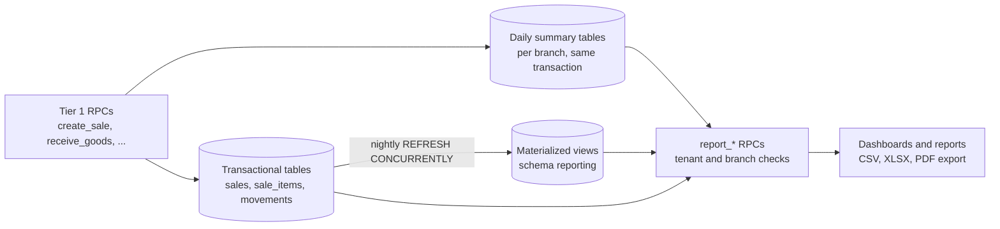

- Daily summary tables (sales and payments per branch per day) are updated inside the same transaction
  as the sale, so dashboards are always current and cheap to read.
- Heavy analytics (profit by batch cost, slow and fast movers, loyalty renewal rate, branch comparison)
  use materialized views refreshed nightly; the UI shows the "as of" time.
- Profit uses the batch cost captured on each sale allocation, so historical profit never changes when
  new stock arrives.
- Exports are generated in the browser from the same report RPCs for up to 50,000 rows; larger exports
  are a later enhancement through an Edge Function.

---

## 11. Key runtime flows

Function names in these diagrams are the canonical names of database design section 8.5; signatures and
the error catalogue are defined in the [database design](../database/database-design.md).

### 11.1 Sign-in with MFA

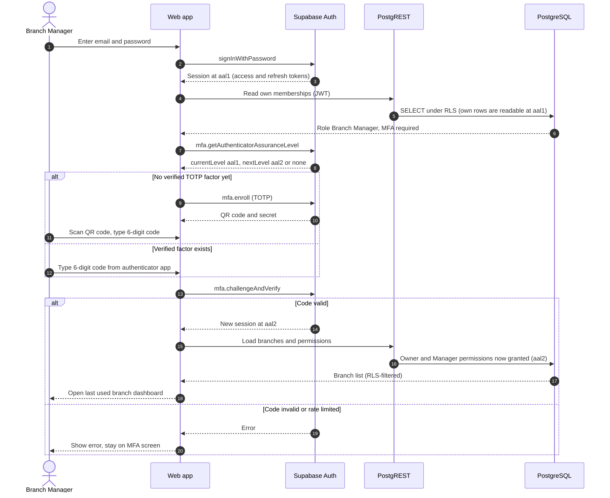

Notes:

- Until the session reaches `aal2`, the database refuses the Manager's permissions, so privileged
  actions fail even if the UI were bypassed. The target per FR-IAM-005 is that business reads also
  return no rows at `aal1`; the current migrations enforce this only for permission-gated data (OI-08).
- Failed attempts are rate-limited by Supabase Auth and visible in Auth logs (section 17).
- Lost authenticator: an Owner resets the factor through `admin-users`; an Owner who loses their own
  factor follows the recovery procedure in the [runbook](../operations/runbook.md).

### 11.2 POS sale commit with FEFO and loyalty

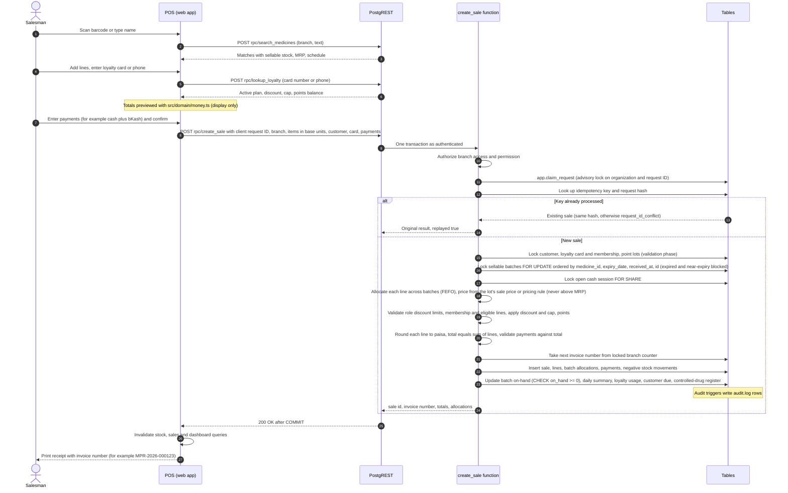

| Failure                                         | Illustrative code       | Database effect                          | UI behaviour                                                   |
| ----------------------------------------------- | ----------------------- | ---------------------------------------- | -------------------------------------------------------------- |
| Not enough sellable stock                       | `insufficient_stock`    | Rolled back; invoice number not consumed | Highlight the line, show available quantity                    |
| Payments do not match the computed total        | `payment_mismatch`      | Rolled back                              | Show the server total and ask the Salesman to re-confirm       |
| Loyalty membership expired or cancelled         | `loyalty_inactive`      | Rolled back                              | Remove the benefit, show reason, re-confirm                    |
| Discount above the role's limit (CFG-05)        | `discount_limit`        | Rolled back                              | Ask a Branch Manager to apply the discount                     |
| Controlled medicine without prescription data   | `prescription_required` | Rolled back                              | Open the prescription form (doctor, registration number, date) |
| Credit sale above the customer's limit          | `credit_limit`          | Rolled back                              | Show limit and current due                                     |
| Same client request ID with a different payload | `request_id_conflict`   | Rolled back                              | Generate a new ID for the new intent; report to Sentry         |
| Network failure after the server committed      | None                    | Committed once                           | Retry with the same idempotency key returns the original sale  |

### 11.3 Goods receipt

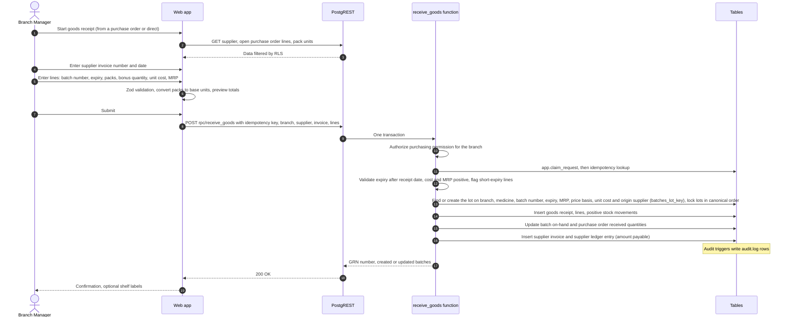

Notes: bonus (free) quantities increase stock at zero cost, which lowers the effective unit cost used
for profit. Lines whose remaining shelf life is below the organization's threshold (CFG-09, default
180 days) need explicit confirmation. Supplier payments are a separate RPC (`record_supplier_payment`)
that reduces the supplier due.

### 11.4 Inter-branch stock transfer

States: `requested` → `dispatched` (in transit) → `received`. A request can be cancelled by the
requester before dispatch or rejected by the source; after dispatch only the Owner can recall a transfer,
which returns the stock to the source batches (FR-TRF-008). A source Manager or the Owner may also push
a transfer without a request; it starts as `dispatched` (FR-TRF-004). Dispatch may be partial; stock in
transit is not sellable at either branch but is reported as a separate "in transit" stock value
(FR-TRF-007). The functions are `request_stock_transfer`, `dispatch_stock_transfer` and
`receive_stock_transfer`, with `reject_stock_transfer`, `cancel_stock_transfer` and
`recall_stock_transfer` for the other transitions
([database design, section 8.6.8](../database/database-design.md#868-stock-transfers)).

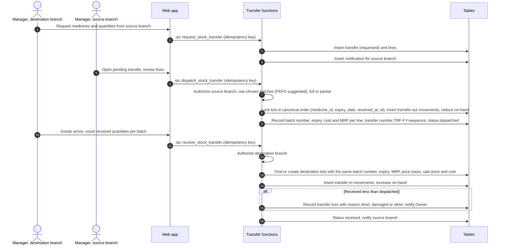

### 11.5 AI ask-your-data (M5)

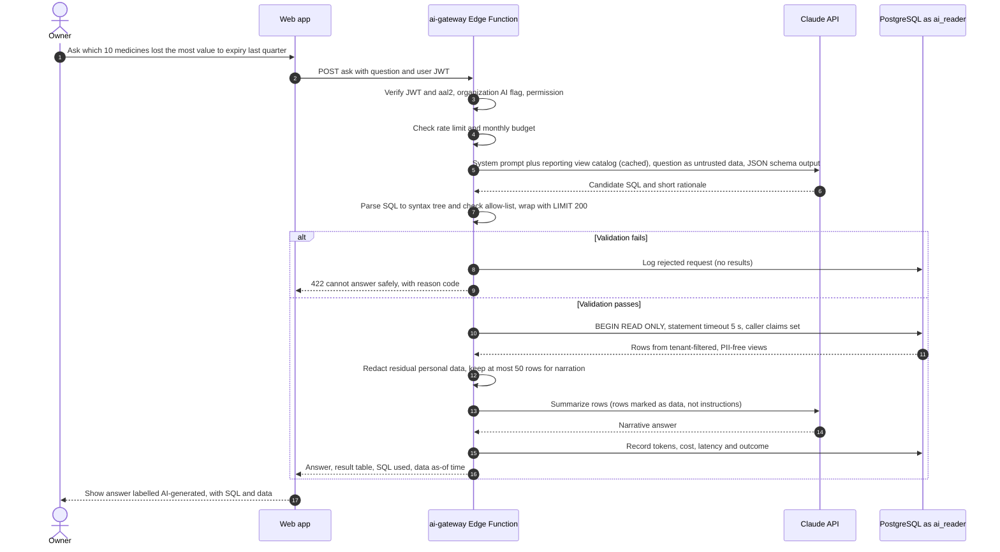

The guardrails used in this flow are detailed in section 16.4.

---

## 12. Multi-tenancy model

### 12.1 Model

PIMS uses a **pooled** multi-tenant model: one database and one schema for all tenants, with a tenant
discriminator column and Row Level Security. An **organization** is the tenant (a pharmacy business);
it owns one or more **branches**. Users are linked to organizations through **memberships** that carry
a role and the branches the user may access.

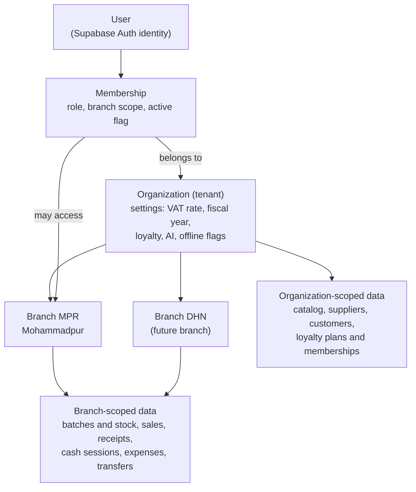

| Scope        | Examples                                                                                       | Keys on each row                  |
| ------------ | ---------------------------------------------------------------------------------------------- | --------------------------------- |
| Platform     | Read-only reference lists shared by all tenants (for example dosage forms, schedule types)     | None; readable by `authenticated` |
| Organization | Medicines, pack units, barcodes, suppliers, customers, loyalty plans and memberships, settings | `organization_id`                 |
| Branch       | Batches and on-hand stock, sales, returns, goods receipts, cash sessions, expenses, transfers  | `organization_id` and `branch_id` |
| User         | Profile, language preference                                                                   | `user_id`                         |

The authoritative scope of every table, including whether generic and manufacturer master lists are
seeded per organization, is defined in the [database design](../database/database-design.md).

### 12.2 Isolation mechanisms

1. `organization_id NOT NULL` on every tenant-owned row; `branch_id NOT NULL` on every branch-scoped row.
2. Composite foreign keys that include `organization_id` (for example, a sale line can reference only a
   medicine of the same organization), so cross-tenant references are impossible even for buggy code.
3. RLS policies on every table using the `app` helpers (section 10.5).
4. RPC functions verify that every ID they receive belongs to the caller's organization and branch.
5. Unique constraints are scoped by organization (customer phone, loyalty card number, barcode) or by
   branch and fiscal year (invoice number).
6. Storage object paths start with the organization ID and are checked by storage RLS.
7. Client query keys start with organization and branch IDs (section 9.3).
8. Logs, AI usage records and audit rows are tagged with the organization ID.
9. A pgTAP isolation suite with two organizations and several branches each runs on every pull request;
   any cross-tenant or cross-branch leak blocks the merge.

### 12.3 Tenant lifecycle

| Event                         | Handling                                                                                                                                      |
| ----------------------------- | --------------------------------------------------------------------------------------------------------------------------------------------- |
| Create organization           | M1 to M4: the operator calls the `create_organization` RPC for the first tenant. Later: SaaS self-service onboarding (FR-ORG-012).            |
| Add branch                    | Owner adds the branch in settings; branch code (for example `MPR`) prefixes its invoice numbers.                                              |
| Deactivate branch             | `is_active = false`; history stays; no new sales, receipts or transfers. Branches are never hard-deleted.                                     |
| User in several organizations | Supported by the membership model; an organization switcher appears only when a user has more than one.                                       |
| Export tenant data            | Organization-filtered export of all tables (CSV or SQL) for portability and offboarding (later milestone).                                    |
| Move a large tenant           | Because every row carries `organization_id`, a large tenant can be moved to a dedicated Supabase project (silo model) without schema changes. |

---

## 13. Cross-cutting concerns

| Concern          | Decision                                                                                                                                                                                                                                                                                                           | Where enforced                                                                                                               |
| ---------------- | ------------------------------------------------------------------------------------------------------------------------------------------------------------------------------------------------------------------------------------------------------------------------------------------------------------------ | ---------------------------------------------------------------------------------------------------------------------------- |
| Money            | `BIGINT` paisa (1 BDT = 100 paisa); percentages as basis points or `NUMERIC(5,2)`; round half up to the paisa per line; invoice total = sum of lines; optional rounding to the nearest taka as an explicit rounding line                                                                                           | Database functions; `src/domain/money.ts` mirrors the rules for previews ([ADR-0005](../adr/0005-money-as-integer-paisa.md)) |
| Quantities       | `INTEGER` base units (smallest sellable unit); pack conversion factors in the catalog                                                                                                                                                                                                                              | Database constraints; domain helpers                                                                                         |
| Time             | `TIMESTAMPTZ` stored in UTC; business dates (sale date, fiscal year) computed in Asia/Dhaka inside the database; UI formats with `timeZone: 'Asia/Dhaka'`                                                                                                                                                          | Database functions; i18n formatters                                                                                          |
| Identifiers      | UUIDs from `gen_random_uuid()`; human-readable codes (invoice number, card number, SKU) are separate columns                                                                                                                                                                                                       | Database defaults                                                                                                            |
| Document numbers | Gapless per branch per fiscal year, allocated from a locked counter row in the same transaction; sequences are never used because they leave gaps. Formats per CFG-04: invoice `MPR-2026-000123`, credit note `MPR-CN-2026-000012`, transfer `TRF-2026-000001`; the fiscal year starts in July by default (CFG-03) | Database functions                                                                                                           |
| Concurrency      | Pessimistic row locks in one global order (database design section 9.3) on an append-only stock ledger ([ADR-0008](../adr/0008-append-only-inventory-ledger-with-fefo.md)); optimistic concurrency (`updated_at` or version check) for master-data edits                                                           | RPCs; updates filtered on the previous `updated_at` (zero rows updated means conflict)                                       |
| Idempotency      | Client-generated UUID per business intent; unique per organization; serialized by `app.claim_request()`; replay with the same request hash returns the stored result                                                                                                                                               | RPCs; offline outbox                                                                                                         |
| Deletion         | Soft delete with `archived_at` or `is_active`; no hard deletes of business records; ledgers immutable                                                                                                                                                                                                              | Privileges and policies                                                                                                      |
| Audit            | Generic append-only trigger (section 10.10)                                                                                                                                                                                                                                                                        | Database                                                                                                                     |
| Errors           | Stable error codes from the database, mapped to i18n messages; correlation ID shown to the user                                                                                                                                                                                                                    | RPCs; data access layer                                                                                                      |
| Configuration    | Organization and branch settings tables (VAT rate, rounding, loyalty, offline and AI flags); no third-party feature-flag service                                                                                                                                                                                   | Database; settings UI                                                                                                        |
| Personal data    | Collected only where needed (customer name and phone); excluded from logs, telemetry and AI prompts                                                                                                                                                                                                                | Security model; section 16.4                                                                                                 |

---

## 14. Environments and deployment pipeline

### 14.1 Environments

| Environment    | Purpose                                    | Frontend                                | Backend                                                                            | Data                                            | Deployed by                      |
| -------------- | ------------------------------------------ | --------------------------------------- | ---------------------------------------------------------------------------------- | ----------------------------------------------- | -------------------------------- |
| Local          | Development                                | Vite dev server on port 5173            | Supabase CLI in Docker (API 54321, database 54322, Studio 54323, local mail 54324) | `seed.sql` synthetic data                       | Developer                        |
| CI (ephemeral) | Automated tests on every PR                | Built bundle served for Playwright      | `supabase start` inside the GitHub Actions runner                                  | Seed plus test fixtures                         | GitHub Actions                   |
| PR preview     | Visual and functional review of UI changes | Cloudflare Pages preview URL per commit | `pims-staging`                                                                     | Staging data                                    | Cloudflare Pages, automatically  |
| Staging        | Integration, UAT, migration rehearsal      | Cloudflare Pages branch alias of `main` | `pims-staging`                                                                     | Synthetic data; production data is never copied | Merge to `main`                  |
| Production     | Live pharmacy operations                   | Cloudflare Pages production deployment  | `pims-prod`                                                                        | Real data                                       | Release tag plus manual approval |

PR previews use the staging backend, so a pull request that adds a migration is not reflected in its
own preview until it merges. The CI end-to-end job, which runs against a local stack with all
migrations applied, is therefore the quality gate; previews are for UI review. Supabase Branching
(per-PR databases, paid feature) can replace this later if needed.

### 14.2 Configuration and secrets

| Item                                                                   | Stored in                                                                           | Used by                        |
| ---------------------------------------------------------------------- | ----------------------------------------------------------------------------------- | ------------------------------ |
| `VITE_SUPABASE_URL`, `VITE_SUPABASE_ANON_KEY`, `VITE_SENTRY_DSN`       | Cloudflare Pages variables (Preview: staging values; Production: production values) | Frontend build (public values) |
| `SUPABASE_ACCESS_TOKEN`, database password, project reference          | GitHub Environments `staging` and `production`                                      | `deploy.yml`                   |
| Backup encryption public key (age recipient), backup store credentials | GitHub Environment `production`                                                     | `backup.yml`                   |
| `SENTRY_AUTH_TOKEN`                                                    | Cloudflare Pages build variable (secret)                                            | Source map upload              |
| Anthropic API key, AI database role password                           | Supabase Edge Function secrets (`supabase secrets set`)                             | `ai-gateway`                   |
| Service role key                                                       | Injected by the Edge Functions runtime; never stored elsewhere                      | `admin-users`                  |
| SMTP credentials                                                       | Supabase Auth settings                                                              | Auth emails                    |

No secret is committed to the repository; gitleaks scans every push. The production GitHub
Environment requires a reviewer's approval before any job can read its secrets. Source maps are
uploaded to Sentry and are not served publicly (open issue OI-03).

### 14.3 Continuous integration

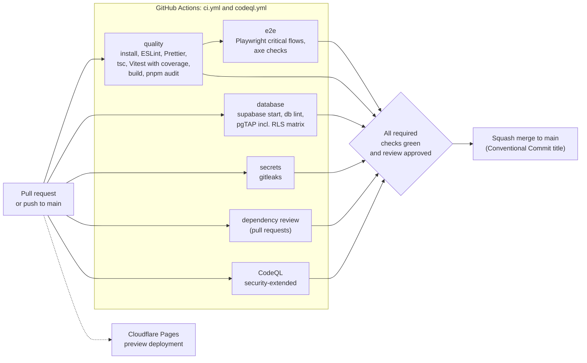

The detailed gate definitions (coverage thresholds, test data, flaky-test policy) are in the
[testing strategy](../engineering/testing-strategy.md) and
[engineering standards](../engineering/engineering-standards.md). The `database` job already lints SQL
with `supabase db lint`; migration linting with squawk and a type-drift check (`pnpm gen:types` must
produce no diff) are added to the same job in M1.

### 14.4 Delivery pipeline

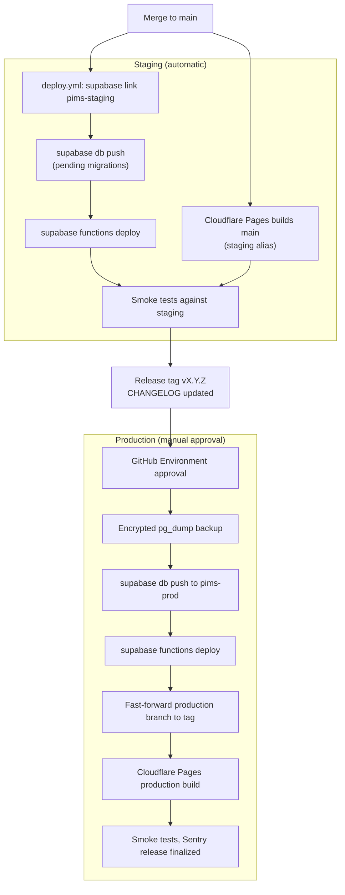

- **Order: database, then functions, then frontend.** This is safe because every migration is backward
  compatible with the currently deployed frontend (expand, migrate, contract; section 14.5).
- **Cloudflare Pages project.** One project with Git integration: the production branch is
  `production`, which only the release workflow updates; every other branch, including `main`, builds
  as a preview with staging variables. Build watch paths skip builds for documentation-only changes.
- **Release cadence.** Small, frequent releases. Production deploys and migrations run between 01:00
  and 06:00 Asia/Dhaka with at least 24 hours' notice to the Owner (NFR-AVAIL-002); only urgent fixes are
  deployed outside that window.

Rollback:

| Layer          | Rollback method                                                                                                                           | Typical time                                              |
| -------------- | ----------------------------------------------------------------------------------------------------------------------------------------- | --------------------------------------------------------- |
| Frontend       | Cloudflare Pages "rollback to previous deployment"                                                                                        | Under 5 minutes                                           |
| Edge Functions | Redeploy functions from the previous tag                                                                                                  | Under 10 minutes                                          |
| Database       | Forward-only: a new corrective migration. Restore from backup only for data corruption, following the [runbook](../operations/runbook.md) | Fix-forward: under 1 hour; restore: see RTO in section 21 |

Because destructive "contract" steps are deferred by at least one release, rolling back the frontend
never requires rolling back the database.

### 14.5 Database migration strategy

- Migrations are created with `supabase migration new <description>` as timestamped SQL files in
  `supabase/migrations/`; an applied migration is never edited.
- Every migration is reviewed by a database owner (CODEOWNERS), linted, applied from scratch in CI,
  applied incrementally on staging, and backed up before production apply.
- **Expand, migrate, contract.** Example: renaming a column means (1) add the new column and write to
  both in RPCs, (2) backfill and switch readers, (3) drop the old column in a later release.
- Long-running operations (index builds on large tables, backfills) go into dedicated migrations
  scheduled off-peak (02:00 to 06:00 Asia/Dhaka).
- RLS policies, grants and functions are part of migrations, never applied manually.
- Procedures for applying and recovering migrations are in the [runbook](../operations/runbook.md).

---

## 15. Offline strategy (M4)

### 15.1 Goal and scope

Keep the counter selling during short internet outages without compromising data integrity. The server
remains the single source of truth; offline sales are **requests** that the server validates when the
connection returns.

| Capability                                                | Offline in M4                                                    | Reason                                                       |
| --------------------------------------------------------- | ---------------------------------------------------------------- | ------------------------------------------------------------ |
| Catalog search and barcode lookup                         | Yes (snapshot)                                                   | Needed for every sale                                        |
| Cash and mobile-payment sales (OTC and Rx)                | Yes, queued                                                      | Business continuity                                          |
| Loyalty discount                                          | Yes, if the card is active in the snapshot; re-validated on sync | Customer expectation                                         |
| Credit (বাকি) sales                                       | No                                                               | Credit limit cannot be checked reliably                      |
| Controlled-medicine sales                                 | No                                                               | Register and prescription validation must be online          |
| Returns, voids, loyalty enrolment                         | No                                                               | Depend on server state                                       |
| Discounts above the user's limit                          | No                                                               | Need a Manager online                                        |
| Goods receipt, transfers, adjustments, cash session close | No                                                               | Ledger-critical, multi-party                                 |
| Reports                                                   | Last loaded view only, marked stale                              | Read-only                                                    |
| Sign-in                                                   | No                                                               | An existing session continues; new sign-ins need the network |

Offline mode is enabled per branch by the Owner and only on registered counter terminals. The POS always
shows an online or offline indicator with the number of unsynchronized sales (FR-POS-059). The scope above
implements FR-POS-055 to FR-POS-059 and NFR-AVAIL-004.

### 15.2 Components

- **Service worker:** serves the app shell when offline (section 9.9).
- **IndexedDB database `pims-offline`** with stores:
  - `catalog`: the branch's sellable medicines with barcodes, prices, schedule, loyalty eligibility and
    a sellable-quantity snapshot; refreshed every 15 minutes while online and at sign-in.
  - `loyalty`: active card numbers with plan benefits only. There is **no phone lookup offline** and no
    phone-derived value is stored: Bangladeshi mobile numbers (`01[3-9]` plus 8 digits, about 7 x 10^8
    values) are so few that any hash of them, salted on the same device, is reversed by brute force in
    seconds. A customer without the card is served offline without the loyalty benefit, and lookup by
    phone works online only. When a card number is typed offline, the last three phone digits entered by
    the cashier (CFG-20, FR-LOY-024) travel in the queued request and are checked by the server at sync;
    a mismatch makes the entry an exception (section 15.4).
  - `outbox`: pending commands.
  - `device_key`: the terminal's device key, imported into WebCrypto at terminal registration as a
    **non-extractable** HMAC-SHA-256 `CryptoKey`, so page scripts can use it but cannot read or export it.
  - `sync_log`: results of past sync attempts for troubleshooting.
- **Sync engine** in `src/features/offline`.

Outbox entry (illustrative shape):

```ts
interface OutboxEntry {
  idempotencyKey: string // UUID; also the create_sale idempotency key
  kind: 'create_sale'
  organizationId: string
  branchId: string
  terminalId: string // registered device ID
  reportedBy: string // auth user ID of the Salesman, informational only: the server never trusts it
  createdAtDevice: string // ISO 8601 from the device clock
  deviceProof: string // HMAC-SHA-256 with the device key, see section 15.3
  provisionalReceiptNo: string // for example MPR-T1-OFF-000042
  payload: CreateSaleArgs // same Zod schema as the online flow
  collectedTotalPaisa: number // what the customer actually paid
  status: 'pending' | 'syncing' | 'synced' | 'exception'
  attempts: number
  lastError?: { code: string; at: string }
  serverResult?: { saleId: string; invoiceNo: string }
}
```

### 15.3 Sync algorithm

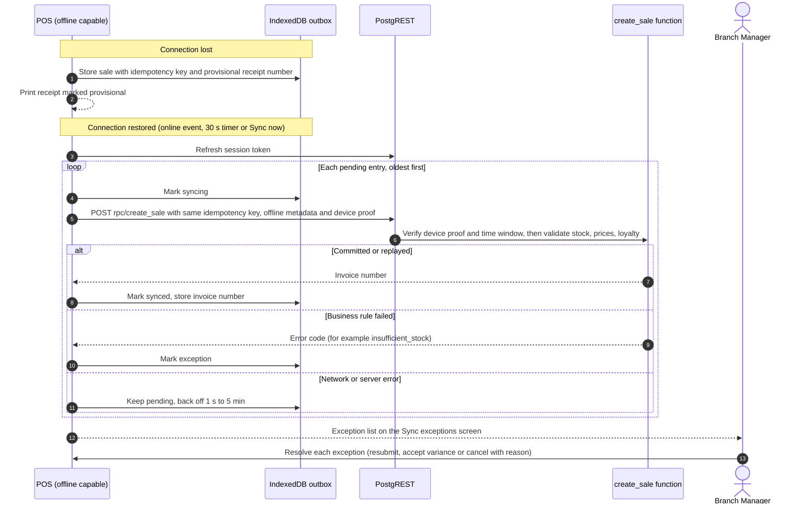

- Synchronization starts within 1 minute of reconnection (FR-POS-058).
- Entries are processed one at a time, oldest first, per terminal; independent entries continue after
  an exception.
- Every retry reuses the idempotency key, so each sale is recorded at most once.
- The `create_sale` call carries offline metadata in `p_offline`: terminal ID, provisional receipt
  number, device timestamp, the Salesman reported by the device, and the device proof. The collected
  total is sent as the expected total, so any difference becomes an exception (section 15.4).
- **Terminal authentication (device proof).** When a Branch Manager registers a terminal (online, at
  `aal2`), the server generates a 256-bit device secret, keeps it server-side encrypted (Supabase Vault)
  and returns it once; the browser imports it as a non-extractable HMAC-SHA-256 key and discards the raw
  bytes. Each queued sale carries `HMAC(device secret, terminal_id | client_request_id | request_hash |
device_at | provisional_ref)`, where `request_hash` is the canonical request hash computed without
  the proof itself. `create_sale` recomputes and compares it in constant time and rejects a missing or
  wrong proof, an unknown, inactive or offline-disabled terminal, or a terminal of another branch;
  rejections are audited. A stored hash of the secret alone cannot verify an HMAC, so the server must
  hold the secret itself (database design `terminals`). Deactivating a terminal revokes its key; its
  unsynced entries then become exceptions.
- **Attribution.** The server always records `created_by = auth.uid()` of the session that submits the
  entry (security model rule: the actor comes only from the JWT, T-RPC-06). The sync engine submits
  only the entries whose `reportedBy` equals the signed-in user, so normally each Salesman's sales are
  recorded under their own session. If that Salesman cannot sign in again, a Branch Manager may submit
  the remaining entries explicitly from the Sync exceptions screen; those sales are recorded with the
  Manager as `created_by`, and the device-reported Salesman is stored only as an unverified
  "reported by" value, labelled as unverified in reports and never used for permissions, commissions or
  audit attribution.

### 15.4 Conflict rules

The server is the source of truth. Stock, prices and memberships are always re-validated on sync; a
conflicting sale is never silently dropped and never auto-accepted at a different total (FR-POS-058).

| Situation at sync time                                   | Rule                                                                                                                                                                                                                                                                                                                                                                                                                                                                                                                                                                                                                                              |
| -------------------------------------------------------- | ------------------------------------------------------------------------------------------------------------------------------------------------------------------------------------------------------------------------------------------------------------------------------------------------------------------------------------------------------------------------------------------------------------------------------------------------------------------------------------------------------------------------------------------------------------------------------------------------------------------------------------------------- |
| Not enough stock (sold elsewhere, or snapshot was stale) | Stock never goes negative. Entry becomes an exception; the Manager investigates (cycle count, adjustment) and resubmits.                                                                                                                                                                                                                                                                                                                                                                                                                                                                                                                          |
| Server-computed total differs from the collected total   | Never auto-accepted. The Manager either accepts with the server price, recording the difference as a cash-session variance with reason, or cancels with reason.                                                                                                                                                                                                                                                                                                                                                                                                                                                                                   |
| Loyalty membership expired or cancelled meanwhile        | Exception. The Manager removes the benefit (variance recorded) or, if permitted, honours it as an audited override.                                                                                                                                                                                                                                                                                                                                                                                                                                                                                                                               |
| Typed card number with wrong last three phone digits     | Exception (`card_verification_failed`). Handled like an expired membership.                                                                                                                                                                                                                                                                                                                                                                                                                                                                                                                                                                       |
| Device proof missing or invalid, or terminal not allowed | Rejected and audited; never posted. The Manager investigates the terminal; a genuine sale is re-entered online.                                                                                                                                                                                                                                                                                                                                                                                                                                                                                                                                   |
| Same entry submitted twice (retry, two tabs)             | Idempotency key guarantees exactly one sale.                                                                                                                                                                                                                                                                                                                                                                                                                                                                                                                                                                                                      |
| Invoice numbering                                        | Gapless numbers are assigned only by the server at sync. The provisional receipt states it is provisional; reprints show the final invoice number.                                                                                                                                                                                                                                                                                                                                                                                                                                                                                                |
| Sale time                                                | Device time becomes `sold_at` only if it is (1) at most 5 minutes after server time; (2) at most 72 hours before server time; (3) not earlier than the terminal's last confirmed online time (`terminals.last_seen_at`, advanced only by the online heartbeat that the client sends while its outbox is empty, never by offline sync calls); (4) not earlier than the opening of the cash session described in the next row; and (5) on that session's business date. Otherwise the entry becomes an exception (`offline_time_rejected`); the Manager may resubmit it at server time into the current open session, which sets `is_time_flagged`. |
| Cash session                                             | The sale is posted only into the cash session of the terminal's register that is open at sync time and that contains the device time; it is never posted into a closed session or an earlier business date. A terminal cannot close its session while it has unsynced entries, and the server refuses offline entries for a closed session (exception).                                                                                                                                                                                                                                                                                           |
| Review of backdated sales                                | Every accepted offline sale has `sold_at` earlier than its server receipt time and is listed on the Branch Manager's offline sales review (device time, server time, terminal, submitting user, unverified reported Salesman) until reviewed.                                                                                                                                                                                                                                                                                                                                                                                                     |
| Outbox limits                                            | At most 72 hours of age or 500 entries per terminal (configurable); beyond that the POS stops accepting offline sales.                                                                                                                                                                                                                                                                                                                                                                                                                                                                                                                            |

### 15.5 Security of offline data

- IndexedDB is not encrypted by the browser, so offline data is minimized: no customer names,
  addresses, phone numbers or phone-derived values (not even hashes, section 15.2); only card numbers
  with plan benefits, prices and stock snapshots, plus the queued sales themselves.
- The device key is non-extractable, so a script or a person copying the IndexedDB files cannot take it
  to another browser; a stolen terminal is handled by deactivating it, which revokes the key.
- Offline mode is limited to registered counter terminals that have an operating-system account
  password and are physically controlled by the branch.
- Sign-out clears all offline stores when the outbox is empty; with unsynced entries, sign-out warns
  and keeps only the outbox.
- Every resolution of a sync exception is audited.
- Threats specific to offline mode (forged terminal, attribution to another user, backdating into an
  earlier session or business date, phone-number recovery from the store) belong in the
  [security model](../security/security-model.md) threat table (T-WEB) and need test cases in the
  [testing strategy](../engineering/testing-strategy.md).

---

## 16. AI architecture (M5)

### 16.1 Principles

1. **Advisory and read-only.** AI never writes business data. At most it proposes something (cart
   lines, a draft purchase order) that a person confirms through the normal RPCs.
2. **Deterministic first.** Forecasting and expiry risk are computed with SQL and statistics; the LLM is
   used where language understanding is needed.
3. **No medical advice.** AI never suggests dosing, diagnosis or substitution advice to customers; the
   UI labels AI output as reference for the pharmacist.
4. **Minimum data.** Prompts contain only what the task needs; personal data is excluded or redacted.
5. **Defense in depth.** Every control assumes the previous one can fail (prompt rules, output schema,
   SQL validation, database role, tenant filters, timeouts).
6. **Metered and switchable.** Usage is logged and budgeted per organization; AI can be disabled per
   organization or globally at any time.

### 16.2 Feature map

| Feature                  | Technique                                                                                                                                                                                                                                                                                                                     | Data sent to the LLM                                                                                    | Writes                                  | Human gate                                                                                                          |
| ------------------------ | ----------------------------------------------------------------------------------------------------------------------------------------------------------------------------------------------------------------------------------------------------------------------------------------------------------------------------- | ------------------------------------------------------------------------------------------------------- | --------------------------------------- | ------------------------------------------------------------------------------------------------------------------- |
| Smart medicine search    | `pg_trgm` search first; on request or when nothing matches, the LLM maps free text (English, Bangla or Banglish; generic, brand or symptom words) to generic names from the organization's catalog vocabulary; the database returns in-stock brands; names that do not match the catalog are discarded (FR-AI-001, FR-AI-002) | Query text and candidate generic names; no customer data                                                | None                                    | Pharmacist chooses; Rx and controlled badges; "Suggestion for the pharmacist, not medical advice" label (FR-AI-003) |
| Prescription reading     | Vision model extracts medicine names, strengths, quantities; matched to the catalog with `search_medicines`                                                                                                                                                                                                                   | The prescription image (may show patient and doctor names; organization opt-in and disclosure required) | None; suggested cart lines only         | Pharmacist confirms each line; controlled medicines need manual prescription entry                                  |
| Reorder forecasting      | SQL: moving average with day-of-week seasonality, supplier lead time and safety stock (materialized view)                                                                                                                                                                                                                     | None (optional narration of results)                                                                    | Draft purchase order only on user click | Branch Manager reviews and submits                                                                                  |
| Expiry-risk detection    | SQL: projected days to sell out versus days to expiry per batch                                                                                                                                                                                                                                                               | None                                                                                                    | None                                    | Manager decides (transfer, return to supplier, promotion)                                                           |
| Ask your data            | Text-to-SQL over allow-listed reporting views, then narration                                                                                                                                                                                                                                                                 | View catalog, question, then at most 50 aggregated result rows                                          | None                                    | Owner sees the SQL and the data behind the answer                                                                   |
| Weekly business insights | Scheduled summary of aggregated KPIs per branch using the Message Batches API                                                                                                                                                                                                                                                 | Aggregated KPIs only                                                                                    | Stored as an in-app notification        | Owner reads                                                                                                         |

### 16.3 AI gateway components

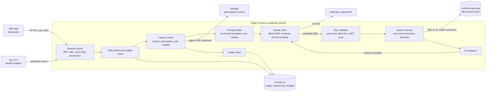

### 16.4 Guardrails

| #   | Control                          | Implementation                                                                                                                                                                                                                                                                                                                                                                                              | Threat mitigated                                    |
| --- | -------------------------------- | ----------------------------------------------------------------------------------------------------------------------------------------------------------------------------------------------------------------------------------------------------------------------------------------------------------------------------------------------------------------------------------------------------------- | --------------------------------------------------- |
| 1   | Kill switches                    | Organization and per-feature flags, off by default (FR-AI-015, CFG-29); a global function secret lets the platform operator disable all AI immediately                                                                                                                                                                                                                                                      | Runaway cost, provider incident, policy change      |
| 2   | Authentication and authorization | Verified JWT, AAL2 for Owner; ask-your-data limited to roles allowed by the [security model](../security/security-model.md)                                                                                                                                                                                                                                                                                 | Unauthorized use                                    |
| 3   | Read-only database role          | `ai_reader`: `USAGE` on `reporting` only, `SELECT` on allow-listed views only, no table privileges, `default_transaction_read_only = on`; each query runs in `BEGIN READ ONLY`                                                                                                                                                                                                                              | Data modification, access to base tables            |
| 4   | Tenant isolation                 | Reporting views filter rows with the same `app` helpers as RLS; the verified caller's claims are set in the transaction, so `auth.uid()` resolves to the caller; pgTAP proves zero cross-tenant rows                                                                                                                                                                                                        | Cross-tenant leakage through generated SQL          |
| 5   | SQL allow-list validation        | Parse with the PostgreSQL parser (libpg_query compiled to WebAssembly), never regular expressions; checks listed below                                                                                                                                                                                                                                                                                      | SQL injection, data exfiltration, denial of service |
| 6   | Statement timeout                | `statement_timeout = 5s`, `lock_timeout = 1s`, `idle_in_transaction_session_timeout = 10s` on every AI query                                                                                                                                                                                                                                                                                                | Expensive queries degrading the POS                 |
| 7   | Row and size limits              | Outer `LIMIT 200` for display; at most 50 rows and 64 KB sent back to the LLM; `max_tokens` capped per feature                                                                                                                                                                                                                                                                                              | Bulk extraction, cost spikes                        |
| 8   | PII minimization and redaction   | Reporting views exclude names, phone numbers, addresses and prescription details; customers and loyalty cards appear only as tokens (FR-AI-023); a redactor removes Bangladeshi mobile numbers (`01[3-9]` plus 8 digits) and email addresses from any text before it leaves the function                                                                                                                    | Personal data disclosure to a third party           |
| 9   | Rate limits                      | Defaults: 20 requests per user per hour and 200 per organization per day, configurable; counters updated atomically in `ai` schema                                                                                                                                                                                                                                                                          | Abuse, cost spikes                                  |
| 10  | Cost metering and budgets        | Token usage from each API response multiplied by a price table is stored per request; monthly budget per organization (default USD 20) with an alert at 80 percent and a hard stop at 100 percent                                                                                                                                                                                                           | Unbounded spend                                     |
| 11  | Prompt-injection defenses        | User text, database rows and image text are placed in delimited data blocks and declared untrusted (FR-AI-024); no write-capable tools are given to the model; outputs are requested as JSON schema (structured outputs) and validated again with Zod, invalid outputs are discarded and logged (FR-AI-025); generated SQL is validated regardless of what the model says; narration cannot trigger actions | Instructions hidden in questions, data or images    |
| 12  | Human confirmation               | Prescription suggestions show the source crop and a confidence value, lines below 0.80 are highlighted, and nothing enters the cart until the pharmacist accepts, edits or rejects each line (FR-AI-006); controlled medicines are shown as text only and must be entered manually (FR-AI-007)                                                                                                              | Misreading a prescription                           |
| 13  | No medical advice                | System prompts forbid dosing, diagnosis and treatment advice; refusals (`stop_reason` of `refusal`) produce a neutral message; UI disclaimer                                                                                                                                                                                                                                                                | Patient harm, regulatory risk                       |
| 14  | Logging and audit                | `ai` request log: user, organization, feature, prompt template version, generated SQL, validation result, token counts, cost, latency, outcome; result rows are not stored; 90-day retention                                                                                                                                                                                                                | Accountability, incident analysis                   |
| 15  | Evaluation before change         | Versioned golden sets and gates per FR-AI-018 (for example at least 50 ask-your-data questions with 85 percent correct, at least 30 red-team prompts with zero unsafe outputs) run against staging before a feature is enabled and before any prompt or model change                                                                                                                                        | Silent quality regressions                          |
| 16  | Provider data handling           | API use under terms that exclude training on submitted data, reviewed and recorded in an ADR before M5 launch and stated in the privacy notice (FR-AI-028); hosting and AI processing disclosed (NFR-PRIV-009)                                                                                                                                                                                              | Unexpected data retention or use                    |

SQL validation checks (all must pass):

- Exactly one statement, and it is a plain `SELECT` (no `INSERT`, `UPDATE`, `DELETE`, `MERGE`, DDL,
  `COPY`, `CALL`, `DO`, `SET`, `SHOW` or transaction control).
- No data-modifying common table expressions, no `SELECT INTO`, no locking clauses (`FOR UPDATE`).
- Every referenced relation is an allow-listed view in `reporting`; no other schema, no system catalogs
  (`pg_catalog`, `information_schema`).
- Every function call is on an allow-list (aggregates, `date_trunc`, `extract`, `coalesce`, `round`,
  `to_char`, `lower` and similar); functions such as `pg_sleep`, `set_config`, `current_setting`,
  `dblink` and file access functions are therefore impossible to call.
- Maximum length 4,000 characters; comments stripped; the statement is wrapped as
  `SELECT * FROM ( <validated query> ) AS q LIMIT 200`.

### 16.5 Model and API usage

- Model: configured through a function secret, defaulting to `claude-opus-5-5`; any change of model or
  prompt template must pass the evaluation set (guardrail 15). Choosing a lower-cost model for a
  specific feature is an owner decision recorded in an ADR, based on evaluation results and the cost
  table in section 20.4.
- API features used: the Messages API through the official TypeScript SDK; structured outputs (JSON
  schema) for SQL and prescription extraction; image input for prescriptions; prompt caching for the
  static system prompt and view catalog; the Message Batches API (50 percent discount) for weekly
  insights; explicit handling of `refusal` and `max_tokens` stop reasons.
- Timeouts: 30 seconds per interactive request (FR-AI-026) with at most one retry on rate-limit or
  server errors; AI failures never block the POS, and smart search falls back to standard search;
  the UI shows progress and can be cancelled.

---

## 17. Observability

### 17.1 Signals

| Signal                            | Tool                                                    | Content                                                                                                | Retention (indicative)     |
| --------------------------------- | ------------------------------------------------------- | ------------------------------------------------------------------------------------------------------ | -------------------------- |
| Frontend errors and Web Vitals    | Sentry browser SDK                                      | Exceptions with release and route, LCP, INP and CLS samples (10 percent)                               | Per Sentry plan            |
| API, Auth, Storage, function logs | Supabase Logs Explorer                                  | Requests, status codes, latency, auth events                                                           | 1 day (Free), 7 days (Pro) |
| Query performance                 | `pg_stat_statements`, Supabase query performance report | Slowest and most frequent queries; reviewed monthly, queries over 500 ms triaged (NFR-OBS-005)         | Until reset                |
| Database health                   | Supabase reports                                        | CPU, memory, disk, connections                                                                         | Per plan                   |
| Edge Function logs                | Supabase function logs                                  | Structured JSON: request ID, function, organization ID, latency, outcome                               | Per plan                   |
| Availability                      | External uptime monitor                                 | Web app URL and `health` function every 5 minutes                                                      | Per monitor plan           |
| Business health                   | In-app operations panel (Owner)                         | Failed sale commits, offline backlog and exceptions, last backup time, materialized view age, AI spend | Database                   |
| Security events                   | Auth logs and `audit.log`                               | Failed sign-ins, MFA changes, role and membership changes, voids, adjustments                          | Audit log: permanent       |

### 17.2 Correlation and privacy

- The web app generates a request ID (UUID) for each write and sends it as a header; Edge Functions log
  it, Sentry tags it, and error messages show its first 8 characters so a support call can find the
  exact request. For business writes the idempotency key ties client, database and audit records together.
- Logs and telemetry never contain customer names, phone numbers, addresses or prescription data;
  Sentry runs with `sendDefaultPii: false` and a scrubbing hook; lookups by phone use request bodies,
  not URLs.

### 17.3 Alerts

| Alert                   | Condition                                                                           | Channel                                    | First response                                         |
| ----------------------- | ----------------------------------------------------------------------------------- | ------------------------------------------ | ------------------------------------------------------ |
| Application unavailable | Two consecutive failed uptime checks (10 minutes)                                   | Email and mobile push                      | Check provider status pages, follow the runbook        |
| Error spike             | More than 20 new Sentry events in 10 minutes, or any new issue on the POS route     | Email                                      | Triage, roll back the frontend if release-related      |
| Sale commit failures    | More than 5 percent of `create_sale` calls failing with server errors in 15 minutes | Email                                      | Check database health and recent migrations            |
| Database size           | Over 70 percent of plan quota                                                       | Weekly usage review, email                 | Apply the upgrade trigger (section 20.3)               |
| Backup failure          | `backup.yml` failed or no backup in 26 hours                                        | GitHub email and in-app Owner notification | Re-run, investigate before the next business day       |
| Integrity check failure | Nightly integrity or gapless-series check fails (NFR-REL-003, NFR-REL-004)          | Email and in-app Owner notification        | Stop affected operations if needed, follow the runbook |
| Stale reporting data    | Materialized view older than 26 hours                                               | In-app banner                              | Check `pg_cron` job history                            |
| Offline backlog         | A terminal with unsynced entries for more than 2 hours while online                 | In-app notice to the Branch Manager        | Resolve sync exceptions                                |
| AI budget               | 80 percent and 100 percent of the monthly budget                                    | In-app and email to the Owner              | Raise budget or wait for the next month                |

Every alert type links to a procedure in the [runbook](../operations/runbook.md) (NFR-OBS-008).

### 17.4 Service level objectives

The binding targets are the NFRs in the [SRS](../requirements/SRS.md); these are the operational
objectives used to tune alerts.

| Objective                                                                     | Target                 |
| ----------------------------------------------------------------------------- | ---------------------- |
| Availability during business hours (08:00 to 24:00 Asia/Dhaka), NFR-AVAIL-001 | 99.5 percent per month |
| Successful sale commits, excluding business-rule rejections                   | 99.9 percent           |
| Latency                                                                       | Budgets in section 18  |

---

## 18. Performance budgets

| Metric                                                             | Budget                                           | Measured with                                        | Enforcement                                  |
| ------------------------------------------------------------------ | ------------------------------------------------ | ---------------------------------------------------- | -------------------------------------------- |
| POS search, server time (NFR-PERF-001)                             | p95 under 200 ms                                 | `pg_stat_statements`, load test on staging           | Release checklist; regression blocks release |
| POS search, keystroke to results rendered (NFR-PERF-001)           | p95 under 400 ms on 4G in Dhaka                  | Sentry custom span                                   | Monitored                                    |
| Barcode scan to line added (NFR-PERF-006)                          | p95 under 300 ms                                 | Sentry custom span                                   | Monitored                                    |
| Sale commit (`create_sale`), server time (NFR-PERF-002)            | p95 under 500 ms (up to 10 lines), p99 under 1 s | `pg_stat_statements`, load test                      | Release checklist                            |
| Sale commit, click to confirmation (NFR-PERF-002)                  | p95 under 800 ms                                 | Sentry custom span                                   | Monitored                                    |
| Initial load, Largest Contentful Paint (NFR-PERF-003)              | under 2.5 s on 4G, mid-range device              | Lighthouse in CI (planned for M4), Sentry Web Vitals | CI budget (M4)                               |
| Interaction to Next Paint / Cumulative Layout Shift (NFR-PERF-005) | under 200 ms / under 0.1                         | Sentry Web Vitals                                    | Monitored                                    |
| JavaScript for the first screen (NFR-PERF-007)                     | at most 250 KB gzip (shell plus POS)             | Build report                                         | CI bundle-size check (planned)               |
| Each lazy feature chunk (NFR-PERF-007)                             | at most 150 KB gzip                              | Build report                                         | CI bundle-size check (planned)               |
| Reports, one branch, one year of data (NFR-PERF-004)               | under 2 s                                        | Load test with synthetic year of data                | Release checklist                            |
| Goods receipt with 50 lines (NFR-PERF-011)                         | p95 under 1 s                                    | Load test                                            | Release checklist                            |
| Owner dashboard with 20 branches (NFR-PERF-008)                    | p95 under 2 s                                    | Load test                                            | Release checklist                            |
| Export of up to 50,000 rows (NFR-PERF-009)                         | under 30 s                                       | Load test                                            | Release checklist                            |

How the budgets are met:

- **Search:** a trigram GIN index on brand and generic names, an exact-match index on barcodes, results
  limited to 20 rows, sellable stock read from the per-batch projection, 150 ms debounce for typing.
- **FEFO:** a partial index on batches by branch, medicine and expiry date where on-hand is positive.
- **One round trip per business action:** the sale is a single RPC; Dhaka to Singapore round-trip time
  is typically 50 to 90 ms, so chatty multi-call writes are avoided.
- **Precomputed reporting:** daily summary tables and nightly materialized views.
- **Frontend:** route-level code splitting, Recharts loaded only in reports, self-hosted subset fonts,
  `preconnect` to the Supabase origin, immutable caching of hashed assets on Cloudflare.

Load tests follow NFR-PERF-010 (3 times the reference peak hour, 4 terminals per branch across 5
branches) and NFR-SCAL-003 (a seeded dataset of 30,000 catalog items, 10 branches and one year of sales at the
volumes in assumption A-04; scripts live in `scripts/` and run against staging before each minor release.

---

## 19. Scalability path

### 19.1 Capacity estimate

With assumption A-04 (about 300 invoices per branch per day, 3 lines each), each invoice produces
roughly 10 to 12 rows (sale, lines, batch allocations, payments, stock movements, audit), about 2.5 KB
including indexes. That is about 0.75 MB per branch per day, or 250 to 300 MB per branch per year,
plus about 50 MB for the catalog and its search indexes. These figures will be re-measured with real
data in M4.

### 19.2 Stages

| Stage                              | Trigger                                                                                                              | Actions                                                                                                                                                                         |
| ---------------------------------- | -------------------------------------------------------------------------------------------------------------------- | ------------------------------------------------------------------------------------------------------------------------------------------------------------------------------- |
| S0 Pilot                           | One branch, database under 350 MB                                                                                    | Supabase Free, nightly encrypted `pg_dump` through GitHub Actions                                                                                                               |
| S1 Production baseline             | Any trigger in section 20.3 (recommended at the M4 launch)                                                           | Supabase Pro with Micro compute; daily managed backups; 7-day logs                                                                                                              |
| S2 Growth (about 5 to 10 branches) | Sustained CPU above 70 percent at peak, budgets in section 18 breached, or connections above 60 percent of the limit | Compute upgrade (Small, then Medium); index and query tuning; point-in-time recovery if a recovery point under 24 hours is required                                             |
| S3 Read scale-out                  | Reporting or AI load measurably slows POS latency, or about 20 or more branches                                      | Read replica for `report_*` functions and the AI gateway; partition `sales`, `sale_items`, `inventory_movements` and `audit.log` by month (tables are designed partition-ready) |
| S4 SaaS                            | Multiple paying organizations                                                                                        | Per-organization rate limits and quotas; tenant data export; large tenants moved to dedicated projects; evaluate the Team plan for compliance needs                             |

Additional levers, in order of preference: better indexes and queries, more precomputation (summary
tables, materialized views), client-side caching with TanStack Query, compute upgrades, read replicas,
partitioning. Partitioning is considered when a single table exceeds roughly 50 million rows or 10 GB,
or when maintenance (vacuum, index builds) starts to affect latency.

Features excluded from v1 fit this path without restructuring: e-commerce and delivery would be new
feature slices and RPCs on the same ledger; SMS is an Edge Function; a native mobile app would reuse
the same API, RLS and RPCs.

---

## 20. Cost model

Prices are indicative list prices in USD as checked in October 2026 and must be re-verified before any
purchase decision.

### 20.1 Service costs

| Service                         | Free tier (relevant limits)                                                                                                                                                | Paid option and when                                                                                             | Indicative paid cost per month                                                                           |
| ------------------------------- | -------------------------------------------------------------------------------------------------------------------------------------------------------------------------- | ---------------------------------------------------------------------------------------------------------------- | -------------------------------------------------------------------------------------------------------- |
| Supabase                        | 500 MB database, 1 GB file storage, 5 GB egress, 50,000 monthly active users, 2 active projects, projects pause after 1 week of inactivity, no managed backups, 1-day logs | Pro when section 20.3 triggers are met                                                                           | USD 25 (includes 8 GB database disk, daily backups, 7-day logs and USD 10 compute credit covering Micro) |
| Supabase compute add-ons        | Micro included with Pro                                                                                                                                                    | Small USD 15, Medium USD 60, Large USD 110 (before the USD 10 credit)                                            | 0 to 100                                                                                                 |
| Supabase point-in-time recovery | Not available                                                                                                                                                              | When a recovery point under 24 hours is required                                                                 | about USD 100 for 7 days of retention                                                                    |
| Cloudflare Pages                | Unlimited static requests and bandwidth, 500 builds per month, commercial use allowed                                                                                      | More than 500 builds per month (use build watch paths first)                                                     | Plan upgrade only if needed                                                                              |
| GitHub                          | Free private repository; included Actions minutes                                                                                                                          | If CI exceeds included minutes; CodeQL on a private repository needs a paid GitHub code-security licence (OI-04) | Pay-as-you-go minutes                                                                                    |
| Sentry                          | Developer plan: 1 user, 5,000 errors per month                                                                                                                             | More users or volume                                                                                             | about USD 26 (Team)                                                                                      |
| Uptime monitor                  | Free plans with 5-minute checks                                                                                                                                            | Not expected                                                                                                     | 0                                                                                                        |
| Transactional email             | Free tiers of common SMTP providers cover invitation and reset volumes                                                                                                     | Not expected                                                                                                     | 0                                                                                                        |
| Backup storage                  | Free tier of a private object store (for example Cloudflare R2, 10 GB)                                                                                                     | Beyond free storage                                                                                              | Cents per GB                                                                                             |
| Domain name                     | Not applicable                                                                                                                                                             | Always                                                                                                           | about USD 1 to 2 (billed yearly)                                                                         |
| Anthropic API (M5)              | Pay per use                                                                                                                                                                | When AI is enabled                                                                                               | See 20.4                                                                                                 |
| SMS gateway (v2)                | Pay per message                                                                                                                                                            | When SMS is enabled                                                                                              | Quote from a Bangladeshi gateway                                                                         |

### 20.2 Scenarios

| Scenario                                      | Configuration                                 | Approximate total per month |
| --------------------------------------------- | --------------------------------------------- | --------------------------- |
| Pilot (M2 to M3), one branch                  | All free tiers                                | USD 0 plus domain           |
| Production, 1 to 3 branches                   | Supabase Pro (Micro), other services free     | USD 25 to 30                |
| Production with light AI use                  | As above plus AI (section 20.4)               | USD 45 to 55                |
| About 10 branches                             | Pro with Small or Medium compute, Sentry Team | USD 60 to 120               |
| About 10 branches with point-in-time recovery | As above plus PITR                            | USD 160 to 220              |

### 20.3 When to upgrade to Supabase Pro

Upgrade when any of the following becomes true; the first is a recommendation, the rest are hard triggers:

1. Production launch with real money (M4): managed daily backups, longer logs and no risk of pausing
   are worth about USD 25 per month for a business system.
2. Database size reaches 350 MB (70 percent of the free 500 MB). By the estimate in section 19.1 this
   happens within roughly a year for one branch, or about six months for two.
3. File storage reaches 700 MB or egress reaches 3.5 GB in a month.
4. A second branch goes live.
5. The business requires a recovery point better than 24 hours (point-in-time recovery needs Pro).
6. Incident investigation needs more than 1 day of logs.

While on the free tier, the nightly encrypted backup (section 10.9) and the monthly offline copy are
mandatory, and staging may pause when idle; the deploy workflow resumes or the operator restores it.

### 20.4 AI cost estimate (M5)

List prices for the default model `claude-opus-5-5`: USD 4 per million input tokens, USD 20 per million
output tokens, USD 0.20 per million cached input tokens; the Message Batches API halves the price.
Thinking tokens are billed as output. Other current models are cheaper (for example
`claude-sonnet-5-5` at USD 2 and 10, `claude-haiku-4-5` at USD 1 and 5 per million input and output
tokens); switching is an owner decision after evaluation (section 16.5).

| Feature                 | Assumed tokens per use                                               | Cost per use (approx.) | Example volume (one branch) | Per month (approx.) |
| ----------------------- | -------------------------------------------------------------------- | ---------------------- | --------------------------- | ------------------- |
| Ask your data           | Two calls: about 6,000 cached and 3,300 uncached input, 2,300 output | USD 0.06               | 5 questions per day         | USD 9               |
| Prescription reading    | About 3,100 input including the image, 1,500 output                  | USD 0.04               | 5 prescriptions per day     | USD 6               |
| Smart search (LLM step) | About 2,000 input, 500 output                                        | USD 0.02               | 10 searches per day         | USD 6               |
| Weekly insights         | About 8,000 input, 2,000 output, batch discount                      | USD 0.04 per branch    | 4 to 5 per month            | under USD 1         |
| **Total (light use)**   |                                                                      |                        |                             | **about USD 21**    |

The default monthly AI budget of USD 20 per organization (guardrail 10) keeps spend predictable; the
Owner can raise it. Actual costs are measured per request by the usage meter.

---

## 21. Quality attribute scenarios

Each scenario follows the source, stimulus, environment, artifact, response and response-measure form.
Targets marked with the SRS are authoritative there; the others are architecture targets.

| ID     | Quality         | Stimulus (source, environment)                                                                                                                 | Response                                                                                    | Response measure                                                                                                      | Tactics (sections)                                     |
| ------ | --------------- | ---------------------------------------------------------------------------------------------------------------------------------------------- | ------------------------------------------------------------------------------------------- | --------------------------------------------------------------------------------------------------------------------- | ------------------------------------------------------ |
| QAS-01 | Performance     | Salesman types three characters or scans a barcode at 3 times the reference peak hour, 4 terminals per branch across 5 branches (NFR-PERF-010) | Ranked matches with sellable stock are shown                                                | Server p95 under 200 ms; end-to-end p95 under 400 ms (NFR-PERF-001)                                                   | Trigram index, limit 20, scan detection (9.8, 18)      |
| QAS-02 | Performance     | Evening peak at 3 times the reference peak hour (60 invoices per branch per hour), 4 terminals per branch across 5 branches                    | Every sale commits in one transaction                                                       | Server p95 under 500 ms; no deadlocks (NFR-PERF-002)                                                                  | Single RPC, deterministic lock order (10.4)            |
| QAS-03 | Integrity       | 20 parallel sessions sell the last units of the same batch at the same moment                                                                  | Exactly the available quantity is sold; the others receive `insufficient_stock`             | Zero negative on-hand rows (NFR-REL-002)                                                                              | Row locks, `CHECK` constraint (10.4)                   |
| QAS-04 | Integrity       | Network drops after the server commits a sale; the client retries                                                                              | The original sale is returned, not duplicated                                               | Exactly one sale per idempotency key; invoice numbers remain gapless                                                  | Idempotency keys, counter in transaction (10.4, 13)    |
| QAS-05 | Security        | An authenticated user of organization A crafts PostgREST requests for organization B's rows                                                    | Requests return no rows or are rejected                                                     | Zero rows leaked; isolation suite passes on every PR                                                                  | RLS, composite keys, tests (10.5, 12.2)                |
| QAS-06 | Security        | A Salesman's password is stolen and used from outside the shop                                                                                 | Access is limited to that branch and role; the Owner deactivates the user                   | Revocation effective on the next request (under 1 minute)                                                             | Membership-based helpers, no stale claims (10.5, 10.6) |
| QAS-07 | Security        | An Owner's password is stolen                                                                                                                  | Without the TOTP code no privileged action succeeds and no business data is readable        | Zero permission-gated operations and zero business rows at `aal1` (FR-IAM-005; read path tracked as OI-08)            | MFA in database helpers (10.6)                         |
| QAS-08 | Availability    | The branch's internet is down for 2 hours during business hours (M4)                                                                           | Cash and mobile-payment sales continue offline and sync on reconnect                        | Zero lost sales; synchronization starts within 1 minute of reconnection (FR-POS-058); exceptions visible              | Outbox, idempotency, conflict rules (15)               |
| QAS-09 | Recoverability  | A faulty migration or operator error corrupts data in production                                                                               | Service is restored from backup following the runbook                                       | RPO 24 hours and RTO 4 hours on Free (NFR-BACKUP-001); RPO minutes with PITR on Pro (NFR-BACKUP-002); quarterly drill | Backups, runbook (10.9, 14.4)                          |
| QAS-10 | Deployability   | A frontend release breaks a screen                                                                                                             | The previous deployment is restored                                                         | Under 5 minutes, no database rollback needed                                                                          | Pages rollback, expand and contract (14.4, 14.5)       |
| QAS-11 | Modifiability   | The Owner changes the loyalty program from 3-month free cards with 5 percent discount to 6-month paid cards with points                        | Plans are reconfigured in settings                                                          | No code change or deployment                                                                                          | Configuration over code (P5)                           |
| QAS-12 | Modifiability   | A new payment method (for example Upay) must be accepted                                                                                       | Added through configuration or a small migration plus translations                          | Under 1 developer-day including tests; no change to sale logic                                                        | Data-driven payment methods (13)                       |
| QAS-13 | Scalability     | A new branch is opened (tests run with 50 branches)                                                                                            | The branch is created in settings and starts selling                                        | Operational through configuration only within 30 minutes (NFR-SCAL-001); budgets in section 18 still met              | Tenancy model, indexes (12, 18, 19)                    |
| QAS-14 | Usability       | A trained Salesman serves a customer buying three items for cash                                                                               | The sale is completed with the keyboard only                                                | Median at most 30 s by barcode and 45 s by name search (NFR-USAB-004); zero serious axe violations                    | Keyboard-first POS (9.7, 9.8)                          |
| QAS-15 | Usability, i18n | A user switches the interface to Bangla in the middle of a sale                                                                                | All labels, numbers and dates display in Bangla formats without reload and the cart is kept | E2E test passes (NFR-I18N-003); CI key-parity check; no truncated layouts at 320 px                                   | i18n (9.6)                                             |
| QAS-16 | Safety (AI)     | A question tries prompt injection, for example asking to ignore rules, drop a table or show another pharmacy's data                            | The request is refused or answered only from the caller's permitted, read-only views        | 100 percent of the red-team set blocked; zero writes; zero cross-tenant rows                                          | Guardrails 3 to 11 (16.4)                              |
| QAS-17 | Cost            | AI usage grows unexpectedly in one organization                                                                                                | Requests are throttled and stopped at the budget                                            | Spend never exceeds the configured monthly budget by more than one request                                            | Rate limits, budgets (16.4)                            |

---

## 22. Risks, technical debt and open issues

### 22.1 Risks

| ID   | Risk                                                  | Likelihood | Impact | Mitigation                                                                                                        |
| ---- | ----------------------------------------------------- | ---------- | ------ | ----------------------------------------------------------------------------------------------------------------- |
| R-01 | RLS or `SECURITY DEFINER` mistakes expose data        | Medium     | High   | Policy patterns, empty `search_path`, pgTAP matrix, security advisor in CI, review checklist                      |
| R-02 | Supabase lock-in                                      | Medium     | Medium | Standard PostgreSQL and SQL migrations in the repository; `pg_dump` is portable; Auth is the hardest part to move |
| R-03 | Free-tier limits or project pausing affect operations | Medium     | Medium | Usage review weekly; explicit upgrade triggers (20.3)                                                             |
| R-04 | Regional provider outage                              | Low        | High   | Offline mode for sales (M4); off-site backups; status monitoring                                                  |
| R-05 | Offline sync complexity causes reconciliation work    | Medium     | Medium | Narrow offline scope, idempotency, exception queue with audited resolutions                                       |
| R-06 | AI cost overrun or unsafe output                      | Medium     | Medium | Guardrails, budgets, evaluation set, kill switch                                                                  |
| R-07 | Unreliable shop internet                              | High       | Medium | Offline mode; recommend a mobile-data backup connection at each branch                                            |
| R-08 | Small team, knowledge concentrated in one person      | High       | Medium | ADRs, this documentation set, managed services, automated tests                                                   |
| R-09 | Shared counter PCs and sessions stored in the browser | Medium     | Medium | Individual accounts, inactivity lock, strict CSP, sign-out clears local data                                      |
| R-10 | Data growth beyond estimates                          | Medium     | Low    | Measure in M4; summary tables; partition-ready design                                                             |

### 22.2 Known technical debt (accepted)

| Item                                                      | Reason accepted                        | Revisit                        |
| --------------------------------------------------------- | -------------------------------------- | ------------------------------ |
| PR previews share the staging database                    | Supabase Branching is a paid feature   | When on Pro with budget        |
| Exports are generated in the browser (up to 50,000 rows)  | Simple and free                        | When larger exports are needed |
| No Realtime; notifications are polled every 60 seconds    | Fewer moving parts                     | M3 or later                    |
| Lighthouse and bundle-size budgets not yet enforced in CI | Not valuable before real screens exist | M4                             |

### 22.3 Open issues

| ID    | Issue                                                                                                                                                                                                                                                                                                                                                   | Owner                           | Needed by |
| ----- | ------------------------------------------------------------------------------------------------------------------------------------------------------------------------------------------------------------------------------------------------------------------------------------------------------------------------------------------------------- | ------------------------------- | --------- |
| OI-01 | **Closed in 1.1.** Function names: this document now uses the canonical names of database design section 8.5 (`receive_goods`, `process_sale_return`, `process_purchase_return`, `request_stock_transfer`, `dispatch_stock_transfer`, `receive_stock_transfer`) and the table `sale_items`; the SRS must cite the same names (database design DB-OI-01) | Database design, SRS            | M3        |
| OI-02 | Invoice fiscal-year label: FR-POS-030 and CFG-04 label the fiscal year by its start year (`MPR-2026-000123` for July 2026 to June 2027), but `app.fiscal_year_label` in migration `20261006120000_foundation.sql` produces `2627` (`MPR-2627-000123`); align before the first production invoice                                                        | Owner, database design          | M1        |
| OI-03 | Source maps: the build currently emits public source maps (`sourcemap: true`); switch to hidden source maps uploaded privately to Sentry (NFR-OBS-001)                                                                                                                                                                                                  | Engineering                     | M2        |
| OI-04 | CodeQL requires a paid licence on private repositories; decide on the licence or an alternative scanner                                                                                                                                                                                                                                                 | Owner and engineering           | M0        |
| OI-05 | Whether production starts on Supabase Pro at launch (recommended) or on Free with nightly backups                                                                                                                                                                                                                                                       | Owner                           | M4        |
| OI-06 | AI model per feature after evaluation; owner approval of the AI budget                                                                                                                                                                                                                                                                                  | Owner                           | M5        |
| OI-07 | Validate the reference workload and sizing (A-04 to A-06) with real counts from the Mohammadpur branch                                                                                                                                                                                                                                                  | Owner and engineering           | M2        |
| OI-08 | MFA on the read path: `app.user_org_ids()` and `app.user_branch_ids()` do not yet check `aal`, so Owner and Manager can read branch data at `aal1`, which FR-IAM-005 forbids; add the check and pgTAP tests                                                                                                                                             | Database design, security model | M2        |

---

## 23. Architecture decision index

Decisions referenced in this document. Rationale, alternatives and consequences are in the ADRs; the
full, current list is the [ADR index](../adr/README.md).

| Decision                                                                                                              | Sections   | ADR                                                   |
| --------------------------------------------------------------------------------------------------------------------- | ---------- | ----------------------------------------------------- |
| Supabase as the backend platform (Singapore region)                                                                   | 5, 7, 10   | To be recorded; see the [ADR index](../adr/README.md) |
| Business-critical writes only through PostgreSQL RPC functions                                                        | 10.3, 10.4 | To be recorded; see the [ADR index](../adr/README.md) |
| Multi-tenancy with `organization_id` and RLS on every table                                                           | 10.5, 12   | To be recorded; see the [ADR index](../adr/README.md) |
| Money as `BIGINT` paisa, no floating point                                                                            | 13         | To be recorded; see the [ADR index](../adr/README.md) |
| Frontend stack: React, Vite, React Router, TanStack Query, React Hook Form with Zod, Tailwind with shadcn/ui, i18next | 7, 9       | To be recorded; see the [ADR index](../adr/README.md) |
| Cloudflare Pages for hosting and PR previews                                                                          | 7, 14      | To be recorded; see the [ADR index](../adr/README.md) |
| Testing stack: Vitest, pgTAP, Playwright                                                                              | 7, 14.3    | To be recorded; see the [ADR index](../adr/README.md) |
| Trunk-based development, Conventional Commits, GitHub Actions CI                                                      | 14         | To be recorded; see the [ADR index](../adr/README.md) |
| Offline mode with an IndexedDB outbox and idempotency keys (M4)                                                       | 15         | To be recorded; see the [ADR index](../adr/README.md) |
| AI through a server-side gateway with read-only data access (M5)                                                      | 16         | To be recorded; see the [ADR index](../adr/README.md) |

New decisions that change anything in sections 5 to 16 require a new ADR and an update to this
document in the same pull request.

---

## 24. Revision history

| Version | Date       | Author           | Change                                                |
| ------- | ---------- | ---------------- | ----------------------------------------------------- |
| 1.0     | 2026-10-06 | Engineering lead | First complete architecture description for M0 review |
