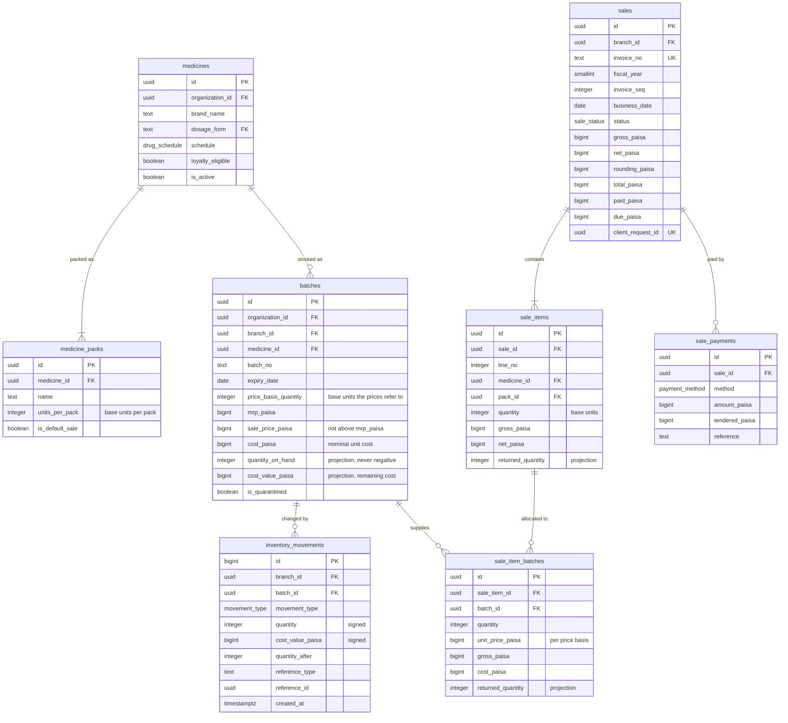
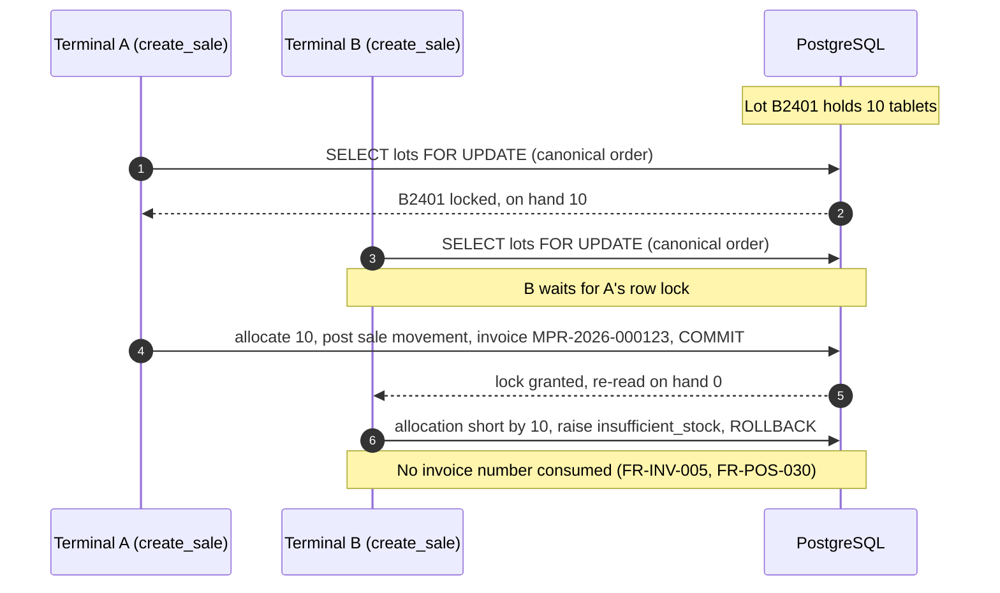

# PIMS Database Design

| Field          | Value                                                                                      |
| -------------- | ------------------------------------------------------------------------------------------ |
| Document       | Database design (canonical schema, function and data-management specification)             |
| System         | Pharmacy Inventory Management System (PIMS), repository `msasomrat/Pharmacy_Inventory`     |
| Version        | 0.1.0 (draft for review)                                                                   |
| Date           | 2026-10-06                                                                                 |
| Status         | Draft. Baseline for milestone M1 (database core); extended per milestone                   |
| Owner          | Database design (CODEOWNERS for `supabase/`)                                               |
| Approvers      | Owner (business rules), engineering lead (technical design)                                |
| Change control | Changed only by pull request, in the same pull request as the migration that implements it |

## Table of contents

1. [Introduction](#1-introduction)
2. [Design principles](#2-design-principles)
3. [Conventions](#3-conventions)
4. [Schemas, roles and privileges](#4-schemas-roles-and-privileges)
5. [Entity-relationship model](#5-entity-relationship-model)
6. [Enumerated types](#6-enumerated-types)
7. [Table catalog](#7-table-catalog)
8. [RPC and function catalog](#8-rpc-and-function-catalog)
9. [Core algorithms](#9-core-algorithms)
10. [Row Level Security strategy](#10-row-level-security-strategy)
11. [Triggers](#11-triggers)
12. [Indexing strategy](#12-indexing-strategy)
13. [Data volume and capacity estimates](#13-data-volume-and-capacity-estimates)
14. [Partitioning readiness](#14-partitioning-readiness)
15. [Retention, purging and archival](#15-retention-purging-and-archival)
16. [Reporting: summary tables, views and materialized views](#16-reporting-summary-tables-views-and-materialized-views)
17. [Scheduled database jobs and integrity checks](#17-scheduled-database-jobs-and-integrity-checks)
18. [Migration policy](#18-migration-policy)
19. [Seed data](#19-seed-data)
20. [Database testing obligations](#20-database-testing-obligations)
21. [Implementation deltas](#21-implementation-deltas)
22. [Open issues](#22-open-issues)
23. [Revision history](#23-revision-history)

---

## 1. Introduction

### 1.1 Purpose and authority

This document is the **canonical database design** for PIMS. It defines every schema, table, column,
constraint, index, view, trigger and database function, together with the algorithms (FEFO allocation,
locking, gapless numbering, idempotency, inventory valuation) and the data-management policies
(Row Level Security, indexing, partitioning, retention, migrations, seed data).

Authority rules, consistent with the rest of the documentation set:

| Topic                                                       | Canonical source                                                                                                         | This document                                                        |
| ----------------------------------------------------------- | ------------------------------------------------------------------------------------------------------------------------ | -------------------------------------------------------------------- |
| Table, column, constraint, index and function names         | **This document**                                                                                                        | Defines them; other documents use them indicatively                  |
| Requirement IDs (`FR-*`, `NFR-*`, `LDB-*`, `CFG-*`, `OD-*`) | [SRS](../requirements/SRS.md)                                                                                            | References them; never redefines them                                |
| Roles, permission matrix, threat model, MFA rules           | [Security model](../security/security-model.md)                                                                          | Uses the permission keys; does not decide which role holds which key |
| Containers, runtime flows, Edge Functions, environments     | [Architecture](../architecture/architecture.md)                                                                          | Implements the database side of those flows                          |
| Milestones and delivery order                               | [Roadmap](../roadmap.md)                                                                                                 | Tags each object with the milestone in which it is delivered         |
| Engineering rules, test levels and coverage                 | [Engineering standards](../engineering/engineering-standards.md), [testing strategy](../engineering/testing-strategy.md) | States the database-specific obligations only                        |
| Operational procedures (backup, restore, migration apply)   | [Runbook](../operations/runbook.md)                                                                                      | States the database facts the procedures rely on                     |
| Significant decisions and their rationale                   | [ADRs](../adr/README.md)                                                                                                 | Links the relevant ADR where one exists                              |

Where the SRS or the architecture uses a different name for an object (for example `receive_purchase`,
`transfer_stock`, `app.current_org_ids()`), the name in this document is authoritative and the
difference is listed in [section 22](#22-open-issues) so that the other document can be aligned.

### 1.2 Scope

In scope: the PostgreSQL database of the Supabase project (schemas `public`, `app`, `audit`,
`reporting`, `ai`), the Storage object-path conventions that the database enforces, and the
`pg_cron` jobs that run SQL. Out of scope: client-side IndexedDB storage (see the architecture, section
15), Edge Function code, and the Supabase-managed schemas (`auth`, `storage`, `cron`, `extensions`)
except where PIMS objects reference them.

Every object carries a milestone tag. Objects tagged M1 form the database core; later objects are
designed now so that the M1 schema does not block them (SRS section 1.2).

### 1.3 Terminology

| Term             | Meaning in this document                                                                                                    |
| ---------------- | --------------------------------------------------------------------------------------------------------------------------- |
| Tenant           | An organization (`organizations` row): one pharmacy business                                                                |
| Branch           | A physical shop of an organization (for example `MPR`, Mohammadpur)                                                         |
| Base unit        | The smallest sellable unit of a medicine (tablet, capsule, bottle, tube). All stock quantities are integers in base units   |
| Pack             | A pack level of a medicine (piece, strip, box) with an integer number of base units                                         |
| Lot (batch row)  | One `batches` row: stock of one medicine batch at one branch with one expiry date, MRP and cost                             |
| Posted document  | A business document whose effects (stock, money, points) have been written; it is immutable apart from listed transitions   |
| Ledger           | An append-only table whose rows are never updated or deleted; corrections are compensating rows                             |
| Projection       | A stored value derived from a ledger (for example `batches.quantity_on_hand`), changed only in the same transaction         |
| Business date    | The calendar date in Asia/Dhaka on which a transaction is recorded                                                          |
| Fiscal year (FY) | Bangladesh fiscal year, July to June by default (CFG-03), labelled by its starting year: FY 2026 = 2026-07-01 to 2027-06-30 |
| RPC              | A PostgreSQL function in schema `public` called through PostgREST `POST /rest/v1/rpc/<name>`                                |
| paisa            | Minor currency unit: 1 BDT (৳) = 100 paisa                                                                                  |

The [glossary](../glossary.md) holds business terms (MRP, DGDA, বাকি and so on).

### 1.4 Implementation status

The schema is implemented as forward-only migrations in `supabase/migrations/`. Status at this
version:

| Migration file                              | Content                                                                                   | Status                             |
| ------------------------------------------- | ----------------------------------------------------------------------------------------- | ---------------------------------- |
| `20261006120000_foundation.sql`             | Extensions, schemas, privilege hardening, shared enums, utility functions, `audit.log`    | Implemented (M1)                   |
| `20261006120100_tenancy_and_access.sql`     | Organizations, settings, branches, profiles, memberships, permissions, access helpers     | Implemented (M1)                   |
| `20261006120200_catalog_and_inventory.sql`  | Catalog, batches, inventory ledger, adjustments, POS search                               | Implemented (M1)                   |
| `20261006120300_partners_and_purchases.sql` | Suppliers, customers, ledgers, goods receipts, purchase returns, payments                 | Implemented (M1)                   |
| `20261006120400_loyalty.sql`                | Loyalty plans, cards, memberships, points ledger                                          | Implemented (M1 groundwork for M3) |
| `20261006120500_sales.sql`                  | Sales, allocations, payments, returns, voids, prescriptions, controlled register, summary | Implemented (M1)                   |
| `20261006120600_reports.sql`                | Permission-checked report functions                                                       | Implemented (M1)                   |

Each table in [section 7](#7-table-catalog) is marked **Implemented**, **Implemented, delta** (exists
but must be aligned with this design; see [section 21](#21-implementation-deltas)) or **Designed**
(specified here, delivered in the stated milestone).

---

## 2. Design principles

| ID    | Principle                                                        | Consequence in the schema                                                                                                                                                              |
| ----- | ---------------------------------------------------------------- | -------------------------------------------------------------------------------------------------------------------------------------------------------------------------------------- |
| DP-01 | The database is the authority for business rules (NFR-MAINT-003) | Prices, discounts, totals, stock and balances are computed and validated inside PostgreSQL functions. Client values are hints at most (expected total, preview).                       |
| DP-02 | Ledger first                                                     | Every change of stock, money owed, points or cash is a row in an append-only ledger. Balances such as on-hand quantity are projections updated in the same transaction.                |
| DP-03 | Tenant integrity by construction (NFR-REL-008)                   | Every tenant row carries `organization_id`; foreign keys are composite `(organization_id, <parent>_id)`, so a row can never reference another tenant's row, even from privileged code. |
| DP-04 | Deny by default (NFR-SEC-010)                                    | RLS on every table; `anon` has nothing; `authenticated` receives explicit, column-level grants; transactional writes only through `SECURITY DEFINER` RPCs.                             |
| DP-05 | Exact money (NFR-REL-005)                                        | `BIGINT` paisa everywhere; no `real`, `double precision` or `money` types; documented rounding points; allocations always sum exactly to their totals.                                 |
| DP-06 | Idempotent document creation (NFR-REL-006)                       | Every document-creating RPC takes a client-generated `client_request_id`; a retry returns the original result and never creates a second document or consumes a number.                |
| DP-07 | Posted means immutable (NFR-REL-007)                             | Posted documents and ledgers reject `UPDATE` and `DELETE` by trigger; corrections are reversing documents (void, return, reversal, compensating entry).                                |
| DP-08 | Configuration, not code (NFR-MAINT-004)                          | Every Appendix A parameter of the SRS is a typed, constrained column in `organization_settings` (or on the stated entity); functions read it at run time.                              |
| DP-09 | Deterministic concurrency                                        | One canonical lock order for all functions (section 9.3); gapless counters taken late; no external calls inside transactions.                                                          |
| DP-10 | Growth-ready, not prematurely complex                            | Partition-ready keys and summary tables from M1; partitioning and read replicas only when the triggers in sections 13 and 14 are reached.                                              |

---

## 3. Conventions

### 3.1 Naming

| Object                  | Rule                                                                                              | Examples                                                    |
| ----------------------- | ------------------------------------------------------------------------------------------------- | ----------------------------------------------------------- |
| Identifiers             | `snake_case`, ASCII, never quoted; abbreviations limited to `no` (number) and `bp` (basis points) | `goods_receipt_items`, `expiry_date`                        |
| Tables                  | Plural nouns; child tables prefix the parent's singular name                                      | `sales`, `sale_items`, `sale_item_batches`                  |
| Columns                 | Singular; foreign keys `<referenced singular>_id`; role-qualified FKs `<role>_<entity>_id`        | `medicine_id`, `source_branch_id`, `destination_branch_id`  |
| Money                   | Suffix `_paisa`, type `bigint`                                                                    | `total_paisa`, `credit_limit_paisa`                         |
| Rates and percentages   | Suffix `_bp` (basis points, 100 bp = 1 %), type `integer`                                         | `discount_bp`, `vat_bp`                                     |
| Quantities              | Integer base units, no suffix; pack quantities prefixed `pack_`                                   | `quantity`, `pack_quantity`, `quantity_on_hand`             |
| Timestamps              | Suffix `_at`, type `timestamptz`                                                                  | `created_at`, `voided_at`                                   |
| Dates                   | Suffix `_date`, or `_on` for period bounds, type `date`                                           | `business_date`, `expiry_date`, `starts_on`, `ends_on`      |
| Booleans                | Prefix `is_`, `has_`, `can_` or a past participle                                                 | `is_active`, `can_dispense_controlled`, `rx_seen_confirmed` |
| Human-readable numbers  | Suffix `_no`                                                                                      | `invoice_no`, `card_no`, `receipt_no`                       |
| Actor columns           | `<verb>_by` (uuid of `auth.users`) paired with `<verb>_at`                                        | `voided_by` / `voided_at`                                   |
| Primary key constraint  | `<table>_pkey` (PostgreSQL default)                                                               | `sales_pkey`                                                |
| Unique index/constraint | `<table>_<columns or purpose>_key`                                                                | `customers_org_phone_key`                                   |
| Other indexes           | `<table>_<columns or purpose>_idx`                                                                | `batches_fefo_idx`                                          |
| Check constraints       | `<table>_<rule>` (named when cross-column)                                                        | `sales_total`, `batches_price_within_mrp`                   |
| Triggers                | `<table>_<purpose>`                                                                               | `sales_guard_update`, `inventory_movements_append_only`     |
| Functions               | `verb_noun`; RPC parameters prefixed `p_`, local variables `v_`                                   | `create_sale(p_branch_id, ...)`                             |
| Enum types              | Singular noun                                                                                     | `movement_type`, `sale_status`                              |

### 3.2 Keys and identifiers

- **Primary keys** are `uuid` with `DEFAULT gen_random_uuid()` (pgcrypto, PostgreSQL 13+ built-in).
  UUIDs are opaque: they are safe to expose in URLs and API payloads and allow the offline client
  (M4) to generate identifiers.
- **Exception 1, append-only ledgers and logs** (`inventory_movements`, `customer_ledger_entries`,
  `supplier_ledger_entries`, `loyalty_point_ledger`, `cash_movements`, `controlled_drug_register`,
  `audit.log`) use `bigint GENERATED ALWAYS AS IDENTITY`. These rows are never referenced as business
  identifiers, are inserted at high volume, and benefit from a compact, monotonic key (stock card
  ordering, smaller indexes, partition friendliness). `GENERATED ALWAYS` prevents client-chosen values.
- **Exception 2, pure association and settings tables** use their natural composite key
  (`branch_medicine_settings (branch_id, medicine_id)`, `organization_settings (organization_id)`,
  `daily_branch_sales (branch_id, business_date)`, `loyalty_plan_branches (plan_id, branch_id)`).
- **Tenant-scoped unique key for composite foreign keys.** Every tenant table also declares
  `UNIQUE (organization_id, id)`. Child tables reference parents with
  `FOREIGN KEY (organization_id, <parent>_id) REFERENCES <parent> (organization_id, id)` (DP-03).
- **Branch-consistent foreign keys.** The organization-level key alone does not stop a child row from
  pointing at a lot or document of **another branch** of the same organization, or from repeating a
  `branch_id`, `medicine_id` or `business_date` that disagrees with its parent, and the class D and L
  policies of section 10.2 filter on exactly those denormalized columns. Branch-scoped parents
  therefore also declare `UNIQUE (organization_id, branch_id, id)` (`batches`, `sales`, `sale_items`,
  `sale_returns`, `stock_counts`, `purchase_returns`, `goods_receipts`, `prescriptions`), and
  `batches` additionally `UNIQUE (organization_id, branch_id, medicine_id, id)`. Child rows reference
  them with composite keys that include every repeated column:

  | Child                      | Composite foreign key                                                                                                                                          |
  | -------------------------- | -------------------------------------------------------------------------------------------------------------------------------------------------------------- |
  | `inventory_movements`      | `(organization_id, branch_id, medicine_id, batch_id) → batches`                                                                                                |
  | `controlled_drug_register` | `(organization_id, branch_id, medicine_id, batch_id) → batches`                                                                                                |
  | `stock_adjustments`        | `(organization_id, branch_id, medicine_id, batch_id) → batches`                                                                                                |
  | `sale_items`               | `(organization_id, branch_id, sale_id) → sales`                                                                                                                |
  | `sale_item_batches`        | `(organization_id, branch_id, sale_item_id) → sale_items`, `(organization_id, branch_id, sale_id) → sales`, `(organization_id, branch_id, batch_id) → batches` |
  | `sale_payments`            | `(organization_id, branch_id, sale_id) → sales`                                                                                                                |
  | `sale_return_items`        | `(organization_id, branch_id, sale_return_id) → sale_returns`                                                                                                  |
  | `stock_count_lines`        | `(organization_id, branch_id, stock_count_id) → stock_counts`, `(organization_id, branch_id, medicine_id, batch_id) → batches`                                 |
  | `purchase_return_items`    | `(organization_id, branch_id, purchase_return_id) → purchase_returns`, `(organization_id, branch_id, medicine_id, batch_id) → batches`                         |
  | `goods_receipt_items`      | `(organization_id, branch_id, goods_receipt_id) → goods_receipts`, `(organization_id, branch_id, medicine_id, batch_id) → batches`                             |
  | `sales.prescription_id`    | `(organization_id, branch_id, prescription_id) → prescriptions`                                                                                                |

  `sale_return_items.sale_item_id` stays an organization-level key because a return may be processed
  at a branch other than the selling branch. `business_date` on sale children is copied from the
  header by the posting function and is part of these keys once the sale tables are partitioned
  (section 14); until then IC-10 verifies it. Composite keys whose leading columns are
  `(organization_id, branch_id)` are covered for the FK-index rule by an index leading with the
  referenced ID column (section 12).

- **Human-readable identifiers** (invoice, credit note, receipt, transfer and card numbers, SKU) are
  separate `text` columns with their own unique constraints scoped by organization (LDB-03). They are
  generated by the database (section 9.4), never by the client.

### 3.3 Tenant and branch columns

| Table class                         | Required columns                                                                        | Notes                                                                                                                    |
| ----------------------------------- | --------------------------------------------------------------------------------------- | ------------------------------------------------------------------------------------------------------------------------ |
| Platform reference                  | none                                                                                    | Shared read-only lists (for example `dosage_forms`)                                                                      |
| Organization-scoped (tenant master) | `organization_id uuid NOT NULL`                                                         | Catalog, suppliers, customers, loyalty plans, settings                                                                   |
| Branch-scoped                       | `organization_id` and `branch_id`, both NOT NULL                                        | Documents, lines **and** allocation rows: child rows repeat `branch_id` so RLS needs no join and partitions stay aligned |
| Inter-branch                        | `organization_id`, `source_branch_id`, `destination_branch_id`                          | Stock transfers and their lines                                                                                          |
| User-scoped                         | `user_id` or `recipient_user_id` (plus `organization_id` where tenant data is involved) | Profiles, notifications                                                                                                  |

`organization_id` and `branch_id` are immutable after insert (trigger `app.guard_organization_id()`
and, for branches, `app.branches_guard_immutable()`), and every such column is indexed (section 12).

### 3.4 Standard audit columns

| Set   | Columns                                                                                                                                                                                    | Used by                                                | Maintained by                                                                                                                   |
| ----- | ------------------------------------------------------------------------------------------------------------------------------------------------------------------------------------------ | ------------------------------------------------------ | ------------------------------------------------------------------------------------------------------------------------------- |
| Std-M | `created_at timestamptz NOT NULL DEFAULT now()`, `created_by uuid NULL`, `updated_at timestamptz NOT NULL DEFAULT now()`, `updated_by uuid NULL`, `row_version integer NOT NULL DEFAULT 1` | Mutable master and configuration tables                | `app.set_created_by()` (BEFORE INSERT) and `app.touch_updated()` (BEFORE UPDATE, also sets `row_version = OLD.row_version + 1`) |
| Std-D | `created_at timestamptz NOT NULL DEFAULT now()`, `created_by uuid NOT NULL`                                                                                                                | Posted document headers                                | The posting RPC (from `auth.uid()`)                                                                                             |
| Std-L | `created_at timestamptz NOT NULL DEFAULT now()`, `created_by uuid NULL`                                                                                                                    | Ledgers (NULL only for rows written by scheduled jobs) | The posting RPC or job                                                                                                          |

All `*_by` columns reference `auth.users (id)`. `created_by` and `updated_by` are never accepted from
the client: column grants exclude them and the triggers overwrite them.

**Optimistic concurrency (NFR-REL-009, M2).** `row_version` is the version token for master-data
edits. A client reads it with the row and sends it back: a direct PostgREST update filters on
`id = :id AND row_version = :version` (zero rows updated means another user changed the row first),
and an update RPC takes `p_row_version integer` and raises `stale_version` on mismatch. `updated_at`
is not used as the token because it carries microseconds that do not survive a round trip through a
JavaScript `Date`. `row_version` is excluded from insert and update grants and is set only by
`app.touch_updated()`.

### 3.5 Lifecycle, soft delete and immutability

- **No hard deletes of business records** (LDB-05). `authenticated` has no `DELETE` privilege on any
  business table. The only deletable rows are configuration details that have never been used (an
  unused barcode or pack definition), user conveniences (`document_drafts`), and rows removed by
  retention jobs (section 15).
- **Deactivation, not `archived_at`.** Master data uses `is_active boolean NOT NULL DEFAULT true`.
  Deactivating (archiving) sets it to `false`; who and when is recorded by the audit trigger, so a
  separate `archived_at` column is not used. Partial indexes `WHERE is_active` keep lookups fast.
  Reactivation is an ordinary audited update.
- **Documents use a status column** (`status` enum) whose allowed transitions are enforced by the
  owning RPC and guarded by a trigger that rejects changes to any other column (for example
  `app.sales_guard_update()`).
- **Ledgers are append-only**: trigger `app.forbid_mutation()` rejects `UPDATE` and `DELETE` for every
  role that is subject to triggers, and `TRUNCATE` is revoked. A trigger alone does not bind the
  **table owner**, which can disable or drop it, re-grant itself privileges or use
  `session_replication_role = replica`. Ledger immutability therefore also rests on ownership
  separation (section 4.2): the ledger tables (`inventory_movements`, `customer_ledger_entries`,
  `supplier_ledger_entries`, `loyalty_point_ledger`, `cash_movements`, `controlled_drug_register`)
  and `audit.log` are owned by the `NOLOGIN` role `ledger_owner`; the role that owns the
  `SECURITY DEFINER` functions (`pims_api`) holds only `SELECT` and `INSERT` on them; an event trigger
  rejects `ALTER TABLE ... DISABLE TRIGGER`, `DROP TRIGGER` and ownership changes on those tables by
  any role other than the migration role; and a CI catalog check fails when a ledger has another
  owner, when any role other than `ledger_owner` holds `UPDATE`, `DELETE` or `TRUNCATE` on it, or when
  its append-only trigger is missing or disabled.

### 3.6 Data types

| Kind                 | Type                                      | Rule                                                                                                                                          |
| -------------------- | ----------------------------------------- | --------------------------------------------------------------------------------------------------------------------------------------------- |
| Money                | `bigint` paisa                            | `CHECK (x >= 0)` unless the column is a signed ledger amount. Maximum magnitude 10^12 paisa (mirrors `MAX_PAISA` in `src/domain/money.ts`)    |
| Percentages, rates   | `integer` basis points                    | `CHECK (x BETWEEN 0 AND 10000)` unless a tighter bound applies (VAT at most 5000 bp per CFG-01)                                               |
| Quantities           | `integer` base units                      | `CHECK (quantity > 0)` on lines; signed only in ledgers, with a direction check per movement type                                             |
| Prices               | `bigint` paisa per **price basis**        | A lot stores MRP and sale price for `price_basis_quantity` base units (normally one pack), avoiding fractional paisa per tablet (section 9.1) |
| Points               | `integer`                                 | Non-negative on documents, signed in the points ledger                                                                                        |
| Text                 | `text` with `CHECK (length(...) <= n)`    | No `varchar(n)`; names also `CHECK (length(btrim(x)) >= 1 or 2)`                                                                              |
| Phone numbers        | `text` in E.164 (`+8801XXXXXXXXX`)        | Normalized by trigger `app.normalize_phone_column()` via `app.normalize_bd_phone()`; `CHECK (phone ~ '^\+8801[3-9][0-9]{8}$')`                |
| Email                | `text`, stored lower-case                 | `CHECK (email ~* '^[^@\s]+@[^@\s]+\.[^@\s]+$')`                                                                                               |
| Timestamps           | `timestamptz`                             | Stored in UTC; displayed in Asia/Dhaka                                                                                                        |
| Business dates       | `date`                                    | Computed by `app.business_date(organization_id, at)` in the organization time zone (Asia/Dhaka)                                               |
| Identifiers          | `uuid` (or `bigint` identity for ledgers) | See 3.2                                                                                                                                       |
| Semi-structured data | `jsonb`                                   | Only for RPC payloads, display snapshots, validated configuration lists and audit images. Never for data that is filtered, joined or summed   |
| Binary digests       | `bytea`                                   | SHA-256 request hashes and token hashes                                                                                                       |

Floating-point types (`real`, `double precision`) and the `money` type are forbidden; a CI catalog
query fails the build if any column uses them.

### 3.7 Rounding and allocation rules

| Rule | Definition                                                                                                                                                                                                                                                                                                                                                                                                                                                                                                                                                                                                                                  | Function                                        |
| ---- | ------------------------------------------------------------------------------------------------------------------------------------------------------------------------------------------------------------------------------------------------------------------------------------------------------------------------------------------------------------------------------------------------------------------------------------------------------------------------------------------------------------------------------------------------------------------------------------------------------------------------------------------- | ----------------------------------------------- |
| R-1  | Round half up to the nearest paisa (for non-negative values; half away from zero for negative values). Implemented with `round(numeric)`                                                                                                                                                                                                                                                                                                                                                                                                                                                                                                    | `round()` on `numeric`                          |
| R-2  | Percentage of an amount: `round(amount * bp / 10000)`                                                                                                                                                                                                                                                                                                                                                                                                                                                                                                                                                                                       | `app.percent_of(bigint, integer)`               |
| R-3  | Proportional allocation of a total over weights (invoice discount over lines, loyalty cap over eligible lines), largest-remainder (Hamilton) method: each part starts at `floor(total * weight / sum(weights))`; the `r` paisa still missing (`r < n`) go one each to the `r` parts with the largest fractional remainders `(total * weight) mod sum(weights)` (ties: lowest line number). Parts always sum to the total, each part is at most `ceil` of its exact share and therefore never exceeds its weight when `total <= sum(weights)` (FR-POS-019, FR-LOY-028). Example: total 299 over weights `[100,100,100]` gives `[100,100,99]` | `app.allocate_proportionally(bigint, bigint[])` |
| R-4  | Partial reversal of a line or allocation (returns, transfer receipt, cost of a partial issue): `round(amount * quantity / total_quantity)`; the final reversal of the remaining quantity receives the residual, so totals never exceed the original amount (FR-POS-051)                                                                                                                                                                                                                                                                                                                                                                     | `app.proportional_part(...)`                    |
| R-5  | Line gross from a lot price: `round(quantity * price_paisa / price_basis_quantity)`, once per allocated lot portion (FR-POS-012)                                                                                                                                                                                                                                                                                                                                                                                                                                                                                                            | inside `app.price_sale()`                       |
| R-6  | VAT contained in an MRP-inclusive net: `round(net * vat_bp / (10000 + vat_bp))`, per line (CFG-01)                                                                                                                                                                                                                                                                                                                                                                                                                                                                                                                                          | inside `app.price_sale()`                       |
| R-7  | Optional cash rounding to the nearest taka (CFG-02): adjustment = `round(subtotal / 100.0) * 100 - subtotal`, always within -49 to +50 paisa                                                                                                                                                                                                                                                                                                                                                                                                                                                                                                | inside `app.price_sale()`                       |

The client preview (`src/domain/money.ts`) implements the same rules for display only; shared test
vectors keep both implementations identical (NFR-REL-011).

### 3.8 Constraints

- `NOT NULL` is the default; a nullable column must have a documented meaning for `NULL`.
- Every categorical `text` column has a `CHECK (col IN (...))`; every free-text column has a length
  limit; every money, quantity and rate column has a range check.
- Cross-column invariants are table `CHECK` constraints wherever they involve one row only, for
  example `sales_total CHECK (total_paisa = net_paisa + rounding_paisa)` and
  `batches_price_within_mrp CHECK (sale_price_paisa <= mrp_paisa)`.
- Ledger direction checks bind the sign of the amount to the entry type (for example a `sale`
  movement must be negative).
- Invariants spanning rows (for example a membership period must not overlap another) use exclusion
  constraints (`btree_gist`) or partial unique indexes; invariants spanning tables (on-hand equals the
  ledger sum) are maintained by the posting functions and verified nightly (section 17).
- Foreign keys are `ON DELETE NO ACTION` (the default) everywhere except `profiles.id`, which
  cascades from `auth.users` because Supabase owns that table.

### 3.9 Enumerated types versus lookup tables

| Use                             | When                                                                                                                           | Examples                                                                      |
| ------------------------------- | ------------------------------------------------------------------------------------------------------------------------------ | ----------------------------------------------------------------------------- |
| PostgreSQL `ENUM` type          | Closed set owned by the platform, used in RPC signatures or in several tables, and code branches on the value                  | `org_role`, `drug_schedule`, `movement_type`, `payment_method`, `sale_status` |
| `text` + `CHECK (... IN (...))` | Closed set used by a single table, likely to evolve (a `CHECK` can be replaced transactionally; enum values cannot be removed) | `customer_ledger_entries.entry_type`, `approvals.action`                      |
| Platform lookup table           | Platform-owned list whose rows carry attributes (labels in English and Bangla, sort order, active flag)                        | `dosage_forms`                                                                |
| Tenant lookup table             | List that an organization edits (for example CFG-39)                                                                           | `expense_categories`, `discount_reasons`                                      |

Adding an enum value is a forward-only migration (`ALTER TYPE ... ADD VALUE`, outside the transaction
that first uses it). Labels shown to users never come from enum names; the client translates them
through i18next keys `enum.<type>.<value>`.

### 3.10 Documentation in the database

Every table and every non-obvious column has a `COMMENT ON`, written in English, matching this
document. Supabase Studio and generated TypeScript types (`src/lib/database.types.ts`, produced by
`supabase gen types typescript`) surface these comments to developers.

---

## 4. Schemas, roles and privileges

### 4.1 Schemas

| Schema       | Exposed by PostgREST | Contents                                                                                                        | Milestone |
| ------------ | -------------------- | --------------------------------------------------------------------------------------------------------------- | --------- |
| `public`     | Yes                  | Business tables (RLS on every one), `security_invoker` views, enum types, RPC functions                         | M1        |
| `app`        | No                   | Security helpers, internal business functions, `role_permissions`, `document_sequences`, `integrity_check_runs` | M1        |
| `audit`      | No                   | `audit.log` and its trigger function                                                                            | M1        |
| `reporting`  | No                   | Materialized views, nightly snapshot tables and (M5) PII-free views for AI; read through `public.report_*`      | M3        |
| `ai`         | No                   | AI request log and monthly usage counters                                                                       | M5        |
| `extensions` | No                   | `pgcrypto`, `pg_trgm`, `btree_gist`, `pg_stat_statements`; `pg_cron` lives in its own `cron` schema             | M1        |

`app`, `audit`, `reporting` and `ai` revoke all privileges from `PUBLIC`; `authenticated` receives
`USAGE` on `app` and `audit` only so that RLS policies and `security_invoker` views can call the
granted helper functions.

### 4.2 Database roles

| Role                            | Purpose                                                                                                                                                                                                   | Business data access                                                                                                          |
| ------------------------------- | --------------------------------------------------------------------------------------------------------------------------------------------------------------------------------------------------------- | ----------------------------------------------------------------------------------------------------------------------------- |
| `postgres`                      | Migration role (Supabase default); owns non-ledger tables and runs migrations                                                                                                                             | Full; used only by migrations                                                                                                 |
| `pims_api` (M1, delta D-24)     | `NOLOGIN` owner of every `SECURITY DEFINER` function; definer functions run as it                                                                                                                         | Full DML on documents, master data and projections; **only `SELECT` and `INSERT`** on ledgers and `audit.log`; owns no ledger |
| `ledger_owner` (M1, delta D-24) | `NOLOGIN` owner of the ledger tables and `audit.log` (section 3.5)                                                                                                                                        | Owns them; nothing logs in as it, and no function is owned by it                                                              |
| `authenticated`                 | Every signed-in user through PostgREST                                                                                                                                                                    | Through RLS, column grants and granted RPCs only                                                                              |
| `anon`                          | Unauthenticated PostgREST requests                                                                                                                                                                        | **None** (no table, view or function privileges in PIMS schemas)                                                              |
| `service_role`                  | Edge Functions: Auth administration (`admin-users`), the storage retention purge, and signing Storage URLs after a permission-checked, audited RPC has authorized the read (`storage-sign`, section 10.6) | Bypasses RLS; never used for business writes, which go through the same RPCs as the UI                                        |
| `ai_reader` (M5)                | Non-login role assumed by the AI gateway for ask-your-data queries                                                                                                                                        | `SELECT` on allow-listed `reporting.ai_*` views only, with the caller's scope applied                                         |

### 4.3 Privilege model

1. Default privileges in `public` are revoked from `anon` and `authenticated` for tables, sequences
   and functions (foundation migration).
2. Every migration grants exactly what it needs: `SELECT` on readable tables, **column-level**
   `INSERT`/`UPDATE` on client-editable master data, and `EXECUTE` on RPCs.
3. Every migration ends with `CALL app.harden_privileges();`, which re-revokes anything granted to
   `anon` or `PUBLIC` in PIMS schemas, including `EXECUTE` on every function.
4. Cost-bearing columns (`batches.cost_paisa`, `batches.cost_value_paisa`,
   `inventory_movements.cost_value_paisa`, line and document `cost_paisa`) are **not granted** to
   `authenticated`; cost and profit are returned only by report functions that check
   `reports.view_cost` (FR-RPT-021).
5. `SECURITY DEFINER` functions: `SET search_path = ''`, every object schema-qualified, authorization
   in the first statements, `EXECUTE` revoked from `PUBLIC` and `anon` (NFR-SEC-009).

### 4.4 Table classes and write paths

| Class | Name                    | Examples                                                                                | Client read                                      | Client write                                                                        |
| ----- | ----------------------- | --------------------------------------------------------------------------------------- | ------------------------------------------------ | ----------------------------------------------------------------------------------- |
| P     | Platform reference      | `dosage_forms`                                                                          | All authenticated users                          | None                                                                                |
| T     | Tenant master data      | `medicines`, `generics`, `manufacturers`, `suppliers`, `customers`, `loyalty_plans`     | Members of the organization                      | PostgREST DML under RLS `WITH CHECK` and column grants (Tier 2 in the architecture) |
| C     | Branch configuration    | `branch_medicine_settings`, `registers`                                                 | Users with branch access                         | PostgREST DML under RLS with `app.can(branch_id, permission)`                       |
| D     | Transactional documents | `sales`, `goods_receipts`, `stock_transfers`, `cash_sessions`, `expenses`               | Users with branch access (+ permission)          | **RPC only** (Tier 1)                                                               |
| L     | Ledgers and projections | `inventory_movements`, `batches`, customer and supplier ledgers, points, cash, register | Users with branch access (+ permission)          | **None**; written only by Tier 1 functions (Tier 3)                                 |
| A     | Audit                   | `audit.log`                                                                             | Through `public.list_audit_log()` (`audit.view`) | None (trigger only)                                                                 |
| U     | User-private            | `profiles`, `notifications`, `document_drafts`                                          | Own rows (drafts: branch users)                  | Own rows, restricted columns                                                        |
| I     | Internal                | `app.document_sequences`, `app.role_permissions`, `ai.*`                                | None                                             | None                                                                                |

---

## 5. Entity-relationship model

### 5.1 Full entity-relationship diagram

The diagram shows every table and its foreign-key relationships. Attributes are omitted for
readability; they are listed in [section 7](#7-table-catalog). Every tenant table also references
`organizations` through `organization_id`; those edges are drawn only for organization-level master
data. `audit_log`, `document_sequences`, `role_permissions`, `integrity_check_runs`, `ai_requests`,
`ai_usage_monthly` and `stock_value_snapshots` stand for `audit.log`, `app.document_sequences`,
`app.role_permissions`, `app.integrity_check_runs`, `ai.requests`, `ai.usage_monthly` and
`reporting.stock_value_snapshots`.

```mermaid
erDiagram
  organizations ||--|| organization_settings : "configured by"
  organizations ||--o{ branches : "owns"
  organizations ||--o{ memberships : "grants"
  profiles ||--o{ memberships : "holds"
  branches ||--o{ branch_assignments : "staffed by"
  profiles ||--o{ branch_assignments : "assigned to"
  organizations ||--o{ invitations : "issues"
  branches ||--o{ registers : "has"
  registers ||--o{ terminals : "used on"
  branches ||--o{ approvals : "records"
  memberships }o--o{ role_permissions : "role grants"
  branches ||--o{ document_sequences : "numbers"

  organizations ||--o{ manufacturers : "maintains"
  organizations ||--o{ generics : "maintains"
  organizations ||--o{ medicines : "catalogs"
  dosage_forms ||--o{ medicines : "classifies"
  manufacturers ||--o{ medicines : "makes"
  generics ||--o{ medicines : "is generic of"
  medicines ||--|{ medicine_packs : "packed as"
  medicines ||--o{ medicine_barcodes : "identified by"
  medicine_packs ||--o{ medicine_barcodes : "labels"
  branches ||--o{ branch_medicine_settings : "stocks"
  medicines ||--o{ branch_medicine_settings : "configured in"

  branches ||--o{ batches : "holds"
  medicines ||--o{ batches : "stocked as"
  batches ||--o{ inventory_movements : "changed by"
  batches ||--o{ stock_adjustments : "adjusted by"
  branches ||--o{ stock_counts : "counts"
  stock_counts ||--o{ stock_count_lines : "contains"
  batches ||--o{ stock_count_lines : "counted in"
  branches ||--o{ stock_transfers : "sends"
  branches ||--o{ stock_transfers : "receives"
  stock_transfers ||--|{ stock_transfer_items : "lists"
  stock_transfer_items ||--o{ stock_transfer_item_batches : "dispatched as"
  batches ||--o{ stock_transfer_item_batches : "source lot"
  batches |o--o{ stock_transfer_item_batches : "destination lot"

  organizations ||--o{ suppliers : "buys from"
  suppliers ||--o{ purchase_orders : "receives"
  branches ||--o{ purchase_orders : "raises"
  purchase_orders ||--|{ purchase_order_items : "lists"
  medicines ||--o{ purchase_order_items : "ordered as"
  suppliers ||--o{ goods_receipts : "delivers"
  branches ||--o{ goods_receipts : "receives"
  purchase_orders |o--o{ goods_receipts : "fulfilled by"
  goods_receipts ||--|{ goods_receipt_items : "lists"
  batches ||--o{ goods_receipt_items : "created or topped up by"
  purchase_order_items |o--o{ goods_receipt_items : "received as"
  goods_receipts |o--o| supplier_invoices : "billed as"
  suppliers ||--o{ supplier_invoices : "bills"
  suppliers ||--o{ supplier_payments : "is paid"
  supplier_payments ||--o{ supplier_payment_allocations : "allocated by"
  supplier_invoices ||--o{ supplier_payment_allocations : "settled by"
  suppliers ||--o{ supplier_ledger_entries : "has ledger"
  suppliers ||--o{ purchase_returns : "takes back"
  branches ||--o{ purchase_returns : "returns"
  purchase_returns ||--|{ purchase_return_items : "lists"
  batches ||--o{ purchase_return_items : "returned from"

  organizations ||--o{ customers : "serves"
  customers ||--o{ customer_ledger_entries : "has due ledger"
  customers ||--o{ customer_payments : "pays"
  customers ||--o{ customer_receivables : "owes"
  sales |o--o| customer_receivables : "creates credit"
  customer_receivables ||--o{ customer_receivable_allocations : "reduced by"
  customer_payments |o--o{ customer_receivable_allocations : "allocated by"
  sale_returns |o--o{ customer_receivable_allocations : "reduces due"
  branches ||--o{ mfs_accounts : "receives MFS on"
  mfs_accounts |o--o{ sale_payments : "credited to"
  mfs_accounts |o--o{ customer_payments : "credited to"
  organizations ||--o{ loyalty_card_stock : "pre-prints"

  branches ||--o{ sales : "sells"
  registers |o--o{ sales : "rung up on"
  cash_sessions |o--o{ sales : "collected in"
  customers |o--o{ sales : "buys"
  loyalty_memberships |o--o{ sales : "benefits"
  prescriptions |o--o{ sales : "authorizes"
  sales ||--|{ sale_items : "contains"
  medicines |o--o{ sale_items : "sold as"
  medicine_packs |o--o{ sale_items : "sold in"
  sale_items ||--o{ sale_item_batches : "allocated to"
  batches ||--o{ sale_item_batches : "supplies"
  sales ||--o{ sale_payments : "paid by"
  sales ||--o{ sale_returns : "returned by"
  sale_returns ||--|{ sale_return_items : "lists"
  sale_items ||--o{ sale_return_items : "returned as"
  discount_reasons |o--o{ sales : "justifies"
  branches ||--o{ document_drafts : "parks"

  branches ||--o{ prescriptions : "captures"
  medicines ||--o{ controlled_drug_register : "registered"
  inventory_movements ||--o| controlled_drug_register : "recorded as"
  prescriptions |o--o{ controlled_drug_register : "supports"

  organizations ||--o{ loyalty_plans : "offers"
  loyalty_plans ||--o{ loyalty_plan_branches : "limited to"
  branches ||--o{ loyalty_plan_branches : "honours"
  customers ||--o{ loyalty_cards : "carries"
  loyalty_cards ||--o{ loyalty_memberships : "covers"
  loyalty_plans ||--o{ loyalty_memberships : "terms of"
  sales |o--o{ loyalty_memberships : "fee invoiced on"
  customers ||--o{ loyalty_point_lots : "earns"
  loyalty_point_lots |o--o{ loyalty_point_ledger : "moved by"
  customers ||--o{ loyalty_point_ledger : "points of"
  sales ||--o| loyalty_usages : "records benefit"
  loyalty_cards ||--o{ loyalty_usages : "used in"
  loyalty_cards |o--o{ loyalty_exceptions : "flagged by"

  registers ||--o{ cash_sessions : "opens"
  cash_sessions ||--o{ cash_movements : "records"
  organizations ||--o{ expense_categories : "defines"
  expense_categories ||--o{ expenses : "classifies"
  branches ||--o{ expenses : "spends"
  cash_sessions |o--o{ expenses : "paid from"

  profiles ||--o{ notifications : "receives"
  branches ||--o{ daily_branch_sales : "summarized in"
  branches ||--o{ stock_value_snapshots : "valued in"
  medicines ||--o{ stock_value_snapshots : "valued as"
  organizations ||--o{ ai_requests : "meters"
  organizations ||--o{ ai_usage_monthly : "totals"
  organizations |o--o{ audit_log : "audited in"
  organizations ||--o{ data_exports : "exports"
  integrity_check_runs {
    bigint id PK
    text check_name
  }
```



### 5.2 Core stock and sale path (attribute level)

The tables that carry the stock and money invariants, with the columns that participate in them.



---

## 6. Enumerated types

All enum types live in schema `public` so that PostgREST can expose them in RPC signatures and
generated TypeScript types.

| Type                        | Values                                                                                                                                                                                                                                              | Used by                                                           | Status                                                                                     |
| --------------------------- | --------------------------------------------------------------------------------------------------------------------------------------------------------------------------------------------------------------------------------------------------- | ----------------------------------------------------------------- | ------------------------------------------------------------------------------------------ |
| `org_role`                  | `owner`, `manager`, `salesman`, `accountant`, `auditor`                                                                                                                                                                                             | `memberships`, `invitations`, `app.role_permissions`              | Implemented                                                                                |
| `drug_schedule`             | `otc`, `rx`, `controlled`                                                                                                                                                                                                                           | `medicines`, `sale_items` (snapshot)                              | Implemented                                                                                |
| `payment_method`            | `cash`, `bkash`, `nagad`, `rocket`, `card`, `bank_transfer`, `cheque`, `credit`, `loyalty_points`                                                                                                                                                   | Sale, refund, collection, supplier and expense payments; settings | Implemented, delta (add `cheque`, `credit`)                                                |
| `movement_type`             | `opening_balance`, `purchase_receipt`, `purchase_receipt_reversal`, `purchase_return`, `sale`, `sale_void`, `sale_return`, `return_writeoff`, `transfer_out`, `transfer_in`, `transfer_recall`, `adjustment`, `expiry_writeoff`, `count_correction` | `inventory_movements`, `controlled_drug_register`                 | Implemented, delta (add `purchase_receipt_reversal`, `return_writeoff`, `transfer_recall`) |
| `adjustment_reason`         | `damage`, `loss`, `theft`, `expired_writeoff`, `count_correction`, `found_stock`, `other`                                                                                                                                                           | `stock_adjustments`                                               | Implemented, delta (add `found_stock`; retire `opening_balance`)                           |
| `cash_rounding`             | `none`, `nearest_taka`                                                                                                                                                                                                                              | `organization_settings`                                           | Implemented                                                                                |
| `sale_status`               | `completed`, `voided`                                                                                                                                                                                                                               | `sales`                                                           | Implemented                                                                                |
| `sale_line_type`            | `medicine`, `membership_fee`, `card_fee`                                                                                                                                                                                                            | `sale_items`                                                      | Designed (M3)                                                                              |
| `goods_receipt_status`      | `posted`, `reversed`                                                                                                                                                                                                                                | `goods_receipts`                                                  | Designed (M2)                                                                              |
| `purchase_order_status`     | `draft`, `sent`, `partially_received`, `closed`, `cancelled`                                                                                                                                                                                        | `purchase_orders`                                                 | Designed (M2)                                                                              |
| `stock_transfer_status`     | `requested`, `dispatched`, `received`, `rejected`, `cancelled`, `recalled`                                                                                                                                                                          | `stock_transfers`                                                 | Designed (M3)                                                                              |
| `stock_count_status`        | `open`, `posted`, `cancelled`                                                                                                                                                                                                                       | `stock_counts`                                                    | Designed (M2)                                                                              |
| `cash_session_status`       | `open`, `closed`, `force_closed`                                                                                                                                                                                                                    | `cash_sessions`                                                   | Designed (M3)                                                                              |
| `expense_status`            | `pending_approval`, `approved`, `rejected`, `voided`                                                                                                                                                                                                | `expenses`                                                        | Designed (M3)                                                                              |
| `loyalty_membership_status` | `active`, `expired`, `cancelled`                                                                                                                                                                                                                    | `loyalty_memberships`                                             | Implemented, delta (add `expired`)                                                         |
| `approval_status`           | `pending`, `approved`, `rejected`, `consumed`, `expired`, `cancelled`                                                                                                                                                                               | `approvals`                                                       | Designed (M2)                                                                              |

**Movement types and signs.** The direction constraint `inventory_movements_direction` binds each
type to a sign:

| Sign          | Movement types                                                                                               | Typical source                                                              |
| ------------- | ------------------------------------------------------------------------------------------------------------ | --------------------------------------------------------------------------- |
| Positive only | `opening_balance`, `purchase_receipt`, `sale_void`, `sale_return`, `transfer_in`, `transfer_recall`          | Opening stock, GRN, void, return, transfer receipt, recall                  |
| Negative only | `purchase_receipt_reversal`, `purchase_return`, `sale`, `return_writeoff`, `transfer_out`, `expiry_writeoff` | GRN reversal, return to supplier, sale, damaged return, dispatch, write-off |
| Either        | `adjustment`, `count_correction`                                                                             | Manual adjustment (damage, loss, found stock), cycle count                  |

---

## 7. Table catalog

### 7.0 How to read the catalog

Each table entry gives: purpose, table class (section 4.4), milestone, implementation status, the
main requirements it serves, a column table, keys and indexes, RLS summary and triggers.

- **Null**: `N` = `NOT NULL`, `Y` = nullable (the meaning of `NULL` is stated).
- **Std-M / Std-D / Std-L**: the standard audit column sets of section 3.4.
- **Tenant FK**: a composite foreign key `(organization_id, x_id) → x (organization_id, id)`.
- Every tenant table has `UNIQUE (organization_id, id)`; it is not repeated in each entry.
- RLS helper names are those of section 8.3. Write paths follow section 4.4.

### 7.1 Tenancy, access and configuration

#### 7.1.1 `organizations`

The tenant: one pharmacy business. Class T. M1. Implemented, delta (profile columns). FR-ORG-001,
NFR-SCAL-002.

| Column             | Type    | Null | Default             | Constraints and notes                                                          |
| ------------------ | ------- | ---- | ------------------- | ------------------------------------------------------------------------------ |
| `id`               | uuid    | N    | `gen_random_uuid()` | PK                                                                             |
| `name`             | text    | N    |                     | Trading name shown on receipts; `length(btrim(name)) BETWEEN 2 AND 120`        |
| `legal_name`       | text    | Y    |                     | Registered legal name; `length <= 160`                                         |
| `address`          | text    | Y    |                     | `length <= 500`                                                                |
| `phone`            | text    | Y    |                     | E.164 BD mobile                                                                |
| `email`            | text    | Y    |                     | Lower-case email pattern                                                       |
| `logo_path`        | text    | Y    |                     | Object path in bucket `org-assets` (`{organization_id}/logo.png`)              |
| `vat_bin`          | text    | Y    |                     | VAT Business Identification Number; `^[0-9-]{9,20}$`                           |
| `tin`              | text    | Y    |                     | Tax Identification Number; `^[0-9]{12}$`                                       |
| `default_language` | text    | N    | `'en'`              | `IN ('en','bn')`; default UI language for new users                            |
| `timezone`         | text    | N    | `'Asia/Dhaka'`      | Fixed (FR-ORG-001): no update grant                                            |
| `currency`         | text    | N    | `'BDT'`             | `CHECK (currency = 'BDT')`                                                     |
| `is_active`        | boolean | N    | `true`              | Platform-level suspension (SaaS, later); helpers ignore inactive organizations |
| Std-M              |         |      |                     |                                                                                |

Indexes: PK only (small table). RLS: `SELECT` where `id IN (SELECT app.user_org_ids())`; `UPDATE`
with `org.settings.manage`, column grant on profile columns only. Created only by
`create_organization()`. Triggers: touch, audit, seed (section 19.2).

#### 7.1.2 `organization_settings`

Typed configuration of one organization (the "app settings"); one row per organization. Class T. M1
(columns added per milestone). Implemented, delta. FR-ORG-006, NFR-MAINT-004, SRS Appendix A.

| Column                                | Type             | Null | Default                                   | Constraints and notes (CFG)                                                                                         |
| ------------------------------------- | ---------------- | ---- | ----------------------------------------- | ------------------------------------------------------------------------------------------------------------------- |
| `organization_id`                     | uuid             | N    |                                           | PK, FK `organizations`                                                                                              |
| `vat_bp`                              | integer          | N    | `0`                                       | `0..5000` (CFG-01)                                                                                                  |
| `cash_rounding`                       | cash_rounding    | N    | `'none'`                                  | CFG-02                                                                                                              |
| `fiscal_year_start_month`             | smallint         | N    | `7`                                       | `1..12` (CFG-03)                                                                                                    |
| `document_number_formats`             | jsonb            | N    | see section 9.4                           | Validated by `app.valid_number_formats(jsonb)`; changeable only before the first document of a fiscal year (CFG-04) |
| `salesman_max_discount_bp`            | integer          | N    | `500`                                     | `0..10000` (CFG-05)                                                                                                 |
| `manager_max_discount_bp`             | integer          | N    | `1500`                                    | `>= salesman_max_discount_bp` (CFG-05); Owner is always 10000                                                       |
| `return_window_days`                  | smallint         | N    | `7`                                       | `0..90` (CFG-06)                                                                                                    |
| `return_approval_threshold_paisa`     | bigint           | N    | `50000`                                   | `>= 0` (CFG-07)                                                                                                     |
| `void_window_hours`                   | smallint         | N    | `24`                                      | `0..168`; upper bound on top of the same-business-date rule of FR-POS-040 (security model P-24)                     |
| `near_expiry_thresholds_days`         | smallint[]       | N    | `'{30,60,90}'`                            | 1 to 3 ascending values in `1..365` (CFG-08)                                                                        |
| `short_shelf_life_days`               | smallint         | N    | `180`                                     | `0..730` (CFG-09)                                                                                                   |
| `held_bill_lifetime_hours`            | smallint         | Y    |                                           | `NULL` = end of business date; else `1..24` (CFG-10)                                                                |
| `require_cash_session`                | boolean          | N    | `true`                                    | CFG-11; enforced from M3                                                                                            |
| `adjustment_approval_threshold_paisa` | bigint           | N    | `500000`                                  | `>= 0` (CFG-12)                                                                                                     |
| `cash_variance_threshold_paisa`       | bigint           | N    | `10000`                                   | `>= 0` (CFG-13)                                                                                                     |
| `blind_stock_count`                   | boolean          | N    | `true`                                    | CFG-14                                                                                                              |
| `expense_limit_salesman_paisa`        | bigint           | N    | `50000`                                   | `>= 0` (CFG-15)                                                                                                     |
| `expense_limit_manager_paisa`         | bigint           | N    | `500000`                                  | `>= expense_limit_salesman_paisa` (CFG-15)                                                                          |
| `controlled_rx_validity_days`         | smallint         | N    | `30`                                      | `1..180` (CFG-16)                                                                                                   |
| `loyalty_stacking`                    | text             | N    | `'best_of'`                               | `IN ('best_of','stack')` (CFG-18)                                                                                   |
| `loyalty_fee_refund`                  | text             | N    | `'none'`                                  | `IN ('none','pro_rata')` (CFG-19)                                                                                   |
| `loyalty_verify_phone_digits`         | boolean          | N    | `true`                                    | CFG-20                                                                                                              |
| `loyalty_abuse_thresholds`            | jsonb            | N    | rules R1 to R7 of SRS 3.3.8.6             | `{"R1":{"enabled":true,"max":3},...}`; validated by `app.valid_abuse_thresholds(jsonb)` (CFG-21)                    |
| `loyalty_abuse_response`              | text             | N    | `'flag_only'`                             | `IN ('flag_only','hold_benefit')` (CFG-22)                                                                          |
| `loyalty_reminder_days`               | smallint         | N    | `7`                                       | `1..60` (CFG-23)                                                                                                    |
| `loyalty_renewal_window_days`         | smallint         | N    | `30`                                      | `0..180` (CFG-24)                                                                                                   |
| `loyalty_card_digits`                 | smallint         | N    | `10`                                      | `8..16`, including the Luhn check digit (CFG-25)                                                                    |
| `loyalty_card_replacement_fee_paisa`  | bigint           | N    | `0`                                       | `>= 0`; fee for a replacement card (FR-LOY-021), charged as a `card_fee` sale line; proposed new CFG entry          |
| `daily_digest_time`                   | time             | N    | `'06:00'`                                 | Asia/Dhaka (CFG-26); honoured per organization by the dispatcher job (section 17.1)                                 |
| `transfer_escalation_hours`           | smallint         | N    | `48`                                      | `1..168` (CFG-27)                                                                                                   |
| `rx_image_retention_years_controlled` | smallint         | N    | `6`                                       | `1..10` (CFG-28)                                                                                                    |
| `rx_image_retention_years_other`      | smallint         | N    | `2`                                       | `1..10` (CFG-28)                                                                                                    |
| `ai_enabled`                          | boolean          | N    | `false`                                   | Master switch (CFG-29)                                                                                              |
| `ai_features`                         | text[]           | N    | `'{}'`                                    | Subset of `smart_search`, `rx_reading`, `forecast`, `expiry_risk`, `ask_data`, `weekly_insight` (CFG-29)            |
| `ai_monthly_budget_usd_cents`         | integer          | N    | `2000`                                    | `>= 0` (CFG-30); AI provider costs are in USD                                                                       |
| `idle_lock_minutes`                   | smallint         | N    | `15`                                      | `5..60` (CFG-31)                                                                                                    |
| `default_credit_limit_paisa`          | bigint           | N    | `0`                                       | `>= 0` (CFG-32)                                                                                                     |
| `weekly_insight_weekday`              | smallint         | N    | `6`                                       | ISO weekday `1..7`; 6 = Saturday (CFG-33)                                                                           |
| `weekly_insight_time`                 | time             | N    | `'07:00'`                                 | CFG-33                                                                                                              |
| `membership_fee_vat_bp`               | integer          | N    | `0`                                       | `0..5000` (CFG-34)                                                                                                  |
| `below_cost_warning`                  | boolean          | N    | `true`                                    | CFG-35                                                                                                              |
| `enabled_payment_methods`             | payment_method[] | N    | `'{cash,bkash,nagad,rocket,card,credit}'` | Must contain `cash` (CFG-36)                                                                                        |
| `mfs_reference_required`              | boolean          | N    | `true`                                    | CFG-37                                                                                                              |
| `bangla_latin_digits`                 | boolean          | N    | `false`                                   | CFG-38                                                                                                              |
| `near_expiry_block_days`              | smallint         | N    | `0`                                       | `0..365` (CFG-40)                                                                                                   |
| `require_rx_seen_confirmation`        | boolean          | N    | `false`                                   | CFG-41                                                                                                              |
| `enforce_mfa`                         | boolean          | N    | `true`                                    | MFA roles need AAL2; not updatable through the API outside local development (security model SEC-GAP-13)            |
| `loyalty_enabled`                     | boolean          | N    | `true`                                    | Feature flag (NFR-MAINT-010)                                                                                        |
| `offline_enabled`                     | boolean          | N    | `false`                                   | Feature flag (M4)                                                                                                   |
| `updated_at`, `updated_by`            |                  |      |                                           | Std-M subset                                                                                                        |

CFG-17 (controlled maximum quantity) lives on `medicines.max_quantity_per_sale`; CFG-39 (discount
reasons) is the table `discount_reasons`; list-valued parameters that the Owner edits item by item
are tables rather than settings columns.
RLS: `SELECT` for members; `UPDATE` with `org.settings.manage` and column grants. A settings change
applies only to transactions created afterwards because every document snapshots the values it used
(FR-ORG-006). Triggers: touch, audit.

#### 7.1.3 `branches`

A physical shop. Class T. M1. Implemented, delta (licence and receipt columns; code immutability
rule). FR-ORG-002 to FR-ORG-005, FR-ORG-009, FR-ORG-010.

| Column                       | Type    | Null | Default             | Constraints and notes                                                                              |
| ---------------------------- | ------- | ---- | ------------------- | -------------------------------------------------------------------------------------------------- |
| `id`                         | uuid    | N    | `gen_random_uuid()` | PK                                                                                                 |
| `organization_id`            | uuid    | N    |                     | FK `organizations`                                                                                 |
| `code`                       | text    | N    |                     | `^[A-Z0-9]{2,6}$`, unique per organization; immutable once any document number exists (FR-ORG-003) |
| `name`                       | text    | N    |                     | `2..120` characters                                                                                |
| `address`                    | text    | Y    |                     | `length <= 500`                                                                                    |
| `phone`                      | text    | Y    |                     | E.164                                                                                              |
| `drug_licence_no`            | text    | Y    |                     | Retail drug licence; `length <= 60`                                                                |
| `drug_licence_expiry_date`   | date    | Y    |                     | Drives FR-ORG-009 reminders                                                                        |
| `receipt_language`           | text    | N    | `'en'`              | `IN ('en','bn','both')`                                                                            |
| `receipt_paper`              | text    | N    | `'80mm'`            | `IN ('58mm','80mm','a4')`                                                                          |
| `receipt_print_batch_expiry` | boolean | N    | `true`              |                                                                                                    |
| `receipt_header`             | text    | Y    |                     | `length <= 300`                                                                                    |
| `receipt_footer`             | text    | Y    |                     | Return-policy text; `length <= 500`                                                                |
| `is_active`                  | boolean | N    | `true`              | Deactivation preconditions checked by `set_branch_active()` (FR-ORG-004)                           |
| Std-M                        |         |      |                     |                                                                                                    |

Keys: `UNIQUE (organization_id, code)`. Indexes: `(organization_id)`. RLS: `SELECT` for members;
`UPDATE` of the descriptive, licence and receipt columns with `branches.manage`; a change of `code`
is rejected by `app.branches_guard_immutable()` once any document number exists; `is_active` changes
only through `set_branch_active()`, which checks the FR-ORG-004 preconditions. Triggers: touch, guard
immutable, audit, seed default register.

#### 7.1.4 `registers`

Named counters of a branch, used by cash sessions and printed on receipts. Class C. M3. Designed.
FR-ORG-008.

| Column            | Type    | Null | Default             | Constraints and notes                         |
| ----------------- | ------- | ---- | ------------------- | --------------------------------------------- |
| `id`              | uuid    | N    | `gen_random_uuid()` | PK                                            |
| `organization_id` | uuid    | N    |                     |                                               |
| `branch_id`       | uuid    | N    |                     | Tenant FK `branches`                          |
| `name`            | text    | N    |                     | `1..40`; unique per branch (case-insensitive) |
| `is_active`       | boolean | N    | `true`              |                                               |
| Std-M             |         |      |                     |                                               |

Indexes: `UNIQUE (branch_id, lower(name))`. RLS: `SELECT` with branch access; `INSERT`/`UPDATE` with
`app.can(branch_id, 'branches.manage')`. A register named `Counter 1` is seeded for every new branch.

#### 7.1.5 `terminals`

Registered counter devices allowed to queue offline sales. Class C. M4. Designed. FR-POS-055,
architecture section 15.

| Column            | Type        | Null | Default             | Constraints and notes                                 |
| ----------------- | ----------- | ---- | ------------------- | ----------------------------------------------------- |
| `id`              | uuid        | N    | `gen_random_uuid()` | PK; also the device's terminal ID in offline metadata |
| `organization_id` | uuid        | N    |                     |                                                       |
| `branch_id`       | uuid        | N    |                     | Tenant FK `branches`                                  |
| `register_id`     | uuid        | N    |                     | Tenant FK `registers`                                 |
| `label`           | text        | N    |                     | `1..40`                                               |
| `device_key_hash` | bytea       | N    |                     | SHA-256 of the device registration secret             |
| `offline_enabled` | boolean     | N    | `false`             |                                                       |
| `last_seen_at`    | timestamptz | Y    |                     | Updated by sync                                       |
| `is_active`       | boolean     | N    | `true`              |                                                       |
| Std-M             |             |      |                     |                                                       |

Indexes: `(branch_id)`, `(register_id)`. RLS: branch access to read; writes with `branches.manage`.

#### 7.1.6 `profiles`

One row per Supabase Auth user. Class U. M1. Implemented, delta (pharmacist registration).
FR-IAM-015.

| Column                     | Type        | Null | Default | Constraints and notes                                       |
| -------------------------- | ----------- | ---- | ------- | ----------------------------------------------------------- |
| `id`                       | uuid        | N    |         | PK, FK `auth.users (id) ON DELETE CASCADE`                  |
| `full_name`                | text        | Y    |         | `length <= 120`                                             |
| `phone`                    | text        | Y    |         | E.164                                                       |
| `preferred_language`       | text        | N    | `'en'`  | `IN ('en','bn')`                                            |
| `pharmacist_reg_no`        | text        | Y    |         | Pharmacy Council of Bangladesh registration; `length <= 40` |
| `created_at`, `updated_at` | timestamptz | N    | `now()` |                                                             |

RLS: own row, plus profiles of members of the caller's organizations (names on receipts and reports).
`UPDATE` own row, columns `full_name`, `phone`, `preferred_language`; `pharmacist_reg_no` only through
`update_member()` (`users.manage`). Created by trigger `on_auth_user_created` on `auth.users`.

#### 7.1.7 `memberships`

A user's role in an organization (exactly one per user and organization). Class T. M1. Implemented,
delta (dispensing flag, expiry). FR-IAM-002, FR-IAM-010, FR-IAM-017, FR-IAM-018, FR-CDR-003.

| Column                    | Type        | Null | Default             | Constraints and notes                                                                                         |
| ------------------------- | ----------- | ---- | ------------------- | ------------------------------------------------------------------------------------------------------------- |
| `id`                      | uuid        | N    | `gen_random_uuid()` | PK                                                                                                            |
| `organization_id`         | uuid        | N    |                     | FK `organizations`                                                                                            |
| `user_id`                 | uuid        | N    |                     | FK `auth.users`                                                                                               |
| `role`                    | org_role    | N    |                     |                                                                                                               |
| `can_dispense_controlled` | boolean     | N    | `false`             | Effective for Owner and Manager regardless; for a Salesman requires `profiles.pharmacist_reg_no` (FR-CDR-003) |
| `access_expires_at`       | timestamptz | Y    |                     | Time-boxed access (Auditor, FR-IAM-018); helpers ignore expired memberships                                   |
| `is_active`               | boolean     | N    | `true`              | Deactivation takes effect on the next request (FR-IAM-010)                                                    |
| Std-M                     |             |      |                     |                                                                                                               |

Keys: `UNIQUE (organization_id, user_id)`. Indexes: `(user_id) WHERE is_active`. RLS: members read
their organization's memberships; writes only through `add_member()`, `update_member()` and the
invitation flow. Rule: an organization keeps at least one active Owner (`app.assert_not_last_owner`).
Triggers: touch, audit.

#### 7.1.8 `branch_assignments`

Branches a Manager or Salesman may access (Owner, Accountant and Auditor see every branch).
Class T. M1. Implemented. FR-IAM-004.

| Column                        | Type | Null | Default             | Constraints and notes |
| ----------------------------- | ---- | ---- | ------------------- | --------------------- |
| `id`                          | uuid | N    | `gen_random_uuid()` | PK                    |
| `organization_id`             | uuid | N    |                     |                       |
| `branch_id`                   | uuid | N    |                     | Tenant FK `branches`  |
| `user_id`                     | uuid | N    |                     | FK `auth.users`       |
| Std-D (`created_by` nullable) |      |      |                     |                       |

Keys: `UNIQUE (branch_id, user_id)`. Indexes: `(user_id)`. RLS: members read; writes through
`add_member()`/`update_member()` only. Triggers: audit.

#### 7.1.9 `invitations`

Single-use invitations to join an organization with a role and branches. Class T. M2. Designed.
FR-IAM-003.

| Column             | Type        | Null | Default                       | Constraints and notes                                          |
| ------------------ | ----------- | ---- | ----------------------------- | -------------------------------------------------------------- |
| `id`               | uuid        | N    | `gen_random_uuid()`           | PK                                                             |
| `organization_id`  | uuid        | N    |                               |                                                                |
| `email`            | text        | N    |                               | Lower-case email                                               |
| `role`             | org_role    | N    |                               |                                                                |
| `branch_ids`       | uuid[]      | N    | `'{}'`                        | Validated against the organization at creation and acceptance  |
| `token_hash`       | bytea       | N    |                               | SHA-256 of the emailed token; the token itself is never stored |
| `expires_at`       | timestamptz | N    | `now() + interval '72 hours'` |                                                                |
| `accepted_at`      | timestamptz | Y    |                               |                                                                |
| `accepted_user_id` | uuid        | Y    |                               | FK `auth.users`                                                |
| `revoked_at`       | timestamptz | Y    |                               |                                                                |
| `revoked_by`       | uuid        | Y    |                               |                                                                |
| Std-D              |             |      |                               | `created_by` = inviting user                                   |

Keys: `UNIQUE (token_hash)`; partial unique `(organization_id, email) WHERE accepted_at IS NULL AND
revoked_at IS NULL`. Check: at most one of `accepted_at`, `revoked_at`. RLS: `SELECT` with
`users.manage`; writes through the `admin-users` Edge Function calling `create_invitation()` /
`accept_invitation()`. Retention: purged 30 days after expiry (section 15).

#### 7.1.10 `approvals`

Approval overrides and remote approval requests (FR-IAM-012, FR-IAM-013). An approval is bound to one
operation by `request_hash` and is consumed exactly once by the RPC that performs the operation.
Timing follows security model 6.5: a pending request expires 15 minutes after it is raised, and an
approved request must be consumed within 10 minutes of the decision. Class D. M2. Designed.

| Column               | Type            | Null | Default                         | Constraints and notes                                                                                                                                                                                                                                         |
| -------------------- | --------------- | ---- | ------------------------------- | ------------------------------------------------------------------------------------------------------------------------------------------------------------------------------------------------------------------------------------------------------------- |
| `id`                 | uuid            | N    | `gen_random_uuid()`             | PK                                                                                                                                                                                                                                                            |
| `organization_id`    | uuid            | N    |                                 |                                                                                                                                                                                                                                                               |
| `branch_id`          | uuid            | N    |                                 | Tenant FK `branches`                                                                                                                                                                                                                                          |
| `action`             | text            | N    |                                 | `IN ('discount_override','void_sale','sale_return','late_return','non_returnable_return','credit_limit_override','stock_adjustment','stock_count_post','cash_variance','expense','loyalty_benefit_hold','controlled_quantity_override','prescription_reuse')` |
| `status`             | approval_status | N    | `'pending'`                     |                                                                                                                                                                                                                                                               |
| `requested_by`       | uuid            | N    |                                 | FK `auth.users`                                                                                                                                                                                                                                               |
| `subject_request_id` | uuid            | N    |                                 | `client_request_id` of the operation awaiting approval (or the target document ID for voids)                                                                                                                                                                  |
| `request_hash`       | bytea           | N    |                                 | SHA-256 of the canonical operation parameters the approver saw                                                                                                                                                                                                |
| `summary`            | jsonb           | N    |                                 | Display data for the approver (amounts, percentages, item names); no personal data beyond customer name                                                                                                                                                       |
| `amount_paisa`       | bigint          | Y    |                                 | Amount being approved, when relevant                                                                                                                                                                                                                          |
| `discount_bp`        | integer         | Y    |                                 | Discount being approved, when relevant                                                                                                                                                                                                                        |
| `reason`             | text            | N    |                                 | `3..200` characters                                                                                                                                                                                                                                           |
| `decided_by`         | uuid            | Y    |                                 | Approver; `CHECK (decided_by IS DISTINCT FROM requested_by)`                                                                                                                                                                                                  |
| `decided_at`         | timestamptz     | Y    |                                 |                                                                                                                                                                                                                                                               |
| `decision_note`      | text            | Y    |                                 | `length <= 200`                                                                                                                                                                                                                                               |
| `request_expires_at` | timestamptz     | N    | `now() + interval '15 minutes'` | A `pending` request not decided by this time can no longer be decided and becomes `expired` (security model 6.5 step 1)                                                                                                                                       |
| `consume_by`         | timestamptz     | Y    |                                 | Set by `decide_approval()` to `decided_at + interval '10 minutes'` when approved; `CHECK ((status IN ('approved','consumed')) <= (consume_by IS NOT NULL))`; an approval past `consume_by` cannot be consumed (6.5 step 5)                                    |
| `consumed_at`        | timestamptz     | Y    |                                 |                                                                                                                                                                                                                                                               |
| `consumed_by_type`   | text            | Y    |                                 | Table name of the document that consumed it                                                                                                                                                                                                                   |
| `consumed_by_id`     | uuid            | Y    |                                 |                                                                                                                                                                                                                                                               |
| `created_at`         | timestamptz     | N    | `now()`                         |                                                                                                                                                                                                                                                               |

Indexes: `(branch_id, status, created_at DESC)`, `(subject_request_id)`, `(requested_by,
created_at DESC)`, `(decided_by) WHERE decided_by IS NOT NULL`. RLS (narrower than class D, so
approval summaries with amounts and customer names are not shown to every Salesman of the branch):
`requested_by = (SELECT auth.uid())`, or `branch_id IN (SELECT app.user_branch_ids())` and the caller
holds the approved action's own permission key (`app.approval_permission(action)`, for example
`sales.void` for `void_sale`, `stock.adjust` for `stock_adjustment`, `expenses.approve` for `expense`;
security model P-26). There is no separate approver key: approver authority is "holds the approved
action's key within the approver's limit" (6.4). Writes through `request_approval()`,
`decide_approval()` and consuming RPCs. Guard trigger allows only the transitions
`pending → approved | rejected | expired | cancelled` and `approved → consumed | expired`.

#### 7.1.11 `app.role_permissions`

Static role-to-permission matrix (permission keys such as `sales.create`). Class I. M1. Implemented.
The **content** is owned by the [security model](../security/security-model.md); this table is its
executable form.

| Column       | Type     | Null | Default | Constraints and notes |
| ------------ | -------- | ---- | ------- | --------------------- |
| `role`       | org_role | N    |         | PK part               |
| `permission` | text     | N    |         | PK part               |

Changed only by migration. Read only by `app.has_permission()`.

#### 7.1.12 `app.document_sequences`

Gapless counters for every human-readable document series, including the **invoice sequence per
branch per fiscal year** (the `invoice_sequences` concept of earlier drafts). Class I. M1. Implemented.
Section 9.4 describes the algorithm.

| Column       | Type   | Null | Default | Constraints and notes                                                                                                                                                |
| ------------ | ------ | ---- | ------- | -------------------------------------------------------------------------------------------------------------------------------------------------------------------- |
| `scope_id`   | uuid   | N    |         | Branch ID for branch series; organization ID for organization series. PK part                                                                                        |
| `doc_type`   | text   | N    |         | `sale`, `sale_return`, `goods_receipt`, `purchase_return`, `purchase_order`, `customer_payment`, `stock_count`, `stock_transfer`, `expense`, `loyalty_card`. PK part |
| `period`     | text   | N    | `''`    | Fiscal-year label (`'2026'`) for yearly series; `''` for perpetual series. PK part                                                                                   |
| `last_value` | bigint | N    | `0`     | Last number issued; `CHECK (last_value >= 0)`                                                                                                                        |

RLS enabled with no policies; no grants. Written only by `app.next_number()`.

#### 7.1.13 `mfs_accounts`

The bKash, Nagad and Rocket wallets (merchant or personal numbers) a branch receives and pays money
with, so that MFS payments can be reconciled per wallet against the provider's statement when a
branch uses several numbers (FR-CSH-003). Class C. M2. Designed.

| Column            | Type           | Null | Default             | Constraints and notes                              |
| ----------------- | -------------- | ---- | ------------------- | -------------------------------------------------- |
| `id`              | uuid           | N    | `gen_random_uuid()` | PK                                                 |
| `organization_id` | uuid           | N    |                     |                                                    |
| `branch_id`       | uuid           | N    |                     | Tenant FK `branches`                               |
| `method`          | payment_method | N    |                     | `IN ('bkash','nagad','rocket')`                    |
| `wallet_no`       | text           | N    |                     | E.164 BD mobile number of the wallet               |
| `account_kind`    | text           | N    | `'merchant'`        | `IN ('merchant','agent','personal')`               |
| `label`           | text           | N    |                     | `1..40`, for example "bKash merchant 01711-xxxxxx" |
| `is_active`       | boolean        | N    | `true`              |                                                    |
| Std-M             |                |      |                     |                                                    |

Keys: `UNIQUE (organization_id, method, wallet_no)`. Indexes: `(branch_id, method) WHERE is_active`.
RLS: `SELECT` with branch access; writes with `app.can(branch_id, 'branches.manage')`. MFS payments,
refunds, collections, supplier payments and expenses carry a required `mfs_account_id` of an active
wallet of their branch (`invalid_payment` otherwise). Triggers: touch, audit.

#### 7.1.14 `app.mfs_references`

Registry of every MFS transaction ID (TrxID) recorded anywhere in an organization, so the same TrxID
cannot be entered on two documents (a cashier taking cash and typing a TrxID already used on another
sale is a known counter fraud). Class I. M2. Designed.

| Column            | Type           | Null | Default | Constraints and notes                                                                        |
| ----------------- | -------------- | ---- | ------- | -------------------------------------------------------------------------------------------- |
| `organization_id` | uuid           | N    |         | PK part                                                                                      |
| `method`          | payment_method | N    |         | PK part; `IN ('bkash','nagad','rocket')`                                                     |
| `reference_norm`  | text           | N    |         | PK part; `upper(btrim(reference))`                                                           |
| `direction`       | text           | N    |         | `IN ('in','out')` (payments and collections in; refunds, supplier payments and expenses out) |
| `document_type`   | text           | N    |         | `IN ('sale_payment','customer_payment','sale_return','supplier_payment','expense')`          |
| `document_id`     | uuid           | N    |         | Row that recorded the TrxID                                                                  |
| `mfs_account_id`  | uuid           | N    |         | Tenant FK `mfs_accounts`                                                                     |
| `created_at`      | timestamptz    | N    | `now()` |                                                                                              |

Primary key `(organization_id, method, reference_norm)`. Inserted by the posting function in the same
transaction as the payment row; a conflict raises `duplicate_mfs_reference` (the HINT names the
document already holding the TrxID). A void or return does not free the TrxID. RLS enabled with no
policies; no grants.

---

### 7.2 Catalog

The catalog is shared by all branches of an organization (FR-CAT). Generics and manufacturers are
**per organization** (not platform-wide) so that a tenant controls its own spelling and Bangla names;
a curated starter list is offered at onboarding (section 19).

#### 7.2.1 `dosage_forms`

Platform list of dosage forms. Class P. M1. Implemented, delta (currently the enum
`public.dosage_form`; becomes this table). FR-CAT-002.

| Column       | Type     | Null | Default | Constraints and notes                                |
| ------------ | -------- | ---- | ------- | ---------------------------------------------------- |
| `code`       | text     | N    |         | PK; `^[a-z_]{2,30}$` (for example `tablet`, `syrup`) |
| `label_en`   | text     | N    |         | `length <= 40`                                       |
| `label_bn`   | text     | N    |         | `length <= 40`                                       |
| `sort_order` | smallint | N    | `0`     |                                                      |
| `is_active`  | boolean  | N    | `true`  |                                                      |

Seeded by migration with: `tablet`, `capsule`, `syrup`, `suspension`, `solution`, `injection`,
`infusion`, `drops`, `cream`, `ointment`, `gel`, `lotion`, `inhaler`, `nebuliser_solution`, `powder`,
`sachet`, `suppository`, `spray`, `patch`, `device`, `other`. RLS: `SELECT` for all authenticated
users; no write grants.

#### 7.2.2 `manufacturers`

Pharmaceutical companies (for example Square Pharmaceuticals PLC, Beximco Pharmaceuticals Ltd).
Class T. M1. Implemented. FR-CAT-002.

| Column            | Type    | Null | Default             | Constraints and notes |
| ----------------- | ------- | ---- | ------------------- | --------------------- |
| `id`              | uuid    | N    | `gen_random_uuid()` | PK                    |
| `organization_id` | uuid    | N    |                     | FK `organizations`    |
| `name`            | text    | N    |                     | `2..120`              |
| `country`         | text    | N    | `'Bangladesh'`      | `length <= 60`        |
| `is_active`       | boolean | N    | `true`              |                       |
| Std-M             |         |      |                     |                       |

Indexes: `UNIQUE (organization_id, lower(name))` (`manufacturers_org_name_key`); names are stored
trimmed with internal whitespace collapsed, so the key is case- and space-insensitive (FR-CAT-002);
trigram GIN on `name` (M2, manufacturer search). RLS: class T with `catalog.manage`. Triggers: touch, created_by,
guard org.

#### 7.2.3 `generics`

Generic (international non-proprietary) names, for example Paracetamol, Omeprazole. Class T. M1.
Implemented, delta (`name_bn`). FR-CAT-002, FR-POS-003.

| Column              | Type    | Null | Default             | Constraints and notes        |
| ------------------- | ------- | ---- | ------------------- | ---------------------------- |
| `id`                | uuid    | N    | `gen_random_uuid()` | PK                           |
| `organization_id`   | uuid    | N    |                     | FK `organizations`           |
| `name`              | text    | N    |                     | `2..200`                     |
| `name_bn`           | text    | Y    |                     | Bangla name; `length <= 200` |
| `therapeutic_class` | text    | Y    |                     | `length <= 120`              |
| `is_active`         | boolean | N    | `true`              |                              |
| Std-M               |         |      |                     |                              |

Indexes: `UNIQUE (organization_id, lower(name))`; GIN `name gin_trgm_ops` (`generics_name_trgm_idx`).
RLS and triggers as manufacturers.

#### 7.2.4 `medicines`

A sellable product: brand, strength and dosage form of a generic from a manufacturer. Class T. M1.
Implemented, delta (see section 21). FR-CAT-001, FR-CAT-007 to FR-CAT-014, FR-CDR-001, FR-CDR-004.

| Column                  | Type          | Null | Default             | Constraints and notes                                                                           |
| ----------------------- | ------------- | ---- | ------------------- | ----------------------------------------------------------------------------------------------- |
| `id`                    | uuid          | N    | `gen_random_uuid()` | PK                                                                                              |
| `organization_id`       | uuid          | N    |                     | FK `organizations`                                                                              |
| `brand_name`            | text          | N    |                     | `1..160`                                                                                        |
| `name_bn`               | text          | Y    |                     | Bangla display name; searchable (NFR-I18N-007)                                                  |
| `generic_id`            | uuid          | N    |                     | Tenant FK `generics` (FR-CAT-001 makes it mandatory)                                            |
| `manufacturer_id`       | uuid          | N    |                     | Tenant FK `manufacturers`                                                                       |
| `dosage_form`           | text          | N    |                     | FK `dosage_forms (code)`                                                                        |
| `strength`              | text          | Y    |                     | Free text as printed (`500 mg`, `250 mg/5 ml`); `length <= 60`                                  |
| `base_unit_label`       | text          | N    | `'piece'`           | Label of the base unit (`tablet`, `capsule`, `bottle`); `1..30`                                 |
| `schedule`              | drug_schedule | N    | `'otc'`             |                                                                                                 |
| `controlled_class`      | text          | Y    |                     | `IN ('narcotic','psychotropic')`; `CHECK (controlled_class IS NULL OR schedule = 'controlled')` |
| `loyalty_eligible`      | boolean       | N    | `true`              | Forced to `false` on insert when `schedule = 'controlled'` (FR-CAT-012)                         |
| `is_returnable`         | boolean       | N    | `true`              | Default `false` for cold-chain items (FR-CAT-013, FR-POS-050)                                   |
| `storage_condition`     | text          | N    | `'room'`            | `IN ('room','cold_chain')`                                                                      |
| `dar_no`                | text          | Y    |                     | DGDA registration (DAR) number; `length <= 40`                                                  |
| `sku`                   | text          | Y    |                     | Internal code; `length <= 60`; unique per organization when present (FR-CAT-014)                |
| `max_quantity_per_sale` | integer       | Y    |                     | Base units; above it a controlled sale needs approval (CFG-17)                                  |
| `notes`                 | text          | Y    |                     | `length <= 1000`                                                                                |
| `is_active`             | boolean       | N    | `true`              | Archive; rejected while any branch holds stock (FR-CAT-010)                                     |
| Std-M                   |               |      |                     |                                                                                                 |

Indexes: `medicines_org_sku_key UNIQUE (organization_id, sku) WHERE sku IS NOT NULL`;
`medicines_identity_key UNIQUE (organization_id, lower(brand_name), dosage_form, coalesce(lower(strength), ''), manufacturer_id)`
(hard duplicate guard; the softer warning of FR-CAT-008 is a query); GIN trigram on `brand_name` and
on `name_bn`; `(generic_id)`; `(manufacturer_id)`; `(organization_id) WHERE is_active`.
RLS: class T, `catalog.manage`; changing `loyalty_eligible` additionally requires
`catalog.restricted` (Owner, security model P-08), enforced by the trigger function
`app.medicines_defaults()` (FR-CAT-007). `schedule` is **not** updatable through PostgREST (no column
grant; the trigger rejects a direct change with `immutable_field`): it changes only through
`set_medicine_schedule(p_medicine_id, p_schedule, p_controlled_class, p_reason)` (`catalog.restricted`,
M2), because a change into or out of `controlled` must keep the controlled-drug register balanced
(section 9.9). Within one transaction that RPC locks the medicine row, locks the medicine's lots in
every branch in canonical order (lock order 6, so concurrent sales finish or wait), then takes the
register advisory locks (lock order 9) for every branch in `branch_id` order, and:

- **into `controlled`**: writes one opening register entry per branch that holds stock, with
  `entry_type = 'opening_balance'`, `document_type = 'schedule_change'`, `movement_id NULL`,
  `quantity = balance_after = sum(quantity_on_hand)` of the medicine's lots at that branch (no entry
  for branches without stock), and sets `loyalty_eligible = false` (FR-CAT-012);
- **out of `controlled`**: writes one closing entry per branch whose last `balance_after` is not zero,
  with `entry_type = 'adjustment'`, `document_type = 'schedule_change'`, `movement_id NULL`,
  `quantity = -balance_after` and `balance_after = 0`, after which `app.post_movement()` stops writing
  register entries for the medicine.

A pgTAP test covers both transitions with stock held at two branches and checks IC-06 afterwards.

Inserting a new medicine as `controlled` needs no opening entry because it has no stock yet. Triggers:
touch, created_by, guard org, guard restricted fields, controlled default, archive guard, audit.

#### 7.2.5 `medicine_packs`

Pack levels of a medicine with an integer conversion factor to the base unit (FR-CAT-003). Every
medicine has a base pack (`units_per_pack = 1`, named after `base_unit_label`) created with it, so
every sale or purchase line references a pack. Class T. M1. Implemented, delta (default flags,
base pack, factor guard).

| Column                | Type     | Null | Default             | Constraints and notes                                                                                                                                                                                                                                                                                                                          |
| --------------------- | -------- | ---- | ------------------- | ---------------------------------------------------------------------------------------------------------------------------------------------------------------------------------------------------------------------------------------------------------------------------------------------------------------------------------------------- |
| `id`                  | uuid     | N    | `gen_random_uuid()` | PK                                                                                                                                                                                                                                                                                                                                             |
| `organization_id`     | uuid     | N    |                     |                                                                                                                                                                                                                                                                                                                                                |
| `medicine_id`         | uuid     | N    |                     | Tenant FK `medicines`                                                                                                                                                                                                                                                                                                                          |
| `name`                | text     | N    |                     | `1..30` (`piece`, `strip`, `box`)                                                                                                                                                                                                                                                                                                              |
| `units_per_pack`      | integer  | N    |                     | `1..100000`; immutable once any movement exists for the medicine (trigger)                                                                                                                                                                                                                                                                     |
| `is_default_sale`     | boolean  | N    | `false`             | At most one per medicine                                                                                                                                                                                                                                                                                                                       |
| `is_default_purchase` | boolean  | N    | `false`             | At most one per medicine                                                                                                                                                                                                                                                                                                                       |
| `is_sellable`         | boolean  | N    | `true`              | `false` = this level may not be sold on its own (for example the tablet of a 28-tablet oral-contraceptive cycle strip, or the loose unit of an antibiotic course pack); `create_sale` rejects such a line with `pack_not_sellable`. `CHECK (NOT is_default_sale OR is_sellable)`; at least one active level per medicine is sellable (trigger) |
| `sort_order`          | smallint | N    | `0`                 |                                                                                                                                                                                                                                                                                                                                                |
| `is_active`           | boolean  | N    | `true`              |                                                                                                                                                                                                                                                                                                                                                |
| Std-M                 |          |      |                     |                                                                                                                                                                                                                                                                                                                                                |

Indexes: `UNIQUE (medicine_id, lower(name))`; `UNIQUE (medicine_id, units_per_pack) WHERE is_active`;
partial unique `(medicine_id) WHERE is_default_sale`; partial unique `(medicine_id) WHERE
is_default_purchase`. Rule: one to three active levels per medicine, at least one of them sellable
(trigger). "Sold only by the strip" is expressed by marking the smaller levels `is_sellable = false`,
so no separate minimum-sale-pack column is needed. Example: Femicon (28 tablets per cycle strip) with
the tablet level not sellable: a line of 1 tablet is rejected, a line of 1 strip deducts 28 base
units. Sale returns are unaffected (they return base units of what was sold). RLS: class T.
`DELETE` allowed only while unreferenced (FK protects referenced rows). Triggers: created_by, touch,
factor guard, level-count guard, audit.

#### 7.2.6 `medicine_barcodes`

Manufacturer or internal barcodes, each identifying one pack level. Class T. M1. Implemented, delta
(`pack_id` mandatory, `is_internal`). FR-CAT-004, FR-CAT-005.

| Column                     | Type    | Null | Default             | Constraints and notes                                    |
| -------------------------- | ------- | ---- | ------------------- | -------------------------------------------------------- |
| `id`                       | uuid    | N    | `gen_random_uuid()` | PK                                                       |
| `organization_id`          | uuid    | N    |                     |                                                          |
| `medicine_id`              | uuid    | N    |                     | Tenant FK `medicines`                                    |
| `pack_id`                  | uuid    | N    |                     | Tenant FK `medicine_packs`; must belong to `medicine_id` |
| `barcode`                  | text    | N    |                     | `^[0-9A-Za-z-]{4,64}$`                                   |
| `is_internal`              | boolean | N    | `false`             | Generated Code 128 label (FR-CAT-005)                    |
| `created_at`, `created_by` |         |      |                     | Std-D subset (`created_by` nullable)                     |

Indexes: `UNIQUE (organization_id, barcode)`; `(medicine_id)`; `(pack_id)`. RLS: class T; `DELETE`
with `catalog.manage`. Triggers: created_by, audit.

#### 7.2.7 `branch_medicine_settings`

Per-branch settings of a medicine: reorder level and quantity, rack location and an optional branch
selling-price rule. Class C. M1. Implemented, delta (`reorder_quantity`, `sale_price_override_bp`).
FR-CAT-006, FR-INV-019, FR-PUR-018.

| Column                     | Type    | Null | Default | Constraints and notes                                                                                                                                                                |
| -------------------------- | ------- | ---- | ------- | ------------------------------------------------------------------------------------------------------------------------------------------------------------------------------------ |
| `organization_id`          | uuid    | N    |         |                                                                                                                                                                                      |
| `branch_id`                | uuid    | N    |         | PK part; tenant FK `branches`                                                                                                                                                        |
| `medicine_id`              | uuid    | N    |         | PK part; tenant FK `medicines`                                                                                                                                                       |
| `reorder_level`            | integer | N    | `0`     | Base units, `>= 0`; 0 disables low-stock alerts                                                                                                                                      |
| `reorder_quantity`         | integer | Y    |         | Base units, `> 0`; used for draft purchase orders                                                                                                                                    |
| `max_stock_level`          | integer | Y    |         | `>= reorder_level`                                                                                                                                                                   |
| `rack_location`            | text    | Y    |         | `length <= 40` (for example `A-3`)                                                                                                                                                   |
| `sale_price_override_bp`   | integer | Y    |         | Selling-price override: when set, every lot of the medicine at this branch sells at this share of its MRP (`1..10000`, so never above MRP); `NULL` uses the lot's `sale_price_paisa` |
| `updated_at`, `updated_by` |         |      |         | Std-M subset                                                                                                                                                                         |

Indexes: PK `(branch_id, medicine_id)`; `(medicine_id)`; `(branch_id, rack_location)` for count
scopes. RLS: `SELECT` with branch access; `INSERT`/`UPDATE` with `app.can(branch_id, 'catalog.manage')`
(`sale_price_override_bp` with `pricing.manage`). Triggers: touch, audit (price rule changes).

---

### 7.3 Inventory

#### 7.3.1 `batches`

A stock lot of one medicine at one branch. `quantity_on_hand` and `cost_value_paisa` are
projections of `inventory_movements`, changed only by `app.post_movement()` in the same transaction
as the movement row. Class L (projection). M1. Implemented, delta (price basis, cost value,
quarantine, lot key). FR-INV-001, FR-INV-002, FR-INV-004, FR-INV-005, FR-INV-009, FR-INV-010.

| Column                             | Type              | Null | Default             | Constraints and notes                                                                                                                                                                                                     |
| ---------------------------------- | ----------------- | ---- | ------------------- | ------------------------------------------------------------------------------------------------------------------------------------------------------------------------------------------------------------------------- |
| `id`                               | uuid              | N    | `gen_random_uuid()` | PK                                                                                                                                                                                                                        |
| `organization_id`                  | uuid              | N    |                     |                                                                                                                                                                                                                           |
| `branch_id`                        | uuid              | N    |                     | Tenant FK `branches`                                                                                                                                                                                                      |
| `medicine_id`                      | uuid              | N    |                     | Tenant FK `medicines`                                                                                                                                                                                                     |
| `batch_no`                         | text              | N    |                     | Manufacturer batch number, `1..60`, stored trimmed and upper-case                                                                                                                                                         |
| `expiry_date`                      | date              | N    |                     | Month-year expiry is stored as the last day of the month (FR-INV-001)                                                                                                                                                     |
| `price_basis_quantity`             | integer           | N    | `1`                 | Base units that `mrp_paisa` and `sale_price_paisa` refer to (normally the pack size printed with the MRP); `1..100000`                                                                                                    |
| `mrp_paisa`                        | bigint            | N    |                     | MRP for `price_basis_quantity` units; `> 0`                                                                                                                                                                               |
| `sale_price_paisa`                 | bigint            | N    |                     | Selling price for `price_basis_quantity` units; `> 0`; `batches_price_within_mrp CHECK (sale_price_paisa <= mrp_paisa)`                                                                                                   |
| `cost_paisa`                       | bigint            | N    |                     | Nominal purchase cost per base unit (rounded, display and lot matching); `>= 0`                                                                                                                                           |
| `quantity_on_hand`                 | integer           | N    | `0`                 | Projection; `CHECK (quantity_on_hand >= 0)` (FR-INV-005)                                                                                                                                                                  |
| `cost_value_paisa`                 | bigint            | N    | `0`                 | Projection: exact remaining cost of the units on hand; `>= 0`; `CHECK (quantity_on_hand > 0 OR cost_value_paisa = 0)`                                                                                                     |
| `is_quarantined`                   | boolean           | N    | `false`             | Quarantined stock is neither sellable nor transferable (FR-INV-010)                                                                                                                                                       |
| `quarantine_reason`                | text              | Y    |                     | Required when quarantined; `3..200`                                                                                                                                                                                       |
| `quarantined_at`, `quarantined_by` | timestamptz, uuid | Y    |                     |                                                                                                                                                                                                                           |
| `source_type`                      | text              | N    |                     | `IN ('opening_stock','goods_receipt','stock_transfer')` (how the lot was first created)                                                                                                                                   |
| `source_id`                        | uuid              | Y    |                     | Creating document                                                                                                                                                                                                         |
| `origin_supplier_id`               | uuid              | Y    |                     | Tenant FK `suppliers`: supplier the stock was originally bought from. Set from the GRN; **copied from the source lot** on `transfer_in`; `NULL` only for opening stock without a known supplier. Part of the lot identity |
| `origin_goods_receipt_id`          | uuid              | Y    |                     | Tenant FK `goods_receipts`: first GRN that brought this stock into the organization, copied on `transfer_in` like the supplier (FR-PUR-014, FR-PUR-015)                                                                   |
| `received_at`                      | timestamptz       | N    | `now()`             | First receipt time; FEFO tie-breaker                                                                                                                                                                                      |
| Std-M                              |                   |      |                     |                                                                                                                                                                                                                           |

Storage parameter: `fillfactor = 80`, so that projection updates by `app.post_movement()`
(`quantity_on_hand`, `cost_value_paisa`, `updated_at`, `updated_by`, `row_version`, none of them
indexed or used in an index predicate) stay heap-only (HOT) and do not add index entries on hot lots
that are updated hundreds of times a day. Verified on the M4 volume dataset with
`pg_stat_user_tables.n_tup_hot_upd`.

Indexes:

| Name                          | Definition                                                                                                                                   | Purpose                                                                                                                                                                                                  |
| ----------------------------- | -------------------------------------------------------------------------------------------------------------------------------------------- | -------------------------------------------------------------------------------------------------------------------------------------------------------------------------------------------------------- |
| `batches_lot_key`             | `UNIQUE NULLS NOT DISTINCT (branch_id, medicine_id, batch_no, expiry_date, mrp_paisa, price_basis_quantity, cost_paisa, origin_supplier_id)` | Lot identity: receipts and transfers top up a matching lot instead of creating a duplicate (FR-PUR-007, FR-TRF-005). `sale_price_paisa` is deliberately **not** part of the identity                     |
| `batches_branch_key`          | `UNIQUE (organization_id, branch_id, id)` and `UNIQUE (organization_id, branch_id, medicine_id, id)`                                         | Targets of the branch-consistent composite foreign keys (section 3.2)                                                                                                                                    |
| `batches_fefo_idx`            | `(branch_id, medicine_id, expiry_date, received_at, id)` (not partial)                                                                       | FEFO allocation and canonical lock order; queries filter `quantity_on_hand > 0` on the heap row. Not partial, because a predicate on `quantity_on_hand` would make every stock movement a non-HOT update |
| `batches_org_expiry_idx`      | `(organization_id, expiry_date)` (not partial)                                                                                               | Expiry reports and digests (filter `quantity_on_hand > 0` in the query)                                                                                                                                  |
| `batches_medicine_idx`        | `(medicine_id)`                                                                                                                              | FK, archive guard                                                                                                                                                                                        |
| `batches_origin_supplier_idx` | `(origin_supplier_id, expiry_date) WHERE origin_supplier_id IS NOT NULL`                                                                     | FK; near-expiry return candidates per supplier (FR-PUR-015)                                                                                                                                              |
| `batches_origin_grn_idx`      | `(origin_goods_receipt_id) WHERE origin_goods_receipt_id IS NOT NULL`                                                                        | FK                                                                                                                                                                                                       |

Near-expiry return candidates (FR-PUR-015) are grouped by `origin_supplier_id` (the distributor) or
by `medicines.manufacturer_id` (Bangladeshi companies often accept returns by manufacturer whatever
the distributor), so stock that reached a branch by transfer is still attributed correctly.

RLS: `SELECT` with branch access; cost columns not granted (section 4.3). Writes: none from clients;
`set_batch_price()` (`pricing.manage`), `quarantine_batch()` and `release_batch()` (`stock.quarantine`) change attributes; quantities only via
`app.post_movement()`. Triggers: touch, `batches_quantity_guard` (rejects a change of
`quantity_on_hand` or `cost_value_paisa` unless `app.post_movement()` has armed it for exactly that
lot and change, section 11), price-change audit.

#### 7.3.2 `inventory_movements`

The stock ledger: every change of a lot's on-hand quantity is exactly one row. Append-only. Class L.
M1. Implemented, delta (cost value, quantity after, new types). FR-INV-003, FR-INV-017, FR-INV-018.

| Column              | Type          | Null | Default           | Constraints and notes                                                                                                                                                |
| ------------------- | ------------- | ---- | ----------------- | -------------------------------------------------------------------------------------------------------------------------------------------------------------------- |
| `id`                | bigint        | N    | identity (always) | PK                                                                                                                                                                   |
| `organization_id`   | uuid          | N    |                   |                                                                                                                                                                      |
| `branch_id`         | uuid          | N    |                   | Tenant FK `branches`                                                                                                                                                 |
| `batch_id`          | uuid          | N    |                   | FK `(organization_id, branch_id, medicine_id, batch_id) → batches` (section 3.2), so branch and medicine always agree with the lot                                   |
| `medicine_id`       | uuid          | N    |                   | Denormalized from the lot (stock card per medicine); bound by the composite FK                                                                                       |
| `movement_type`     | movement_type | N    |                   | Direction check per section 6                                                                                                                                        |
| `quantity`          | integer       | N    |                   | Signed base units; `<> 0`                                                                                                                                            |
| `cost_value_paisa`  | bigint        | N    |                   | Signed cost value moved; `sign(cost_value_paisa) IN (0, sign(quantity))`                                                                                             |
| `quantity_after`    | integer       | N    |                   | Lot on-hand after this movement; `>= 0` (running balance for the stock card)                                                                                         |
| `reference_type`    | text          | N    |                   | `IN ('opening_stock','goods_receipt','goods_receipt_reversal','purchase_return','sale','sale_void','sale_return','stock_transfer','stock_adjustment','stock_count')` |
| `reference_id`      | uuid          | Y    |                   | ID of the document (`NULL` only for opening stock imports without a document)                                                                                        |
| `reference_line_id` | uuid          | Y    |                   | Line or allocation row of the document (for example `sale_item_batches.id`)                                                                                          |
| `note`              | text          | Y    |                   | `length <= 500`                                                                                                                                                      |
| Std-L               |               |      |                   | `created_at` is the partition key when partitioned                                                                                                                   |

Indexes: `(branch_id, created_at DESC)`; `(batch_id, id)`; `(medicine_id, created_at DESC)`;
`(reference_type, reference_id)`. RLS: `SELECT` with branch access (cost column not granted).
Triggers: `inventory_movements_append_only`. Invariant: for every lot,
`quantity_on_hand = sum(quantity)` and `cost_value_paisa = sum(cost_value_paisa)` (section 17).

#### 7.3.3 `stock_adjustments`

Reasoned manual corrections of a lot (damage, loss, theft, expiry write-off, found stock, other).
Append-only. Class D. M1. Implemented, delta (approval, value, idempotency). FR-INV-007, FR-INV-008.

| Column              | Type              | Null | Default             | Constraints and notes                                |
| ------------------- | ----------------- | ---- | ------------------- | ---------------------------------------------------- |
| `id`                | uuid              | N    | `gen_random_uuid()` | PK                                                   |
| `organization_id`   | uuid              | N    |                     |                                                      |
| `branch_id`         | uuid              | N    |                     | Tenant FK `branches`                                 |
| `batch_id`          | uuid              | N    |                     | Tenant FK `batches`                                  |
| `medicine_id`       | uuid              | N    |                     | Denormalized                                         |
| `quantity_delta`    | integer           | N    |                     | `<> 0`; `expired_writeoff` must be negative          |
| `cost_value_paisa`  | bigint            | N    |                     | Signed value of the adjustment                       |
| `reason`            | adjustment_reason | N    |                     |                                                      |
| `note`              | text              | Y    |                     | Required (`>= 3` characters) when `reason = 'other'` |
| `approval_id`       | uuid              | Y    |                     | Tenant FK `approvals`; required above CFG-12         |
| `client_request_id` | uuid              | N    |                     | Idempotency key                                      |
| Std-D               |                   |      |                     |                                                      |

Keys: `UNIQUE (organization_id, client_request_id)`. Indexes: `(branch_id, created_at DESC)`,
`(batch_id)`, `(approval_id)`. RLS: branch access and `reports.view`. Triggers: append-only, audit.

#### 7.3.4 `stock_counts`

A physical (cycle) count session over a whole branch or a subset. Class D. M2. Designed.
FR-INV-012 to FR-INV-015.

| Column                                          | Type               | Null | Default             | Constraints and notes                                                                                                                                            |
| ----------------------------------------------- | ------------------ | ---- | ------------------- | ---------------------------------------------------------------------------------------------------------------------------------------------------------------- |
| `id`                                            | uuid               | N    | `gen_random_uuid()` | PK                                                                                                                                                               |
| `organization_id`                               | uuid               | N    |                     |                                                                                                                                                                  |
| `branch_id`                                     | uuid               | N    |                     | Tenant FK `branches`                                                                                                                                             |
| `count_no`                                      | text               | N    |                     | `<BRANCH>-SC-<FY>-<NNNNNN>`                                                                                                                                      |
| `status`                                        | stock_count_status | N    | `'open'`            |                                                                                                                                                                  |
| `scope_type`                                    | text               | N    |                     | `IN ('branch','rack','manufacturer','generic')`                                                                                                                  |
| `scope_value`                                   | text               | Y    |                     | Rack location, or manufacturer/generic UUID as text; `NULL` for `branch`                                                                                         |
| `is_blind`                                      | boolean            | N    |                     | Copied from CFG-14 at start                                                                                                                                      |
| `snapshot_at`                                   | timestamptz        | N    | `now()`             | Informational only. Variance is computed from the **per-line** `stock_count_lines.snapshot_movement_id`, never from a global maximum movement ID (section 8.6.7) |
| `posted_at`, `posted_by`                        | timestamptz, uuid  | Y    |                     |                                                                                                                                                                  |
| `approval_id`                                   | uuid               | Y    |                     | Required when total absolute variance value exceeds CFG-12                                                                                                       |
| `cancelled_at`, `cancelled_by`, `cancel_reason` |                    | Y    |                     |                                                                                                                                                                  |
| `note`                                          | text               | Y    |                     | `length <= 500`                                                                                                                                                  |
| `client_request_id`                             | uuid               | N    |                     |                                                                                                                                                                  |
| Std-D                                           |                    |      |                     |                                                                                                                                                                  |

Keys: `UNIQUE (organization_id, count_no)`, `UNIQUE (organization_id, client_request_id)`. Indexes:
`(branch_id, created_at DESC)`; partial unique `(branch_id) WHERE status = 'open' AND scope_type =
'branch'` (one whole-branch count at a time). RLS: branch access. Writes via count RPCs only.
Triggers: status guard, audit.

#### 7.3.5 `stock_count_lines`

One line per lot in a count. Mutable while the count is open; frozen when posted. Class D. M2.
Designed.

| Column                      | Type              | Null | Default             | Constraints and notes                                                                                                                                                                       |
| --------------------------- | ----------------- | ---- | ------------------- | ------------------------------------------------------------------------------------------------------------------------------------------------------------------------------------------- |
| `id`                        | uuid              | N    | `gen_random_uuid()` | PK                                                                                                                                                                                          |
| `organization_id`           | uuid              | N    |                     |                                                                                                                                                                                             |
| `branch_id`                 | uuid              | N    |                     |                                                                                                                                                                                             |
| `stock_count_id`            | uuid              | N    |                     | Tenant FK `stock_counts`                                                                                                                                                                    |
| `batch_id`                  | uuid              | N    |                     | Tenant FK `batches`                                                                                                                                                                         |
| `medicine_id`               | uuid              | N    |                     | Denormalized                                                                                                                                                                                |
| `snapshot_quantity`         | integer           | N    |                     | On-hand at snapshot, read while the lot is locked; hidden from counters when blind                                                                                                          |
| `snapshot_movement_id`      | bigint            | Y    |                     | `max(inventory_movements.id)` **of this lot**, read under the same lock; `NULL` when the lot had no movement (or for a lot added during counting, whose snapshot is taken when it is added) |
| `counted_quantity`          | integer           | Y    |                     | `>= 0`; `NULL` = not yet counted (skipped at posting)                                                                                                                                       |
| `counted_by`, `counted_at`  | uuid, timestamptz | Y    |                     |                                                                                                                                                                                             |
| `expected_quantity`         | integer           | Y    |                     | Set at posting: `snapshot_quantity` plus the lot's movements with `id > snapshot_movement_id`                                                                                               |
| `variance_quantity`         | integer           | Y    |                     | Set at posting: `counted_quantity - expected_quantity`                                                                                                                                      |
| `variance_cost_value_paisa` | bigint            | Y    |                     | Set at posting                                                                                                                                                                              |

Keys: `UNIQUE (stock_count_id, batch_id)`. Indexes: `(batch_id)`. RLS: branch access;
`snapshot_quantity`, `expected_quantity` are returned to counters only through
`get_stock_count_sheet()` which hides them when the count is blind (FR-INV-013).

#### 7.3.6 `stock_transfers`

Inter-branch transfer header. Class D (inter-branch). M3. Designed. FR-TRF-001 to FR-TRF-013.

| Column                           | Type                  | Null | Default             | Constraints and notes                                                     |
| -------------------------------- | --------------------- | ---- | ------------------- | ------------------------------------------------------------------------- |
| `id`                             | uuid                  | N    | `gen_random_uuid()` | PK                                                                        |
| `organization_id`                | uuid                  | N    |                     |                                                                           |
| `transfer_no`                    | text                  | N    |                     | `TRF-<FY>-<NNNNNN>` per organization                                      |
| `source_branch_id`               | uuid                  | N    |                     | Tenant FK `branches`                                                      |
| `destination_branch_id`          | uuid                  | N    |                     | Tenant FK `branches`; `CHECK (source_branch_id <> destination_branch_id)` |
| `status`                         | stock_transfer_status | N    | `'requested'`       |                                                                           |
| `needed_by_date`                 | date                  | Y    |                     |                                                                           |
| `note`                           | text                  | Y    |                     | `length <= 500`                                                           |
| `requested_by`, `requested_at`   | uuid, timestamptz     | Y    |                     | `NULL` for push transfers                                                 |
| `dispatched_by`, `dispatched_at` | uuid, timestamptz     | Y    |                     |                                                                           |
| `received_by`, `received_at`     | uuid, timestamptz     | Y    |                     |                                                                           |
| `closed_reason`                  | text                  | Y    |                     | Reason for `rejected`, `cancelled` or `recalled`; `3..200`                |
| `closed_by`, `closed_at`         | uuid, timestamptz     | Y    |                     |                                                                           |
| `client_request_id`              | uuid                  | N    |                     | Key of the creating call (request or push dispatch)                       |
| `dispatch_request_id`            | uuid                  | Y    |                     | Key of the dispatch call (replay detection)                               |
| `receive_request_id`             | uuid                  | Y    |                     | Key of the receive call                                                   |
| Std-D                            |                       |      |                     |                                                                           |

Keys: `UNIQUE (organization_id, transfer_no)`, `UNIQUE (organization_id, client_request_id)`.
Indexes: `(source_branch_id, status, created_at DESC)`, `(destination_branch_id, status,
created_at DESC)`. RLS: `SELECT` when either branch is accessible. Triggers: status guard, audit.

#### 7.3.7 `stock_transfer_items`

Requested or dispatched medicines of a transfer. Class D. M3. Designed.

| Column                                      | Type     | Null | Default             | Constraints and notes                        |
| ------------------------------------------- | -------- | ---- | ------------------- | -------------------------------------------- |
| `id`                                        | uuid     | N    | `gen_random_uuid()` | PK                                           |
| `organization_id`                           | uuid     | N    |                     |                                              |
| `stock_transfer_id`                         | uuid     | N    |                     | Tenant FK `stock_transfers`                  |
| `source_branch_id`, `destination_branch_id` | uuid     | N    |                     | Denormalized for RLS                         |
| `line_no`                                   | smallint | N    |                     | `> 0`                                        |
| `medicine_id`                               | uuid     | N    |                     | Tenant FK `medicines`                        |
| `pack_id`                                   | uuid     | N    |                     | Pack in which the quantity was requested     |
| `requested_quantity`                        | integer  | Y    |                     | Base units, `> 0`; `NULL` for push transfers |
| `dispatched_quantity`                       | integer  | N    | `0`                 | Projection of the dispatched lots            |

Keys: `UNIQUE (stock_transfer_id, line_no)`. Indexes: `(stock_transfer_id)`, `(medicine_id)`,
`(pack_id)`.

#### 7.3.8 `stock_transfer_item_batches`

Lot-level dispatch and receipt of a transfer line. Received plus lost always equals dispatched once
the transfer is received (FR-TRF-006). Class D. M3. Designed.

| Column                                      | Type    | Null | Default             | Constraints and notes                                                      |
| ------------------------------------------- | ------- | ---- | ------------------- | -------------------------------------------------------------------------- |
| `id`                                        | uuid    | N    | `gen_random_uuid()` | PK                                                                         |
| `organization_id`                           | uuid    | N    |                     |                                                                            |
| `stock_transfer_id`                         | uuid    | N    |                     | Tenant FK `stock_transfers`                                                |
| `stock_transfer_item_id`                    | uuid    | N    |                     | Tenant FK `stock_transfer_items`                                           |
| `source_branch_id`, `destination_branch_id` | uuid    | N    |                     | Denormalized for RLS                                                       |
| `source_batch_id`                           | uuid    | N    |                     | Tenant FK `batches`                                                        |
| `destination_batch_id`                      | uuid    | Y    |                     | Tenant FK `batches`; set on receipt                                        |
| `quantity_dispatched`                       | integer | N    |                     | `> 0`                                                                      |
| `cost_value_paisa`                          | bigint  | N    |                     | Cost value removed from the source lot                                     |
| `quantity_received`                         | integer | N    | `0`                 | `>= 0`                                                                     |
| `quantity_lost`                             | integer | N    | `0`                 | `>= 0`; `CHECK (quantity_received + quantity_lost <= quantity_dispatched)` |
| `loss_reason`                               | text    | Y    |                     | `IN ('short','damaged','other')`; required when `quantity_lost > 0`        |
| `loss_note`                                 | text    | Y    |                     | `length <= 200`                                                            |
| `lost_cost_value_paisa`                     | bigint  | N    | `0`                 | Residual value of lost units (R-4), reported as transfer loss              |

Indexes: `(stock_transfer_id)`, `(source_batch_id)`, `(destination_batch_id)`. In-transit quantity of
a row = `quantity_dispatched - quantity_received - quantity_lost` while the transfer is `dispatched`.

---

### 7.4 Suppliers and purchasing

Supplier and customer balances are derived from append-only ledgers. Sign convention: a **positive**
amount increases the counter-party's balance with the organization (the organization owes the
supplier more; the customer owes the organization more).

#### 7.4.1 `suppliers`

Class T. M1. Implemented, delta (`payment_terms_days`). FR-PUR-001, FR-PUR-013.

| Column               | Type     | Null | Default             | Constraints and notes            |
| -------------------- | -------- | ---- | ------------------- | -------------------------------- |
| `id`                 | uuid     | N    | `gen_random_uuid()` | PK                               |
| `organization_id`    | uuid     | N    |                     | FK `organizations`               |
| `name`               | text     | N    |                     | `2..160`                         |
| `contact_person`     | text     | Y    |                     | `length <= 120`                  |
| `phone`              | text     | Y    |                     | E.164 (normalized by trigger)    |
| `email`              | text     | Y    |                     | Email pattern                    |
| `address`            | text     | Y    |                     | `length <= 500`                  |
| `payment_terms_days` | smallint | N    | `0`                 | `0..365`; invoice due date basis |
| `notes`              | text     | Y    |                     | `length <= 1000`                 |
| `is_active`          | boolean  | N    | `true`              |                                  |
| Std-M                |          |      |                     |                                  |

Indexes: `UNIQUE (organization_id, lower(name))`; GIN trigram on `name` (M2). RLS: `SELECT` with
`purchases.view`; writes with `suppliers.manage` and column grants. Opening balances are
`supplier_ledger_entries` of type `opening_balance` posted by `import_supplier_opening_balances()`
(M2). Triggers: touch, created_by, guard org, phone normalization, audit.

#### 7.4.2 `purchase_orders`

Optional orders to suppliers. Mutable while `draft`. Class D. M2. Designed. FR-PUR-002, FR-PUR-003,
FR-PUR-018.

| Column                                 | Type                  | Null | Default             | Constraints and notes       |
| -------------------------------------- | --------------------- | ---- | ------------------- | --------------------------- |
| `id`                                   | uuid                  | N    | `gen_random_uuid()` | PK                          |
| `organization_id`                      | uuid                  | N    |                     |                             |
| `branch_id`                            | uuid                  | N    |                     | Tenant FK `branches`        |
| `supplier_id`                          | uuid                  | N    |                     | Tenant FK `suppliers`       |
| `po_no`                                | text                  | N    |                     | `<BRANCH>-PO-<FY>-<NNNNNN>` |
| `status`                               | purchase_order_status | N    | `'draft'`           |                             |
| `order_date`                           | date                  | N    |                     | Business date of creation   |
| `expected_date`                        | date                  | Y    |                     |                             |
| `note`                                 | text                  | Y    |                     | `length <= 500`             |
| `sent_at`, `closed_at`, `cancelled_at` | timestamptz           | Y    |                     |                             |
| `cancel_reason`                        | text                  | Y    |                     | `3..200`                    |
| `client_request_id`                    | uuid                  | N    |                     |                             |
| Std-M                                  |                       |      |                     |                             |

Keys: `UNIQUE (organization_id, po_no)`, `UNIQUE (organization_id, client_request_id)`. Indexes:
`(branch_id, status, order_date DESC)`, `(supplier_id)`. RLS: branch access and `purchases.view`;
writes through PO RPCs (`create_purchase_order`, `update_purchase_order`, `send_purchase_order`,
`close_purchase_order`, `cancel_purchase_order`) with `purchases.receive`.

#### 7.4.3 `purchase_order_items`

Class D. M2. Designed.

| Column                     | Type     | Null | Default             | Constraints and notes                               |
| -------------------------- | -------- | ---- | ------------------- | --------------------------------------------------- |
| `id`                       | uuid     | N    | `gen_random_uuid()` | PK                                                  |
| `organization_id`          | uuid     | N    |                     |                                                     |
| `branch_id`                | uuid     | N    |                     | Denormalized                                        |
| `purchase_order_id`        | uuid     | N    |                     | Tenant FK `purchase_orders`                         |
| `line_no`                  | smallint | N    |                     | `> 0`                                               |
| `medicine_id`              | uuid     | N    |                     | Tenant FK `medicines`                               |
| `pack_id`                  | uuid     | N    |                     | Tenant FK `medicine_packs`                          |
| `pack_quantity`            | integer  | N    |                     | `> 0`                                               |
| `units_per_pack`           | integer  | N    |                     | Snapshot of the pack factor                         |
| `ordered_quantity`         | integer  | N    |                     | Base units = `pack_quantity * units_per_pack`       |
| `received_quantity`        | integer  | N    | `0`                 | Projection from GRN lines; `>= 0`                   |
| `cancelled_quantity`       | integer  | N    | `0`                 | Set when the PO is closed with outstanding quantity |
| `expected_pack_cost_paisa` | bigint   | Y    |                     | `>= 0`                                              |

Keys: `UNIQUE (purchase_order_id, line_no)`. Indexes: `(purchase_order_id)`, `(medicine_id)`.

#### 7.4.4 `goods_receipts`

Posted goods receipt notes (GRN). Drafts live in `document_drafts` until posted (FR-PUR-004).
Class D. M1. Implemented, delta (status, PO link, attachment, request hash, number format).
FR-PUR-004 to FR-PUR-010, FR-PUR-017.

| Column                       | Type                 | Null | Default             | Constraints and notes                                                                    |
| ---------------------------- | -------------------- | ---- | ------------------- | ---------------------------------------------------------------------------------------- |
| `id`                         | uuid                 | N    | `gen_random_uuid()` | PK                                                                                       |
| `organization_id`            | uuid                 | N    |                     |                                                                                          |
| `branch_id`                  | uuid                 | N    |                     | Tenant FK `branches`                                                                     |
| `supplier_id`                | uuid                 | N    |                     | Tenant FK `suppliers`                                                                    |
| `purchase_order_id`          | uuid                 | Y    |                     | Tenant FK `purchase_orders`                                                              |
| `receipt_no`                 | text                 | N    |                     | `<BRANCH>-GRN-<FY>-<NNNNNN>`                                                             |
| `status`                     | goods_receipt_status | N    | `'posted'`          |                                                                                          |
| `supplier_invoice_no`        | text                 | Y    |                     | `length <= 60`                                                                           |
| `supplier_invoice_date`      | date                 | Y    |                     | Not in the future                                                                        |
| `business_date`              | date                 | N    |                     |                                                                                          |
| `subtotal_paisa`             | bigint               | N    |                     | Sum of line totals; `>= 0`                                                               |
| `discount_paisa`             | bigint               | N    | `0`                 | Invoice discount; `0..subtotal_paisa`                                                    |
| `total_paisa`                | bigint               | N    |                     | `CHECK (total_paisa = subtotal_paisa - discount_paisa)`                                  |
| `paid_paisa`                 | bigint               | N    | `0`                 | Paid at receipt; `0..total_paisa`                                                        |
| `attachment_path`            | text                 | Y    |                     | Supplier invoice image: object path in the private bucket `attachments` (M3, FR-PUR-017) |
| `note`                       | text                 | Y    |                     | `length <= 500`                                                                          |
| `reversed_at`, `reversed_by` | timestamptz, uuid    | Y    |                     | FR-PUR-009                                                                               |
| `reversal_reason`            | text                 | Y    |                     | `3..200`                                                                                 |
| `client_request_id`          | uuid                 | N    |                     |                                                                                          |
| `request_hash`               | bytea                | N    |                     | SHA-256 of the canonical request (section 9.5)                                           |
| Std-D                        |                      |      |                     |                                                                                          |

Keys: `UNIQUE (organization_id, receipt_no)`, `UNIQUE (organization_id, client_request_id)`,
`goods_receipts_supplier_invoice_key UNIQUE (organization_id, supplier_id, lower(supplier_invoice_no))
WHERE supplier_invoice_no IS NOT NULL` (the same supplier invoice cannot be entered twice).
Indexes: `(branch_id, business_date DESC)`, `(supplier_id, business_date DESC)`,
`(purchase_order_id)`. RLS: branch access and `purchases.view`. Triggers: status guard (only the
reversal columns may change, once), audit on reversal.

#### 7.4.5 `goods_receipt_items`

Class D. M1. Implemented, delta (pack-based columns, branch denormalization). FR-PUR-005, FR-PUR-008.

| Column                       | Type     | Null | Default             | Constraints and notes                                                                      |
| ---------------------------- | -------- | ---- | ------------------- | ------------------------------------------------------------------------------------------ |
| `id`                         | uuid     | N    | `gen_random_uuid()` | PK                                                                                         |
| `organization_id`            | uuid     | N    |                     |                                                                                            |
| `branch_id`                  | uuid     | N    |                     | Denormalized                                                                               |
| `goods_receipt_id`           | uuid     | N    |                     | Tenant FK `goods_receipts`                                                                 |
| `line_no`                    | smallint | N    |                     | `> 0`                                                                                      |
| `purchase_order_item_id`     | uuid     | Y    |                     | Tenant FK `purchase_order_items`                                                           |
| `medicine_id`                | uuid     | N    |                     | Tenant FK `medicines`                                                                      |
| `pack_id`                    | uuid     | N    |                     | Tenant FK `medicine_packs`                                                                 |
| `units_per_pack`             | integer  | N    |                     | Snapshot                                                                                   |
| `pack_quantity`              | integer  | N    |                     | Paid packs; `> 0`                                                                          |
| `bonus_pack_quantity`        | integer  | N    | `0`                 | Free packs; `>= 0`                                                                         |
| `quantity`                   | integer  | N    |                     | Base units received = `(pack_quantity + bonus_pack_quantity) * units_per_pack`             |
| `pack_cost_paisa`            | bigint   | N    |                     | Purchase price per pack; `>= 0`                                                            |
| `pack_mrp_paisa`             | bigint   | N    |                     | `> 0`                                                                                      |
| `pack_sale_price_paisa`      | bigint   | N    |                     | `> 0`, `<= pack_mrp_paisa`                                                                 |
| `line_discount_paisa`        | bigint   | N    | `0`                 | `>= 0`                                                                                     |
| `line_total_paisa`           | bigint   | N    |                     | `CHECK (line_total_paisa = pack_quantity * pack_cost_paisa - line_discount_paisa)`, `>= 0` |
| `invoice_discount_paisa`     | bigint   | N    | `0`                 | Share of the GRN discount (R-3)                                                            |
| `cost_value_paisa`           | bigint   | N    |                     | `= line_total_paisa - invoice_discount_paisa`; exact cost added to the lot (FR-INV-002)    |
| `batch_id`                   | uuid     | N    |                     | Tenant FK `batches` (created or topped up)                                                 |
| `batch_no`                   | text     | N    |                     | Snapshot                                                                                   |
| `expiry_date`                | date     | N    |                     | Snapshot; after the business date                                                          |
| `short_shelf_life_confirmed` | boolean  | N    | `false`             | Required `true` when shelf life < CFG-09                                                   |

Keys: `UNIQUE (goods_receipt_id, line_no)`. Indexes: `(goods_receipt_id)`, `(medicine_id)`,
`(batch_id)`, `(purchase_order_item_id) WHERE purchase_order_item_id IS NOT NULL`, `(pack_id)`. RLS: branch access and `purchases.view`. Append-only.

#### 7.4.6 `supplier_invoices`

Payables: one per posted GRN (and per imported opening invoice), with due date. Class D. M2.
Designed. FR-PUR-011, FR-PUR-013.

| Column             | Type   | Null | Default             | Constraints and notes                                             |
| ------------------ | ------ | ---- | ------------------- | ----------------------------------------------------------------- |
| `id`               | uuid   | N    | `gen_random_uuid()` | PK                                                                |
| `organization_id`  | uuid   | N    |                     |                                                                   |
| `branch_id`        | uuid   | Y    |                     | Branch of the GRN; `NULL` for organization-level opening invoices |
| `supplier_id`      | uuid   | N    |                     | Tenant FK `suppliers`                                             |
| `goods_receipt_id` | uuid   | Y    |                     | Tenant FK `goods_receipts`; `UNIQUE` when present                 |
| `source`           | text   | N    |                     | `IN ('goods_receipt','opening_balance')`                          |
| `invoice_no`       | text   | Y    |                     | Supplier's invoice number                                         |
| `invoice_date`     | date   | N    |                     |                                                                   |
| `due_date`         | date   | N    |                     | `invoice_date + suppliers.payment_terms_days` at posting          |
| `amount_paisa`     | bigint | N    |                     | `> 0`                                                             |
| Std-D              |        |      |                     |                                                                   |

Indexes: `(supplier_id, due_date)`, `(branch_id)`, `(goods_receipt_id)`. RLS: `purchases.view` with
the nullable-branch predicate of section 10.2 (organization-level opening invoices have `branch_id
NULL`). Open amount = `amount_paisa` minus allocations
(view `supplier_invoice_balances`). Append-only; a GRN reversal adds a negative ledger entry and a
reversing allocation rather than editing the invoice.

#### 7.4.7 `supplier_payments`

Class D. M1. Implemented, delta (cash session, idempotency, methods). FR-PUR-011.

| Column              | Type           | Null | Default             | Constraints and notes                                                                               |
| ------------------- | -------------- | ---- | ------------------- | --------------------------------------------------------------------------------------------------- |
| `id`                | uuid           | N    | `gen_random_uuid()` | PK                                                                                                  |
| `organization_id`   | uuid           | N    |                     |                                                                                                     |
| `supplier_id`       | uuid           | N    |                     | Tenant FK `suppliers`                                                                               |
| `branch_id`         | uuid           | Y    |                     | Required for cash (drawn from the branch's cash session)                                            |
| `goods_receipt_id`  | uuid           | Y    |                     | Payment made at receipt                                                                             |
| `cash_session_id`   | uuid           | Y    |                     | Tenant FK `cash_sessions`; required for cash when CFG-11 is on (M3)                                 |
| `amount_paisa`      | bigint         | N    |                     | `> 0`                                                                                               |
| `method`            | payment_method | N    |                     | `IN ('cash','bank_transfer','cheque','bkash','nagad','rocket')`                                     |
| `reference`         | text           | Y    |                     | Cheque number, bank or MFS reference; `length <= 80`; MFS TrxIDs registered in `app.mfs_references` |
| `mfs_account_id`    | uuid           | Y    |                     | Tenant FK `mfs_accounts`; required for MFS methods (wallet the payment was sent from)               |
| `note`              | text           | Y    |                     | `length <= 500`                                                                                     |
| `paid_at`           | timestamptz    | N    | `now()`             |                                                                                                     |
| `client_request_id` | uuid           | N    |                     |                                                                                                     |
| Std-D               |                |      |                     |                                                                                                     |

Keys: `UNIQUE (organization_id, client_request_id)`. Indexes: `(supplier_id, paid_at DESC)`,
`(cash_session_id)`, `(goods_receipt_id)`, `(branch_id, paid_at DESC)`, `(mfs_account_id) WHERE
mfs_account_id IS NOT NULL`. RLS: `purchases.view` with the nullable-branch predicate of section 10.2
(bank and cheque payments made at organization level have `branch_id NULL`). Append-only; audited.

#### 7.4.8 `supplier_payment_allocations`

Allocation of payments to supplier invoices (explicit, or oldest due date first). Class D. M2.
Designed.

| Column                | Type        | Null | Default             | Constraints and notes                                                           |
| --------------------- | ----------- | ---- | ------------------- | ------------------------------------------------------------------------------- |
| `id`                  | uuid        | N    | `gen_random_uuid()` | PK                                                                              |
| `organization_id`     | uuid        | N    |                     |                                                                                 |
| `supplier_payment_id` | uuid        | N    |                     | Tenant FK `supplier_payments`                                                   |
| `supplier_invoice_id` | uuid        | N    |                     | Tenant FK `supplier_invoices`                                                   |
| `branch_id`           | uuid        | Y    |                     | Denormalized from the invoice (`NULL` for organization-level invoices), for RLS |
| `amount_paisa`        | bigint      | N    |                     | `<> 0` (negative only for GRN reversals)                                        |
| `created_at`          | timestamptz | N    | `now()`             |                                                                                 |

Indexes: `(supplier_payment_id)`, `(supplier_invoice_id)`. Append-only. Invariant: allocations of an
invoice never exceed its amount (checked under the supplier row lock).

#### 7.4.9 `supplier_ledger_entries`

Append-only supplier ledger; balance = sum of `amount_paisa`. Class L. M1. Implemented, delta (entry
types). FR-PUR-012.

| Column            | Type   | Null | Default  | Constraints and notes                                                                                          |
| ----------------- | ------ | ---- | -------- | -------------------------------------------------------------------------------------------------------------- |
| `id`              | bigint | N    | identity | PK                                                                                                             |
| `organization_id` | uuid   | N    |          |                                                                                                                |
| `supplier_id`     | uuid   | N    |          | Tenant FK `suppliers`                                                                                          |
| `branch_id`       | uuid   | Y    |          | Tenant FK `branches`                                                                                           |
| `entry_type`      | text   | N    |          | `IN ('opening_balance','purchase','purchase_reversal','payment','purchase_return','credit_note','adjustment')` |
| `amount_paisa`    | bigint | N    |          | `<> 0`; positive for `purchase`; negative for `payment`, `purchase_return`, `purchase_reversal`, `credit_note` |
| `reference_type`  | text   | Y    |          | `length <= 40`                                                                                                 |
| `reference_id`    | uuid   | Y    |          |                                                                                                                |
| `note`            | text   | Y    |          | `length <= 500`                                                                                                |
| Std-L             |        |      |          |                                                                                                                |

Indexes: `(supplier_id, id)`, `(branch_id, created_at DESC)`, `(reference_type, reference_id)`.
RLS: `purchases.view` (set-returning helper form, section 10). Triggers: append-only.

#### 7.4.10 `purchase_returns`

Returns to a supplier (near-expiry, damaged, wrong item, recall). Class D. M1 (DB), M3 (UI).
Implemented, delta (reason code, request hash, number format). FR-PUR-014 to FR-PUR-016.

| Column              | Type   | Null | Default             | Constraints and notes                                                  |
| ------------------- | ------ | ---- | ------------------- | ---------------------------------------------------------------------- |
| `id`                | uuid   | N    | `gen_random_uuid()` | PK                                                                     |
| `organization_id`   | uuid   | N    |                     |                                                                        |
| `branch_id`         | uuid   | N    |                     | Tenant FK `branches`                                                   |
| `supplier_id`       | uuid   | N    |                     | Tenant FK `suppliers`                                                  |
| `return_no`         | text   | N    |                     | `<BRANCH>-PR-<FY>-<NNNNNN>`                                            |
| `business_date`     | date   | N    |                     |                                                                        |
| `reason_code`       | text   | N    |                     | `IN ('near_expiry','expired','damaged','wrong_item','recall','other')` |
| `reason`            | text   | N    |                     | `3..200`                                                               |
| `total_paisa`       | bigint | N    |                     | Cost value returned; `>= 0`                                            |
| `note`              | text   | Y    |                     | `length <= 500`                                                        |
| `client_request_id` | uuid   | N    |                     |                                                                        |
| `request_hash`      | bytea  | N    |                     |                                                                        |
| Std-D               |        |      |                     |                                                                        |

Keys: `UNIQUE (organization_id, return_no)`, `UNIQUE (organization_id, client_request_id)`. Indexes:
`(branch_id, business_date DESC)`, `(supplier_id)`. RLS: branch access and `purchases.view`.
Append-only; audited.

#### 7.4.11 `purchase_return_items`

Class D. M1. Implemented, delta (cost value, branch denormalization).

| Column               | Type    | Null | Default             | Constraints and notes                     |
| -------------------- | ------- | ---- | ------------------- | ----------------------------------------- |
| `id`                 | uuid    | N    | `gen_random_uuid()` | PK                                        |
| `organization_id`    | uuid    | N    |                     |                                           |
| `branch_id`          | uuid    | N    |                     | Denormalized                              |
| `purchase_return_id` | uuid    | N    |                     | Tenant FK `purchase_returns`              |
| `batch_id`           | uuid    | N    |                     | Tenant FK `batches`                       |
| `medicine_id`        | uuid    | N    |                     | Tenant FK `medicines`                     |
| `quantity`           | integer | N    |                     | `> 0`                                     |
| `cost_value_paisa`   | bigint  | N    |                     | Proportional share of the lot value (R-4) |

Indexes: `(purchase_return_id)`, `(batch_id)`. Append-only.

---

### 7.5 Customers and dues

#### 7.5.1 `customers`

Class T. M1. Implemented, delta (consent, anonymization, merge). FR-CUS-001 to FR-CUS-015.

| Column                    | Type        | Null | Default             | Constraints and notes                                                                                          |
| ------------------------- | ----------- | ---- | ------------------- | -------------------------------------------------------------------------------------------------------------- |
| `id`                      | uuid        | N    | `gen_random_uuid()` | PK                                                                                                             |
| `organization_id`         | uuid        | N    |                     | FK `organizations`                                                                                             |
| `name`                    | text        | N    |                     | `1..120`                                                                                                       |
| `phone`                   | text        | Y    |                     | E.164, unique per organization (FR-CUS-002); required for loyalty                                              |
| `address`                 | text        | Y    |                     | `length <= 500`                                                                                                |
| `credit_limit_paisa`      | bigint      | N    | `0`                 | `>= 0`; initialised from CFG-32 by the insert trigger; changed only by `set_customer_credit_limit()` (audited) |
| `notes`                   | text        | Y    |                     | `length <= 1000`                                                                                               |
| `marketing_consent`       | boolean     | N    | `false`             | FR-CUS-015                                                                                                     |
| `marketing_consent_at`    | timestamptz | Y    |                     | Set with consent; `marketing_consent_by` records the user                                                      |
| `marketing_consent_by`    | uuid        | Y    |                     |                                                                                                                |
| `merged_into_customer_id` | uuid        | Y    |                     | Tenant FK `customers`; set when merged (FR-CUS-013), with `is_active = false`                                  |
| `anonymized_at`           | timestamptz | Y    |                     | Set by `anonymize_customer()` (FR-CUS-014)                                                                     |
| `is_active`               | boolean     | N    | `true`              |                                                                                                                |
| Std-M                     |             |      |                     |                                                                                                                |

Indexes: `customers_org_phone_key UNIQUE (organization_id, phone) WHERE phone IS NOT NULL`; GIN
trigram on `name` and on `phone` (search by last digits, FR-CUS-004). RLS: direct `SELECT` for
Owner and Branch Manager (and later Accountant and Auditor); Salesmen find customers through
`search_customers()`, which returns masked phone numbers except on an exact phone match (security
model SEC-GAP-16, NFR-PRIV-003); writes with `customers.manage`, column grants exclude
`credit_limit_paisa`. Triggers: touch, created_by, guard org, phone normalization, audit.

#### 7.5.2 `customer_ledger_entries`

Append-only due (বাকি) ledger; balance = sum of `amount_paisa`. Class L. M1. Implemented, delta
(`write_off`). FR-CUS-007, FR-CUS-011.

| Column            | Type           | Null | Default  | Constraints and notes                                                                               |
| ----------------- | -------------- | ---- | -------- | --------------------------------------------------------------------------------------------------- |
| `id`              | bigint         | N    | identity | PK                                                                                                  |
| `organization_id` | uuid           | N    |          |                                                                                                     |
| `customer_id`     | uuid           | N    |          | Tenant FK `customers`                                                                               |
| `branch_id`       | uuid           | Y    |          | Branch where the entry arose                                                                        |
| `entry_type`      | text           | N    |          | `IN ('opening_balance','credit_sale','payment','sale_return','sale_void','write_off','adjustment')` |
| `amount_paisa`    | bigint         | N    |          | `<> 0`; `credit_sale` positive; `payment`, `sale_return`, `sale_void`, `write_off` negative         |
| `method`          | payment_method | Y    |          | For payments                                                                                        |
| `reference_type`  | text           | Y    |          | `length <= 40`                                                                                      |
| `reference_id`    | uuid           | Y    |          |                                                                                                     |
| `note`            | text           | Y    |          | `length <= 500`                                                                                     |
| Std-L             |                |      |          |                                                                                                     |

Indexes: `(customer_id, id)`, `(branch_id, created_at DESC)`, `(reference_type, reference_id)`.
RLS: `customers.collect` or `reports.view`. Triggers: append-only.

#### 7.5.3 `customer_payments`

Due collections with a printed receipt (FR-CUS-008). Class D. M2. Designed (M1 records collections
as ledger entries only; see section 21).

| Column              | Type           | Null | Default             | Constraints and notes                                                                                                                     |
| ------------------- | -------------- | ---- | ------------------- | ----------------------------------------------------------------------------------------------------------------------------------------- |
| `id`                | uuid           | N    | `gen_random_uuid()` | PK                                                                                                                                        |
| `organization_id`   | uuid           | N    |                     |                                                                                                                                           |
| `branch_id`         | uuid           | N    |                     | Branch where collected (any branch, FR-CUS-008)                                                                                           |
| `customer_id`       | uuid           | N    |                     | Tenant FK `customers`                                                                                                                     |
| `receipt_no`        | text           | N    |                     | `<BRANCH>-RC-<FY>-<NNNNNN>`                                                                                                               |
| `business_date`     | date           | N    |                     |                                                                                                                                           |
| `amount_paisa`      | bigint         | N    |                     | `> 0`                                                                                                                                     |
| `method`            | payment_method | N    |                     | `IN ('cash','bkash','nagad','rocket','card')`                                                                                             |
| `reference`         | text           | Y    |                     | MFS TrxID or card approval code; `length <= 80`; MFS TrxIDs are registered in `app.mfs_references` (7.1.14)                               |
| `mfs_account_id`    | uuid           | Y    |                     | Tenant FK `mfs_accounts`: wallet that received the money; `CHECK ((method IN ('bkash','nagad','rocket')) = (mfs_account_id IS NOT NULL))` |
| `cash_session_id`   | uuid           | Y    |                     | Required for cash when CFG-11 is on                                                                                                       |
| `client_request_id` | uuid           | N    |                     |                                                                                                                                           |
| `request_hash`      | bytea          | N    |                     |                                                                                                                                           |
| Std-D               |                |      |                     |                                                                                                                                           |

Keys: `UNIQUE (organization_id, receipt_no)`, `UNIQUE (organization_id, client_request_id)`.
Indexes: `(customer_id, created_at DESC)`, `(branch_id, business_date DESC)`, `(cash_session_id)`,
`(mfs_account_id, business_date) WHERE mfs_account_id IS NOT NULL`.
RLS: `customers.collect` with branch access. Append-only; audited.

#### 7.5.4 `customer_receivables`

Open items of a customer's due (বাকি), mirroring `supplier_invoices` on the supplier side: one row
per credit sale, per imported opening balance (FR-CUS-012) and per positive manual adjustment, so
that every taka of the ledger balance belongs to an item that can be collected, aged, written off or
reconciled. Class D. M2. Designed.

| Column               | Type   | Null | Default             | Constraints and notes                                                                                                      |
| -------------------- | ------ | ---- | ------------------- | -------------------------------------------------------------------------------------------------------------------------- |
| `id`                 | uuid   | N    | `gen_random_uuid()` | PK                                                                                                                         |
| `organization_id`    | uuid   | N    |                     |                                                                                                                            |
| `customer_id`        | uuid   | N    |                     | Tenant FK `customers`                                                                                                      |
| `branch_id`          | uuid   | Y    |                     | Branch of the credit sale; `NULL` for organization-level opening balances and adjustments                                  |
| `source`             | text   | N    |                     | `IN ('credit_sale','opening_balance','adjustment')`                                                                        |
| `sale_id`            | uuid   | Y    |                     | Tenant FK `sales`; `UNIQUE` when present; `CHECK ((source = 'credit_sale') = (sale_id IS NOT NULL))`                       |
| `sale_business_date` | date   | Y    |                     | Copied from the sale (partition-ready reference, section 14)                                                               |
| `business_date`      | date   | N    |                     | Aging basis: sale date, or the opening-balance date of the import                                                          |
| `amount_paisa`       | bigint | N    |                     | `> 0`; equals `sales.due_paisa` for a credit sale                                                                          |
| `open_paisa`         | bigint | N    |                     | Projection: `0..amount_paisa`; set to `amount_paisa` at insert and **only ever decreased**, by allocations (guard trigger) |
| `note`               | text   | Y    |                     | Required for `adjustment`; `length <= 500`                                                                                 |
| Std-D                |        |      |                     |                                                                                                                            |

Indexes: `customer_receivables_open_idx (customer_id, business_date, id) WHERE open_paisa > 0` (FIFO
allocation and aging scan only the open items, so the cost does not grow with a regular customer's
history); `(sale_id)`; `(branch_id, business_date DESC)`. RLS: class L (organization) with
`customers.collect` or `reports.view`. Written by `create_sale` (credit), the opening-balance import,
`adjust_customer_due()` and the allocation functions. Invariant (IC-04): for each customer, the
ledger balance equals `sum(open_paisa)` of the customer's receivables, and each item's `open_paisa`
equals `amount_paisa` minus its allocations.

#### 7.5.5 `customer_receivable_allocations`

Everything that reduces an open item: collections (oldest first by default), due reductions of
sale returns, voids, write-offs and negative adjustments. Each allocation has a matching negative
customer ledger entry in the same transaction. Class D. M2. Designed (replaces the earlier
`customer_payment_allocations`, which could only point at a sale).

| Column                     | Type   | Null | Default             | Constraints and notes                                               |
| -------------------------- | ------ | ---- | ------------------- | ------------------------------------------------------------------- |
| `id`                       | uuid   | N    | `gen_random_uuid()` | PK                                                                  |
| `organization_id`          | uuid   | N    |                     |                                                                     |
| `customer_id`              | uuid   | N    |                     | Denormalized for RLS and the customer lock                          |
| `customer_receivable_id`   | uuid   | N    |                     | Tenant FK `customer_receivables`                                    |
| `allocation_type`          | text   | N    |                     | `IN ('payment','sale_return','sale_void','write_off','adjustment')` |
| `customer_payment_id`      | uuid   | Y    |                     | Tenant FK `customer_payments`; required for `payment`               |
| `sale_return_id`           | uuid   | Y    |                     | Tenant FK `sale_returns`; required for `sale_return`                |
| `customer_ledger_entry_id` | bigint | N    |                     | FK `customer_ledger_entries (id)`: the compensating ledger entry    |
| `amount_paisa`             | bigint | N    |                     | `> 0`                                                               |
| `created_at`, `created_by` |        | N    |                     | Std-D                                                               |

Checks: `(allocation_type = 'payment') = (customer_payment_id IS NOT NULL)`, `(allocation_type =
'sale_return') = (sale_return_id IS NOT NULL)`. Indexes: `(customer_receivable_id)`,
`(customer_payment_id) WHERE customer_payment_id IS NOT NULL`, `(sale_return_id) WHERE sale_return_id
IS NOT NULL`, `(customer_ledger_entry_id)`. Append-only. A write-off (`write_off_customer_due`,
`customers.write_off`) allocates from the oldest open items unless items are named. View
`customer_credit_invoices` lists open receivables with aging bucket (FR-CUS-010).

---

### 7.6 Sales and point of sale

#### 7.6.1 `sales`

Sale invoices (including membership-fee invoices, FR-LOY-016). Every amount is computed by
`create_sale()`; the row is immutable except for the void transition and the `refunded_paisa`
projection. Class D. M1. Implemented, delta (see section 21). FR-POS-010 to FR-POS-044.

| Column                         | Type              | Null | Default             | Constraints and notes                                                                                                                                      |
| ------------------------------ | ----------------- | ---- | ------------------- | ---------------------------------------------------------------------------------------------------------------------------------------------------------- |
| `id`                           | uuid              | N    | `gen_random_uuid()` | PK                                                                                                                                                         |
| `organization_id`              | uuid              | N    |                     |                                                                                                                                                            |
| `branch_id`                    | uuid              | N    |                     | Tenant FK `branches`                                                                                                                                       |
| `register_id`                  | uuid              | Y    |                     | Tenant FK `registers` (required from M3)                                                                                                                   |
| `cash_session_id`              | uuid              | Y    |                     | Tenant FK `cash_sessions`; required when CFG-11 is on                                                                                                      |
| `invoice_no`                   | text              | N    |                     | `<BRANCH>-<FY>-<NNNNNN>`, for example `MPR-2026-000123`                                                                                                    |
| `fiscal_year`                  | smallint          | N    |                     | Starting year of the fiscal year (2026 for FY 2026-27)                                                                                                     |
| `invoice_seq`                  | integer           | N    |                     | Sequence within branch and fiscal year; `> 0`                                                                                                              |
| `business_date`                | date              | N    |                     | Asia/Dhaka date of `sold_at`; partition key when partitioned                                                                                               |
| `sold_at`                      | timestamptz       | N    | `now()`             | Server time, or accepted offline device time (FR-POS-032)                                                                                                  |
| `status`                       | sale_status       | N    | `'completed'`       |                                                                                                                                                            |
| `customer_id`                  | uuid              | Y    |                     | Tenant FK `customers`; `NULL` = walk-in (FR-CUS-003)                                                                                                       |
| `loyalty_card_id`              | uuid              | Y    |                     | Tenant FK `loyalty_cards`                                                                                                                                  |
| `loyalty_membership_id`        | uuid              | Y    |                     | Tenant FK `loyalty_memberships`; the membership whose snapshot terms were applied                                                                          |
| `loyalty_entry_method`         | text              | Y    |                     | `IN ('scan','typed','phone')`; required when a card is attached                                                                                            |
| `prescription_id`              | uuid              | Y    |                     | Tenant FK `prescriptions`; required when a controlled line exists                                                                                          |
| `rx_seen_confirmed`            | boolean           | N    | `false`             | FR-CDR-012                                                                                                                                                 |
| `gross_paisa`                  | bigint            | N    |                     | Sum of line gross; `>= 0`                                                                                                                                  |
| `line_discount_paisa`          | bigint            | N    |                     | Sum of manual line discounts; `>= 0`                                                                                                                       |
| `loyalty_discount_paisa`       | bigint            | N    |                     | `>= 0`                                                                                                                                                     |
| `invoice_discount_paisa`       | bigint            | N    |                     | Manual invoice discount; `>= 0`                                                                                                                            |
| `invoice_discount_bp`          | integer           | Y    |                     | Requested percentage when given as a percentage                                                                                                            |
| `invoice_discount_reason_code` | text              | Y    |                     | Code of `discount_reasons`; required when `invoice_discount_paisa > 0`                                                                                     |
| `net_paisa`                    | bigint            | N    |                     | `sales_net CHECK (net_paisa = gross_paisa - line_discount_paisa - loyalty_discount_paisa - invoice_discount_paisa)`                                        |
| `vat_included_paisa`           | bigint            | N    | `0`                 | Sum of line VAT contained in the net (R-6)                                                                                                                 |
| `rounding_paisa`               | bigint            | N    | `0`                 | `BETWEEN -49 AND 50` (R-7)                                                                                                                                 |
| `total_paisa`                  | bigint            | N    |                     | `sales_total CHECK (total_paisa = net_paisa + rounding_paisa)`, `>= 0`                                                                                     |
| `paid_paisa`                   | bigint            | N    |                     | Sum of non-credit payment amounts (net of change)                                                                                                          |
| `due_paisa`                    | bigint            | N    | `0`                 | Credit (বাকি) amount; `sales_settlement CHECK (paid_paisa + due_paisa = total_paisa)`                                                                      |
| `change_paisa`                 | bigint            | N    | `0`                 | Cash change handed back; `>= 0`                                                                                                                            |
| `cost_paisa`                   | bigint            | N    |                     | Cost of goods sold = sum of allocation cost values; not granted to clients                                                                                 |
| `points_earned`                | integer           | N    | `0`                 | `>= 0`                                                                                                                                                     |
| `points_redeemed`              | integer           | N    | `0`                 | `>= 0`                                                                                                                                                     |
| `points_redeemed_value_paisa`  | bigint            | N    | `0`                 | `>= 0`                                                                                                                                                     |
| `refunded_paisa`               | bigint            | N    | `0`                 | Projection of returns: `sum(refund_paisa + rounding_paisa)` of its returns; `0..total_paisa` (the amount actually charged, rounding included; section 9.7) |
| `discount_approval_id`         | uuid              | Y    |                     | Tenant FK `approvals` (FR-POS-018)                                                                                                                         |
| `credit_approval_id`           | uuid              | Y    |                     | Tenant FK `approvals` (FR-CUS-006)                                                                                                                         |
| `submitted_by`                 | uuid              | Y    |                     | User who synchronized an offline sale on behalf of `created_by` (M4)                                                                                       |
| `offline_terminal_id`          | uuid              | Y    |                     | Tenant FK `terminals` (M4)                                                                                                                                 |
| `offline_provisional_ref`      | text              | Y    |                     | Provisional receipt reference printed offline (FR-POS-056)                                                                                                 |
| `offline_device_at`            | timestamptz       | Y    |                     | Device time reported by the offline client                                                                                                                 |
| `is_time_flagged`              | boolean           | N    | `false`             | Device time outside the accepted window; server time used (architecture 15.4)                                                                              |
| `note`                         | text              | Y    |                     | `length <= 500`                                                                                                                                            |
| `client_request_id`            | uuid              | N    |                     | Idempotency key                                                                                                                                            |
| `request_hash`                 | bytea             | N    |                     | SHA-256 of the canonical request                                                                                                                           |
| `created_by`, `created_at`     |                   | N    |                     | Std-D; `created_by` is the salesman                                                                                                                        |
| `voided_at`, `voided_by`       | timestamptz, uuid | Y    |                     | `sales_void_fields CHECK ((status = 'voided') = (voided_at IS NOT NULL))`                                                                                  |
| `void_reason`                  | text              | Y    |                     | `3..200`                                                                                                                                                   |
| `void_approval_id`             | uuid              | Y    |                     | Tenant FK `approvals`                                                                                                                                      |

Other checks: `sales_due_needs_customer CHECK (due_paisa = 0 OR customer_id IS NOT NULL)`;
`CHECK (loyalty_card_id IS NULL) = (loyalty_membership_id IS NULL)`; `CHECK (loyalty_card_id IS NULL
OR customer_id IS NOT NULL)`. Card and membership must belong to the sale's customer, enforced by
composite foreign keys `(organization_id, customer_id, loyalty_card_id) → loyalty_cards
(organization_id, customer_id, id)` and `(organization_id, customer_id, loyalty_membership_id) →
loyalty_memberships (organization_id, customer_id, id)` (both parents declare that unique key).

| Index                      | Definition                                                                                                                                                                                                                                                                                                                                                                                                                    | Purpose                                                               |
| -------------------------- | ----------------------------------------------------------------------------------------------------------------------------------------------------------------------------------------------------------------------------------------------------------------------------------------------------------------------------------------------------------------------------------------------------------------------------- | --------------------------------------------------------------------- |
| `sales_org_invoice_no_key` | `UNIQUE (organization_id, invoice_no)`                                                                                                                                                                                                                                                                                                                                                                                        | Lookup by number, QR scan                                             |
| `sales_series_key`         | `UNIQUE (branch_id, fiscal_year, invoice_seq)`                                                                                                                                                                                                                                                                                                                                                                                | Gapless series guarantee and check                                    |
| `sales_org_request_key`    | `UNIQUE (organization_id, client_request_id)`                                                                                                                                                                                                                                                                                                                                                                                 | Idempotency                                                           |
| `sales_branch_date_idx`    | `(branch_id, business_date DESC, created_at DESC)`                                                                                                                                                                                                                                                                                                                                                                            | Daily lists, reports, RLS                                             |
| `sales_org_date_idx`       | `(organization_id, business_date)`                                                                                                                                                                                                                                                                                                                                                                                            | Consolidated reports                                                  |
| `sales_customer_idx`       | `(customer_id, created_at DESC) WHERE customer_id IS NOT NULL`                                                                                                                                                                                                                                                                                                                                                                | Purchase history                                                      |
| `sales_loyalty_card_idx`   | `(loyalty_card_id, business_date) WHERE loyalty_card_id IS NOT NULL`                                                                                                                                                                                                                                                                                                                                                          | Abuse rules R1 to R6                                                  |
| `sales_salesman_date_idx`  | `(created_by, business_date)`                                                                                                                                                                                                                                                                                                                                                                                                 | Own-sales tile, sales by salesman                                     |
| `sales_cash_session_idx`   | `(cash_session_id)`                                                                                                                                                                                                                                                                                                                                                                                                           | Session totals                                                        |
| `sales_branch_key`         | `UNIQUE (organization_id, branch_id, id)`                                                                                                                                                                                                                                                                                                                                                                                     | Target of branch-consistent child FKs (3.2)                           |
| FK indexes                 | `(register_id) WHERE register_id IS NOT NULL`, `(prescription_id) WHERE prescription_id IS NOT NULL`, `(loyalty_membership_id) WHERE loyalty_membership_id IS NOT NULL`, `(discount_approval_id) WHERE discount_approval_id IS NOT NULL`, `(credit_approval_id) WHERE credit_approval_id IS NOT NULL`, `(void_approval_id) WHERE void_approval_id IS NOT NULL`, `(offline_terminal_id) WHERE offline_terminal_id IS NOT NULL` | Every FK indexed (section 12); partial because the columns are sparse |

RLS: `SELECT` with branch access; Salesmen see all invoices of their branches (needed for returns
lookup). Triggers: `sales_guard_update` (only void columns and `refunded_paisa`), forbid delete,
audit on status change, summary maintenance (section 11).

#### 7.6.2 `sale_items`

Invoice lines. Medicine lines carry pack and base quantities; non-stock lines (membership fee, card
replacement fee) carry no medicine. Class D. M1. Implemented, delta (pack columns, line type,
snapshots, VAT, refund projection).

| Column                      | Type           | Null | Default             | Constraints and notes                                                                                                            |
| --------------------------- | -------------- | ---- | ------------------- | -------------------------------------------------------------------------------------------------------------------------------- |
| `id`                        | uuid           | N    | `gen_random_uuid()` | PK                                                                                                                               |
| `organization_id`           | uuid           | N    |                     |                                                                                                                                  |
| `branch_id`                 | uuid           | N    |                     | Denormalized                                                                                                                     |
| `sale_id`                   | uuid           | N    |                     | Tenant FK `sales`                                                                                                                |
| `business_date`             | date           | N    |                     | Denormalized partition key                                                                                                       |
| `line_no`                   | smallint       | N    |                     | `> 0`                                                                                                                            |
| `line_type`                 | sale_line_type | N    | `'medicine'`        |                                                                                                                                  |
| `medicine_id`               | uuid           | Y    |                     | Tenant FK `medicines`; `NOT NULL` for medicine lines                                                                             |
| `pack_id`                   | uuid           | Y    |                     | Tenant FK `medicine_packs`; `NOT NULL` for medicine lines                                                                        |
| `units_per_pack`            | integer        | Y    |                     | Snapshot                                                                                                                         |
| `pack_quantity`             | integer        | Y    |                     | `> 0`                                                                                                                            |
| `quantity`                  | integer        | N    |                     | Base units; `= pack_quantity * units_per_pack` for medicine lines; `1` for fee lines                                             |
| `schedule`                  | drug_schedule  | Y    |                     | Snapshot of the medicine schedule                                                                                                |
| `loyalty_eligible`          | boolean        | N    | `false`             | Snapshot used for the loyalty calculation; always `false` for fee lines                                                          |
| `membership_id`             | uuid           | Y    |                     | Tenant FK `loyalty_memberships`, for fee lines                                                                                   |
| `gross_paisa`               | bigint         | N    |                     | Sum of allocation gross (R-5); `>= 0`                                                                                            |
| `line_discount_bp`          | integer        | Y    |                     | Requested percentage, when given as a percentage                                                                                 |
| `line_discount_paisa`       | bigint         | N    | `0`                 | `0..gross_paisa`                                                                                                                 |
| `line_discount_reason_code` | text           | Y    |                     | Required when `line_discount_paisa > 0`                                                                                          |
| `loyalty_discount_paisa`    | bigint         | N    | `0`                 | `>= 0`                                                                                                                           |
| `invoice_discount_paisa`    | bigint         | N    | `0`                 | Allocated share of the invoice discount (R-3)                                                                                    |
| `net_paisa`                 | bigint         | N    |                     | `sale_items_net CHECK (net_paisa = gross_paisa - line_discount_paisa - loyalty_discount_paisa - invoice_discount_paisa)`, `>= 0` |
| `vat_paisa`                 | bigint         | N    | `0`                 | VAT contained in `net_paisa` (R-6)                                                                                               |
| `cost_paisa`                | bigint         | N    | `0`                 | Sum of allocation cost values; not granted                                                                                       |
| `fefo_overridden`           | boolean        | N    | `false`             | A user chose the lot (FR-POS-031)                                                                                                |
| `returned_quantity`         | integer        | N    | `0`                 | Projection; `0..quantity`                                                                                                        |
| `refunded_paisa`            | bigint         | N    | `0`                 | Projection; `0..net_paisa`                                                                                                       |

Checks: `CHECK ((line_type = 'medicine') = (medicine_id IS NOT NULL AND pack_id IS NOT NULL))`.
Keys: `UNIQUE (sale_id, line_no)`; `UNIQUE (sale_id, medicine_id, pack_id) WHERE line_type =
'medicine'` (lines of the same medicine and pack are merged, FR-POS-006); `UNIQUE (organization_id,
branch_id, id)` (3.2). Indexes: `(sale_id)`, `(medicine_id, business_date)`, `(branch_id,
business_date)`, `(pack_id) WHERE pack_id IS NOT NULL`, `(membership_id) WHERE membership_id IS NOT
NULL`. `create_sale` rejects a medicine line whose pack has `is_sellable = false`
(`pack_not_sellable`, 7.2.5). RLS: branch access (cost column not
granted). Triggers: `sale_items_guard_update` (only the two projections may change, and only
upwards), forbid delete.

#### 7.6.3 `sale_item_batches`

FEFO allocation of each medicine line to lots, with the lot price and cost captured at sale time so
that historical profit never changes (architecture 10.11). Class D. M1. Implemented, delta (price
basis, gross, cost value, denormalized keys).

| Column                 | Type    | Null | Default             | Constraints and notes                                             |
| ---------------------- | ------- | ---- | ------------------- | ----------------------------------------------------------------- |
| `id`                   | uuid    | N    | `gen_random_uuid()` | PK                                                                |
| `organization_id`      | uuid    | N    |                     |                                                                   |
| `branch_id`            | uuid    | N    |                     | Denormalized                                                      |
| `sale_id`              | uuid    | N    |                     | Denormalized (RLS, partitioning, void)                            |
| `sale_item_id`         | uuid    | N    |                     | Tenant FK `sale_items`                                            |
| `business_date`        | date    | N    |                     | Denormalized partition key                                        |
| `batch_id`             | uuid    | N    |                     | Tenant FK `batches`                                               |
| `quantity`             | integer | N    |                     | Base units; `> 0`                                                 |
| `price_basis_quantity` | integer | N    |                     | Snapshot of the lot's price basis                                 |
| `unit_price_paisa`     | bigint  | N    |                     | Effective selling price per price basis at sale time; `> 0`       |
| `gross_paisa`          | bigint  | N    |                     | `round(quantity * unit_price_paisa / price_basis_quantity)` (R-5) |
| `cost_paisa`           | bigint  | N    |                     | Cost value removed from the lot (section 9.6); not granted        |
| `returned_quantity`    | integer | N    | `0`                 | Projection; `0..quantity`                                         |
| `returned_cost_paisa`  | bigint  | N    | `0`                 | Projection; `0..cost_paisa`                                       |

Indexes: `(sale_item_id)`, `(sale_id)`, `(batch_id)`. RLS: branch access. Triggers: guard update
(projections only, upwards), forbid delete.

#### 7.6.4 `sale_payments`

Tenders of a sale. The sum of `amount_paisa` equals `sales.total_paisa` (credit included).
Class D. M1. Implemented, delta (tendered, points, card digits, cash session, denormalized keys).
FR-POS-022 to FR-POS-028.

| Column            | Type           | Null | Default             | Constraints and notes                                                                                                                                               |
| ----------------- | -------------- | ---- | ------------------- | ------------------------------------------------------------------------------------------------------------------------------------------------------------------- |
| `id`              | uuid           | N    | `gen_random_uuid()` | PK                                                                                                                                                                  |
| `organization_id` | uuid           | N    |                     |                                                                                                                                                                     |
| `branch_id`       | uuid           | N    |                     | Denormalized                                                                                                                                                        |
| `sale_id`         | uuid           | N    |                     | Tenant FK `sales`                                                                                                                                                   |
| `business_date`   | date           | N    |                     | Denormalized                                                                                                                                                        |
| `cash_session_id` | uuid           | Y    |                     | Session of the sale                                                                                                                                                 |
| `method`          | payment_method | N    |                     | `IN ('cash','bkash','nagad','rocket','card','credit','loyalty_points')`                                                                                             |
| `amount_paisa`    | bigint         | N    |                     | Amount applied to the invoice; `> 0`                                                                                                                                |
| `tendered_paisa`  | bigint         | Y    |                     | Cash only; `>= amount_paisa`; change = tendered minus amount                                                                                                        |
| `points`          | integer        | Y    |                     | `loyalty_points` only; `CHECK ((method = 'loyalty_points') = (points IS NOT NULL))`                                                                                 |
| `reference`       | text           | Y    |                     | MFS TrxID (required when CFG-37 is on) or card approval code; `length <= 80`; MFS TrxIDs registered in `app.mfs_references` (duplicate → `duplicate_mfs_reference`) |
| `mfs_account_id`  | uuid           | Y    |                     | Tenant FK `mfs_accounts`: the branch wallet that received the money; `CHECK ((method IN ('bkash','nagad','rocket')) = (mfs_account_id IS NOT NULL))`                |
| `card_last4`      | text           | Y    |                     | `^[0-9]{4}$`, card only; full card numbers are never stored (FR-POS-026)                                                                                            |
| `created_at`      | timestamptz    | N    | `now()`             |                                                                                                                                                                     |

Indexes: `(sale_id)`, `(cash_session_id, method)`, `(branch_id, business_date, method)`,
`(mfs_account_id, business_date) WHERE mfs_account_id IS NOT NULL` (per-wallet reconciliation). RLS:
branch access. Append-only.

#### 7.6.5 `sale_returns`

Credit notes for returns against an original invoice. Class D. M1 (DB), M3 (UI). Implemented, delta
(credit-note series, approval, session, rounding). FR-POS-045 to FR-POS-054.

| Column                         | Type           | Null | Default             | Constraints and notes                                                                                                                                                                                            |
| ------------------------------ | -------------- | ---- | ------------------- | ---------------------------------------------------------------------------------------------------------------------------------------------------------------------------------------------------------------- |
| `id`                           | uuid           | N    | `gen_random_uuid()` | PK                                                                                                                                                                                                               |
| `organization_id`              | uuid           | N    |                     |                                                                                                                                                                                                                  |
| `branch_id`                    | uuid           | N    |                     | Branch where the return is processed                                                                                                                                                                             |
| `sale_id`                      | uuid           | N    |                     | Tenant FK `sales` (original invoice; returns without an invoice are impossible, FR-POS-045)                                                                                                                      |
| `return_no`                    | text           | N    |                     | Credit note `<BRANCH>-CN-<FY>-<NNNNNN>`                                                                                                                                                                          |
| `fiscal_year`                  | smallint       | N    |                     |                                                                                                                                                                                                                  |
| `credit_note_seq`              | integer        | N    |                     | `> 0`                                                                                                                                                                                                            |
| `business_date`                | date           | N    |                     |                                                                                                                                                                                                                  |
| `register_id`                  | uuid           | Y    |                     |                                                                                                                                                                                                                  |
| `cash_session_id`              | uuid           | Y    |                     | Required for cash refunds when CFG-11 is on                                                                                                                                                                      |
| `refund_paisa`                 | bigint         | N    |                     | Amount refunded for the returned units: sum of the item refunds (R-4) plus `sale_rounding_reversal_paisa`; `>= 0`                                                                                                |
| `sale_rounding_reversal_paisa` | bigint         | N    | `0`                 | Non-zero only on the return that completes the sale: `total_paisa - refunded_paisa (before this return) - sum(item refunds)`, which reverses the sale's cash rounding and earlier refund roundings (section 9.7) |
| `points_refund_value_paisa`    | bigint         | N    | `0`                 | Part restored as points (points paid are returned first)                                                                                                                                                         |
| `due_reduction_paisa`          | bigint         | N    | `0`                 | Part that reduces the open due of the sale                                                                                                                                                                       |
| `cash_refund_paisa`            | bigint         | N    |                     | Part paid back in money through `refund_method`                                                                                                                                                                  |
| `rounding_paisa`               | bigint         | N    | `0`                 | Cash refund rounding when CFG-02 is on; always **down** to the taka so a refund never exceeds what was paid: `BETWEEN -99 AND 0`; `0` on the completing return                                                   |
| `refund_method`                | payment_method | Y    |                     | `IN ('cash','bkash','nagad','rocket','card','credit')`; required when `cash_refund_paisa > 0`                                                                                                                    |
| `refund_reference`             | text           | Y    |                     | MFS TrxID of the outgoing refund or card reversal reference; `length <= 80`; required for MFS refunds when CFG-37 is on; registered in `app.mfs_references`                                                      |
| `refund_mfs_account_id`        | uuid           | Y    |                     | Tenant FK `mfs_accounts`: wallet the refund was sent from; `CHECK ((refund_method IN ('bkash','nagad','rocket')) = (refund_mfs_account_id IS NOT NULL))`                                                         |
| `cost_paisa`                   | bigint         | N    |                     | Cost value reversed; not granted                                                                                                                                                                                 |
| `points_returned`              | integer        | N    | `0`                 | Redeemed points restored                                                                                                                                                                                         |
| `points_reversed`              | integer        | N    | `0`                 | Earned points reversed                                                                                                                                                                                           |
| `reason`                       | text           | N    |                     | `3..200`                                                                                                                                                                                                         |
| `approval_id`                  | uuid           | Y    |                     | Tenant FK `approvals` (value, controlled, late or non-returnable)                                                                                                                                                |
| `client_request_id`            | uuid           | N    |                     |                                                                                                                                                                                                                  |
| `request_hash`                 | bytea          | N    |                     |                                                                                                                                                                                                                  |
| Std-D                          |                |      |                     |                                                                                                                                                                                                                  |

Check: `sale_returns_split CHECK (refund_paisa = points_refund_value_paisa + due_reduction_paisa +
cash_refund_paisa)`. Keys: `UNIQUE (organization_id, return_no)`, `UNIQUE (branch_id, fiscal_year,
credit_note_seq)`, `UNIQUE (organization_id, client_request_id)`, `UNIQUE (organization_id,
branch_id, id)` (3.2). Indexes: `(sale_id)`, `(branch_id, business_date DESC)`, `(cash_session_id)`,
`(approval_id) WHERE approval_id IS NOT NULL`, `(refund_mfs_account_id) WHERE refund_mfs_account_id
IS NOT NULL`. Invariant: for every sale, `sum(sale_returns.refund_paisa + sale_returns.rounding_paisa) =
sales.refunded_paisa <= sales.total_paisa` (IC-03). RLS: branch access. Append-only; audited.

#### 7.6.6 `sale_return_items`

Class D. M1. Implemented, delta (disposition, branch denormalization).

| Column               | Type    | Null | Default             | Constraints and notes                                                                            |
| -------------------- | ------- | ---- | ------------------- | ------------------------------------------------------------------------------------------------ |
| `id`                 | uuid    | N    | `gen_random_uuid()` | PK                                                                                               |
| `organization_id`    | uuid    | N    |                     |                                                                                                  |
| `branch_id`          | uuid    | N    |                     | Denormalized                                                                                     |
| `sale_return_id`     | uuid    | N    |                     | Tenant FK `sale_returns`                                                                         |
| `sale_item_id`       | uuid    | N    |                     | Tenant FK `sale_items`                                                                           |
| `sale_business_date` | date    | N    |                     | Business date of the original sale; part of the FK once `sale_items` is partitioned (section 14) |
| `quantity`           | integer | N    |                     | Base units; `> 0`                                                                                |
| `refund_paisa`       | bigint  | N    |                     | `>= 0`                                                                                           |
| `cost_paisa`         | bigint  | N    |                     | Cost value reversed                                                                              |
| `disposition`        | text    | N    | `'restock'`         | `IN ('restock','write_off')`; forced to `write_off` for expired lots                             |
| `write_off_reason`   | text    | Y    |                     | `IN ('expired','damaged','opened','other')`; required for `write_off`                            |

Indexes: `(sale_return_id)`, `(sale_item_id)`. Append-only.

#### 7.6.7 `document_drafts`

Server-side drafts: held (parked) bills (FR-POS-037 to FR-POS-039) and unposted goods receipts and
purchase orders (FR-PUR-004). Drafts reserve nothing and consume no number. Class U. M2. Designed.

| Column            | Type        | Null | Default             | Constraints and notes                                        |
| ----------------- | ----------- | ---- | ------------------- | ------------------------------------------------------------ |
| `id`              | uuid        | N    | `gen_random_uuid()` | PK                                                           |
| `organization_id` | uuid        | N    |                     |                                                              |
| `branch_id`       | uuid        | N    |                     | Tenant FK `branches`                                         |
| `kind`            | text        | N    |                     | `IN ('sale','goods_receipt','purchase_order')`               |
| `title`           | text        | N    |                     | `1..80` (for example customer name or "Counter 1, 10:42")    |
| `payload`         | jsonb       | N    |                     | Client draft; `CHECK (pg_column_size(payload) <= 262144)`    |
| `expires_at`      | timestamptz | N    |                     | End of business date for `sale` (CFG-10); 30 days for others |
| Std-M             |             |      |                     |                                                              |

Indexes: `(branch_id, kind, updated_at DESC)`, `(expires_at)`. RLS: `sale` drafts for users with
branch access and `sales.create`; other kinds with `purchases.receive`. Direct DML (insert, update,
delete) under RLS; discarding is logged by the purge job (FR-POS-039).

#### 7.6.8 `discount_reasons`

Configurable discount reasons (CFG-39). Class T. M2. Designed.

| Column            | Type     | Null | Default             | Constraints and notes                     |
| ----------------- | -------- | ---- | ------------------- | ----------------------------------------- |
| `id`              | uuid     | N    | `gen_random_uuid()` | PK                                        |
| `organization_id` | uuid     | N    |                     |                                           |
| `code`            | text     | N    |                     | `^[a-z_]{2,30}$`; unique per organization |
| `label_en`        | text     | N    |                     | `length <= 60`                            |
| `label_bn`        | text     | N    |                     | `length <= 60`                            |
| `applies_to`      | text     | N    | `'both'`            | `IN ('line','invoice','both')`            |
| `requires_note`   | boolean  | N    | `false`             | `true` for `other`                        |
| `sort_order`      | smallint | N    | `0`                 |                                           |
| `is_active`       | boolean  | N    | `true`              |                                           |
| Std-M             |          |      |                     |                                           |

Seeded codes: `regular_customer`, `elderly_patient_support`, `damaged_packaging`, `price_match`,
`other`. RLS: members read; writes with `org.settings.manage`.

---

### 7.7 Prescriptions and controlled drugs

#### 7.7.1 `prescriptions`

Prescription details (and optionally an image) captured for controlled sales, Rx confirmation and AI
prescription reading. Sensitive health data (NFR-PRIV-001). Class D. M1. Implemented, delta (patient
contact, image metadata, retention). FR-CDR-002, FR-CDR-005, FR-CDR-011, FR-CDR-014, FR-AI-004.

| Column               | Type        | Null | Default             | Constraints and notes                                                                                                                   |
| -------------------- | ----------- | ---- | ------------------- | --------------------------------------------------------------------------------------------------------------------------------------- |
| `id`                 | uuid        | N    | `gen_random_uuid()` | PK                                                                                                                                      |
| `organization_id`    | uuid        | N    |                     |                                                                                                                                         |
| `branch_id`          | uuid        | N    |                     | Tenant FK `branches`                                                                                                                    |
| `customer_id`        | uuid        | Y    |                     | Tenant FK `customers`                                                                                                                   |
| `source`             | text        | N    | `'pos'`             | `IN ('pos','ai_reading')`                                                                                                               |
| `patient_name`       | text        | N    |                     | `2..120`                                                                                                                                |
| `patient_phone`      | text        | Y    |                     | E.164; phone or address required for controlled sales                                                                                   |
| `patient_address`    | text        | Y    |                     | `length <= 300`                                                                                                                         |
| `patient_age`        | smallint    | Y    |                     | `0..130`                                                                                                                                |
| `doctor_name`        | text        | N    |                     | Prescriber; `2..120`                                                                                                                    |
| `doctor_reg_no`      | text        | Y    |                     | BMDC registration number; required for controlled sales; stored upper-case                                                              |
| `prescription_date`  | date        | N    |                     | Not in the future; within CFG-16 days for controlled sales                                                                              |
| `extra_fields`       | jsonb       | N    | `'{}'`              | Organization-configured register fields (FR-CDR-014)                                                                                    |
| `storage_path`       | text        | Y    |                     | `{organization_id}/{branch_id}/{yyyy}/{mm}/{uuid}.{ext}` in bucket `prescriptions`; `UNIQUE` when present; validated at capture (below) |
| `image_content_type` | text        | Y    |                     | `IN ('image/jpeg','image/png','image/webp')`                                                                                            |
| `image_size_bytes`   | integer     | Y    |                     | `<= 5242880`                                                                                                                            |
| `image_sha256`       | bytea       | Y    |                     | Integrity of the stored object                                                                                                          |
| `retain_until`       | date        | Y    |                     | From CFG-28 at capture (6 years controlled, 2 years otherwise)                                                                          |
| `image_purged_at`    | timestamptz | Y    |                     | Set by the retention job when the object is deleted                                                                                     |
| `notes`              | text        | Y    |                     | `length <= 500`                                                                                                                         |
| Std-D                |             |      |                     |                                                                                                                                         |

**Image path validation.** A client-supplied `storage_path` (for example `create_sale`'s
`p_prescription.storage_path`) is accepted only when all of the following hold, otherwise the RPC
raises `invalid_prescription`; without these checks a user could attach another branch's or another
organization's image to their own prescription row and have it served by the audited viewing
function:

1. it matches `^<organization_id>/<branch_id>/[0-9]{4}/[0-9]{2}/<uuid>\.(jpg|png|webp)$` for the
   organization and branch of the document being created;
2. a `storage.objects` row exists with `bucket_id = 'prescriptions'`, that `name`, `owner =
auth.uid()` (the caller uploaded it), `metadata->>'mimetype'` in the allowed types and
   `(metadata->>'size')::bigint <= 5242880`; `image_content_type` and `image_size_bytes` are taken
   from that row, not from the client;
3. no other prescription references it (`prescriptions_storage_path_key UNIQUE (storage_path)`).

A pgTAP case attaches an object path of another branch and of another organization and expects
`invalid_prescription`.

Keys: `prescriptions_storage_path_key UNIQUE (storage_path) WHERE storage_path IS NOT NULL`;
`UNIQUE (organization_id, branch_id, id)` (3.2). Indexes: `(branch_id, created_at DESC)`,
`(customer_id) WHERE customer_id IS NOT NULL`, `(created_by, created_at DESC)` (own captures),
`(organization_id, doctor_reg_no, prescription_date)` (duplicate-dispense check, FR-CDR-011),
`(retain_until) WHERE storage_path IS NOT NULL AND image_purged_at IS NULL`. RLS (security model
P-48): branch access **and** `controlled.register.view`; or, for a holder of `controlled.dispense`
without that key (Salesman), only rows with `created_by = (SELECT auth.uid())` and `business_date`
of `created_at` equal to today's business date. Append-only except the purge columns (guard
trigger). Images are viewed only through `authorize_prescription_image()` (section 10.6), which
checks the same rule and writes the `prescription_image_viewed` audit event in its own transaction;
clients have no `SELECT` on the `prescriptions` bucket.

#### 7.7.2 `controlled_drug_register`

The DGDA controlled-drug register: one immutable entry per stock movement of a controlled medicine,
with a running balance per branch and medicine. Written by `app.post_movement()` whenever the
medicine's schedule is `controlled`, so no movement type can be missed. Class L. M1. Implemented,
delta (all movement types, balance, document fields). FR-CDR-006, FR-CDR-007, FR-CDR-013,
FR-TRF-012.

| Column                | Type          | Null | Default  | Constraints and notes                                                                                                                                                                                                                                                                                                                                                                             |
| --------------------- | ------------- | ---- | -------- | ------------------------------------------------------------------------------------------------------------------------------------------------------------------------------------------------------------------------------------------------------------------------------------------------------------------------------------------------------------------------------------------------- |
| `id`                  | bigint        | N    | identity | PK                                                                                                                                                                                                                                                                                                                                                                                                |
| `organization_id`     | uuid          | N    |          |                                                                                                                                                                                                                                                                                                                                                                                                   |
| `branch_id`           | uuid          | N    |          | Tenant FK `branches`                                                                                                                                                                                                                                                                                                                                                                              |
| `medicine_id`         | uuid          | N    |          | Tenant FK `medicines`                                                                                                                                                                                                                                                                                                                                                                             |
| `batch_id`            | uuid          | Y    |          | FK `(organization_id, branch_id, medicine_id, batch_id) → batches` (3.2); `NULL` only for `schedule_change` entries, which are per branch                                                                                                                                                                                                                                                         |
| `movement_id`         | bigint        | Y    |          | `UNIQUE`; the stock movement this entry records; `NULL` only for `schedule_change` entries (`CHECK ((movement_id IS NULL) = (document_type = 'schedule_change'))`, same for `batch_id`). Not a declared foreign key: `inventory_movements` becomes partitioned by `created_at` (section 14), so the link is written by `app.post_movement()` in the same transaction and verified nightly (IC-06) |
| `movement_created_at` | timestamptz   | Y    |          | `created_at` of that movement, so that the pair `(movement_id, movement_created_at)` can become a real foreign key after partitioning                                                                                                                                                                                                                                                             |
| `entry_type`          | movement_type | N    |          | Same as the movement                                                                                                                                                                                                                                                                                                                                                                              |
| `quantity`            | integer       | N    |          | Signed base units (positive = received, negative = issued)                                                                                                                                                                                                                                                                                                                                        |
| `balance_after`       | integer       | N    |          | Branch balance of the medicine after this entry; `>= 0`                                                                                                                                                                                                                                                                                                                                           |
| `document_type`       | text          | N    |          | Same vocabulary as `inventory_movements.reference_type`, plus `schedule_change` (opening or closing entry written by `set_medicine_schedule()`, section 7.2.4)                                                                                                                                                                                                                                    |
| `document_id`         | uuid          | Y    |          |                                                                                                                                                                                                                                                                                                                                                                                                   |
| `document_no`         | text          | Y    |          | Invoice, credit note, GRN, transfer or count number                                                                                                                                                                                                                                                                                                                                               |
| `counterparty_name`   | text          | Y    |          | Supplier, other branch or patient name                                                                                                                                                                                                                                                                                                                                                            |
| `patient_phone`       | text          | Y    |          | From the prescription                                                                                                                                                                                                                                                                                                                                                                             |
| `patient_address`     | text          | Y    |          |                                                                                                                                                                                                                                                                                                                                                                                                   |
| `doctor_name`         | text          | Y    |          |                                                                                                                                                                                                                                                                                                                                                                                                   |
| `doctor_reg_no`       | text          | Y    |          |                                                                                                                                                                                                                                                                                                                                                                                                   |
| `prescription_date`   | date          | Y    |          |                                                                                                                                                                                                                                                                                                                                                                                                   |
| `prescription_id`     | uuid          | Y    |          | Tenant FK `prescriptions`                                                                                                                                                                                                                                                                                                                                                                         |
| `extra_fields`        | jsonb         | N    | `'{}'`   | Copy of configured register fields                                                                                                                                                                                                                                                                                                                                                                |
| Std-L                 |               |      |          | `created_by` is the dispensing or receiving user                                                                                                                                                                                                                                                                                                                                                  |

Indexes: `(branch_id, medicine_id, id)` (register report and running balance), `(branch_id,
created_at DESC)`, `(prescription_id) WHERE prescription_id IS NOT NULL`, `(medicine_id)`,
`(batch_id) WHERE batch_id IS NOT NULL`. RLS: branch access and `controlled.register.view` (Owner,
Branch Manager, Auditor; security model P-47). Triggers: append-only. Corrections are compensating movements, which
produce compensating register entries.

---

### 7.8 Loyalty program

Every loyalty rule is configuration (SRS 3.3.8): plan terms are snapshotted onto each membership, and
points are tracked in lots so that expiry and reversals are exact.

#### 7.8.1 `loyalty_plans`

Class T. M3 (table exists from M1). Implemented, delta (duration unit, Bangla name, redemption share,
points validity, seeded defaults). FR-LOY-001 to FR-LOY-009.

| Column                           | Type     | Null | Default             | Constraints and notes                                                      |
| -------------------------------- | -------- | ---- | ------------------- | -------------------------------------------------------------------------- |
| `id`                             | uuid     | N    | `gen_random_uuid()` | PK                                                                         |
| `organization_id`                | uuid     | N    |                     | FK `organizations`                                                         |
| `name`                           | text     | N    |                     | `2..60`; unique per organization (case-insensitive)                        |
| `name_bn`                        | text     | Y    |                     | `length <= 60`                                                             |
| `description`                    | text     | Y    |                     | `length <= 500`                                                            |
| `duration_unit`                  | text     | N    | `'month'`           | `IN ('month','day')`                                                       |
| `duration_value`                 | smallint | N    |                     | `1..36` months or `1..1095` days (FR-LOY-003)                              |
| `fee_paisa`                      | bigint   | N    | `0`                 | `>= 0`; 0 = free membership                                                |
| `discount_bp`                    | integer  | N    | `0`                 | `0..10000` on eligible items                                               |
| `max_discount_per_invoice_paisa` | bigint   | Y    |                     | `> 0` when set (cap, FR-LOY-028)                                           |
| `points_per_100_taka`            | integer  | N    | `0`                 | Earn rate per ৳100 of eligible net; `0..1000`; 0 disables earning          |
| `point_value_paisa`              | integer  | N    | `100`               | Redemption value of one point; `0..100000`                                 |
| `min_redeem_points`              | integer  | N    | `50`                | `>= 0`                                                                     |
| `max_redeem_share_bp`            | integer  | N    | `5000`              | Maximum share of an invoice payable with points; `0..10000`                |
| `points_validity_months`         | smallint | N    | `12`                | `1..120`                                                                   |
| `is_active`                      | boolean  | N    | `true`              | Inactive plans are not offered; existing memberships continue (FR-LOY-007) |
| `sort_order`                     | smallint | N    | `0`                 |                                                                            |
| Std-M                            |          |      |                     |                                                                            |

Check: `CHECK (discount_bp > 0 OR points_per_100_taka > 0)` (a plan offers a benefit, FR-LOY-005).
Seeded plans "Loyalty 3 Months" (3 months, ৳100, 5 %, cap ৳500) and "Loyalty 6 Months" (6 months,
৳180, 5 %, cap ৳500), both with points disabled (SRS 3.3.8.8). RLS: members read; writes with
`loyalty.manage_plans` (Owner). Triggers: touch, created_by, guard org, audit.

#### 7.8.2 `loyalty_plan_branches`

Optional restriction of a plan to branches; no rows = all branches (FR-LOY-008). Class T. M3.
Designed.

| Column            | Type | Null | Default | Constraints and notes              |
| ----------------- | ---- | ---- | ------- | ---------------------------------- |
| `organization_id` | uuid | N    |         |                                    |
| `plan_id`         | uuid | N    |         | PK part; tenant FK `loyalty_plans` |
| `branch_id`       | uuid | N    |         | PK part; tenant FK `branches`      |

Indexes: PK `(plan_id, branch_id)`, `(branch_id)`. RLS and writes as `loyalty_plans`.

#### 7.8.3 `loyalty_cards`

The identifier a member presents. The number stays the same across renewals; a replacement issues a
new number and blocks the old one (FR-LOY-021). Class T. M3. Implemented, delta (issuing branch,
replacement link).

| Column                   | Type              | Null | Default             | Constraints and notes                                         |
| ------------------------ | ----------------- | ---- | ------------------- | ------------------------------------------------------------- |
| `id`                     | uuid              | N    | `gen_random_uuid()` | PK                                                            |
| `organization_id`        | uuid              | N    |                     |                                                               |
| `customer_id`            | uuid              | N    |                     | Tenant FK `customers`                                         |
| `card_no`                | text              | N    |                     | Digits with Luhn check digit, length per CFG-25 (section 9.4) |
| `issued_branch_id`       | uuid              | N    |                     | Tenant FK `branches`                                          |
| `is_active`              | boolean           | N    | `true`              | `false` = blocked                                             |
| `deactivated_at`         | timestamptz       | Y    |                     |                                                               |
| `deactivation_reason`    | text              | Y    |                     | `length <= 200`                                               |
| `replaced_by_card_id`    | uuid              | Y    |                     | Tenant FK `loyalty_cards`                                     |
| `issued_at`, `issued_by` | timestamptz, uuid | N, Y | `now()`             |                                                               |

Keys: `UNIQUE (organization_id, card_no)`; `loyalty_cards_one_active_per_customer UNIQUE
(organization_id, customer_id) WHERE is_active`; `UNIQUE (organization_id, customer_id, id)` (target
of the card-to-customer composite keys on `sales` and `loyalty_memberships`). Indexes:
`(issued_branch_id)`, `(replaced_by_card_id) WHERE replaced_by_card_id IS NOT NULL`. RLS: members
read. Writes through loyalty RPCs. Triggers: audit.

#### 7.8.4 `loyalty_memberships`

One period of a card on a plan, with the plan terms snapshotted (FR-LOY-006). Class D. M3.
Implemented, delta (status `expired`, fee invoice link, extra snapshot fields).

| Column                           | Type                      | Null | Default             | Constraints and notes                                                                                                                                                                                                                                                                      |
| -------------------------------- | ------------------------- | ---- | ------------------- | ------------------------------------------------------------------------------------------------------------------------------------------------------------------------------------------------------------------------------------------------------------------------------------------ |
| `id`                             | uuid                      | N    | `gen_random_uuid()` | PK                                                                                                                                                                                                                                                                                         |
| `organization_id`                | uuid                      | N    |                     |                                                                                                                                                                                                                                                                                            |
| `card_id`                        | uuid                      | N    |                     | Card **at issue** of this period, for history and receipts only; FK `(organization_id, customer_id, card_id) → loyalty_cards (organization_id, customer_id, id)`. Benefits are resolved by `customer_id` plus the customer's active card, so a replacement card needs no membership change |
| `customer_id`                    | uuid                      | N    |                     | Tenant FK `customers`; the membership belongs to the customer                                                                                                                                                                                                                              |
| `plan_id`                        | uuid                      | N    |                     | Tenant FK `loyalty_plans`                                                                                                                                                                                                                                                                  |
| `branch_id`                      | uuid                      | N    |                     | Enrolling or renewing branch                                                                                                                                                                                                                                                               |
| `starts_on`                      | date                      | N    |                     |                                                                                                                                                                                                                                                                                            |
| `ends_on`                        | date                      | N    |                     | `>= starts_on`; inclusive; start plus duration minus one day (FR-LOY-014)                                                                                                                                                                                                                  |
| `status`                         | loyalty_membership_status | N    | `'active'`          | `expired` is set by the nightly job; the sale re-checks dates regardless                                                                                                                                                                                                                   |
| `fee_paisa`                      | bigint                    | N    |                     | Snapshot of the plan fee                                                                                                                                                                                                                                                                   |
| `fee_sale_id`                    | uuid                      | Y    |                     | Tenant FK `sales`: the invoice carrying the fee line; `NULL` when free                                                                                                                                                                                                                     |
| `discount_bp`                    | integer                   | N    |                     | Snapshot                                                                                                                                                                                                                                                                                   |
| `max_discount_per_invoice_paisa` | bigint                    | Y    |                     | Snapshot                                                                                                                                                                                                                                                                                   |
| `points_per_100_taka`            | integer                   | N    |                     | Snapshot                                                                                                                                                                                                                                                                                   |
| `point_value_paisa`              | integer                   | N    |                     | Snapshot                                                                                                                                                                                                                                                                                   |
| `min_redeem_points`              | integer                   | N    |                     | Snapshot                                                                                                                                                                                                                                                                                   |
| `max_redeem_share_bp`            | integer                   | N    |                     | Snapshot                                                                                                                                                                                                                                                                                   |
| `points_validity_months`         | smallint                  | N    |                     | Snapshot                                                                                                                                                                                                                                                                                   |
| `renewed_from_id`                | uuid                      | Y    |                     | Tenant FK `loyalty_memberships`                                                                                                                                                                                                                                                            |
| `cancelled_at`, `cancelled_by`   | timestamptz, uuid         | Y    |                     | `CHECK ((status = 'cancelled') = (cancelled_at IS NOT NULL))`                                                                                                                                                                                                                              |
| `cancel_reason`                  | text                      | Y    |                     | `3..200`                                                                                                                                                                                                                                                                                   |
| `client_request_id`              | uuid                      | N    |                     |                                                                                                                                                                                                                                                                                            |
| Std-D                            |                           |      |                     |                                                                                                                                                                                                                                                                                            |

Constraints: `loyalty_memberships_no_overlap EXCLUDE USING gist (customer_id WITH =,
daterange(starts_on, ends_on, '[]') WITH &&) WHERE (status <> 'cancelled')` (at most one membership
per **customer** covering any date, FR-LOY-011, whatever card is presented); at most one future
period per customer (FR-LOY-018) checked by `renew_loyalty()`. Keys: `UNIQUE (organization_id,
client_request_id)`; `UNIQUE (organization_id, customer_id, id)` (target of the sale's composite
key). Indexes: `(customer_id, starts_on)`, `(organization_id, ends_on) WHERE status = 'active'`
(reminders, expiry job), `(fee_sale_id) WHERE fee_sale_id IS NOT NULL`, `(card_id)`, `(plan_id)`,
`(renewed_from_id) WHERE renewed_from_id IS NOT NULL`. RLS: members read. Triggers: status guard,
audit.

#### 7.8.5 `loyalty_point_lots`

Projection of points by earning event, so that redemption consumes the oldest-expiring points first
and reversals restore points to their original lot and expiry (FR-LOY-033, FR-LOY-035, FR-LOY-036).
Points belong to the **customer**, not the card, so a card replacement needs no points transfer.
Class L (projection). M3. Designed.

| Column              | Type        | Null | Default             | Constraints and notes                                                                                                                                                              |
| ------------------- | ----------- | ---- | ------------------- | ---------------------------------------------------------------------------------------------------------------------------------------------------------------------------------- |
| `id`                | uuid        | N    | `gen_random_uuid()` | PK                                                                                                                                                                                 |
| `organization_id`   | uuid        | N    |                     |                                                                                                                                                                                    |
| `customer_id`       | uuid        | N    |                     | Tenant FK `customers`                                                                                                                                                              |
| `source_sale_id`    | uuid        | Y    |                     | Tenant FK `sales`; `NULL` for manual adjustments                                                                                                                                   |
| `membership_id`     | uuid        | Y    |                     | Tenant FK `loyalty_memberships` under whose terms the points were earned; `NULL` for manual adjustments                                                                            |
| `point_value_paisa` | integer     | N    |                     | Snapshot of the earning membership's `point_value_paisa` (for manual adjustments, the customer's current membership value, or `0` when none); the redemption value of these points |
| `earned_on`         | date        | N    |                     |                                                                                                                                                                                    |
| `expires_on`        | date        | N    |                     | `earned_on` plus the membership's `points_validity_months`                                                                                                                         |
| `points_earned`     | integer     | N    |                     | `> 0`                                                                                                                                                                              |
| `points_remaining`  | integer     | N    |                     | Projection; `0..points_earned`                                                                                                                                                     |
| `created_at`        | timestamptz | N    | `now()`             |                                                                                                                                                                                    |

Indexes: `(customer_id, expires_on, id) WHERE points_remaining > 0` (FIFO consumption and lock order),
`(expires_on) WHERE points_remaining > 0` (expiry job), `(source_sale_id) WHERE source_sale_id IS NOT
NULL`, `(membership_id) WHERE membership_id IS NOT NULL`. RLS: members read. Writes only through the
loyalty functions; invariant `points_remaining = sum(ledger points of the lot)`.

#### 7.8.6 `loyalty_point_ledger`

Append-only points ledger; a customer's balance = sum of `points`. Class L. M3. Implemented, delta
(keyed by customer and lot). FR-LOY-034.

| Column            | Type    | Null | Default  | Constraints and notes                                                                                     |
| ----------------- | ------- | ---- | -------- | --------------------------------------------------------------------------------------------------------- |
| `id`              | bigint  | N    | identity | PK                                                                                                        |
| `organization_id` | uuid    | N    |          |                                                                                                           |
| `customer_id`     | uuid    | N    |          | Tenant FK `customers`                                                                                     |
| `card_id`         | uuid    | Y    |          | Card presented, for reporting                                                                             |
| `lot_id`          | uuid    | Y    |          | Tenant FK `loyalty_point_lots`; `NULL` only for negative adjustments spread by the function               |
| `branch_id`       | uuid    | Y    |          |                                                                                                           |
| `entry_type`      | text    | N    |          | `IN ('earn','redeem','reverse_earn','reverse_redeem','expire','forfeit','adjust')`                        |
| `points`          | integer | N    |          | `<> 0`; positive for `earn`, `reverse_redeem`; negative for `redeem`, `reverse_earn`, `expire`, `forfeit` |
| `sale_id`         | uuid    | Y    |          | Tenant FK `sales`                                                                                         |
| `sale_return_id`  | uuid    | Y    |          | Tenant FK `sale_returns`                                                                                  |
| `membership_id`   | uuid    | Y    |          | Tenant FK `loyalty_memberships`                                                                           |
| `note`            | text    | Y    |          | Required for `adjust` (Owner only, FR-LOY-034); `length <= 200`                                           |
| Std-L             |         |      |          |                                                                                                           |

Indexes: `(customer_id, id)`, `(lot_id)`, `(sale_id)`, `(sale_return_id) WHERE sale_return_id IS NOT
NULL`, `(membership_id) WHERE membership_id IS NOT NULL`. RLS: members read. Triggers: append-only.

#### 7.8.7 `loyalty_usages`

One row per invoice on which a loyalty benefit was applied: the basis of loyalty reports and abuse
rules (FR-LOY-040). Class L. M3. Designed (M1 provides the view `loyalty_usage_daily` over `sales`).

| Column                  | Type        | Null | Default             | Constraints and notes                            |
| ----------------------- | ----------- | ---- | ------------------- | ------------------------------------------------ |
| `id`                    | uuid        | N    | `gen_random_uuid()` | PK                                               |
| `organization_id`       | uuid        | N    |                     |                                                  |
| `branch_id`             | uuid        | N    |                     | Branch of use (FR-LOY-030)                       |
| `register_id`           | uuid        | Y    |                     |                                                  |
| `sale_id`               | uuid        | N    |                     | Tenant FK `sales`; `UNIQUE`                      |
| `card_id`               | uuid        | N    |                     | Tenant FK `loyalty_cards`                        |
| `membership_id`         | uuid        | N    |                     | Tenant FK `loyalty_memberships`                  |
| `customer_id`           | uuid        | N    |                     |                                                  |
| `salesman_id`           | uuid        | N    |                     | FK `auth.users`                                  |
| `entry_method`          | text        | N    |                     | `IN ('scan','typed','phone')`                    |
| `business_date`         | date        | N    |                     |                                                  |
| `eligible_amount_paisa` | bigint      | N    |                     | `>= 0`                                           |
| `discount_paisa`        | bigint      | N    |                     | `>= 0`                                           |
| `points_earned`         | integer     | N    | `0`                 |                                                  |
| `points_redeemed`       | integer     | N    | `0`                 |                                                  |
| `benefit_held`          | boolean     | N    | `false`             | Benefit withheld by "hold benefit" mode (CFG-22) |
| `used_at`               | timestamptz | N    | `now()`             |                                                  |

Indexes: `(card_id, business_date)`, `(branch_id, business_date)`, `(salesman_id, business_date)`,
`(membership_id)`.
RLS: branch access and `reports.view`. Append-only; void and return effects are read from `sales`
and `sale_returns`.

#### 7.8.8 `loyalty_exceptions`

Abuse-rule hits (R1 to R7) awaiting review (FR-LOY-041 to FR-LOY-044). Class D (workflow). M3.
Designed.

| Column                       | Type              | Null | Default             | Constraints and notes                              |
| ---------------------------- | ----------------- | ---- | ------------------- | -------------------------------------------------- |
| `id`                         | uuid              | N    | `gen_random_uuid()` | PK                                                 |
| `organization_id`            | uuid              | N    |                     |                                                    |
| `rule_code`                  | text              | N    |                     | `IN ('R1','R2','R3','R4','R5','R6','R7')`          |
| `business_date`              | date              | N    |                     |                                                    |
| `card_id`                    | uuid              | Y    |                     | `NULL` only for R7 (salesman rule)                 |
| `salesman_id`                | uuid              | Y    |                     | R7 only                                            |
| `branch_ids`                 | uuid[]            | N    |                     | Branches involved (notification routing)           |
| `sale_ids`                   | uuid[]            | N    |                     | Invoices that triggered the rule                   |
| `observed_value`             | bigint            | N    |                     | Count, paisa or basis points depending on the rule |
| `threshold_value`            | bigint            | N    |                     | Threshold in force                                 |
| `status`                     | text              | N    | `'open'`            | `IN ('open','dismissed','actioned')`               |
| `reviewed_by`, `reviewed_at` | uuid, timestamptz | Y    |                     |                                                    |
| `review_note`                | text              | Y    |                     | Required when dismissed; `length <= 500`           |
| Std-M                        |                   |      |                     |                                                    |

Keys: `UNIQUE NULLS NOT DISTINCT (organization_id, rule_code, business_date, card_id, salesman_id)`
(repeated hits on the same day update the same exception, FR-LOY-042). Indexes: `(organization_id,
status, business_date DESC)`, GIN `(branch_ids)`, `(card_id) WHERE card_id IS NOT NULL`. RLS (the
table has no `branch_id`, only `branch_ids`): `USING (organization_id IN (SELECT
app.permitted_org_ids('loyalty.review')) AND branch_ids && ARRAY(SELECT app.user_branch_ids()))`, so
the Owner and the Managers of any involved branch see the exception. Triggers: touch, audit.

#### 7.8.9 `loyalty_card_stock`

Pre-printed card numbers imported in ranges and assigned at enrollment (FR-LOY-022). Class T. M3.
Designed.

| Column             | Type        | Null | Default             | Constraints and notes                                                           |
| ------------------ | ----------- | ---- | ------------------- | ------------------------------------------------------------------------------- |
| `id`               | uuid        | N    | `gen_random_uuid()` | PK                                                                              |
| `organization_id`  | uuid        | N    |                     |                                                                                 |
| `card_no`          | text        | N    |                     | Luhn-valid, length per CFG-25; `UNIQUE (organization_id, card_no)`              |
| `batch_label`      | text        | Y    |                     | Print batch, `length <= 60`                                                     |
| `assigned_card_id` | uuid        | Y    |                     | Tenant FK `loyalty_cards`; set once at enrollment or replacement, never cleared |
| `assigned_at`      | timestamptz | Y    |                     |                                                                                 |
| Std-D              |             |      |                     | `created_by` = importing user                                                   |

Indexes: `(organization_id) WHERE assigned_card_id IS NULL` (next unused number),
`(assigned_card_id) WHERE assigned_card_id IS NOT NULL`. A number already present in
`loyalty_cards` cannot be imported. RLS: `loyalty.manage_plans` reads; writes through
`import_loyalty_card_numbers()` and the enrollment functions, which lock the stock row `FOR UPDATE
SKIP LOCKED` when picking the next unused number.

---

### 7.9 Cash sessions and expenses

#### 7.9.1 `cash_sessions`

A register session from opening float to closing count. Immutable once closed (FR-CSH-009).
Class D. M3. Designed. FR-CSH-001 to FR-CSH-010.

| Column                   | Type                | Null | Default             | Constraints and notes                                                                  |
| ------------------------ | ------------------- | ---- | ------------------- | -------------------------------------------------------------------------------------- |
| `id`                     | uuid                | N    | `gen_random_uuid()` | PK                                                                                     |
| `organization_id`        | uuid                | N    |                     |                                                                                        |
| `branch_id`              | uuid                | N    |                     | Tenant FK `branches`                                                                   |
| `register_id`            | uuid                | N    |                     | Tenant FK `registers`                                                                  |
| `opened_by`              | uuid                | N    |                     | FK `auth.users`                                                                        |
| `opened_at`              | timestamptz         | N    | `now()`             |                                                                                        |
| `business_date`          | date                | N    |                     | Business date of opening                                                               |
| `opening_float_paisa`    | bigint              | N    |                     | `>= 0`                                                                                 |
| `status`                 | cash_session_status | N    | `'open'`            |                                                                                        |
| `closed_by`, `closed_at` | uuid, timestamptz   | Y    |                     |                                                                                        |
| `denominations`          | jsonb               | Y    |                     | Closing count by note and coin: keys `1000,500,200,100,50,20,10,5,2,1`, integer counts |
| `counted_paisa`          | bigint              | Y    |                     | Derived from `denominations`                                                           |
| `expected_paisa`         | bigint              | Y    |                     | Sum of `cash_movements` at closing                                                     |
| `variance_paisa`         | bigint              | Y    |                     | `counted_paisa - expected_paisa`                                                       |
| `variance_reason`        | text                | Y    |                     | Required when variance is not zero                                                     |
| `variance_approval_id`   | uuid                | Y    |                     | Manager acknowledgement above CFG-13                                                   |
| `force_close_reason`     | text                | Y    |                     | `force_closed` only                                                                    |

Keys: partial unique `(register_id) WHERE status = 'open'` and `(opened_by) WHERE status = 'open'`
(one open session per register and per user, FR-CSH-001). Indexes: `(branch_id, business_date
DESC)`. RLS: branch access. Triggers: status guard (closed rows immutable), audit.

#### 7.9.2 `cash_movements`

Append-only cash ledger of a session: expected cash = sum of `amount_paisa` (FR-CSH-002, FR-CSH-007).
Class L. M3. Designed.

| Column                | Type   | Null | Default  | Constraints and notes                                                                                                                                                                         |
| --------------------- | ------ | ---- | -------- | --------------------------------------------------------------------------------------------------------------------------------------------------------------------------------------------- |
| `id`                  | bigint | N    | identity | PK                                                                                                                                                                                            |
| `organization_id`     | uuid   | N    |          |                                                                                                                                                                                               |
| `branch_id`           | uuid   | N    |          |                                                                                                                                                                                               |
| `cash_session_id`     | uuid   | N    |          | Tenant FK `cash_sessions`                                                                                                                                                                     |
| `movement_type`       | text   | N    |          | `IN ('opening_float','sale','sale_void','sale_refund','collection','expense','expense_void','supplier_payment','pay_in','drop','correction')`                                                 |
| `amount_paisa`        | bigint | N    |          | Signed: positive for `opening_float`, `sale`, `collection`, `expense_void`, `pay_in`; negative for `sale_void`, `sale_refund`, `expense`, `supplier_payment`, `drop`; either for `correction` |
| `reference_type`      | text   | Y    |          |                                                                                                                                                                                               |
| `reference_id`        | uuid   | Y    |          |                                                                                                                                                                                               |
| `corrects_session_id` | uuid   | Y    |          | For `correction`: the closed session being corrected (FR-CSH-009)                                                                                                                             |
| `reason`              | text   | Y    |          | Required for `pay_in`, `drop`, `correction`                                                                                                                                                   |
| Std-L                 |        |      |          |                                                                                                                                                                                               |

Indexes: `(cash_session_id, id)`, `(branch_id, created_at DESC)`, `(reference_type, reference_id)`.
RLS: branch access. Triggers: append-only.

#### 7.9.3 `expense_categories`

Configurable expense categories, seeded per organization (FR-CSH-012). Class T. M3. Designed.

| Column            | Type     | Null | Default             | Constraints and notes            |
| ----------------- | -------- | ---- | ------------------- | -------------------------------- |
| `id`              | uuid     | N    | `gen_random_uuid()` | PK                               |
| `organization_id` | uuid     | N    |                     |                                  |
| `name`            | text     | N    |                     | `2..60`; unique per organization |
| `name_bn`         | text     | Y    |                     |                                  |
| `sort_order`      | smallint | N    | `0`                 |                                  |
| `is_active`       | boolean  | N    | `true`              |                                  |
| Std-M             |          |      |                     |                                  |

Seeded: Rent; Utilities (electricity, water, gas); Staff refreshments; Transport and conveyance;
Cleaning; Repairs and maintenance; Stationery and printing; Internet and phone; Salary advance; Bank
charges; Miscellaneous. RLS: members read; writes with `org.settings.manage`.

#### 7.9.4 `expenses`

Branch petty-cash and other expenses. Amounts are immutable; voiding creates a reversal
(FR-CSH-014). Class D. M3. Designed. FR-CSH-011 to FR-CSH-015.

| Column                   | Type              | Null | Default              | Constraints and notes                                                                              |
| ------------------------ | ----------------- | ---- | -------------------- | -------------------------------------------------------------------------------------------------- |
| `id`                     | uuid              | N    | `gen_random_uuid()`  | PK                                                                                                 |
| `organization_id`        | uuid              | N    |                      |                                                                                                    |
| `branch_id`              | uuid              | N    |                      | Tenant FK `branches`                                                                               |
| `expense_no`             | text              | N    |                      | `<BRANCH>-EX-<FY>-<NNNNNN>`                                                                        |
| `business_date`          | date              | N    |                      |                                                                                                    |
| `category_id`            | uuid              | N    |                      | Tenant FK `expense_categories`                                                                     |
| `amount_paisa`           | bigint            | N    |                      | `> 0`                                                                                              |
| `method`                 | payment_method    | N    |                      | `IN ('cash','bkash','nagad','rocket','card','bank_transfer','cheque')`                             |
| `reference`              | text              | Y    |                      | MFS TrxID, cheque or bank reference; `length <= 80`; MFS TrxIDs registered in `app.mfs_references` |
| `mfs_account_id`         | uuid              | Y    |                      | Tenant FK `mfs_accounts`; required for MFS methods                                                 |
| `source`                 | text              | N    |                      | `IN ('session_cash','other')`                                                                      |
| `cash_session_id`        | uuid              | Y    |                      | Required when `source = 'session_cash'`                                                            |
| `payee`                  | text              | Y    |                      | `length <= 120`                                                                                    |
| `note`                   | text              | Y    |                      | `length <= 500`                                                                                    |
| `attachment_path`        | text              | Y    |                      | Receipt image in bucket `attachments` (FR-CSH-015)                                                 |
| `status`                 | expense_status    | N    | `'pending_approval'` | `approved` immediately when within the creator's limit (CFG-15)                                    |
| `approval_id`            | uuid              | Y    |                      |                                                                                                    |
| `voided_at`, `voided_by` | timestamptz, uuid | Y    |                      |                                                                                                    |
| `void_reason`            | text              | Y    |                      | `3..200`                                                                                           |
| `client_request_id`      | uuid              | N    |                      |                                                                                                    |
| Std-D                    |                   |      |                      |                                                                                                    |

Keys: `UNIQUE (organization_id, expense_no)`, `UNIQUE (organization_id, client_request_id)`.
Indexes: `(branch_id, business_date DESC)`, `(category_id)`, `(cash_session_id)`, `(status) WHERE
status = 'pending_approval'`, `(approval_id) WHERE approval_id IS NOT NULL`, `(mfs_account_id) WHERE
mfs_account_id IS NOT NULL`. RLS: branch access. Triggers: status guard, audit.

---

### 7.10 Notifications and reporting tables

#### 7.10.1 `notifications`

In-app notifications (FR-NTF). Class U. M2. Designed.

| Column              | Type        | Null | Default                      | Constraints and notes                                                                                                                                                                                                                                 |
| ------------------- | ----------- | ---- | ---------------------------- | ----------------------------------------------------------------------------------------------------------------------------------------------------------------------------------------------------------------------------------------------------- |
| `id`                | uuid        | N    | `gen_random_uuid()`          | PK                                                                                                                                                                                                                                                    |
| `organization_id`   | uuid        | N    |                              |                                                                                                                                                                                                                                                       |
| `branch_id`         | uuid        | Y    |                              | Branch the notification is about; recipients must have access (FR-NTF-011)                                                                                                                                                                            |
| `recipient_user_id` | uuid        | N    |                              | FK `auth.users`                                                                                                                                                                                                                                       |
| `type`              | text        | N    |                              | `IN ('expiry_digest','low_stock','loyalty_expiry','transfer_requested','transfer_dispatched','transfer_overdue','transfer_loss','approval_requested','loyalty_exception','cash_variance','licence_expiry','supplier_invoice_overdue','system_alert')` |
| `severity`          | text        | N    | `'info'`                     | `IN ('info','warning','critical')`                                                                                                                                                                                                                    |
| `title_key`         | text        | N    |                              | i18n key; text is rendered by the client in the user's language                                                                                                                                                                                       |
| `params`            | jsonb       | N    | `'{}'`                       | Interpolation values (no personal data beyond what the recipient may see)                                                                                                                                                                             |
| `link_path`         | text        | Y    |                              | In-app route, `^/[A-Za-z0-9/_?=&.-]*$`                                                                                                                                                                                                                |
| `dedupe_key`        | text        | N    |                              | For example `low_stock:<branch>:<medicine>:2026-10-06`                                                                                                                                                                                                |
| `read_at`           | timestamptz | Y    |                              |                                                                                                                                                                                                                                                       |
| `created_at`        | timestamptz | N    | `now()`                      |                                                                                                                                                                                                                                                       |
| `expires_at`        | timestamptz | N    | `now() + interval '90 days'` | Purged after expiry (FR-NTF-011)                                                                                                                                                                                                                      |

Keys: `UNIQUE (recipient_user_id, dedupe_key)` (no repeat within the key's day bucket). Indexes:
`(recipient_user_id, created_at DESC)`, `(recipient_user_id) WHERE read_at IS NULL`, `(expires_at)`.
RLS: `recipient_user_id = (SELECT auth.uid())`; `UPDATE` of `read_at` only (column grant). Inserted
only by `app.notify()` from RPCs and jobs.

#### 7.10.2 `daily_branch_sales`

Per-branch, per-business-date sales summary, maintained in the same transaction as the source
documents (LDB-07), so dashboards never scan history. Class L (projection). M1. Implemented, delta
(payment-method, fee, VAT and rounding columns). FR-RPT-001, FR-RPT-003, FR-RPT-004.

| Column                                                                                   | Type    | Null | Default | Constraints and notes                       |
| ---------------------------------------------------------------------------------------- | ------- | ---- | ------- | ------------------------------------------- |
| `organization_id`                                                                        | uuid    | N    |         |                                             |
| `branch_id`                                                                              | uuid    | N    |         | PK part                                     |
| `business_date`                                                                          | date    | N    |         | PK part                                     |
| `sales_count`                                                                            | integer | N    | `0`     | Invoices committed (including later voided) |
| `gross_paisa`                                                                            | bigint  | N    | `0`     |                                             |
| `discount_paisa`                                                                         | bigint  | N    | `0`     | Manual line and invoice discounts           |
| `loyalty_discount_paisa`                                                                 | bigint  | N    | `0`     |                                             |
| `net_paisa`                                                                              | bigint  | N    | `0`     | Medicine net sales (fee lines excluded)     |
| `membership_fee_paisa`                                                                   | bigint  | N    | `0`     | Fee lines (FR-LOY-016)                      |
| `vat_paisa`                                                                              | bigint  | N    | `0`     |                                             |
| `rounding_paisa`                                                                         | bigint  | N    | `0`     |                                             |
| `cost_paisa`                                                                             | bigint  | N    | `0`     | Not granted to clients                      |
| `credit_sales_paisa`                                                                     | bigint  | N    | `0`     |                                             |
| `cash_paisa`, `bkash_paisa`, `nagad_paisa`, `rocket_paisa`, `card_paisa`, `points_paisa` | bigint  | N    | `0`     | Payment-method totals (net of change)       |
| `returns_count`                                                                          | integer | N    | `0`     |                                             |
| `returns_paisa`                                                                          | bigint  | N    | `0`     |                                             |
| `returns_cost_paisa`                                                                     | bigint  | N    | `0`     |                                             |
| `voids_count`                                                                            | integer | N    | `0`     |                                             |
| `voided_paisa`                                                                           | bigint  | N    | `0`     |                                             |
| `voided_cost_paisa`                                                                      | bigint  | N    | `0`     |                                             |

Key: PK `(branch_id, business_date)`. Indexes: `(organization_id, business_date)`. RLS: branch access
and `reports.view`; cost columns through report functions only. Rows are attributed to the business
date of the **source document** (a return on 8 October of a sale from 6 October counts on 8 October).
Verified nightly against a recomputation (NFR-REL-003).

#### 7.10.3 `reporting.stock_value_snapshots`

Nightly snapshot of stock value per branch and medicine at the end of each business date (Asia/Dhaka), so historical stock
value reports do not replay the full ledger (FR-INV-018, FR-RPT-007). Class I. M3. Designed.

| Column                | Type    | Null | Default | Constraints and notes                   |
| --------------------- | ------- | ---- | ------- | --------------------------------------- |
| `organization_id`     | uuid    | N    |         |                                         |
| `branch_id`           | uuid    | N    |         | PK part                                 |
| `snapshot_date`       | date    | N    |         | PK part                                 |
| `medicine_id`         | uuid    | N    |         | PK part                                 |
| `quantity`            | integer | N    |         | `>= 0`                                  |
| `cost_value_paisa`    | bigint  | N    |         |                                         |
| `mrp_value_paisa`     | bigint  | N    |         |                                         |
| `in_transit_quantity` | integer | N    | `0`     | Dispatched to this branch, not received |

**Boundary rule.** The snapshot for date `D` is the stock at the boundary `B = (D + 1)::timestamp AT
TIME ZONE 'Asia/Dhaka'` (00:00:00 of the next day). `app.job_stock_snapshot()` runs at 00:15, so the
current projections already include movements posted between 00:00 and 00:15; it therefore computes,
per lot, `quantity_on_hand - sum(quantity)` and `cost_value_paisa - sum(cost_value_paisa)` over the
lot's movements with `created_at >= B`, then aggregates per branch and medicine. A movement belongs to
the side of the boundary given by its `created_at` (transaction start time); transactions are bounded
by `statement_timeout`, so every movement with `created_at < B` has committed by 00:15. A value as of
time `t` is the snapshot of the latest boundary `B <= t` plus the movements with `B <= created_at <=
t`, so no movement is counted twice. Boundary tests cover movements at 23:59:59 and 00:00:00. Read
only through `report_stock_as_of()`.

---

### 7.11 Audit, AI and operations

#### 7.11.1 `audit.log`

Append-only audit trail of sensitive changes and business events. Class A. M1. Implemented, delta
(request metadata, events, hash chain in M4). FR-AUD-001 to FR-AUD-008.

| Column            | Type        | Null | Default           | Constraints and notes                                                                                                                                                                                                                                                                                                                                                 |
| ----------------- | ----------- | ---- | ----------------- | --------------------------------------------------------------------------------------------------------------------------------------------------------------------------------------------------------------------------------------------------------------------------------------------------------------------------------------------------------------------- |
| `id`              | bigint      | N    | identity (always) | PK                                                                                                                                                                                                                                                                                                                                                                    |
| `organization_id` | uuid        | Y    |                   | `NULL` only for platform events                                                                                                                                                                                                                                                                                                                                       |
| `branch_id`       | uuid        | Y    |                   |                                                                                                                                                                                                                                                                                                                                                                       |
| `table_name`      | text        | N    |                   | `schema.table`, or `event` for business events                                                                                                                                                                                                                                                                                                                        |
| `record_id`       | uuid        | Y    |                   |                                                                                                                                                                                                                                                                                                                                                                       |
| `action`          | text        | N    |                   | `IN ('INSERT','UPDATE','DELETE','EVENT')`                                                                                                                                                                                                                                                                                                                             |
| `event_type`      | text        | Y    |                   | For `EVENT`. **Server events**, written only by `app.audit_event()` inside the function that performs the action, in the same transaction: `approval_decided`, `mfa_reset`, `data_export`, `data_export_downloaded`, `prescription_image_viewed`, `report_export`. **Client-reported events**, the only ones `public.log_event()` accepts: `reprint`, `client_export` |
| `client_reported` | boolean     | N    | `false`           | `true` for rows written through `public.log_event()`: the event was reported by the client and is evidence only that the client said so; `CHECK (client_reported = (event_type IN ('reprint','client_export')))`                                                                                                                                                      |
| `old_data`        | jsonb       | Y    |                   | Row before change                                                                                                                                                                                                                                                                                                                                                     |
| `new_data`        | jsonb       | Y    |                   | Row after change, or event details                                                                                                                                                                                                                                                                                                                                    |
| `changed_fields`  | text[]      | Y    |                   | Updates only; updates that change only `updated_at`/`updated_by` are skipped                                                                                                                                                                                                                                                                                          |
| `actor_id`        | uuid        | Y    |                   | `auth.uid()`; `NULL` for jobs                                                                                                                                                                                                                                                                                                                                         |
| `actor_role`      | text        | Y    |                   | Database role (`authenticated`, `service_role`, `postgres`)                                                                                                                                                                                                                                                                                                           |
| `request_id`      | text        | Y    |                   | Correlation ID from the `x-request-id` header (NFR-OBS-003)                                                                                                                                                                                                                                                                                                           |
| `ip_address`      | inet        | Y    |                   | From PostgREST request headers when available                                                                                                                                                                                                                                                                                                                         |
| `user_agent`      | text        | Y    |                   | Truncated to 300 characters                                                                                                                                                                                                                                                                                                                                           |
| `transaction_id`  | bigint      | N    | `txid_current()`  | Groups rows of one business operation                                                                                                                                                                                                                                                                                                                                 |
| `occurred_at`     | timestamptz | N    | `now()`           | Partition key when partitioned                                                                                                                                                                                                                                                                                                                                        |

The M4 hash chain is kept in `audit.log_chain`, not in a column of this table (see below).

Indexes: `(organization_id, occurred_at DESC)`, `(table_name, record_id)`, `(actor_id, occurred_at
DESC)`. Privileges: owned by `ledger_owner` (section 3.5); no role has
`UPDATE`, `DELETE` or `TRUNCATE`; `pims_api` has `INSERT` and `SELECT` only; RLS enabled with no
client policies; read through `public.list_audit_log()` (`audit.view`). Trigger `log_append_only`.
Retention at least 6 years (FR-AUD-007).

**Client-reported events (FR-AUD-002).** Clients cannot insert audit rows directly. `public.log_event()`
is callable by any signed-in member but accepts only `reprint` and `client_export`, takes the actor,
organization and branch from the session (never from parameters), and marks the row
`client_reported = true`. Every event that is evidence of a security-relevant action is written by
the server function that performs the action: `decide_approval()` (`approval_decided`),
`reset_member_mfa()` called by `admin-users` (`mfa_reset`), `request_data_export()` and
`authorize_data_export_download()` (`data_export`, `data_export_downloaded`),
`authorize_prescription_image()` (`prescription_image_viewed`), and the report functions in export
mode (`report_export`, section 16.4), which are the only way to export C3 data (controlled-drug
register, prescriptions, customer purchase history and statements).

**Hash chain (FR-AUD-008, M4).** Chaining must not fork when two transactions of one organization
insert concurrently, and must not put a lock on the counter path. Rows are therefore not hashed at
insert. The job `app.job_audit_chain()` (every 5 minutes, single instance through an advisory lock)
appends to `audit.log_chain (log_id bigint PK, organization_id uuid, chain_seq bigint, row_hash
bytea, chained_at timestamptz)`, owned by `ledger_owner` and append-only like `audit.log`:

1. Read `v_xmin := pg_snapshot_xmin(pg_current_snapshot())`. Every transaction with an ID below it
   has finished, so all of its audit rows are visible now and no such row can appear later.
2. Select `audit.log` rows with no `log_chain` entry and `transaction_id < v_xmin`, per organization
   in `id` order.
3. For each, `chain_seq` = previous `chain_seq` of the organization + 1 and `row_hash =
sha256(previous row_hash || canonical row content)`.

A row from a transaction still running at step 1 is chained in a later run, after rows with higher
`id`; the chain order is `chain_seq`, which is why the chain is not defined by `id`. Verification
(security model 14.3) recomputes the chain in `chain_seq` order. A pgTAP test inserts audit rows from
parallel sessions with an open transaction across a job run and verifies an unforked chain.

Audited tables (trigger `audit_row`): `organizations`, `organization_settings`, `branches`,
`registers`, `memberships`, `branch_assignments`, `invitations`, `approvals`, `medicines`,
`medicine_packs`, `medicine_barcodes`, `branch_medicine_settings`, `batches` (price and quarantine
changes only), `stock_adjustments`, `stock_counts`, `stock_transfers`, `suppliers`, `goods_receipts`
(reversal), `supplier_payments`, `purchase_returns`, `customers`, `customer_payments`, `sales`
(status changes), `sale_returns`, `loyalty_plans`, `loyalty_cards`, `loyalty_memberships`,
`loyalty_exceptions`, `cash_sessions`, `expenses`, `expense_categories`, `discount_reasons`. Sales,
ledgers and movements are not audited row by row because they are immutable and carry their own
actor and timestamp.

#### 7.11.2 `ai.requests`

Metering and log of every AI call (FR-AI-017, FR-AI-019, FR-AI-029); the "AI requests" log. Class I.
M5. Designed. Written by the `ai-gateway` Edge Function through `ai.record_request()`.

| Column            | Type        | Null | Default             | Constraints and notes                                                                                |
| ----------------- | ----------- | ---- | ------------------- | ---------------------------------------------------------------------------------------------------- |
| `id`              | uuid        | N    | `gen_random_uuid()` | PK                                                                                                   |
| `organization_id` | uuid        | N    |                     | FK `organizations`                                                                                   |
| `user_id`         | uuid        | Y    |                     | `NULL` for scheduled insights                                                                        |
| `feature`         | text        | N    |                     | `IN ('smart_search','rx_reading','forecast','expiry_risk','ask_data','weekly_insight')`              |
| `request_id`      | text        | N    |                     | Correlation ID                                                                                       |
| `model`           | text        | N    |                     | Model identifier used                                                                                |
| `prompt_version`  | text        | N    |                     | Version of the prompt template                                                                       |
| `input_tokens`    | integer     | N    | `0`                 |                                                                                                      |
| `output_tokens`   | integer     | N    | `0`                 |                                                                                                      |
| `cost_usd_micros` | bigint      | N    | `0`                 | Estimated cost in millionths of a US dollar                                                          |
| `latency_ms`      | integer     | N    |                     |                                                                                                      |
| `outcome`         | text        | N    |                     | `IN ('ok','refused','invalid_output','error','timeout','budget_exceeded','rate_limited','disabled')` |
| `generated_sql`   | text        | Y    |                     | Ask-your-data only; result rows are never stored                                                     |
| `sql_validation`  | text        | Y    |                     | `IN ('passed','rejected')`                                                                           |
| `rating`          | text        | Y    |                     | `IN ('useful','not_useful')`                                                                         |
| `rating_comment`  | text        | Y    |                     | `length <= 500`                                                                                      |
| `created_at`      | timestamptz | N    | `now()`             |                                                                                                      |

Indexes: `(organization_id, created_at DESC)`, `(created_at)` for the 90-day purge. Access: the
gateway's database role; the Owner reads aggregates through `report_ai_usage()`.

#### 7.11.3 `ai.usage_monthly`

Monthly totals per organization for budget enforcement (FR-AI-016). Class I. M5. Designed.

| Column            | Type    | Null | Default | Constraints and notes           |
| ----------------- | ------- | ---- | ------- | ------------------------------- |
| `organization_id` | uuid    | N    |         | PK part                         |
| `month`           | date    | N    |         | PK part; first day of the month |
| `requests`        | integer | N    | `0`     |                                 |
| `input_tokens`    | bigint  | N    | `0`     |                                 |
| `output_tokens`   | bigint  | N    | `0`     |                                 |
| `cost_usd_micros` | bigint  | N    | `0`     | Compared with CFG-30            |

Updated with `INSERT ... ON CONFLICT DO UPDATE` in the same transaction as the request row.

#### 7.11.4 `app.integrity_check_runs`

Results of the nightly integrity checks (NFR-REL-003, NFR-REL-004). Class I. M1 (checks runnable),
M3 (scheduled). Designed.

| Column        | Type        | Null | Default  | Constraints and notes                  |
| ------------- | ----------- | ---- | -------- | -------------------------------------- |
| `id`          | bigint      | N    | identity | PK                                     |
| `check_name`  | text        | N    |          | Name from section 17.2                 |
| `started_at`  | timestamptz | N    | `now()`  |                                        |
| `finished_at` | timestamptz | Y    |          |                                        |
| `status`      | text        | N    |          | `IN ('passed','failed','error')`       |
| `mismatches`  | integer     | N    | `0`      |                                        |
| `details`     | jsonb       | N    | `'{}'`   | Up to 100 sample mismatches (IDs only) |

A failed run raises a `system_alert` notification to the Owner (FR-NTF-009).

#### 7.11.5 `data_exports`

Asynchronous full-organization exports (FR-BKP-007). Class D. M4. Designed.

| Column            | Type        | Null | Default             | Constraints and notes                                    |
| ----------------- | ----------- | ---- | ------------------- | -------------------------------------------------------- |
| `id`              | uuid        | N    | `gen_random_uuid()` | PK                                                       |
| `organization_id` | uuid        | N    |                     |                                                          |
| `status`          | text        | N    | `'queued'`          | `IN ('queued','running','ready','failed','expired')`     |
| `storage_path`    | text        | Y    |                     | ZIP of CSV files plus manifest, private bucket `exports` |
| `manifest`        | jsonb       | Y    |                     | Schema version, export time, row counts per table        |
| `expires_at`      | timestamptz | Y    |                     | 24 hours after `ready`                                   |
| `error`           | text        | Y    |                     |                                                          |
| Std-D             |             |      |                     |                                                          |

RLS: `data.export` permission. Every request and download is audited.

---

## 8. RPC and function catalog

### 8.1 Conventions

Every business-critical write is one PostgreSQL function executed by PostgREST in one transaction
(architecture section 10.4). The template:

| Concern       | Rule                                                                                                                                                                                          |
| ------------- | --------------------------------------------------------------------------------------------------------------------------------------------------------------------------------------------- |
| Location      | Client-callable RPCs in `public`; internal functions in `app` (never granted to clients unless an RLS policy or `security_invoker` view needs them)                                           |
| Security      | `SECURITY DEFINER`, `SET search_path = ''`, every object schema-qualified; read-only search functions may be `SECURITY INVOKER` so RLS applies                                                |
| Authorization | First statements: `app.require_branch_permission(branch, key)` or `app.require_permission(org, key)`; every other ID received is then checked to belong to the same organization (and branch) |
| Validation    | Types, ranges, enum values, lengths and array sizes validated explicitly (NFR-SEC-008); payload arrays are bounded (sales 200 lines, GRN 300 lines, payments 10)                              |
| Idempotency   | Document-creating RPCs take `p_client_request_id uuid` (section 9.5)                                                                                                                          |
| Locks         | Canonical lock order and two-phase rule (section 9.3); `SET lock_timeout = '3s'` on every write RPC                                                                                           |
| Numbering     | Human-readable numbers only through `app.next_document_no()`, as late as possible (section 9.4)                                                                                               |
| Return value  | `jsonb` object with IDs, numbers, computed totals and `replayed boolean`; never internal rows with cost data unless the caller holds `reports.view_cost`                                      |
| Errors        | `app.fail(code, message, hint)`: SQLSTATE `P0001`, `DETAIL` = stable code (8.2), `MESSAGE` in English, `HINT` optional; no SQL details leak                                                   |
| Time          | `now()` and `app.business_date()` only; client timestamps are accepted only as offline metadata within limits                                                                                 |
| Grants        | `GRANT EXECUTE ... TO authenticated` per function; `app.harden_privileges()` removes `PUBLIC` and `anon`                                                                                      |
| Tests         | pgTAP per RPC: happy path, each error code, every role allowed and denied, cross-tenant and cross-branch denial, idempotent replay, and concurrency where relevant (section 20)               |

**Permission keys.** RPCs check permission keys held in `app.role_permissions`; the keys and which
roles hold them are defined by the [security model](../security/security-model.md) (section 6.3),
and this document uses exactly those keys. Keys implemented in M1: `org.settings.manage`,
`branches.manage`, `users.manage`, `catalog.manage`, `pricing.manage`, `purchases.view`,
`purchases.receive`, `purchases.return`, `suppliers.manage`, `suppliers.pay`, `stock.adjust`,
`sales.create`, `sales.credit`, `sales.void`, `sales.return`, `customers.manage`,
`customers.collect`, `loyalty.manage_plans`, `loyalty.enroll`, `loyalty.cancel`, `reports.view`,
`reports.view_cost`, `audit.view`, `data.export`, `controlled.register.view`. Planned keys (marked †
in the matrix): `catalog.restricted` (P-08), `stock.count`, `stock.quarantine`,
`transfers.request`, `transfers.dispatch`, `transfers.receive`, `transfers.recall`,
`controlled.dispense` (P-23), `cash.session`, `cash.manage`, `expenses.create`,
`expenses.approve` (P-29), `customers.credit_limit`, `customers.write_off` (P-33),
`customers.privacy`, `loyalty.review`, `loyalty.adjust_points` (P-39), `reports.export` (P-46),
`ai.use` (P-49), `ai.ask` (P-50). There is no separate approver key: an approver must hold the
approved action's own key within their limit (P-26), resolved by `app.approval_permission(action)`.
The Salesman's own-scope reading of reports (P-44 "O") is a rule inside the report functions, not a
key.

A CI check extracts every key literal passed to `app.require_permission`,
`app.require_branch_permission`, `app.has_permission`, `app.can`, `app.permitted_org_ids` and
`app.approval_permission` in `supabase/migrations/` and fails when a key is not seeded in
`app.role_permissions` or does not appear in the security model's matrix (section 6.3 of that
document).

### 8.2 Error contract and code catalog

Clients map `DETAIL` to a translated message (`errors.<code>` in English and Bangla, NFR-MAINT-009).
Unique and check violations that can reach the client are mapped by constraint name (for example
`customers_org_phone_key` → `phone_taken`). Lock timeouts (`55P03`) and deadlocks (`40P01`) are
mapped to `busy_retry`; the client retries with the **same** idempotency key.

| Group            | Codes                                                                                                                                                                                                                                                                                                                                                  |
| ---------------- | ------------------------------------------------------------------------------------------------------------------------------------------------------------------------------------------------------------------------------------------------------------------------------------------------------------------------------------------------------ |
| Access           | `not_authenticated`, `forbidden`, `mfa_required`, `branch_inactive`                                                                                                                                                                                                                                                                                    |
| Input            | `missing_request_id`, `invalid_items`, `duplicate_items`, `invalid_quantity`, `invalid_amount`, `invalid_date`, `invalid_range`, `invalid_reason`, `reason_required`, `invalid_phone`, `phone_taken`, `invalid_card_no`, `invalid_branch`, `invalid_medicine`, `invalid_pack`, `invalid_supplier`, `invalid_customer`, `invalid_plan`, `invalid_batch` |
| State            | `not_found`, `invalid_state`, `stale_version`, `already_voided`, `sale_voided`, `has_returns`, `void_window_passed`, `return_window_passed`, `return_quantity_exceeded`, `not_returnable`, `immutable_field`, `immutable_sale`, `append_only`, `last_owner`, `already_member`, `already_cancelled`                                                     |
| Stock            | `insufficient_stock`, `expired_batch`, `batch_quarantined`, `price_above_mrp`, `invalid_price`, `invalid_cost`, `short_shelf_life_unconfirmed`, `duplicate_supplier_invoice`, `pack_not_sellable`                                                                                                                                                      |
| Money and limits | `price_changed`, `discount_limit`, `credit_limit`, `customer_required`, `payment_mismatch`, `payment_method_disabled`, `mfs_reference_required`, `duplicate_mfs_reference`, `invalid_payment`, `overpayment`, `insufficient_points`                                                                                                                    |
| Approvals        | `approval_required`, `approval_invalid`                                                                                                                                                                                                                                                                                                                |
| Controlled       | `prescription_required`, `invalid_prescription`, `controlled_not_authorized`, `quantity_limit`, `prescription_reuse`                                                                                                                                                                                                                                   |
| Loyalty          | `loyalty_disabled`, `loyalty_inactive`, `loyalty_customer_mismatch`, `card_verification_failed`, `card_mismatch`, `phone_required`, `membership_exists`, `future_period_exists`                                                                                                                                                                        |
| Cash             | `cash_session_required`, `session_open_exists`, `session_closed`, `variance_reason_required`                                                                                                                                                                                                                                                           |
| Idempotency      | `request_id_conflict`                                                                                                                                                                                                                                                                                                                                  |
| Concurrency      | `busy_retry`                                                                                                                                                                                                                                                                                                                                           |

`insufficient_stock` carries the line number and available quantity in `HINT` as JSON
(`{"line_no":2,"available":10}`) so the POS can highlight the line (FR-POS-014).

### 8.3 Security helper functions (schema `app`)

All helpers are `STABLE`, `SECURITY DEFINER`, `SET search_path = ''`, and read memberships for
`auth.uid()` on every call (no custom JWT claims), so a deactivated user loses access on the next
request (FR-IAM-010).

| Function                                                                    | Returns      | Purpose                                                                                                                                                                                                                                                                                                                                                                                                                                                                                                                     |
| --------------------------------------------------------------------------- | ------------ | --------------------------------------------------------------------------------------------------------------------------------------------------------------------------------------------------------------------------------------------------------------------------------------------------------------------------------------------------------------------------------------------------------------------------------------------------------------------------------------------------------------------------- |
| `app.current_user_id()`                                                     | `uuid`       | `auth.uid()`; the single dependency of RPC code on Supabase Auth (portability, architecture R-02). `NULL` when unauthenticated                                                                                                                                                                                                                                                                                                                                                                                              |
| `app.mfa_satisfied(p_organization_id uuid, p_role org_role)`                | `boolean`    | `false` when the role requires MFA (Owner, Manager; Accountant and Auditor when introduced) under `enforce_mfa` and the JWT `aal` claim is not `aal2` (FR-IAM-005)                                                                                                                                                                                                                                                                                                                                                          |
| `app.user_org_ids()`                                                        | `setof uuid` | Organizations where the caller has an active, unexpired membership in an active organization **and** `app.mfa_satisfied()`. Used inside RLS sub-selects                                                                                                                                                                                                                                                                                                                                                                     |
| `app.user_branch_ids()`                                                     | `setof uuid` | Active branches the caller may access: all branches for Owner, Accountant and Auditor; assigned branches for Manager and Salesman; same MFA rule                                                                                                                                                                                                                                                                                                                                                                            |
| `app.user_role(p_organization_id uuid)`                                     | `org_role`   | Caller's role in the organization, or `NULL`                                                                                                                                                                                                                                                                                                                                                                                                                                                                                |
| `app.has_role(p_organization_id uuid, p_roles org_role[])`                  | `boolean`    | Caller holds one of the roles (with MFA satisfied). Used for rules expressed by role rather than permission (for example "the Owner only")                                                                                                                                                                                                                                                                                                                                                                                  |
| `app.has_permission(p_organization_id uuid, p_permission text)`             | `boolean`    | Caller's role holds the key in `app.role_permissions` and MFA is satisfied                                                                                                                                                                                                                                                                                                                                                                                                                                                  |
| `app.permitted_org_ids(p_permission text)`                                  | `setof uuid` | Organizations where the caller holds the key; set-returning form for policies on large tables (evaluated once per statement)                                                                                                                                                                                                                                                                                                                                                                                                |
| `app.has_branch_access(p_branch_id uuid)`                                   | `boolean`    | Branch is in `app.user_branch_ids()`                                                                                                                                                                                                                                                                                                                                                                                                                                                                                        |
| `app.can(p_branch_id uuid, p_permission text)`                              | `boolean`    | Branch access and permission in the branch's organization                                                                                                                                                                                                                                                                                                                                                                                                                                                                   |
| `app.branch_org_id(p_branch_id uuid)`                                       | `uuid`       | Organization of a branch                                                                                                                                                                                                                                                                                                                                                                                                                                                                                                    |
| `app.require_permission(p_organization_id uuid, p_permission text)`         | `void`       | Raises `not_authenticated`, `mfa_required` or `forbidden`                                                                                                                                                                                                                                                                                                                                                                                                                                                                   |
| `app.require_branch_permission(p_branch_id uuid, p_permission text)`        | `uuid`       | As above for a branch; additionally raises `branch_inactive` for write permissions on a deactivated branch; returns the organization ID                                                                                                                                                                                                                                                                                                                                                                                     |
| `app.can_dispense_controlled(p_organization_id uuid)`                       | `boolean`    | Holds `controlled.dispense` (P-23), and for a Salesman also `memberships.can_dispense_controlled` with a recorded pharmacist registration (FR-CDR-003)                                                                                                                                                                                                                                                                                                                                                                      |
| `app.approval_permission(p_action text)`                                    | `text`       | Permission key an approver of the action must hold (P-26): `discount_override` and `credit_limit_override` → `sales.create` within the approver's limit, `void_sale` → `sales.void`, `sale_return`, `late_return`, `non_returnable_return` → `sales.return`, `stock_adjustment`, `stock_count_post` → `stock.adjust`, `cash_variance` → `cash.manage`, `expense` → `expenses.approve`, `loyalty_benefit_hold` → `loyalty.review`, `controlled_quantity_override`, `prescription_reuse` → `controlled.dispense`. `IMMUTABLE` |
| `app.max_discount_bp(p_organization_id uuid)`                               | `integer`    | Caller's manual discount limit from CFG-05 (Owner 10000)                                                                                                                                                                                                                                                                                                                                                                                                                                                                    |
| `app.business_date(p_organization_id uuid, p_at timestamptz DEFAULT now())` | `date`       | Date in the organization's time zone (Asia/Dhaka)                                                                                                                                                                                                                                                                                                                                                                                                                                                                           |
| `app.fiscal_year_of(p_date date, p_start_month smallint DEFAULT 7)`         | `smallint`   | Starting year of the fiscal year containing the date: 2026-06-30 → 2025, 2026-07-01 → 2026 (FR-ORG-011)                                                                                                                                                                                                                                                                                                                                                                                                                     |

`app.user_org_ids`, `app.user_branch_ids`, `app.user_role`, `app.has_role`, `app.has_permission`,
`app.permitted_org_ids`, `app.has_branch_access`, `app.can`, `app.branch_org_id`,
`app.approval_permission` and `app.business_date` are granted to `authenticated` (RLS policies and `security_invoker` functions
need them); the others are not.

### 8.4 Internal business functions (schema `app`)

| Function                                                                                                                                                                                                                            | Returns                                                        | Purpose                                                                                                                                                                                                                                                                                                                                                                                                                                                                                                                                                                                                                                                                                                                                                |
| ----------------------------------------------------------------------------------------------------------------------------------------------------------------------------------------------------------------------------------- | -------------------------------------------------------------- | ------------------------------------------------------------------------------------------------------------------------------------------------------------------------------------------------------------------------------------------------------------------------------------------------------------------------------------------------------------------------------------------------------------------------------------------------------------------------------------------------------------------------------------------------------------------------------------------------------------------------------------------------------------------------------------------------------------------------------------------------------ |
| `app.fail(p_code text, p_message text, p_hint text DEFAULT NULL)`                                                                                                                                                                   | `void`                                                         | Raises the business error (8.2)                                                                                                                                                                                                                                                                                                                                                                                                                                                                                                                                                                                                                                                                                                                        |
| `app.percent_of(p_amount bigint, p_bp integer)`                                                                                                                                                                                     | `bigint`                                                       | R-2                                                                                                                                                                                                                                                                                                                                                                                                                                                                                                                                                                                                                                                                                                                                                    |
| `app.allocate_proportionally(p_total bigint, p_weights bigint[])`                                                                                                                                                                   | `bigint[]`                                                     | R-3                                                                                                                                                                                                                                                                                                                                                                                                                                                                                                                                                                                                                                                                                                                                                    |
| `app.proportional_part(p_amount bigint, p_quantity integer, p_total_quantity integer, p_done_quantity integer, p_done_amount bigint)`                                                                                               | `bigint`                                                       | R-4: share for `p_quantity` units, or the residual when `p_done_quantity + p_quantity = p_total_quantity`                                                                                                                                                                                                                                                                                                                                                                                                                                                                                                                                                                                                                                              |
| `app.normalize_bd_phone(p_phone text)`                                                                                                                                                                                              | `text`                                                         | E.164 normalization (accepts Bangla digits, spaces, `+88`)                                                                                                                                                                                                                                                                                                                                                                                                                                                                                                                                                                                                                                                                                             |
| `app.luhn_check_digit(p_digits text)`                                                                                                                                                                                               | `integer`                                                      | Card number check digit                                                                                                                                                                                                                                                                                                                                                                                                                                                                                                                                                                                                                                                                                                                                |
| `app.request_hash(p_payload jsonb)`                                                                                                                                                                                                 | `bytea`                                                        | `extensions.digest(p_payload::text, 'sha256')`; `jsonb` text output is canonical (sorted keys, no whitespace variance)                                                                                                                                                                                                                                                                                                                                                                                                                                                                                                                                                                                                                                 |
| `app.claim_request(p_organization_id uuid, p_client_request_id uuid)`                                                                                                                                                               | `void`                                                         | `pg_advisory_xact_lock` on the key so concurrent duplicates serialize (section 9.5)                                                                                                                                                                                                                                                                                                                                                                                                                                                                                                                                                                                                                                                                    |
| `app.next_number(p_scope_id uuid, p_doc_type text, p_period text DEFAULT '')`                                                                                                                                                       | `bigint`                                                       | Gapless counter increment (section 9.4)                                                                                                                                                                                                                                                                                                                                                                                                                                                                                                                                                                                                                                                                                                                |
| `app.next_document_no(p_scope_id uuid, p_doc_type text, p_business_date date)`                                                                                                                                                      | `record (document_no text, fiscal_year smallint, seq integer)` | Formats a number from `organization_settings.document_number_formats`                                                                                                                                                                                                                                                                                                                                                                                                                                                                                                                                                                                                                                                                                  |
| `app.next_invoice_number(p_branch_id uuid, p_business_date date)`                                                                                                                                                                   | same record                                                    | `app.next_document_no(p_branch_id, 'sale', p_business_date)`; **never exposed to clients** (a client call would consume a number)                                                                                                                                                                                                                                                                                                                                                                                                                                                                                                                                                                                                                      |
| `app.generate_card_no(p_organization_id uuid)`                                                                                                                                                                                      | `text`                                                         | Next loyalty card number with Luhn digit                                                                                                                                                                                                                                                                                                                                                                                                                                                                                                                                                                                                                                                                                                               |
| `app.consume_approval(p_approval_id uuid, p_action text, p_subject_request_id uuid, p_request_hash bytea)`                                                                                                                          | `approvals`                                                    | Verifies status, approver authority, expiry and binding, then marks the approval `consumed`; raises `approval_invalid`                                                                                                                                                                                                                                                                                                                                                                                                                                                                                                                                                                                                                                 |
| `app.lock_sellable_batches(p_branch_id uuid, p_medicine_ids uuid[], p_business_date date)`                                                                                                                                          | `setof batches`                                                | Locks candidate lots in canonical order (section 9.3)                                                                                                                                                                                                                                                                                                                                                                                                                                                                                                                                                                                                                                                                                                  |
| `app.allocate_fefo(p_lines jsonb, p_candidates jsonb)`                                                                                                                                                                              | `jsonb`                                                        | Pure FEFO allocation over locked candidates (section 9.2)                                                                                                                                                                                                                                                                                                                                                                                                                                                                                                                                                                                                                                                                                              |
| `app.price_sale(p_context jsonb)`                                                                                                                                                                                                   | `jsonb`                                                        | Pure pricing: lines, discounts, loyalty, invoice discount, VAT, rounding, totals (section 9.1). Shared by `create_sale` and `preview_sale`                                                                                                                                                                                                                                                                                                                                                                                                                                                                                                                                                                                                             |
| `app.find_or_create_lot(...)`                                                                                                                                                                                                       | `uuid`                                                         | Lot matching on exactly the `batches_lot_key` columns (branch, medicine, batch number, expiry, MRP, price basis, nominal cost, origin supplier; never `sale_price_paisa`): `INSERT ... ON CONFLICT ON CONSTRAINT batches_lot_key DO NOTHING` for the missing lots, processed in the caller's lot keys **sorted canonically** `(medicine_id, expiry_date, batch_no, mrp_paisa, price_basis_quantity, cost_paisa, origin_supplier_id)`, so two receipts creating the same new lots wait on each other's uncommitted unique-index entries in one order instead of deadlocking; then **one** `SELECT ... FOR UPDATE ORDER BY medicine_id, expiry_date, received_at, id` over all target lots, existing and new. Runs in the validation phase (section 9.3) |
| `app.post_movement(p_batch_id uuid, p_type movement_type, p_quantity integer, p_reference_type text, p_reference_id uuid, p_reference_line_id uuid DEFAULT NULL, p_cost_value_paisa bigint DEFAULT NULL, p_note text DEFAULT NULL)` | `batches`                                                      | The only writer of on-hand: arms `batches_quantity_guard` for this lot and change immediately before its `UPDATE` and disarms it immediately after (section 11), updates the lot projection (with the non-negative guard), inserts the movement with `quantity_after` and cost value (section 9.6), and writes the controlled-drug register entry when applicable. Requires the lot to be locked already and, for a controlled medicine, the register lock already held (it raises otherwise)                                                                                                                                                                                                                                                          |
| `app.lock_register(p_branch_medicine_pairs uuid[][])`                                                                                                                                                                               | `void`                                                         | Takes the controlled-register advisory locks (lock order 9) for every controlled medicine the operation will move, **all at once and sorted by `(branch_id, medicine_id)`**, before the first `app.post_movement()` call                                                                                                                                                                                                                                                                                                                                                                                                                                                                                                                               |
| `app.audit_event(p_event_type text, p_organization_id uuid, p_branch_id uuid, p_record_id uuid, p_details jsonb)`                                                                                                                   | `void`                                                         | Writes a server event to `audit.log` (`client_reported = false`); not granted to clients                                                                                                                                                                                                                                                                                                                                                                                                                                                                                                                                                                                                                                                               |
| `app.sale_result(p_sale_id uuid, p_replayed boolean DEFAULT false)`                                                                                                                                                                 | `jsonb`                                                        | Rebuilds the `create_sale` return object from the stored rows (used for idempotent replay, section 9.5, and by enrollment fee invoices)                                                                                                                                                                                                                                                                                                                                                                                                                                                                                                                                                                                                                |
| `app.post_customer_entry(...)`, `app.post_supplier_entry(...)`, `app.post_cash_movement(...)`                                                                                                                                       | `bigint`                                                       | Single writers of the respective ledgers (direction validation, actor)                                                                                                                                                                                                                                                                                                                                                                                                                                                                                                                                                                                                                                                                                 |
| `app.earn_points(...)`, `app.redeem_points(...)`, `app.reverse_points(...)`, `app.expire_points(...)`                                                                                                                               | `integer`                                                      | Points lot and ledger maintenance (section 9.8)                                                                                                                                                                                                                                                                                                                                                                                                                                                                                                                                                                                                                                                                                                        |
| `app.customer_balance(p_customer_id uuid)`, `app.points_balance(p_customer_id uuid)`                                                                                                                                                | `bigint`, `integer`                                            | Ledger sums                                                                                                                                                                                                                                                                                                                                                                                                                                                                                                                                                                                                                                                                                                                                            |
| `app.bump_daily_sales(...)`                                                                                                                                                                                                         | `void`                                                         | Upsert into `daily_branch_sales` (section 11)                                                                                                                                                                                                                                                                                                                                                                                                                                                                                                                                                                                                                                                                                                          |
| `app.notify(p_organization_id uuid, p_branch_id uuid, p_type text, p_audience jsonb, p_dedupe_key text, p_params jsonb)`                                                                                                            | `integer`                                                      | Resolves recipients by role and branch access, inserts with dedupe (FR-NTF-011)                                                                                                                                                                                                                                                                                                                                                                                                                                                                                                                                                                                                                                                                        |
| `app.harden_privileges()` (procedure), `app.enable_audit(p_table regclass)` (procedure)                                                                                                                                             |                                                                | Migration utilities                                                                                                                                                                                                                                                                                                                                                                                                                                                                                                                                                                                                                                                                                                                                    |

### 8.5 Public RPC summary

| RPC                                                                                                                                                                                                            | Milestone                                                                    | Permission (key)                                                                                                                                                 | Idempotent               | Status                                                                                                                                                                                                                                                             |
| -------------------------------------------------------------------------------------------------------------------------------------------------------------------------------------------------------------- | ---------------------------------------------------------------------------- | ---------------------------------------------------------------------------------------------------------------------------------------------------------------- | ------------------------ | ------------------------------------------------------------------------------------------------------------------------------------------------------------------------------------------------------------------------------------------------------------------ |
| `create_organization`, `create_branch`, `set_branch_active`                                                                                                                                                    | M1                                                                           | Signed in; `branches.manage`                                                                                                                                     | By natural keys          | Implemented (except `set_branch_active`)                                                                                                                                                                                                                           |
| `add_member`, `update_member`, `create_invitation`, `accept_invitation`                                                                                                                                        | M1/M2                                                                        | `users.manage`; invitation token                                                                                                                                 | By state                 | Implemented, designed (invitations)                                                                                                                                                                                                                                |
| `request_approval`, `decide_approval`                                                                                                                                                                          | M2                                                                           | Requester: the action's key; approver: the approved action's own key within the approver's limit (`app.approval_permission`, P-26), Owner or Branch Manager only | By state                 | Designed                                                                                                                                                                                                                                                           |
| `search_medicines`, `stock_availability`                                                                                                                                                                       | M1/M2                                                                        | Branch access (INVOKER)                                                                                                                                          | Read-only                | Implemented, designed                                                                                                                                                                                                                                              |
| `add_opening_stock`                                                                                                                                                                                            | M1                                                                           | `stock.adjust`                                                                                                                                                   | Request ID               | Implemented, delta                                                                                                                                                                                                                                                 |
| `set_batch_price`, `quarantine_batch`, `release_batch`                                                                                                                                                         | M1/M2                                                                        | `pricing.manage`; `stock.quarantine`                                                                                                                             | By state                 | Implemented, designed                                                                                                                                                                                                                                              |
| `adjust_stock`                                                                                                                                                                                                 | M1                                                                           | `stock.adjust` (+ approval above CFG-12)                                                                                                                         | Request ID               | Implemented, delta                                                                                                                                                                                                                                                 |
| `start_stock_count`, `record_stock_count_lines`, `complete_stock_count`, `cancel_stock_count`, `get_stock_count_sheet`                                                                                         | M2                                                                           | `stock.count`; posting `stock.adjust`                                                                                                                            | Request ID / state       | Designed                                                                                                                                                                                                                                                           |
| `receive_goods`, `reverse_goods_receipt`                                                                                                                                                                       | M1/M2                                                                        | `purchases.receive`                                                                                                                                              | Request ID               | Implemented, delta; designed                                                                                                                                                                                                                                       |
| `process_purchase_return`                                                                                                                                                                                      | M1                                                                           | `purchases.return`                                                                                                                                               | Request ID               | Implemented, delta                                                                                                                                                                                                                                                 |
| `record_supplier_payment`                                                                                                                                                                                      | M1                                                                           | `suppliers.pay`                                                                                                                                                  | Request ID               | Implemented, delta                                                                                                                                                                                                                                                 |
| PO RPCs (`create_purchase_order` and others, 7.4.2)                                                                                                                                                            | M2                                                                           | `purchases.receive`                                                                                                                                              | Request ID               | Designed                                                                                                                                                                                                                                                           |
| `preview_sale`                                                                                                                                                                                                 | M2                                                                           | `sales.create`                                                                                                                                                   | Read-only                | Designed                                                                                                                                                                                                                                                           |
| `create_sale`                                                                                                                                                                                                  | M1                                                                           | `sales.create` (+ `sales.credit`, `controlled.dispense`, approvals)                                                                                              | Request ID               | Implemented, delta                                                                                                                                                                                                                                                 |
| `void_sale`                                                                                                                                                                                                    | M1 (DB), M2 (UI)                                                             | `sales.void`, or `sales.create` + approval                                                                                                                       | By state                 | Implemented, delta                                                                                                                                                                                                                                                 |
| `process_sale_return`                                                                                                                                                                                          | M1 (DB), M3 (UI)                                                             | `sales.return` (+ approvals)                                                                                                                                     | Request ID               | Implemented, delta                                                                                                                                                                                                                                                 |
| `record_customer_payment`, `write_off_customer_due`, `set_customer_credit_limit`, `search_customers`, `merge_customers`, `anonymize_customer`                                                                  | M1 to M4                                                                     | `customers.collect`; `customers.write_off`; `customers.credit_limit`; `customers.manage`; `customers.privacy`                                                    | Request ID               | Implemented, delta; designed                                                                                                                                                                                                                                       |
| `request_stock_transfer`, `dispatch_stock_transfer`, `receive_stock_transfer`, `reject_stock_transfer`, `cancel_stock_transfer`, `recall_stock_transfer`                                                       | M3                                                                           | `transfers.*`                                                                                                                                                    | Request ID / state       | Designed                                                                                                                                                                                                                                                           |
| `enroll_loyalty`, `renew_loyalty`, `cancel_loyalty_membership`, `replace_loyalty_card`, `lookup_loyalty`, `adjust_loyalty_points`, `review_loyalty_exception`                                                  | M1 (DB groundwork: enroll, cancel, replace, lookup), M3 (full design and UI) | `loyalty.enroll`; `loyalty.cancel`; `loyalty.adjust_points`; `loyalty.review`                                                                                    | Request ID / state       | Implemented, delta; designed                                                                                                                                                                                                                                       |
| `open_cash_session`, `record_cash_movement`, `close_cash_session`, `force_close_cash_session`, `cash_session_summary`                                                                                          | M3                                                                           | `cash.session`; `cash.manage`                                                                                                                                    | Request ID / state       | Designed                                                                                                                                                                                                                                                           |
| `record_expense`, `decide_expense`, `void_expense`                                                                                                                                                             | M3                                                                           | `expenses.create`; `expenses.approve` within the approver's limit; `cash.manage`                                                                                 | Request ID               | Designed                                                                                                                                                                                                                                                           |
| `log_event`, `list_audit_log`                                                                                                                                                                                  | M2                                                                           | Member of the organization, client-reported events `reprint` and `client_export` only (7.11.1); `audit.view`                                                     | No                       | Designed                                                                                                                                                                                                                                                           |
| `set_medicine_schedule`                                                                                                                                                                                        | M2                                                                           | `catalog.restricted`                                                                                                                                             | By state                 | Designed (7.2.4)                                                                                                                                                                                                                                                   |
| `import_catalog(p_rows jsonb, p_dry_run boolean, p_client_request_id uuid)`                                                                                                                                    | M2                                                                           | `catalog.manage`                                                                                                                                                 | Request ID               | Designed: validates every row and returns `{row, field, error}` for all failures; with `p_dry_run = false` commits all rows atomically or nothing (FR-CAT-011); at most 5,000 rows per call                                                                        |
| `import_opening_stock(p_branch_id uuid, p_rows jsonb, p_dry_run boolean, p_client_request_id uuid)`                                                                                                            | M2                                                                           | `stock.adjust` at the branch                                                                                                                                     | Request ID               | Designed: up to 5,000 rows (medicine, batch, expiry, quantity, unit cost, MRP) in one transaction with `opening_balance` movements, lots locked in canonical order; dry run reports errors and totals (FR-INV-011). `add_opening_stock` remains for single entries |
| `import_customer_opening_balances(p_rows jsonb, p_dry_run boolean, p_client_request_id uuid)`                                                                                                                  | M2                                                                           | `customers.manage` and `customers.credit_limit`                                                                                                                  | Request ID               | Designed: creates or matches customers by phone, posts `opening_balance` ledger entries and `customer_receivables` (source `opening_balance`); totals must equal the file total (FR-CUS-012)                                                                       |
| `import_supplier_opening_balances(p_rows jsonb, p_dry_run boolean, p_client_request_id uuid)`                                                                                                                  | M2                                                                           | `suppliers.manage` and `suppliers.pay`                                                                                                                           | Request ID               | Designed: `supplier_invoices` with `source = 'opening_balance'` and ledger entries (FR-PUR-001, 7.4.1)                                                                                                                                                             |
| `adjust_customer_due(p_customer_id uuid, p_amount_paisa bigint, p_reason text, p_client_request_id uuid)`                                                                                                      | M2                                                                           | `customers.write_off`                                                                                                                                            | Request ID               | Designed: positive amounts create an `adjustment` receivable, negative amounts allocate against open items; ledger `adjustment`                                                                                                                                    |
| `import_loyalty_card_numbers(p_card_nos text[], p_batch_label text, p_client_request_id uuid)`                                                                                                                 | M3                                                                           | `loyalty.manage_plans`                                                                                                                                           | Request ID               | Designed: validates Luhn digit and length (CFG-25), rejects numbers already in use, inserts `loyalty_card_stock` (FR-LOY-022)                                                                                                                                      |
| `request_data_export()`, `authorize_data_export_download(p_data_export_id uuid)`                                                                                                                               | M4                                                                           | `data.export` (re-authentication, at most 5 per hour)                                                                                                            | Request ID / state       | Designed: queues a `data_exports` row and writes the `data_export` event; the download authorization checks status `ready` and expiry, writes `data_export_downloaded` and returns the object path for `storage-sign` (FR-BKP-007, 10.6)                           |
| `authorize_prescription_image(p_prescription_id uuid)`                                                                                                                                                         | M3                                                                           | P-48: `controlled.register.view` at the branch, or `controlled.dispense` for own captures of the current business date                                           | No (each call is a view) | Designed: checks the rule, that the image exists and is not purged, writes `prescription_image_viewed` in the same transaction and returns `{bucket, path, expires_in: 300}` for `storage-sign` (10.6)                                                             |
| `reset_member_mfa(p_organization_id uuid, p_user_id uuid, p_reason text)`                                                                                                                                      | M2                                                                           | `users.manage` (`aal2`)                                                                                                                                          | By state                 | Designed: called by `admin-users` with the caller's JWT before the Auth admin call; writes `mfa_reset`                                                                                                                                                             |
| `report_customer_statement(p_customer_id uuid, p_from date, p_to date, p_purpose text DEFAULT 'view')`, `report_supplier_statement(p_supplier_id uuid, p_from date, p_to date, p_purpose text DEFAULT 'view')` | M2                                                                           | `customers.collect` or `reports.view`; `purchases.view`                                                                                                          | Read-only                | Designed: opening balance at `p_from`, entries with running balance, closing balance equal to the ledger balance at `p_to` (FR-CUS-009, FR-PUR-012)                                                                                                                |
| `report_*` (section 16)                                                                                                                                                                                        | M1 to M5                                                                     | `reports.view` (+ `reports.view_cost`)                                                                                                                           | Read-only                | Implemented (4), designed                                                                                                                                                                                                                                          |

### 8.6 RPC specifications

Parameter lists show the canonical signature. New parameters are appended with defaults so existing
callers keep working (expand step of section 18). JSON payload shapes are validated by the function
and mirrored by shared Zod schemas in the client.

#### 8.6.1 `create_sale`

| Item         | Specification                                                                                                                                                                                                                                                                                                                                                                                                                                 |
| ------------ | --------------------------------------------------------------------------------------------------------------------------------------------------------------------------------------------------------------------------------------------------------------------------------------------------------------------------------------------------------------------------------------------------------------------------------------------- |
| Signature    | `create_sale(p_branch_id uuid, p_items jsonb, p_payments jsonb, p_client_request_id uuid, p_customer_id uuid DEFAULT NULL, p_loyalty jsonb DEFAULT NULL, p_invoice_discount jsonb DEFAULT NULL, p_prescription jsonb DEFAULT NULL, p_note text DEFAULT NULL, p_expected_total_paisa bigint DEFAULT NULL, p_rx_seen boolean DEFAULT false, p_approval_ids uuid[] DEFAULT '{}', p_register_id uuid DEFAULT NULL, p_offline jsonb DEFAULT NULL)` |
| `p_items`    | `[{line_no, medicine_id, pack_id, pack_quantity, discount?: {type: "percent"\|"amount", value, reason_code}, batch_id?}]`, 1 to 200 lines; `batch_id` = FEFO override (FR-POS-031, needs `stock.adjust` or an approval)                                                                                                                                                                                                                       |
| `p_payments` | `[{method, amount_paisa, tendered_paisa?, reference?, mfs_account_id?, card_last4?, points?}]`, at most 10 (empty only when the total is zero); credit (বাকি) is an explicit `{method: "credit"}` line                                                                                                                                                                                                                                        |
| `p_loyalty`  | `{card_no, entry_method: "scan"\|"typed"\|"phone", phone_last3?}`                                                                                                                                                                                                                                                                                                                                                                             |
| Other JSON   | `p_invoice_discount`: `{type, value, reason_code}`; `p_prescription`: `{patient_name, patient_phone?, patient_address?, patient_age?, doctor_name, doctor_reg_no?, prescription_date, storage_path?, extra_fields?}`; `p_offline`: `{terminal_id, provisional_ref, device_at}` (M4)                                                                                                                                                           |
| Returns      | `{sale_id, invoice_no, business_date, total_paisa, paid_paisa, change_paisa, due_paisa, loyalty_discount_paisa, points_earned, points_balance, lines: [{line_no, net_paisa, allocations: [{batch_id, batch_no, expiry_date, quantity}]}], replayed}`                                                                                                                                                                                          |
| Security     | `SECURITY DEFINER`; `sales.create` at the branch; `sales.credit` for credit; `app.can_dispense_controlled()` for controlled lines                                                                                                                                                                                                                                                                                                             |
| Idempotency  | `client_request_id` + `request_hash` on `sales` (section 9.5)                                                                                                                                                                                                                                                                                                                                                                                 |
| Locks        | Customer → loyalty card → point lots → lots (canonical order) → cash session (share) → invoice sequence → register advisory locks (all at once, sorted) → daily summary                                                                                                                                                                                                                                                                       |
| Status       | Implemented (M1), delta: section 21                                                                                                                                                                                                                                                                                                                                                                                                           |

Behaviour (one transaction; any error rolls back everything, including the invoice number):

1. Authorize; resolve the organization; reject a deactivated branch.
2. `app.claim_request()`; if a sale with this `client_request_id` exists, return it with
   `replayed = true` when `request_hash` matches, else raise `request_id_conflict`.
3. Validate shapes, sizes, enum values, pack-to-medicine membership, sellable packs
   (`pack_not_sellable`), active medicines, enabled payment methods (CFG-36), MFS references
   (CFG-37) with an active `mfs_account_id` of the branch for every MFS tender, and, when
   `p_prescription.storage_path` is given, the image path rule of section 7.7.1 (path under this
   sale's `{organization_id}/{branch_id}/` prefix, an existing `prescriptions` object uploaded by the
   caller with an allowed type and size, not referenced by another prescription; otherwise
   `invalid_prescription`).
4. Phase 1 locks: customer (`FOR UPDATE`, when credit, loyalty or points are involved); card and
   membership (re-validated for the business date, plan branch restriction and holder verification
   CFG-20); point lots when redeeming; candidate lots via `app.lock_sellable_batches()`; open cash
   session `FOR SHARE` when CFG-11 is on (`cash_session_required` otherwise).
5. Allocate FEFO (section 9.2); on shortage raise `insufficient_stock` before any write.
6. Price with `app.price_sale()` (section 9.1); enforce role discount limits (FR-POS-017) unless a
   matching `discount_override` approval is consumed; apply the loyalty abuse response (CFG-22).
7. If `p_expected_total_paisa` is given and differs from the computed total, raise `price_changed`
   (the client then calls `preview_sale` and asks the cashier to confirm, FR-POS-011).
8. Validate payments: sum of `amount_paisa` = total; change only from cash; credit requires a
   customer and stays within the credit limit unless a `credit_limit_override` approval is consumed;
   points within balance, minimum and maximum share (FR-LOY-033).
9. Controlled lines: prescription details complete and within CFG-16 (`prescription_required`,
   `invalid_prescription`); quantity within `max_quantity_per_sale` or approval; Rx confirmation when
   CFG-41 is on.
10. Phase 2 writes: number (`app.next_invoice_number()`), register advisory locks for all
    controlled medicines of the sale at once (`app.lock_register()`), `prescriptions` row, `sales`,
    `sale_items`, `sale_item_batches`, `app.post_movement('sale', ...)` per allocation in canonical
    lot order (register entries follow), `sale_payments` with their `app.mfs_references` rows
    (`duplicate_mfs_reference` on a reused TrxID), cash movement, customer ledger (`credit_sale`)
    and `customer_receivables` row, points redeem and earn, `loyalty_usages`, abuse exceptions and
    notifications, daily summary.
11. Return the result.

Errors: `forbidden`, `mfa_required`, `branch_inactive`, `missing_request_id`, `request_id_conflict`,
`invalid_items`, `duplicate_items`, `invalid_medicine`, `invalid_pack`, `invalid_quantity`,
`insufficient_stock`, `discount_limit`, `invalid_discount`, `approval_required`, `approval_invalid`,
`price_changed`, `payment_mismatch`, `payment_method_disabled`, `mfs_reference_required`,
`duplicate_mfs_reference`, `pack_not_sellable`,
`customer_required`, `credit_limit`, `insufficient_points`, `loyalty_inactive`,
`card_verification_failed`, `prescription_required`, `invalid_prescription`,
`controlled_not_authorized`, `quantity_limit`, `cash_session_required`, `busy_retry`.

`preview_sale` (M2) takes the same parameters except the payments, performs steps 1, 3, 5 and 6
without locks or writes (`STABLE`), and returns the computed lines, allocations and totals.

#### 8.6.2 `void_sale`

| Item        | Specification                                                                                                                        |
| ----------- | ------------------------------------------------------------------------------------------------------------------------------------ |
| Signature   | `void_sale(p_sale_id uuid, p_reason text, p_approval_id uuid DEFAULT NULL)`                                                          |
| Returns     | `{sale_id, invoice_no, status: "voided", replayed}`                                                                                  |
| Security    | `sales.void`; or `sales.create` plus an approval `void_sale` for this sale decided by a holder of `sales.void` (FR-POS-041)          |
| Idempotency | By state: a second call on a voided sale by the same user with the same reason returns `replayed = true`; otherwise `already_voided` |
| Locks       | Sale `FOR UPDATE` → customer → card → point lots → lots (canonical order) → cash session `FOR SHARE` → register locks → summary      |
| Status      | Implemented (M1), delta (business-date rule, approvals, cash, membership)                                                            |

Rules: the sale's business date equals today and, when cash sessions are used, its session is still
open (FR-POS-040); the implemented `organization_settings.void_window_hours` (default 24) remains an
additional upper bound referenced by the security model (P-24); no return exists (`has_returns`). Effects: status `voided` with reason and approver;
`sale_void` movements restore every allocation to its original lot with its exact cost value;
customer ledger `sale_void` for the due; cash movement `sale_void` for the net cash; points:
`reverse_redeem` back into the original lots, `reverse_earn` up to the lot's remaining points (any
shortfall is noted in the ledger, balances never go negative); a membership created by a fee line is
cancelled; daily summary counts the void on the sale's business date. Errors: `not_found`,
`forbidden`, `already_voided`, `void_window_passed`, `session_closed`, `has_returns`,
`reason_required`, `approval_required`, `approval_invalid`.

#### 8.6.3 `process_sale_return`

| Item        | Specification                                                                                                                                                                                                                                                                                   |
| ----------- | ----------------------------------------------------------------------------------------------------------------------------------------------------------------------------------------------------------------------------------------------------------------------------------------------- |
| Signature   | `process_sale_return(p_sale_id uuid, p_items jsonb, p_reason text, p_client_request_id uuid, p_refund_method payment_method DEFAULT 'cash', p_approval_id uuid DEFAULT NULL, p_register_id uuid DEFAULT NULL, p_refund_reference text DEFAULT NULL, p_refund_mfs_account_id uuid DEFAULT NULL)` |
| `p_items`   | `[{sale_item_id, quantity, disposition?: "restock"\|"write_off", write_off_reason?, batch_id?}]`                                                                                                                                                                                                |
| Returns     | `{sale_return_id, return_no, refund_paisa, cash_refund_paisa, due_reduction_paisa, points_returned, points_reversed, replayed}`                                                                                                                                                                 |
| Security    | `sales.return` at the processing branch (same organization as the sale)                                                                                                                                                                                                                         |
| Idempotency | Request ID on `sale_returns`                                                                                                                                                                                                                                                                    |
| Locks       | Sale `FOR UPDATE` → sale items → customer → card → point lots → lots (canonical order) → cash session → credit-note sequence → register locks → summary                                                                                                                                         |
| Status      | Implemented (M1), delta (approvals, disposition, credit-note format, cash session)                                                                                                                                                                                                              |

Rules: medicine lines only (fee lines are handled by `cancel_loyalty_membership`); quantity not above
sold minus returned (`return_quantity_exceeded`); within CFG-06 days of the sale's business date,
otherwise a `late_return` approval by the Owner; a `sale_return` approval when the refund exceeds
CFG-07 or a controlled line is included; Owner approval for non-returnable medicines. Refund per line
by R-4 with residual on the final return (FR-POS-051); the return that completes the sale (every
line fully returned) refunds exactly `sales.total_paisa - sales.refunded_paisa`, the difference from
the line residuals being `sale_rounding_reversal_paisa`, so the sale's cash rounding is reversed and
the refunds of a sale never exceed what was charged (NFR-REL-005, section 9.7); restock per allocation in reverse FEFO order
(latest expiry first) unless `batch_id` names an allocated lot; expired lots and damaged or opened
goods post `sale_return` then `return_writeoff` (FR-POS-049). Refund order: redeemed points first
(restored to their original lots), then the open due of this sale (customer ledger `sale_return` plus a `sale_return` allocation
against the sale's `customer_receivables` item),
then money through `p_refund_method` (cash from the open session, rounded down to the taka when
CFG-02 is on; an MFS refund requires `p_refund_reference` per CFG-37 and `p_refund_mfs_account_id`,
and registers the TrxID in `app.mfs_references`).
Earned points are reversed in proportion (FR-POS-054). Credit note `<BRANCH>-CN-<FY>-<NNNNNN>`.
Errors: `not_found`, `sale_voided`, `invalid_items`, `return_quantity_exceeded`,
`return_window_passed`, `not_returnable`, `approval_required`, `approval_invalid`,
`cash_session_required`, `reason_required`, `mfs_reference_required`, `duplicate_mfs_reference`,
`request_id_conflict`.

#### 8.6.4 `receive_goods`

| Item        | Specification                                                                                                                                                                                                                                                                                                                                                                                                |
| ----------- | ------------------------------------------------------------------------------------------------------------------------------------------------------------------------------------------------------------------------------------------------------------------------------------------------------------------------------------------------------------------------------------------------------------ |
| Signature   | `receive_goods(p_branch_id uuid, p_supplier_id uuid, p_items jsonb, p_client_request_id uuid, p_supplier_invoice_no text DEFAULT NULL, p_supplier_invoice_date date DEFAULT NULL, p_discount_paisa bigint DEFAULT 0, p_paid_paisa bigint DEFAULT 0, p_payment_method payment_method DEFAULT 'cash', p_note text DEFAULT NULL, p_purchase_order_id uuid DEFAULT NULL, p_payment_reference text DEFAULT NULL)` |
| `p_items`   | `[{medicine_id, pack_id, pack_quantity, bonus_pack_quantity?, batch_no, expiry_date \| expiry_month: "YYYY-MM", pack_cost_paisa, pack_mrp_paisa, pack_sale_price_paisa?, line_discount_paisa?, purchase_order_item_id?, confirm_short_shelf_life?}]`, 1 to 300                                                                                                                                               |
| Returns     | `{goods_receipt_id, receipt_no, total_paisa, supplier_invoice_id, lots: [{line_no, batch_id, created}], replayed}`                                                                                                                                                                                                                                                                                           |
| Security    | `purchases.receive`; `suppliers.pay` additionally when `p_paid_paisa > 0`                                                                                                                                                                                                                                                                                                                                    |
| Idempotency | Request ID on `goods_receipts`                                                                                                                                                                                                                                                                                                                                                                               |
| Locks       | Supplier (when paying) → new lots inserted in sorted lot-key order, then all target lots locked in canonical order (`app.find_or_create_lot()`, validation phase) → cash session (cash payment) → GRN sequence → register locks (all at once, sorted)                                                                                                                                                        |
| Status      | Implemented (M1, base-unit payload), delta (pack payload, lot matching, supplier invoice, PO)                                                                                                                                                                                                                                                                                                                |

Rules: active supplier; supplier invoice number not already used for this supplier
(`duplicate_supplier_invoice`); invoice date not in the future; each (medicine, batch) once; expiry
after the business date (`expired_batch`); shelf life below CFG-09 requires
`confirm_short_shelf_life` (`short_shelf_life_unconfirmed`); sale price not above MRP; default sale
price = MRP. Computation: line total = `pack_quantity * pack_cost_paisa - line_discount_paisa`;
invoice discount spread by R-3; lot cost value = line total minus its discount share (exact,
FR-INV-002); nominal unit cost = `round(cost value / base quantity)` where base quantity includes
bonus units (FR-PUR-008: 10 strips at ৳30.00 plus 2 bonus strips of 10 = ৳300.00 / 120 = 250 paisa).
Effects: GRN `<BRANCH>-GRN-<FY>-<NNNNNN>`; lot found or created on `batches_lot_key` with
`price_basis_quantity = units_per_pack`, `origin_supplier_id = p_supplier_id` and, for a new lot,
`origin_goods_receipt_id` = this GRN (an incoming different sale price updates the lot's sale price
and is audited); every MFS payment reference is registered in `app.mfs_references`; `purchase_receipt` movements; `supplier_invoices` row (due date from payment terms);
supplier ledger `purchase`; optional payment with allocation to this invoice, ledger `payment` and,
for cash, a `supplier_payment` cash movement; PO received quantities and status. Errors:
`invalid_supplier`, `invalid_items`, `duplicate_items`, `invalid_medicine`, `invalid_pack`,
`invalid_batch`, `expired_batch`, `short_shelf_life_unconfirmed`, `price_above_mrp`, `invalid_cost`,
`invalid_discount`, `invalid_payment`, `duplicate_supplier_invoice`, `cash_session_required`,
`request_id_conflict`.

`reverse_goods_receipt(p_goods_receipt_id uuid, p_reason text)` (M2, FR-PUR-009) reverses a GRN in
full only while every lot it created or topped up still holds the received quantity unchanged by any
other movement; it posts `purchase_receipt_reversal` movements, a `purchase_reversal` ledger entry and
reverses any payment allocation.

#### 8.6.5 `process_purchase_return`

| Item        | Specification                                                                                                                                                                         |
| ----------- | ------------------------------------------------------------------------------------------------------------------------------------------------------------------------------------- |
| Signature   | `process_purchase_return(p_branch_id uuid, p_supplier_id uuid, p_items jsonb, p_reason text, p_client_request_id uuid, p_note text DEFAULT NULL, p_reason_code text DEFAULT 'other')` |
| `p_items`   | `[{batch_id, quantity}]`, 1 to 300                                                                                                                                                    |
| Returns     | `{purchase_return_id, return_no, total_paisa, replayed}`                                                                                                                              |
| Security    | `purchases.return`                                                                                                                                                                    |
| Idempotency | Request ID on `purchase_returns`                                                                                                                                                      |
| Locks       | Supplier → lots (canonical order) → return sequence → register locks                                                                                                                  |
| Status      | Implemented (M1), delta (canonical lock order, cost value, reason code, number format)                                                                                                |

Rules: lots of the branch; quantity not above on hand; expired and quarantined lots may be returned
(FR-PUR-014). Value of each line = proportional share of the lot's cost value (R-4; exact when the
whole lot is returned). Effects: `purchase_return` movements, supplier ledger `purchase_return`
(negative), return number `<BRANCH>-PR-<FY>-<NNNNNN>`. Errors: `invalid_supplier`, `invalid_batch`,
`invalid_quantity`, `insufficient_stock`, `reason_required`, `request_id_conflict`.

#### 8.6.6 `adjust_stock`

| Item        | Specification                                                                                                                                                                           |
| ----------- | --------------------------------------------------------------------------------------------------------------------------------------------------------------------------------------- |
| Signature   | `adjust_stock(p_batch_id uuid, p_quantity_delta integer, p_reason adjustment_reason, p_note text DEFAULT NULL, p_client_request_id uuid DEFAULT NULL, p_approval_id uuid DEFAULT NULL)` |
| Returns     | `uuid` (stock adjustment ID)                                                                                                                                                            |
| Security    | `stock.adjust` at the lot's branch                                                                                                                                                      |
| Idempotency | Request ID on `stock_adjustments` (required from M2)                                                                                                                                    |
| Locks       | Lot `FOR UPDATE` → register lock                                                                                                                                                        |
| Status      | Implemented (M1), delta (idempotency, approval threshold, value)                                                                                                                        |

Rules: delta not zero; `expired_writeoff` negative; note required for `other`; `opening_balance` is not
an adjustment (use `add_opening_stock`). Value: negative deltas take the proportional cost value
(R-4); positive deltas (`found_stock`) add `delta * cost_paisa`. When the absolute value exceeds
CFG-12 and the caller is not the Owner, an approval `stock_adjustment` is required (FR-INV-008).
Movement type: `expiry_writeoff` for `expired_writeoff`, `count_correction` for `count_correction`,
otherwise `adjustment`. Errors: `not_found`, `invalid_quantity`, `invalid_reason`,
`reason_required`, `insufficient_stock`, `approval_required`.

#### 8.6.7 Stock counts

| RPC                                                                                                                              | Behaviour                                                                                                                                                                                                                                                                                                                                                                                                                                                                                                                                                                                                                                                                                                                                                                                                                                                                                                                                                    |
| -------------------------------------------------------------------------------------------------------------------------------- | ------------------------------------------------------------------------------------------------------------------------------------------------------------------------------------------------------------------------------------------------------------------------------------------------------------------------------------------------------------------------------------------------------------------------------------------------------------------------------------------------------------------------------------------------------------------------------------------------------------------------------------------------------------------------------------------------------------------------------------------------------------------------------------------------------------------------------------------------------------------------------------------------------------------------------------------------------------ |
| `start_stock_count(p_branch_id uuid, p_scope_type text, p_scope_value text, p_client_request_id uuid, p_note text DEFAULT NULL)` | `stock.count`. Creates the count (`count_no`), then snapshots each lot in scope with `quantity_on_hand > 0` **under a row lock**: `SELECT ... FROM batches WHERE <scope> ORDER BY medicine_id, expiry_date, received_at, id FOR SHARE` waits for every in-flight writer (which holds `FOR UPDATE` on the lot until it commits), and while the lock is held stores per line `snapshot_quantity = quantity_on_hand` and `snapshot_movement_id = max(id)` of that lot's movements. A global `max(inventory_movements.id)` is **not** used: identity values are assigned at insert, not at commit, so under `READ COMMITTED` an uncommitted sale with a lower ID would be missing from the snapshot and skipped later. Per lot, IDs are assigned while the lot lock is held, so they follow commit order. Returns `{stock_count_id, count_no, lines}` (expected quantities omitted when blind). The share locks end at commit, so counting does not block sales. |
| `record_stock_count_lines(p_stock_count_id uuid, p_lines jsonb)`                                                                 | `stock.count`. `[{batch_id, counted_quantity}]`; upserts counted quantities while `open`; a lot found that was not in the snapshot is added with its snapshot taken at that moment under `FOR SHARE` (usually `snapshot_quantity = 0`). Idempotent by value.                                                                                                                                                                                                                                                                                                                                                                                                                                                                                                                                                                                                                                                                                                 |
| `complete_stock_count(p_stock_count_id uuid, p_client_request_id uuid, p_approval_id uuid DEFAULT NULL)`                         | `stock.adjust`. Locks the count, then the lots (canonical order). For each counted line: expected = `snapshot_quantity` + sum of the lot's movements with `id > stock_count_lines.snapshot_movement_id` (all of them when it is `NULL`); variance = counted - expected (FR-INV-014: snapshot 50, 5 sold, 44 counted → -1). Posts `count_correction` movements for non-zero variances; total absolute variance value above CFG-12 requires an Owner approval `stock_count_post`. Uncounted lines are reported and skipped. Status `posted`.                                                                                                                                                                                                                                                                                                                                                                                                                   |
| `cancel_stock_count(p_stock_count_id uuid, p_reason text)`                                                                       | `stock.adjust`. Only while `open`.                                                                                                                                                                                                                                                                                                                                                                                                                                                                                                                                                                                                                                                                                                                                                                                                                                                                                                                           |
| `get_stock_count_sheet(p_stock_count_id uuid)`                                                                                   | Read function; hides `snapshot_quantity` from users without `stock.adjust` when the count is blind (FR-INV-013).                                                                                                                                                                                                                                                                                                                                                                                                                                                                                                                                                                                                                                                                                                                                                                                                                                             |

#### 8.6.8 Stock transfers

| RPC                                                                                                                                                                                    | Permission (branch)               | Behaviour                                                                                                                                                                                                                                                                                                                                                                                                                                                                                                                                                                                                                                                                                                                                                                                                                                                                       |
| -------------------------------------------------------------------------------------------------------------------------------------------------------------------------------------- | --------------------------------- | ------------------------------------------------------------------------------------------------------------------------------------------------------------------------------------------------------------------------------------------------------------------------------------------------------------------------------------------------------------------------------------------------------------------------------------------------------------------------------------------------------------------------------------------------------------------------------------------------------------------------------------------------------------------------------------------------------------------------------------------------------------------------------------------------------------------------------------------------------------------------------- |
| `request_stock_transfer(p_source_branch_id uuid, p_destination_branch_id uuid, p_items jsonb, p_client_request_id uuid, p_needed_by_date date DEFAULT NULL, p_note text DEFAULT NULL)` | `transfers.request` (destination) | Validates different active branches of the same organization (FR-TRF-009); `p_items = [{medicine_id, pack_id, pack_quantity}]`; creates the transfer `TRF-<FY>-<NNNNNN>` in `requested`; notifies source Managers. Returns `{stock_transfer_id, transfer_no, replayed}`.                                                                                                                                                                                                                                                                                                                                                                                                                                                                                                                                                                                                        |
| `dispatch_stock_transfer(p_stock_transfer_id uuid, p_batches jsonb, p_client_request_id uuid, p_source_branch_id uuid DEFAULT NULL, p_destination_branch_id uuid DEFAULT NULL)`        | `transfers.dispatch` (source)     | `p_batches = [{stock_transfer_item_id?, medicine_id, batch_id, quantity}]`. With `p_stock_transfer_id NULL` creates a push transfer (FR-TRF-004). Locks lots in canonical order; rejects expired or quarantined lots (FR-TRF-010); posts `transfer_out` with proportional cost value; writes item batches; status `dispatched`; notifies destination. Partial dispatch closes the remaining requested quantity (FR-TRF-002). Replay: same `dispatch_request_id` returns the original result.                                                                                                                                                                                                                                                                                                                                                                                    |
| `receive_stock_transfer(p_stock_transfer_id uuid, p_lines jsonb, p_client_request_id uuid)`                                                                                            | `transfers.receive` (destination) | `p_lines = [{stock_transfer_item_batch_id, quantity_received, quantity_lost, loss_reason?, loss_note?}]`; every line must satisfy received + lost = dispatched (FR-TRF-006). Finds or creates the destination lot through `app.find_or_create_lot()` on exactly the `batches_lot_key` columns (batch number, expiry, MRP, price basis, nominal cost and `origin_supplier_id`, all copied from the source lot together with `origin_goods_receipt_id`; FR-TRF-005). `sale_price_paisa` is never part of the match: a new destination lot takes the source lot's sale price, an existing destination lot keeps its own (a different price is changed afterwards through the audited `set_batch_price()`); posts `transfer_in` with the received share of the value (R-4; the lost share is recorded as `lost_cost_value_paisa`); status `received`; notifies the Owner of losses. |
| `reject_stock_transfer(p_stock_transfer_id uuid, p_reason text)`                                                                                                                       | `transfers.dispatch` (source)     | `requested` → `rejected`.                                                                                                                                                                                                                                                                                                                                                                                                                                                                                                                                                                                                                                                                                                                                                                                                                                                       |
| `cancel_stock_transfer(p_stock_transfer_id uuid, p_reason text)`                                                                                                                       | `transfers.request` (destination) | `requested` → `cancelled` (FR-TRF-008).                                                                                                                                                                                                                                                                                                                                                                                                                                                                                                                                                                                                                                                                                                                                                                                                                                         |
| `recall_stock_transfer(p_stock_transfer_id uuid, p_reason text)`                                                                                                                       | `transfers.recall` (Owner)        | `dispatched` → `recalled`; posts `transfer_recall` movements restoring each source lot with its exact dispatched value.                                                                                                                                                                                                                                                                                                                                                                                                                                                                                                                                                                                                                                                                                                                                                         |

Controlled medicines get register entries at both branches automatically through the movements
(FR-TRF-012). In-transit stock is the sum of dispatched minus received minus lost quantities of
`dispatched` transfers; it is neither sellable nor counted in either branch's on-hand (FR-TRF-007)
and is valued at its dispatched cost value (FR-TRF-011).

#### 8.6.9 `record_customer_payment`

| Item        | Specification                                                                                                                                                                                                                                              |
| ----------- | ---------------------------------------------------------------------------------------------------------------------------------------------------------------------------------------------------------------------------------------------------------- |
| Signature   | `record_customer_payment(p_customer_id uuid, p_branch_id uuid, p_amount_paisa bigint, p_method payment_method, p_reference text DEFAULT NULL, p_client_request_id uuid DEFAULT NULL, p_register_id uuid DEFAULT NULL, p_mfs_account_id uuid DEFAULT NULL)` |
| Returns     | `{customer_payment_id, receipt_no, balance_paisa, allocations: [{customer_receivable_id, source, invoice_no, amount_paisa}], replayed}`                                                                                                                    |
| Security    | `customers.collect` at the collecting branch (any branch of the organization, FR-CUS-008)                                                                                                                                                                  |
| Idempotency | Request ID on `customer_payments` (required from M2)                                                                                                                                                                                                       |
| Locks       | Customer `FOR UPDATE` → cash session (cash) → receipt sequence                                                                                                                                                                                             |
| Status      | Implemented (M1, returns the new balance, no receipt), delta                                                                                                                                                                                               |

Rules: amount positive and not above the current due (`overpayment`); method in cash, bKash, Nagad,
Rocket or card; MFS reference per CFG-37 with the receiving `mfs_account_id`, registered in
`app.mfs_references`. Effects: `customer_payments` row with receipt `<BRANCH>-RC-<FY>-<NNNNNN>`;
allocations to the customer's open `customer_receivables` (credit sales, opening balances and
adjustments alike) oldest `business_date` first, each decreasing `open_paisa`; ledger `payment`
(negative); cash movement `collection` for cash.

#### 8.6.10 `record_supplier_payment`

| Item        | Specification                                                                                                                                                                                                                                                                                         |
| ----------- | ----------------------------------------------------------------------------------------------------------------------------------------------------------------------------------------------------------------------------------------------------------------------------------------------------- |
| Signature   | `record_supplier_payment(p_supplier_id uuid, p_amount_paisa bigint, p_method payment_method, p_branch_id uuid DEFAULT NULL, p_reference text DEFAULT NULL, p_note text DEFAULT NULL, p_client_request_id uuid DEFAULT NULL, p_allocations jsonb DEFAULT NULL, p_allow_advance boolean DEFAULT false)` |
| Returns     | `{supplier_payment_id, balance_paisa, allocations, replayed}`                                                                                                                                                                                                                                         |
| Security    | `suppliers.pay` (at the branch when `p_branch_id` is given; cash requires a branch)                                                                                                                                                                                                                   |
| Idempotency | Request ID on `supplier_payments` (required from M2)                                                                                                                                                                                                                                                  |
| Locks       | Supplier `FOR UPDATE` → cash session (cash)                                                                                                                                                                                                                                                           |
| Status      | Implemented (M1, no allocation), delta                                                                                                                                                                                                                                                                |

Rules: method in cash, bank transfer, cheque, bKash, Nagad, Rocket; `p_allocations =
[{supplier_invoice_id, amount_paisa}]` or, when absent, oldest due date first (FR-PUR-011); an amount
above the total open invoices is rejected (`overpayment`) unless `p_allow_advance`, in which case the
remainder stays unallocated. Effects: payment row, allocations, ledger `payment`, cash movement
`supplier_payment` for cash.

#### 8.6.11 `enroll_loyalty` and `renew_loyalty`

| Item        | `enroll_loyalty`                                                                                                                                                                              | `renew_loyalty`                                                                                                                                             |
| ----------- | --------------------------------------------------------------------------------------------------------------------------------------------------------------------------------------------- | ----------------------------------------------------------------------------------------------------------------------------------------------------------- |
| Signature   | `enroll_loyalty(p_customer_id uuid, p_plan_id uuid, p_branch_id uuid, p_client_request_id uuid, p_payments jsonb DEFAULT '[]', p_card_no text DEFAULT NULL, p_register_id uuid DEFAULT NULL)` | `renew_loyalty(p_card_id uuid, p_plan_id uuid, p_branch_id uuid, p_client_request_id uuid, p_payments jsonb DEFAULT '[]', p_register_id uuid DEFAULT NULL)` |
| Returns     | `{membership_id, card_no, starts_on, ends_on, fee_sale_id, invoice_no, replayed}`                                                                                                             | Same                                                                                                                                                        |
| Security    | `loyalty.enroll`; loyalty enabled; plan active and offered at the branch                                                                                                                      | Same                                                                                                                                                        |
| Idempotency | Request ID on `loyalty_memberships` (and the fee sale)                                                                                                                                        | Same                                                                                                                                                        |
| Locks       | Customer → card → cash session → card-number sequence → invoice sequence                                                                                                                      | Customer → card → cash session → invoice sequence                                                                                                           |
| Status      | Implemented (M1, enroll also renews, fee on membership), delta                                                                                                                                | Designed (M3)                                                                                                                                               |

Enrollment requires a customer with a phone (`phone_required`) and no current membership
(`membership_exists`, FR-LOY-011); it issues a card (`app.generate_card_no()`, or the next unused
number of `loyalty_card_stock` locked `FOR UPDATE SKIP LOCKED`, or a named pre-printed number that
must exist unassigned in that stock, FR-LOY-022). Renewal starts the day after the current period
ends, or on the renewal date if it has ended (FR-LOY-017); a second future period of the customer is
rejected (`future_period_exists`). Both snapshot the plan terms and, when the fee is above zero,
create a **sale** in the branch's invoice series with one `membership_fee` line (VAT per CFG-34),
payments and cash movement, linked through `fee_sale_id` (FR-LOY-016). Dates: `ends_on = starts_on +
duration - 1 day` (FR-LOY-014: 2026-10-06 plus 3 months gives 2027-01-05).

`replace_loyalty_card(p_card_id, p_reason, p_new_card_no DEFAULT NULL, p_client_request_id,
p_payments DEFAULT '[]')` (`loyalty.cancel`) blocks the old card, issues the new one (generated or
from `loyalty_card_stock`), links them through `replaced_by_card_id`, and **leaves memberships and
point lots untouched**: memberships and points belong to the customer (7.8.4, 7.8.5), so the new card
is honoured at once. When `organization_settings.loyalty_card_replacement_fee_paisa` is above zero,
the fee is invoiced as a `card_fee` sale line in the same transaction (FR-LOY-021). Lookups and sales
resolve the benefit as: card → `customer_id` (card must be active) → the customer's membership
covering the business date.

#### 8.6.12 Cash sessions

| RPC                                                                                                                                       | Permission                                                      | Behaviour                                                                                                                                                                                                                                                                                                    |
| ----------------------------------------------------------------------------------------------------------------------------------------- | --------------------------------------------------------------- | ------------------------------------------------------------------------------------------------------------------------------------------------------------------------------------------------------------------------------------------------------------------------------------------------------------ |
| `open_cash_session(p_register_id uuid, p_opening_float_paisa bigint, p_client_request_id uuid, p_denominations jsonb DEFAULT NULL)`       | `cash.session`                                                  | One open session per register and per user (`session_open_exists`); inserts the session and an `opening_float` cash movement. Returns `{cash_session_id, replayed}`.                                                                                                                                         |
| `record_cash_movement(p_cash_session_id uuid, p_type text, p_amount_paisa bigint, p_reason text, p_client_request_id uuid)`               | `cash.session` (`pay_in`, `drop`); `cash.manage` (`correction`) | Pay-ins, drops and corrections of earlier sessions (FR-CSH-005, FR-CSH-009).                                                                                                                                                                                                                                 |
| `close_cash_session(p_cash_session_id uuid, p_denominations jsonb, p_variance_reason text DEFAULT NULL, p_approval_id uuid DEFAULT NULL)` | `cash.session` (own session)                                    | Locks the session `FOR UPDATE` (waits for in-flight sales holding `FOR SHARE`); counted = sum of denomination x count; expected = sum of cash movements; variance must have a reason when non-zero and a `cash_variance` approval above CFG-13 (Owner notified); status `closed`; returns the Z-report data. |
| `force_close_cash_session(p_cash_session_id uuid, p_denominations jsonb, p_reason text)`                                                  | `cash.manage`                                                   | Same computation; status `force_closed` (FR-CSH-010).                                                                                                                                                                                                                                                        |
| `cash_session_summary(p_cash_session_id uuid)`                                                                                            | Branch access                                                   | X report: expected cash, totals per method, credit sales, refunds, expenses (FR-CSH-003, FR-CSH-006). Read-only.                                                                                                                                                                                             |

#### 8.6.13 Approvals

`request_approval(p_branch_id uuid, p_action text, p_subject_request_id uuid, p_summary jsonb,
p_request_hash bytea, p_reason text)` creates a `pending` approval with `request_expires_at = now() +
15 minutes` and notifies eligible approvers (FR-NTF-006). `decide_approval(p_approval_id uuid, p_decision text, p_note text DEFAULT NULL)` is
called **with the approver's own session**: on the same terminal the approver authenticates in a
secondary, non-persisted client session (password, plus TOTP when the role requires it, FR-IAM-012),
or remotely from their own device (FR-IAM-013). The function checks that the approver is not the
requester, is an Owner or Branch Manager who holds the approved action's own key at the branch
(`app.approval_permission(action)`, security model P-26) with a limit that covers the action and
amount (for example a discount within the approver's own discount limit, 6.4), uses an `aal2`
session, and that `request_expires_at` has not passed; it records the decision, sets `consume_by =
decided_at + 10 minutes` when approving, and writes the `approval_decided` audit event in the same
transaction. The operation RPC then consumes the approval via
`app.consume_approval()`, which also verifies that `request_hash` matches the operation actually
being executed, that the approval is bound to the same requester, branch and action, and that
`consume_by` has not passed, so an approval for an 8 % discount cannot be reused for 15 %.

---

## 9. Core algorithms

### 9.1 Sale calculation

`app.price_sale()` implements the normative calculation order of SRS 3.3.6.2 in integer paisa. For
each medicine line `L` with allocations `a`:

| Step | Quantity                              | Formula                                                                                                                                                                                                                                                                                                                                                                                                                                                                                                                                                                                                                                                                                                                                                              |
| ---- | ------------------------------------- | -------------------------------------------------------------------------------------------------------------------------------------------------------------------------------------------------------------------------------------------------------------------------------------------------------------------------------------------------------------------------------------------------------------------------------------------------------------------------------------------------------------------------------------------------------------------------------------------------------------------------------------------------------------------------------------------------------------------------------------------------------------------- |
| 1    | Effective lot price `p_a` (per basis) | `percent_of(mrp_a, override_bp)` when the branch has `sale_price_override_bp`, else `sale_price_a`; always `<= mrp_a`                                                                                                                                                                                                                                                                                                                                                                                                                                                                                                                                                                                                                                                |
| 2    | Allocation gross                      | `gross_a = round(q_a * p_a / basis_a)` (R-5); `gross_L = sum(gross_a)`                                                                                                                                                                                                                                                                                                                                                                                                                                                                                                                                                                                                                                                                                               |
| 3    | Manual line discount                  | Percentage: `manual_L = percent_of(gross_L, bp)`; amount: `manual_L = value`, `0..gross_L`                                                                                                                                                                                                                                                                                                                                                                                                                                                                                                                                                                                                                                                                           |
| 4    | Loyalty discount (eligible lines)     | **Stack** (CFG-18 = `stack`): `loyalty_L = percent_of(gross_L - manual_L, d)`. **Best of** (default): first allocate the requested invoice discount provisionally, `D0` = amount, or `percent_of(sum(gross_L - manual_L), bp)`, and `inv0_L` = R-3 allocation of `D0` over weights `gross_L - manual_L`; then on each eligible line compare the manual side `manual_L + inv0_L` with `c = percent_of(gross_L, d)`: if `c > manual_L + inv0_L` then `loyalty_L = c` and `manual_L = 0`, `inv_L = 0` on that line, else `loyalty_L = 0` and `inv_L = inv0_L`. Only one of the two sides applies to a line, so a manual invoice discount can never stack with loyalty. Cap (both modes): if `sum(loyalty_L) > cap`, re-allocate `cap` over the `loyalty_L` values (R-3) |
| 5    | Invoice discount                      | **Stack**: `D` = amount, or `percent_of(sum(gross_L - manual_L - loyalty_L), bp)`; `invoice_L` = R-3 allocation of `D` over weights `gross_L - manual_L - loyalty_L`. **Best of**: `invoice_L = inv_L` from step 4; the shares of lines where loyalty won are **dropped, not re-allocated** to the other lines, and the stored `invoice_discount_paisa = sum(invoice_L)`. Re-allocating would raise the effective manual discount of the remaining lines above what the cashier asked for and could push them over the role limit (FR-POS-017); dropping gives every line the larger of the two discounts, so the customer never receives less than the manual discount alone would give                                                                             |
| 6    | Line net and VAT                      | `net_L = gross_L - manual_L - loyalty_L - invoice_L >= 0`; `vat_L = round(net_L * vat_bp / (10000 + vat_bp))` (R-6; CFG-34 rate for fee lines)                                                                                                                                                                                                                                                                                                                                                                                                                                                                                                                                                                                                                       |
| 7    | Subtotal                              | `sum(net_L)` (fee lines included; fee lines take no discount)                                                                                                                                                                                                                                                                                                                                                                                                                                                                                                                                                                                                                                                                                                        |
| 8    | Rounding                              | When CFG-02 is on: `rounding = round(subtotal / 100.0) * 100 - subtotal` (R-7)                                                                                                                                                                                                                                                                                                                                                                                                                                                                                                                                                                                                                                                                                       |
| 9    | Total                                 | `total = subtotal + rounding`; payments must sum to it exactly                                                                                                                                                                                                                                                                                                                                                                                                                                                                                                                                                                                                                                                                                                       |
| 10   | Points earned                         | `floor(max(eligible_net - points_paid_value, 0) * points_per_100_taka / 10000)` (FR-LOY-032: ৳1,250.00 at rate 1 → 12 points)                                                                                                                                                                                                                                                                                                                                                                                                                                                                                                                                                                                                                                        |

Role limits (FR-POS-017) are checked on the manual discounts only (loyalty is excluded) and on the
**requested** discount, before best-of drops any share: per line `(manual_L + inv0_L) * 10000 <=
gross_L * limit_bp + 10000` (R-3 gives a line at most one paisa above its exact proportional share,
so the tolerance is at most one paisa per line) and per invoice `sum(manual_L + inv0_L) * 10000 <=
sum(gross_L) * limit_bp`. Worked examples from the SRS that the pgTAP and Vitest suites reproduce:
FR-LOY-026 (line ৳200.00, manual 3 %, loyalty 5 %: best of ৳10.00, stack ৳6.00 + ৳9.70),
FR-LOY-028 (cap ৳500 on ৳12,000 eligible at 5 %), FR-LOY-025 (৳0.60 on the eligible line only), and
the invoice-discount variant of FR-LOY-026 (line ৳200.00, **invoice** discount 3 %, loyalty 5 %,
best of: provisional invoice share ৳6.00 < loyalty ৳10.00, so the line gets ৳10.00 in total, not
৳6.00 + ৳9.70 = ৳15.70 or ৳6.00 + ৳10.00; with a second, non-eligible line of ৳100.00 the invoice
discount keeps only that line's ৳3.00 share). Property tests assert `part_i <= weight_i` and
`sum(parts) = total` for R-3, and that in best-of mode no eligible line has both `loyalty_L > 0` and
`manual_L + invoice_L > 0`.

### 9.2 FEFO allocation

A lot is **sellable** at a branch on business date `t` when:

```text
quantity_on_hand > 0
AND NOT is_quarantined
AND expiry_date >= t + near_expiry_block_days   -- CFG-40, default 0: a lot expiring today is still sellable (FR-INV-009)
```

Algorithm (`app.lock_sellable_batches` then `app.allocate_fefo`):

```text
input : lines in line_no order, each (medicine m, base quantity q, optional chosen lot o)
1. candidates := SELECT * FROM batches
                  WHERE branch_id = :branch AND medicine_id = ANY(:medicines) AND <sellable>
                  ORDER BY medicine_id, expiry_date, received_at, id
                  FOR UPDATE                                   -- one statement, canonical lock order
2. avail[lot] := lot.quantity_on_hand for every candidate      -- values read after the lock are current
3. for each line in line_no order:
     need := q
     if o is given: o must be a candidate of m; take := min(need, avail[o]); allocate(o, take)
     for lot in candidates(m) ordered by expiry_date, received_at, id:   -- FEFO, FR-POS-013
         exit when need = 0
         take := min(need, avail[lot]); if take > 0 then allocate(lot, take); avail[lot] -= take; need -= take
     if need > 0 then raise insufficient_stock (line_no, available = q - need)   -- before any write
4. price each allocation at its own lot price (section 9.1); post one 'sale' movement per allocation
```

Several lines of the same medicine (different packs) draw from the same `avail` map in line order.
Locking every sellable lot of the requested medicines (typically one to five lots per medicine and
branch) keeps one lock statement per sale and a single global order; the extra contention is
negligible because concurrent sales of the same medicine conflict on the first FEFO lot anyway.

Example (SRS scenario FR-POS-013, business date 2026-10-06): lots X0 (2026-09-30, 20), A1
(2026-12-31, 6), B7 (2027-03-31, 50); X0 is not sellable; a sale of 10 takes 6 from A1 and 4 from B7.

### 9.3 Locking strategy and canonical lock order

All write RPCs run in PostgREST's default `READ COMMITTED` transaction. Correctness relies on row
locks taken in one global order plus constraints as the last line of defence
(`quantity_on_hand >= 0`, unique keys), not on `SERIALIZABLE` retries. After `SELECT ... FOR
UPDATE` returns, PostgreSQL re-reads the latest committed version of each locked row, so quantities
read under the lock are current.

| Order | Resource                               | Mode                                                                                                                                                                                                                 | Taken by                                                                                                          |
| ----- | -------------------------------------- | -------------------------------------------------------------------------------------------------------------------------------------------------------------------------------------------------------------------- | ----------------------------------------------------------------------------------------------------------------- |
| 1     | Document header being changed          | `FOR UPDATE`                                                                                                                                                                                                         | `void_sale`, `process_sale_return` (the sale), transfer, count, PO and expense RPCs, `close_cash_session`         |
| 2     | `customers` row                        | `FOR UPDATE`                                                                                                                                                                                                         | Credit, loyalty and points operations, collections, enrollment                                                    |
| 3     | `suppliers` row                        | `FOR UPDATE`                                                                                                                                                                                                         | Supplier payments and allocations, GRN with payment, purchase returns                                             |
| 4     | `loyalty_cards`, `loyalty_memberships` | `FOR UPDATE`                                                                                                                                                                                                         | Card and membership changes, sales with a card                                                                    |
| 5     | `loyalty_point_lots`                   | `FOR UPDATE ORDER BY expires_on, id`                                                                                                                                                                                 | Redemption and reversal                                                                                           |
| 6     | `batches`                              | New lots first inserted in sorted lot-key order (`app.find_or_create_lot()`), then one `FOR UPDATE ORDER BY medicine_id, expiry_date, received_at, id` over all target lots                                          | **Every** function that changes stock, including receipts, voids, returns, purchase returns, transfers and counts |
| 7     | `cash_sessions`                        | `FOR SHARE` (writers of cash movements); `FOR UPDATE` only by close (order 1)                                                                                                                                        | Cash sales, refunds, collections, expenses, supplier cash payments                                                |
| 8     | `app.document_sequences` row           | Row lock taken by the upsert; organization series before branch series                                                                                                                                               | Numbering, as late as possible                                                                                    |
| 9     | Controlled-register advisory locks     | `pg_advisory_xact_lock(key(branch_id, medicine_id))`, **all** of the operation's controlled medicines at once, sorted by `(branch_id, medicine_id)`, by `app.lock_register()` before the first `app.post_movement()` | Every function that posts movements of controlled medicines; `app.post_movement()` only asserts the lock is held  |
| 10    | `daily_branch_sales` row               | Row lock taken by the upsert                                                                                                                                                                                         | Summary maintenance, last statement of the transaction                                                            |

**Two-phase rule.** Locks of orders 1 to 7 are acquired in a validation phase before the first write
to any document or ledger; locks 8 to 10 are acquired in the write phase in that order. Every
function first **sorts its stock work by the canonical key** (`medicine_id, expiry_date`, then the
lot key for new lots or `received_at, id` for existing lots) and creates missing lots in that order
in the validation phase (`INSERT ... ON CONFLICT DO NOTHING`, then the single `SELECT ... FOR
UPDATE`), so two receipts that create the same new lots in different line orders wait on each
other's uncommitted unique-index entries in one order instead of deadlocking. Movements are then
posted in canonical lot order. Together with the single batch order and the up-front, sorted register
locks this makes lock cycles impossible between any two PIMS functions. A Node concurrency test runs
two multi-line GRNs creating the same new lots in opposite line order, and a GRN and a sale posting
two controlled medicines in opposite orders, and asserts that neither deadlocks (section 20).

**Timeouts.** Every write RPC sets `lock_timeout = '3s'`; `authenticated` keeps the platform
`statement_timeout` (8 s) as a safety net; `deadlock_timeout` stays at 1 s. A timeout or a detected
deadlock returns `busy_retry` and the client retries at most three times with exponential backoff and
the same idempotency key (NFR-AVAIL-005).



### 9.4 Gapless document numbering

PostgreSQL sequences are not transactional (a rolled-back `nextval` leaves a gap), so they are never
used for document numbers. `app.next_number()` increments a counter row instead:

```sql
insert into app.document_sequences as s (scope_id, doc_type, period, last_value)
values (p_scope_id, p_doc_type, p_period, 1)
on conflict (scope_id, doc_type, period)
do update set last_value = s.last_value + 1
returning s.last_value;
```

The upsert locks the counter row until the transaction ends: a concurrent sale of the same branch
waits, and a rollback discards the increment, so numbers are **gapless and never duplicated**
(FR-POS-030). The lock serializes only the remainder of each sale transaction after numbering, which
is why numbering happens in the write phase, immediately before the header insert. At the reference
peak (60 invoices per branch per hour) the wait is negligible.

| `doc_type`         | Scope        | Period      | Default format (CFG-04)     | Example               |
| ------------------ | ------------ | ----------- | --------------------------- | --------------------- |
| `sale`             | Branch       | Fiscal year | `{BRANCH}-{FY}-{SEQ:6}`     | `MPR-2026-000123`     |
| `sale_return`      | Branch       | Fiscal year | `{BRANCH}-CN-{FY}-{SEQ:6}`  | `MPR-CN-2026-000012`  |
| `goods_receipt`    | Branch       | Fiscal year | `{BRANCH}-GRN-{FY}-{SEQ:6}` | `MPR-GRN-2026-000007` |
| `purchase_return`  | Branch       | Fiscal year | `{BRANCH}-PR-{FY}-{SEQ:6}`  | `MPR-PR-2026-000003`  |
| `purchase_order`   | Branch       | Fiscal year | `{BRANCH}-PO-{FY}-{SEQ:6}`  | `MPR-PO-2026-000015`  |
| `customer_payment` | Branch       | Fiscal year | `{BRANCH}-RC-{FY}-{SEQ:6}`  | `MPR-RC-2026-000044`  |
| `stock_count`      | Branch       | Fiscal year | `{BRANCH}-SC-{FY}-{SEQ:6}`  | `MPR-SC-2026-000002`  |
| `expense`          | Branch       | Fiscal year | `{BRANCH}-EX-{FY}-{SEQ:6}`  | `MPR-EX-2026-000210`  |
| `stock_transfer`   | Organization | Fiscal year | `TRF-{FY}-{SEQ:6}`          | `TRF-2026-000031`     |
| `loyalty_card`     | Organization | none        | `4{SEQ:8}{LUHN}`            | `4000012346`          |

Rules:

- `{FY}` is the four-digit **starting** year of the fiscal year computed by `app.fiscal_year_of()`
  from the transaction's business date and CFG-03: a sale at 2026-07-01 00:00:05 Asia/Dhaka is the
  first of FY 2026 (`MPR-2026-000001`), one at 2026-06-30 belongs to FY 2025.
- A new fiscal year starts a new series automatically (new `period` row).
- Branch series must contain `{BRANCH}`; yearly series must contain `{FY}`; `{SEQ:n}` widens
  automatically beyond `n` digits rather than wrapping. A format can change only before the first
  document of a fiscal year (CFG-04).
- Membership-fee invoices use the `sale` series (FR-LOY-016). Voided invoices keep their numbers.
- Offline sales receive their official number at synchronization; the provisional reference is
  stored in `sales.offline_provisional_ref` (FR-POS-056).
- Card numbers: prefix `4`, eight-digit organization sequence and a Luhn check digit for the default
  ten digits (CFG-25): sequence 1234 → `400001234` + check digit 6 = `4000012346`.
- Backups contain `app.document_sequences`, so a restore continues every series without reuse
  (NFR-BACKUP-008).

Verification (NFR-REL-004), nightly per branch and fiscal year:

```sql
select s.branch_id, s.fiscal_year, count(*) as issued, max(s.invoice_seq) as max_seq
  from public.sales s
 group by s.branch_id, s.fiscal_year
having count(*) <> max(s.invoice_seq)
    or max(s.invoice_seq) <> (select d.last_value from app.document_sequences d
                                where d.scope_id = s.branch_id and d.doc_type = 'sale'
                                  and d.period = s.fiscal_year::text);
```

The same check runs for `sale_returns (fiscal_year, credit_note_seq)`.

### 9.5 Idempotency

| Aspect      | Design                                                                                                                                                                                    |
| ----------- | ----------------------------------------------------------------------------------------------------------------------------------------------------------------------------------------- |
| Key         | `client_request_id uuid`, generated by the client once per user intent (for example when the cashier confirms payment) and reused for every retry, including offline replays (FR-POS-055) |
| Storage     | Column on the created document with `UNIQUE (organization_id, client_request_id)` and `request_hash bytea` (SHA-256 of the canonical request payload, `app.request_hash()`)               |
| Concurrency | `app.claim_request()` takes `pg_advisory_xact_lock(hashtextextended(organization_id::text                                                                                                 |     | ':' |     | client_request_id::text, 0))` first, so a duplicate submitted concurrently waits and then replays |
| Replay      | Same key and same hash: the stored result is rebuilt from the document rows and returned with `replayed = true`; nothing is written and no number is consumed (scenario NFR-REL-006)      |
| Conflict    | Same key with a different hash, a different branch or a different user: `request_id_conflict`                                                                                             |
| Failure     | A failed call commits nothing, so a retry simply re-executes                                                                                                                              |
| Retention   | Keys live as long as the document (indefinitely), exceeding the 7-day minimum of NFR-REL-006                                                                                              |
| State RPCs  | Void, cancel, decide, close and recall operations are idempotent by state transition                                                                                                      |

```sql
perform app.claim_request(v_org, p_client_request_id);
select * into v_existing from public.sales
 where organization_id = v_org and client_request_id = p_client_request_id;
if found then
  if v_existing.request_hash <> v_hash or v_existing.branch_id <> p_branch_id then
    perform app.fail('request_id_conflict', 'This request ID was already used for a different sale');
  end if;
  return app.sale_result(v_existing.id, p_replayed => true);
end if;
```

### 9.6 Inventory valuation and cost of goods sold

Each lot keeps two projections: `quantity_on_hand` (Q) and `cost_value_paisa` (V, the exact cost of
the units on hand). `app.post_movement()` maintains them:

| Movement                                                                | Quantity | Value moved                                                                               |
| ----------------------------------------------------------------------- | -------- | ----------------------------------------------------------------------------------------- |
| Receipt (`purchase_receipt`, `opening_balance`, `transfer_in`)          | `+q`     | Exact value supplied by the caller (GRN line cost value, opening cost, transferred value) |
| Issue (`sale`, `transfer_out`, `purchase_return`, negative adjustments) | `-q`     | `V` when `q = Q` (the last units take the remainder), otherwise `round(V * q / Q)`        |
| Reversal (`sale_void`, `sale_return`, `transfer_recall`)                | `+q`     | The exact value originally issued for those units (R-4 on the allocation's `cost_paisa`)  |
| Found stock (positive `adjustment`, `count_correction`)                 | `+q`     | `q * cost_paisa` (nominal unit cost)                                                      |

Because a lot's last issue takes its entire remaining value, the values issued over a lot's life sum
exactly to the values received (FR-INV-002). Example: ৳100.00 for 3 tablets (V = 10000); selling one
at a time issues 3333, 3334 and 3333 paisa.

- **Cost of goods sold** of a sale = sum of `sale_item_batches.cost_paisa`; gross profit = net medicine
  sales minus COGS, with returns reversing both (FR-RPT-006). Cost is lot-specific and allocation is
  FEFO, which gives the batch-cost (FIFO-by-lot) profit required by the brief.
- **Stock value at cost** now = `sum(batches.cost_value_paisa)`; as of time `t` = sum of
  `inventory_movements.cost_value_paisa` with `created_at <= t` (or the latest snapshot plus later
  movements, section 7.10.3). **At MRP** = `sum(round(Q * mrp_paisa / price_basis_quantity))`.
- **Transfers** move value without profit (FR-TRF-011): dispatched value leaves the source and the
  same total arrives at the destination or is recorded as transfer loss.

### 9.7 Returns, voids and proportional reversal

A partial reversal uses R-4 with the residual rule. For a line with net `N`, quantity `n`, already
returned quantity `r` and refunded amount `R`, returning `k` units refunds `N - R` when `r + k = n`,
otherwise `round(N * k / n)`. SRS scenario FR-POS-045: 3 strips at ৳35.00 with a 10 % invoice
discount give net ৳94.50; returning 1 strip refunds `round(9450 / 3) = 3150` (৳31.50); a later return
of the other 2 refunds the residual 6300; a further return is rejected
(`return_quantity_exceeded`). The same rule computes the cost value restored per allocation, the
points reversed and the transfer values received and lost.

**Sale-level rounding.** Line refunds are computed on line `net_paisa`, but the customer paid
`total_paisa = net_paisa + rounding_paisa` (R-7, -49 to +50 paisa). The return that **completes**
the sale (after it, every line is fully returned) therefore refunds `sales.total_paisa -
sales.refunded_paisa` rather than the sum of its line residuals; the difference is stored as
`sale_returns.sale_rounding_reversal_paisa`. Partial refunds paid in cash are rounded **down** to the
taka (`sale_returns.rounding_paisa` from -99 to 0) and `sales.refunded_paisa` accumulates what was
actually given back, so `sales.refunded_paisa <= sales.total_paisa` always holds (CHECK and IC-03)
and refunds never exceed the amount paid (NFR-REL-005). Test vector (CFG-02 on): one line of 2 units
with net ৳100.49 is rounded down by 49 paisa to a total of ৳100.00; returning both units at once
refunds ৳100.00 (line residual 10049, reversal -49), not ৳100.49; returning one unit first refunds
round(10049 / 2) = 5025, paid as ৳50.00 (rounding -25, refunded 5000), and the later completing
return refunds 10000 - 5000 = ৳50.00 (line residual 5024, reversal -24).

A **void** reverses the whole sale exactly: every allocation is restocked with its full `cost_paisa`,
every ledger effect receives a compensating entry, and no proportional rounding is involved.

### 9.8 Loyalty points lots

| Operation            | Effect                                                                                                                                                                           |
| -------------------- | -------------------------------------------------------------------------------------------------------------------------------------------------------------------------------- |
| Earn                 | New lot (`earned_on` = business date, `expires_on` = `earned_on` + membership `points_validity_months`); ledger `earn` with `lot_id`                                             |
| Redeem `n` points    | Lock the customer's lots with points remaining and `expires_on >= today` in `(expires_on, id)` order; consume oldest first; one `redeem` ledger row per lot touched (FR-LOY-033) |
| Reverse a redemption | Restore points to the same lots from that sale's `redeem` rows (`reverse_redeem`), keeping the original expiry (FR-LOY-036)                                                      |
| Reverse an earning   | Deduct from the sale's earn lot up to its remaining points (`reverse_earn`); a shortfall (points already spent) is recorded in the note, never as a negative balance             |
| Expire               | Daily job (00:05 Asia/Dhaka): for lots with `expires_on < today` and points remaining, ledger `expire` and remaining set to 0 (FR-LOY-035)                                       |
| Forfeit              | On cancellation, remaining points are forfeited by default (OD-10)                                                                                                               |
| Manual adjust        | Owner only, with reason (`loyalty.adjust_points`); positive adjustments create a lot                                                                                             |

**Point value.** Points belong to the customer across renewals and plan changes, so each lot
stores the `point_value_paisa` of the membership under which it was earned (`loyalty_point_lots`).
A redemption values every consumed point at **its own lot's** `point_value_paisa` (oldest-expiring
first), so a point earned at 100 paisa is still worth 100 paisa when redeemed under a later plan
worth 50; the current membership's terms govern only whether and how much may be redeemed
(`min_redeem_points`, `max_redeem_share_bp`). Invariant (nightly): for each customer,
`sum(ledger points) = sum(points_remaining)`; the outstanding liability is
`sum(points_remaining * point_value_paisa)` over the lots (FR-LOY-051).

### 9.9 Controlled-drug register balance

`app.post_movement()` writes the register entry for controlled medicines in the same transaction.
The calling function has already taken `pg_advisory_xact_lock(hashtextextended('cdr:' ||
branch_id::text || ':' || medicine_id::text, 0))` (lock order 9) for **every** controlled medicine of
the operation at once, sorted by `(branch_id, medicine_id)` (`app.lock_register()`, section 9.3), so
a GRN posting M2 then M1 and a sale posting M1 then M2 cannot deadlock; `app.post_movement()` then
reads the latest `balance_after` for the branch and medicine
(index `(branch_id, medicine_id, id)`) and stores `balance_after = previous + quantity`. The advisory
lock serializes register writers of one medicine at one branch even when they touch different lots
(for example a GRN creating a new lot while a sale draws from an old one). The nightly
reconciliation (FR-CDR-013) checks that the last `balance_after` equals the sum of on-hand across
the medicine's lots at the branch.

**Schedule changes.** The balance chain starts when a medicine becomes controlled and ends when it
stops being controlled. Because branches may already hold stock at that moment, a change of
`medicines.schedule` is possible only through `set_medicine_schedule()` (section 7.2.4), which writes
an opening entry (`document_type = 'schedule_change'`, `balance_after` = on hand) per branch when the
medicine becomes controlled and a closing entry to zero when it stops. Without the opening entry the
first sale would compute `0 - q < 0` and fail the `balance_after >= 0` check on every sale of that
medicine.

---

## 10. Row Level Security strategy

### 10.1 Principles

1. RLS is **enabled on every table** in `public`, `app`, `audit`, `reporting` and `ai` (NFR-SEC-002).
   Tables in private schemas have RLS enabled with no client policies, as defence in depth.
2. No permissive defaults: a table without a policy for an operation denies it. `anon` has no
   policies and no grants.
3. `SECURITY DEFINER` functions bypass RLS, so every such function authorizes explicitly
   (section 8.1) and checks that every received ID belongs to the caller's organization and branch.
4. Views in `public` are created `WITH (security_invoker = true)`; materialized views are never
   exposed and are read only through report functions that check scope first.
5. Policies call the `app` helpers of section 8.3; membership state is read on every request, so
   deactivation, branch changes and MFA level take effect immediately (FR-IAM-005, FR-IAM-010).
6. RLS restricts **rows**; column grants restrict **columns** (cost, credit limit, patient data);
   RPCs restrict **operations**. All three layers are tested.

### 10.2 Policy patterns by table class

| Class                           | Tables                                                                                                                                                                                                                                                                                       | `SELECT` predicate                                                                                                                                                                                                                                                                                                 | Writes                                                                              |
| ------------------------------- | -------------------------------------------------------------------------------------------------------------------------------------------------------------------------------------------------------------------------------------------------------------------------------------------- | ------------------------------------------------------------------------------------------------------------------------------------------------------------------------------------------------------------------------------------------------------------------------------------------------------------------ | ----------------------------------------------------------------------------------- |
| P                               | `dosage_forms`                                                                                                                                                                                                                                                                               | `true`                                                                                                                                                                                                                                                                                                             | None                                                                                |
| T                               | `organizations`, `organization_settings`, `branches`, `memberships`, `branch_assignments`, `manufacturers`, `generics`, `medicines`, `medicine_packs`, `medicine_barcodes`, `customers`, `loyalty_plans`, `loyalty_plan_branches`, `loyalty_cards`, `expense_categories`, `discount_reasons` | `organization_id IN (SELECT app.user_org_ids())`                                                                                                                                                                                                                                                                   | `WITH CHECK (app.has_permission(organization_id, '<key>'))` + column grants, or RPC |
| T (restricted)                  | `suppliers`, `invitations`, `loyalty_card_stock`                                                                                                                                                                                                                                             | `organization_id IN (SELECT app.permitted_org_ids('purchases.view' / 'users.manage' / 'loyalty.manage_plans'))`                                                                                                                                                                                                    | As above                                                                            |
| C                               | `branch_medicine_settings`, `registers`, `terminals`, `mfs_accounts`                                                                                                                                                                                                                         | `branch_id IN (SELECT app.user_branch_ids())`                                                                                                                                                                                                                                                                      | `WITH CHECK (app.can(branch_id, '<key>'))`                                          |
| D                               | `sales`, `sale_items`, `sale_item_batches`, `sale_payments`, `sale_returns`, `sale_return_items`, `stock_adjustments`, `stock_counts`, `stock_count_lines`, `cash_sessions`, `expenses`, `customer_payments`, `loyalty_memberships`                                                          | `branch_id IN (SELECT app.user_branch_ids())` (+ permission for some, per section 7)                                                                                                                                                                                                                               | RPC only                                                                            |
| D (purchasing)                  | `purchase_orders`, `purchase_order_items`, `goods_receipts`, `goods_receipt_items`, `purchase_returns`, `purchase_return_items`                                                                                                                                                              | `branch_id IN (SELECT app.user_branch_ids()) AND organization_id IN (SELECT app.permitted_org_ids('purchases.view'))`                                                                                                                                                                                              | RPC only                                                                            |
| D (purchasing, nullable branch) | `supplier_invoices`, `supplier_payments`, `supplier_payment_allocations` (`branch_id` denormalized from the invoice)                                                                                                                                                                         | `organization_id IN (SELECT app.permitted_org_ids('purchases.view')) AND (branch_id IS NULL OR branch_id IN (SELECT app.user_branch_ids()))`: organization-level opening invoices and bank or cheque payments (`branch_id NULL`) are visible to every `purchases.view` holder, branch rows only with branch access | RPC only                                                                            |
| D (approvals)                   | `approvals`                                                                                                                                                                                                                                                                                  | `requested_by = (SELECT auth.uid()) OR (branch_id IN (SELECT app.user_branch_ids()) AND app.has_permission(organization_id, app.approval_permission(action)))` (7.1.10)                                                                                                                                            | RPC only                                                                            |
| D (loyalty review)              | `loyalty_exceptions` (no `branch_id`; `branch_ids uuid[]`)                                                                                                                                                                                                                                   | `organization_id IN (SELECT app.permitted_org_ids('loyalty.review')) AND branch_ids && ARRAY(SELECT app.user_branch_ids())` (GIN index on `branch_ids`)                                                                                                                                                            | RPC only                                                                            |
| D (inter-branch)                | `stock_transfers`, `stock_transfer_items`, `stock_transfer_item_batches`                                                                                                                                                                                                                     | `source_branch_id IN (SELECT app.user_branch_ids()) OR destination_branch_id IN (SELECT app.user_branch_ids())`                                                                                                                                                                                                    | RPC only                                                                            |
| L                               | `batches`, `inventory_movements`, `cash_movements`, `loyalty_usages`, `daily_branch_sales`                                                                                                                                                                                                   | `branch_id IN (SELECT app.user_branch_ids())` (+ `reports.view` for summaries)                                                                                                                                                                                                                                     | None (functions only)                                                               |
| L (organization)                | `customer_ledger_entries`, `customer_receivables`, `customer_receivable_allocations`, `supplier_ledger_entries`, `loyalty_point_lots`, `loyalty_point_ledger`                                                                                                                                | `organization_id IN (SELECT app.permitted_org_ids('<key>'))`                                                                                                                                                                                                                                                       | None                                                                                |
| L (sensitive)                   | `prescriptions`, `controlled_drug_register`                                                                                                                                                                                                                                                  | Branch access **and** `controlled.register.view` (security model P-47, P-48); for `prescriptions` also own captures of the current business date for holders of `controlled.dispense` (7.7.1)                                                                                                                      | None                                                                                |
| A                               | `audit.log`                                                                                                                                                                                                                                                                                  | No client policy; `public.list_audit_log()` checks `audit.view`                                                                                                                                                                                                                                                    | Trigger only                                                                        |
| U                               | `profiles`, `notifications`, `document_drafts`                                                                                                                                                                                                                                               | Own row / `recipient_user_id = (SELECT auth.uid())` / branch access for drafts                                                                                                                                                                                                                                     | Own rows, restricted columns                                                        |
| I                               | `app.role_permissions`, `app.document_sequences`, `app.mfs_references`, `app.integrity_check_runs`, `app.org_job_runs`, `audit.log_chain`, `reporting.*`, `ai.*`                                                                                                                             | None                                                                                                                                                                                                                                                                                                               | Functions and jobs only                                                             |

Templates (as implemented in the migrations):

```sql
-- Class T: tenant master data
create policy medicines_select on public.medicines for select to authenticated
  using (organization_id in (select app.user_org_ids()));
create policy medicines_insert on public.medicines for insert to authenticated
  with check (app.has_permission(organization_id, 'catalog.manage'));
create policy medicines_update on public.medicines for update to authenticated
  using (app.has_permission(organization_id, 'catalog.manage'))
  with check (app.has_permission(organization_id, 'catalog.manage'));
-- no DELETE policy and no DELETE grant

-- Class D: branch documents, read-only to clients
create policy sales_select on public.sales for select to authenticated
  using (branch_id in (select app.user_branch_ids()));

-- Class L (organization): large ledger, permission evaluated once per statement
create policy customer_ledger_select on public.customer_ledger_entries for select to authenticated
  using (organization_id in (select app.permitted_org_ids('customers.collect'))
         or organization_id in (select app.permitted_org_ids('reports.view')));

-- Class U: notifications
create policy notifications_select on public.notifications for select to authenticated
  using (recipient_user_id = (select auth.uid()));
create policy notifications_update on public.notifications for update to authenticated
  using (recipient_user_id = (select auth.uid()))
  with check (recipient_user_id = (select auth.uid()));
```

### 10.3 MFA and membership state

`app.user_org_ids()`, `app.user_branch_ids()` and `app.has_permission()` return nothing for a
membership whose role requires MFA (Owner and Manager; Accountant and Auditor when enabled) while the
organization enforces MFA (`organization_settings.enforce_mfa`, default `true`) unless the JWT `aal`
claim is `aal2`. Equivalently, `app.mfa_satisfied()` is `role exempt OR aal = 'aal2' OR NOT
enforce_mfa` (section 8.3 and the tenancy migration).
An AAL1 session of a Manager therefore reads zero business rows (scenario FR-IAM-005, NFR-SEC-004).
Memberships with `is_active = false` or `access_expires_at <= now()`, and organizations or branches
that are inactive, are excluded in the same helpers.

### 10.4 Column-level protection

| Data                         | Columns                                                                                                                                                      | Protection                                                                                       |
| ---------------------------- | ------------------------------------------------------------------------------------------------------------------------------------------------------------ | ------------------------------------------------------------------------------------------------ |
| Cost and profit (FR-RPT-021) | `batches.cost_paisa`, `batches.cost_value_paisa`, `inventory_movements.cost_value_paisa`, `*.cost_paisa` on sales, lines, allocations, returns and summaries | Not granted to `authenticated`; returned only by report functions that check `reports.view_cost` |
| Credit limits (FR-CUS-005)   | `customers.credit_limit_paisa`                                                                                                                               | Readable; writable only through `set_customer_credit_limit()`                                    |
| Audit columns                | `created_by`, `updated_by`, `created_at`, `updated_at`                                                                                                       | Never in insert or update grants; set by triggers                                                |
| Patient and prescriber data  | `prescriptions.*`, register patient columns                                                                                                                  | Row policy requires dispensing or register permission                                            |
| Supplier prices              | GRN and PO price columns                                                                                                                                     | Tables readable only with `purchases.view`                                                       |

### 10.5 Performance rules for policies

- Call `auth.uid()` as `(SELECT auth.uid())` so it becomes an init plan evaluated once.
- Use set-returning helpers inside `IN (SELECT ...)`; avoid per-row helper calls with row-varying
  arguments on large tables (use `app.permitted_org_ids()` rather than
  `app.has_permission(organization_id, ...)` on ledgers).
- Index every policy column (`organization_id`, `branch_id`, `recipient_user_id`); denormalized
  `branch_id` on child rows avoids `EXISTS` joins in policies.
- The pgTAP suite runs `EXPLAIN` on representative policy-filtered queries of the largest tables and
  fails on sequential scans of tables seeded with volume data.

### 10.6 Storage policies

Policies on `storage.objects` are written **per bucket** (`bucket_id = '<name>'` is the first
predicate of every policy), so a permission granted for one bucket never opens another. Upserts and
client `UPDATE` or `DELETE` are not allowed on any bucket.

| Bucket (all private) | Object path                                                                                  | Client `INSERT`                                                                                                 | Client `SELECT` (includes `createSignedUrl`)                                                                                   | How files are read                                                                             |
| -------------------- | -------------------------------------------------------------------------------------------- | --------------------------------------------------------------------------------------------------------------- | ------------------------------------------------------------------------------------------------------------------------------ | ---------------------------------------------------------------------------------------------- |
| `prescriptions`      | `{organization_id}/{branch_id}/{yyyy}/{mm}/{uuid}.{ext}`                                     | `app.can(<branch segment>, 'sales.create')` and the organization segment matches; JPEG, PNG, WebP; at most 5 MB | **None, for every staff role**                                                                                                 | `storage-sign` Edge Function after `authorize_prescription_image()` (below)                    |
| `attachments`        | `{organization_id}/{branch_id}/{kind}/{yyyy}/{mm}/{uuid}.{ext}`, `kind IN ('grn','expense')` | `grn`: `app.can(branch, 'purchases.receive')`; `expense`: `app.can(branch, 'expenses.create')`                  | `grn`: `app.can(branch, 'purchases.view')`; `expense`: `app.can(branch, 'expenses.create') OR app.can(branch, 'reports.view')` | Signed URL created by the client, at most 300 seconds (C2 data, no per-view audit required)    |
| `exports`            | `{organization_id}/exports/{data_export_id}.zip`                                             | None (written by the export job)                                                                                | **None**                                                                                                                       | `storage-sign` after `authorize_data_export_download()`, which writes `data_export_downloaded` |
| `org-assets`         | `{organization_id}/logo.{png,jpg}`                                                           | `app.has_permission(<organization segment>, 'org.settings.manage')`; PNG or JPEG, at most 1 MB                  | Members of the organization                                                                                                    | Signed URL created by the client                                                               |

**Audited reads (prescriptions and exports).** Because a client that holds `SELECT` on
`storage.objects` can call the Storage API `createSignedUrl` directly for any object its policy
covers, which would bypass both the audit entry required for every prescription image view
(FR-CDR-005, NFR-PRIV-004, security model T-STO-04) and the P-48 restriction of Salesmen to their own
captures of the current business date, no client role has `SELECT` on these two buckets. Reads go
through the `storage-sign` Edge Function (M3):

1. The function calls `authorize_prescription_image(p_prescription_id)` (or
   `authorize_data_export_download(p_data_export_id)`) **with the caller's JWT**, so RLS and the
   permission helpers apply as for any RPC.
2. That `SECURITY DEFINER` RPC checks P-48 against the `prescriptions` row (branch access and
   `controlled.register.view`, or `controlled.dispense` and own capture on the current business date),
   checks that the image exists and is not purged, writes the `prescription_image_viewed` audit event
   in the same transaction, and returns `{bucket, path, expires_in: 300}`. If it raises, nothing is
   signed.
3. Only then does the function use the service role to create a signed URL valid for 300 seconds
   (NFR-SEC-012) for exactly that path, and returns it.

The service role is used here only for that one signing call, after the audited authorization has
committed. Tests: for every staff role (Owner, Manager, Salesman, Accountant, Auditor), a direct
`createSignedUrl` or `download` on a `prescriptions` or `exports` object fails, while the
`storage-sign` path succeeds for permitted callers and leaves exactly one audit row per view.

### 10.7 Verification

- CI catalog queries fail the build when a table in an exposed schema lacks RLS or policies, when a
  `SECURITY DEFINER` function lacks a fixed `search_path`, or when `anon` or `PUBLIC` holds any
  privilege on a PIMS object.
- pgTAP matrix: for every table and every role (Owner, Manager, Salesman, Accountant, Auditor,
  non-member, AAL1 Manager) and every operation, the allowed and denied outcomes of the security
  model, plus cross-organization and cross-branch attempts with real IDs (NFR-SEC-003), including
  organization-level rows with `branch_id NULL` (`supplier_invoices`, `supplier_payments`,
  `supplier_payment_allocations`), multi-branch `loyalty_exceptions`, and approval visibility for a
  Salesman who is not the requester.
- Storage: direct `createSignedUrl` on the `prescriptions` and `exports` buckets fails for every
  staff role (10.6).
- Catalog checks for ledger ownership and privileges (section 3.5) and for permission keys (8.1).

---

## 11. Triggers

| Trigger function                                   | Timing                                                                        | Attached to                                                                                                                                                                                                                                                     | Purpose                                                                                                                                                                                                                                                                                                                                                                                                                                                                                                                                                                              | Status                                                                                                           |
| -------------------------------------------------- | ----------------------------------------------------------------------------- | --------------------------------------------------------------------------------------------------------------------------------------------------------------------------------------------------------------------------------------------------------------- | ------------------------------------------------------------------------------------------------------------------------------------------------------------------------------------------------------------------------------------------------------------------------------------------------------------------------------------------------------------------------------------------------------------------------------------------------------------------------------------------------------------------------------------------------------------------------------------ | ---------------------------------------------------------------------------------------------------------------- |
| `app.touch_updated()`                              | BEFORE UPDATE, row                                                            | Every Std-M table                                                                                                                                                                                                                                               | Sets `updated_at = now()`, `updated_by = auth.uid()` and `row_version = OLD.row_version + 1` (optimistic concurrency, 3.4)                                                                                                                                                                                                                                                                                                                                                                                                                                                           | Implemented, delta (`row_version`)                                                                               |
| `app.set_created_by()`                             | BEFORE INSERT, row                                                            | Client-insertable tables (class T, C, U)                                                                                                                                                                                                                        | Sets `created_by` from `auth.uid()`                                                                                                                                                                                                                                                                                                                                                                                                                                                                                                                                                  | Implemented                                                                                                      |
| `app.guard_organization_id()`                      | BEFORE UPDATE, row                                                            | Tenant tables with client updates                                                                                                                                                                                                                               | `organization_id` (and `branch_id`) immutable                                                                                                                                                                                                                                                                                                                                                                                                                                                                                                                                        | Implemented                                                                                                      |
| `app.branches_guard_immutable()`                   | BEFORE UPDATE, row                                                            | `branches`                                                                                                                                                                                                                                                      | `organization_id` immutable; `code` immutable once any document number exists (FR-ORG-003)                                                                                                                                                                                                                                                                                                                                                                                                                                                                                           | Implemented, delta                                                                                               |
| `app.forbid_mutation()`                            | BEFORE UPDATE OR DELETE, row                                                  | All ledgers, `audit.log`, `audit.log_chain`, append-only documents                                                                                                                                                                                              | Append-only enforcement (`append_only`)                                                                                                                                                                                                                                                                                                                                                                                                                                                                                                                                              | Implemented                                                                                                      |
| `app.protect_ledgers()` (event trigger)            | `ddl_command_start` on `ALTER TABLE`, `DROP TRIGGER`, `ALTER ... OWNER`       | Ledger tables, `audit.log`, `audit.log_chain`                                                                                                                                                                                                                   | Rejects disabling or dropping triggers and ownership changes unless run by the migration role (section 3.5)                                                                                                                                                                                                                                                                                                                                                                                                                                                                          | Designed (delta D-24)                                                                                            |
| `app.sales_guard_update()` and per-document guards | BEFORE UPDATE, row                                                            | `sales`, `sale_items`, `sale_item_batches`, `goods_receipts`, `stock_transfers`, `stock_counts`, `stock_count_lines`, `cash_sessions`, `expenses`, `approvals`, `loyalty_memberships`, `prescriptions`, `customer_receivables` (`open_paisa` may only decrease) | Allow only the listed state transitions and projection columns; reject everything else                                                                                                                                                                                                                                                                                                                                                                                                                                                                                               | Implemented (sales), designed                                                                                    |
| `app.batches_quantity_guard()`                     | BEFORE UPDATE, row                                                            | `batches`                                                                                                                                                                                                                                                       | Rejects changes to `quantity_on_hand` or `cost_value_paisa` unless they match a one-shot token armed by `app.post_movement()`: immediately before its `UPDATE` it sets `set_config('app.posting', '<batch_id>:<expected new quantity>:<expected new cost value>', true)`, the guard accepts only that lot and exactly those values, and `app.post_movement()` resets it to `''` immediately after the `UPDATE`, inside the same function. A later statement in the same transaction (another function, a trigger, a bug) therefore cannot change a projection without a movement row | Designed                                                                                                         |
| `app.audit_row()`                                  | AFTER INSERT/UPDATE/DELETE, row                                               | Audited tables of 7.11.1 (`batches` with a `WHEN` clause on price and quarantine columns; `sales` on status change)                                                                                                                                             | Writes `audit.log`, skipping no-op updates                                                                                                                                                                                                                                                                                                                                                                                                                                                                                                                                           | Implemented                                                                                                      |
| `app.normalize_phone_column()`                     | BEFORE INSERT OR UPDATE OF phone                                              | `customers`, `suppliers`, `branches`, `profiles`                                                                                                                                                                                                                | E.164 normalization                                                                                                                                                                                                                                                                                                                                                                                                                                                                                                                                                                  | Implemented                                                                                                      |
| `app.medicines_defaults()`                         | BEFORE INSERT OR UPDATE, row                                                  | `medicines`                                                                                                                                                                                                                                                     | Controlled medicines default to `loyalty_eligible = false`; restricted-field permission check; archive guard (stock on hand)                                                                                                                                                                                                                                                                                                                                                                                                                                                         | Designed                                                                                                         |
| `app.medicines_create_base_pack()`                 | AFTER INSERT, row                                                             | `medicines`                                                                                                                                                                                                                                                     | Creates the base pack (`units_per_pack = 1`)                                                                                                                                                                                                                                                                                                                                                                                                                                                                                                                                         | Designed                                                                                                         |
| `app.medicine_packs_guard()`                       | BEFORE INSERT OR UPDATE, row                                                  | `medicine_packs`                                                                                                                                                                                                                                                | One to three active levels; factor immutable after the first movement of the medicine (FR-CAT-003)                                                                                                                                                                                                                                                                                                                                                                                                                                                                                   | Designed                                                                                                         |
| `app.customers_defaults()`                         | BEFORE INSERT, row                                                            | `customers`                                                                                                                                                                                                                                                     | Credit limit from CFG-32                                                                                                                                                                                                                                                                                                                                                                                                                                                                                                                                                             | Designed                                                                                                         |
| `app.seed_organization()`                          | AFTER INSERT, row                                                             | `organizations`                                                                                                                                                                                                                                                 | Seeds settings, plans, expense categories, discount reasons (section 19.2); implemented today for plans                                                                                                                                                                                                                                                                                                                                                                                                                                                                              | Implemented, delta                                                                                               |
| `app.seed_branch()`                                | AFTER INSERT, row                                                             | `branches`                                                                                                                                                                                                                                                      | Creates register `Counter 1`                                                                                                                                                                                                                                                                                                                                                                                                                                                                                                                                                         | Designed                                                                                                         |
| `app.summarize_sale()` and friends                 | AFTER INSERT/UPDATE, row; `DEFERRABLE INITIALLY DEFERRED` constraint triggers | `sales`, `sale_payments`, `sale_returns`                                                                                                                                                                                                                        | Maintains `daily_branch_sales` at commit time, so the hot summary row is locked last (lock order 10)                                                                                                                                                                                                                                                                                                                                                                                                                                                                                 | Designed (M1 calls `app.bump_daily_sales()` explicitly at the end of each RPC, which has the same lock position) |
| `app.handle_new_user()`                            | AFTER INSERT on `auth.users`                                                  | `auth.users`                                                                                                                                                                                                                                                    | Creates `profiles` row                                                                                                                                                                                                                                                                                                                                                                                                                                                                                                                                                               | Implemented                                                                                                      |
| `log_append_only`                                  | BEFORE UPDATE OR DELETE                                                       | `audit.log`                                                                                                                                                                                                                                                     | Second safeguard besides privileges                                                                                                                                                                                                                                                                                                                                                                                                                                                                                                                                                  | Implemented                                                                                                      |

Trigger rules: triggers never call external services, never raise for valid business operations
other than guard violations, are `SET search_path = ''`, and are covered by pgTAP tests. Summary
maintenance by deferred triggers cannot be forgotten by a new posting path and is still
transactional; the nightly recomputation check (section 17.2) remains as verification.

---

## 12. Indexing strategy

| Rule                         | Detail                                                                                                                                                                                                                                                                                                                    |
| ---------------------------- | ------------------------------------------------------------------------------------------------------------------------------------------------------------------------------------------------------------------------------------------------------------------------------------------------------------------------- |
| Every foreign key is indexed | Leading column(s) of an index cover each FK (composite tenant FKs are covered by an index on the child column). CI query fails on unindexed FKs (NFR-SCAL-005)                                                                                                                                                            |
| Policy columns               | `organization_id` and `branch_id` are leading columns of at least one index on every tenant table                                                                                                                                                                                                                         |
| Time-ordered branch access   | `(branch_id, business_date DESC)` on documents, `(branch_id, created_at DESC)` on ledgers                                                                                                                                                                                                                                 |
| FEFO and expiry              | `batches_fefo_idx (branch_id, medicine_id, expiry_date, received_at, id)`; `batches_org_expiry_idx (organization_id, expiry_date)`; both **not partial** and `batches` at `fillfactor = 80`, so stock movements stay HOT updates (7.3.1). Never put a frequently updated projection column in an index or index predicate |
| Fuzzy search                 | `pg_trgm` GIN on `medicines.brand_name`, `medicines.name_bn`, `generics.name`, `manufacturers.name`, `customers.name`, `customers.phone`, `suppliers.name`; exact barcode via unique B-tree                                                                                                                               |
| Partial indexes              | For sparse predicates on columns that rarely change: open documents (`status = 'open'`), unread notifications, active rows, open receivables (`open_paisa > 0`), sparse nullable foreign keys (`WHERE x_id IS NOT NULL`)                                                                                                  |
| Uniqueness                   | Business keys are unique indexes scoped by organization (or branch and fiscal year), case-insensitive with `lower()` where names are compared                                                                                                                                                                             |
| Covering order               | Composite index column order follows equality columns first, then range or sort columns                                                                                                                                                                                                                                   |
| No speculative indexes       | New indexes need a query that uses them (`EXPLAIN` in the PR) and are reviewed against `pg_stat_user_indexes` quarterly; unused indexes are dropped                                                                                                                                                                       |
| Large-table builds           | `CREATE INDEX CONCURRENTLY` in a dedicated migration outside a transaction, scheduled 01:00 to 06:00 Asia/Dhaka (NFR-AVAIL-002)                                                                                                                                                                                           |

POS search (`search_medicines`, NFR-PERF-001, 200 ms p95 for 30,000 medicines): exact barcode match
first (unique index), then prefix match on `brand_name` (`ILIKE 'napa%'` served by the trigram index),
then trigram similarity on brand and generic names ordered by `similarity()`; stock and FEFO price
come from `batches_fefo_idx` through lateral subqueries limited to the result page.

CI check for unindexed foreign keys. Every composite foreign key of this design lists the referenced
row's ID as its **last** column (`(organization_id, x_id)`, `(organization_id, branch_id, x_id)`,
`(organization_id, branch_id, medicine_id, batch_id)`, `(organization_id, customer_id,
loyalty_card_id)`), so a key counts as covered when an index leads with that last column; a partial
index `WHERE x_id IS NOT NULL` counts. There is no allow-list: every foreign key of section 7 lists
its index, and the query must return no rows.

```sql
with fk as (
  select c.conrelid, c.conname, c.conkey[array_length(c.conkey, 1)] as lead_column
    from pg_constraint c
   where c.contype = 'f'
     and c.connamespace in ('public'::regnamespace, 'app'::regnamespace, 'audit'::regnamespace)
)
select fk.conrelid::regclass as table_name, fk.conname as foreign_key
  from fk
 where not exists (select 1 from pg_index i
                    where i.indrelid = fk.conrelid and i.indkey[0] = fk.lead_column);
```

---

## 13. Data volume and capacity estimates

### 13.1 Assumptions

| Parameter                               | Baseline (Mohammadpur today)      | Reference workload (SRS 3.4)             |
| --------------------------------------- | --------------------------------- | ---------------------------------------- |
| Invoices per branch per year            | about 50,000 (about 137 a day)    | 109,500 (300 a day, 60 in the peak hour) |
| Lines per invoice                       | 3                                 | 3                                        |
| Lot allocations per line                | 1.1                               | 1.1                                      |
| Payments per invoice                    | 1.15                              | 1.15                                     |
| Goods receipt lines per branch per year | 15,000                            | 27,000                                   |
| Catalog per organization                | 30,000 medicines, 60,000 barcodes | same                                     |
| Customers per organization              | 20,000                            | same                                     |

Per-row sizes include heap, tuple overhead and indexes, estimated from the column lists of section 7
(UUID keys, composite tenant indexes): `sales` 0.70 KB, `sale_items` 0.38 KB, `sale_item_batches`
0.25 KB, `sale_payments` 0.20 KB, `inventory_movements` 0.30 KB, `cash_movements` 0.20 KB,
`audit.log` 1.0 KB (JSON images). One invoice therefore costs about **4 KB** including its movements.

### 13.2 Rows and storage

| Table                 | Rows per branch-year (baseline) | Rows per branch-year (reference) | 10 branches x 10 years (baseline) | 10 branches x 10 years (reference) |
| --------------------- | ------------------------------- | -------------------------------- | --------------------------------- | ---------------------------------- |
| `sales`               | 50,000                          | 109,500                          | 5.0 million                       | 11.0 million                       |
| `sale_items`          | 150,000                         | 328,500                          | 15.0 million                      | 32.9 million                       |
| `sale_item_batches`   | 165,000                         | 361,000                          | 16.5 million                      | 36.1 million                       |
| `sale_payments`       | 57,500                          | 126,000                          | 5.8 million                       | 12.6 million                       |
| `inventory_movements` | 185,000                         | 400,000                          | 18.5 million                      | 40.0 million                       |
| `cash_movements`      | 30,000                          | 66,000                           | 3.0 million                       | 6.6 million                        |
| `audit.log`           | 15,000                          | 30,000                           | 1.5 million                       | 3.0 million                        |
| `batches` (new lots)  | 10,000                          | 18,000                           | 1.0 million                       | 1.8 million                        |
| **Storage**           | **about 0.23 GB**               | **about 0.50 GB**                | **about 23 GB**                   | **about 50 GB**                    |

Catalog and customers add about 50 MB per organization. Consequences:

- **Supabase Free (500 MB)** holds the single Mohammadpur branch for roughly two years at the
  baseline; the production tier decision (OD-21) should assume Pro before launch.
- The estimate is higher than the preliminary 250 to 300 MB per branch-year of NFR-SCAL-007 and
  architecture section 19.1 because it counts allocation and cash rows and composite indexes. Both
  are re-measured on the M4 volume dataset (section 19.5); see open issue DB-OI-04.
- **Throughput is not a constraint**: 10 branches at the reference peak write about 600 invoices an
  hour (0.17 per second, about 25 rows each). The per-branch invoice counter serializes only the
  last milliseconds of each sale transaction.
- **Largest tables** at 10 branches after 10 years (reference): `inventory_movements` about 40 million
  rows (about 12 GB), `sale_items` about 33 million (about 12.5 GB), `sale_item_batches` about 36
  million (about 9 GB). These cross the partitioning trigger of NFR-SCAL-003 (50 million rows or 10 GB
  per table) around year 8 in that scenario, and not within 10 years at the baseline.
- Report targets (NFR-PERF-004, one branch-year under 2 s) rely on `daily_branch_sales`, the
  `(branch_id, business_date)` indexes and the nightly materialized views, not on table size.

---

## 14. Partitioning readiness

Partitioning is **not** applied in M1 to M4. The schema is prepared so that it can be applied by a
planned migration when a trigger in section 13 is reached; the migration is significant and requires
targeted application changes (listed below), so it is decided in a partitioning ADR before stage S3
of the architecture, not treated as transparent.

**Constraint that shapes the plan.** In PostgreSQL a primary key or unique index on a partitioned
table must include the partition key. Partitioning `sales` and its children by `business_date`
therefore removes, as global guarantees, `sales_org_invoice_no_key`, `sales_series_key` (the gapless
guarantee), `sales_org_request_key` (idempotency), `sale_items UNIQUE (sale_id, line_no)` and
`UNIQUE (sale_id, medicine_id, pack_id)`, and every foreign key into those tables must then carry the
partition key. Partitioning `inventory_movements` by `created_at` does the same to its `id` key,
which `controlled_drug_register.movement_id` refers to. The design keeps global uniqueness in small
**non-partitioned registry tables** written in the same transaction as the document:

| Registry (designed; created in the expand step below) | Key                                                                                                             | Replaces                                                                                                                                                                                        |
| ----------------------------------------------------- | --------------------------------------------------------------------------------------------------------------- | ----------------------------------------------------------------------------------------------------------------------------------------------------------------------------------------------- |
| `app.document_keys`                                   | PK `(organization_id, client_request_id)` → `(doc_type, document_id, business_date, request_hash)`              | Per-table `UNIQUE (organization_id, client_request_id)`; the idempotency lookup (9.5) reads this table and then the one partition named by `business_date`, instead of scanning every partition |
| `app.invoice_registry`                                | PK `(branch_id, fiscal_year, invoice_seq)`; `UNIQUE (organization_id, invoice_no)` → `(sale_id, business_date)` | `sales_series_key`, `sales_org_invoice_no_key`; the gapless check (9.4) and invoice lookup by number or QR use it; credit notes use the same table with `doc_type`                              |

Line-level keys (`UNIQUE (sale_id, line_no)`, `UNIQUE (sale_id, medicine_id, pack_id)`) become
`UNIQUE (business_date, sale_id, line_no)` and `UNIQUE (business_date, sale_id, medicine_id,
pack_id)`, which are equivalent because a sale's lines all share its `business_date`.

| Table group                                                 | Partition key   | Scheme                   | Readiness built in now                                                                                                                    |
| ----------------------------------------------------------- | --------------- | ------------------------ | ----------------------------------------------------------------------------------------------------------------------------------------- |
| `sales`, `sale_items`, `sale_item_batches`, `sale_payments` | `business_date` | Range, monthly           | `business_date NOT NULL` on the header **and** every child row; children carry `branch_id` and `sale_id`; registries above                |
| `inventory_movements`                                       | `created_at`    | Range, monthly           | Queries always bound by time or lot; `controlled_drug_register` stores `(movement_id, movement_created_at)` and declares no FK until then |
| `audit.log`                                                 | `occurred_at`   | Range, monthly           | Not referenced by any foreign key (`audit.log_chain.log_id` is checked by the chain job, not by an FK)                                    |
| `cash_movements`, `customer_ledger_entries`                 | `created_at`    | Range, yearly (optional) | Identity PK; `customer_receivable_allocations.customer_ledger_entry_id` gains `customer_ledger_created_at` if this option is taken        |

Inbound references and what each needs at partitioning time:

| Referencing column                                                                                                                                                                       | Change                                                                                                                                                       |
| ---------------------------------------------------------------------------------------------------------------------------------------------------------------------------------------- | ------------------------------------------------------------------------------------------------------------------------------------------------------------ |
| `sale_returns.sale_id`, `customer_receivables.sale_id`, `loyalty_usages.sale_id`, `loyalty_memberships.fee_sale_id`, `loyalty_point_lots.source_sale_id`, `loyalty_point_ledger.sale_id` | Add `sale_business_date` (already present on `customer_receivables`; added to the others in the expand step) and make the FK `(sale_id, sale_business_date)` |
| `sale_return_items.sale_item_id`                                                                                                                                                         | FK `(sale_item_id, sale_business_date)` (column present, 7.6.6)                                                                                              |
| `controlled_drug_register.movement_id`                                                                                                                                                   | FK `(movement_id, movement_created_at)` (columns present, 7.7.2)                                                                                             |
| `inventory_movements.reference_line_id` and other polymorphic references                                                                                                                 | Unchanged (not declared FKs)                                                                                                                                 |

Procedure:

1. **Expand** (before partitioning, releases N-1 and earlier): create the registries and the
   `*_business_date` / `*_created_at` reference columns, write them in every posting RPC, backfill,
   and switch idempotency, numbering checks and invoice lookup to the registries. These are
   application-visible changes made in ordinary releases.
2. **Partition** (release N): create the partitioned tables with monthly partitions and a default
   partition; primary keys `(id, <partition key>)` and tenant keys `(organization_id, id,
<partition key>)`; copy month by month off-peak (01:00 to 06:00), verifying row counts and
   checksums.
3. **Swap**: rename tables in a short maintenance window; RPCs address tables by name and already
   use the registries.
4. **Operate**: a monthly `pg_cron` job creates partitions three months ahead; reports benefit from
   partition pruning on `business_date`.

The architecture decision on growth (ADR-0008, "Growth") must reflect that this is a planned
migration with application changes, not a transparent one.

---

## 15. Retention, purging and archival

| Data                                                                                    | Retention                                                            | Mechanism                                                                                                                                                               |
| --------------------------------------------------------------------------------------- | -------------------------------------------------------------------- | ----------------------------------------------------------------------------------------------------------------------------------------------------------------------- |
| Business records (sales, purchases, transfers, ledgers, register, customers, approvals) | Indefinite while the organization is active; at least 6 years        | Never deleted by the application (LDB-05)                                                                                                                               |
| `audit.log`                                                                             | At least 6 years (FR-AUD-007, OD-22)                                 | No delete privilege; archival only through the procedure below                                                                                                          |
| Prescription images                                                                     | 6 years for controlled sales, 2 years otherwise (CFG-28)             | Weekly job selects rows past `retain_until`; a scheduled Edge Function deletes the object through the Storage API; the row keeps its details and gets `image_purged_at` |
| `notifications`                                                                         | 90 days (FR-NTF-011)                                                 | Daily purge on `expires_at`                                                                                                                                             |
| `document_drafts`                                                                       | Held bills until end of business date (CFG-10); other drafts 30 days | Daily purge; the number of discarded held bills is logged per branch (FR-POS-039)                                                                                       |
| `invitations`                                                                           | 30 days after acceptance, revocation or expiry                       | Weekly purge                                                                                                                                                            |
| `ai.requests`                                                                           | 90 days (FR-AI-017)                                                  | Weekly purge; `ai.usage_monthly` kept 6 years                                                                                                                           |
| `app.integrity_check_runs`                                                              | 1 year                                                               | Weekly purge                                                                                                                                                            |
| `data_exports` files                                                                    | 24 hours after ready                                                 | Object deleted; row kept with status `expired`                                                                                                                          |
| Idempotency keys                                                                        | Life of the document (at least 7 days required)                      | Columns on documents                                                                                                                                                    |
| Backups                                                                                 | Daily 30 days, monthly 12 months, fiscal year-end 6 years            | [Runbook](../operations/runbook.md) (NFR-BACKUP-004)                                                                                                                    |

**Personal data requests** (FR-CUS-014, NFR-PRIV-006): `anonymize_customer(p_customer_id, p_reason)`
replaces name, phone and address with a token (`Customer-<8 hex>`), clears notes and consent, and
keeps all transactions; prescription and register rows required by law are retained (OD-22).

**Archival.** Until partitioning there is no archival: data volumes do not justify it. After
partitioning, partitions older than the legal retention horizon may be detached, exported with the
same encryption as backups, verified by restore, and dropped only with the Owner's written approval
and confirmation of the legal retention period (OD-22). Summary tables and monthly materialized views
are kept, so long-range trend reports continue to work.

---

## 16. Reporting: summary tables, views and materialized views

### 16.1 Summary and snapshot tables

| Object                            | Grain                    | Maintained                    | Used by                                                  |
| --------------------------------- | ------------------------ | ----------------------------- | -------------------------------------------------------- |
| `daily_branch_sales`              | Branch x business date   | Same transaction (section 11) | Dashboard, daily and monthly sales, FR-RPT-001, 003, 004 |
| `reporting.stock_value_snapshots` | Branch x date x medicine | Nightly job                   | Stock value as of a date (FR-INV-018, FR-RPT-007)        |

### 16.2 Views (`public`, `security_invoker = true`)

| View                        | Content                                                                                                                                        | Milestone | Status      |
| --------------------------- | ---------------------------------------------------------------------------------------------------------------------------------------------- | --------- | ----------- |
| `customer_balances`         | Customer, credit limit, balance (ledger sum)                                                                                                   | M1        | Implemented |
| `supplier_balances`         | Supplier, balance (ledger sum)                                                                                                                 | M1        | Implemented |
| `loyalty_usage_daily`       | Card x business date: invoices, discount, branches (abuse monitoring)                                                                          | M1        | Implemented |
| `stock_on_hand`             | Branch x medicine: on hand, sellable, quarantined, expired, nearest expiry, rack, reorder level                                                | M2        | Designed    |
| `customer_credit_invoices`  | Open `customer_receivables` (credit sales, opening balances, adjustments) with open amount and aging bucket (0-30, 31-60, 61-90, over 90 days) | M2        | Designed    |
| `supplier_invoice_balances` | Supplier invoices with open amount, due date, days overdue and aging bucket                                                                    | M2        | Designed    |
| `in_transit_stock`          | Dispatched, unreceived transfer lots with age and value (value column through report function)                                                 | M3        | Designed    |
| `loyalty_point_balances`    | Customer points balance and next expiry                                                                                                        | M3        | Designed    |
| `active_loyalty_members`    | Card, customer, plan, period, days to expiry (reminders list, FR-LOY-038)                                                                      | M3        | Designed    |

### 16.3 Materialized views (schema `reporting`)

Refreshed nightly at 02:30 Asia/Dhaka with `REFRESH MATERIALIZED VIEW CONCURRENTLY` (each has a
unique index); every refresh is logged in `reporting.refresh_runs (view_name, refreshed_at,
duration_ms)` so reports can show their "as of" time and a stale banner after 26 hours (FR-RPT-022).

| Materialized view                     | Grain                       | Content                                                                                                                | Requirements                       |
| ------------------------------------- | --------------------------- | ---------------------------------------------------------------------------------------------------------------------- | ---------------------------------- |
| `reporting.mv_daily_medicine_sales`   | Branch x date x medicine    | Quantity, net, cost, invoices, returns                                                                                 | FR-RPT-005, FR-RPT-006, FR-AI-008  |
| `reporting.mv_medicine_velocity`      | Branch x medicine           | Quantity sold in 30 and 90 days, last sale date, on hand, days of cover, dead-stock flag                               | FR-RPT-010, FR-AI-009              |
| `reporting.mv_monthly_branch_summary` | Branch x month              | Net sales, gross profit, invoices, average basket, expiry and transfer losses, expenses, cash variance                 | FR-RPT-004, FR-RPT-013, FR-RPT-016 |
| `reporting.mv_loyalty_period_stats`   | Organization x plan x month | Active members at month end, enrollments, renewals within CFG-24, cancellations, fee revenue, member revenue, discount | FR-LOY-046 to FR-LOY-050           |
| `reporting.mv_customer_spend`         | Customer x month            | Invoices and net spend (top members, follow-up lists)                                                                  | FR-LOY-052                         |

### 16.4 Report functions

All report functions are `SECURITY DEFINER`, check `reports.view` and branch scope first (a Salesman
sees own sales only, P-44), return cost columns only with `reports.view_cost` (otherwise `NULL`),
limit ranges (at most 400 days for daily-grain reports), and are the only path to the materialized
views. They are `STABLE` except in export mode.

**Export mode.** Every report function takes `p_purpose text DEFAULT 'view'` (`'view'` or
`'export'`). With `'export'` it additionally requires `reports.export` (P-46) and writes a
`report_export` audit event (report name, parameters, row count, format requested) in the same
transaction as the read, so the audit row exists whenever the data was returned (the function is
then `VOLATILE`). Exports of C3 data (`report_controlled_register`, prescription lists,
`report_customer_statement` and customer purchase history) are produced **only** this way; the client
formats the returned rows as CSV, XLSX or PDF but cannot obtain them for export without the server
writing the audit row. For C2 reports the client may also export what it already displays and report
it through `log_event('client_export')`, marked `client_reported`.

| Function                                                                                                                       | Requirement                                                                                                         | Status           |
| ------------------------------------------------------------------------------------------------------------------------------ | ------------------------------------------------------------------------------------------------------------------- | ---------------- |
| `report_sales_summary`                                                                                                         | FR-RPT-003, FR-RPT-004                                                                                              | Implemented      |
| `report_expiring_stock`                                                                                                        | FR-RPT-008                                                                                                          | Implemented      |
| `report_low_stock`                                                                                                             | FR-RPT-009                                                                                                          | Implemented      |
| `report_stock_value`                                                                                                           | FR-RPT-007 (current)                                                                                                | Implemented      |
| `report_stock_as_of`, `report_stock_card`                                                                                      | FR-INV-017, FR-INV-018                                                                                              | Designed (M2)    |
| `report_sales_by_medicine`, `report_gross_profit`                                                                              | FR-RPT-005, FR-RPT-006                                                                                              | Designed (M2)    |
| `report_supplier_dues`, `report_customer_dues`                                                                                 | FR-RPT-011, FR-RPT-012                                                                                              | Designed (M2)    |
| `report_customer_statement`, `report_supplier_statement`, `report_customer_history`                                            | FR-CUS-009, FR-PUR-012                                                                                              | Designed (M2)    |
| `report_mfs_reconciliation`                                                                                                    | FR-CSH-003 (per wallet and day: payments, collections, refunds, supplier payments and expenses by `mfs_account_id`) | Designed (M2/M3) |
| `report_return_candidates`                                                                                                     | FR-PUR-015 (near-expiry lots grouped by `origin_supplier_id` or manufacturer)                                       | Designed (M3)    |
| `report_adjustments`, `report_controlled_register`                                                                             | FR-RPT-017, FR-CDR-007                                                                                              | Designed (M2)    |
| `report_exceptions`, `report_sales_by_salesman`                                                                                | FR-RPT-014, FR-RPT-023                                                                                              | Designed (M2/M3) |
| `report_movers`, `report_branch_comparison`                                                                                    | FR-RPT-010, FR-RPT-013                                                                                              | Designed (M3)    |
| `report_cash_sessions`, `report_expenses`, `report_vat`                                                                        | FR-RPT-015, FR-RPT-016, FR-RPT-024                                                                                  | Designed (M3)    |
| `report_transfers`                                                                                                             | FR-TRF-013                                                                                                          | Designed (M3)    |
| `report_loyalty_members`, `report_loyalty_revenue`, `report_loyalty_renewals`, `report_loyalty_points`, `report_loyalty_staff` | FR-LOY-045 to FR-LOY-052                                                                                            | Designed (M3)    |
| `report_ai_usage`                                                                                                              | FR-AI-016, FR-AI-017                                                                                                | Designed (M5)    |

### 16.5 AI reporting views (M5)

`reporting.ai_sales_daily`, `reporting.ai_stock_current`, `reporting.ai_expiry_risk`,
`reporting.ai_purchases_monthly` and `reporting.ai_loyalty_monthly` are tenant-filtered (the same
`app.user_org_ids()` and `app.user_branch_ids()` predicates, evaluated with the requesting user's JWT
claims that the AI gateway sets for the read-only transaction), contain no customer names, phone
numbers, addresses, card numbers or patient data, and are the only objects `ai_reader` may select
(FR-AI-011, FR-AI-012).

---

## 17. Scheduled database jobs and integrity checks

### 17.1 Jobs

Jobs are `pg_cron` entries calling `app.job_*` functions (schedules in UTC; Asia/Dhaka is UTC+6 with
no daylight saving). The [architecture](../architecture/architecture.md) (section 10.9) lists the
platform schedule; the database functions are:

| Function                        | Schedule (Asia/Dhaka)        | Effect                                                                                                                                                                                                                                                                                                                                                                                                                                                                                                                                                                                                                        | Milestone                   |
| ------------------------------- | ---------------------------- | ----------------------------------------------------------------------------------------------------------------------------------------------------------------------------------------------------------------------------------------------------------------------------------------------------------------------------------------------------------------------------------------------------------------------------------------------------------------------------------------------------------------------------------------------------------------------------------------------------------------------------- | --------------------------- |
| `app.job_loyalty_daily()`       | 00:05 daily                  | Sets `expired` on ended memberships, expires points lots, evaluates rule R7 for the previous day, builds the reminders list                                                                                                                                                                                                                                                                                                                                                                                                                                                                                                   | M3                          |
| `app.job_purge_drafts()`        | 00:10 daily                  | Discards held bills of the previous business date and stale drafts                                                                                                                                                                                                                                                                                                                                                                                                                                                                                                                                                            | M2                          |
| `app.job_stock_snapshot()`      | 00:15 daily                  | Writes `reporting.stock_value_snapshots` for the previous business date: current projections minus movements with `created_at` at or after 00:00 (boundary rule, 7.10.3)                                                                                                                                                                                                                                                                                                                                                                                                                                                      | M3                          |
| `app.job_refresh_reporting()`   | 02:30 daily                  | Refreshes materialized views concurrently; logs `reporting.refresh_runs`                                                                                                                                                                                                                                                                                                                                                                                                                                                                                                                                                      | M3                          |
| `app.job_integrity_checks()`    | 04:00 daily                  | Runs the checks of 17.2; records `app.integrity_check_runs`; notifies the Owner on failure                                                                                                                                                                                                                                                                                                                                                                                                                                                                                                                                    | M1 (manual), M3 (scheduled) |
| `app.job_org_dispatcher()`      | Every 15 minutes             | Selects organizations whose local digest time (CFG-26, default 06:00) or weekly insight weekday and time (CFG-33, default Saturday 07:00) has passed today in Asia/Dhaka and that have no `app.org_job_runs` row for that kind and business date, inserts the row (`UNIQUE (organization_id, kind, business_date)`, `ON CONFLICT DO NOTHING`) and runs `app.job_daily_digest(org)` (expiry digest per branch, low-stock digest, licence expiry, overdue supplier invoices) or queues the weekly insight for `ai-gateway` (M5). A run that fails is retried on the next tick; per-organization settings are therefore honoured | M2 (digests), M5 (insights) |
| `app.job_audit_chain()`         | Every 5 minutes              | Extends the audit hash chain in `audit.log_chain` (7.11.1)                                                                                                                                                                                                                                                                                                                                                                                                                                                                                                                                                                    | M4                          |
| `app.job_transfer_escalation()` | Hourly                       | Transfers dispatched more than CFG-27 hours ago and not received                                                                                                                                                                                                                                                                                                                                                                                                                                                                                                                                                              | M3                          |
| `app.job_retention()`           | Friday 04:00 weekly          | Purges per section 15 and queues prescription images due for deletion                                                                                                                                                                                                                                                                                                                                                                                                                                                                                                                                                         | M3                          |
| `app.job_partitions()`          | Monthly (after partitioning) | Creates partitions three months ahead                                                                                                                                                                                                                                                                                                                                                                                                                                                                                                                                                                                         | Later                       |

`app.org_job_runs (organization_id uuid, kind text IN ('daily_digest','weekly_insight'),
business_date date, started_at, finished_at, status)` with `UNIQUE (organization_id, kind,
business_date)` records per-organization runs (class I).

Jobs are idempotent (re-running a day produces no duplicates, thanks to dedupe keys and unique
constraints), run as the function owner with an explicit organization loop, and never call external
services; the AI weekly insight and SMS jobs call Edge Functions through `pg_net` (M5, later).

### 17.2 Integrity checks

| ID    | Check                                                                                                                                                                                                                                                | Requirement |
| ----- | ---------------------------------------------------------------------------------------------------------------------------------------------------------------------------------------------------------------------------------------------------- | ----------- |
| IC-01 | For every lot, `quantity_on_hand` and `cost_value_paisa` equal the sums of its movements                                                                                                                                                             | NFR-REL-003 |
| IC-02 | For every lot, the `quantity_after` chain of its movements is consistent and ends at `quantity_on_hand`                                                                                                                                              | FR-INV-017  |
| IC-03 | For every sale, payments sum to the total; line gross equals allocation gross; projections equal returns; `sum(refund_paisa + rounding_paisa)` of its returns equals `refunded_paisa` and is at most `total_paisa`                                   | NFR-REL-005 |
| IC-04 | Customer dues: ledger balance equals `sum(open_paisa)` of the customer's `customer_receivables`, and each item's `open_paisa` equals `amount_paisa` minus its allocations; supplier allocations never exceed invoice amounts                         | NFR-REL-003 |
| IC-05 | Loyalty: ledger sum per lot equals `points_remaining`; customer balance equals lots remaining                                                                                                                                                        | FR-LOY-034  |
| IC-06 | Controlled register: last `balance_after` per branch and medicine equals on hand; every register entry with a `movement_id` matches an existing movement with the same `created_at`, quantity, lot, branch and medicine                              | FR-CDR-013  |
| IC-07 | `daily_branch_sales` of the previous day equals a recomputation from source documents                                                                                                                                                                | NFR-REL-003 |
| IC-08 | Invoice and credit-note series are contiguous per branch and fiscal year and match their counters                                                                                                                                                    | NFR-REL-004 |
| IC-09 | Closed cash sessions: `expected_paisa` equals the sum of their cash movements                                                                                                                                                                        | FR-CSH-007  |
| IC-10 | Every tenant child row has the same `organization_id` as its parent, and every child that repeats `branch_id`, `medicine_id` or `business_date` agrees with its parent and with the lot it references (belt and braces for the composite FKs of 3.2) | NFR-REL-008 |
| IC-11 | Every MFS payment, refund, collection, supplier payment and expense with a reference has exactly one `app.mfs_references` row, and every registry row points at an existing document                                                                 | FR-POS-025  |

Checks are SQL functions returning mismatching IDs; they are runnable on demand from M1 (`select *
from app.check_lot_projections()`), used by pgTAP tests and by the restore drill (FR-BKP-004).

---

## 18. Migration policy

| Rule                      | Detail                                                                                                                                                                                                                                                                                  |
| ------------------------- | --------------------------------------------------------------------------------------------------------------------------------------------------------------------------------------------------------------------------------------------------------------------------------------- |
| Tooling and naming        | Supabase CLI; one SQL file per change in `supabase/migrations/`, named `<UTC YYYYMMDDHHMMSS>_<snake_case_description>.sql`                                                                                                                                                              |
| Forward-only              | No down migrations. A mistake is corrected by a new migration (roll forward); restore from backup is reserved for data loss (runbook)                                                                                                                                                   |
| Immutability              | A migration that has been applied to staging or production is never edited. Before the first staging deployment (the **M1 freeze point**) the M1 files may still be consolidated; the deltas of section 21 should be folded in before that point                                        |
| One concern per file      | Tables, constraints, indexes, RLS policies, grants, comments, triggers and audit enablement of a feature travel together; every file ends with `call app.harden_privileges();`                                                                                                          |
| Expand, migrate, contract | Breaking changes are split across releases so that the deployed application works with both the old and the new schema (NFR-AVAIL-002); see the example below                                                                                                                           |
| Lock safety               | `SET lock_timeout = '5s'` in migrations touching hot tables; no table rewrites on large tables; new constraints added `NOT VALID` then `VALIDATE CONSTRAINT`; indexes on large tables built `CONCURRENTLY` in their own non-transactional file; new enum values added in their own file |
| Data migrations           | Idempotent, restartable, batched (at most 10,000 rows per transaction), and verified by a count or checksum query in the same pull request                                                                                                                                              |
| Validation in CI          | Migrations applied from scratch on an empty database, `supabase db lint` (plpgsql_check) with warnings as failures, catalog checks (sections 10.7 and 12), full pgTAP suite, generated types (`supabase gen types typescript`) committed and diff-checked                               |
| Staging and drift         | Applied incrementally to staging first; weekly `supabase db diff` against staging detects manual changes (forbidden)                                                                                                                                                                    |
| Production apply          | Backup immediately before (FR-BKP-008); window 01:00 to 06:00 Asia/Dhaka with 24 hours' notice (NFR-AVAIL-002); post-apply smoke tests and integrity checks; procedure in the [runbook](../operations/runbook.md)                                                                       |
| Review                    | Database CODEOWNERS approval; checklist: RLS and grants, `SECURITY DEFINER` hardening, lock order, idempotency, tests, this document updated in the same pull request, ADR for significant decisions                                                                                    |

**Example: replacing the `dosage_form` enum with the `dosage_forms` table (delta D-15).**

1. Expand (release N): create and seed `dosage_forms`; add `medicines.dosage_form_code text
REFERENCES dosage_forms (code)` (nullable); the insert and update paths write both columns.
2. Migrate (release N): backfill `dosage_form_code` from the enum in batches; set it `NOT NULL`
   (validated constraint); switch readers, RPC return types and generated types to the new column.
3. Contract (release N+1, after the client no longer reads the enum): drop the old column and the
   enum type; rename `dosage_form_code` to `dosage_form` in the same migration with a compatibility
   view if any external reader remains.

Before the M1 freeze point the same change is simply edited into the original migration.

---

## 19. Seed data

### 19.1 Platform reference data (migrations, every environment)

`dosage_forms` (21 codes, section 7.2.1) and `app.role_permissions` (security model matrix). Changes
are migrations.

### 19.2 Organization and branch bootstrap (triggers, every environment)

| Seed                       | Content                                                                                                                                   | Source          |
| -------------------------- | ----------------------------------------------------------------------------------------------------------------------------------------- | --------------- |
| `organization_settings`    | One row with the Appendix A defaults of the SRS                                                                                           | Column defaults |
| `loyalty_plans`            | "Loyalty 3 Months" and "Loyalty 6 Months" with the configured defaults (SRS 3.3.8.8)                                                      | FR-LOY-002      |
| `expense_categories`       | The eleven categories of FR-CSH-012                                                                                                       | FR-CSH-012      |
| `discount_reasons`         | The five reasons of CFG-39                                                                                                                | CFG-39          |
| `registers`                | `Counter 1` for every new branch                                                                                                          | FR-ORG-008      |
| Starter catalog (optional) | Curated list of common generics and Bangladeshi manufacturers, offered at onboarding through the catalog import with dry run (FR-CAT-011) | DB-OI-08        |

### 19.3 Development seed (`supabase/seed.sql`, local only)

Loaded by `supabase db reset` on developer machines and CI; never applied to staging or production.

- Organization "Demo Pharmacy" with branches `MPR` (Mohammadpur) and `DHN` (Dhanmondi), and a second
  organization "Other Pharmacy" for isolation checks.
- Users for every role (`owner@demo.test`, `manager.mpr@demo.test`, `salesman.mpr@demo.test`,
  `manager.dhn@demo.test`, `salesman.dhn@demo.test`, `accountant@demo.test`) with a local-only
  password documented in [CONTRIBUTING.md](../../CONTRIBUTING.md); `enforce_mfa = false` locally.
- About 200 medicines with packs and barcodes across common generics (for example Napa 500 mg
  tablet, Paracetamol, Beximco; Seclo 20 mg capsule, Omeprazole, Square; one controlled medicine),
  five suppliers, lots with expired, near-expiry (25, 45 and 80 days) and normal expiries, 50
  customers including some with dues, 10 loyalty members.
- Thirty days of sales, returns and receipts generated **by calling the RPCs**, so every invariant of
  section 17.2 holds in the seed.

### 19.4 Test fixtures

pgTAP helpers in schema `tests` (`tests.create_user`, `tests.authenticate_as`,
`tests.clear_authentication`; implemented in `supabase/tests/database/000_setup_test_helpers.test.sql`)
create isolated users and JWT claims inside each test transaction; tests roll back.

### 19.5 Volume dataset

`scripts/db/generate-volume.sql` (M4) builds the NFR-SCAL-003 dataset on a disposable database:
30,000 medicines, 60,000 barcodes, 10 branches, 8,000 active lots per branch and one year of sales at
the reference workload. It is used for the performance tests of NFR-PERF and to re-measure section 13.

### 19.6 Production

No demo or test data. The first organization is created by the provisioning script (architecture
section 12.3), which calls `create_organization()` so that the bootstrap seeds apply.

---

## 20. Database testing obligations

The [testing strategy](../engineering/testing-strategy.md) defines levels and coverage; the database
obligations are:

| Area               | Obligation                                                                                                                                                                                                                                                                                                                                                                                                                                                                                                                                                                         |
| ------------------ | ---------------------------------------------------------------------------------------------------------------------------------------------------------------------------------------------------------------------------------------------------------------------------------------------------------------------------------------------------------------------------------------------------------------------------------------------------------------------------------------------------------------------------------------------------------------------------------- |
| RLS and privileges | Matrix per table, role (including non-member and AAL1 Manager) and operation; cross-organization and cross-branch attempts with real IDs (NFR-SEC-003)                                                                                                                                                                                                                                                                                                                                                                                                                             |
| RPCs               | 100 % of RPCs: happy path, every error code, authorization per role, cross-tenant denial, idempotent replay and conflict (NFR-MAINT-002)                                                                                                                                                                                                                                                                                                                                                                                                                                           |
| Constraints        | Every `CHECK`, unique and exclusion constraint has a test that violates it                                                                                                                                                                                                                                                                                                                                                                                                                                                                                                         |
| Ledgers            | `UPDATE`, `DELETE` and `TRUNCATE` denied for application roles on every ledger and on `audit.log` (FR-INV-003, FR-AUD-004)                                                                                                                                                                                                                                                                                                                                                                                                                                                         |
| Money              | SRS worked examples (sections 9.1, 9.6, 9.7) reproduced exactly, including the best-of invoice-discount example and the rounding-reversal return vector of 9.7; R-3 property tests (`part_i <= weight_i`, parts sum to total); shared vectors with the Vitest money tests                                                                                                                                                                                                                                                                                                          |
| Concurrency        | Scripted parallel sessions (Node with separate connections) for the last-units race (FR-INV-005), 20 parallel sales of one lot (NFR-REL-002), concurrent duplicate requests (NFR-REL-006), mixed sale, void and return traffic (no deadlock), two multi-line GRNs creating the same new lots in opposite line order and a GRN and a sale moving two controlled medicines in opposite orders (no deadlock, 9.3), a stock count started while a sale on a counted lot is uncommitted (variance exact, 8.6.7), and parallel audit inserts across an audit-chain run (no fork, 7.11.1) |
| Dates              | 23:59:59 and 00:00:00 Asia/Dhaka and the 30 June to 1 July boundary (NFR-REL-010)                                                                                                                                                                                                                                                                                                                                                                                                                                                                                                  |
| Integrity          | Every IC check of section 17.2 passes on the seed and fails on an injected fault                                                                                                                                                                                                                                                                                                                                                                                                                                                                                                   |
| Performance        | `EXPLAIN` assertions on POS search, sale commit and report queries against the volume dataset (M4)                                                                                                                                                                                                                                                                                                                                                                                                                                                                                 |

---

## 21. Implementation deltas

Differences between the M1 migrations (as of commit `a1c6cd7`) and this design. The M1 files have
not yet been applied to a shared environment, so these can be folded into them before the M1 freeze
point (section 18); afterwards each becomes a forward migration. Priority: **High** = correctness or
security risk, **Medium** = requirement not met, **Low** = consistency or future-proofing.

| ID   | Priority | Area              | Current implementation                                                                                                                                                                                                                                                                   | Design                                                                                                                                                                        | Related                              |
| ---- | -------- | ----------------- | ---------------------------------------------------------------------------------------------------------------------------------------------------------------------------------------------------------------------------------------------------------------------------------------- | ----------------------------------------------------------------------------------------------------------------------------------------------------------------------------- | ------------------------------------ |
| D-01 | High     | Security          | `app.user_org_ids()` and `app.user_branch_ids()` ignore the `aal` claim, so an AAL1 Owner or Manager reads business rows through `SELECT` policies; AAL2 is required only for Owner and Manager in `has_permission`; no membership expiry                                                | `app.mfa_satisfied()` applied in all helpers, for Accountant and Auditor too; `memberships.access_expires_at` (8.3, 10.3)                                                     | FR-IAM-005, SEC-GAP-01, SEC-GAP-09   |
| D-02 | High     | Concurrency       | `create_sale` locks lots per medicine in FEFO order and locks the customer and card after the lots; `void_sale`, `process_sale_return` and `process_purchase_return` lock lots in `batch_id` order. Two orders exist, so a sale and a void or return touching the same lots can deadlock | One canonical order `(medicine_id, expiry_date, received_at, id)` and the two-phase rule (9.3)                                                                                | NFR-REL-002                          |
| D-03 | High     | Numbering         | `app.fiscal_year_label()` yields `2627`; numbers `MPR-2627-000123`, `MPR-G2627-000007`, credit notes `MPR-2627-...` with an empty prefix; no `fiscal_year` or sequence columns                                                                                                           | Start-year label (`MPR-2026-000123`), formats of 9.4 incl. `MPR-CN-2026-...`; `fiscal_year`, `invoice_seq`, `credit_note_seq` with unique keys                                | FR-POS-030, FR-POS-053, CFG-04       |
| D-04 | High     | Idempotency       | No request hash; conflicts detected only by user or branch; no advisory lock, so concurrent duplicates fail with a unique violation instead of replaying; collections, supplier payments and adjustments take no request ID                                                              | `client_request_id` + `request_hash` + `app.claim_request()` on every document RPC (9.5)                                                                                      | NFR-REL-006                          |
| D-05 | High     | Prices            | MRP and sale price stored per base unit, so a pack price not divisible by its size (৳50.00 for 14 tablets) cannot be represented exactly                                                                                                                                                 | `price_basis_quantity` on lots and allocations; gross per allocation by R-5 (9.1)                                                                                             | FR-POS-012                           |
| D-06 | High     | Valuation         | Rounded per-unit `cost_paisa` drives cost of goods sold, stock value and returns, so totals drift from GRN amounts                                                                                                                                                                       | Lot `cost_value_paisa`, signed movement values, allocation `cost_paisa` (9.6)                                                                                                 | FR-INV-002, FR-RPT-006               |
| D-07 | Medium   | Sellability       | `expiry_date > today + block` also blocks lots expiring today; no quarantine; same predicate in `search_medicines` and `report_low_stock`                                                                                                                                                | `expiry_date >= today + near_expiry_block_days AND NOT is_quarantined` (9.2)                                                                                                  | FR-INV-009, FR-INV-010               |
| D-08 | Medium   | Payments          | Cash rows store the tendered amount; `paid - change + due = total`; an underpaid sale silently becomes credit                                                                                                                                                                            | Amount applied plus `tendered_paisa`; explicit `credit` tender; `paid + due = total`; enum gains `credit`, `cheque` (7.6.4)                                                   | FR-POS-023, FR-POS-024, FR-POS-027   |
| D-09 | Medium   | Pricing rules     | Loyalty applied after the invoice discount with no stacking setting; points as `floor(taka / 100) * rate`; VAT on the invoice total; largest-remainder allocation                                                                                                                        | SRS calculation order with best-of default (CFG-18); points `floor(net * rate / 10000)`; VAT per line; remainder to the largest line (3.7, 9.1)                               | FR-LOY-026, FR-LOY-032, FR-POS-019   |
| D-10 | Medium   | Controlled drugs  | Register entries only for sale, void and return, without lot, balance or document number; prescription validity fixed at 180 days; no patient contact                                                                                                                                    | Register written by `app.post_movement()` for every movement with `balance_after` (9.9); CFG-16; patient phone or address                                                     | FR-CDR-002, FR-CDR-006, FR-CDR-013   |
| D-11 | Medium   | Void              | Allowed within `void_window_hours` regardless of business date or cash session; Salesmen cannot request a void                                                                                                                                                                           | Same business date, open session, plus the window; Salesman with an approval (8.6.2)                                                                                          | FR-POS-040, FR-POS-041               |
| D-12 | Medium   | Sale lines        | Quantity in base units only, one line per medicine, no line type, no line discount reason, no denormalized keys on allocations, payments and return items                                                                                                                                | Pack columns, `line_type`, reasons, `branch_id`/`sale_id`/`business_date` on children (7.6)                                                                                   | FR-POS-005, FR-POS-016, FR-LOY-016   |
| D-13 | Medium   | Purchasing        | GRN payload per base unit; every line creates a new lot; no supplier invoices or allocations; return valued at `quantity * cost_paisa`                                                                                                                                                   | Pack payload, lot matching on `batches_lot_key`, `supplier_invoices`, allocations, proportional value (8.6.4, 8.6.5)                                                          | FR-PUR-005, FR-PUR-007, FR-PUR-011   |
| D-14 | Medium   | Loyalty           | Plans seeded inactive with fee 0 and discount capped at 50 %; months only; points keyed by card without lots; `enroll_loyalty` also renews; fee recorded on the membership; card numbers `8` + 9 digits + check (11 digits); no `expired` status                                         | Seeded SRS defaults, 0 to 100 %, months or days, redemption share and validity, customer-keyed point lots, separate `renew_loyalty`, fee invoice, CFG-25 format (7.8, 8.6.11) | FR-LOY-001 to FR-LOY-036             |
| D-15 | Medium   | Catalog           | `generic_id` and `manufacturer_id` nullable; dosage form is an enum; no base pack, single default flag, barcode pack optional; Branch Managers can change schedule and loyalty eligibility                                                                                               | Mandatory references, `dosage_forms` table, base pack, sale and purchase defaults, mandatory barcode pack, `catalog.schedule.manage` guard (7.2)                              | FR-CAT-001 to FR-CAT-004, SEC-GAP-05 |
| D-16 | Medium   | Data access       | `prescriptions` readable by every branch user; register by every `reports.view` role; Salesmen can read the whole `customers` table                                                                                                                                                      | `prescriptions.view`, `cdr.view`, `search_customers()` (10.2, 7.5.1)                                                                                                          | SEC-GAP-06, SEC-GAP-16               |
| D-17 | Low      | Settings          | `expiry_alert_days` single value; `require_prescription_for_rx` (full prescription) instead of CFG-41 confirmation; most CFG columns missing; no check that the Salesman limit stays at or below the Manager limit                                                                       | Columns of 7.1.2 with constraints                                                                                                                                             | NFR-MAINT-004, SEC-GAP-13            |
| D-18 | Low      | Branches          | Branch code immutable from creation; no licence or receipt columns; no registers                                                                                                                                                                                                         | Immutable once a document number exists; columns of 7.1.3; `registers`                                                                                                        | FR-ORG-002, FR-ORG-003, FR-ORG-008   |
| D-19 | Low      | Audit             | No request ID, IP address, user agent or business events                                                                                                                                                                                                                                 | Columns and `EVENT` action of 7.11.1; hash chain in M4                                                                                                                        | FR-AUD-001, FR-AUD-002, SEC-GAP-08   |
| D-20 | Low      | Ledgers and enums | `adjustment_reason` includes `opening_balance` and lacks `found_stock`; `movement_type` lacks reversal, return write-off and recall; ledgers lack `write_off` and `credit_note` entry types                                                                                              | Section 6 and 7.4.9, 7.5.2                                                                                                                                                    | FR-INV-007, FR-CUS-011               |
| D-21 | Low      | Summaries         | `daily_branch_sales` maintained by explicit calls and without payment-method, fee, VAT and rounding columns                                                                                                                                                                              | Deferred constraint triggers and the columns of 7.10.2 (explicit calls remain acceptable)                                                                                     | FR-RPT-003                           |
| D-22 | Low      | Collections       | `record_customer_payment` returns a balance only; no receipt number, allocation or cash session                                                                                                                                                                                          | `customer_payments`, allocations, receipt series (7.5.3, 8.6.9)                                                                                                               | FR-CUS-008                           |
| D-23 | Low      | Defence in depth  | No guard trigger against direct updates of lot projections by privileged code                                                                                                                                                                                                            | `app.batches_quantity_guard()` (section 11)                                                                                                                                   | FR-INV-004                           |

The pgTAP suite in `supabase/tests/database/` should gain a failing test per High delta before the fix
(test-first), then pass after it.

---

## 22. Open issues

| ID       | Issue                                                                                                                                                                                                                                                                                                                                                                                                                                                                                                                                                                                                | Owner                 | Needed by |
| -------- | ---------------------------------------------------------------------------------------------------------------------------------------------------------------------------------------------------------------------------------------------------------------------------------------------------------------------------------------------------------------------------------------------------------------------------------------------------------------------------------------------------------------------------------------------------------------------------------------------------- | --------------------- | --------- |
| DB-OI-01 | Name alignment in the [architecture](../architecture/architecture.md): `receive_purchase` → `receive_goods`; `process_return` → `process_sale_return`; `transfer_stock`, `request_transfer`, `dispatch_transfer`, `receive_transfer` → `*_stock_transfer` (closes architecture OI-01); `find_loyalty_membership` → `lookup_loyalty`; `app.current_org_ids()` → `app.user_org_ids()`; `app.accessible_branch_ids()` → `app.user_branch_ids()`; `p_idempotency_key` → `p_client_request_id`; illustrative errors `discount_limit_exceeded`, `credit_limit_exceeded` → `discount_limit`, `credit_limit` | Architecture author   | M1        |
| DB-OI-02 | Fiscal year for numbering (architecture OI-03): this design applies the Bangladesh fiscal year (July to June, CFG-03) labelled by its starting year, as in SRS FR-ORG-011 and FR-POS-030. Confirm with the Owner (OD-14)                                                                                                                                                                                                                                                                                                                                                                             | Owner                 | M1        |
| DB-OI-03 | Parked bills (architecture OI-02): this design stores them server-side in `document_drafts` as SRS FR-POS-037 and FR-POS-038 require                                                                                                                                                                                                                                                                                                                                                                                                                                                                 | Architecture author   | M2        |
| DB-OI-04 | Storage estimate (about 0.5 GB per branch-year at the reference workload) is higher than SRS NFR-SCAL-007 and architecture 19.1 (250 to 300 MB); re-measure on the volume dataset; affects the Free-versus-Pro decision (OD-21)                                                                                                                                                                                                                                                                                                                                                                      | Engineering           | M4        |
| DB-OI-05 | Permission key `customers.write_off` (FR-CUS-011) is not in the security model's matrix                                                                                                                                                                                                                                                                                                                                                                                                                                                                                                              | Security model author | M3        |
| DB-OI-06 | Private buckets `attachments` (FR-PUR-017, FR-CSH-015) and `exports` (FR-BKP-007) are not yet in the architecture's storage table                                                                                                                                                                                                                                                                                                                                                                                                                                                                    | Architecture author   | M3        |
| DB-OI-07 | Partitioning: foreign keys from non-partitioned tables into `sales` (add `sale_business_date` or replace by checks); decide in the partitioning ADR                                                                                                                                                                                                                                                                                                                                                                                                                                                  | Engineering           | Stage S3  |
| DB-OI-08 | Source and licensing of the starter list of generics and manufacturers offered at onboarding                                                                                                                                                                                                                                                                                                                                                                                                                                                                                                         | Owner, engineering    | M2        |
| DB-OI-09 | Final controlled-drug register format and retention under DGDA rules (OD-22); `extra_fields` absorbs additional columns without schema change                                                                                                                                                                                                                                                                                                                                                                                                                                                        | Owner (legal)         | M4        |
| DB-OI-10 | Supplier advance payments (`p_allow_advance`): allowed or always rejected                                                                                                                                                                                                                                                                                                                                                                                                                                                                                                                            | Owner                 | M2        |
| DB-OI-11 | Restock order for partial returns of a multi-lot line: latest expiry first (this design) or as chosen by the cashier from the receipt's printed batch                                                                                                                                                                                                                                                                                                                                                                                                                                                | Owner, pharmacists    | M3        |
| DB-OI-12 | Void window: FR-POS-040 (same business date and open session) and the security model's 24-hour `void_window_hours` are both applied; the SRS Appendix A should list `void_window_hours` (security model SEC-GAP-15)                                                                                                                                                                                                                                                                                                                                                                                  | SRS author            | M2        |

---

## 23. Revision history

| Version | Date       | Author          | Change                                                                                                                                          |
| ------- | ---------- | --------------- | ----------------------------------------------------------------------------------------------------------------------------------------------- |
| 0.1.0   | 2026-10-06 | Database design | First canonical version: conventions, full catalog M1 to M5, RPC specifications, algorithms, policies, and the deltas against the M1 migrations |
