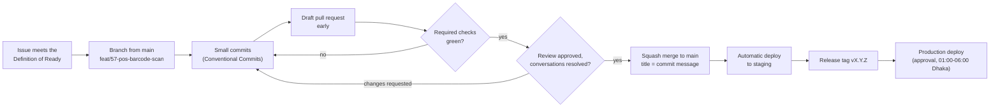
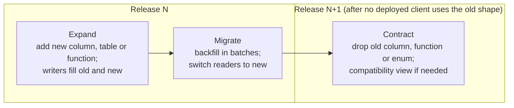
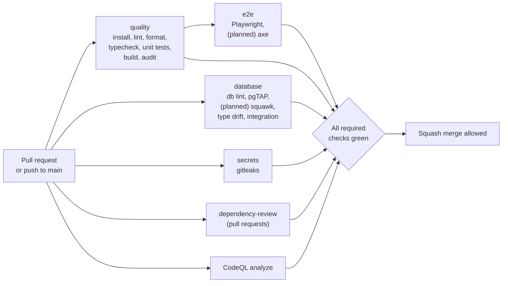

# PIMS Engineering Standards

How code, database changes and documentation for the Pharmacy Inventory Management System (PIMS) are
written, reviewed, tested, versioned and released. These rules apply to every contributor, human or
automated, and to every pull request.

| Field        | Value                                                                                        |
| ------------ | -------------------------------------------------------------------------------------------- |
| Document ID  | PIMS-ENG-001                                                                                 |
| Version      | 1.0                                                                                          |
| Status       | Draft for M0 review                                                                          |
| Owner        | Engineering lead                                                                             |
| Approver     | Engineering lead; the Owner for changes to the release and deployment rules (section 20, 22) |
| Last updated | 2026-10-06                                                                                   |
| Applies to   | Milestones M0 to M5 (see [roadmap](../roadmap.md))                                           |
| Change rule  | Changed only by pull request; a rule that CI enforces changes together with its CI config    |

## Table of contents

1. [Introduction](#1-introduction)
2. [Engineering principles](#2-engineering-principles)
3. [Branching model](#3-branching-model)
4. [Commit messages (Conventional Commits)](#4-commit-messages-conventional-commits)
5. [Pull request process](#5-pull-request-process)
6. [Code review](#6-code-review)
7. [Definition of Ready and Definition of Done](#7-definition-of-ready-and-definition-of-done)
8. [TypeScript standards](#8-typescript-standards)
9. [React and frontend standards](#9-react-and-frontend-standards)
10. [Module boundaries](#10-module-boundaries)
11. [SQL, function and migration standards](#11-sql-function-and-migration-standards)
12. [Money, quantity and time rules](#12-money-quantity-and-time-rules)
13. [Error handling and logging](#13-error-handling-and-logging)
14. [Internationalization (i18n)](#14-internationalization-i18n)
15. [Accessibility](#15-accessibility)
16. [Performance budgets and practices](#16-performance-budgets-and-practices)
17. [Secure coding rules](#17-secure-coding-rules)
18. [Dependency policy](#18-dependency-policy)
19. [Documentation and ADR policy](#19-documentation-and-adr-policy)
20. [Versioning, releases and CHANGELOG](#20-versioning-releases-and-changelog)
21. [CI/CD pipeline and required checks](#21-cicd-pipeline-and-required-checks)
22. [Environments and promotion](#22-environments-and-promotion)
23. [Enforcement summary](#23-enforcement-summary)
24. [Exceptions](#24-exceptions)
25. [Open issues](#25-open-issues)
26. [Revision history](#26-revision-history)

---

## 1. Introduction

### 1.1 Purpose

PIMS handles medicine stock, money, customer dues (বাকি), loyalty memberships and controlled-drug
records for a growing chain of pharmacies in Dhaka, and may later serve other pharmacies as a SaaS
product. Mistakes in this domain are expensive: an oversold batch, a wrong invoice total or a leaked
customer phone number cannot be quietly fixed later. This document turns that risk into concrete,
checkable engineering rules.

### 1.2 Scope

In scope: the web application (`src/`), the database (`supabase/migrations`, `supabase/tests`,
`supabase/seed.sql`), Edge Functions (`supabase/functions`), end-to-end tests (`e2e/`), scripts
(`scripts/`), CI/CD (`.github/`) and documentation (`docs/`).

### 1.3 Canonical sources

This document does not redefine content owned elsewhere; it states engineering obligations and links.

| Topic                                                     | Canonical document                                      |
| --------------------------------------------------------- | ------------------------------------------------------- |
| Requirement IDs (`FR-*`, `NFR-*`), priorities, milestones | [SRS](../requirements/SRS.md), [roadmap](../roadmap.md) |
| Containers, frontend structure, delivery pipeline         | [Architecture](../architecture/architecture.md)         |
| Tables, columns, functions, error codes, lock order       | [Database design](../database/database-design.md)       |
| Roles, permission matrix, threat model, security tests    | [Security model](../security/security-model.md)         |
| Test levels, tools, coverage, test data, flaky tests      | [Testing strategy](testing-strategy.md)                 |
| Local setup, scripts, first contribution                  | [CONTRIBUTING.md](../../CONTRIBUTING.md)                |
| Operational procedures (deploy window, restore, alerts)   | [Runbook](../operations/runbook.md)                     |
| Architecture decisions                                    | [ADR index](../adr/README.md)                           |
| Terms (FEFO, GRN, paisa, AAL2, বাকি)                      | [Glossary](../glossary.md)                              |
| Vulnerability reporting                                   | [SECURITY.md](../../SECURITY.md)                        |

### 1.4 Normative language

**Must** and **must not** are mandatory; CI or review blocks a change that breaks them. **Should** is
the default; deviating requires a sentence of justification in the pull request. **May** is optional.
A rule marked _(enforced)_ is checked by a tool listed in [section 23](#23-enforcement-summary); a rule
marked _(planned)_ will be enforced by a tool that is not yet configured.

---

## 2. Engineering principles

| Principle                      | What it means in PIMS                                                                                                                                                                                                                                                                               |
| ------------------------------ | --------------------------------------------------------------------------------------------------------------------------------------------------------------------------------------------------------------------------------------------------------------------------------------------------- |
| The database is the authority  | Prices, discounts, loyalty benefits, totals, stock allocation (FEFO), document numbers and permissions are decided by PostgreSQL functions and constraints. The client previews; the server decides (NFR-MAINT-003, [ADR-0007](../adr/0007-business-logic-in-transactional-postgres-functions.md)). |
| Correctness before convenience | Integer money, integer base-unit quantities, immutable ledgers, gapless numbering, idempotent writes. A slower correct path beats a fast approximate one.                                                                                                                                           |
| Security by default            | Deny by default: RLS on every table, no grants unless explicit, MFA for Owner and Manager, secrets only on the server, fail closed when a permission cannot be evaluated.                                                                                                                           |
| Explicit over implicit         | Explicit grants, schema-qualified SQL, explicit return types on exported functions, explicit error codes, explicit configuration in settings tables instead of hidden constants.                                                                                                                    |
| Simplicity                     | Boring, well-supported technology; no global state library, ORM or micro-service without an ADR; the smallest design that meets the requirement; delete code that is no longer needed.                                                                                                              |
| Configuration, not code        | Business parameters (VAT rate, discount limits, loyalty plans, rounding) live in settings tables (NFR-MAINT-004); features are switched per organization (NFR-MAINT-010).                                                                                                                           |
| Small, reversible changes      | Short-lived branches, small pull requests, expand-migrate-contract for schema changes, feature flags for unfinished work.                                                                                                                                                                           |
| Automate the rules             | Every rule that a tool can check is checked in CI; review time is spent on design, correctness and risk.                                                                                                                                                                                            |
| Built in, not bolted on        | Accessibility (WCAG 2.1 AA), Bangla and English, observability and tests are part of every feature, not a later phase.                                                                                                                                                                              |
| Privacy by design              | Collect only the personal data in the security model's inventory; never place it in logs, URLs, analytics or AI prompts.                                                                                                                                                                            |

**SOLID, where it applies.** PIMS is mostly functions, hooks and SQL rather than class hierarchies, so
SOLID is applied in spirit:

| Principle             | Application                                                                                                                                                                                             |
| --------------------- | ------------------------------------------------------------------------------------------------------------------------------------------------------------------------------------------------------- |
| Single responsibility | One feature slice per business capability; one RPC per business action (`create_sale` sells, `void_sale` voids); components render, hooks fetch, `src/domain` calculates.                               |
| Open/closed           | New behaviour through configuration and data (a new loyalty plan, a new expense category) or a new module, not by editing a growing `if` chain; enums and unions are extended with exhaustive handling. |
| Liskov substitution   | Discriminated unions instead of inheritance; every variant of a union must be handled by every consumer (exhaustive `switch`).                                                                          |
| Interface segregation | A slice exports a small public API through its `index.ts`; hooks return only what their callers need.                                                                                                   |
| Dependency inversion  | Components depend on hooks in the slice's `api/` folder, never on the Supabase client; `src/domain` depends on nothing, so it can be tested without React, a browser or a database.                     |

---

## 3. Branching model

PIMS uses **trunk-based development**: `main` is the trunk, always releasable, and deployed to staging
automatically after every merge (section 22).

### 3.1 Branches

| Branch                       | Purpose                                                     | Created by       | Lifetime                                 |
| ---------------------------- | ----------------------------------------------------------- | ---------------- | ---------------------------------------- |
| `main`                       | Trunk; source of every build and release tag                | -                | Permanent, protected                     |
| `feat/<issue>-<slug>`        | New capability                                              | Contributor      | Typically 1 to 2 working days; at most 5 |
| `fix/<issue>-<slug>`         | Bug fix                                                     | Contributor      | Same                                     |
| `chore/<issue>-<slug>`       | Tooling, CI, refactoring, dependencies, tests-only changes  | Contributor      | Same                                     |
| `docs/<issue>-<slug>`        | Documentation only                                          | Contributor      | Same                                     |
| `dependabot/...`             | Automated dependency updates                                | Dependabot       | Until merged or closed                   |
| `release/v<MAJOR>.<MINOR>.x` | Hotfix of a released version when `main` cannot ship (20.5) | Engineering lead | Deleted after the hotfix tag             |
| `production`                 | Deployment pointer for Cloudflare Pages production builds   | Release workflow | Permanent; never pushed to by people     |

Naming rules:

- Pattern: `^(feat|fix|chore|docs)/([0-9]+-)?[a-z0-9]+(-[a-z0-9]+)*$`, at most 50 characters. The
  issue number is required when an issue exists (it should for anything except a typo fix).
- Examples: `feat/57-pos-barcode-scan`, `fix/63-fefo-tie-break`, `chore/12-squawk-migration-lint`,
  `docs/8-testing-strategy`.
- The branch prefix is coarse; the commit type (section 4) is precise. A refactor lives on a `chore/`
  branch but its commit is `refactor(...)`.

### 3.2 Working rules

- Branch from the latest `main`; rebase onto `main` at least daily (`git pull --rebase origin main`).
  Force-push only your own branch, and only with `--force-with-lease`.
- One concern per branch. A migration, the RPC that uses it, its tests and the screen that calls it
  may travel together when the change is small; otherwise split them (database first, then UI).
- Work that is not ready for users is merged behind a per-organization feature flag (settings table,
  off by default) or is not yet routed. Long-lived branches are not used to hide unfinished work.
- Branches are deleted automatically on merge; unmerged branches without activity for 14 days are
  closed after a reminder.

### 3.3 Protection of `main`

| Setting                                | Value                                                                         |
| -------------------------------------- | ----------------------------------------------------------------------------- |
| Require a pull request before merging  | On                                                                            |
| Required approvals                     | 1, plus CODEOWNERS approval for `/supabase/`, `/.github/`, `/public/_headers` |
| Dismiss stale approvals on new commits | On                                                                            |
| Require status checks to pass          | On, with "require branches to be up to date"; the list is in section 21.2     |
| Require conversation resolution        | On                                                                            |
| Require linear history                 | On (squash merge only)                                                        |
| Allowed merge methods                  | Squash only; merge commits and rebase merges disabled                         |
| Default squash commit message          | Pull request title and description                                            |
| Force pushes and deletion              | Blocked                                                                       |
| Apply rules to administrators          | On                                                                            |
| Automatically delete head branches     | On                                                                            |

**Single-maintainer caveat.** While one person maintains the repository, GitHub cannot require an
approval from someone else. Until a second reviewer exists, the compensating controls of the
[security model](../security/security-model.md) (section 12) apply: all required checks, the review
checklist of section 6 completed as a self-review in the pull request, and a 24-hour cooling-off period
before merging changes under `/supabase/`.

### 3.4 Flow



---

## 4. Commit messages (Conventional Commits)

Every commit on `main` follows [Conventional Commits 1.0.0](https://www.conventionalcommits.org/en/v1.0.0/).
Because pull requests are squash-merged, **the pull request title becomes the commit on `main`** and
must itself be a valid Conventional Commit header. Commits inside a branch are checked locally by the
`commit-msg` hook _(enforced)_; the pull request title is checked in CI _(planned)_.

### 4.1 Format

```text
<type>(<scope>)!: <subject>

<body: what and why, wrapped at 100 characters>

<footers>
```

| Part    | Rule                                                                                                                                                   |
| ------- | ------------------------------------------------------------------------------------------------------------------------------------------------------ |
| type    | One of the types below, lower case                                                                                                                     |
| scope   | Optional but expected; one of the scopes in `commitlint.config.js` (a new scope is added to that file in the same pull request)                        |
| `!`     | Marks a breaking change; a `BREAKING CHANGE:` footer explains it                                                                                       |
| subject | Imperative mood ("add", not "added"), starts lower case, no trailing period, at most 72 characters for the whole header (commitlint rejects above 100) |
| body    | Optional; explains motivation and contrast with previous behaviour; lines at most 100 characters                                                       |
| footers | `Refs: #123`, `Closes: #123`, `Implements: FR-POS-030, NFR-REL-004`, `BREAKING CHANGE: ...`, `Co-authored-by: ...`                                     |

| Type       | Use for                                                         | Version impact (section 20) | In CHANGELOG            |
| ---------- | --------------------------------------------------------------- | --------------------------- | ----------------------- |
| `feat`     | A user-visible capability                                       | MINOR                       | Added                   |
| `fix`      | A bug fix                                                       | PATCH                       | Fixed                   |
| `perf`     | A performance improvement without behaviour change              | PATCH                       | Changed                 |
| `refactor` | Code change that neither fixes a bug nor adds a feature         | None                        | No                      |
| `test`     | Adding or correcting tests only                                 | None                        | No                      |
| `docs`     | Documentation only                                              | None                        | No                      |
| `build`    | Build system, bundling, package manager                         | None                        | No                      |
| `ci`       | CI configuration and workflows                                  | None                        | No                      |
| `chore`    | Maintenance that does not fit above (dependency bumps, tooling) | None, unless a security fix | Security, if applicable |
| `style`    | Formatting only (rare; Prettier normally handles it)            | None                        | No                      |
| `revert`   | Reverts a previous commit                                       | Per reverted change         | Per reverted change     |

Scopes currently defined in `commitlint.config.js`: `app`, `auth`, `catalog`, `inventory`,
`purchases`, `sales`, `pos`, `customers`, `loyalty`, `transfers`, `reports`, `ai`, `db`, `security`,
`ci`, `deps`, `docs`, `i18n`, `ops`. An unknown scope produces a commitlint warning, not an error; the
reviewer treats the warning as a request to add or correct the scope. The ADR process uses the scope
`adr` (`docs(adr): NNNN ...`), which is still to be added to the list (ENG-09).

### 4.2 Examples

Good:

```text
feat(pos): add items from barcode scans when search has no focus
fix(sales): do not consume an invoice number when a sale fails
perf(inventory): add partial FEFO index on batches with stock on hand
test(db): add cross-branch RLS matrix for sale tables
refactor(customers): move due ledger queries into the api module
chore(deps): bump @tanstack/react-query from 5.104.1 to 5.106.0
ci: run squawk on changed migrations
docs(adr): 0009 record the testing stack decision
revert: feat(loyalty): auto-apply points redemption at checkout
```

A breaking change with body and footers:

```text
feat(db)!: price goods receipt lines per pack instead of per tablet

Lot prices are stored per price basis (normally one pack) so that a pack price that is not divisible
by the pack size, such as 50.00 taka for 14 tablets, stays exact. receive_goods accepts the new
price_basis_quantity field now; the per-unit price fields are accepted for one more release
(expand-migrate-contract) and then removed.

BREAKING CHANGE: from v0.4.0, receive_goods lines must carry price_basis_quantity and per-pack prices.
Implements: FR-PUR-005
Refs: #88
```

Not accepted: `Fixed bug`, `update`, `feat: Added POS.` (past tense, capitalized, trailing period),
`wip`, `fix(sales): fix` (subject says nothing).

---

## 5. Pull request process

### 5.1 Before opening

- The issue meets the Definition of Ready (section 7.1).
- `pnpm check` passes locally (lint, format check, typecheck, unit tests); `pnpm test:db` passes when
  SQL changed; `pnpm gen:types` has been run when a migration changed.
- The change is small: aim for under 400 changed lines excluding generated files, the lockfile and
  test fixtures. Larger changes are split (for example migration and RPC first, screen second).

### 5.2 Opening

- Open a **draft** pull request early so CI and reviewers see the direction.
- Title: a Conventional Commit header (section 4); it becomes the squash commit.
- Description: the repository template (`.github/pull_request_template.md`), fully completed. Sections
  that do not apply are answered "Not applicable", never deleted.
- Link the issue (`Closes #57`) and list requirement IDs (`Implements: FR-POS-002, NFR-USAB-003`) so the
  traceability report (SRS section 4.2) picks them up.
- Labels: one of `enhancement`, `bug`, `database`, `security`, `chore`, `documentation` (the issue
  templates apply `bug` and `enhancement`); add `migration` when
  `supabase/migrations/` changes and `i18n-review` when Bangla text needs native review.

### 5.3 Template contents

The pull request template contains these sections, in this order:

| Section                     | Content expected                                                                                                                         |
| --------------------------- | ---------------------------------------------------------------------------------------------------------------------------------------- |
| Summary                     | What changes and why, in two to five sentences                                                                                           |
| Requirements                | `Implements:` and `Affects:` requirement IDs; issue link                                                                                 |
| Type of change              | Feature, bug fix, database migration, security, refactor or chore, documentation                                                         |
| How it was tested           | Test levels added or changed (unit, pgTAP, integration, E2E), manual checks performed, evidence for anything not automated               |
| Database changes            | Migration file names; new tables, policies, grants and functions; expand-migrate-contract phase; backfill size and duration; lock impact |
| Security and privacy impact | Authorization changes, new personal data, new secrets or endpoints; whether the threat model was updated (NFR-SEC-014)                   |
| Screenshots or recordings   | For UI changes: English and Bangla, desktop and the narrowest supported width; keyboard flow for POS changes                             |
| Rollback plan               | How to undo in production: frontend rollback, function redeploy or a corrective migration (never a down migration)                       |
| Checklist                   | The Definition of Done items of section 7.2                                                                                              |

### 5.4 Review and merge

- Reviewers are requested automatically through CODEOWNERS. First response within 1 business day
  (Sunday to Thursday, Asia/Dhaka); small fixes the same day.
- The author resolves every conversation by changing the code or replying; the reviewer resolves
  their own blocking comments.
- Merge only when every required check is green on an up-to-date branch, approvals are in place and
  the pull request is out of draft. The author merges; the squash title is re-checked before
  confirming.
- After merge, the author watches the staging deployment and its smoke tests (section 22) and fixes
  forward or reverts within the same working day if anything breaks. `main` is never left red: a
  failing `main` is fixed or the offending commit is reverted (`revert:`) within 2 hours of detection.

---

## 6. Code review

### 6.1 Etiquette

- Review the change, not the person. Explain the risk, propose an alternative, link the rule.
- Prefix comments so intent is clear: `blocking:` (must change before merge), `question:`,
  `suggestion:` (author decides), `nit:` (cosmetic; never blocks).
- Approve when the change is correct and safe, even if you would have written it differently.
- Large or risky changes (money, stock, permissions, migrations on hot tables) get a synchronous
  walkthrough before approval.

### 6.2 Checklist

The reviewer (or the author, as a self-review under the single-maintainer caveat) confirms each
applicable item. Items in bold block merge when unmet.

**Correctness**

- [ ] **Behaviour matches the acceptance criteria and the requirement IDs listed.**
- [ ] Edge cases handled: zero and maximum quantities, empty carts, expired and near-expiry batches,
      last unit in stock, inactive branch, deactivated user, Asia/Dhaka day and fiscal-year boundaries.
- [ ] **Money is integer paisa end to end; no floating-point arithmetic; rounding follows rules R-1 to
      R-7 of the database design.**
- [ ] Errors are handled per section 13: no empty `catch`, no swallowed promise, business errors mapped
      to codes.
- [ ] Unions and enums handled exhaustively.

**Security and privacy**

- [ ] **Authorization is enforced in the database (RLS or an explicit permission check at the start of
      the RPC), not only in the UI.**
- [ ] **Every new table has RLS enabled, policies per operation and isolation tests.**
- [ ] **`SECURITY DEFINER` functions set `search_path = ''`, qualify every object, check permission
      first and validate every ID's organization and branch.**
- [ ] No secret, service-role key or AI key reachable from the browser bundle or committed.
- [ ] No personal data (names, phone numbers, addresses, prescription data) in logs, URLs, Sentry
      events or analytics.
- [ ] No `dangerouslySetInnerHTML`, `eval`, `new Function` or inline scripts.
- [ ] The threat model in the security model is updated when authentication, money, stock or personal
      data handling changed.

**Tests**

- [ ] **Tests exist at the levels required by the [testing strategy](testing-strategy.md) and carry
      requirement IDs in their titles.**
- [ ] RPC changes include happy path, each error code, permission denial per role, cross-tenant and
      cross-branch denial, idempotent replay and, where relevant, concurrency.
- [ ] No skipped, focused or retried-to-pass tests.

**Database and migrations**

- [ ] **Migration is forward-only, never edits an applied migration, and is safe on existing data.**
- [ ] Breaking changes follow expand-migrate-contract; the deployed frontend keeps working after the
      database is migrated.
- [ ] Locks taken in the canonical order; `lock_timeout` set; no long table rewrites on hot tables.
- [ ] Indexes on new foreign keys and policy columns; `EXPLAIN` attached for new hot-path queries.
- [ ] Generated types regenerated and committed; the [database design](../database/database-design.md)
      updated in the same pull request.

**Accessibility**

- [ ] Every control is reachable and operable by keyboard with a visible focus indicator.
- [ ] Inputs have labels; errors are associated with their fields and announced.
- [ ] Colour is not the only signal; contrast meets 4.5:1.
- [ ] POS changes keep the full sale possible without a mouse (NFR-USAB-002).

**Internationalization**

- [ ] **No hard-coded user-facing strings; keys added to both `en.json` and `bn.json`.**
- [ ] Money, numbers and dates formatted through the shared formatters (Bangla digits, lakh grouping,
      DD/MM/YYYY, Asia/Dhaka).
- [ ] Layout tolerates longer Bangla text without truncating critical information.

**Performance**

- [ ] One round trip per business action; no request waterfalls or N+1 queries.
- [ ] Query keys and invalidation correct; no unbounded lists (pagination or limits).
- [ ] Bundle impact checked for new dependencies and new routes (budgets in section 16).

**Maintainability and documentation**

- [ ] Code is in the right slice and layer (section 10); no duplicated business logic.
- [ ] Names are clear; comments explain why, not what.
- [ ] Docs, ADRs, CHANGELOG `Unreleased` entry and runbook updated where behaviour or operations changed.

---

## 7. Definition of Ready and Definition of Done

### 7.1 Definition of Ready (an issue may be started)

| Item                | Ready when                                                                                                           |
| ------------------- | -------------------------------------------------------------------------------------------------------------------- |
| Problem             | The business need is stated in the issue in the user's terms                                                         |
| Requirements        | Linked SRS IDs exist (or an SRS change request is open); the milestone is set                                        |
| Acceptance criteria | Written as Given/When/Then, testable, including at least one negative case (wrong role, wrong branch, invalid input) |
| Permissions         | The permission keys involved are in the security model's matrix, or the matrix change is part of the work            |
| Data                | Tables, columns and RPCs affected are identified; migration impact (expand, migrate, contract) is sketched           |
| UX                  | For screens: layout sketch, keyboard flow (POS), empty, loading and error states, Bangla text length considered      |
| Open decisions      | Related Owner decisions (OD-NN in the SRS) are resolved or have a configured default                                 |
| Size                | Deliverable in at most 3 working days by one person; otherwise split                                                 |
| Dependencies        | Blocking issues are done or scheduled first                                                                          |

### 7.2 Definition of Done (a change is complete)

A change is done when **all** applicable items hold:

1. Acceptance criteria are met and demonstrated (test, screenshot or recording in the pull request).
2. Code follows this document; `pnpm check` passes; no new lint suppressions without a justification
   comment.
3. Tests are added at every level required by the [testing strategy](testing-strategy.md); every new
   table has RLS isolation tests and every new or changed RPC has the full pgTAP set; test titles carry
   requirement IDs.
4. Coverage thresholds hold; no test is skipped, focused or marked flaky.
5. Migrations are forward-only, linted, applied from scratch in CI, and generated types are committed.
6. User-facing text exists in English and Bangla; screens pass keyboard and axe checks.
7. Security review items of section 6.2 are satisfied; the threat model is updated where required.
8. Documentation is updated in the same pull request: database design (schema or RPC change), security
   model (permission change), architecture or ADR (structural decision), runbook (operational change),
   SRS (requirement change via its change control).
9. A CHANGELOG entry is added under `Unreleased` for user-visible or operational changes.
10. All required CI checks are green, review is approved, the pull request is squash-merged with a
    Conventional Commit title, and the branch is deleted.
11. The staging deployment succeeded and its smoke tests passed.

A requirement is **verified** only when its milestone exit criteria in the [roadmap](../roadmap.md)
are met; "done" for a pull request does not replace user acceptance testing (SRS section 4.5).

---

## 8. TypeScript standards

### 8.1 Compiler settings

`tsconfig.app.json` enables `strict` and the following additional checks; they must not be relaxed
_(enforced by review of config changes)_:

| Option                                 | Effect                                                                         |
| -------------------------------------- | ------------------------------------------------------------------------------ |
| `noUncheckedIndexedAccess`             | Array and record reads are `T \| undefined`; handle the missing case           |
| `exactOptionalPropertyTypes`           | `prop?: T` does not accept an explicit `undefined`                             |
| `noImplicitOverride`                   | Overrides are marked `override`                                                |
| `noImplicitReturns`                    | Every code path returns                                                        |
| `noFallthroughCasesInSwitch`           | No silent `case` fall-through                                                  |
| `noUnusedLocals`, `noUnusedParameters` | Dead code fails the build (prefix intentionally unused parameters with `_`)    |
| `noPropertyAccessFromIndexSignature`   | Index-signature properties are read with brackets, making dynamic keys visible |
| `useUnknownInCatchVariables`           | `catch (error)` gives `unknown`; narrow before use                             |
| `verbatimModuleSyntax`                 | Type-only imports are written `import type` (or inline `type`)                 |

ESLint runs `typescript-eslint` `strictTypeChecked` and `stylisticTypeChecked` with
`--max-warnings=0` _(enforced)_.

### 8.2 Rules

- **No `any`.** Use `unknown` and narrow, generics, or the generated database types. The rare
  unavoidable `any` (a third-party type hole) is confined to one wrapper with an
  `// eslint-disable-next-line @typescript-eslint/no-explicit-any -- <reason>` comment.
- **No unchecked casts.** `as` is allowed only for `as const`, branded-type constructors (for example
  `paisa()` in `src/domain/money.ts`) and test fixtures. Never cast data that arrived from the network,
  storage or user input; parse it with Zod.
- **No non-null assertions (`!`)** outside tests _(enforced; relaxed only for test files)_.
- **No TypeScript `enum`.** Use string literal unions, `as const` arrays (as `SUPPORTED_LANGUAGES` in
  `src/i18n/index.ts`) or the enum types generated from PostgreSQL.
- **Exported functions declare their return types**; internal helpers may infer.
- **Prefer `readonly`** data and pure functions in `src/domain`; never mutate function arguments.
- **No floating promises** _(enforced)_: `await` them, return them, or mark fire-and-forget calls with
  `void` explicitly (as `void i18n.changeLanguage(...)` in `App.tsx`).
- **Equality** with `===` only _(enforced: `eqeqeq`)_.
- **Imports:** external packages first, then `@/` imports, then relative imports, separated by blank
  lines; `import type` for types _(enforced: `consistent-type-imports`)_; use the `@/` alias across
  folders and relative paths only inside a feature slice.
- **Named exports.** Default exports only where a tool requires them (configuration files) or for a
  singleton such as the i18n instance.

### 8.3 Naming

| Element                             | Convention                                     | Example                                 |
| ----------------------------------- | ---------------------------------------------- | --------------------------------------- |
| Variables, functions                | `camelCase`, verbs for functions               | `formatTaka`, `allocateFefo`            |
| Types, interfaces, React components | `PascalCase`                                   | `CartLine`, `PaymentDialog`             |
| Constants (module-level, immutable) | `SCREAMING_SNAKE_CASE`                         | `MAX_PAISA`, `SUPPORTED_LANGUAGES`      |
| Hooks                               | `useXxx`                                       | `useBranchStock`, `useCreateSale`       |
| Booleans                            | `is`, `has`, `can`, `should` prefixes          | `isExpired`, `canVoid`                  |
| Money values                        | Suffix `Paisa` (mirrors `_paisa` columns)      | `totalPaisa`, `creditLimitPaisa`        |
| Basis points                        | Suffix `Bp`                                    | `discountBp`                            |
| Component files                     | `PascalCase.tsx`                               | `PaymentDialog.tsx`                     |
| Other modules                       | `camelCase.ts`                                 | `money.ts`, `queryKeys.ts`              |
| Tests                               | Co-located `*.test.ts(x)`; E2E `e2e/*.spec.ts` | `money.test.ts`, `e2e/pos-sale.spec.ts` |

Database-shaped objects keep `snake_case` keys exactly as generated (`total_paisa`); they are mapped
to `camelCase` only in a slice's `api/` module when a view model is needed, never ad hoc in components.

### 8.4 Exhaustive handling

`@typescript-eslint/switch-exhaustiveness-check` is an error _(enforced)_. Every `switch` over a union
lists every member, and the `default` branch proves exhaustiveness at compile time:

```ts
import type { Database } from '@/lib/database.types'

type PaymentMethod = Database['public']['Enums']['payment_method']

export function assertNever(value: never): never {
  throw new Error(`Unhandled value: ${String(value)}`)
}

/** Only cash can be over-tendered and returns change; create_sale rejects other overpayments. */
export function givesChange(method: PaymentMethod): boolean {
  switch (method) {
    case 'cash':
      return true
    case 'bkash':
    case 'nagad':
    case 'rocket':
    case 'card':
    case 'bank_transfer':
    case 'loyalty_points':
      return false
    default:
      return assertNever(method)
  }
}
```

When the database adds an enum value and `pnpm gen:types` runs, every such `switch` fails to compile
until the new value is handled.

### 8.5 Result and error handling pattern

Two kinds of failure are treated differently:

| Kind             | Examples                                                                                           | Mechanism                                     |
| ---------------- | -------------------------------------------------------------------------------------------------- | --------------------------------------------- |
| Expected outcome | Invalid user input, business-rule rejection (`insufficient_stock`, `discount_limit`), network loss | Return a `Result` or a Zod `safeParse` result |
| Programmer error | Broken invariant, impossible state, misuse of an internal API                                      | `throw` a typed `Error` subclass              |

```ts
// src/lib/result.ts (planned, M2)
export type Result<T, E = AppError> =
  { readonly ok: true; readonly value: T } | { readonly ok: false; readonly error: E }

export const ok = <T>(value: T): Result<T, never> => ({ ok: true, value })
export const err = <E>(error: E): Result<never, E> => ({ ok: false, error })

// The data access layer converts every failed RPC into an AppError (architecture section 9.4).
export interface AppError {
  readonly code: string // stable code from app.fail() DETAIL, e.g. 'insufficient_stock'
  readonly messageKey: `errors.${string}` // i18n key shown to the user
  readonly hint?: string // optional structured hint, e.g. '{"line_no":2,"available":10}'
  readonly retryable: boolean // true only for network failures and 'busy_retry'
  readonly requestId: string // correlation ID; first 8 characters are shown to the user
}
```

Rules:

- Throw only `Error` subclasses with a `name` (as `MoneyError` in `src/domain/money.ts`); never throw
  strings or plain objects. Wrap lower-level errors with `{ cause }`.
- A function that throws for invalid input (such as `parseTaka`) is called at a boundary that converts
  the exception into a `Result` or a Zod issue (example in 8.6).
- Callers of a `Result` must branch on `ok`; ignoring the error branch is a review defect.
- React components never receive raw exceptions; hooks expose `AppError` and the UI renders the
  translated message plus the short request ID.

### 8.6 Zod at every boundary

Data crossing a trust or type boundary is parsed with Zod 4 before use. Types are derived with
`z.infer`, never written twice.

| Boundary                                       | Schema location                                | Status   |
| ---------------------------------------------- | ---------------------------------------------- | -------- |
| Build-time environment (`import.meta.env`)     | `src/lib/env.ts`                               | In place |
| Form input                                     | `src/features/<slice>/schemas/`                | From M2  |
| RPC payloads before sending                    | Same schemas, shared with the form             | From M2  |
| RPC responses returning `jsonb`                | `src/features/<slice>/api/` next to the hook   | From M2  |
| URL path and search parameters                 | Route modules                                  | From M2  |
| `localStorage`, `sessionStorage`, IndexedDB    | The module that reads them                     | From M2  |
| Edge Function request bodies and query strings | `supabase/functions/_shared/` and the function | From M2  |
| AI model output (M5)                           | `supabase/functions/ai-gateway/`               | M5       |

```ts
import { z } from 'zod'

import { MoneyError, parseTaka } from '@/domain/money'

// User-entered taka amount -> integer paisa, reported as a field error instead of an exception.
export const takaAmount = z.string().transform((input, ctx) => {
  try {
    return parseTaka(input)
  } catch (error) {
    if (error instanceof MoneyError) {
      ctx.addIssue({ code: 'custom', message: 'errors.invalid_amount' })
      return z.NEVER
    }
    throw error
  }
})

// create_sale returns jsonb, which generated types expose as Json: parse it.
export const createSaleResult = z.object({
  sale_id: z.uuid(),
  invoice_no: z.string().min(1),
  total_paisa: z.number().int().nonnegative(),
  change_paisa: z.number().int().nonnegative(),
  due_paisa: z.number().int().nonnegative(),
  replayed: z.boolean(),
})
export type CreateSaleResult = z.infer<typeof createSaleResult>
```

Client-side schemas mirror server rules for fast feedback only; the database re-validates everything
(NFR-SEC-008), and a contract test keeps both in agreement (NFR-REL-011, testing strategy).

---

## 9. React and frontend standards

### 9.1 Structure

- Code is organized in **feature slices** under `src/features/<slice>/` with the internal layout and
  dependency rules of [architecture section 9.1](../architecture/architecture.md#91-feature-sliced-structure-and-dependency-rules):
  `index.ts` (public API), `routes/`, `components/`, `api/`, `model/`, `schemas/` and co-located tests.
- Shared UI primitives (shadcn/ui, Radix based) live in `src/components/ui/`; pure business
  calculations live in `src/domain/`.
- Routes are lazily loaded per slice so a Salesman downloads the POS without the reports bundle.

### 9.2 Components

- Function components only; one exported component per file; props typed with an explicit
  `interface` or `type`.
- Components render; they do not fetch, compute money, or call Supabase. Data comes from hooks in the
  slice's `api/` folder; calculations come from `src/domain`.
- Keys are stable IDs, never array indexes for lists that can reorder or change.
- No `useEffect` for derived state or data fetching; derive during render or use TanStack Query.
  `useEffect` is for synchronizing with external systems (focus management, scanner listeners).
- Each route has an error boundary that shows a translated message and the request ID; the POS keeps
  the cart when a boundary catches an error elsewhere on the page.
- Styling uses Tailwind utility classes and the `cn()` helper (`src/lib/cn.ts`); design tokens live in
  `src/styles/`. Inline `style` only for runtime values (for example a progress width).
- Memoization (`useMemo`, `useCallback`, `memo`) only where profiling shows a benefit.

### 9.3 Hooks

- Rules of Hooks are enforced by `eslint-plugin-react-hooks` _(enforced)_.
- Custom hooks start with `use`, do one thing, and return a narrow object.
- Hooks that read data return the TanStack Query result (or a typed subset); hooks that write return a
  mutation whose error type is `AppError`.

### 9.4 Server state with TanStack Query

The defaults and conventions of [architecture section 9.3](../architecture/architecture.md#93-state-management)
are mandatory. In short:

- All server data goes through TanStack Query; it is never copied into component state or a global
  store. Adding a client-state library requires an ADR.
- Query keys come from a `queryKeys.ts` factory per slice and **start with the tenant scope**, for
  example `['org', orgId, 'branch', branchId, 'stock', filters]`.
- `queryOptions()` objects are defined once in `api/` and reused by hooks, prefetching and tests.
- Mutations are never retried automatically by TanStack Query (`mutations.retry: 0` in `src/main.tsx`);
  the RPC wrapper retries transient failures with the **same** idempotency key (at most 3 attempts,
  exponential backoff, NFR-AVAIL-005).
- After a successful write, invalidate exactly the affected keys (for a sale: branch stock, sales list,
  dashboard summary, customer due, loyalty membership).
- **No optimistic updates for money or stock.** The UI shows the server-confirmed result.

### 9.5 Forms

- React Hook Form with `zodResolver`; the schema in `schemas/` is the single definition of the form
  and its payload.
- Money fields are text inputs parsed with `parseTaka()`; quantities are entered in packs and
  converted to base units with catalog factors; Bangla digits are accepted (NFR-I18N-005).
- Server errors with a field path are mapped back with `setError`.
- The idempotency key is generated when the submission intent starts (for example when the payment
  dialog opens), reused for every retry of that submission and discarded after success.

### 9.6 Business-critical calculations

The client never decides a price, discount, total, stock allocation, invoice number or permission.

| Allowed on the client                                         | Not allowed on the client                                   |
| ------------------------------------------------------------- | ----------------------------------------------------------- |
| Preview totals with `src/domain` helpers while editing a cart | Sending totals, prices or discounts as authoritative values |
| Hiding a button the user lacks permission for                 | Relying on the hidden button for security                   |
| Pre-validating input for fast feedback                        | Skipping server validation because the client validated     |
| Printing the receipt from the confirmed RPC response          | Printing a receipt before the server confirms the sale      |

If the preview and the server disagree, the server result is shown and the discrepancy is reported to
Sentry as a defect (it means the shared rules drifted).

---

## 10. Module boundaries

Dependency rules from architecture section 9.1 are enforced with ESLint `no-restricted-imports`
_(planned, added with the first feature slice in M2)_ and circular imports are forbidden with
`import-x/no-cycle` _(planned, NFR-MAINT-011)_.

| Code in                                              | May import                                                                                       | Must not import                                                            |
| ---------------------------------------------------- | ------------------------------------------------------------------------------------------------ | -------------------------------------------------------------------------- |
| `src/app/`                                           | Anything                                                                                         | -                                                                          |
| `src/features/<x>/`                                  | `@/components/ui`, `@/domain`, `@/i18n`, `@/lib`, `@/features/<y>` (the slice's `index.ts` only) | `@/features/<y>/<anything>` (deep imports), `@/app`                        |
| `src/components/ui/`                                 | `@/lib/cn`, React, Radix                                                                         | `@/features`, `@/domain`, `@supabase/*`                                    |
| `src/domain/`                                        | Other `src/domain` modules                                                                       | React, `@supabase/*`, `@/lib`, `@/features`, browser globals               |
| `src/lib/`                                           | `@/domain` types                                                                                 | `@/features`, `@/app`                                                      |
| Anything except `src/features/*/api/` and `src/app/` | -                                                                                                | `@/lib/supabase` (only `api/` modules and the auth provider call Supabase) |

Sketch of the planned ESLint block:

```js
{
  files: ['src/features/**/*.{ts,tsx}'],
  rules: {
    'no-restricted-imports': ['error', {
      patterns: [
        { group: ['@/features/*/*'], message: 'Import another slice only through its index.ts.' },
        { group: ['@/app', '@/app/*'], message: 'Features must not depend on the app shell.' },
      ],
    }],
  },
},
```

---

## 11. SQL, function and migration standards

The [database design](../database/database-design.md) is authoritative for names, types, the function
catalogue, error codes and the lock order. This section states how SQL is written and reviewed.

### 11.1 Style

- SQL keywords in lower case, two-space indentation and one clause per line for non-trivial
  statements, consistent with the existing migrations (Prettier does not format `*.sql`).
- Identifiers in `snake_case`, never quoted; naming per database design section 3.1 (`_paisa` for money,
  `_bp` for basis points, `_at` for timestamps, `_date` and `_on` for dates, `_no` for human-readable
  numbers, `p_` for parameters, `v_` for variables).
- Every object is **schema-qualified** (`public.sales`, `app.fail`, `auth.uid()`), in functions,
  policies and migrations alike.
- No `select *` in views, report functions or returned result sets; `select * into v_row` for a
  row-typed variable is acceptable.
- Every table and non-obvious column has `comment on`, in English, matching the database design.

### 11.2 Schemas

| Schema   | Holds                                                                                   | Exposed through the API  |
| -------- | --------------------------------------------------------------------------------------- | ------------------------ |
| `public` | Tables, views and RPCs the web app uses; RLS on every table                             | Yes                      |
| `app`    | Helper functions and internal tables (`app.role_permissions`, `app.document_sequences`) | No                       |
| `audit`  | `audit.log`, append-only                                                                | No                       |
| `tests`  | pgTAP helpers; created by tests only, never by migrations                               | No (test databases only) |

### 11.3 Tables

Every new table must, in the same migration:

1. carry `organization_id` (and `branch_id` when branch-scoped) with the composite tenant foreign keys
   of database design section 3.2;
2. `enable row level security` and define policies **per operation** (`for select`, `for insert`, ...)
   `to authenticated`, using the sub-select helper pattern
   `branch_id in (select app.user_branch_ids())` so helpers run once per statement;
3. grant only the privileges the web app needs, column by column where some columns must stay
   hidden (for example cost columns), and nothing to `anon`;
4. index every foreign key and every column used by a policy;
5. declare `NOT NULL`, `CHECK`, unique and exclusion constraints for every invariant that fits one
   row or one table;
6. attach the audit trigger when the table holds sensitive data, and the append-only trigger
   (`app.forbid_mutation()`) when it is a ledger;
7. be registered in the test-only table classification used by the RLS matrix
   ([testing strategy](testing-strategy.md) section 6), so isolation tests cover it automatically.

`USING (true)` is allowed only on platform reference tables that are read-only for clients.
`FORCE ROW LEVEL SECURITY` is not used, because `SECURITY DEFINER` functions owned by the migration
role deliberately bypass RLS after their own explicit checks.

### 11.4 Functions

| Concern       | Rule                                                                                                                                                   |
| ------------- | ------------------------------------------------------------------------------------------------------------------------------------------------------ |
| Security mode | Write RPCs are `security definer`; read-only search and report functions are `security invoker` where RLS suffices                                     |
| Search path   | **Every** function sets `set search_path = ''` _(enforced for `SECURITY DEFINER` by the platform guard test)_                                          |
| Authorization | The first statements call `app.require_branch_permission(p_branch_id, '<key>')` or `app.require_permission(p_organization_id, '<key>')`                |
| Ownership     | Every other ID received is checked to belong to the caller's organization (and branch)                                                                 |
| Validation    | Types, ranges, lengths, enum values and array sizes validated explicitly; payload arrays bounded                                                       |
| Idempotency   | Document-creating RPCs take `p_client_request_id uuid` and replay the stored result                                                                    |
| Locking       | Canonical lock order and two-phase rule (database design section 9.3); `set lock_timeout = '3s'` on write RPCs; no external calls inside a transaction |
| Errors        | `app.fail('<code>', '<English message>', '<optional hint>')` only; codes come from the catalogue                                                       |
| Time          | `now()` and `app.business_date(organization_id)`; never a client-supplied business date                                                                |
| Volatility    | Declared correctly (`immutable`, `stable`, `volatile`); `strict` where null input means null output                                                    |
| Return value  | `jsonb` with IDs, human-readable numbers, computed totals and `replayed`                                                                               |
| Grants        | `grant execute ... to authenticated` per function; `PUBLIC` and `anon` revoked by `call app.harden_privileges()`                                       |

Template (illustrative; the signature for transfers is defined in the database design in M3):

```sql
create or replace function public.request_stock_transfer(
  p_source_branch_id uuid,
  p_destination_branch_id uuid,
  p_lines jsonb,
  p_client_request_id uuid
)
returns jsonb
language plpgsql
security definer
set search_path = ''
set lock_timeout = '3s'
as $$
declare
  v_org uuid := app.require_branch_permission(p_destination_branch_id, 'transfers.request');
begin
  if p_client_request_id is null then
    perform app.fail('missing_request_id', 'client_request_id is required');
  end if;
  if app.branch_org_id(p_source_branch_id) is distinct from v_org then
    perform app.fail('invalid_branch', 'Source branch not found');
  end if;
  if jsonb_typeof(p_lines) <> 'array' or jsonb_array_length(p_lines) not between 1 and 200 then
    perform app.fail('invalid_items', 'Between 1 and 200 lines are required');
  end if;
  -- validation phase: lock rows in canonical order; write phase: documents, ledger, numbering
  return jsonb_build_object('transfer_id', null, 'transfer_no', null, 'replayed', false);
end;
$$;

comment on function public.request_stock_transfer(uuid, uuid, jsonb, uuid) is
  'Creates a stock transfer request from the source to the destination branch (FR-TRF-001).';
grant execute on function public.request_stock_transfer(uuid, uuid, jsonb, uuid) to authenticated;
```

### 11.5 Migrations

| Rule                   | Detail                                                                                                                                                                                  |
| ---------------------- | --------------------------------------------------------------------------------------------------------------------------------------------------------------------------------------- |
| Creation               | `pnpm db:new-migration <snake_case_description>` creates `supabase/migrations/<UTC YYYYMMDDHHMMSS>_<description>.sql`                                                                   |
| Header                 | A comment block naming the migration, its purpose and the requirement IDs, as in `20261006120000_foundation.sql`                                                                        |
| One concern per file   | A feature's tables, constraints, indexes, policies, grants, comments and triggers travel together                                                                                       |
| Hardening              | Every file ends with `call app.harden_privileges();`                                                                                                                                    |
| Forward-only           | No down migrations; a mistake is corrected by a new migration. Restore from backup is reserved for data loss (runbook)                                                                  |
| Immutable once shared  | A migration applied to staging or production is never edited. Before the **M1 freeze point** (first staging deployment) M1 files may still be consolidated (database design section 18) |
| Transactional          | Each file runs in one transaction except where PostgreSQL forbids it: `create index concurrently` and new enum values (`alter type ... add value`) go in their own files                |
| Lock safety            | `set lock_timeout = '5s'` when touching hot tables; new constraints `not valid` then `validate constraint`; no table rewrites of large tables                                           |
| Data migrations        | Idempotent, restartable, batched (at most 10,000 rows per transaction), verified by a count or checksum query recorded in the pull request                                              |
| Backward compatibility | After the migration, the **currently deployed** frontend and Edge Functions keep working (deploy order is database, functions, frontend)                                                |
| Generated types        | `pnpm gen:types` regenerates `src/lib/database.types.ts`; the file is committed; CI fails on drift _(planned)_                                                                          |
| Lint                   | `supabase db lint` (plpgsql_check) with warnings as failures _(enforced)_; squawk for dangerous DDL _(planned)_                                                                         |
| Manual changes         | Forbidden in staging and production; RLS, grants and functions change only through migrations; a weekly `supabase db diff` against staging detects drift                                |

### 11.6 Expand, migrate, contract

Breaking schema changes are split across releases so that every intermediate state works with both the
old and the new application:



Example (rename `medicines.dosage_form` enum to a lookup table, database design section 18): release N
adds `dosage_form_code` and writes both, backfills and switches readers; release N+1 drops the old
column. From M4, offline PWA clients may run the previous version for up to 72 hours (NFR-AVAIL-004),
so the contract step waits at least one full release **and** 7 days.

### 11.7 Seeds

| Data                                                           | Where                                | Rule                                                                                                                                                                   |
| -------------------------------------------------------------- | ------------------------------------ | ---------------------------------------------------------------------------------------------------------------------------------------------------------------------- |
| Platform reference data (`app.role_permissions`, dosage forms) | Migrations                           | Idempotent upserts: `insert ... on conflict (...) do update` or `do nothing`; same result on every environment                                                         |
| Organization bootstrap (settings, default loyalty plans)       | Triggers and `create_organization()` | Runs once per new organization                                                                                                                                         |
| Development data                                               | `supabase/seed.sql`                  | Local and CI only, never staging or production; fixed UUID literals so re-runs are no-ops; business documents created **by calling the RPCs** so every invariant holds |
| Volume data (M4)                                               | `scripts/db/generate-volume.sql`     | Disposable databases only                                                                                                                                              |

### 11.8 Migration review checklist

- [ ] File created with `pnpm db:new-migration`; name describes the change; header comment present.
- [ ] No edit to a migration already applied to staging or production.
- [ ] New tables: RLS, per-operation policies, explicit grants, indexes, constraints, comments, audit
      or append-only trigger, scope classification for the RLS matrix.
- [ ] New functions: `search_path = ''`, schema-qualified, permission check first, ID ownership checks,
      idempotency, lock order, `lock_timeout`, error codes from the catalogue, grants.
- [ ] Ends with `call app.harden_privileges();`.
- [ ] Safe on existing data and on a large table: no rewrite, `not valid` plus `validate`, concurrent
      index in its own file, batched backfill.
- [ ] Expand-migrate-contract phase stated in the pull request; deployed frontend unaffected.
- [ ] pgTAP tests added (testing strategy sections 5 to 7); `pnpm test:db` green.
- [ ] `src/lib/database.types.ts` regenerated; database design and, if permissions changed, security
      model updated.
- [ ] Rollback plan is a corrective forward migration; backup step noted for the production apply.

---

## 12. Money, quantity and time rules

### 12.1 Money

The decision and its rationale are in [ADR-0005](../adr/0005-money-as-integer-paisa.md).

| Rule        | Detail                                                                                                                                                                                                                                                          |
| ----------- | --------------------------------------------------------------------------------------------------------------------------------------------------------------------------------------------------------------------------------------------------------------- |
| Unit        | Integer **paisa** (1 BDT = 100 paisa). PostgreSQL `bigint` columns suffixed `_paisa`; TypeScript `Paisa` branded number from `src/domain/money.ts`                                                                                                              |
| Range       | Magnitude at most `MAX_PAISA` = 10^12 paisa, which is exact in IEEE-754 doubles and safe in JSON transport. Products that can exceed 2^53 (amount x basis points) are computed with `BigInt` (ADR-0005 follow-up F-1)                                           |
| Percentages | Integer **basis points** (`_bp`, 100 bp = 1 %, range 0 to 10,000). `NUMERIC(5,2)` percentages are not used                                                                                                                                                      |
| Rounding    | Half away from zero to the nearest paisa (identical to half up for non-negative amounts), per line; invoice total = sum of lines; optional cash rounding to the nearest taka as an explicit rounding line; full rules R-1 to R-7 in database design section 3.7 |
| Allocation  | Totals spread over lines with `app.allocate_proportionally` so parts always sum exactly to the total                                                                                                                                                            |
| Forbidden   | `parseFloat` _(enforced by lint)_, `Number.parseFloat`, `toFixed`, `Math.round(x * 100)`, floating-point SQL types (`real`, `double precision`) and the SQL `money` type                                                                                        |
| Input       | `parseTaka()` (accepts `1,250.50`, `৳ 1,00,000`, rejects more than two decimals)                                                                                                                                                                                |
| Display     | `formatTaka()` (lakh grouping, Bangla digits in Bangla)                                                                                                                                                                                                         |
| Authority   | Server computes; client previews (section 9.6). Shared test vectors keep `src/domain/money.ts` and the SQL functions identical                                                                                                                                  |

### 12.2 Quantities

Integer **base units** (the smallest sellable unit: tablet, capsule, bottle). Pack quantities (box,
strip) are converted with the catalog's conversion factors before any RPC call; RPCs always receive base
units. Quantities are never fractional.

### 12.3 Time and dates

| Rule             | Detail                                                                                                                                                                                        |
| ---------------- | --------------------------------------------------------------------------------------------------------------------------------------------------------------------------------------------- |
| Storage          | Instants are `timestamptz`, stored in UTC                                                                                                                                                     |
| Business dates   | Sale date, report day and fiscal year are computed **in the database** with `app.business_date(organization_id)` in Asia/Dhaka (UTC+6, no daylight saving); the fiscal year runs July to June |
| Client "now"     | Never used to decide a business date or fiscal year; the server's value is displayed                                                                                                          |
| Display          | `Intl.DateTimeFormat` with `timeZone: 'Asia/Dhaka'` always (never the browser zone), DD/MM/YYYY and 12-hour time                                                                              |
| Date-only values | `date` columns (`expiry_date`, `business_date`) travel as `YYYY-MM-DD` strings and are compared as strings or with a date-only helper; never converted to a `Date` at UTC midnight            |
| Tests            | Boundaries at 23:59:59 and 00:00:00 Asia/Dhaka and across 30 June to 1 July (NFR-REL-010); fake timers in Vitest, `page.clock` in Playwright                                                  |
| Server clock     | Functions use `now()`; client timestamps are accepted only as offline metadata within limits (M4)                                                                                             |

---

## 13. Error handling and logging

### 13.1 Error taxonomy

| Class         | Source                                                 | Client behaviour                                                                    | Reported to Sentry  |
| ------------- | ------------------------------------------------------ | ----------------------------------------------------------------------------------- | ------------------- |
| Validation    | Zod on the client; `invalid_*` codes from RPCs         | Field-level message in the user's language                                          | No                  |
| Business      | `app.fail()` codes (`insufficient_stock`, ...)         | Translated message from `errors.<code>`; structured hint used to highlight the line | No                  |
| Authorization | `forbidden`, `not_authenticated`, `mfa_required`       | Translated message; redirect to sign-in or MFA where appropriate                    | Count only          |
| Transient     | Network failure, `busy_retry` (lock timeout, deadlock) | Retry up to 3 times with backoff and the same idempotency key; then "failed, retry" | After final failure |
| Unexpected    | Anything else                                          | Generic message with the first 8 characters of the request ID                       | Yes                 |

Rules:

- Raw database messages, SQL, constraint names and stack traces are never shown to users.
- Every business error code has an English and a Bangla message and a test (NFR-MAINT-009).
- No empty `catch`; a caught error is handled, converted, or re-thrown with `cause`.
- Fail closed: if a permission, limit or price cannot be evaluated, the action is refused.

### 13.2 Logging and telemetry

- The browser uses no `console.log` _(enforced: only `console.warn` and `console.error` are allowed)_;
  production diagnostics go to Sentry (`sendDefaultPii: false`, `beforeSend` scrubber, no session
  replay).
- Edge Functions write one JSON log line per request with `timestamp`, `level`, `request_id`,
  `organization_id`, `function`, `duration_ms` and `outcome` (NFR-OBS-002).
- Every write carries a request ID (UUID) from the client; it appears in Sentry events, function logs
  and audit entries (NFR-OBS-003).
- **Never logged:** customer names, phone numbers, addresses, prescription and patient data, passwords,
  tokens, API keys, full request payloads. Lookups by phone or card number use POST bodies, not URLs.
- Business history belongs in the database audit log (`audit.log`), not in application logs.

---

## 14. Internationalization (i18n)

| Rule                  | Detail                                                                                                                                                           |
| --------------------- | ---------------------------------------------------------------------------------------------------------------------------------------------------------------- |
| Externalized text     | Every user-facing string goes through i18next `t()`; no literals in JSX _(planned lint: no literal strings, NFR-I18N-001)_                                       |
| Both languages        | Every new key is added to `src/i18n/locales/en.json` **and** `bn.json` in the same pull request; key-set parity is checked in CI _(planned, M2)_                 |
| Bangla review         | Machine or non-native Bangla is allowed in a pull request only with the `i18n-review` label; a native speaker signs off before the milestone exit (NFR-I18N-002) |
| Key naming            | Dot-separated, prefixed by slice: `pos.cart.total`, `inventory.adjust.reason`, `errors.insufficient_stock`, `enum.payment_method.bkash`                          |
| No concatenation      | Sentences are whole keys with interpolation (`{{count}}`, `{{name}}`); plurals use i18next suffixes (`_one`, `_other`)                                           |
| Numbers and money     | `formatTaka()` and shared number formatters; Bangla digits in Bangla by default, Latin digits per organization setting (NFR-I18N-004)                            |
| Dates                 | DD/MM/YYYY, 12-hour time, Asia/Dhaka (section 12.3)                                                                                                              |
| Input                 | Numeric inputs accept Bangla and Latin digits (`১২` = 12)                                                                                                        |
| Enum and error labels | Translated through `enum.<type>.<value>` and `errors.<code>`; never display raw enum values or error codes                                                       |
| Catalog data          | Medicine and generic names are shown as recorded (normally English as printed on packs); they are not translated                                                 |
| Text                  | Unicode only, normalized to NFC; Bangla font self-hosted (Noto Sans Bengali); `<html lang>` updated when the language changes                                    |
| Layout                | Tolerates 30 % text expansion and Bangla line heights (NFR-I18N-009)                                                                                             |

---

## 15. Accessibility

Target: **WCAG 2.1 level AA** on every screen (NFR-USAB-001), with a keyboard-first POS (NFR-USAB-002).

- Semantic HTML first (`button`, `a`, `label`, `table`, headings in order); ARIA only to fill gaps.
- shadcn/ui and Radix primitives for dialogs, menus, comboboxes, tabs and toasts; no hand-built
  focus traps.
- Every interactive element is reachable and operable by keyboard, with a visible focus indicator;
  no `div` or `span` with click handlers _(enforced by `eslint-plugin-jsx-a11y` strict)_.
- Every input has a programmatic label; error text is linked with `aria-describedby` and announced.
- POS: the cart total changes are announced in an `aria-live="polite"` region; stock and validation
  errors use `aria-live="assertive"`; shortcuts follow SRS Appendix C and never use browser-reserved
  keys.
- Colour is never the only signal (expiry and stock states combine colour, icon and text); text
  contrast at least 4.5:1 (3:1 for large text).
- Layouts work at 320 CSS px and 200 % zoom; touch targets at least 44 by 44 px on mobile layouts.
- Motion respects `prefers-reduced-motion`.
- Tests query by role and accessible name (Testing Library, Playwright), which doubles as an
  accessibility check; axe runs in E2E tests (testing strategy section 13).

---

## 16. Performance budgets and practices

The binding targets are the NFR-PERF requirements of the [SRS](../requirements/SRS.md); measurement and
enforcement are in [architecture section 18](../architecture/architecture.md#18-performance-budgets) and
the [testing strategy](testing-strategy.md) section 11.

| Budget                                                   | Target                          | Requirement  |
| -------------------------------------------------------- | ------------------------------- | ------------ |
| POS medicine search, server time                         | p95 below 200 ms                | NFR-PERF-001 |
| POS search, keystroke to rendered results                | p95 below 400 ms on 4G in Dhaka | NFR-PERF-001 |
| `create_sale`, server time (up to 10 lines)              | p95 below 500 ms, p99 below 1 s | NFR-PERF-002 |
| Sale, click to confirmation                              | p95 below 800 ms                | NFR-PERF-002 |
| Largest Contentful Paint, sign-in and POS, 4G cold cache | below 2.5 s                     | NFR-PERF-003 |
| Standard report, one branch, one year                    | p95 below 2 s                   | NFR-PERF-004 |
| Interaction to Next Paint / Cumulative Layout Shift      | below 200 ms / below 0.1 at p75 | NFR-PERF-005 |
| Barcode scan to cart line                                | p95 below 300 ms                | NFR-PERF-006 |
| JavaScript, first screen (shell plus POS)                | at most 250 KB gzip             | NFR-PERF-007 |
| Each lazily loaded feature chunk                         | at most 150 KB gzip             | NFR-PERF-007 |
| Goods receipt with 50 lines                              | p95 below 1 s                   | NFR-PERF-011 |

Practices:

- One RPC per business action; no client-side multi-call write sequences (Dhaka to Singapore round
  trips cost 50 to 90 ms each).
- Select only needed columns; keyset pagination for ledgers and invoices; PostgREST `max_rows` (1,000)
  is a safety net, not a page size.
- Every foreign key and policy column indexed; new hot-path queries come with an
  `EXPLAIN (ANALYZE, BUFFERS)` plan in the pull request, taken on realistic data.
- Route-level code splitting; heavy libraries (Recharts, export libraries) only in the routes that use
  them; self-hosted subset fonts.
- A new production dependency states its gzip size in the pull request (section 18).
- A measured regression beyond a budget blocks the release (architecture section 18).

---

## 17. Secure coding rules

The [security model](../security/security-model.md) is canonical. Rules every change must respect:

- Authorization lives in the database (RLS and RPC checks); UI guards exist only for usability.
- Only public values are bundled: `VITE_SUPABASE_URL`, `VITE_SUPABASE_ANON_KEY`, `VITE_SENTRY_DSN`.
  The service-role key and every API key stay in Edge Functions or CI secrets. `.env.local` is never
  committed (`.gitignore` covers `.env.*`).
- No `dangerouslySetInnerHTML` _(enforced)_, `eval`, `new Function`, inline scripts or inline event
  handlers; the Content Security Policy in `public/_headers` must keep working without `unsafe-inline`
  scripts.
- Prescription images and exports live in private buckets and are reached by signed URLs valid at most
  300 s.
- Supabase errors are converted to `AppError`; nothing from the database is rendered as HTML.
- Workflows use `pull_request` (never `pull_request_target` with untrusted code), pin third-party
  actions to a full commit SHA with the version in a comment, and declare least-privilege
  `permissions`.
- Any change to authentication, authorization, money, stock or personal data updates the threat model
  in the same pull request (NFR-SEC-014).

---

## 18. Dependency policy

### 18.1 Adding a dependency

A new dependency (production or development) is justified in the pull request against these criteria:

| Criterion    | Requirement                                                                                                                           |
| ------------ | ------------------------------------------------------------------------------------------------------------------------------------- |
| Need         | The platform, an existing dependency or 50 lines of our own code cannot reasonably do the job                                         |
| Maintenance  | A release within the last 12 months, more than one maintainer or a reputable organization, issues triaged                             |
| Security     | No open high or critical advisory; no install script, or an install script allow-listed deliberately (pnpm 10 blocks them by default) |
| Licence      | On the allow-list below                                                                                                               |
| Size         | Production dependencies: gzip size and tree-shakability stated; fits the budgets of section 16                                        |
| Types        | Ships TypeScript types or has maintained `@types/*`                                                                                   |
| Architecture | Framework-level dependencies (state management, routing, UI kit, ORM, date library, charting) require an ADR                          |

**Licence allow-list:** MIT, ISC, BSD-2-Clause, BSD-3-Clause, Apache-2.0, 0BSD, CC0-1.0, Unicode-3.0,
BlueOak-1.0.0, MPL-2.0 (unmodified files), OFL-1.1 (fonts). **Not allowed** in shipped code: GPL,
AGPL, SSPL, BUSL, Commons Clause, and packages without a licence. LGPL is reviewed case by case.
The dependency review action is configured with the same allow-list _(planned)_.

### 18.2 Keeping dependencies healthy

- `pnpm-lock.yaml` is committed; CI installs with `--frozen-lockfile`; Node and pnpm versions are pinned
  by `.nvmrc`, `engines` and `packageManager` (`pnpm@10.28.0`), with `engine-strict=true`.
- Version ranges in `package.json` use caret ranges (`save-exact=false`); the lockfile provides
  reproducibility. Tools whose behaviour must not drift (Playwright, Supabase CLI in CI) are pinned.
- Dependabot opens grouped updates weekly on Monday (Asia/Dhaka) for npm and GitHub Actions;
  they are reviewed and merged within one week when CI is green.
- Security fixes follow the fix times of NFR-SEC-007: critical 48 hours, high 7 days, medium 30 days.
- A new-release quarantine (`minimumReleaseAge` of 3 days in pnpm) is configured _(planned,
  SEC-GAP-19)_.
- No direct production dependency may go more than 2 years without a release (NFR-MAINT-008); it is
  replaced or vendored deliberately with an ADR.
- Unused dependencies are removed in the pull request that stops using them.
- Edge Functions use `npm:` or `jsr:` specifiers with exact versions and a committed `deno.lock`.

---

## 19. Documentation and ADR policy

### 19.1 Documentation as code

- Documentation lives in `docs/` as GitHub-flavoured Markdown with Mermaid diagrams and is reviewed
  like code. Prettier formats it (`pnpm format:check` covers Markdown).
- Each topic has one canonical document (section 1.3); other documents link instead of repeating.
- A behaviour, schema, permission or operational change updates its canonical document **in the same
  pull request**.
- Every document carries an ID, version, status, owner and revision history, as this one does.
- Code comments explain why (constraints, trade-offs, links to requirement IDs), not what. Exported
  domain functions have a short JSDoc comment; SQL objects have `comment on`.
- The [glossary](../glossary.md) defines domain terms; new terms are added there, not redefined locally.

### 19.2 Architecture Decision Records

The [ADR index](../adr/README.md) is canonical for when an ADR is required, the MADR 4.0 template,
the status lifecycle (`proposed`, `accepted`, `rejected`, `deprecated`, `superseded by ADR-NNNN`),
file naming (`docs/adr/NNNN-kebab-case-title.md`) and the review process. The engineering obligations
are:

- A pull request that makes a decision meeting the index's triggers (for example a new framework-level
  dependency, a change to a cross-cutting convention, or a deviation from a "must" in this document for
  more than one pull request) includes the ADR, or follows an already merged one.
- ADR pull requests use the title form `docs(adr): NNNN <decision>` defined by the ADR process.
- Code that embodies a decision cites it where a reader would otherwise "fix" it, as
  `src/domain/money.ts` cites [ADR-0005](../adr/0005-money-as-integer-paisa.md).
- Accepted ADRs are not rewritten; a changed decision is a new ADR that supersedes the old one.

Decisions already recorded that this document depends on: money as integer paisa
([ADR-0005](../adr/0005-money-as-integer-paisa.md)), organization and branch tenancy with RLS
([ADR-0006](../adr/0006-multi-tenant-organization-branch-model-with-rls.md)), business-critical writes
in transactional PostgreSQL functions
([ADR-0007](../adr/0007-business-logic-in-transactional-postgres-functions.md)) and the append-only
inventory ledger with FEFO ([ADR-0008](../adr/0008-append-only-inventory-ledger-with-fefo.md)). The
testing stack and the branching, commit and CI conventions of this document are in the ADR backlog for
the M0 exit.

---

## 20. Versioning, releases and CHANGELOG

### 20.1 Semantic Versioning

PIMS follows [Semantic Versioning 2.0.0](https://semver.org/spec/v2.0.0.html). The version in
`package.json` (currently `0.1.0`) is the application version; release tags are `vMAJOR.MINOR.PATCH`
on `main`.

| Phase                    | Rule                                                                                                                                                                                                               |
| ------------------------ | ------------------------------------------------------------------------------------------------------------------------------------------------------------------------------------------------------------------ |
| Before production launch | `0.y.z`; MINOR for each release with new features or schema changes, PATCH for fixes only                                                                                                                          |
| Production launch        | `1.0.0` marks the production launch (M4 exit in the [roadmap](../roadmap.md))                                                                                                                                      |
| After launch: MAJOR      | A change requiring coordinated action by users or operators: a removed feature, an RPC contract break visible to deployed or offline clients, an incompatible export or backup format, a dropped supported browser |
| After launch: MINOR      | New backward-compatible features, migrations following expand-migrate-contract                                                                                                                                     |
| After launch: PATCH      | Backward-compatible fixes and performance improvements                                                                                                                                                             |

Migrations are versioned by their timestamps; release notes list the migrations a release applies.

### 20.2 CHANGELOG

`CHANGELOG.md` at the repository root follows [Keep a Changelog 1.1.0](https://keepachangelog.com/en/1.1.0/):

- An `## [Unreleased]` section at the top collects entries as pull requests merge; each user-visible or
  operational change adds its entry in the same pull request.
- Groups: `Added`, `Changed`, `Deprecated`, `Removed`, `Fixed`, `Security`.
- Entries are written for the pharmacy's staff and the Owner: plain English, prefixed with the area,
  with requirement IDs; internal refactors and test-only changes are omitted.
- Database migrations that change behaviour are listed under `Changed` with the migration name.

Illustrative example (versions and dates are placeholders):

```markdown
# Changelog

All notable changes to PIMS are documented in this file.
The format is based on [Keep a Changelog](https://keepachangelog.com/en/1.1.0/), and this project
adheres to [Semantic Versioning](https://semver.org/spec/v2.0.0.html).

## [Unreleased]

### Added

- POS: barcode scans add the item even when the search field does not have focus (FR-POS-002).

### Fixed

- Sales: a sale rejected for insufficient stock no longer consumes an invoice number (FR-POS-030).

## [0.2.0] - 2026-11-19

### Added

- Database: sales, returns and voids with FEFO allocation and gapless invoice numbers (FR-POS-030).

[Unreleased]: https://github.com/msasomrat/Pharmacy_Inventory/compare/v0.2.0...HEAD
[0.2.0]: https://github.com/msasomrat/Pharmacy_Inventory/compare/v0.1.0...v0.2.0
```

### 20.3 Release process

1. **Prepare.** `main` is green and deployed to staging; staging smoke tests passed; for a milestone
   release, user acceptance testing on staging is signed off (SRS section 4.5); from M4, the
   performance checklist (testing strategy section 11) passed.
2. **Release pull request.** `chore(release): v0.3.0` moves `Unreleased` entries under the new version
   with the date (Asia/Dhaka), updates the comparison links and bumps `package.json`. It is
   squash-merged like any other change.
3. **Tag.** An annotated tag `v0.3.0` on that commit (`git tag -a v0.3.0 -m "v0.3.0"`), signed when the
   maintainer has a signing key.
4. **GitHub Release.** Notes copied from the CHANGELOG, plus the traceability report and, from M4, the
   SBOM.
5. **Notify.** The Owner is told at least 24 hours before the production window (NFR-AVAIL-002).
6. **Deploy.** The deploy workflow runs for the tag through the `production` environment with a
   required reviewer: encrypted backup, `supabase db push`, Edge Functions, then the frontend, between
   01:00 and 06:00 Asia/Dhaka (architecture section 14.4, runbook).
7. **Verify.** Post-deploy smoke tests and integrity checks pass; the Sentry release is finalized.
8. **Record.** The release, any incidents and the result are noted in the runbook log.

### 20.4 Rollback

The frontend is rolled back in Cloudflare Pages; Edge Functions are redeployed from the previous tag;
the database is never rolled back by a down migration: a corrective migration is released as a PATCH.
Because contract steps lag at least one release, rolling back the frontend never requires a database
rollback (architecture section 14.4).

### 20.5 Hotfixes

1. Fix on a `fix/` branch from `main`, merge normally, release a PATCH from `main`.
2. Only when `main` contains changes that must not ship yet: create `release/v1.4.x` from the last
   tag, cherry-pick the merged fix (`git cherry-pick -x`), tag `v1.4.3` on that branch, deploy, then
   delete the branch. The fix always lands on `main` first.
3. Urgent fixes may be deployed outside the 01:00 to 06:00 window with the Owner's agreement; the
   reason is recorded in the runbook log.

---

## 21. CI/CD pipeline and required checks

### 21.1 Stages

Workflows: `.github/workflows/ci.yml` (jobs `quality`, `database`, `e2e`, `secrets`,
`dependency-review`) and `.github/workflows/codeql.yml` (job `analyze`). Jobs run in parallel except
`e2e`, which needs `quality`.

| #   | Stage                    | Command or tool                                                              | Job (`ci.yml` unless stated) | Runs on                     | Blocking          | Status                                             |
| --- | ------------------------ | ---------------------------------------------------------------------------- | ---------------------------- | --------------------------- | ----------------- | -------------------------------------------------- |
| 1   | Install                  | `pnpm install --frozen-lockfile`                                             | `quality`, `e2e`             | PR, push to `main`          | Yes               | In place                                           |
| 2   | Lint                     | `pnpm lint` (ESLint, `--max-warnings=0`)                                     | `quality`                    | PR, `main`                  | Yes               | In place                                           |
| 3   | Format check             | `pnpm format:check` (Prettier)                                               | `quality`                    | PR, `main`                  | Yes               | In place                                           |
| 4   | Typecheck                | `pnpm typecheck` (`tsc -b --noEmit`)                                         | `quality`                    | PR, `main`                  | Yes               | In place                                           |
| 5   | Unit and component tests | `pnpm test:coverage` (Vitest with coverage thresholds)                       | `quality`                    | PR, `main`                  | Yes               | In place                                           |
| 6   | Build                    | `pnpm build`                                                                 | `quality`                    | PR, `main`                  | Yes               | In place                                           |
| 7   | Dependency audit         | `pnpm audit --prod --audit-level high`                                       | `quality`                    | PR, `main`                  | Yes               | In place                                           |
| 8   | SQL lint                 | `supabase db lint --level warning --fail-on warning` (plpgsql_check)         | `database`                   | PR, `main`                  | Yes               | In place                                           |
| 9   | Database tests           | `supabase test db` (pgTAP, including platform guards and RLS)                | `database`                   | PR, `main`                  | Yes               | In place                                           |
| 10  | Migration lint           | squawk on changed migration files                                            | `database`                   | PR                          | Yes               | Planned (M1)                                       |
| 11  | Type drift               | `pnpm gen:types` then `git diff --exit-code src/lib/database.types.ts`       | `database`                   | PR, `main`                  | Yes               | Planned (M1)                                       |
| 12  | Integration tests        | Vitest with supabase-js against the local stack (testing strategy section 4) | `database`                   | PR, `main`                  | Yes               | Planned (M1)                                       |
| 13  | End-to-end tests         | `pnpm test:e2e` (Playwright, Chromium desktop and Pixel 7 projects)          | `e2e`                        | PR, `main`                  | Yes               | In place (smoke); local Supabase stack added in M2 |
| 14  | Accessibility            | axe checks inside E2E tests                                                  | `e2e`                        | PR, `main`                  | Yes               | Planned (M2)                                       |
| 15  | Secret scanning          | gitleaks (full history)                                                      | `secrets`                    | PR, `main`                  | Yes               | In place                                           |
| 16  | Dependency review        | `actions/dependency-review-action` (fail on high)                            | `dependency-review`          | PR                          | Yes               | In place                                           |
| 17  | Static analysis          | CodeQL `security-extended`                                                   | `analyze` (`codeql.yml`)     | PR, `main`, weekly Monday   | Yes               | In place (licence: architecture OI-04)             |
| 18  | Pull request title       | commitlint on the title                                                      | `pr-title`                   | PR                          | Yes               | Planned (M0)                                       |
| 19  | i18n key parity          | Script comparing `en.json` and `bn.json` key sets                            | `quality`                    | PR, `main`                  | Yes               | Planned (M2)                                       |
| 20  | Bundle budget            | Script over the Vite build report (section 16)                               | `quality`                    | PR, `main`                  | Yes               | Planned (M2, NFR-PERF-007)                         |
| 21  | Bundle secret scan       | Script over `dist/` for key patterns (SEC-TC-18)                             | `quality`                    | PR, `main`                  | Yes               | Planned (M2)                                       |
| 22  | Traceability report      | Script extracting SRS IDs and test tags (testing strategy section 16)        | `traceability`               | PR, `main`, release tags    | Yes (rules in 16) | Planned (M1)                                       |
| 23  | Security headers         | Script requesting the preview deployment (SEC-TC-17)                         | `headers`                    | PR with a preview           | Yes               | Planned (M2)                                       |
| 24  | DAST baseline            | OWASP ZAP baseline against staging                                           | `dast.yml`                   | Weekly, before each release | High alerts       | Planned (M2)                                       |
| 25  | Lighthouse CI            | LCP and bundle checks on sign-in and POS routes                              | `lighthouse`                 | PR, `main`                  | Yes               | Planned (M4)                                       |



### 21.2 Required status checks on `main`

| Check name (as shown on GitHub)             | Job                 |
| ------------------------------------------- | ------------------- |
| `Lint, typecheck, unit tests, build`        | `quality`           |
| `Database lint and pgTAP tests (incl. RLS)` | `database`          |
| `End-to-end tests (Playwright)`             | `e2e`               |
| `Secret scanning (gitleaks)`                | `secrets`           |
| `Dependency review`                         | `dependency-review` |
| `Analyze (javascript-typescript)`           | `analyze`           |

Planned jobs become required checks in the pull request that introduces them. A job name change is a
branch-protection change and is done in the same pull request by an administrator.

### 21.3 Pipeline rules

- CI must stay under 15 minutes wall-clock for a typical pull request; slow suites are optimized, not
  skipped.
- Every third-party action is pinned to a full commit SHA with the version in a comment; Dependabot
  updates them weekly.
- Top-level `permissions: contents: read`; jobs elevate only what they need.
- CI never uses production secrets; fork pull requests receive no secrets.
- A red `main` is the team's top priority (section 5.4).
- Delivery workflows (`deploy.yml` for staging and production, `backup.yml` for nightly backups) are
  specified in [architecture section 14.4](../architecture/architecture.md#144-delivery-pipeline) and the
  [runbook](../operations/runbook.md).

---

## 22. Environments and promotion

Environment definitions are canonical in
[architecture section 14.1](../architecture/architecture.md#141-environments); this summary states the
engineering rules for moving a change through them.

| Environment    | Backend                        | Frontend                              | Data                             | Promotion into it                                    |
| -------------- | ------------------------------ | ------------------------------------- | -------------------------------- | ---------------------------------------------------- |
| Local          | Supabase CLI in Docker         | Vite dev server, port 5173            | `supabase/seed.sql` (synthetic)  | Developer                                            |
| CI (ephemeral) | `supabase start` on the runner | Built bundle served by `vite preview` | Seed and test fixtures           | Every push and pull request                          |
| PR preview     | `pims-staging`                 | Cloudflare Pages preview URL          | Staging data                     | Automatic per commit (UI review only)                |
| Staging        | `pims-staging`                 | Cloudflare Pages alias of `main`      | Synthetic; never production data | Automatic on merge to `main`                         |
| Production     | `pims-prod` (Singapore)        | Cloudflare Pages `production` branch  | Real data                        | Release tag plus approval, 01:00 to 06:00 Asia/Dhaka |

Promotion rules:

- **Build once from `main`.** Only commits on `main` reach staging, and only tagged commits on `main`
  (or a hotfix `release/` branch, section 20.5) reach production.
- **Order:** database migrations, then Edge Functions, then the frontend.
- **Same artifacts, different configuration.** Environment differences are variables in Cloudflare
  Pages, GitHub Environments and Supabase secrets, never code branches (`if (env === 'prod')` is not
  used for behaviour).
- **No production data outside production.** Staging, previews, CI and laptops use synthetic data only;
  restore drills restore into staging and are wiped afterwards (runbook).
- **No manual changes** to staging or production schemas, policies or functions.
- **Feature flags** are per-organization settings; a feature that has not passed user acceptance
  reaches production switched off and is switched on for an organization only after acceptance.

---

## 23. Enforcement summary

| Rule                                                                | Tool                                                   | Where                          | Status                                    |
| ------------------------------------------------------------------- | ------------------------------------------------------ | ------------------------------ | ----------------------------------------- |
| Commit message format                                               | commitlint (`@commitlint/config-conventional`)         | `commit-msg` hook (Husky)      | In place                                  |
| Pull request title format                                           | commitlint in CI                                       | `pr-title` job                 | Planned                                   |
| Formatting                                                          | Prettier (`.prettierrc.json`)                          | `pre-commit` (lint-staged), CI | In place                                  |
| Lint (strict type-checked, a11y, hooks)                             | ESLint 9 flat config                                   | `pre-commit`, CI               | In place                                  |
| No `parseFloat`, no `dangerouslySetInnerHTML`                       | ESLint `no-restricted-syntax`                          | CI                             | In place                                  |
| Exhaustive `switch`                                                 | `@typescript-eslint/switch-exhaustiveness-check`       | CI                             | In place                                  |
| Type safety                                                         | `tsc -b --noEmit` with strict options                  | CI                             | In place                                  |
| Module boundaries, no cycles                                        | `no-restricted-imports`, `import-x/no-cycle`           | CI                             | Planned (M2)                              |
| No literal UI strings                                               | i18next ESLint rule                                    | CI                             | Planned (M2)                              |
| No focused or skipped tests                                         | Vitest ESLint plugin, Playwright `forbidOnly`          | CI                             | Partial (Playwright in place)             |
| Coverage thresholds                                                 | Vitest coverage (`vite.config.ts`)                     | CI                             | In place (`src/domain/**`)                |
| RLS on every `public` table, pinned `search_path`, no `anon` writes | pgTAP platform guards (`001_platform_guards.test.sql`) | CI                             | In place (extensions planned, SEC-GAP-17) |
| SQL correctness                                                     | `supabase db lint` (plpgsql_check)                     | CI                             | In place                                  |
| Dangerous DDL                                                       | squawk                                                 | CI                             | Planned (M1)                              |
| Generated types up to date                                          | Diff check                                             | CI                             | Planned (M1)                              |
| Secrets                                                             | gitleaks; GitHub push protection                       | CI; repository setting         | In place; push protection to enable       |
| Vulnerable dependencies                                             | `pnpm audit`, dependency review, Dependabot            | CI; weekly                     | In place                                  |
| Code security                                                       | CodeQL                                                 | CI; weekly                     | In place                                  |
| Node and pnpm versions                                              | `engines`, `engine-strict`, `packageManager`, `.nvmrc` | Install                        | In place                                  |
| Branch protection                                                   | GitHub repository settings                             | GitHub                         | To configure                              |

---

## 24. Exceptions

A rule in this document may be broken only when following it would cause more harm than the rule
prevents. The pull request then contains:

1. the rule, the reason and the scope (file, line or function);
2. a suppression comment at the exact location with the reason, for example
   `// eslint-disable-next-line <rule> -- <reason, link to issue>`;
3. a follow-up issue if the exception is temporary.

Exceptions that last beyond one pull request, or affect money, stock, authorization or personal data,
require an ADR. File-wide or project-wide suppressions are not allowed.

---

## 25. Open issues

| ID     | Issue                                                                                                                                                               | Owner              | Needed by |
| ------ | ------------------------------------------------------------------------------------------------------------------------------------------------------------------- | ------------------ | --------- |
| ENG-01 | `.github/pull_request_template.md` lacks the Requirements, How it was tested, Database changes and Security and privacy impact sections of 5.3; update the template | Engineering lead   | M0        |
| ENG-02 | `CHANGELOG.md` does not exist yet; create it with the structure of 20.2 before the first release tag                                                                | Engineering lead   | M0        |
| ENG-03 | Branch protection for `main` (3.3) and the required checks (21.2) are not yet configured in the repository settings                                                 | Engineering lead   | M0        |
| ENG-04 | Planned CI stages 10 to 12 and 18 to 25 (21.1) are not implemented                                                                                                  | Engineering        | M0 to M4  |
| ENG-05 | ESLint module-boundary, no-cycle, literal-string and test-focus rules (section 23) are not yet configured                                                           | Engineering        | M2        |
| ENG-06 | `src/lib/result.ts`, the `AppError` mapping and the RPC wrapper (8.5) are not yet implemented                                                                       | Engineering        | M2        |
| ENG-07 | CodeQL licensing for a private repository (architecture OI-04, security model SEC-GAP-18) decides whether stage 17 stays required                                   | Owner, engineering | M0        |
| ENG-08 | NFR-PERF-007 targets a CI bundle budget in M2 while architecture section 22.2 accepts it as debt until M4; agree the milestone in the roadmap                       | Engineering lead   | M2        |
| ENG-09 | Add the scope `adr` (used by the ADR process) to `commitlint.config.js`                                                                                             | Engineering lead   | M0        |

---

## 26. Revision history

| Version | Date       | Author           | Change                                             |
| ------- | ---------- | ---------------- | -------------------------------------------------- |
| 1.0     | 2026-10-06 | Engineering lead | First complete engineering standards for M0 review |
