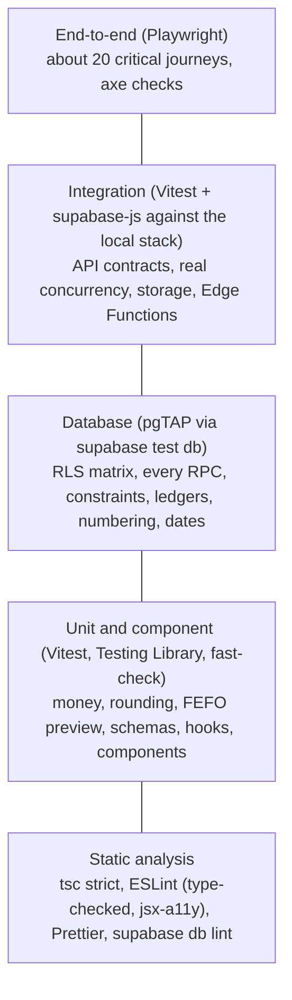
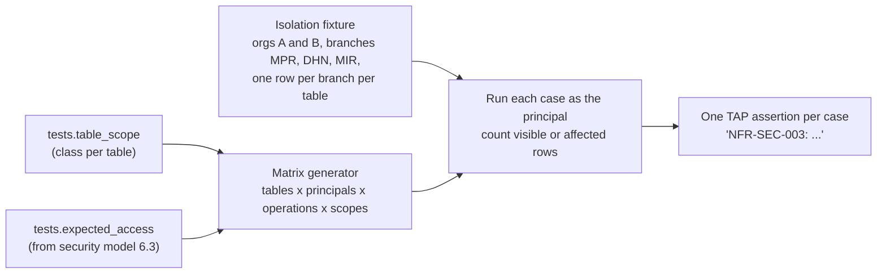

# PIMS Testing Strategy

How the Pharmacy Inventory Management System (PIMS) is tested: test levels and tools, what each level
must cover, the Row Level Security (RLS) test matrix, database function (RPC) obligations, money
property tests, end-to-end journeys, test data, coverage, performance, security and accessibility
testing, CI gating and the flaky-test policy.

| Field        | Value                                                                                             |
| ------------ | ------------------------------------------------------------------------------------------------- |
| Document ID  | PIMS-TEST-001                                                                                     |
| Version      | 1.0                                                                                               |
| Status       | Draft for M0 review                                                                               |
| Owner        | Engineering lead                                                                                  |
| Approver     | Engineering lead; the Owner approves changes to user acceptance testing                           |
| Last updated | 2026-10-06                                                                                        |
| Applies to   | Milestones M0 to M5 (see [roadmap](../roadmap.md))                                                |
| Change rule  | Changed only by pull request; a change to a CI gate changes the workflow in the same pull request |

## Table of contents

1. [Introduction](#1-introduction)
2. [Principles](#2-principles)
3. [Test pyramid and tools](#3-test-pyramid-and-tools)
4. [What to test at each level](#4-what-to-test-at-each-level)
5. [Database tests (pgTAP)](#5-database-tests-pgtap)
6. [RLS and isolation test matrix](#6-rls-and-isolation-test-matrix)
7. [RPC function test requirements](#7-rpc-function-test-requirements)
8. [Money and rounding property-based tests](#8-money-and-rounding-property-based-tests)
9. [End-to-end critical journeys](#9-end-to-end-critical-journeys)
10. [Test data and factories](#10-test-data-and-factories)
11. [Performance tests](#11-performance-tests)
12. [Security tests](#12-security-tests)
13. [Accessibility tests](#13-accessibility-tests)
14. [Internationalization tests](#14-internationalization-tests)
15. [Coverage targets](#15-coverage-targets)
16. [Requirement traceability](#16-requirement-traceability)
17. [CI gating and schedules](#17-ci-gating-and-schedules)
18. [Flaky test policy](#18-flaky-test-policy)
19. [Current state and gaps](#19-current-state-and-gaps)
20. [Revision history](#20-revision-history)

---

## 1. Introduction

### 1.1 Purpose

PIMS keeps its business rules in PostgreSQL: prices, discounts, FEFO allocation, gapless invoice
numbers, permissions and tenant isolation are all enforced by database functions, constraints and RLS
policies. The testing strategy therefore has an unusually **wide database layer**: most correctness
and most security is proven by pgTAP tests, with the web app tested for behaviour, accessibility and
language, and a focused set of end-to-end journeys proving the pieces work together.

### 1.2 Scope and canonical sources

This document defines test levels, tools, obligations and gates. It relies on:

| Topic                                                         | Canonical document                                                       |
| ------------------------------------------------------------- | ------------------------------------------------------------------------ |
| Requirement IDs, verification methods, traceability rules     | [SRS](../requirements/SRS.md) section 4                                  |
| Roles, permission matrix, isolation fixture, SEC-TC test IDs  | [Security model](../security/security-model.md) sections 6, 8.6 and 18   |
| Functions, error codes, lock order, database test obligations | [Database design](../database/database-design.md) sections 8, 9 and 20   |
| Performance budgets                                           | SRS NFR-PERF; [architecture](../architecture/architecture.md) section 18 |
| Coding, review and CI rules                                   | [Engineering standards](engineering-standards.md)                        |
| Running tests locally                                         | [CONTRIBUTING.md](../../CONTRIBUTING.md)                                 |

---

## 2. Principles

1. **Test where the rule lives.** A rule enforced by the database is tested in the database (pgTAP);
   a pure calculation is tested in Vitest; a user goal is tested end to end. Do not test a database
   rule only through the UI.
2. **Prove the negative.** For every permission, limit and isolation rule, the denied case is tested
   at least as carefully as the allowed case.
3. **Deterministic and isolated.** Each test creates its own data, controls time, and passes in any
   order and in parallel. No test depends on another test, the wall clock or the network outside the
   local stack.
4. **Fast feedback.** The unit suite runs in under 60 seconds locally; a pull request's full CI run in
   under 15 minutes.
5. **Requirement-tagged.** A test that verifies a requirement carries its ID (SRS section 4.2), so the
   traceability matrix is generated, not maintained by hand.
6. **Fix, never skip.** Failing and flaky tests are fixed; they are never skipped, retried to green or
   deleted to make CI pass (section 18).
7. **Production-like where it matters.** Database tests run against the real Supabase stack
   (PostgreSQL 17 locally, as in `supabase/config.toml`), with the same migrations, roles and grants as
   production.
8. **Synthetic data only.** No production data, anonymized or not, is used outside production.

---

## 3. Test pyramid and tools



| Level           | Tool                                                               | Location                               | Command                      | Runs                          | Target duration (CI) | Status           |
| --------------- | ------------------------------------------------------------------ | -------------------------------------- | ---------------------------- | ----------------------------- | -------------------- | ---------------- |
| Static          | TypeScript, ESLint, Prettier, `supabase db lint`                   | Whole repository                       | `pnpm check`, `pnpm db:lint` | Pre-commit (staged files), CI | 2 min                | In place         |
| Unit            | Vitest 5, fast-check 4                                             | `src/**/*.test.ts`, co-located         | `pnpm test`                  | Every commit, CI              | 1 min                | In place         |
| Component       | Vitest (jsdom), Testing Library, user-event                        | `src/**/*.test.tsx`, co-located        | `pnpm test`                  | Every commit, CI              | Included above       | In place         |
| Database        | pgTAP through `supabase test db`                                   | `supabase/tests/database/*.test.sql`   | `pnpm test:db`               | CI, before pushing SQL        | 5 min                | In place         |
| Database (fast) | pgTAP on a throwaway cluster without Docker                        | Same files                             | `pnpm test:db:local`         | Local only                    | 1 min                | In place         |
| Integration     | Vitest (node) with supabase-js against the local stack             | `supabase/tests/integration/*.test.ts` | `pnpm test:integration`      | CI                            | 5 min                | Planned (M1)     |
| End-to-end      | Playwright 1.63 (projects `chromium` desktop and `mobile` Pixel 7) | `e2e/*.spec.ts`                        | `pnpm test:e2e`              | CI                            | 10 min               | In place (smoke) |
| Accessibility   | axe-core in Playwright; manual keyboard and NVDA checks            | `e2e/`                                 | `pnpm test:e2e`              | CI; before milestone exits    | Included above       | Planned (M2)     |
| Performance     | pgbench, k6, Lighthouse CI, bundle budget                          | `scripts/perf/`                        | `pnpm test:perf` (planned)   | Before minor releases (M4+)   | 45 min               | Planned (M4)     |
| Security        | pgTAP isolation suites, CodeQL, gitleaks, `pnpm audit`, OWASP ZAP  | See section 12                         | CI and scheduled workflows   | CI, weekly                    | -                    | Partly in place  |

The pyramid is wide at the database level by design: a single `create_sale` RPC encapsulates stock
allocation, pricing, loyalty, credit and numbering, and each of those rules is tested there once,
precisely, instead of many times through the browser.

---

## 4. What to test at each level

### 4.1 Static analysis

Not tests in the strict sense, but the first gate: strict TypeScript, `typescript-eslint`
`strictTypeChecked`, `eslint-plugin-jsx-a11y` (strict), React Hooks rules, the bans on `parseFloat` and
`dangerouslySetInnerHTML`, Prettier, and `supabase db lint` (plpgsql_check) with warnings as failures.
See the [engineering standards](engineering-standards.md) section 23.

### 4.2 Unit tests (Vitest)

| Test                                                                                              | Do not test                                           |
| ------------------------------------------------------------------------------------------------- | ----------------------------------------------------- |
| `src/domain`: money parsing, formatting, percentages, allocation, rounding (section 8)            | Library internals (React, TanStack Query, Zod itself) |
| Pack-to-base-unit conversion and quantity validation                                              | Generated database types                              |
| FEFO preview, discount-limit preview, loyalty preview against shared vectors                      | Trivial getters and pass-through wrappers             |
| Date helpers: Asia/Dhaka display, date-only handling, fiscal-year labels                          | Private implementation details that can change freely |
| Zod schemas: valid and invalid samples (shared with contract tests)                               |                                                       |
| Query-key factories (tenant scope first), RPC error mapping (`code` to `messageKey`, `retryable`) |                                                       |
| i18n formatters in both locales                                                                   |                                                       |

Conventions:

- Pure domain tests may declare `// @vitest-environment node` to skip jsdom.
- Table-driven cases with `it.each`; titles start with the requirement ID when one applies
  (`describe('FR-POS-019 invoice discount allocation', ...)`).
- No network, no timers without `vi.useFakeTimers()`, no `Date.now()` without `vi.setSystemTime()`.

### 4.3 Component tests (Vitest, Testing Library, user-event)

- Render through a shared helper (`src/test/render.tsx`, planned) that provides a fresh `QueryClient`
  (retries off), i18n and a memory router.
- Query by role and accessible name (`getByRole('button', { name: 'Pay' })`); `data-testid` only when
  no accessible query exists. This doubles as an accessibility check.
- Drive interaction with `user-event`, including keyboard: the POS must be operable without a mouse.
- Supabase is never called. Data is seeded into the query cache with the slice's `queryOptions` keys,
  and mutations are replaced at the slice's `api/` boundary with `vi.mock`; deep mocks of
  `supabase-js` are not used.
- What to cover: cart behaviour (add by barcode, quantity keys, remove, undo), totals preview display,
  payment dialog validation and idempotency-key reuse across retries, form error messages in English
  and Bangla, permission-dependent visibility, error rendering with the short request ID, `aria-live`
  announcements, language switching without losing state.

### 4.4 Database tests (pgTAP)

The primary level for: constraints, triggers, RLS, grants, every RPC, numbering, ledgers and
projections, audit capture, business dates, integrity checks. Details in sections 5 to 7.

### 4.5 Integration tests (Vitest with supabase-js)

Run in Node against the local Supabase stack (`pnpm db:start`, then `pnpm db:reset`) through the real
PostgREST, Auth, Storage and Edge Functions endpoints. A separate Vitest configuration
(`vitest.integration.config.ts`, planned) includes `supabase/tests/integration/**/*.test.ts`.

| Area                   | Examples                                                                                                                                   |
| ---------------------- | ------------------------------------------------------------------------------------------------------------------------------------------ |
| API contract           | Each RPC's response parses with the client's Zod schema; the same invalid samples are rejected by Zod and by the RPC (NFR-REL-011)         |
| API exposure           | `anon` gets nothing over HTTP; `app` and `audit` schemas are not reachable; `max_rows` applies                                             |
| Real concurrency       | Two cashiers selling the last unit; 20 parallel sales of one lot; parallel duplicate requests with one idempotency key (section 7.3)       |
| Error contract         | `error.code = 'P0001'` with the stable code in `error.details`; lock timeouts surface as `busy_retry`                                      |
| Input fuzzing          | fast-check generates malformed payloads; responses are business errors or PostgREST 4xx input errors, never 5xx or a timeout (NFR-SEC-008) |
| Authentication and MFA | AAL1 Manager tokens read no business data; AAL2 after TOTP verification does (FR-IAM-005; TOTP codes generated by a small RFC 6238 helper) |
| Storage                | Users cannot read or write objects under another organization's or unassigned branch's path (SEC-TC-14, M3)                                |
| Edge Functions         | `admin-users` rejects callers without `users.manage`, AAL1 callers and targets in another organization (SEC-TC-15, M2)                     |

Fixtures create their own organization, branches and users per test file through the local
service-role key, read at runtime from `supabase status -o env`. That key exists only on the local
stack and in CI; it is never committed and never used against staging or production.

### 4.6 End-to-end tests (Playwright)

Prove that a user can complete a goal across the real UI, API and database. They do not re-test every
business rule (pgTAP does that); they test the critical journeys of section 9.

- Run against the production build (`pnpm build && pnpm preview`, as configured in
  `playwright.config.ts`) and, from M2, the local Supabase stack with the seed loaded.
- Locators by role and accessible name; web-first assertions (`await expect(...).toBeVisible()`); no
  `page.waitForTimeout`.
- One signed-in `storageState` per seed role, created once in a setup project; data prepared through
  API fixtures, not through long UI sequences.
- Tags: use case and requirement IDs (`{ tag: ['@UC-06', '@FR-POS-002'] }`); `@desktop-only` for POS
  journeys, which the `mobile` project excludes by configuration (`grepInvert`), never with
  `test.skip`.
- Barcode scanners are simulated as keyboard bursts: `page.keyboard.type(code, { delay: 5 })` followed by
  `Enter` (the POS treats 6 or more characters at under 30 ms intervals as a scan).
- Receipts: `window.print` is stubbed; the print layout is asserted for 58 mm, 80 mm and A4 after
  switching to print media with `page.emulateMedia()`.
- Time: `page.clock` controls the idle lock (15 minutes, CFG-31) and business-day boundaries.
- Lost responses: `page.route` lets the request reach the server (`route.fetch()`) and then aborts the
  response, to prove the retry with the same idempotency key creates exactly one sale.
- Traces, screenshots and the HTML report are kept on failure (configured).

---

## 5. Database tests (pgTAP)

### 5.1 Files and ordering

Files run in alphabetical order. `000_setup_test_helpers.test.sql` installs the shared helpers and is
the only file that commits; every other file wraps its work in `begin; ... rollback;`.

| Prefix    | Content                                                                 | Existing files                       |
| --------- | ----------------------------------------------------------------------- | ------------------------------------ |
| `000`     | Shared helpers in schema `tests` (commits)                              | `000_setup_test_helpers.test.sql`    |
| `001-009` | Platform guards: catalog-wide checks that must hold for every migration | `001_platform_guards.test.sql`       |
| `010-019` | Tenancy, membership, permissions, MFA                                   | `010_tenancy.test.sql`               |
| `020-099` | Cross-module business flows and shared vectors                          | `020_purchase_to_sale_flow.test.sql` |
| `100-199` | Catalog                                                                 | -                                    |
| `200-299` | Inventory (ledger, FEFO, adjustments, counts)                           | -                                    |
| `300-399` | Purchasing and suppliers                                                | -                                    |
| `400-499` | Sales, POS, returns, voids, numbering, controlled drugs                 | -                                    |
| `500-599` | Customers and dues                                                      | -                                    |
| `600-699` | Loyalty                                                                 | -                                    |
| `700-799` | Transfers, cash sessions, expenses                                      | -                                    |
| `800-899` | Reports, audit, notifications, integrity checks                         | -                                    |
| `900-999` | Generated RLS and privilege matrices (section 6)                        | -                                    |

Name: `<prefix>_<area>_<topic>.test.sql`, for example `410_sales_create_sale.test.sql`.

### 5.2 Structure

```sql
-- 410_sales_create_sale.test.sql: create_sale validation, limits and numbering.
begin;
select plan(1); -- the exact number of assertions in the file

select tests.create_user('owner@t410.test') as owner \gset
select tests.authenticate_as(:'owner');
select public.create_organization('T410 Pharmacy', 'Mohammadpur', 'MPR') as org \gset
select id as branch from public.branches where organization_id = :'org' \gset

select throws_ok(
  format($$ select public.create_sale(%L, '[]'::jsonb, '[]'::jsonb, gen_random_uuid()) $$, :'branch'),
  'P0001', null,
  'NFR-SEC-008: a sale without lines is rejected (invalid_items)');

select * from finish();
rollback;
```

Rules:

- `plan(N)` with the exact count; `no_plan()` is not used, so a silently skipped assertion fails.
- The description of each assertion starts with the requirement or security test ID it verifies
  (`'FR-INV-005: ...'`, `'SEC-TC-07: ...'`).
- Identity is switched only with `tests.authenticate_as(user_id, aal)`, `tests.authenticate_as_anon()`
  and `tests.clear_authentication()`; assertions about hidden columns or audit rows run after
  `tests.clear_authentication()`.
- Error assertions check the **stable error code** (the `DETAIL` of `app.fail`), not the English
  message, which may be reworded. Until the planned helper `tests.throws_code(sql, code, description)`
  exists, use `throws_ok(sql, 'P0001', <message>, description)`.
- Expected dates use `app.business_date(org)` rather than `current_date`, because the server date is
  UTC and the business date is Asia/Dhaka.
- A file never relies on data created by another file.

### 5.3 Platform guards

`001_platform_guards.test.sql` already asserts that every `public` table has RLS enabled, every
`SECURITY DEFINER` function in `public` and `app` pins `search_path`, and `anon` cannot write to any
`public` table. It is extended (security model SEC-GAP-17) to:

| Guard                                                                                            | Requirement            |
| ------------------------------------------------------------------------------------------------ | ---------------------- |
| Every table in an exposed schema has RLS enabled **and** at least one policy                     | NFR-SEC-002, SEC-TC-01 |
| No function in `public`, `app` or `audit` is executable by `PUBLIC` or `anon`                    | NFR-SEC-009, SEC-TC-02 |
| `anon` holds no privilege on any table, view, sequence or function in `public`                   | SEC-TC-03              |
| `authenticated` has no `INSERT`, `UPDATE` or `DELETE` on ledger, document and audit tables       | NFR-SEC-010, SEC-TC-04 |
| No column uses `real`, `double precision` or `money`                                             | NFR-REL-005            |
| Every foreign key is covered by an index                                                         | NFR-SCAL-005           |
| Every table in an exposed schema is classified in `tests.table_scope` (section 6)                | NFR-SEC-003            |
| Every `public` function is referenced by at least one test file (checked by the coverage script) | NFR-MAINT-002          |

---

## 6. RLS and isolation test matrix

Goal: prove, for **every table, every role and every operation**, that users see and change exactly
what the [security model](../security/security-model.md) allows, and nothing of another organization or
an unassigned branch (NFR-SEC-003, SEC-TC-05 to SEC-TC-10).

### 6.1 Dimensions

| Dimension | Values                                                                                                                                                                                                                        |
| --------- | ----------------------------------------------------------------------------------------------------------------------------------------------------------------------------------------------------------------------------- |
| Table     | Every table in an exposed schema (`public`), classified in the test-only table `tests.table_scope` as `organization`, `branch`, `inter_branch`, `user`, `platform` or `no_client_access`                                      |
| Principal | `anon`; authenticated non-member; Owner A (AAL2); Owner A (AAL1); Manager A of MPR (AAL2); Manager A of MPR (AAL1); Salesman A of MPR; Salesman A of DHN; Accountant A (M4); Auditor A (M4); deactivated member of A; Owner B |
| Operation | `SELECT`, `INSERT`, `UPDATE`, `DELETE` (and the `TRUNCATE` privilege)                                                                                                                                                         |
| Row scope | Own branch; other branch of the same organization; other organization                                                                                                                                                         |

The fixture is the security model's (section 8.6): organization A with branches MPR (Mohammadpur) and
DHN (Dhanmondi), organization B with branch MIR (Mirpur), and at least one row per branch in every
table, created through the RPCs so that the data is valid.

### 6.2 Expected outcomes

The expected outcome of every cell is data, not code: a test-only fixture `tests.expected_access`
lists, per table class, role and operation, which row scopes are allowed. It is derived from the
permission matrix in security model section 6.3 and reviewed in the same pull request as any matrix
change (SEC-TC-08). A difference between the fixture, `app.role_permissions` and the security model is
a defect.

### 6.3 Mechanics



| Operation          | How it is tested                                                                                                                                                                                           |
| ------------------ | ---------------------------------------------------------------------------------------------------------------------------------------------------------------------------------------------------------- |
| `SELECT`           | Generic: switch to the principal, count rows per organization and branch with dynamic SQL, compare with the expected scopes                                                                                |
| Write privileges   | Generic: `has_table_privilege` and `has_column_privilege` for `authenticated` and `anon` match the grants the database design specifies; ledgers, documents and `audit.log` have no client write privilege |
| `INSERT`           | Per table where clients may insert directly (for example `customers`, `medicines`): an insert carrying another organization's `organization_id` or an unassigned `branch_id` fails the policy (`42501`)    |
| `UPDATE`, `DELETE` | Per table where allowed: targeting another organization's or branch's row affects zero rows (RLS filters it) and the row is unchanged afterwards                                                           |
| Append-only        | `UPDATE`, `DELETE` on every ledger, the controlled-drug register and `audit.log` fail even for the function owner (SEC-TC-12)                                                                              |
| RPC isolation      | Every RPC called with IDs from organization B or an unassigned branch fails with `forbidden` or an `invalid_*` code and changes nothing (row counts compared before and after; SEC-TC-07)                  |

Illustrative sketch of the generated read matrix (the implementation lives in the `9xx` files):

```sql
create or replace function tests.run_read_matrix()
returns setof text
language plpgsql
as $$
declare
  c record;
  v_seen integer;
begin
  for c in select * from tests.read_matrix_cases() loop
    perform tests.authenticate_as(c.user_id, c.aal);
    execute format('select count(*) from public.%I where organization_id = $1', c.table_name)
      into v_seen using c.target_organization_id;
    perform tests.clear_authentication();
    return next is(v_seen, c.expected_rows,
      format('NFR-SEC-003: %s as %s sees %s rows of %s', c.table_name, c.principal,
             c.expected_rows, c.target_scope));
  end loop;
end;
$$;
```

A new table without a classification fails the platform guard, so isolation tests cannot be forgotten.
Status per SEC-TC ID is tracked in security model section 8.6.

---

## 7. RPC function test requirements

### 7.1 Required cases

**Every** client-callable function in `public` has a pgTAP suite covering the cases below
(database design section 20; NFR-MAINT-002 requires 100 %).

| #   | Case                          | What is asserted                                                                                                                                                                                                                               |
| --- | ----------------------------- | ---------------------------------------------------------------------------------------------------------------------------------------------------------------------------------------------------------------------------------------------- |
| 1   | Happy path                    | Return shape and values (IDs, numbers, totals, `replayed = false`); document, line, ledger and projection rows; summary tables; audit row with the correct actor                                                                               |
| 2   | Validation errors             | Each error code the function can raise (`invalid_items`, `invalid_quantity`, `price_above_mrp`, ...) has at least one test that triggers it                                                                                                    |
| 3   | Permission denied per role    | Each role lacking the permission key is refused with `forbidden`; AAL1 Owner and Manager are refused; deactivated members are refused                                                                                                          |
| 4   | Cross-tenant and cross-branch | IDs of another organization or an unassigned branch are refused and nothing changes                                                                                                                                                            |
| 5   | Anonymous                     | `anon` cannot execute the function (`42501`)                                                                                                                                                                                                   |
| 6   | Idempotency                   | Same `p_client_request_id` and payload returns the original result with `replayed = true` and creates nothing; same key with a different payload fails with `request_id_conflict`; a missing key fails with `missing_request_id` (NFR-REL-006) |
| 7   | Atomicity                     | A failure late in the function (for example the last line short of stock) leaves no partial rows and **consumes no document number**: the next successful sale gets the next number (FR-POS-030, NFR-REL-001)                                  |
| 8   | Limits                        | Role limits (discount, credit, return, adjustment) at, just below and just above the boundary                                                                                                                                                  |
| 9   | Money exactness               | SRS worked examples reproduced to the paisa; totals equal the sum of lines; allocation remainders as rule R-3                                                                                                                                  |
| 10  | Dates                         | Business date and fiscal year assigned in Asia/Dhaka: `app.business_date(org, at)` at 23:59:59 and 00:00:00 Asia/Dhaka and on 30 June / 1 July (NFR-REL-010)                                                                                   |
| 11  | Immutability                  | Posted documents and ledger rows cannot be edited or deleted afterwards (NFR-REL-007)                                                                                                                                                          |
| 12  | Concurrency                   | Where the function locks stock, customers, cards or counters: the scenarios of 7.3                                                                                                                                                             |

The existing `020_purchase_to_sale_flow.test.sql` demonstrates cases 1, 2, 3, 6, 9 and 11 for
`receive_goods`, `create_sale`, `void_sale`, `process_sale_return`, `enroll_loyalty` and
`record_customer_payment`; each function still needs its own complete suite.

### 7.2 Business errors to assert, by function family

| Family                | Must include at least                                                                                                                    |
| --------------------- | ---------------------------------------------------------------------------------------------------------------------------------------- |
| Sales (`create_sale`) | `insufficient_stock`, `discount_limit`, `credit_limit`, `overpayment`, `prescription_required`, `invalid_payment`, `request_id_conflict` |
| Voids and returns     | `sale_voided`, `void_window_passed`, `return_window_passed`, return quantity exceeded, `forbidden` for Salesman voids                    |
| Goods receipt         | `price_above_mrp`, expired stock, duplicate supplier invoice, `invalid_supplier`                                                         |
| Loyalty               | `loyalty_disabled`, `loyalty_inactive`, `loyalty_customer_mismatch`, `phone_required`, `insufficient_points`                             |
| Customers             | `overpayment` of dues, credit limit changes by an unauthorized role                                                                      |

The authoritative code list is database design section 8.2.

### 7.3 Concurrency tests

pgTAP runs in one session, so true concurrency is tested at the integration level with separate
connections (database design section 20): each supabase-js client call is its own PostgREST request on
its own pooled database connection.

| Scenario                                     | Assertion                                                                                                        | Requirement             |
| -------------------------------------------- | ---------------------------------------------------------------------------------------------------------------- | ----------------------- |
| Two cashiers sell the last unit              | Exactly one sale succeeds; the other fails with `insufficient_stock`; on hand is 0; one invoice number used      | FR-INV-005              |
| 20 parallel sales of one lot                 | Exactly the available quantity is sold; stock never negative; no deadlock                                        | NFR-REL-002             |
| Parallel duplicate requests, same key        | One sale; every response carries the same `sale_id`; no unique-violation leaks to the client                     | NFR-REL-006             |
| Mixed sale, void and return on the same lots | All complete or fail with a business error or `busy_retry`; no deadlock (`pg_stat_database.deadlocks` unchanged) | NFR-REL-002, delta D-02 |
| Parallel sales in one branch                 | Invoice numbers are contiguous with no gaps or duplicates                                                        | FR-POS-030, NFR-REL-004 |

```ts
// supabase/tests/integration/stock-concurrency.test.ts (illustrative)
it('FR-INV-005: two cashiers cannot both sell the last unit', async () => {
  const { branchId, medicineId, cashiers } = await fixtures.branchWithLastUnit({ cashiers: 2 })

  const sell = (client: PimsClient) =>
    client.rpc('create_sale', {
      p_branch_id: branchId,
      p_items: [{ medicine_id: medicineId, quantity: 1 }],
      p_payments: [{ method: 'cash', amount_paisa: 10_000 }],
      p_client_request_id: crypto.randomUUID(),
    })

  const results = await Promise.all(cashiers.map(sell))

  expect(results.filter((result) => result.error === null)).toHaveLength(1)
  expect(results.find((result) => result.error !== null)?.error?.details).toBe('insufficient_stock')
  expect(await fixtures.onHand(branchId, medicineId)).toBe(0)
})
```

Concurrency tests repeat each scenario at least 20 times per CI run (a loop inside the test) so that a
race that wins only occasionally is still caught.

---

## 8. Money and rounding property-based tests

Money errors are silent and cumulative, so money code is tested with properties over generated inputs
(fast-check), not only examples. Each money property runs **at least 10,000 generated cases** in CI
(NFR-REL-005); the nightly run uses 100,000 cases with a random seed.

### 8.1 Properties

| ID    | Property                                                                                                                                       | Implementation under test                        | Rule / requirement         |
| ----- | ---------------------------------------------------------------------------------------------------------------------------------------------- | ------------------------------------------------ | -------------------------- |
| MP-1  | `parseTaka(formatTaka(x)) = x` for every amount within `MAX_PAISA`, in English and Bangla digits                                               | `parseTaka`, `formatTaka`                        | NFR-I18N-004               |
| MP-2  | `percentOf(a, bp)` is within half a paisa of the exact value, ties rounded away from zero; never exceeds `a`; monotonic in `bp`                | `percentOf` and `app.percent_of`                 | R-1, R-2                   |
| MP-3  | Allocation parts always sum exactly to the total; zero weight gets zero; every part is the floor share except the remainder recipient          | Client preview and `app.allocate_proportionally` | R-3, FR-POS-019            |
| MP-4  | Line gross per allocated lot equals `round(quantity * price / price_basis_quantity)` and never exceeds the MRP-based gross                     | Sale preview                                     | R-5, FR-POS-012            |
| MP-5  | VAT contained in a net is between 0 and the net, and 0 when the rate is 0                                                                      | Sale preview                                     | R-6                        |
| MP-6  | Cash rounding adjustment is within -49 to +50 paisa and the rounded total is a whole taka                                                      | Sale preview                                     | R-7                        |
| MP-7  | Invoice total equals the sum of line nets plus the rounding line                                                                               | Sale preview                                     | NFR-REL-005                |
| MP-8  | Any sequence of partial returns of a line refunds in total exactly the line net when fully returned, and never more than was paid at any point | Return preview and `process_sale_return`         | R-4, NFR-REL-005           |
| MP-9  | Loyalty points earned are non-negative and monotonic in the eligible net                                                                       | Loyalty preview                                  | FR-LOY-032                 |
| MP-10 | Pack quantity to base units and back is exact for every catalog conversion factor                                                              | Quantity helpers                                 | Engineering standards 12.2 |

FEFO preview is tested model-based: for generated batch sets and requested quantities, allocations sum
to the request when stock suffices, never exceed a batch's on-hand quantity, consume earlier expiry
first, and skip expired or blocked batches.

### 8.2 Keeping client and server identical

- **Shared vectors.** A JSON file of input and expected-output cases for every rounding rule (planned
  `src/domain/vectors/money-vectors.json`) is the single source. Vitest reads it directly; a script
  generates `supabase/tests/database/030_money_vectors.test.sql` from it, and CI fails if the generated
  file is out of date.
- **SQL properties.** pgTAP loops over 10,000 pseudo-random cases with a fixed `setseed()` for the
  same properties on the SQL functions (for example, `sum(app.allocate_proportionally(t, w)) = t`).
- **Regression capture.** When fast-check finds a counterexample it prints the seed and path; the
  minimal counterexample is added as an explicit `it.each` case and a vector before the fix.

```ts
import fc from 'fast-check'
import { describe, expect, it } from 'vitest'

import { MAX_PAISA, paisa, percentOf } from './money'

const MONEY_RUNS = { numRuns: 10_000 }

describe('NFR-REL-005 percentOf rounding', () => {
  it('equals amount x bp / 10000 rounded half away from zero, computed exactly', () => {
    fc.assert(
      fc.property(
        fc.integer({ min: 0, max: MAX_PAISA }),
        fc.integer({ min: 0, max: 10_000 }),
        (amount, bp) => {
          // BigInt reference: exact for every input, unlike a product of two doubles.
          const expected = (BigInt(amount) * BigInt(bp) + 5_000n) / 10_000n
          expect(BigInt(percentOf(paisa(amount), bp))).toBe(expected)
        },
      ),
      MONEY_RUNS,
    )
  })
})
```

Reference implementations in properties use `BigInt` so that the oracle is exact. The existing
`src/domain/money.test.ts` uses fast-check's default of 100 runs; raising it to `MONEY_RUNS` is a
tracked gap (section 19). The property above fails on the current `percentOf`, which multiplies two
doubles and is not exact once `amount x bp` exceeds 2^53, so amounts above about 9.0 x 10^11 paisa can
be off by one paisa (TST-04; the limitation is recorded as follow-up F-1 of
[ADR-0005](../adr/0005-money-as-integer-paisa.md)).

---

## 9. End-to-end critical journeys

Each journey is one Playwright spec tagged with its use case (SRS section 3.2) and requirement IDs.
"Both" means the `chromium` (desktop) and `mobile` (Pixel 7) projects; POS journeys run on desktop only
because the POS targets 1366 x 768 and larger (NFR-USAB-007).

| ID     | Journey                                                                                                              | Tags                                       | Projects | Milestone |
| ------ | -------------------------------------------------------------------------------------------------------------------- | ------------------------------------------ | -------- | --------- |
| E2E-00 | Home page loads and switches to Bangla (existing `e2e/smoke.spec.ts`)                                                | `@smoke`                                   | Both     | M0        |
| E2E-01 | Sign in with TOTP and select the active branch; a Manager without the second factor sees no business data            | `@UC-01`, `@FR-IAM-005`                    | Both     | M2        |
| E2E-02 | Keyboard-only cash sale: scan a barcode without focusing search, search by generic name, change quantity, pay, print | `@UC-06`, `@FR-POS-002`, `@NFR-USAB-002`   | Desktop  | M2        |
| E2E-03 | Split payment (cash and bKash); change is given only from cash                                                       | `@UC-06`                                   | Desktop  | M2        |
| E2E-04 | Insufficient stock rejects the sale, names the line and the available quantity, and consumes no invoice number       | `@UC-06`, `@FR-POS-014`, `@FR-POS-030`     | Desktop  | M2        |
| E2E-05 | Lost response: the retried sale with the same idempotency key produces exactly one invoice                           | `@UC-06`, `@NFR-REL-006`, `@NFR-AVAIL-005` | Desktop  | M2        |
| E2E-06 | Controlled medicine requires prescription details and appears in the controlled-drug register                        | `@UC-07`                                   | Desktop  | M2        |
| E2E-07 | Park a bill, serve another customer, recall the bill                                                                 | `@UC-08`                                   | Desktop  | M2        |
| E2E-08 | Void an invoice with Branch Manager approval; stock is restored                                                      | `@UC-09`                                   | Desktop  | M2        |
| E2E-09 | Register a customer, sell on credit (বাকি) within the limit, collect part of the due                                 | `@UC-11`                                   | Desktop  | M2        |
| E2E-10 | Goods receipt creates batches; the next sale takes the earliest expiry first (FEFO)                                  | `@UC-15`, `@FR-PUR-005`                    | Both     | M2        |
| E2E-11 | Stock adjustment with a reason; the adjustment is visible in the stock history                                       | `@UC-20`                                   | Both     | M2        |
| E2E-12 | Switch language on the POS without losing the cart                                                                   | `@NFR-I18N-003`                            | Desktop  | M2        |
| E2E-13 | A Salesman opening another branch's POS URL is denied; navigation shows only permitted screens                       | `@UC-01`, `@NFR-SEC-003`                   | Both     | M2        |
| E2E-14 | Idle lock after 15 minutes keeps the cart; sign-out clears session storage and the query cache                       | `@FR-IAM-011`                              | Desktop  | M2        |
| E2E-15 | View the daily sales report and export it                                                                            | `@UC-24`                                   | Both     | M2        |
| E2E-16 | Sale return to the original batch with refund                                                                        | `@UC-10`                                   | Desktop  | M3        |
| E2E-17 | Enroll a loyalty member, then a sale applies the discount automatically to eligible lines only                       | `@UC-12`, `@UC-13`, `@FR-LOY-025`          | Desktop  | M3        |
| E2E-18 | Stock transfer: request, dispatch, receive; stock moves between branches                                             | `@UC-19`, `@FR-TRF-001`                    | Both     | M3        |
| E2E-19 | Open and close a cash session with a counted variance                                                                | `@UC-22`                                   | Desktop  | M3        |
| E2E-20 | Offline sale is queued and synchronized after reconnection without duplicates                                        | `@NFR-AVAIL-004`                           | Desktop  | M4        |
| E2E-21 | Prescription photo produces suggested lines that a pharmacist must confirm before they enter the cart                | `@UC-31`                                   | Desktop  | M5        |

Every journey also runs the axe check of section 13 at its key states. Journeys are added in the
milestone in which their use case is delivered; the list is reviewed at each milestone exit.

---

## 10. Test data and factories

### 10.1 Rules

- **Synthetic only.** Names are obviously fictional; e-mail addresses use the reserved `.test` domain;
  phone numbers follow the Bangladeshi format (`017XXXXXXXX`) but are generated, never copied from a
  real customer. Medicine data may use real brand and generic names (Napa, Paracetamol, Seclo), which
  are product data, not personal data.
- **Self-contained.** Each test creates the organization, branches, users and stock it needs, or uses
  a documented shared fixture read-only. Unique values come from the test name or worker index plus a
  counter, so parallel runs never collide.
- **Valid by construction.** Business documents in fixtures are created by calling the RPCs, never by
  inserting into document or ledger tables, so every invariant holds.
- **Time is controlled.** Vitest uses fake timers, Playwright uses `page.clock`, and pgTAP derives
  expectations from `app.business_date()`.

### 10.2 Fixtures by level

| Level       | Fixture or factory                                                                                                                                                                                                                                | Status       |
| ----------- | ------------------------------------------------------------------------------------------------------------------------------------------------------------------------------------------------------------------------------------------------- | ------------ |
| pgTAP       | `tests.create_user(email)`, `tests.authenticate_as(user_id, aal)`, `tests.authenticate_as_anon()`, `tests.clear_authentication()`                                                                                                                 | In place     |
| pgTAP       | `tests.throws_code(sql, code, description)`; `tests.table_scope`, `tests.expected_access`; `tests.isolation_fixture()`; builders such as `tests.make_medicine(org, ...)` and `tests.receive_stock(branch, ...)`                                   | Planned (M1) |
| Vitest      | Builders in `src/test/factories/` returning valid objects with overrides (`buildCartLine({ quantity: 3 })`); fast-check arbitraries in `src/test/arbitraries.ts` (`paisaArb`, `basisPointsArb`, `cartArb`); render helper with providers          | Planned (M2) |
| Integration | `supabase/tests/integration/fixtures.ts`: one organization per test file with branches, users per role (including two Salesmen in one branch) and stock, created with the local service-role key and RPCs                                         | Planned (M1) |
| E2E         | Seed users of [CONTRIBUTING.md](../../CONTRIBUTING.md), one `storageState` per role in `e2e/.auth/` (git-ignored); API fixtures in `e2e/fixtures/` that prepare data as the role under test                                                       | Planned (M2) |
| Local dev   | `supabase/seed.sql`: "Demo Pharmacy" (MPR, DHN) and "Other Pharmacy", users for every role, about 200 medicines, near-expiry lots, customers with dues, loyalty members, 30 days of sales created through the RPCs (database design section 19.3) | Planned (M1) |
| Performance | Volume dataset `scripts/db/generate-volume.sql`: 30,000 medicines, 60,000 barcodes, 10 branches, 8,000 active lots per branch, one year of sales (NFR-SCAL-003)                                                                                   | Planned (M4) |

### 10.3 Environments for tests

| Environment         | Used for                                                                                                                | Data                                     |
| ------------------- | ----------------------------------------------------------------------------------------------------------------------- | ---------------------------------------- |
| Local stack         | Unit, component, pgTAP, integration, E2E during development                                                             | Seed plus per-test fixtures              |
| CI runner stack     | All automated suites on every pull request and on `main`                                                                | Fresh `supabase start`, migrations, seed |
| Staging             | Smoke tests after deploy, ZAP baseline, k6 load tests, UAT                                                              | Synthetic data only                      |
| Disposable database | pgbench runs on the volume dataset                                                                                      | Volume dataset                           |
| Production          | Post-deploy smoke tests without tenant data: the app loads, security headers are present, the `health` function answers | No test data and no test accounts        |

---

## 11. Performance tests

### 11.1 Tools

| Tool                         | Measures                                                                | Runs against                                                                                               |
| ---------------------------- | ----------------------------------------------------------------------- | ---------------------------------------------------------------------------------------------------------- |
| pgbench                      | Database execution latency of RPCs and report functions (server time)   | Disposable database with the volume dataset, same PostgreSQL major version and compute class as production |
| k6                           | API latency, throughput and error rate under concurrent terminals       | Staging, sized like production; never production                                                           |
| `EXPLAIN` assertions (pgTAP) | Plans use the intended indexes (trigram search, FEFO partial index)     | Volume dataset (M4)                                                                                        |
| Lighthouse CI                | Largest Contentful Paint on sign-in and POS, mobile profile, cold cache | Preview or staging build                                                                                   |
| Bundle budget                | JavaScript per route (gzip)                                             | Every build in CI                                                                                          |
| Sentry Web Vitals            | Field LCP, INP, CLS (monitoring, not a gate)                            | Production                                                                                                 |

pgbench scripts set the JWT claims and switch to the `authenticated` role inside each transaction, as
the pgTAP helpers do, so RLS and permission checks are part of the measured cost. k6 runs from the
pinned `grafana/k6` container image.

### 11.2 Scenarios and budgets

The reference workload and budgets are the SRS's (section 3.4 and NFR-PERF).

| ID    | Scenario                                                                                                                                                                                                                           | Budget                                                                                                | Requirement                |
| ----- | ---------------------------------------------------------------------------------------------------------------------------------------------------------------------------------------------------------------------------------- | ----------------------------------------------------------------------------------------------------- | -------------------------- |
| PT-01 | `search_medicines` with prefixes, generic names and misspellings from a 500-term list, 8 clients, 5 minutes                                                                                                                        | p95 below 200 ms server time                                                                          | NFR-PERF-001               |
| PT-02 | `create_sale` with 1 to 10 lines, 20 clients (5 branches x 4 terminals)                                                                                                                                                            | p95 below 500 ms, p99 below 1 s                                                                       | NFR-PERF-002               |
| PT-03 | `create_sale` with 50 lines                                                                                                                                                                                                        | p95 below 1 s                                                                                         | NFR-PERF-002               |
| PT-04 | `receive_goods` with 50 lines                                                                                                                                                                                                      | p95 below 1 s                                                                                         | NFR-PERF-011               |
| PT-05 | Standard reports for one branch over one year; Owner dashboard with 20 branches                                                                                                                                                    | p95 below 2 s                                                                                         | NFR-PERF-004, NFR-PERF-008 |
| PT-06 | Peak hour at 3 times the reference: 180 sales per branch per hour across 5 branches with 4 terminals each (20 virtual cashiers, one sale every 80 s each, about 3 lines and 8 searches per sale), 30 minutes after a 5-minute ramp | PT-01 and PT-02 budgets hold; error rate below 0.1 % excluding business-rule rejections; no deadlocks | NFR-PERF-010               |
| PT-07 | Stress: ramp virtual cashiers until a budget breaks                                                                                                                                                                                | Informational: capacity headroom recorded                                                             | NFR-SCAL-003               |
| PT-08 | Sign-in and POS routes, Lighthouse mobile profile, cold cache                                                                                                                                                                      | LCP below 2.5 s; first-screen JavaScript at most 250 KB gzip                                          | NFR-PERF-003, NFR-PERF-007 |

k6 measures latency from the load generator, which includes network time to Singapore. Each run first
measures the median round trip of a trivial RPC and adds it to the server-time budget:

```js
const RTT_MS = Number(__ENV.BASELINE_RTT_MS)

export const options = {
  thresholds: {
    'http_req_duration{rpc:search_medicines}': [`p(95)<${200 + RTT_MS}`],
    'http_req_duration{rpc:create_sale}': [`p(95)<${500 + RTT_MS}`, `p(99)<${1000 + RTT_MS}`],
    'checks{kind:unexpected_error}': ['rate<0.001'],
  },
}
```

After every load run the integrity checks (NFR-REL-003, NFR-REL-004) must pass: no negative stock,
projections equal the ledger, and invoice series are gapless.

### 11.3 When and how results are used

- Before every minor release from M4, and on demand for a pull request labelled `perf` that touches
  search, sale commit, goods receipt or reports.
- The report (environment, dataset, commit, p50, p95, p99, error rate, RTT baseline) is attached to the
  release. A budget breach blocks the release; a regression of more than 20 % against the previous
  release is investigated even within budget.
- Until M4, hot-path pull requests attach `EXPLAIN (ANALYZE, BUFFERS)` output on realistic data
  instead (engineering standards section 16).

---

## 12. Security tests

The security model's testing plan (section 18.1) is canonical; this table shows where each activity
sits in the test suites.

| Activity                                                             | Level / tool                                                           | Trigger                                            | Gate                          |
| -------------------------------------------------------------------- | ---------------------------------------------------------------------- | -------------------------------------------------- | ----------------------------- |
| RLS, privileges, isolation (SEC-TC-01 to 13)                         | pgTAP (sections 5.3 and 6)                                             | Every pull request                                 | Blocking                      |
| Business-rule security (limits, approvals, append-only, idempotency) | pgTAP (section 7)                                                      | Every pull request                                 | Blocking                      |
| Input fuzzing of RPCs (NFR-SEC-008)                                  | Integration, fast-check payloads                                       | Every pull request                                 | Blocking                      |
| Storage and Edge Function authorization (SEC-TC-14, 15)              | Integration                                                            | Every pull request                                 | Blocking (M2, M3)             |
| MFA, idle lock, sign-out clearing, role-based screens                | Playwright (E2E-01, E2E-13, E2E-14)                                    | Every pull request                                 | Blocking (M2)                 |
| Static analysis                                                      | CodeQL `security-extended`                                             | Pull requests, `main`, weekly                      | Blocking on high and critical |
| Dependencies                                                         | `pnpm audit`, dependency review, Dependabot                            | Pull requests, weekly                              | Blocking on high and critical |
| Secrets in history                                                   | gitleaks                                                               | Every push and pull request                        | Blocking                      |
| Secrets in the bundle (SEC-TC-18)                                    | Script over `dist/`                                                    | Every build                                        | Blocking (M2)                 |
| Security headers (SEC-TC-17)                                         | Script against the preview deployment                                  | Pull requests with a preview                       | Blocking (M2)                 |
| DAST baseline                                                        | OWASP ZAP baseline (`zaproxy/action-baseline`, pinned) against staging | Weekly (Monday) and before each production release | Blocking on High alerts (M2)  |
| Authenticated DAST                                                   | OWASP ZAP full or API scan with synthetic staging users                | Monthly and before launch                          | Triage within a week (M4)     |
| AI red-team set                                                      | 30 adversarial prompts and 100 malicious SQL cases                     | Before enabling or changing any AI feature         | Zero unsafe outputs (M5)      |

ZAP's accepted alerts are kept in a rules file with a justification for each, reviewed like code.
Production is never actively scanned.

---

## 13. Accessibility tests

| Layer           | Check                                                                                                                                                                                         | Gate                                                                                              |
| --------------- | --------------------------------------------------------------------------------------------------------------------------------------------------------------------------------------------- | ------------------------------------------------------------------------------------------------- |
| Lint            | `eslint-plugin-jsx-a11y` strict rules                                                                                                                                                         | Blocking (in place)                                                                               |
| Component tests | Role and accessible-name queries; keyboard interaction with `user-event`                                                                                                                      | Blocking                                                                                          |
| E2E with axe    | `@axe-core/playwright` (planned dev dependency) with tags `wcag2a`, `wcag2aa`, `wcag21a`, `wcag21aa` at every journey's key states (empty, filled, dialog open, error), in English and Bangla | Zero serious or critical violations (NFR-USAB-001); moderate and minor findings tracked as issues |
| Keyboard E2E    | E2E-02 completes a full sale without a mouse; focus is always visible                                                                                                                         | Blocking (NFR-USAB-002)                                                                           |
| Layout          | Owner and Manager screens at 320 CSS px width and at 200 % zoom (viewport tests)                                                                                                              | Blocking (NFR-USAB-007)                                                                           |
| Manual          | Keyboard-only and NVDA with Chrome on Windows for sign-in, POS and main forms                                                                                                                 | Before each milestone exit; full WCAG 2.1 AA audit before launch (M4)                             |

```ts
import AxeBuilder from '@axe-core/playwright'
import { expect, type Page } from '@playwright/test'

export async function expectNoSeriousA11yViolations(page: Page): Promise<void> {
  const { violations } = await new AxeBuilder({ page })
    .withTags(['wcag2a', 'wcag2aa', 'wcag21a', 'wcag21aa'])
    .analyze()
  const blocking = violations.filter((v) => v.impact === 'serious' || v.impact === 'critical')
  expect(blocking, JSON.stringify(blocking, null, 2)).toEqual([])
}
```

---

## 14. Internationalization tests

| Check                                                                                                       | Level                                           | Requirement                |
| ----------------------------------------------------------------------------------------------------------- | ----------------------------------------------- | -------------------------- |
| `en.json` and `bn.json` have identical key sets                                                             | CI script                                       | NFR-I18N-001, NFR-I18N-002 |
| Currency, number and date formatting in both locales (lakh grouping, Bangla digits, DD/MM/YYYY, Asia/Dhaka) | Unit                                            | NFR-I18N-004               |
| Numeric inputs accept Bangla digits (`১২` = 12)                                                             | Unit, component                                 | NFR-I18N-005               |
| Language switch on the POS keeps the cart                                                                   | E2E-12                                          | NFR-I18N-003               |
| A pseudo-locale (30 % longer strings, bracketed) reveals truncation and hard-coded strings                  | Component, E2E (on demand)                      | NFR-I18N-009               |
| Receipt layouts in English, Bangla and both                                                                 | Component snapshot                              | NFR-I18N-008               |
| Every business error code has an English and a Bangla message                                               | CI script against the database design catalogue | NFR-MAINT-009              |

---

## 15. Coverage targets

Coverage shows what is untested; it is not a goal in itself. Tests written only to raise a number are
rejected in review. Thresholds only go up; lowering one needs an exception under engineering standards
section 24.

| Scope                                                                             | Metric                                        | Target                                                          | Enforcement                                      |
| --------------------------------------------------------------------------------- | --------------------------------------------- | --------------------------------------------------------------- | ------------------------------------------------ |
| `src/domain/**`                                                                   | Lines, functions, branches, statements        | 90 %, 90 %, 85 %, 90 %                                          | Vitest thresholds in `vite.config.ts` (in place) |
| `src/features/*/{api,model,schemas}/**`, `src/lib/**` (excluding generated files) | Lines and branches                            | 80 % each                                                       | Vitest thresholds (planned, M2)                  |
| UI components                                                                     | No numeric gate                               | Behaviour test for every interactive component; journeys in E2E | Review                                           |
| Client-callable RPCs in `public`                                                  | Functions with a complete suite (section 7.1) | 100 %                                                           | Coverage script (planned, M1)                    |
| Business error codes                                                              | Codes raised by a test                        | 100 %                                                           | Catalogue check (planned, M2)                    |
| Tables in exposed schemas                                                         | Classified and covered by the RLS matrix      | 100 %                                                           | Platform guard (planned, M1)                     |
| Must requirements of the current and earlier milestones                           | Automated test or recorded other method       | 100 % at milestone exit                                         | Traceability report (section 16)                 |
| Critical journeys of the current milestone                                        | Automated E2E                                 | 100 % at milestone exit                                         | Milestone review                                 |

The thresholds exceed the floor of NFR-MAINT-002 (at least 80 % line and branch coverage on domain
logic; 100 % of RPC functions and RLS policies tested).

---

## 16. Requirement traceability

The SRS (section 4.3) requires a script that builds the traceability matrix from the code. It is
specified here.

| Aspect     | Specification                                                                                                                                                                                                                                                                                                                   |
| ---------- | ------------------------------------------------------------------------------------------------------------------------------------------------------------------------------------------------------------------------------------------------------------------------------------------------------------------------------- |
| Location   | `scripts/traceability/` (TypeScript, run with Node 22), script `pnpm traceability` (planned, M1)                                                                                                                                                                                                                                |
| Inputs     | SRS requirement tables (ID, priority, milestone, status), the SRS table of requirements verified by demonstration, inspection or analysis; pgTAP assertion descriptions; Vitest `describe`/`it` titles; Playwright tags; the current milestone from the workflow configuration (kept in step with the [roadmap](../roadmap.md)) |
| ID pattern | Whole-word matches of `FR-<MODULE>-NNN`, `NFR-<CATEGORY>-NNN`, `IF-<TYPE>-NNN`, `UC-NN` and, for security tests, `SEC-TC-NN` (formats of SRS section 1.5)                                                                                                                                                                       |
| Outputs    | `traceability.md` and `traceability.csv` as CI artifacts: requirement, priority, milestone, method, tests (file and line), status (`Covered`, `Other method`, `Missing`)                                                                                                                                                        |
| Rules      | Fail when a test references an ID that does not exist or is Withdrawn; warn when a Must requirement of the current or an earlier milestone has no automated test and no other recorded method; on a release tag that closes a milestone, fail on that condition instead of warning                                              |
| Release    | The report is attached to every GitHub Release                                                                                                                                                                                                                                                                                  |

---

## 17. CI gating and schedules

### 17.1 Pull requests and `main`

| Suite                                  | Command                                              | CI job (`ci.yml`)                                    | Gate                          | Status                             |
| -------------------------------------- | ---------------------------------------------------- | ---------------------------------------------------- | ----------------------------- | ---------------------------------- |
| Lint, format, typecheck                | `pnpm lint`, `pnpm format:check`, `pnpm typecheck`   | `quality`                                            | Blocking                      | In place                           |
| Unit and component tests with coverage | `pnpm test:coverage`                                 | `quality`                                            | Blocking, thresholds enforced | In place                           |
| SQL lint                               | `supabase db lint --level warning --fail-on warning` | `database`                                           | Blocking                      | In place                           |
| pgTAP (guards, tenancy, flows, matrix) | `supabase test db`                                   | `database`                                           | Blocking                      | In place                           |
| Integration                            | `pnpm test:integration`                              | `database`                                           | Blocking                      | Planned (M1)                       |
| E2E and axe                            | `pnpm test:e2e`                                      | `e2e`                                                | Blocking                      | In place (smoke); axe planned (M2) |
| i18n key parity, bundle budget         | Scripts                                              | `quality`                                            | Blocking                      | Planned (M2)                       |
| Traceability                           | `pnpm traceability`                                  | `traceability`                                       | Rules in section 16           | Planned (M1)                       |
| Security scans                         | gitleaks, dependency review, `pnpm audit`, CodeQL    | `secrets`, `dependency-review`, `quality`, `analyze` | Blocking                      | In place                           |

The required status checks for `main` are listed in engineering standards section 21.2.

### 17.2 Scheduled and release-time runs

| When                            | What                                                                                                                                                       |
| ------------------------------- | ---------------------------------------------------------------------------------------------------------------------------------------------------------- |
| Nightly on `main`               | Money properties with 100,000 cases and a random seed; Vitest with `sequence.shuffle`; full E2E on both projects; concurrency scenarios repeated 200 times |
| Weekly (Monday, Asia/Dhaka)     | CodeQL; OWASP ZAP baseline against staging; Dependabot                                                                                                     |
| After each staging deploy       | Smoke tests against staging                                                                                                                                |
| Before each minor release (M4+) | Performance suite (section 11)                                                                                                                             |
| Monthly (M4+)                   | Authenticated DAST against staging                                                                                                                         |
| Before each milestone exit      | Manual accessibility checks; user acceptance testing on staging (SRS section 4.5); traceability report                                                     |
| Quarterly                       | Restore drill with integrity checks and smoke tests (runbook)                                                                                              |

A failing nightly or scheduled run opens an issue automatically and is treated like a red `main`.

---

## 18. Flaky test policy

A **flaky test** is one that both passes and fails on the same commit without a code change. Flaky
tests destroy trust in CI, so the policy is strict: **fix, never skip**.

1. **No hiding.** Tests are never skipped or retried to green: Playwright runs with `retries: 0`
   (configured), Vitest with no retries, and `.skip`, `.only`, `.todo`, `test.fixme`, pgTAP `skip()`
   and commented-out tests are not merged (`forbidOnly` is on in CI; lint rules for Vitest are planned).
2. **Report on first sight.** Whoever sees a required check fail and pass on re-run of the same commit
   opens an issue labelled `flaky-test` with links to both runs **before** relying on the green re-run.
3. **Priority.** A flaky test is a P1 defect: an owner is assigned the same business day and the fix is
   merged within 2 business days (Sunday to Thursday, Asia/Dhaka).
4. **Blocking `main`.** If the flake blocks merges and cannot be fixed within 2 hours, the commit that
   introduced it is reverted. If no such commit exists, fixing the test takes precedence over feature
   work until it is fixed.
5. **Product bug first.** Every flake is first suspected to be a real race in the product (stock
   allocation, idempotency, numbering, cache invalidation) and investigated as such before the test is
   changed.
6. **Standard fixes.**

   | Cause                   | Fix                                                                                        |
   | ----------------------- | ------------------------------------------------------------------------------------------ |
   | Timing in the UI        | Web-first assertions, `expect.poll`, waiting on a response or state, never fixed sleeps    |
   | Shared or leftover data | Unique data per test; no dependence on seed rows that other tests change                   |
   | Order dependence        | Remove shared state; verified with shuffled order                                          |
   | Wall-clock time         | Fake timers, `page.clock`, `app.business_date()`-based expectations                        |
   | Concurrency tests       | Deterministic barriers (start all requests together), assertions on invariants not timings |
   | External services       | None in tests; everything runs on the local stack                                          |

7. **Proof of fix.** The fixed test passes 50 consecutive runs locally, noted in the pull request:
   `pnpm exec playwright test --repeat-each=50 <file>` for Playwright, a shell loop for Vitest and pgTAP.
8. **Prevention.** New E2E, timing or concurrency tests pass 20 consecutive local runs before their pull
   request leaves draft.
9. **Visibility.** The number of flaky-test issues opened and closed is reported at each milestone
   review; the target is zero open.

---

## 19. Current state and gaps

As of commit `1a9cc25`:

| Area         | In place                                                                                                                       | Gap                                                                                                                                                   |
| ------------ | ------------------------------------------------------------------------------------------------------------------------------ | ----------------------------------------------------------------------------------------------------------------------------------------------------- |
| Unit         | `src/domain/money.test.ts` (examples and fast-check properties), `src/lib/env.test.ts`; coverage thresholds on `src/domain/**` | Money properties run fast-check's default 100 cases instead of 10,000 (NFR-REL-005); allocation, VAT and cash-rounding helpers not yet on the client  |
| Component    | `src/app/App.test.tsx`                                                                                                         | Render helper, factories and arbitraries (M2)                                                                                                         |
| pgTAP        | Helpers, platform guards (3 checks), tenancy (18 assertions), purchase-to-sale flow (48 assertions)                            | Assertion descriptions lack requirement IDs; per-RPC suites; RLS matrix and table classification; extended guards (SEC-GAP-17); `tests.throws_code`   |
| Integration  | -                                                                                                                              | Configuration, fixtures, concurrency and contract suites (M1); `supabase/tests/integration` must be added to a TypeScript project for type-aware lint |
| E2E          | `e2e/smoke.spec.ts`; Chromium desktop and Pixel 7 projects; `retries: 0`; traces on failure                                    | The `e2e` CI job does not start the Supabase stack yet (needed from M2); axe dependency and helper                                                    |
| Performance  | -                                                                                                                              | Volume dataset, pgbench and k6 scripts, Lighthouse CI (M4)                                                                                            |
| Security     | gitleaks, CodeQL, `pnpm audit`, dependency review in CI                                                                        | ZAP workflow, header check, bundle secret scan (M2)                                                                                                   |
| Traceability | -                                                                                                                              | Script and CI job (M1)                                                                                                                                |
| Test data    | -                                                                                                                              | `supabase/seed.sql` with the users documented in CONTRIBUTING.md (M1)                                                                                 |

Open issues:

| ID     | Issue                                                                                                                                                                                                                                                                                                                                                                                                                                    | Owner            | Needed by |
| ------ | ---------------------------------------------------------------------------------------------------------------------------------------------------------------------------------------------------------------------------------------------------------------------------------------------------------------------------------------------------------------------------------------------------------------------------------------- | ---------------- | --------- |
| TST-01 | SRS section 4.5 describes UAT data as "realistic, anonymized"; architecture section 14.1 forbids copying production data to staging. This strategy uses synthetic data only; align the SRS wording                                                                                                                                                                                                                                       | SRS owner        | M2        |
| TST-02 | Decide whether `@axe-core/playwright`, `@vitest/eslint-plugin` and k6 (container) are accepted under the dependency policy, and record it in the pull request that adds them                                                                                                                                                                                                                                                             | Engineering lead | M2        |
| TST-03 | Existing pgTAP assertions check English messages; migrate to error-code assertions once `tests.throws_code` exists                                                                                                                                                                                                                                                                                                                       | Engineering      | M1        |
| TST-04 | `percentOf` in `src/domain/money.ts` computes `Math.abs(amount) * bp` in doubles, which loses precision above 2^53: for example `percentOf(994131874869, 9771)` returns 971366254935 instead of 971366254934. `MAX_PAISA` (10^12) is above the exact limit (about 9.007 x 10^11 for `bp` up to 10,000). Compute with `BigInt` as [ADR-0005](../adr/0005-money-as-integer-paisa.md) follow-up F-1 requires, and add MP-2 with 10,000 runs | Engineering      | M1        |

---

## 20. Revision history

| Version | Date       | Author           | Change                                        |
| ------- | ---------- | ---------------- | --------------------------------------------- |
| 1.0     | 2026-10-06 | Engineering lead | First complete testing strategy for M0 review |
