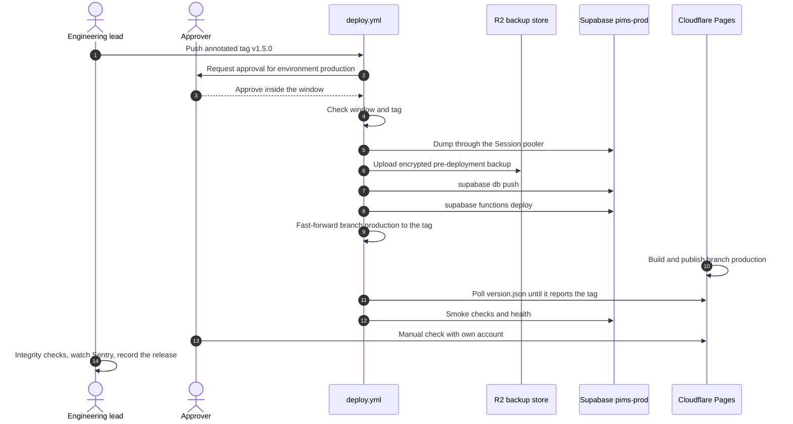
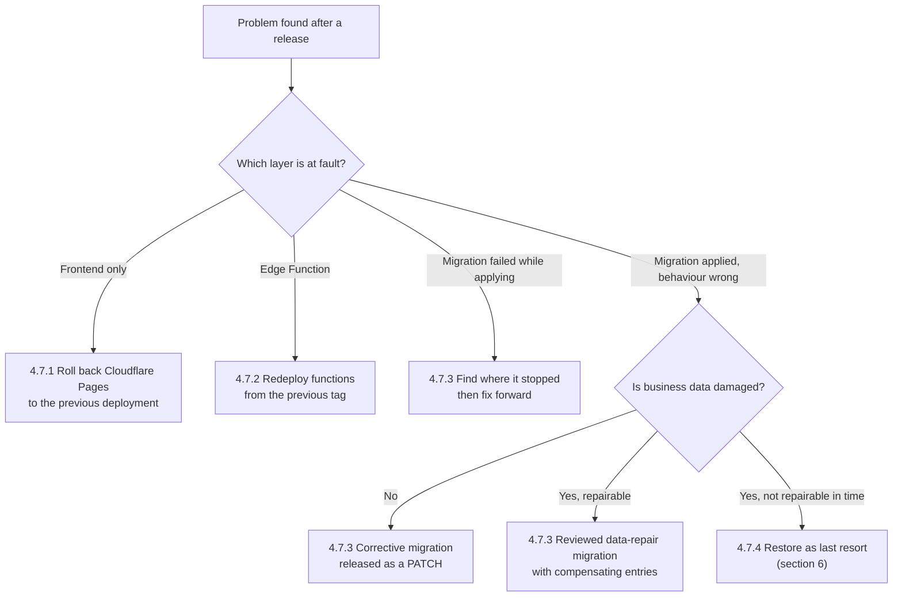
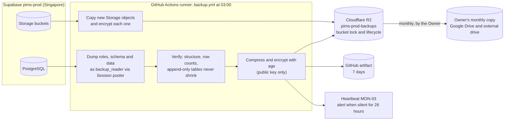
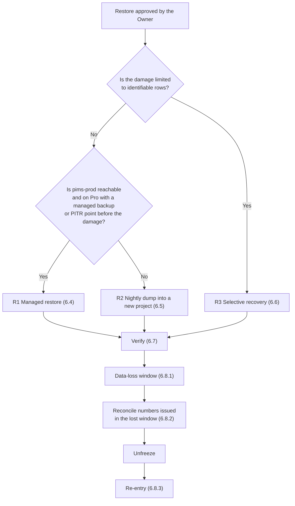
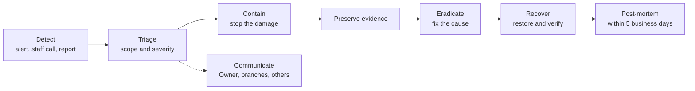

# PIMS Operations Runbook

Procedures for operating the Pharmacy Inventory Management System (PIMS) in staging and production:
environments and configuration, first-time setup, deployment and rollback, backup and restore,
monitoring and alerting, incident response, routine administration, data retention and
troubleshooting.

| Field        | Value                                                                                                                                                                              |
| ------------ | ---------------------------------------------------------------------------------------------------------------------------------------------------------------------------------- |
| Document ID  | PIMS-OPS-001                                                                                                                                                                       |
| Version      | 1.1                                                                                                                                                                                |
| Status       | Draft for M0 review                                                                                                                                                                |
| Owner        | Engineering lead (platform operator)                                                                                                                                               |
| Approver     | Product owner (pharmacy owner)                                                                                                                                                     |
| Last updated | 2026-10-06                                                                                                                                                                         |
| Applies to   | Staging from M0; production from the pilot ([roadmap](../roadmap.md) 5.4). Backup and restore (sections 5 and 6) before the pilot go-live; monitoring (section 7) by the M4 launch |
| Change rule  | A procedure changes in the same pull request as the workflow, setting or code it describes; every SEV-1 and SEV-2 post-mortem reviews this document                                |

## In an emergency

| Situation                                               | First action                                                                        | Procedure                                               |
| ------------------------------------------------------- | ----------------------------------------------------------------------------------- | ------------------------------------------------------- |
| PIMS does not open at any branch                        | Check provider status pages; branches switch to the paper invoice book (Appendix A) | [OP-01](#op-01-application-unavailable-at-all-branches) |
| One branch cannot work while others can                 | Check that branch's internet; switch to the mobile-data backup                      | [OP-02](#op-02-one-branch-cannot-use-pims)              |
| Sales fail with an error at the counter                 | Note the error code shown on screen; call the Branch Manager                        | [OP-03](#op-03-sale-commits-failing)                    |
| A release broke a screen                                | Roll back the frontend in Cloudflare Pages (under 5 minutes)                        | [4.7.1](#471-frontend-rollback)                         |
| Data looks wrong, or an integrity alert (AL-14) arrived | Stop the affected operation; never edit rows by hand                                | [OP-08](#op-08-integrity-check-failure-al-14)           |
| Backup failed or is missing                             | Re-run the backup workflow and investigate before the next business day             | [OP-09](#op-09-backup-failure-or-missing-backup)        |
| A password, key or token may have leaked                | Revoke and rotate first, investigate second                                         | [IR-01](#ir-01-leaked-secret)                           |
| A staff account may be compromised                      | Owner deactivates the user in Settings, Users                                       | [IR-02](#ir-02-compromised-staff-account)               |
| The Owner lost the authenticator phone                  | Identity-verified MFA reset by the platform operator                                | [9.5](#95-password-and-mfa-recovery)                    |
| The database must be restored                           | Open a SEV-1 incident; the Owner approves; follow the restore decision              | [Section 6](#6-restore)                                 |
| A security vulnerability was reported                   | Acknowledge privately; never discuss in a public issue                              | [IR-10](#ir-10-vulnerability-report-received)           |

Phone numbers are kept on the printed contact sheet at every branch and in the `PIMS Operations`
password-manager vault, never in this repository.

## Table of contents

1. [Introduction](#1-introduction)
2. [Environments and configuration](#2-environments-and-configuration)
3. [First-time production setup](#3-first-time-production-setup)
4. [Deployment](#4-deployment)
5. [Backup](#5-backup)
6. [Restore](#6-restore)
7. [Monitoring and alerting](#7-monitoring-and-alerting)
8. [Incident response](#8-incident-response)
9. [Routine operations](#9-routine-operations)
10. [Data retention and archival](#10-data-retention-and-archival)
11. [Troubleshooting](#11-troubleshooting)
12. [Operational records](#12-operational-records)
13. [Open issues](#13-open-issues)
14. [Revision history](#14-revision-history)
15. [Appendix A. Branch outage card](#appendix-a-branch-outage-card)
16. [Appendix B. Workflow and endpoint contracts](#appendix-b-workflow-and-endpoint-contracts)
17. [Appendix C. Operational SQL](#appendix-c-operational-sql)

---

## 1. Introduction

### 1.1 Purpose and scope

This runbook tells the people who operate PIMS what to do, in which order and with which tool, for
every planned operation and for the failures that can reasonably be expected. It covers the hosted
environments (staging and production), the GitHub, Supabase and Cloudflare configuration behind them,
and the procedures that the [SRS](../requirements/SRS.md) (FR-BKP, NFR-BACKUP, NFR-AVAIL, NFR-OBS),
the [security model](../security/security-model.md) (sections 11, 16 and 17) and the
[architecture](../architecture/architecture.md) (sections 10.9, 14 and 17) delegate to it.

It does not cover the developer workflow (see [CONTRIBUTING.md](../../CONTRIBUTING.md)), coding and
review rules (see [engineering standards](../engineering/engineering-standards.md)) or the user manual
for counter staff (M4).

### 1.2 Canonical sources

This runbook describes how to operate what other documents define. It summarizes and links instead of
redefining; where it and a canonical document disagree, the canonical document wins and this runbook is
corrected. Known differences are listed in [section 13](#13-open-issues).

| Topic                                                                                             | Canonical document                                                                      | What this runbook adds                              |
| ------------------------------------------------------------------------------------------------- | --------------------------------------------------------------------------------------- | --------------------------------------------------- |
| Environments, delivery pipeline, scheduled job times, alert thresholds, cost and upgrade triggers | [Architecture](../architecture/architecture.md) sections 10.9, 14, 17, 19, 20           | Step-by-step operation, configuration names, checks |
| Roles and permissions, secrets inventory and rotation periods, incident severity, playbook list   | [Security model](../security/security-model.md) sections 6, 11, 16, 17                  | Procedures, secret names, playbook steps            |
| Requirement IDs and recovery targets (FR-BKP, NFR-BACKUP, NFR-AVAIL, NFR-OBS)                     | [SRS](../requirements/SRS.md) sections 3.3.14, 3.4.3, 3.4.10, 3.4.11                    | How each requirement is met and evidenced           |
| Tables, functions, scheduled jobs, integrity checks, retention rules, migration policy            | [Database design](../database/database-design.md) sections 15, 17, 18                   | How to run, verify and recover them                 |
| Branching, release steps, required checks, hotfix rules                                           | [Engineering standards](../engineering/engineering-standards.md) sections 3, 20, 21, 22 | The operational half of a release                   |
| Test suites run before and after deployments and in drills                                        | [Testing strategy](../engineering/testing-strategy.md) section 17                       | When operators run them                             |
| Milestones; decisions                                                                             | [Roadmap](../roadmap.md); [ADR index](../adr/README.md)                                 | None                                                |
| Terms such as lot, base unit, business date, due (বাকি)                                           | [Glossary](../glossary.md)                                                              | None                                                |

### 1.3 Roles and responsibilities

The security model (section 7.7) requires two administrators on every platform account: the Owner and
the engineering lead. Nobody else holds platform administrator rights.

| Role                                 | Who                                                              | Responsibilities in this runbook                                                                                                                                                                                                                     |
| ------------------------------------ | ---------------------------------------------------------------- | ---------------------------------------------------------------------------------------------------------------------------------------------------------------------------------------------------------------------------------------------------- |
| Owner (product owner)                | The pharmacy owner                                               | Approves production releases, restores and emergency changes; holds the backup private key; makes the monthly offline copy; administers staff accounts in the application; decides on external notifications; second administrator on every platform |
| Engineering lead (platform operator) | The repository maintainer (`@msasomrat` in `.github/CODEOWNERS`) | Deployments, monitoring, backups and drills, rotations, platform configuration; incident lead; break-glass access under security model 7.7                                                                                                           |
| Branch Manager                       | One or more per branch                                           | First responder at the branch; runs the paper fallback; reports incidents; closes cash sessions of leavers; reviews branch exceptions weekly                                                                                                         |
| Salesman                             | Counter staff                                                    | Reports problems to the Branch Manager; follows the branch outage card                                                                                                                                                                               |

Responsibility matrix for the main procedures (R = does the work, A = accountable and approves,
C = consulted, I = informed):

| Procedure                                   | Owner           | Engineering lead | Branch Manager |
| ------------------------------------------- | --------------- | ---------------- | -------------- |
| Production release (4.4)                    | A               | R                | I              |
| Rollback (4.7)                              | I               | A, R             | I              |
| Restore of production (6)                   | A               | R                | C              |
| Quarterly restore drill (6.9)               | C (key custody) | A, R             | -              |
| Monthly offline copy (5.7)                  | A, R            | C                | -              |
| Secret rotation (9.6)                       | I               | A, R             | -              |
| Staff onboarding and offboarding (9.2, 9.4) | A, R            | C                | C              |
| Adding a branch (9.1)                       | A, R            | C                | R              |
| SEV-1 or SEV-2 incident (8)                 | A               | R                | C              |

### 1.4 Implementation status

PIMS is at milestone M0/M1 (commit `7ce5c5f`). Several procedures describe workflows and functions that
are designed but not yet built; each is marked with the milestone of the [roadmap](../roadmap.md) that
delivers it and must exist before the procedure is relied on. Per the roadmap, `pims-prod` is created at
pilot preparation (RD-03), the pilot at the Mohammadpur branch runs on it and becomes production at the
M4 launch without a data migration (RD-05), and the nightly backup with one restore test is pulled
forward to the pilot entry (RD-02).

| Item                                                                      | Status                        | Needed by                                               |
| ------------------------------------------------------------------------- | ----------------------------- | ------------------------------------------------------- |
| `ci.yml`, `codeql.yml`                                                    | In place                      | M0                                                      |
| Supabase project `pims-staging`, Cloudflare Pages project `pims-web`      | To create (section 3)         | M0                                                      |
| `deploy.yml` (staging and production delivery, Appendix B.1)              | Planned                       | M1 for staging (M1-D9); production at pilot preparation |
| Supabase project `pims-prod`, custom domain, production settings baseline | To create (section 3)         | Pilot preparation (RD-03, PL-E2)                        |
| `backup.yml` (Appendix B.2), R2 bucket, age keys, heartbeat monitor       | Planned                       | Pilot entry (RD-02, PL-E3)                              |
| `admin-users` Edge Function (invitations, deactivation, MFA reset)        | Planned                       | M2                                                      |
| `health` Edge Function (Appendix B.3), uptime monitors                    | Planned                       | M4 (M4-D3), at least four weeks before launch (M4-X5)   |
| Integrity check functions (`app.check_*`, `app.job_integrity_checks()`)   | Designed (database design 17) | M1 on demand, M3 scheduled                              |
| Provisioning script for the first organization (`scripts/ops/`)           | Planned                       | Pilot preparation                                       |
| `version.json` build marker (Appendix B.4)                                | Planned                       | M2                                                      |

**Go-live rules.** No real data enters production until the nightly backup (section 5) runs and one
restore has succeeded (roadmap PA-07 and PL-E3); the backup heartbeat MON-03 and the app check MON-01
are recommended from the pilot. The M4 launch additionally requires every monitor of 7.4, the first
formal quarterly drill (M4-D1, M4-X2) and the pre-launch security review (security model 18.4).

### 1.5 Conventions

- **Time.** All times are Asia/Dhaka (UTC+6, no daylight saving) unless marked UTC. GitHub Actions and
  `pg_cron` schedules are written in UTC: 03:00 Asia/Dhaka is `0 21 * * *` on the previous UTC day.
- **Business days** are Sunday to Thursday. Business hours are 08:00 to 24:00 (NFR-AVAIL-001).
- **Placeholders:**

  | Placeholder       | Meaning                                                                                                        |
  | ----------------- | -------------------------------------------------------------------------------------------------------------- |
  | `<prod-ref>`      | Project reference of `pims-prod` (the subdomain in `https://<prod-ref>.supabase.co`)                           |
  | `<staging-ref>`   | Project reference of `pims-staging`                                                                            |
  | `<app-domain>`    | Production host name of the web app, for example `app.` followed by the Owner's domain                         |
  | `<mail-domain>`   | Domain used to send authentication email, with SPF, DKIM and DMARC                                             |
  | `<pooler-host>`   | Supavisor host shown in Dashboard, Connect; for Singapore typically `aws-0-ap-southeast-1.pooler.supabase.com` |
  | `<r2-account-id>` | Cloudflare account ID used in the R2 endpoint `https://<r2-account-id>.r2.cloudflarestorage.com`               |
  | `<tag>`           | Release tag such as `v1.5.0`                                                                                   |

- **Dashboard paths** are given as of October 2026. Vendors rename menus; when a path has moved, find
  the setting by name and correct this runbook in the same week.
- **Commands** are bash on Linux or macOS. The Supabase CLI version is the one pinned in CI (`2.120.0`
  in `.github/workflows/ci.yml`); `psql` must be major version 17, the same as the server
  (`major_version = 17` in `supabase/config.toml`).
- **Checklists** (`- [ ]`) are copied into the related operations issue (section 12) and ticked there,
  not in this file.
- **Break-glass.** Steps marked _break-glass_ use direct database or dashboard access to production
  business data. Security model 7.7 applies: record the reason in the incident or operations issue
  before starting (within one hour in an emergency), notify the Owner, run only reviewed SQL scripts,
  attach the statements executed, and have the Owner review the record afterwards.
- **Secrets** are never pasted into issues, chat, email, commit messages or command lines that are saved
  to shell history. Read them from the password manager or with `read -rs VAR`.

---

## 2. Environments and configuration

### 2.1 Environment matrix

The environment definitions are canonical in
[architecture 14.1](../architecture/architecture.md#141-environments); this table adds the operational
details.

| Attribute             | Local                           | CI (ephemeral)                 | PR preview                          | Staging                                                | Production                                              |
| --------------------- | ------------------------------- | ------------------------------ | ----------------------------------- | ------------------------------------------------------ | ------------------------------------------------------- |
| Purpose               | Development                     | Automated tests on every PR    | UI review                           | Integration, UAT, migration rehearsal                  | Live pharmacy operations                                |
| Supabase              | CLI stack in Docker             | `supabase start` on the runner | `pims-staging`                      | `pims-staging`                                         | `pims-prod`                                             |
| Supabase organization | n/a                             | n/a                            | `PIMS Staging` (Free)               | `PIMS Staging` (Free)                                  | `PIMS Production` (Free at pilot, Pro at launch, OD-21) |
| Region                | Developer machine               | GitHub runner                  | Singapore (`ap-southeast-1`)        | Singapore (`ap-southeast-1`)                           | Singapore (`ap-southeast-1`)                            |
| PostgreSQL major      | 17                              | 17                             | 17                                  | 17                                                     | 17                                                      |
| Frontend URL          | `http://localhost:5173`         | `vite preview` on the runner   | `https://<hash>.pims-web.pages.dev` | `https://main.pims-web.pages.dev`                      | `https://<app-domain>`                                  |
| Cloudflare Pages env  | n/a                             | n/a                            | Preview                             | Preview (branch alias of `main`)                       | Production (branch `production`)                        |
| GitHub Environment    | n/a                             | none (no secrets)              | none                                | `staging`                                              | `production`, `backup`                                  |
| Data                  | `supabase/seed.sql` (synthetic) | Seed and fixtures              | Staging data (synthetic)            | Synthetic only; production personal data never (6.9)   | Real data (C3 as a whole)                               |
| Auth email            | Local mail catcher (port 54324) | n/a                            | Staging SMTP                        | Staging SMTP                                           | Production SMTP                                         |
| Deployed by           | Developer                       | GitHub Actions                 | Cloudflare Pages, automatically     | Merge to `main` (`deploy.yml`)                         | Release tag plus approval (`deploy.yml`)                |
| Backups               | None                            | None                           | None                                | None (rebuilt from migrations and seed)                | Section 5                                               |
| Monitoring            | None                            | CI results                     | None                                | Sentry environment `staging`; smoke tests after deploy | Sentry, uptime and heartbeat monitors, in-app alerts    |
| May pause when idle   | n/a                             | n/a                            | n/a                                 | Yes (Free tier, 7 days without activity)               | Must never pause (NFR-AVAIL-006, section 7.5)           |

Staging and production never share data, keys or users. Production and staging live in separate
Supabase organizations so that upgrading production to Pro does not start billing compute for staging.

### 2.2 Platform accounts and resources

| Platform            | Resources                                                                                                        | Used for                                          | Administrators          | Notes                                                   |
| ------------------- | ---------------------------------------------------------------------------------------------------------------- | ------------------------------------------------- | ----------------------- | ------------------------------------------------------- |
| GitHub              | Repository `msasomrat/Pharmacy_Inventory`; Environments `staging`, `production`, `backup`                        | Source, CI/CD, backup scheduler                   | Engineering lead, Owner | Private repository; no repository-level secrets         |
| Supabase            | Organization `PIMS Production` with project `pims-prod`; organization `PIMS Staging` with project `pims-staging` | Database, Auth, Storage, Edge Functions           | Engineering lead, Owner | Spend cap on; billing email monitored                   |
| Cloudflare          | Pages project `pims-web`; R2 bucket `pims-prod-backups`; DNS zone of the Owner's domain                          | Hosting, DNS, off-site backup store               | Engineering lead, Owner | Cloudflare GitHub app limited to this one repository    |
| Sentry              | Organization `pims`, project `pims-web`                                                                          | Frontend errors, Web Vitals, sale-commit failures | Engineering lead        | Developer plan allows one user (architecture 20.1)      |
| Uptime monitor      | Monitors MON-01 to MON-05 (section 7.4)                                                                          | Availability checks and heartbeats                | Engineering lead, Owner | Provider chosen in M4 (OPS-OI-09)                       |
| Transactional email | Sending domain `<mail-domain>`                                                                                   | Invitation, password reset and change emails      | Engineering lead, Owner | SPF, DKIM, DMARC (security model 7.1)                   |
| Domain registrar    | The Owner's domain                                                                                               | `<app-domain>`, `<mail-domain>`                   | Owner                   | Auto-renew on; expiry monitored (MON-05)                |
| Google              | The Owner's Google account; Drive folder `PIMS Backups`                                                          | Monthly off-site backup copy                      | Owner                   | 2-Step Verification on; folder never shared             |
| Password manager    | Shared vault `PIMS Operations`                                                                                   | Secrets, recovery codes, contact sheet            | Owner, engineering lead | The only place secret values are written down digitally |
| Anthropic (M5)      | Console organization                                                                                             | AI gateway                                        | Engineering lead, Owner | Monthly spend limit set                                 |

### 2.3 Secrets and configuration by name

Names only; values live in the stores shown. Classes follow
[security model 3.1](../security/security-model.md#31-classification-scheme) and rotation periods follow
[security model 11.1](../security/security-model.md#111-secrets-inventory); the procedures are in
[9.6](#96-rotating-keys-and-secrets).

**GitHub Environments** (repository Settings, Environments):

| Name                                                                 | Type     | Environments                      | Used by                              | Class | Rotation                                   |
| -------------------------------------------------------------------- | -------- | --------------------------------- | ------------------------------------ | ----- | ------------------------------------------ |
| `SUPABASE_ACCESS_TOKEN`                                              | Secret   | `staging`, `production`           | `deploy.yml`                         | C4    | 90 days                                    |
| `SUPABASE_DB_PASSWORD`                                               | Secret   | `staging`, `production`           | `deploy.yml`                         | C4    | 12 months and when an administrator leaves |
| `SUPABASE_PROJECT_REF`                                               | Variable | `staging`, `production`, `backup` | `deploy.yml`, `backup.yml`           | C0    | n/a                                        |
| `APP_URL`                                                            | Variable | `staging`, `production`           | Smoke tests                          | C0    | n/a                                        |
| `SMOKE_USER_EMAIL`, `SMOKE_USER_PASSWORD`                            | Secret   | `staging`                         | Staging smoke tests (synthetic user) | C2    | 12 months                                  |
| `BACKUP_DB_URL`                                                      | Secret   | `backup`, `production`            | `backup.yml`, pre-deploy backup      | C4    | 12 months                                  |
| `BACKUP_R2_ACCESS_KEY_ID`, `BACKUP_R2_SECRET_ACCESS_KEY`             | Secret   | `backup`, `production`            | Upload to the backup store           | C4    | 12 months                                  |
| `BACKUP_R2_ENDPOINT`, `BACKUP_R2_BUCKET`                             | Variable | `backup`, `production`            | Upload to the backup store           | C0    | n/a                                        |
| `BACKUP_AGE_RECIPIENT`                                               | Variable | `backup`, `production`            | Encryption (public key)              | C0    | Yearly, with the key pair (5.9)            |
| `PROD_STORAGE_S3_ACCESS_KEY_ID`, `PROD_STORAGE_S3_SECRET_ACCESS_KEY` | Secret   | `backup`                          | Nightly copy of Storage objects      | C4    | 12 months                                  |
| `PROD_STORAGE_S3_ENDPOINT`                                           | Variable | `backup`                          | Nightly copy of Storage objects      | C0    | n/a                                        |
| `BACKUP_HEARTBEAT_URL`                                               | Secret   | `backup`                          | Heartbeat pings (MON-03)             | C2    | When exposed                               |

The pre-deployment backup (5.6) runs inside the production deployment job, which can read only the
`production` environment; the backup credentials therefore exist in both `backup` and `production`
(security model 11.2). Both copies are rotated together.

**Cloudflare Pages** (project `pims-web`, Settings, Variables and Secrets; the Preview set holds staging
values, the Production set holds production values):

| Name                           | Type     | Used by                            | Class | Notes                                                               |
| ------------------------------ | -------- | ---------------------------------- | ----- | ------------------------------------------------------------------- |
| `VITE_SUPABASE_URL`            | Variable | Web app build                      | C0    | `https://<prod-ref>.supabase.co` in Production                      |
| `VITE_SUPABASE_ANON_KEY`       | Variable | Web app build                      | C0    | Holds the publishable key once legacy keys are retired (SEC-GAP-07) |
| `VITE_SENTRY_DSN`              | Variable | Web app build                      | C0    | Same project for both sets; environment tag differs                 |
| `SENTRY_AUTH_TOKEN`            | Secret   | Source-map upload during the build | C4    | 12 months (security model 11.1)                                     |
| `SENTRY_ORG`, `SENTRY_PROJECT` | Variable | Source-map upload                  | C0    | `pims`, `pims-web`                                                  |
| `NODE_VERSION`, `PNPM_VERSION` | Variable | Build image                        | C0    | `22.12.0` and `10.28.0` (match `.nvmrc` and `packageManager`)       |

**Supabase** (per project):

| Name                           | Where                                                       | Used by                                        | Class | Notes                                     |
| ------------------------------ | ----------------------------------------------------------- | ---------------------------------------------- | ----- | ----------------------------------------- |
| Database password (`postgres`) | Password manager; GitHub `SUPABASE_DB_PASSWORD`             | Deployments, break-glass                       | C4    | 12 months                                 |
| `backup_reader` role password  | Password manager; inside `BACKUP_DB_URL`                    | Backups                                        | C4    | 12 months                                 |
| Secret API key (service role)  | Injected into Edge Functions by the runtime                 | `admin-users`, retention purge, `storage-sign` | C4    | 12 months                                 |
| JWT signing keys               | Supabase Auth (managed)                                     | Auth                                           | C4    | Standby-key rotation (9.6)                |
| SMTP credentials               | Auth settings, SMTP                                         | Auth emails                                    | C4    | 12 months                                 |
| Storage S3 access keys         | Storage settings, S3 configuration                          | `backup.yml` only                              | C4    | 12 months; one key named `backup-nightly` |
| `SCHEDULER_SHARED_SECRET`      | Edge Function secrets and Vault (`scheduler_shared_secret`) | `pg_cron` calls through `pg_net`               | C4    | 12 months; both copies change together    |
| `ALLOWED_ORIGINS`              | Edge Function secrets                                       | CORS in Edge Functions                         | C0    | `https://<app-domain>` (production)       |
| `ANTHROPIC_API_KEY` (M5)       | Edge Function secrets                                       | `ai-gateway`                                   | C4    | 12 months; provider spend limit set       |
| `AI_GATEWAY_DB_URL` (M5)       | Edge Function secrets                                       | `ai-gateway`                                   | C4    | 12 months                                 |
| `SMS_GATEWAY_API_KEY` (v2)     | Edge Function secrets                                       | `notify-sms`                                   | C4    | 12 months                                 |

**Offline only** (never stored on a connected system in plain form):

| Item                                                 | Custody                                                                                        |
| ---------------------------------------------------- | ---------------------------------------------------------------------------------------------- |
| Backup private keys `pims-backup-fy<YYYY>.key`       | Owner (passphrase-protected file on an encrypted USB drive); sealed paper copy elsewhere (5.9) |
| Platform recovery codes                              | Printed, sealed, with the Owner; digital copy in the `PIMS Operations` vault                   |
| Restore read-only R2 token `pims-backups-restore-ro` | `PIMS Operations` vault only; never in GitHub                                                  |
| Contact sheet (phone numbers, escalation order)      | Printed at every branch and in the vault                                                       |

### 2.4 Production settings baseline

The baseline is the expected state of every production setting that is not expressed as code. It is
verified at setup (section 3), after every restore (6.7) and quarterly (9.13), and every deviation is
either corrected or recorded in an operations issue. Staging uses the same values except URLs, SMTP
sender and the absence of Pro-only features.

**Supabase Auth**

| Setting                                     | Expected value                                                                                                      | Source             |
| ------------------------------------------- | ------------------------------------------------------------------------------------------------------------------- | ------------------ |
| Allow new users to sign up                  | Off (invitation only)                                                                                               | FR-IAM-003         |
| Anonymous sign-ins, manual identity linking | Off                                                                                                                 | Security model 7.1 |
| Email provider                              | On; confirm email on; secure email change (both addresses) on; secure password change on                            | Security model 7.2 |
| Phone provider and SMS                      | Off                                                                                                                 | Security model 7.3 |
| Minimum password length                     | 10                                                                                                                  | FR-IAM-007         |
| Password character requirements             | None (the local `password_requirements` value differs, SEC-GAP-07)                                                  | Security model 7.2 |
| Leaked-password protection                  | On (Pro plan)                                                                                                       | Security model 7.2 |
| Site URL                                    | `https://<app-domain>`                                                                                              | Architecture 10.6  |
| Redirect URLs                               | Exactly `https://<app-domain>/invite/accept`, `https://<app-domain>/reset-password`, `https://<app-domain>/sign-in` | Architecture 9.2   |
| JWT expiry                                  | 3,600 seconds                                                                                                       | Security model 7.4 |
| Refresh token rotation, reuse interval      | On, 10 seconds                                                                                                      | Security model 7.4 |
| Session time-box, inactivity timeout        | 12 hours, 2 hours (Pro plan)                                                                                        | FR-IAM-011         |
| MFA                                         | TOTP enroll and verify on; phone factor off; maximum 10 factors per user                                            | FR-IAM-005         |
| Rate limits per IP                          | Sign-in and sign-up 30 per 5 minutes; token verifications 30 per 5 minutes; token refreshes 150 per 5 minutes       | Security model 7.5 |
| Email rate limit                            | 30 emails per hour (custom SMTP)                                                                                    | Runbook OP-12      |
| Email OTP and link expiry                   | 3,600 seconds, 6-digit OTP                                                                                          | Security model 7.4 |
| SMTP                                        | Custom provider, sender `PIMS <no-reply@<mail-domain>>`, TLS on port 587 or 465                                     | Security model 7.1 |
| Email templates                             | PIMS templates for invite, recovery, email change and reauthentication, English and Bangla, no tracking links       | FR-IAM-003         |
| CAPTCHA (Cloudflare Turnstile)              | Off until AL-11 shows automated attempts or before SaaS launch                                                      | Security model 7.5 |

**Supabase API, database and storage**

| Setting                             | Expected value                                                                                                 | Source                      |
| ----------------------------------- | -------------------------------------------------------------------------------------------------------------- | --------------------------- |
| Exposed schemas                     | `public` only (`graphql_public` removed; `pg_graphql` disabled)                                                | Architecture 10.2           |
| Extra search path; maximum rows     | `public, extensions`; 1,000                                                                                    | `supabase/config.toml`      |
| API keys                            | Publishable and secret keys in use; legacy `anon` and `service_role` keys disabled after the migration         | SEC-GAP-07                  |
| SSL enforcement                     | On (only TLS connections accepted)                                                                             | Security model 13.1         |
| Network restrictions                | Allow all, documented; tightened only as an incident containment step (8.3)                                    | Section 8.3                 |
| PostgreSQL major version            | 17, equal to `major_version` in `supabase/config.toml`                                                         | Architecture 10.1           |
| Custom roles                        | `backup_reader` (login, read-only, 2 connections); `ai_reader` (M5, no login)                                  | Section 5.3.3               |
| `organization_settings.enforce_mfa` | `true` for every organization (fixed by migration)                                                             | Security model 6.6          |
| Storage buckets                     | `prescriptions` (5 MB; JPEG, PNG, WebP), `org-assets` (1 MB; PNG, JPEG), `attachments`, `exports`; all private | Architecture 10.8, DB-OI-06 |
| Storage S3 protocol                 | Enabled; exactly one access key, `backup-nightly`                                                              | Section 5.3.4               |
| Edge Functions                      | `admin-users` (JWT verification on), `health` (JWT verification off), `ai-gateway` (M5, JWT verification on)   | Architecture 10.7           |
| `pg_cron` jobs                      | Exactly the jobs of database design 17.1 for the current milestone, all active                                 | Database design 17.1        |
| Spend cap (Pro)                     | On                                                                                                             | Security model 7.7          |

**Cloudflare**

| Setting                              | Expected value                                                                                                                                  |
| ------------------------------------ | ----------------------------------------------------------------------------------------------------------------------------------------------- |
| Pages production branch              | `production` (updated only by `deploy.yml`)                                                                                                     |
| Pages preview branches               | All non-production branches                                                                                                                     |
| Build command, output, root          | `pnpm build`, `dist`, repository root                                                                                                           |
| Build watch paths                    | Include `src/**`, `public/**`, `index.html`, `package.json`, `pnpm-lock.yaml`, `vite.config.ts`, `tsconfig*.json`; exclude `docs/**`, `**/*.md` |
| Access policy on preview deployments | On (Cloudflare Access, recommended by ADR-0004)                                                                                                 |
| Custom domain                        | `<app-domain>` active with a Cloudflare-managed certificate                                                                                     |
| Zone TLS                             | Always Use HTTPS on; minimum TLS version 1.2; TLS 1.3 on; DNSSEC on                                                                             |
| Security headers                     | As defined by `public/_headers` and security model 10.2; verified with the check in 3.11                                                        |
| R2 bucket `pims-prod-backups`        | No public access, no `r2.dev` URL, no custom domain; bucket lock and lifecycle rules of 5.2                                                     |

**GitHub**

| Setting                           | Expected value                                                                                                                                                                                                                                                                                                                                                       |
| --------------------------------- | -------------------------------------------------------------------------------------------------------------------------------------------------------------------------------------------------------------------------------------------------------------------------------------------------------------------------------------------------------------------- |
| Protection of `main`              | [Engineering standards 3.3](../engineering/engineering-standards.md#33-protection-of-main); required checks of section 21.2                                                                                                                                                                                                                                          |
| Protection of `production` branch | Deletion and force pushes blocked; updated only by `deploy.yml`                                                                                                                                                                                                                                                                                                      |
| Protection of release tags `v*`   | Tag ruleset: creation, update and deletion restricted to administrators                                                                                                                                                                                                                                                                                              |
| Environment `staging`             | Deployment branches: `main`                                                                                                                                                                                                                                                                                                                                          |
| Environment `production`          | Required reviewers: Owner and engineering lead, "prevent self-review" on once both have accounts; deployment refs: tags `v*.*.*`, branches `release/v*` and `main` (`workflow_dispatch`)                                                                                                                                                                             |
| Environment `backup`              | Deployment branches: `main`; no reviewers, so that the schedule can run                                                                                                                                                                                                                                                                                              |
| Actions                           | Allowed actions pinned to a full commit SHA; default workflow permissions read-only; Actions may not create or approve pull requests; fork pull requests need approval                                                                                                                                                                                               |
| Security features                 | Dependabot alerts and security updates, secret scanning with push protection; CodeQL per OI-04. Reports arrive through `security@<mail-domain>` (active, forwarded to the Owner and the engineering lead), `public/.well-known/security.txt` (RFC 9116) with a valid `Expires` date, and `public/.well-known/security-policy.txt` ([SECURITY.md](../../SECURITY.md)) |
| Notifications                     | Owner and engineering lead receive failed-workflow emails for scheduled workflows                                                                                                                                                                                                                                                                                    |

---

## 3. First-time production setup

Run this checklist once, in order, when production is first created, and again (sections 3.3 to 3.13)
when production is rebuilt after a disaster. Copy it into an operations issue labelled `ops:change`.
Staging is set up with the same checklist, using staging names, the Free plan and no backups.

### 3.1 Decisions recorded before starting

- [ ] OD-21 and architecture OI-05: production plan at launch (Pro recommended; architecture 20.3).
- [ ] OD-28: the Owner's acceptance of hosting in Singapore recorded.
- [ ] OD-22: status of the legal review of retention and data protection recorded.
- [ ] Production domain `<app-domain>` and email domain `<mail-domain>` chosen; the Owner controls the
      registrar account.
- [ ] Transactional email provider chosen (for example Amazon SES in `ap-southeast-1`, Resend or Brevo;
      free tiers cover invitation and reset volumes, architecture 20.1).
- [ ] Uptime and heartbeat monitor provider chosen, with terms that allow commercial use (OPS-OI-09).
- [ ] Mailbox or alias `security@<mail-domain>` created, forwarded to the Owner and the engineering
      lead, tested with an external message; `public/.well-known/security.txt` and
      `security-policy.txt` updated with the real domains ([SECURITY.md](../../SECURITY.md)).

### 3.2 Platform accounts

- [ ] Every platform account in 2.2 exists with the Owner and the engineering lead as the only two
      administrators.
- [ ] MFA on every account, preferably a passkey or hardware security key; recovery codes printed,
      sealed and stored with the Owner; digital copy in the `PIMS Operations` vault.
- [ ] Billing alerts on Supabase, Cloudflare and (M5) Anthropic; Supabase spend cap on.
- [ ] Owner's email account has 2-Step Verification and a recovery phone number, because platform
      recovery depends on it.

### 3.3 Supabase project

- [ ] Create organization `PIMS Production`; create project `pims-prod` in region Southeast Asia
      (Singapore), `ap-southeast-1`.
- [ ] Generate the database password in the password manager (at least 32 random characters) and paste
      it into the creation form; never type a memorable password.
- [ ] Record `<prod-ref>` in the vault and in GitHub variable `SUPABASE_PROJECT_REF`.
- [ ] Confirm the PostgreSQL major version: `select version();` must report 17. If the platform default
      differs from `supabase/config.toml`, align them in a pull request before any migration.
- [ ] Database settings: SSL enforcement on; network restrictions left open and documented (2.4).
- [ ] If on Pro: compute size Micro (S1 in architecture 19.2); decide on point-in-time recovery (5.8).

### 3.4 Authentication

- [ ] Apply every Auth row of the baseline (2.4).
- [ ] SMTP: verify `<mail-domain>` at the provider; publish SPF, DKIM and a DMARC record (start with
      `p=none` and a reporting address, move to `p=quarantine` after two weeks of clean reports); enter
      host, port, user and password in Supabase; set sender name `PIMS` and address
      `no-reply@<mail-domain>`.
- [ ] Email templates: invitation, recovery, email change and reauthentication in English and Bangla;
      links use the PKCE flow and point only to `https://<app-domain>`.
- [ ] URL configuration: Site URL and the three redirect URLs exactly as in 2.4; no wildcards in
      production.
- [ ] Test: in Authentication, Users, invite a temporary user at the engineering lead's address. The
      email arrives within 2 minutes, passes SPF and DKIM (check the message headers) and links only to
      `https://<app-domain>`. Delete the temporary user afterwards; it never had a membership, so it
      could not read any data.

### 3.5 API keys and exposure

- [ ] Data API exposed schemas: `public` only; confirm that `pg_graphql` is disabled by the migrations.
- [ ] Create the publishable key and the secret key; record which key the web app uses
      (`VITE_SUPABASE_ANON_KEY`); plan the retirement of legacy keys (SEC-GAP-07).

### 3.6 GitHub repository

- [ ] Branch protection of `main` and required checks as in 2.4 (closes ENG-03 of the engineering
      standards).
- [ ] Ruleset for the `production` branch (no deletion, no force push) and tag ruleset for `v*`.
- [ ] Environments `staging`, `production` and `backup` with the protection rules of 2.4 and the
      secrets and variables of 2.3 (values from the vault).
- [ ] Actions settings and security features as in 2.4.
- [ ] Failed-workflow email notifications enabled for the Owner and the engineering lead.

### 3.7 Cloudflare Pages and DNS

- [ ] Install the Cloudflare GitHub app with access to `msasomrat/Pharmacy_Inventory` only.
- [ ] Create Pages project `pims-web` connected to the repository; production branch `production`;
      preview branches: all non-production branches; build settings, watch paths and variables per 2.3
      and 2.4 (Production set: production values; Preview set: staging values).
- [ ] Turn on the access policy for preview deployments.
- [ ] Domain: move the zone's nameservers to Cloudflare (recommended) or create a `CNAME` for
      `<app-domain>` to `pims-web.pages.dev`; add `<app-domain>` as a custom domain of `pims-web`; wait
      for the certificate to become active.
- [ ] Zone settings: Always Use HTTPS, minimum TLS 1.2, TLS 1.3, DNSSEC (2.4). Do not add CAA records
      unless they list every certificate authority that Cloudflare uses for the zone.
- [ ] The `production` branch does not exist yet; the first production run of `deploy.yml` creates it
      (4.4 step 7) and Pages then publishes the first production deployment.

### 3.8 Database deployment

- [ ] Create the first release tag and run the production deployment (4.4). The workflow applies every
      migration to the empty database; nobody applies migrations by hand. On this first run the
      pre-deployment backup step finds no applied migrations and skips itself (Appendix B.1); this is the
      only case in which it may be skipped.
- [ ] `supabase migration list --linked` shows every local migration as applied on the remote.
- [ ] Supabase Security Advisor: no errors. Performance Advisor: findings reviewed and recorded.
- [ ] Appendix C.1 queries: no `public` table without RLS, no function or table privilege for `anon`,
      every `SECURITY DEFINER` function has an empty `search_path`.
- [ ] `select enforce_mfa from public.organization_settings;` returns no row yet (no organization) or
      only `true`.

### 3.9 Storage

- [ ] Buckets exist (created by migration), and Appendix C.1 query 6 shows `public = false` for every
      bucket, with the limits of 2.4.
- [ ] Storage S3 protocol enabled; access key `backup-nightly` created and stored in the `backup`
      environment (5.3.4); no other key exists.

### 3.10 Edge Functions

- [ ] Functions deployed by `deploy.yml`; `supabase functions list --project-ref <prod-ref>` shows the
      expected set and versions.
- [ ] Function secrets set (names in 2.3); `supabase secrets list --project-ref <prod-ref>` shows names
      only, never values.
- [ ] `health` returns `200` with `"status":"ok"` (from M4; Appendix B.3).

### 3.11 Security headers

- [ ] Request the production site and compare every header with
      [security model 10.2](../security/security-model.md#102-http-security-headers):

```bash
curl -sSI "https://<app-domain>/" | grep -iE \
  'content-security-policy|strict-transport-security|x-content-type-options|x-frame-options|referrer-policy|permissions-policy|cross-origin-opener-policy'
curl -sSI "https://<app-domain>/index.html" | grep -i 'cache-control'
```

- [ ] `connect-src` and `img-src` name the exact production Supabase host once SEC-GAP-11 is closed.
- [ ] Sign in, open the POS, a report and settings with the browser console open: no CSP violations.

### 3.12 Observability

- [ ] Sentry project `pims-web` with environments `production`, `staging` and `preview`; alert rules
      SEN-01 to SEN-04 (7.2); IP address storage off; data scrubbing on.
- [ ] Uptime monitors MON-01, MON-02 (once `health` exists, M4), MON-04 to MON-06 and heartbeat
      MON-03 (7.4), with email and mobile push to the Owner and the engineering lead; send a test
      notification and confirm that both receive it.
- [ ] Subscribe both administrators to the status pages of Supabase (Singapore region), Cloudflare
      (Pages, DNS), GitHub (Actions) and Sentry.

### 3.13 Backups

- [ ] age key pair generated offline and custody set up (5.3.1).
- [ ] R2 bucket, bucket lock and lifecycle rules, upload token and restore token (5.3.2).
- [ ] `backup_reader` role enabled and `BACKUP_DB_URL` stored (5.3.3).
- [ ] Heartbeat MON-03 configured (5.3.5).
- [ ] Run `backup.yml` manually; the objects of 5.4 appear in R2 and the heartbeat reports success.
- [ ] First restore drill (6.9) completed successfully. This is a go-live condition (1.4).

### 3.14 First organization

- [ ] The engineering lead runs the provisioning script (`scripts/ops/`, planned), which calls
      `create_organization()` as the platform operator (SEC-GAP-14) and invites the Owner as the first
      user with role `owner`. Production receives no demo or test data
      ([database design 19.6](../database/database-design.md#196-production)).
- [ ] The Owner accepts the invitation, sets a password and enrolls TOTP on two devices.
- [ ] The Owner reviews organization settings (SRS Appendix A defaults: VAT 0 %, fiscal year from July,
      discount limits 5 % and 15 %) and records any change.
- [ ] The Owner creates the first branch (code `MPR` for Mohammadpur) following 9.1.
- [ ] Opening data is imported: catalog, opening stock by batch, customers and their dues (বাকি),
      suppliers and their dues (FR-CAT-011, FR-INV-011, FR-CUS-012).

### 3.15 Go-live gates

The entry criteria themselves are canonical in the [roadmap](../roadmap.md) (pilot PL-E1 to PL-E7, M4
exit criteria); these are the operational checks behind them.

**Pilot go-live (Mohammadpur branch):**

- [ ] Settings baseline (2.4) verified item by item, except the Pro-only rows, and recorded (PL-E2).
- [ ] Nightly backup running and one restore verified with the 6.7 checklist (PL-E3; target project as
      described in 6.9).
- [ ] Opening data imported and reconciled with the Owner (PL-E4).
- [ ] Branch hardware checked (9.1); the branch outage card and pre-numbered paper invoice book
      (Appendix A) printed, kept at the counter and explained to staff (PL-E7).
- [ ] Go-live date agreed with the Owner, avoiding the days before Eid, month-end and the fiscal
      year-end (30 June), when sales peak and staff have no time to adapt.
- [ ] The Owner signs off in the operations issue.

**Production launch (M4):**

- [ ] Pre-launch security review passed
      ([security model 18.4](../security/security-model.md#184-pre-launch-security-review-m4)).
- [ ] Production plan decided (OD-21) and, if Pro, the Pro-only baseline rows applied (9.7).
- [ ] All monitors of 7.4 live for at least four weeks, with availability measured (M4-X5).
- [ ] First formal quarterly drill passed with measured RPO and RTO (M4-X2); incident tabletop exercise
      held (one OP and one IR playbook walked through).
- [ ] The Owner's written launch approval recorded (M4-X8).

---

## 4. Deployment

### 4.1 Principles

- **Build once, promote by tag.** Only commits on `main` reach staging; only annotated release tags
  (`vX.Y.Z`) on `main`, or on a hotfix `release/` branch, reach production
  ([engineering standards 22](../engineering/engineering-standards.md#22-environments-and-promotion)).
- **Order: database, then Edge Functions, then frontend.** Every migration is backward compatible with
  the frontend that is already deployed (expand, migrate, contract), so the frontend can always be
  rolled back without touching the database
  ([architecture 14.4](../architecture/architecture.md#144-delivery-pipeline)).
- **No manual changes.** Schemas, policies, grants, functions, buckets and `pg_cron` jobs change only
  through migrations; Edge Functions only through `deploy.yml`. The weekly drift check (9.10) detects
  violations.
- **Every production change is approved and recorded**: approval in the `production` GitHub
  Environment, record in an `ops:release` issue (section 12).
- **Small, frequent releases** are safer than large ones; a release with more than five migrations, or
  any migration with a data backfill, gets its own rehearsal on staging with the volume dataset (M4).

### 4.2 Deployment windows and notice

| Target                     | Window                                                                     | Notice                                                    |
| -------------------------- | -------------------------------------------------------------------------- | --------------------------------------------------------- |
| Staging                    | Any time (automatic after merge to `main`)                                 | None                                                      |
| Production, normal release | 01:00 to 06:00 Asia/Dhaka (19:00 to 24:00 UTC the previous day)            | At least 24 hours to the Owner (NFR-AVAIL-002)            |
| Production, urgent fix     | Any time, with the Owner's agreement recorded (engineering standards 20.5) | As early as possible; branches told if they may notice it |

Recommended change freezes (no non-urgent production release): the three days before Eid-ul-Fitr and
Eid-ul-Adha, the last business day of each month, and 30 June (fiscal year-end). The deploy workflow
refuses to run outside the window unless the run is marked as an emergency with a reason (Appendix B.1).

### 4.3 Staging deployment (automatic)

Trigger: every push to `main`. Job `deploy-staging` of `deploy.yml`, environment `staging`.

1. Check out the commit; install the pinned Supabase CLI.
2. `supabase link --project-ref "$SUPABASE_PROJECT_REF"` (password from `SUPABASE_DB_PASSWORD`).
3. `supabase db push --dry-run`, then `supabase db push`. The dry-run output is kept in the job log.
4. `supabase functions deploy` for every function under `supabase/functions/` (except `_shared`).
5. In parallel, Cloudflare Pages builds `main` and updates the alias `https://main.pims-web.pages.dev`.
6. Smoke tests run against staging (testing strategy 17.2) with the synthetic smoke user.

If the job fails, `main` is treated as red (engineering standards 5.4): fix forward with a new pull
request; never edit an applied migration. If staging is paused (Free tier), restore it from the
dashboard (7.5) and re-run the job.

### 4.4 Production release

Release preparation (CHANGELOG, version bump, tag) follows
[engineering standards 20.3](../engineering/engineering-standards.md#203-release-process). The operational
procedure:

**Preconditions** (in the `ops:release` issue, opened at least 24 hours before the window):

- [ ] The release commit is deployed to staging and the staging smoke tests passed; for a milestone
      release, user acceptance on staging is signed off.
- [ ] Migrations in the release listed (`git diff --name-only v1.4.2 v1.5.0 -- supabase/migrations`)
      and each one checked against 4.5; expected duration measured on staging.
- [ ] Rollback plan written: which layer can be rolled back how (4.7), and whether any migration in the
      release would need a data repair if it misbehaves.
- [ ] Owner notified of the window; no SEV-1 or SEV-2 incident open; last nightly backup succeeded
      (MON-03 green).

**Procedure:**

1. The engineering lead creates and pushes the annotated tag:
   `git tag -a v1.5.0 -m "v1.5.0" && git push origin v1.5.0`.
2. `deploy.yml` starts job `deploy-production`, which waits for approval of the `production`
   environment.
3. The approver (the Owner or the engineering lead; once both have GitHub accounts, someone other than
   the tagger) approves inside the window. The first step checks the window and the tag.
4. **Pre-deployment backup** (5.6). If it fails, the job stops before any change (FR-BKP-008).
5. `supabase db push --dry-run` (logged), then `supabase db push`.
6. `supabase functions deploy` for every function.
7. The job fast-forwards the `production` branch to the tag
   (`git push origin "v1.5.0^{commit}:refs/heads/production"`). A non-fast-forward push fails and stops
   the release; investigate rather than force.
8. Cloudflare Pages builds `production`. The job polls `https://<app-domain>/version.json` until it
   reports `v1.5.0` (timeout 15 minutes).
9. Automated smoke checks (non-mutating): the app returns `200` with the expected security headers;
   the sign-in page renders; from M4, `health` reports `"status":"ok"` and the new version.
10. The approver signs in with their own account and checks: dashboard loads, POS search returns a
    known medicine, the latest invoice opens. No test sales are made in production.
11. The operator runs the on-demand integrity checks (Appendix C.3); every check returns zero rows.
12. Watch Sentry for 30 minutes (no new issue on the POS route, no error spike), then record start and
    end times, result and anomalies in the release issue and close it.



### 4.5 Migration pre-flight checklist

For every migration in a release, in addition to the review checklist of
[engineering standards 11.8](../engineering/engineering-standards.md#118-migration-review-checklist) and the
rules of [database design 18](../database/database-design.md#18-migration-policy):

- [ ] Works with the frontend currently in production (expand only; a contract step only after the
      readers were removed in an earlier release).
- [ ] Hot tables (`batches`, `inventory_movements`, `sales` and their children, ledgers) are touched only
      with `SET lock_timeout = '5s'`; no table rewrite on a large table; new constraints `NOT VALID`
      then `VALIDATE CONSTRAINT`.
- [ ] Indexes on large tables are built `CONCURRENTLY` in their own file (see OPS-OI-11 on how the
      pinned CLI runs such files); new enum values in their own file.
- [ ] Data migrations are idempotent, batched at most 10,000 rows per transaction, and have a
      verification query in the pull request.
- [ ] The file ends with `call app.harden_privileges();`; RLS, grants and pgTAP tests are in the same
      pull request.
- [ ] Applied to staging and the duration noted. A migration expected to run longer than 5 minutes is
      released on its own, at the start of the window.
- [ ] No `supabase db push --include-all` unless an out-of-order migration was reviewed explicitly.

### 4.6 Hotfix and emergency deployment

- A fix lands on `main` first and is released as a PATCH; only when `main` holds changes that must not
  ship, a `release/vX.Y.x` branch is used
  ([engineering standards 20.5](../engineering/engineering-standards.md#205-hotfixes)).
- Outside the window: run `deploy.yml` with `emergency: true` and a reason that names the incident
  (Appendix B.1). The Owner's agreement is recorded in the incident issue before approval.
- The pre-deployment backup is never skipped, even in an emergency (the only exception is the very first
  deployment into an empty database, 3.8).

### 4.7 Rollback strategy

Rollback restores service quickly; it is not a substitute for the fix. Choose by the failing layer:



#### 4.7.1 Frontend rollback

Time: under 5 minutes (QAS-10).

1. Cloudflare dashboard, Workers and Pages, `pims-web`, Deployments; filter on Production.
2. Pick the last known good deployment (its commit matches the previous tag) and choose "Rollback to
   this deployment"; confirm.
3. Verify `https://<app-domain>/version.json` reports the previous tag; open the app and check the
   broken screen.
4. Tell branches to reload the page. `index.html` is served with `no-cache`, so a reload loads the
   restored version; from M4 the PWA shows its update prompt.
5. The `production` branch still points at the bad tag; the next PATCH release supersedes the
   rollback. Do not "retry" the bad deployment.

A rolled-back deployment keeps the environment variables it was built with. After a restore into a new
Supabase project (6.5), never roll back to a deployment built before the cut-over, because it points to
the old project.

#### 4.7.2 Edge Function rollback

Time: under 10 minutes.

1. Run `deploy.yml` manually with `target: production`, `ref: v1.4.2` (the previous tag) and
   `scope: functions` (Appendix B.1); approve.
2. Fallback when the workflow cannot run: on the operator workstation,
   `git checkout v1.4.2 && supabase functions deploy admin-users --project-ref <prod-ref>` for the
   affected function; record the commands in the incident issue.
3. Verify with the function's smoke check (for `health`, MON-02).

#### 4.7.3 Database: fix forward

PIMS has no down migrations (database design 18). Database problems are corrected by new migrations.

- **Migration failed while applying.** `supabase migration list --linked` shows which versions were
  recorded; a failed file is not recorded. A file that runs in a transaction leaves no trace; a
  non-transactional file (for example `CREATE INDEX CONCURRENTLY`) can leave an `INVALID` index, which is
  dropped with `DROP INDEX CONCURRENTLY IF EXISTS` before the corrected file is released. Because of the
  expand-only rule the running frontend keeps working; release the fix as a PATCH.
- **Wrong behaviour, no data damage.** Write a corrective migration (for example the previous body of a
  function with `CREATE OR REPLACE FUNCTION`), review it with the expedited checklist, apply to staging,
  release as a PATCH (4.6 if urgent).
- **Data damaged but repairable.** Write an idempotent data-repair migration. Ledgers and `audit.log`
  are append-only: repairs are compensating entries (reversal movements, adjustments with a reason,
  ledger corrections), never `UPDATE` or `DELETE` of ledger rows. The pull request contains before and
  after verification queries; the repair is audited like any other change; the integrity checks
  (Appendix C.3) must pass afterwards.

#### 4.7.4 Restore as last resort

Restore only when data is lost or corrupted beyond what a reviewed repair can fix within the RTO, or
when tampering makes the current data untrustworthy. Restoring loses every transaction after the
recovery point, so it is a SEV-1 decision taken by the Owner; follow [section 6](#6-restore).

---

## 5. Backup

### 5.1 Strategy

The design meets FR-BKP-001 to FR-BKP-008 and NFR-BACKUP-003 to NFR-BACKUP-006 and implements the
controls of [security model 16](../security/security-model.md#16-backup-security). Backup bundles,
evidence dumps (6.3) and restored projects are classified **C4**, because they contain the `auth`
schema (password hashes, and TOTP secrets in `auth.mfa_factors`) and are readable without RLS. A
restored project other than the one that becomes production (drill, R3, incident analysis) drops to C3
only after the Auth purge of 6.6 step 2 (security model 16).

| Layer                     | Mechanism                                                                                          | Schedule                                  | Location                                             | Retention                                       | Tier |
| ------------------------- | -------------------------------------------------------------------------------------------------- | ----------------------------------------- | ---------------------------------------------------- | ----------------------------------------------- | ---- |
| Nightly database backup   | `backup.yml`: Supabase CLI dump of roles, schema and data; compressed; age-encrypted on the runner | Daily 03:00 Asia/Dhaka (`0 21 * * *` UTC) | R2 `pims-prod-backups`, prefix `daily/`              | 30 days                                         | All  |
| Monthly and year-end copy | The same object also written under `monthly/` (run of the 1st) and `yearly/` (run of 1 July)       | Monthly; yearly                           | R2, prefixes `monthly/` and `yearly/`                | 12 months; 6 years (NFR-BACKUP-004)             | All  |
| Storage objects           | `backup.yml`: new objects copied incrementally, each age-encrypted; nightly object manifest        | Daily                                     | R2, prefix `storage/`                                | Until purged in production, plus 30 days (10.2) | All  |
| Short-term second copy    | The encrypted database bundle uploaded as a GitHub Actions artifact                                | Daily                                     | GitHub (private repository)                          | 7 days (artifact storage quota)                 | All  |
| Pre-deployment backup     | `deploy.yml` runs the database part of the backup before migrations                                | Every production deployment               | R2, prefix `pre-deploy/<tag>/`                       | 30 days                                         | All  |
| Offline copy              | The Owner copies the monthly object (5.7)                                                          | Monthly                                   | Owner's Google Drive and an encrypted external drive | 12 months; year-end copies 6 years              | All  |
| Managed backups           | Supabase daily backups; optional point-in-time recovery (5.8)                                      | Daily or continuous                       | Supabase                                             | Per plan (7 days on Pro at the time of writing) | Pro  |

**3-2-1 (NFR-BACKUP-005).** Three or more copies (production, R2, the GitHub artifact for the most recent
week, the monthly copies, and on Pro the managed backups); at least two providers besides Supabase
(Cloudflare and GitHub, plus Google for the monthly copy); one offline copy (the external drive, which is
disconnected except while being written). Google Drive is off-site but online, so it does not count as
the offline copy.



### 5.2 Object layout and retention

Object keys are never reused, so bucket locks never block an upload. `<ts>` is the UTC start time of the
run (`20261005T2100Z`); dated prefixes use the Asia/Dhaka date.

| Prefix and example key                                                | Content                                | Bucket lock (no delete, no overwrite) | Lifecycle deletion      |
| --------------------------------------------------------------------- | -------------------------------------- | ------------------------------------- | ----------------------- |
| `daily/2026/10/06/pims-prod-db-20261005T2100Z.tar.zst.age`            | Nightly database bundle                | 30 days                               | After 31 days           |
| `daily/2026/10/06/pims-prod-db-20261005T2100Z.index.json`             | Plain index (5.4 step 6)               | 30 days                               | After 31 days           |
| `daily/2026/10/06/pims-prod-storage-manifest-20261005T2100Z.json.age` | Encrypted list of Storage objects      | 30 days                               | After 31 days           |
| `monthly/2026-10/pims-prod-db-20260930T2100Z.tar.zst.age` (and index) | Run of 1 October, covering September   | 366 days                              | After 367 days          |
| `yearly/FY2025/pims-prod-db-20260630T2100Z.tar.zst.age` (and index)   | Run of 1 July 2026, closing FY2025     | 2,192 days (6 years)                  | After 2,193 days        |
| `pre-deploy/v1.5.0/pims-prod-db-<ts>.tar.zst.age` (and index)         | Pre-deployment backup                  | 30 days                               | After 31 days           |
| `evidence/INC-20261006-01/pims-prod-db-<ts>.tar.zst.age`              | Evidence dump during an incident (8.3) | 365 days                              | After 366 days          |
| `storage/prescriptions/<org>/<branch>/<yyyy>/<mm>/<uuid>.jpg.age`     | One encrypted Storage object           | 30 days                               | None (clean-up in 10.2) |

The fiscal year is labelled by its starting year, as invoice numbers are (FR-ORG-011): FY2025 runs from
July 2025 to June 2026. Incomplete multipart uploads are aborted after 1 day.

### 5.3 One-time setup

#### 5.3.1 Encryption key pair (age, X25519)

Done by the Owner and the engineering lead together, on an offline machine or a freshly booted live
operating system, never on a counter PC.

```bash
age-keygen -o pims-backup-fy2026.key            # prints "Public key: age1..."
age -p -o pims-backup-fy2026.key.age pims-backup-fy2026.key   # asks for a passphrase
cat pims-backup-fy2026.key                      # print once for the sealed paper copy
shred -u pims-backup-fy2026.key
```

- **Copy 1:** `pims-backup-fy2026.key.age` on two encrypted USB drives kept by the Owner; the passphrase
  in the Owner's password manager.
- **Copy 2:** the printed private key (`AGE-SECRET-KEY-1...`) in a sealed, signed, tamper-evident
  envelope in a separate secure place (for example a bank safe-deposit locker).
- The public key (`age1...`) goes into the GitHub variable `BACKUP_AGE_RECIPIENT` in the `backup` and
  `production` environments and into the `ops:change` issue. It is not secret.
- Keys are named by fiscal year and rotated every July (5.9).

#### 5.3.2 Backup store (Cloudflare R2)

1. R2, Create bucket `pims-prod-backups`, location hint Asia-Pacific, Standard storage class. No public
   access, no `r2.dev` subdomain, no custom domain.
2. Bucket lock rules and lifecycle rules exactly as in 5.2.
3. API token for uploads: permission "Object Read and Write", limited to `pims-prod-backups`, expiry
   12 months; store as `BACKUP_R2_ACCESS_KEY_ID` and `BACKUP_R2_SECRET_ACCESS_KEY` in `backup` and
   `production`. R2 offers no write-only token type at the time of writing; the bucket locks prevent
   deletion and overwriting, and every object is encrypted, which together meet the intent of the
   compensating controls accepted in security model 16.
4. API token for restores: "Object Read only", same bucket, expiry 12 months; stored only in the
   `PIMS Operations` vault as `pims-backups-restore-ro`.
5. Set `BACKUP_R2_ENDPOINT` to `https://<r2-account-id>.r2.cloudflarestorage.com` and `BACKUP_R2_BUCKET`
   to `pims-prod-backups`.

#### 5.3.3 Backup database role

The role is created by a migration as `NOLOGIN` with read access and nothing else; only the password
step is manual, because a password cannot live in a migration.

```sql
-- In a migration (planned): read-only role for logical backups.
create role backup_reader nologin bypassrls;
grant pg_read_all_data to backup_reader;
alter role backup_reader set default_transaction_read_only = on;
alter role backup_reader connection limit 2;
```

Then, _break-glass_ (recorded in the `ops:change` issue), in the production SQL editor with a password
generated in the vault:

```sql
alter role backup_reader with login password '<generated in the vault>';
```

`BACKUP_DB_URL` is the Session pooler URL for that role (the direct host is IPv6-only, see 11.1):
`postgresql://backup_reader.<prod-ref>:<password>@<pooler-host>:5432/postgres?sslmode=require`.

Verify from the operator workstation: `psql "$BACKUP_DB_URL" -c 'select count(*) from public.sales'`
succeeds, and `psql "$BACKUP_DB_URL" -c 'create table public.x (id int)'` fails with a read-only error.
`bypassrls` is needed because `pg_dump` refuses to dump tables whose rows RLS would hide. If the platform
rejects `bypassrls` or the `pg_read_all_data` grant, the fallback is the `postgres` user over the Session
pooler, stored only in the GitHub environments; record the deviation in the security model (T-BKP-06).

#### 5.3.4 Storage access key

Storage settings, S3 configuration: enable the S3 protocol and create one access key named
`backup-nightly`. S3 keys bypass Storage RLS and can read and write every bucket, so they are C4, live
only in the `backup` environment and are used only by `backup.yml`. Set `PROD_STORAGE_S3_ENDPOINT` to
`https://<prod-ref>.supabase.co/storage/v1/s3` (region `ap-southeast-1`).

#### 5.3.5 Heartbeat monitor

Create heartbeat check `pims-prod-backup` (MON-03): expected every 24 hours, grace 2 hours, so that an
alert fires when no successful backup is reported for 26 hours (NFR-BACKUP-006). Store its ping URL as
`BACKUP_HEARTBEAT_URL`; notifications go to the Owner and the engineering lead by email and push.

### 5.4 Nightly backup job

`backup.yml`, job `backup`, environment `backup`, triggered by `schedule` (`0 21 * * *`) and by
`workflow_dispatch` (input `reason`). Concurrency group `backup-prod` (runs never overlap or cancel each
other); timeout 60 minutes; permissions `contents: read`. The contract is in Appendix B.2. Steps:

1. **Prepare.** Check out the repository; install the pinned Supabase CLI and `age` (Ubuntu package);
   `umask 077`; work in `$RUNNER_TEMP/backup`. Send the heartbeat "start" ping.
2. **Dump the database** through the Session pooler as `backup_reader`:

   ```bash
   supabase db dump --db-url "$BACKUP_DB_URL" -f roles.sql --role-only
   supabase db dump --db-url "$BACKUP_DB_URL" -f schema.sql
   supabase db dump --db-url "$BACKUP_DB_URL" -f data.sql --use-copy --data-only
   ```

   The CLI runs `pg_dump` in a container that matches the server version. The data dump is one
   consistent snapshot and includes the `auth` and `storage` schemas' data (users, MFA factors, object
   metadata), which a restore needs to preserve identities (NFR-BACKUP-008).

3. **Verify the plaintext** before encrypting it:
   - all three files exist and are not empty; `schema.sql` defines `public.sales`,
     `public.inventory_movements` and `audit.log`; `data.sql` contains `COPY` blocks for them;
   - row counts per table are computed from the `COPY` blocks of `data.sql` (each row is one line) and
     written to `manifest.json` with the latest applied migration version (from
     `supabase_migrations.schema_migrations`), tool versions and timestamps;
   - tables whose rows are never deleted (`inventory_movements`, `audit.log`, `sales`,
     `customer_ledger_entries`, `supplier_ledger_entries`) must not have fewer rows than in the previous
     night's index; a decrease fails the run, because it indicates tampering or a broken dump;
   - total size is compared with the median of the last 7 runs: a drop of more than 20 % fails the run;
     growth of more than 50 % adds a warning to the job summary.
4. **Package and encrypt:**

   ```bash
   tar -cf - roles.sql schema.sql data.sql manifest.json \
     | zstd -19 -T0 \
     | age -r "$BACKUP_AGE_RECIPIENT" > "pims-prod-db-${TS}.tar.zst.age"
   sha256sum "pims-prod-db-${TS}.tar.zst.age" > "pims-prod-db-${TS}.tar.zst.age.sha256"
   ```

   Check that the output starts with the `age-encryption.org/v1` header and has exactly one X25519
   recipient stanza. The runner holds only the public key, so it cannot test decryption; decryptability
   is proven by the quarterly drill (OPS-OI-05).

5. **Copy Storage objects.** List objects per bucket through the Storage S3 endpoint; for every object
   not yet present under `storage/` in R2, download it, encrypt it with `age -r`, and upload it. Write
   the full object list (key, size, SHA-256, last modified) to the storage manifest and encrypt it.
   Objects are immutable (UUID names), so the copy is incremental.
6. **Write the plain index** `<name>.index.json`: run URL, start and end time, Dhaka business date,
   bundle size and SHA-256, latest migration version, row counts of those five tables, object
   count per bucket, CLI and `age` versions, and (from M4) each organization's audit chain head read at
   dump time (security model 14.3). The index contains no personal data.
7. **Upload** to R2 with the AWS CLI (`--endpoint-url "$BACKUP_R2_ENDPOINT"`, region `auto`): the bundle,
   its checksum and index under `daily/`; on the 1st of the month (Dhaka date) also under `monthly/`; on
   1 July also under `yearly/`. Upload the bundle and index as a GitHub Actions artifact with
   `retention-days: 7`.
8. **Clean up.** `shred -u` the plaintext files (the runner is discarded anyway).
9. **Report.** On success send the heartbeat "success" ping and write sizes, counts and durations (no
   personal data) to the job summary. On failure send the "fail" ping, so the alert arrives within
   minutes instead of after 26 hours.

GitHub may start scheduled runs late during periods of high load; the 2-hour heartbeat grace absorbs
this. Expected run time at pilot volume is under 10 minutes and the compressed bundle is well under
100 MB.

### 5.5 Verification and alerting

| Check                                                         | When                   | By                         | On failure                                              |
| ------------------------------------------------------------- | ---------------------- | -------------------------- | ------------------------------------------------------- |
| Structure, row counts, append-only growth, size anomaly       | Every run (5.4 step 3) | `backup.yml`               | Run fails; MON-03 "fail" alert                          |
| Encrypted header and recipient                                | Every run (5.4 step 4) | `backup.yml`               | Run fails                                               |
| Heartbeat missing for 26 hours                                | Continuously           | MON-03                     | Alert; [OP-09](#op-09-backup-failure-or-missing-backup) |
| Seven new `daily/` bundles, lifecycle removing older ones     | Weekly                 | Engineering lead           | OP-09                                                   |
| `monthly/` object present; offline copy recorded              | Monthly                | Owner, engineering lead    | OP-09                                                   |
| Decryption, restore, integrity checks, row counts match index | Quarterly drill (6.9)  | Engineering lead and Owner | SEV-2 incident; fix before the next business day        |

### 5.6 Pre-deployment backup

Step 4 of the production release (4.4) runs steps 2 to 4, 6 and 7 of 5.4 (database only, no heartbeat)
inside `deploy-production`, with the prefix `pre-deploy/<tag>/`, and verifies that the uploaded object's size
and checksum match before migrations start. Any failure stops the deployment (FR-BKP-008).

### 5.7 Monthly offline copy

Satisfies FR-BKP-005 and NFR-BACKUP-005. Done by the Owner on the first business day after the 1st of
each month, with the engineering lead available by phone. Record it in an `ops:offline-copy` issue.

- [ ] Sign in to the Cloudflare dashboard (Owner's account, MFA); R2, `pims-prod-backups`,
      `monthly/<YYYY-MM>/`; download the `.tar.zst.age` bundle and its `.sha256` and `.index.json` files.
- [ ] Verify the checksum: on Windows `Get-FileHash .\<file>.tar.zst.age -Algorithm SHA256`, on macOS or
      Linux `sha256sum -c <file>.tar.zst.age.sha256`; the value must equal the one in the `.sha256` file.
- [ ] Upload the three files to Google Drive folder `PIMS Backups/<YYYY>/` in the Owner's account. The
      folder is never shared.
- [ ] Copy the three files to the encrypted external drive (BitLocker To Go or VeraCrypt). Two drives,
      labelled `PIMS-BACKUP-A` and `PIMS-BACKUP-B`, alternate month by month; the drive not in use is
      kept at the Owner's home, never at a branch.
- [ ] After each quarterly drill, also copy the encrypted Storage archive produced by the drill (6.9)
      to the drive.
- [ ] Remove copies older than 12 months from Drive (and empty the Drive bin) and from the drives,
      except the July copies, which are kept for 6 years.
- [ ] Record date, file name, SHA-256, drive label and who did it in the issue; close it.

### 5.8 Supabase managed backups and point-in-time recovery (Pro)

- On Pro, daily backups are automatic and listed under Database, Backups. At the time of writing they
  are kept 7 days on Pro and **do not include Storage objects**, so the nightly object copy (5.4 step 5)
  stays necessary.
- Point-in-time recovery is an add-on (about USD 100 per month for 7 days of history, architecture 20.1)
  and, at the time of writing, needs at least the Small compute size. Enable it when the business needs
  a recovery point better than 24 hours (architecture 20.3, trigger 5; NFR-BACKUP-002).
- The nightly encrypted dump continues on Pro as an independent copy outside Supabase (FR-BKP-006).
- Monthly: confirm in the dashboard that the last 7 daily backups (and, when enabled, the PITR range)
  are listed; record it with the offline-copy issue.

### 5.9 Encryption key management

| Event                             | Procedure                                                                                                                                                                                                                                                                                                                 |
| --------------------------------- | ------------------------------------------------------------------------------------------------------------------------------------------------------------------------------------------------------------------------------------------------------------------------------------------------------------------------- |
| Yearly rotation (each July)       | Generate `pims-backup-fy<YYYY>.key` as in 5.3.1; update `BACKUP_AGE_RECIPIENT` in `backup` and `production`; run `backup.yml` manually; the next drill decrypts with the new key. Keep every old private key offline until the last backup encrypted with it expires (6 years for year-end copies)                        |
| One copy lost, theft ruled out    | Make a new second copy from the remaining one; record                                                                                                                                                                                                                                                                     |
| Copy possibly stolen or exposed   | Treat as compromise (below)                                                                                                                                                                                                                                                                                               |
| Both copies lost (NFR-BACKUP-003) | SEV-2. Backups encrypted with that key are unrecoverable. Immediately generate a new key pair, update the recipient, run a manual backup and make an offline copy at once; on Pro, managed backups cover the gap. Record the window without a usable backup                                                               |
| Key compromised                   | SEV-1 when the holder may also reach any backup store (R2, GitHub artifacts, Drive, drives); follow IR-01 and IR-05. Rotate the key pair at once; rotate the R2 tokens; review who can open the Drive folder and the drives. Locked objects cannot be deleted before their lock expires, so the exposure lasts until then |
| Owner unavailable for a restore   | The sealed copy is opened by the engineering lead in the presence of a second person named by the Owner in advance; the envelope's seal number is recorded; a new sealed copy is made afterwards                                                                                                                          |

### 5.10 On-demand backup

Run `gh workflow run backup.yml -f reason="<why>"` (or Actions, backup, Run workflow) before bulk data
imports, PostgreSQL upgrades, plan or compute changes, and before any restore. To preserve the damaged
state as evidence, add `-f evidence_id=INC-<YYYYMMDD>-<NN>`: the bundle is then also written under
`evidence/<incident ID>/`, where it is locked for a year (5.2).

---

## 6. Restore

### 6.1 Principles

- **Last resort.** Fix forward (4.7.3) whenever possible; a restore loses every transaction after the
  recovery point.
- **The Owner authorizes** every restore of production in the incident issue, after hearing the
  expected data-loss window.
- **Preserve before you overwrite.** Dump the damaged database first (5.10) unless it is unreachable.
- **Production data goes only to production or to an isolated, temporary project** with the production
  security settings; never to staging (which previews reach) once production holds personal data (the
  pre-pilot exception is in 6.9), and never into a database on a laptop.
- **Whole-database restores preserve identities and numbering** (NFR-BACKUP-008): IDs, invoice and
  credit-note numbers and audit rows are loaded exactly as dumped. A restore does, however, return the
  counters in `app.document_sequences` to the recovery point, so numbers issued after it and already
  printed for customers must be reconciled before branches resume (6.8.2); no number is ever issued
  twice. Per-organization restore is not supported (FR-BKP-009); use 6.6 for partial recovery.
- **Decrypted material** exists only in an encrypted or RAM-backed directory on the operator workstation
  (full-disk encryption, patched, not a counter PC) and is shredded when the restore is verified.



### 6.2 Recovery targets

The targets are canonical in [SRS 3.4.11](../requirements/SRS.md#3411-backup-and-recovery-nfr-backup):
RPO 24 hours and RTO 4 hours on Free and Pro, RPO of minutes with point-in-time recovery. The RTO budget
for the slowest path (R2) at pilot volume:

| Phase                                             | Budget           |
| ------------------------------------------------- | ---------------- |
| Decision, freeze, evidence (6.3)                  | 30 minutes       |
| New project created and settings baseline applied | 30 minutes       |
| Download, checksum, decryption                    | 15 minutes       |
| Database restore                                  | 30 to 60 minutes |
| Storage objects                                   | 30 minutes       |
| Post-restore configuration and verification       | 45 minutes       |
| Cut-over and unfreeze                             | 15 minutes       |
| Reserve (the remainder)                           | 15 to 45 minutes |
| **Total**                                         | **4 hours**      |

The drill (6.9) measures the real figures each quarter; if they approach the budget, the restore is
streamlined or the plan is upgraded before the next quarter.

### 6.3 Preparation (all procedures)

1. Open or update the SEV-1 incident issue; name the incident lead; record the Owner's approval and the
   time (Asia/Dhaka).
2. **Freeze.** Branches switch to the paper invoice book (Appendix A). Stop writes in the system:
   _break-glass_, set `is_active = false` on the affected organization (inactive organizations grant
   nothing, security model 6.2) and pause the scheduled jobs:

   ```sql
   select cron.alter_job(jobid, active := false) from cron.job;
   ```

3. **Evidence.** Export Auth, API, Postgres and Edge Function logs from Logs Explorer now (1 day of
   retention on Free); extract `audit.log` for the incident window (Appendix C.5); run an evidence backup
   (5.10) if the database is reachable.
4. **Recovery point.** Establish the incident start time from alerts, Sentry and `audit.log`. Choose the
   newest backup taken before it (the `index.json` files show times and row counts); for PITR choose a
   time a few minutes before the first bad change.
5. **People and tools.** The Owner with the key (USB drive and passphrase) or the sealed copy (5.9); the
   operator workstation with `age`, `zstd`, AWS CLI, the pinned Supabase CLI and `psql` 17 (or the
   `postgres:17` container image); the restore token `pims-backups-restore-ro` from the vault.

### 6.4 R1: Supabase managed restore (Pro)

1. Dashboard, Database, Backups. For a daily backup: Scheduled backups, choose the backup, Restore. For
   PITR: Point in time, choose the timestamp, Restore. Where the dashboard offers "restore to a new
   project", prefer it when the damaged database must be kept for investigation, and continue with
   steps 7 to 14 of 6.5 for the cut-over.
2. An in-place restore makes the project unavailable until it completes; the duration grows with the
   database size. The project URL and keys do not change.
3. Storage objects are not part of managed backups. Files uploaded after the recovery point remain in
   the buckets without their metadata rows; list them after the restore and keep them for the re-entry
   of their prescriptions (6.8.3).
4. Continue with 6.7 (verification), 6.8.1 (data-loss window), 6.8.2 (number reconciliation, still
   frozen), unfreeze (6.5 step 12), 6.8.3 (re-entry) and a manual backup (5.10). A PITR restore also
   rolls the counters back, so 6.8.2 applies to it too.

### 6.5 R2: Restore the nightly dump into a new project

1. **Create the target project** in organization `PIMS Production`: name `pims-prod-r<YYYYMMDD>`, region
   Singapore, same plan and compute size, database password generated in the vault. Apply the settings
   baseline (2.4): Auth, SMTP, URLs, MFA, sign-ups off, exposed schemas, SSL enforcement, Storage S3
   protocol with a new `backup-nightly` key. Do not run migrations; the dump recreates the schema.
2. **Download and check** on the operator workstation:

   ```bash
   mkdir -m 700 /dev/shm/pims-restore && cd /dev/shm/pims-restore
   read -rs AWS_ACCESS_KEY_ID; read -rs AWS_SECRET_ACCESS_KEY; export AWS_ACCESS_KEY_ID AWS_SECRET_ACCESS_KEY
   export AWS_DEFAULT_REGION=auto R2="https://<r2-account-id>.r2.cloudflarestorage.com"
   aws s3 cp "s3://pims-prod-backups/daily/2026/10/06/" . --recursive --endpoint-url "$R2"
   sha256sum -c pims-prod-db-20261005T2100Z.tar.zst.age.sha256
   ```

3. **Decrypt** (the Owner types the passphrase):

   ```bash
   age -d -o key.txt /media/<usb>/pims-backup-fy2026.key.age
   age -d -i key.txt pims-prod-db-20261005T2100Z.tar.zst.age | zstd -d | tar -xf -
   ```

4. **Check the manifest**: `manifest.json` row counts are plausible, and its latest migration version is
   an ancestor of (or equal to) the currently released tag's last migration.
5. **Restore the database** through the target's Session pooler as `postgres` (the procedure documented
   by Supabase for CLI dumps):

   ```bash
   read -rs PGPASSWORD; export PGPASSWORD
   export TARGET="postgresql://postgres.<new-ref>@<pooler-host>:5432/postgres?sslmode=require"
   psql "$TARGET" --single-transaction --variable ON_ERROR_STOP=1 \
     --file roles.sql \
     --file schema.sql \
     --command 'SET session_replication_role = replica' \
     --file data.sql
   ```

   The single transaction makes the load all-or-nothing. `session_replication_role = replica` disables
   triggers during the load, so audit, guard and summary triggers do not fire and every row, number and
   audit entry is loaded exactly as dumped.

6. **Restore Storage objects**: for every key in the night's storage manifest, download
   `storage/<bucket>/<key>.age` from R2, decrypt it with the same key, and upload it to the new project
   through its S3 endpoint with the new `backup-nightly` key, at the same bucket and path (script in
   `scripts/ops/`, planned). Object counts per bucket must equal the manifest.
7. **Post-restore configuration:**
   - `supabase migration list --db-url "$TARGET"` shows every migration up to the released tag as
     applied; if the history table was not carried over, repair it with
     `supabase migration repair --status applied <versions>` only after confirming the schema matches.
   - Vault secrets cannot be decrypted in a different project: delete and recreate
     `scheduler_shared_secret` (and any other Vault entry) with the values in the function secrets.
   - `select jobname, schedule, active from cron.job order by jobname;` matches database design 17.1;
     recreate missing jobs from the migration that defines them; keep them paused until step 12.
   - Set passwords for login roles (`backup_reader`) and store the new `BACKUP_DB_URL`.
   - Deploy Edge Functions from the released tag to the new project and set their secrets (2.3).
   - Confirm every bucket is private (Appendix C.1 query 6).
8. **Verify** with the checklist in 6.7. Sign-in tests use the Owner's real account (with the Owner
   present); sessions from the old project are invalid because the new project has its own signing keys.
   Passwords carry over in the restored `auth` data. If TOTP verification fails for every user, the
   factors did not carry over: reset them through `admin-users` with the identity checks of 9.5 and
   re-enroll.
9. **Cut over the frontend:** in Cloudflare Pages, Production variables, set `VITE_SUPABASE_URL` to
   `https://<new-ref>.supabase.co` and `VITE_SUPABASE_ANON_KEY` to the new publishable key; if the CSP
   names the exact Supabase host (SEC-GAP-11), the build picks the new host up from the variable; retry
   the latest production deployment and confirm `version.json` and the app.
10. **Repoint operations:** GitHub `production` and `backup` environments (`SUPABASE_PROJECT_REF`,
    `SUPABASE_DB_PASSWORD`, `BACKUP_DB_URL`, `PROD_STORAGE_S3_*`), monitor MON-02's URL, `ALLOWED_ORIGINS`
    unchanged, status-page subscriptions, this runbook's `<prod-ref>` record in the vault.
11. **Data-loss window and numbers:** compute the window per branch (6.8.1) and give it to the Branch
    Managers; reconcile every document series (6.8.2). Do not continue until 6.8.2 step 5 passes.
12. **Unfreeze:** set the organization active again; resume the jobs with
    `select cron.alter_job(jobid, active := true) from cron.job;`; tell branches to sign in again and to
    start re-entry.
13. **Back up the new project** at once (5.10) and confirm the next nightly run.
14. **Old project:** keep it paused, with no one using it, for 30 days for investigation; then delete it
    with the Owner's written approval. Shred `/dev/shm/pims-restore` and `key.txt` as soon as step 8
    passes; return the USB drive to the Owner.

### 6.6 R3: Selective data recovery

For limited damage (for example a mistaken bulk change to master data, or a wrongly posted batch of
documents) when the rest of production must stay as it is:

1. Restore the chosen backup into a temporary project `pims-recovery-<YYYYMMDD>` with steps 1 to 5 of
   6.5 (no cut-over, no Storage unless needed).
2. **Immediately after the restore, before any other query**, purge the Auth secrets and lock every
   restored account, so that the copy cannot be used to sign in as a real user (security model 16):

   ```sql
   begin;
   delete from auth.mfa_factors;    -- TOTP secrets
   delete from auth.refresh_tokens;
   delete from auth.sessions;
   update auth.users set banned_until = 'infinity';
   commit;
   ```

   Then turn off the email provider in the project's Auth settings. The project is C3 from here on.

3. Query the rows needed and compare them with production.
4. Write a reviewed repair script or migration: master data is restored through the same paths the
   application uses (audited); transactional damage is corrected with compensating entries (4.7.3),
   never by rewriting ledgers.
5. Apply it through `deploy.yml` (migration) or, if urgent, _break-glass_ with the Owner's approval.
6. Run the integrity checks (Appendix C.3); delete the temporary project; shred decrypted files.

### 6.7 Post-restore verification checklist

Used after R1, R2 and R3 and in every drill. Record results in the incident or drill issue.

- [ ] Row counts of the key tables equal the backup manifest (Appendix C.4): `sales`, `sale_items`,
      `inventory_movements`, `batches`, `customer_ledger_entries`, `supplier_ledger_entries`,
      `audit.log`, `auth.users`.
- [ ] Integrity checks IC-01 to IC-10 of database design 17.2 return zero mismatches (Appendix C.3).
- [ ] From M4: the audit hash chain verifies and each organization's chain head equals the head recorded
      in the backup index or the Owner's digest.
- [ ] Document series: the last invoice and credit-note numbers per branch and fiscal year equal their
      restored counters (the series is consistent as of the recovery point). This does **not** prove
      that the next number is safe to issue: in a production restore, numbers issued after the recovery
      point are reconciled in 6.8.2 before unfreeze. In a drill, make one test sale to prove that the
      series continues.
- [ ] Security posture: Appendix C.1 queries return the expected results; Security Advisor shows no
      errors; sign-ups disabled; buckets private.
- [ ] `pg_cron` jobs match database design 17.1.
- [ ] Storage: object counts per bucket equal the storage manifest; a recent prescription image opens
      through a signed URL.
- [ ] Smoke: the app loads, the Owner signs in with TOTP, POS search works, a recent invoice and a report
      open; `health` reports `ok`; no new Sentry issues.

### 6.8 Data-loss window, document numbers and paper re-entry

NFR-BACKUP-009 requires the lost window per branch to be identified so that paper records can be
re-entered. 6.8.1 and 6.8.2 apply after every restore (R1, R2, and R3 when it rolls documents back) and
run while the organization is still frozen. 6.8.3 applies after a restore and also after any outage in
which branches wrote paper invoices (OP-01 to OP-05, Appendix A).

#### 6.8.1 Data-loss window

1. Run Appendix C.9 on the restored database: the last recorded sale and stock movement per branch. The
   window for a branch runs from that time to the freeze time (6.3).
2. Collect the records of the window: the carbon copies of the paper invoice book used during the
   outage (Appendix A), the paper controlled-drug register, supplier invoices for goods received,
   bKash, Nagad and Rocket merchant statements and card terminal settlement reports for digital
   payments, and prescriptions for controlled-drug sales.

#### 6.8.2 Document numbers issued in the lost window

A restore returns `app.document_sequences` to the recovery point. Invoices, credit notes, goods
receipts and other documents committed between the recovery point and the incident were numbered and
often printed for customers or suppliers. If the counters simply continued, those numbers would be
issued again to different documents, which breaks returns against the original invoice (FR-POS-045) and
the VAT and DGDA audit trail. Database design 9.4's statement that a restore continues every series
without reuse holds only when this procedure is followed (OPS-OI-17). The organization stays frozen
until step 5 passes.

1. **Find the highest issued number** per branch, fiscal year and series of database design 9.4 (at
   least `sale`, `sale_return`, `goods_receipt`, `purchase_return`, `customer_payment`, `expense`,
   `stock_count`, and the organization series `stock_transfer` and `loyalty_card`). Sources, in order
   of reliability:
   - the evidence backup of 6.3 step 3, when the damaged database was still readable: it contains the
     lost documents themselves;
   - the API (PostgREST) and Edge Function logs exported in 6.3 step 3: successful calls of the commit
     RPCs give the number and times of documents committed after the recovery point;
   - Sentry breadcrumbs of POS sessions in the window;
   - paper evidence: customer copies brought back, A4 office copies, goods receipt papers, MFS
     merchant statements and card settlement reports (count and times of sales);
   - from M4, provisional references of offline sales still queued on terminals (FR-POS-056), which
     receive their numbers only at synchronization and therefore never collide.
2. **Record** in the incident issue, per series: the restored counter value, the highest number issued
   before the incident, and each number in between with its source (recovered document, evidence only,
   or unknown). When the sources disagree, take the highest number any source shows.
3. **Re-issue recovered documents under their original numbers.** For every number whose document is
   recoverable (from the evidence backup, or from paper with full line detail), re-enter it with its
   original number, business date and time through `restore_reissue_document()` (database design 9.4, OPS-OI-17),
   in ascending number order. Re-entry posts the same stock movements (to the original batches),
   ledger entries, controlled-drug register entries and loyalty usage as the original document did.
4. **Close the remaining numbers.** For every number that cannot be recovered, post a placeholder
   document in Voided status with the reason `Lost in restore <incident ID>` through the same function,
   so that the series stays gapless (the 9.4 check counts it) and the number is never issued again. A
   customer who later presents a lost invoice is served against the placeholder: the Branch Manager
   finds the matching re-entered paper document (6.8.3) by the note `orig no <number>` and processes
   the return against it.
5. **Check before unfreeze:** for every series the counter is at least the highest issued number of
   step 1; the gapless verification of database design 9.4 (part of the integrity checks, Appendix
   C.3) returns zero rows; the incident issue lists every re-issued and placeholder number. The Owner
   signs off in the issue; only then does 6.5 step 12 (unfreeze) run.

Until the function of OPS-OI-17 exists, steps 3 and 4 are done by a reviewed _break-glass_ script
applied as in 6.6 step 4, prepared in `scripts/ops/` and rehearsed in the quarterly drill (6.9); it
must be ready before the pilot holds real data (PL-E3). Never advance a counter without inserting the
documents for the skipped numbers: a bare jump fails the gapless check and leaves numbers unaccounted
for.

#### 6.8.3 Re-entry of paper records

Re-entry is done by the Branch Manager (or the Owner), never by a Salesman, on the same or next business
day after service returns.

1. Before re-entering anything, check that the document is not already in PIMS: from M4, offline sales
   queued on terminals synchronize by themselves with their idempotency keys, so check the offline
   exception queue first; after a restore, compare with the documents re-issued in 6.8.2.
2. Re-enter in this order so that stock exists before it is sold: goods receipts, stock transfers,
   sales (controlled-drug sales with full prescription details), returns, customer collections and
   supplier payments.
3. Every re-entered document carries the note `Re-entry <incident ID>, paper ref <number>` (and
   `orig no <number>` when it replaces a number closed in 6.8.2 step 4).
4. **Business date.** Sales cannot be back-dated (FR-POS-032), so until the paper re-entry function of
   SRS FR-POS-065 (database design `reenter_paper_sale()`, OPS-OI-08) exists, re-entered documents carry the current business date and these compensating rules
   apply:
   - **Batch:** select the batch written on the paper invoice through the FEFO override (FR-POS-031),
     never the FEFO suggestion, so lot balances stay correct. If that batch has no stock in PIMS,
     stop, investigate with a count (step 5) and record the finding in the incident issue.
   - **Controlled drugs:** the paper controlled-drug register (Appendix A step 7) remains the record of
     the actual dispensing date and time. The Branch Manager writes the PIMS invoice number next to each
     paper register line, and the incident report lists every controlled-drug re-entry with its actual
     and recorded dates for the register reports of that period.
   - **Cash (from M3):** cash of paper sales is kept apart in an envelope marked with the date (Appendix
     A step 9) and is not counted into the PIMS cash session of the outage day. Re-entry runs in a
     separate cash session on a register reserved for re-entry (for example `Re-entry`), opened with a
     zero float and closed against the envelope, so neither the outage day nor the re-entry day shows
     a false variance.
   - **Loyalty:** bulk re-entry can trigger abuse rules R1 to R6 (FR-LOY-041). They only flag
     (OD-09); the Branch Manager resolves each flag with the reason `Re-entry <incident ID>`. Points are
     credited through the card number written on paper.
   - **Reports:** daily totals of the outage day and of the re-entry day differ from what happened;
     the incident report lists every re-entered document with its paper date so that the Owner's
     accountant can reconcile them.
5. Count physically the top-selling items of each affected branch and post count corrections if needed.

### 6.9 Quarterly restore drill

Satisfies FR-BKP-004 and NFR-BACKUP-007, the pilot entry restore test (roadmap PL-E3) and the M4 drill
(M4-X2). Held in the second week of January, April, July and October, on a business day.

**Target project.** Once production holds personal data, drills restore into a temporary isolated
project with the production security settings, never into staging, which previews and developers reach
(security model 16; architecture 14.1). The single exception is the pre-pilot restore test: while
`pims-prod` still holds no customer or prescription data (before the customer import of PL-E4), it may
restore into `pims-staging` as the roadmap describes; afterwards staging is rebuilt from the migrations
and the seed, and every restored Auth user is deleted from it (OPS-OI-02). On the Free plan, where only
two free projects can be active, pause `pims-staging` for the duration of a drill; on Pro, the temporary
project costs a few US cents per hour of compute.

Scenario rotation:

| Quarter | Scenario                                                                                      |
| ------- | --------------------------------------------------------------------------------------------- |
| January | R2 from a random nightly backup of the last 7 days                                            |
| April   | R2 from the monthly copy on the external drive (tests the offline copy and the custody chain) |
| July    | R2 from the year-end backup just written; confirm the new fiscal-year key works (5.9)         |
| October | R1 "restore to a new project" when on Pro, otherwise R2 from Google Drive                     |

Checklist (copy into an `ops:drill` issue named `DRILL-<YYYY>Q<N>`):

- [ ] Backup chosen (for a random pick: `aws s3 ls ... | shuf -n 1`); the simulated incident time is
      the run time plus 23 hours (worst case within RPO).
- [ ] Start time T0 recorded.
- [ ] Temporary project `pims-drill-<YYYY>q<N>` created in Singapore with the settings baseline, but
      **no SMTP configured**, so the drill can never email real users.
- [ ] 6.5 steps 2 to 7 performed and timed.
- [ ] Right after 6.5 step 5 (database restore): Auth purge of 6.6 step 2 run (`auth.mfa_factors`,
      `auth.refresh_tokens` and `auth.sessions` emptied, every restored user banned) before any other
      query; time recorded.
- [ ] 6.7 checklist completed. For the sign-in and test-sale checks, create a drill-only Owner account
      in the drill project (Auth admin plus a membership by SQL) with its own TOTP; it is the only
      account that can sign in. Never use or unban a real user's account.
- [ ] 6.8.2 rehearsed: for one branch, note the restored invoice counter N and treat N+1 to N+3 as
      numbers issued before a simulated incident; re-issue N+1 under its number with a test document and
      close N+2 and N+3 with placeholders, using the restore re-entry function (or the `scripts/ops/`
      script of OPS-OI-17); the gapless check passes and the next test sale takes N+4.
- [ ] Produce an encrypted archive of the restored Storage objects (`tar`, `zstd`, `age -r`) and hand
      it to the Owner for the next offline copy (5.7).
- [ ] End time recorded. RTO = end minus T0. RPO = simulated incident time minus backup time.
- [ ] Drill project deleted; staging resumed if it was paused; `/dev/shm` work directory and `key.txt`
      shredded; the USB drive returned to the Owner.
- [ ] Results recorded (template below); every failure becomes an issue with an owner and a date before
      the next drill.

Drill record template:

| Field                               | Value                           |
| ----------------------------------- | ------------------------------- |
| Drill ID, date, participants        | `DRILL-2026Q4`, 2026-10-13, ... |
| Scenario and backup object          | R2, `daily/2026/10/11/...`      |
| Backup time, key used               | 2026-10-10T21:00Z, `fy2026`     |
| T0, end time, measured RTO          | 10:00, 12:40, 2 h 40 min        |
| Measured RPO                        | 23 h                            |
| Row counts match manifest           | Yes / No (details)              |
| Integrity checks                    | Passed / Failed (IDs)           |
| Storage objects match manifest      | Yes / No                        |
| Smoke tests and test sale numbering | Passed / Failed                 |
| Deviations from this runbook        | ...                             |
| Follow-up issues                    | #...                            |

---

## 7. Monitoring and alerting

### 7.1 Monitoring stack

Signals and thresholds are canonical in
[architecture 17](../architecture/architecture.md#17-observability) and the business alerts in
[security model 14.4](../security/security-model.md#144-anomaly-and-fraud-alerts); this section is how they
are configured and answered.

| Signal                                     | Tool                                                         | Configured by       | Alert receivers                                 |
| ------------------------------------------ | ------------------------------------------------------------ | ------------------- | ----------------------------------------------- |
| Frontend errors, Web Vitals, sale failures | Sentry project `pims-web` (7.2)                              | Engineering lead    | Engineering lead, Owner (POS and sale alerts)   |
| Availability of app and API                | Uptime monitors MON-01, MON-02 (7.4)                         | Engineering lead    | Owner, engineering lead (email and push)        |
| Backup freshness                           | Heartbeat MON-03 (7.4), GitHub failed-workflow emails        | Engineering lead    | Owner, engineering lead                         |
| Certificates and domain                    | MON-04, MON-05                                               | Engineering lead    | Engineering lead; Owner for the domain          |
| Database health, usage, logs, advisors     | Supabase reports, usage page, Logs Explorer, advisors (7.3)  | Engineering lead    | Reviewed weekly; Supabase emails                |
| Scheduled jobs and integrity               | `cron.job_run_details`, `app.integrity_check_runs`, `health` | Database migrations | Owner (in-app, digest, email), engineering lead |
| Business and fraud alerts AL-01 to AL-16   | In-app notifications and daily digest                        | Owner (thresholds)  | Owner; Branch Managers for their branches       |
| Provider incidents                         | Status pages of Supabase, Cloudflare, GitHub, Sentry         | Both administrators | Both administrators                             |

**Supabase log alerts.** At the time of writing, Supabase does not raise alerts from Logs Explorer
queries on the Free and Pro plans without a log drain. PIMS therefore alerts on symptoms from the client
(Sentry), on database-detected conditions through in-app notifications and email (integrity, jobs,
backups), and uses saved Logs Explorer queries for weekly review and incident investigation. From the Pro
plan a log drain to a provider with alerting can be added. If native log alerts are available on the
plan in use when M4 starts, prefer them and record the configuration here (OPS-OI-06).

### 7.2 Sentry

- Project `pims-web` (React); environments `production`, `staging`, `preview`; release name
  `pims-web@<version>`, created and finalized by the Cloudflare Pages build together with the private
  source-map upload (OI-03).
- Privacy: `sendDefaultPii: false`, the scrubbing hook of architecture 17.2, server-side data scrubbing
  on, IP address storage off. No customer name, phone or prescription may appear in an event; a breach
  of this rule is a SEV-3 incident (SEV-2 when prescription or purchase-history data is involved), the
  events are deleted in Sentry and the scrubbing rule is fixed.
- Quota: the Developer plan allows 5,000 errors per month; spike protection on; inbound filters for
  browser extensions and known third-party noise; quota checked weekly.

| ID     | Alert rule                                                                                                                                                                                                                                 | Action                                  |
| ------ | ------------------------------------------------------------------------------------------------------------------------------------------------------------------------------------------------------------------------------------------ | --------------------------------------- |
| SEN-01 | Error spike: more than 20 events in 10 minutes in `production`                                                                                                                                                                             | Email engineering lead; OP-06           |
| SEN-02 | Any new issue whose route is `/b/:branchCode/pos`                                                                                                                                                                                          | Email engineering lead and Owner; OP-06 |
| SEN-03 | Regression: a resolved issue occurs again                                                                                                                                                                                                  | Email engineering lead                  |
| SEN-04 | Sale commit failures: failure rate of transaction `rpc.create_sale` above 5 % over 15 minutes. The web app samples this transaction at 100 % and marks business-rule rejections (`P0001` codes) as successful, so only server errors count | Email engineering lead and Owner; OP-03 |

### 7.3 Supabase reports, usage, logs and advisors

| What                                  | Where                                   | Threshold or expectation                                                                              |
| ------------------------------------- | --------------------------------------- | ----------------------------------------------------------------------------------------------------- |
| CPU, memory, disk I/O, connections    | Project reports, Database               | CPU under 70 % at the evening peak; connections under 60 % of the limit (architecture 19.2, stage S2) |
| Database size, storage, egress        | Organization usage                      | Under 70 % of the plan quota (Free: 500 MB database, 1 GB storage, 5 GB egress); otherwise 9.7        |
| Security Advisor, Performance Advisor | Advisors                                | No Security errors (a new one is AL-15); Performance findings triaged                                 |
| Slow queries                          | Query performance, `pg_stat_statements` | Monthly review; queries over 500 ms triaged (NFR-OBS-005; Appendix C.8)                               |
| Scheduled jobs                        | `cron.job_run_details`                  | Every job succeeded in the last 7 days (Appendix C.7)                                                 |
| Logs                                  | Logs Explorer                           | Retention 1 day on Free, 7 days on Pro: export what an investigation needs immediately                |

Saved Logs Explorer queries (Supabase's log tables and dialect; if a query fails, start from the
templates in Logs Explorer and update it here):

```sql
-- LQ-01: API responses with server errors (5xx), newest first
select timestamp, request.method, request.path, response.status_code
from edge_logs
cross join unnest(metadata) as m
cross join unnest(m.request) as request
cross join unnest(m.response) as response
where response.status_code >= 500
order by timestamp desc
limit 100;

-- LQ-02: Database errors, excluding business-rule rejections raised by app.fail (SQLSTATE P0001)
select timestamp, parsed.error_severity, parsed.sql_state_code, event_message
from postgres_logs
cross join unnest(metadata) as m
cross join unnest(m.parsed) as parsed
where parsed.error_severity in ('ERROR', 'FATAL', 'PANIC')
  and parsed.sql_state_code != 'P0001'
order by timestamp desc
limit 100;
```

Further saved queries: LQ-03 Auth errors (failed sign-ins and email sending failures, from `auth_logs`)
and LQ-04 Edge Function errors (non-2xx responses from `function_edge_logs`). Queries never select
request bodies, which may contain personal data.

### 7.4 Uptime and heartbeat monitors

| ID     | Target                                               | Check                                                      | Interval                               | Alert when                           | Receivers                             |
| ------ | ---------------------------------------------------- | ---------------------------------------------------------- | -------------------------------------- | ------------------------------------ | ------------------------------------- |
| MON-01 | `https://<app-domain>/`                              | HTTPS `200` and the keyword `id="root"`                    | 5 minutes                              | 2 consecutive failures (10 minutes)  | Owner, engineering lead (email, push) |
| MON-02 | `https://<prod-ref>.supabase.co/functions/v1/health` | HTTPS `200` and the keyword `"status":"ok"` (Appendix B.3) | 5 minutes                              | 2 consecutive failures               | Owner, engineering lead (email, push) |
| MON-03 | Heartbeat `pims-prod-backup`                         | Pings from `backup.yml` (start, success, fail)             | Expected every 24 hours, grace 2 hours | "fail" ping, or silence for 26 hours | Owner, engineering lead (email, push) |
| MON-04 | TLS certificate of `<app-domain>`                    | Certificate expiry                                         | Daily                                  | Under 14 days to expiry              | Engineering lead                      |
| MON-05 | Domain registration                                  | Registrar expiry date                                      | Monthly                                | Under 30 days to expiry              | Owner                                 |
| MON-06 | `https://<app-domain>/.well-known/security.txt`      | HTTPS `200` and the keyword `Contact: mailto:security@`    | Daily                                  | 2 consecutive failures               | Engineering lead                      |

MON-02 queries the database on every check, which also keeps a Free-plan production project from being
paused (NFR-AVAIL-006). Until the `health` function exists (M4), production must be on Pro or used every
day, and MON-01 alone gives limited coverage. The architecture's availability target (99.5 % per month
between 08:00 and 24:00, NFR-AVAIL-001) is measured from MON-01 and MON-02.

### 7.5 Free-plan pause risk

- **Rule (at the time of writing):** Supabase pauses a Free-plan project after 7 days without activity
  and emails the organization's members beforehand. A paused project rejects every API call: the app
  loads from Cloudflare but sign-in and every screen fail. Data is kept; a project paused for a long time
  (90 days at the time of writing) can no longer be restored from the dashboard.
- **Production:** must never pause. Prevention: MON-02 every 5 minutes, daily use and the nightly backup
  connection; the definitive fix is the Pro plan at launch (architecture 20.3, trigger 1). Pause warning
  emails are treated as SEV-2.
- **Staging:** may pause. `deploy-staging` fails when it cannot link; restore and re-run.
- **Restore a paused project:** Dashboard, the project, "Restore project" (the Management API offers the
  same). Wait until the status is healthy, check `health` and sign-in, then re-run any daily job that was
  missed (jobs are idempotent; check `cron.job_run_details`, Appendix C.7) and run an on-demand backup.

### 7.6 Alert catalogue and response

Every alert type links to a procedure (NFR-OBS-008). Severity is the starting point; the incident lead
may raise or lower it (8.1).

**Platform alerts** (architecture 17.3):

| Alert                                      | Source                               | Starting severity                                                      | Procedure                                                                          |
| ------------------------------------------ | ------------------------------------ | ---------------------------------------------------------------------- | ---------------------------------------------------------------------------------- |
| Application unavailable                    | MON-01, MON-02                       | SEV-1 during business hours when all branches are affected, else SEV-2 | [OP-01](#op-01-application-unavailable-at-all-branches)                            |
| Error spike, new POS issue                 | SEN-01, SEN-02, SEN-03               | SEV-3; SEV-2 when the POS is affected                                  | [OP-06](#op-06-faulty-release-or-error-spike)                                      |
| Sale commit failures                       | SEN-04                               | SEV-2; SEV-1 when more than half of commits fail                       | [OP-03](#op-03-sale-commits-failing)                                               |
| Database size or resource pressure         | Weekly review, Supabase usage emails | SEV-3                                                                  | [OP-10](#op-10-database-resource-pressure)                                         |
| Backup failure or missing backup           | MON-03, failed-workflow email        | SEV-3 for one failure; SEV-2 after 48 hours without a backup           | [OP-09](#op-09-backup-failure-or-missing-backup)                                   |
| Integrity or gapless-series check failure  | In-app and email (AL-14)             | SEV-2; SEV-1 for an audit hash chain mismatch (security model 14.3)    | [OP-08](#op-08-integrity-check-failure-al-14)                                      |
| Stale reporting data (older than 26 hours) | In-app banner                        | SEV-4                                                                  | [OP-11](#op-11-scheduled-job-failure-or-stale-reports)                             |
| Offline backlog (M4)                       | In-app notice to the Branch Manager  | SEV-3                                                                  | [OP-13](#op-13-offline-synchronization-backlog-m4)                                 |
| AI budget at 80 % or 100 % (M5)            | In-app and email to the Owner        | SEV-4                                                                  | The Owner raises the budget or waits for the next month (CFG-30)                   |
| Pause warning (Free plan)                  | Supabase email                       | SEV-2                                                                  | [7.5](#75-free-plan-pause-risk)                                                    |
| Certificate or domain expiry               | MON-04, MON-05                       | SEV-3                                                                  | Renew; Cloudflare certificates renew automatically, so investigate why one did not |

**Business and security alerts** (security model 14.4). These appear in the Owner's notifications and
digest; High alerts are also emailed.

| ID    | Alert                          | First response                                                                                                                                                 | Escalate to                                  |
| ----- | ------------------------------ | -------------------------------------------------------------------------------------------------------------------------------------------------------------- | -------------------------------------------- |
| AL-01 | Large discounts                | Owner opens the invoice in the exceptions report and asks the Branch Manager for the reason                                                                    | IR-06 if a pattern appears                   |
| AL-02 | Voids                          | Check void reasons and approvers; compare with cash session totals                                                                                             | IR-06                                        |
| AL-03 | Returns                        | Check the original receipts and that returned goods are physically back on the shelf                                                                           | IR-06                                        |
| AL-04 | Stock adjustments              | Branch Manager recounts the items; theft or loss is reported to the Owner the same day                                                                         | IR-06; police report for theft               |
| AL-05 | Loyalty abuse                  | Review the card's usage history; hold or cancel the card when abuse is confirmed                                                                               | IR-06 if staff are involved                  |
| AL-06 | After-hours activity           | Branch Manager confirms who was working; unexplained activity is treated as a compromised account                                                              | IR-02                                        |
| AL-07 | Price changes                  | Compare with the supplier price list; correct the price through the normal screen                                                                              | IR-06                                        |
| AL-08 | Credit                         | Review the approval and the customer's dues (বাকি) history                                                                                                     | IR-06                                        |
| AL-09 | Controlled drugs               | Review the prescription record and the controlled-drug register entry the same day                                                                             | IR-06; regulator if the register is affected |
| AL-10 | Cash variance                  | Recount the cash; review the session's movements and expenses                                                                                                  | IR-06                                        |
| AL-11 | Authentication failures        | Identify the account and IP address; contact the user; enable CAPTCHA if automated (security model 7.5)                                                        | IR-02                                        |
| AL-12 | Privilege and security changes | The Owner confirms having made the change; any unexpected change is SEV-1                                                                                      | IR-03 or IR-02                               |
| AL-13 | Data export                    | The Owner confirms the export was legitimate                                                                                                                   | IR-05                                        |
| AL-14 | Integrity                      | Stop the affected operation                                                                                                                                    | OP-08                                        |
| AL-15 | Platform security              | Backup missing: OP-09. CSP violation spike: check the latest release and third-party changes. New Security Advisor error: fix by migration. Error spike: OP-06 | IR-08 for a suspected injection              |
| AL-16 | AI misuse (M5)                 | Review the AI request log for the user                                                                                                                         | IR-09                                        |

### 7.7 Monitoring cadence

| Cadence   | Who              | Activities                                                                                                                                                                                         |
| --------- | ---------------- | -------------------------------------------------------------------------------------------------------------------------------------------------------------------------------------------------- |
| Daily     | Owner            | Read the daily digest and High alerts (a few minutes)                                                                                                                                              |
| Daily     | Engineering lead | On business days: Sentry inbox, monitor status, last night's backup                                                                                                                                |
| Weekly    | Engineering lead | Sunday: Supabase reports and usage, advisors, `cron.job_run_details`, R2 listing (5.5), Sentry quota, Dependabot pull requests, drift check (9.10), Cloudflare build count (500 per month on Free) |
| Weekly    | Branch Managers  | Their branch's exceptions report (security model 14.5)                                                                                                                                             |
| Monthly   | Engineering lead | `pg_stat_statements` review (NFR-OBS-005), cost review against architecture 20, backup inventory (NFR-BACKUP-005), rotation due dates (9.6)                                                        |
| Monthly   | Owner            | Offline copy (5.7)                                                                                                                                                                                 |
| Quarterly | Both             | Restore drill (6.9); review of access and configuration (9.13); alert thresholds tuned; this runbook reviewed                                                                                      |
| Yearly    | Both             | Backup key rotation in July (5.9); 12-month secret rotations (9.6); legal retention review (OD-22); incident tabletop exercise                                                                     |

---

## 8. Incident response

The security model defines severity, the process and the security playbooks that this section expands
([security model 17](../security/security-model.md#17-incident-response-summary)). Operational incidents
(outages, failed releases, data integrity) use the same scale and process.

### 8.1 Severity levels

| Severity | Operational examples                                                                                                                                       | Security examples (security model 17.1)                                                                   | Response starts                                                        | Updates                                    | Post-mortem                     |
| -------- | ---------------------------------------------------------------------------------------------------------------------------------------------------------- | --------------------------------------------------------------------------------------------------------- | ---------------------------------------------------------------------- | ------------------------------------------ | ------------------------------- |
| SEV-1    | No branch can sell during business hours; confirmed loss or corruption of sales, stock or due records; a restore is needed; audit hash chain mismatch      | Cross-tenant or cross-branch exposure; personal or prescription data breach; leaked C4 secret; ransomware | Immediately during business hours; within 1 hour at any time           | Every 30 minutes to the Owner and Managers | Required within 5 business days |
| SEV-2    | One branch cannot sell; sale commits failing for some users; sign-in failing; no backup for 48 hours; ledger or numbering mismatch; Supabase pause warning | Compromised staff account; exploitable vulnerability without evidence of use; suspected organized fraud   | Within 1 hour during business hours; otherwise within 4 business hours | Hourly to the Owner                        | Required within 5 business days |
| SEV-3    | A non-critical feature broken with a workaround (reports, printing at one terminal); one failed backup; stale reports                                      | Single fraud alert; high-severity dependency vulnerability; misconfiguration without exposure             | Within 2 business days                                                 | Daily, in the issue                        | Short note in the issue         |
| SEV-4    | Cosmetic problem; improvement idea                                                                                                                         | Hardening suggestion; informational report                                                                | Next planning cycle                                                    | None                                       | None                            |

When in doubt, choose the higher severity; lowering it later costs nothing.

The response targets above are the operational targets for all incidents and match security model
17.1, including the SEV-2 target of 1 hour during business hours (otherwise 4 business hours).

### 8.2 Roles during an incident

| Role              | Default holder                         | Duties                                                                                                                              |
| ----------------- | -------------------------------------- | ----------------------------------------------------------------------------------------------------------------------------------- |
| Incident lead     | Engineering lead                       | Owns the incident from triage to closure; decides technical actions; keeps the timeline in the incident issue                       |
| Decision maker    | Owner                                  | Approves restores, emergency releases, account suspensions of staff and all external communication                                  |
| On-site lead      | Branch Manager of each affected branch | Runs the paper fallback; reports what staff see; collects paper records                                                             |
| External contacts | Incident lead                          | Supabase support (dashboard ticket on Pro), Cloudflare support, SMTP provider; legal adviser and authorities only through the Owner |

### 8.3 Lifecycle



**Detect.** Sources: alerts (7.6), staff calls, customer complaints, Supabase or Cloudflare emails,
reports through [SECURITY.md](../../SECURITY.md). Within 15 minutes, open an incident issue
(`ops:incident`, ID `INC-<YYYYMMDD>-<NN>`) with the time first noticed, the reporter and the symptoms.

**Triage.**

- [ ] Scope: which branches, which functions (sign-in, POS, reports), since when, how many users.
- [ ] Check provider status pages (Supabase Singapore, Cloudflare, GitHub).
- [ ] Check what changed in the last 24 hours: releases, migrations, settings, secrets, dependency
      updates. Most incidents follow a change.
- [ ] Assign severity (8.1) and the incident lead; inform the Owner for SEV-1 and SEV-2 by phone.

**Contain.** Options prepared in advance:

| Action                                | How                                                                                     | Reverse                      |
| ------------------------------------- | --------------------------------------------------------------------------------------- | ---------------------------- |
| Roll back the frontend                | 4.7.1                                                                                   | Next release                 |
| Deactivate a user and revoke sessions | Owner: Settings, Users, Deactivate (`admin-users`)                                      | Reactivate (9.3)             |
| Ban an account at the Auth level      | _Break-glass_: Auth admin API `updateUserById` with `ban_duration`                      | Set `ban_duration` to `none` |
| Freeze an organization                | _Break-glass_: `organizations.is_active = false` (stops all access)                     | Set back to `true`           |
| Disable one RPC                       | Emergency migration revoking `EXECUTE` from `authenticated` (4.6)                       | Corrective migration         |
| Pause scheduled jobs                  | `select cron.alter_job(jobid, active := false) from cron.job;`                          | Same with `true`             |
| Disable AI (M5)                       | Organization AI setting off (CFG-29) or the gateway's global switch                     | Switch on                    |
| Restrict direct database connections  | Supabase network restrictions (blocks direct and pooler connections, not the HTTP APIs) | Remove restrictions          |
| Rotate secrets                        | 9.6                                                                                     | n/a                          |
| Branches to paper                     | Appendix A                                                                              | Re-entry (6.8.3)             |

**Preserve evidence** before remediation changes it (security model 17.2):

- [ ] Export Supabase Auth, API, Postgres and Edge Function logs for the window (1 day of retention on
      Free).
- [ ] Extract `audit.log` for the window and the actors involved (Appendix C.5).
- [ ] Save GitHub audit log entries, Actions run logs and Cloudflare audit log entries.
- [ ] Run an evidence backup with the incident ID (5.10), which stores it under `evidence/`.
- [ ] Keep evidence files in the encrypted Drive folder `PIMS Incidents` (Owner's account, shared only
      with the incident lead); never attach personal data to the GitHub issue.

**Eradicate.** Fix the cause through the normal paths: a pull request with a regression test, a
corrective migration, a configuration change recorded in an `ops:change` issue, removal of a malicious
dependency, closure of compromised accounts. Verify on staging when the fix is code.

**Recover.** Deploy the fix (4.4 or 4.6), restore data if required (section 6), unfreeze, run the
integrity checks (Appendix C.3) and smoke tests, tell the branches, and watch closely for 24 to 72 hours.

**Post-mortem.** Required for SEV-1 and SEV-2 within 5 business days; blameless; template in 8.7.
Action items become issues with owners and dates; the threat model, residual risks and this runbook are
updated where needed.

### 8.4 Communication

- **Channels:** phone call to the Owner for SEV-1 and SEV-2; a group chat of the Owner, engineering lead
  and Branch Managers for status updates (no customer data, screenshots of customer screens or secrets
  in chats); the incident issue as the record.
- **Cadence:** as in 8.1. An update says what is known, what is being done, what branches should do and
  when the next update comes, even if nothing changed.
- **External notifications** (customers, tenants, authorities, the regulator, providers) are decided by
  the Owner with the legal adviser (security model 17.2).

Templates for branches (the Bangla text is to be reviewed by the Owner before first use):

| Message  | English                                                                                                                                                                              | Bangla                                                                                                                                                                                            |
| -------- | ------------------------------------------------------------------------------------------------------------------------------------------------------------------------------------ | ------------------------------------------------------------------------------------------------------------------------------------------------------------------------------------------------- |
| Outage   | PIMS is not working at [branches] since [time]. Use the paper invoice book now (outage card). Do not sell controlled drugs without full prescription details. Next update by [time]. | [সময়] থেকে [শাখা]-তে PIMS কাজ করছে না। এখন কাগজের ইনভয়েস বই ব্যবহার করুন (আউটেজ কার্ড দেখুন)। প্রেসক্রিপশনের পূর্ণ বিবরণ ছাড়া নিয়ন্ত্রিত ওষুধ বিক্রি করবেন না। পরবর্তী আপডেট [সময়]-এর মধ্যে। |
| Update   | PIMS is still not working. We are [action]. Continue with the paper invoice book. Next update by [time].                                                                             | PIMS এখনও কাজ করছে না। আমরা [কাজ] করছি। কাগজের ইনভয়েস বইয়ে বিক্রি চালিয়ে যান। পরবর্তী আপডেট [সময়]-এর মধ্যে।                                                                                   |
| Resolved | PIMS is working again since [time]. Sign in again. Keep the paper invoice book; the Branch Manager will enter it in PIMS as instructed.                                              | [সময়] থেকে PIMS আবার চালু হয়েছে। আবার সাইন ইন করুন। কাগজের ইনভয়েস বইটি সংরক্ষণ করুন; ব্রাঞ্চ ম্যানেজার নির্দেশনা অনুযায়ী তা PIMS-এ এন্ট্রি করবেন।                                             |

### 8.5 Operational playbooks

#### OP-01 Application unavailable at all branches

Trigger: MON-01 or MON-02, or calls from several branches.

1. Open the incident (SEV-1 in business hours). Tell Branch Managers to switch to paper (Appendix A).
2. Check status pages. A provider incident: follow OP-04 (Supabase) or OP-05 (Cloudflare).
3. App does not load (MON-01 red): check the latest Cloudflare deployment; if a release just happened,
   roll back (4.7.1). Check DNS and certificate of `<app-domain>`.
4. App loads but nothing works (MON-02 red): open the Supabase dashboard; a paused project follows 7.5;
   an unhealthy database (CPU, memory, disk full) follows OP-10; a database that has gone read-only
   because the disk quota was exceeded needs disk space (Pro: disk expands; Free: upgrade, 9.7).
5. Check LQ-01 and LQ-02 for the first errors; compare with the time of the last change.
6. When service returns: tell branches (resolved template), start re-entry (6.8.3), watch for 2 hours.

#### OP-02 One branch cannot use PIMS

1. Ask the Branch Manager: does any other website open? If not, the branch's internet is down: switch the
   router to the mobile-data backup (or tether a phone) and continue.
2. If other sites open: try another browser or terminal, clear the site data only if no unsynchronized
   offline sales exist (M4), check the PC's date and time (wrong time breaks TLS and sign-in).
3. If all users of the branch get "forbidden" or empty screens: check that the branch is active and that
   memberships and assignments are intact (Appendix C.2).
4. If the branch is behind a shared IP and sign-ins return HTTP 429: wait 5 minutes (rate limits, 2.4);
   if it recurs, review AL-11 for an attack before raising limits.
5. Until fixed, the branch uses paper (from M4, offline mode for cash and mobile-payment sales).

#### OP-03 Sale commits failing

1. Get the error code shown on screen and the first 8 characters of the request ID (architecture 17.2).
2. Business-rule codes (`insufficient_stock`, `discount_limit`, `credit_limit`, `price_changed`,
   `cash_session_required` and the others of database design 8.2) are not incidents: guide the user.
3. `busy_retry` occasionally is normal (the client retries with the same idempotency key); frequently
   means lock contention: check LQ-02 for lock timeouts and deadlocks and the last migration.
4. Server errors: check SEN-04, LQ-01 and LQ-02 around the request time; check the last release. If the
   release is at fault and the cause is in the frontend, roll back (4.7.1); if in a function or
   migration, fix forward (4.7.3).
5. If commits fail at all branches, run OP-01 in parallel and switch branches to paper.

#### OP-04 Supabase platform or regional outage

1. Confirm on the Supabase status page (Singapore region). Branches switch to paper (from M4, offline
   mode).
2. Do not attempt a restore elsewhere during a short provider outage: a regional outage is resolved by
   the provider faster than a 4-hour restore, and running two copies of production splits the data.
3. If the outage is expected to exceed the RTO (4 hours) during business hours, the Owner decides with
   the incident lead whether to restore the latest backup into a project in another region (R2, 6.5),
   accepting the data-loss window and the re-entry work.
4. After recovery: verify `health`, sign-in, a sale; check that scheduled jobs ran (Appendix C.7).

#### OP-05 Cloudflare outage

1. Confirm on the Cloudflare status page. Installed PWAs (M4) keep working while Supabase is reachable.
2. Nothing to roll back; tell branches to keep the app open and not to reload it, or to use paper.
3. Do not improvise another host: sessions are stored per origin and the Auth redirect allow-list names
   only `<app-domain>`. Continue on paper (or offline mode from M4) and re-enter afterwards (6.8.3).

#### OP-06 Faulty release or error spike

1. Correlate SEN-01 or SEN-02 with the release time in the latest `ops:release` issue.
2. Frontend fault: roll back (4.7.1) first, investigate second. Function fault: 4.7.2.
3. Database fault: 4.7.3. Never roll a migration back by hand.
4. Write the fix with a regression test; release as a PATCH; reopen the release issue with the outcome.

#### OP-07 Migration failed during deployment

1. The deploy job stopped at `supabase db push`. Do not re-run it blindly.
2. `supabase migration list --linked` shows which versions were applied; read the error in the job log.
3. Typical causes: lock timeout (a long transaction held a lock; retry later in the window), a
   constraint violated by real data (staging lacked such data; write a data fix first), a non-transactional
   file left an `INVALID` index (4.7.3).
4. Fix forward with a new migration through a PATCH release. The frontend was not deployed (it comes
   after the database), so users are unaffected unless an applied migration broke a function.

#### OP-08 Integrity check failure (AL-14)

1. Read the failed runs with the last query of Appendix C.3, or list them with
   `select * from app.integrity_check_runs where status <> 'passed';` (sample IDs are in `details`).
2. Stop the affected operation if the mismatch is spreading (for example disable the RPC, 8.3) and tell
   the Owner. An audit hash chain mismatch is SEV-1 and is handled as possible tampering (IR-06 or
   IR-07); preserve evidence before anything else.
3. Determine the cause from the sample rows: application defect (most likely), concurrent anomaly, or
   manual change. Check `audit.log` and recent _break-glass_ records.
4. Repair with a reviewed data-repair migration using compensating entries (4.7.3); add a regression
   test to the pgTAP suite.
5. Re-run the checks until they pass; record the result in the incident.

#### OP-09 Backup failure or missing backup

1. Open the failed run of `backup.yml` (link in the failure email or MON-03).
2. Common causes and fixes: connection refused or IPv6 errors (11.1); authentication failure after a
   rotation (update `BACKUP_DB_URL`); R2 `AccessDenied` (token expired or rotated, 9.6); "append-only
   table shrank" (stop; this is SEV-1, follow OP-08 and IR-07); size anomaly (compare with the previous
   index and the business activity of the day).
3. Re-run with `gh workflow run backup.yml -f reason="rerun after <cause>"` and confirm MON-03 turns
   green the same day.
4. 48 hours without a backup is SEV-2: on Pro, confirm that managed backups exist meanwhile; postpone
   releases until a backup succeeds.

#### OP-10 Database resource pressure

1. Identify the pressure: database size, CPU, memory, connections or slow queries (7.3, Appendix C.8).
2. Size near the Free quota: upgrade to Pro (9.7); do not delete business data.
3. CPU or slow queries: find the top queries; add or fix indexes and queries through migrations; refresh
   statistics; only then increase compute (9.8).
4. Connections: PostgREST manages its pool; check for runaway direct connections (CI, scripts) in
   `pg_stat_activity` and stop them.

#### OP-11 Scheduled job failure or stale reports

1. `cron.job_run_details` (Appendix C.7) shows the failing job and its error.
2. A project pause or restore explains missed runs: re-run the missed jobs; they are idempotent.
3. Function errors: fix by migration; meanwhile run the job manually through the SQL editor (recorded in
   an `ops:change` issue), for example `select app.job_refresh_reporting();`.
4. Reports show their "as of" time; tell Managers if figures are stale for more than a day.

#### OP-12 Authentication email not delivered

1. Look up the send attempt in LQ-03 (Auth logs) by time; a rate-limit or SMTP error is shown there.
2. Check the SMTP provider's dashboard: bounces, suppression list (an address that bounced once is often
   suppressed for future sends), domain verification.
3. Check SPF, DKIM and DMARC results in a received copy's headers; ask the user to check spam and
   promotions folders and to add the sender to contacts.
4. Invitation link expired (links expire after 1 hour) or already consumed (some email security scanners
   open links): resend from Settings, Users; the invitation itself stays valid for 72 hours.
5. Rotate SMTP credentials if the provider reports unauthorized use (9.6).

#### OP-13 Offline synchronization backlog (M4)

1. The Branch Manager opens the terminal's sync screen: the number of queued sales and exceptions.
2. If the terminal is online and nothing moves: check `health`, sign in again (an expired session blocks
   sync), and keep the browser open; never clear site data while entries are queued.
3. Exceptions (for example a lot sold out elsewhere) are resolved through the exception queue with an
   audited resolution (architecture 15.4).

#### OP-14 Free-plan project paused

Follow 7.5. For production this is at least SEV-2, and the incident's first action item is the Pro
upgrade (9.7).

### 8.6 Security playbooks

The playbook list and first actions are defined in
[security model 17.3](../security/security-model.md#173-playbooks-required-in-the-runbook); the steps
below complete them.

#### IR-01 Leaked secret

1. Identify the secret, its class and every place it is used (2.3).
2. Revoke and rotate it immediately (9.6), before investigating. For C4 secrets this is SEV-1.
3. Look for use: Supabase logs (service key and database logins), GitHub audit log (tokens), Cloudflare
   audit log, provider dashboards (SMTP sends, AI usage).
4. Rotate dependent secrets (for example the database password when a connection string leaked).
5. If the secret was committed: rotation is the fix; history rewriting is optional and never replaces
   rotation. Add a gitleaks rule if the pattern was missed.
6. Record what leaked, how, the exposure window and the evidence of use or non-use.

#### IR-02 Compromised staff account

1. The Owner deactivates the user (Settings, Users), which revokes refresh tokens; access ends on the
   next request.
2. Close or count the user's open cash session with the Branch Manager.
3. Review the user's actions for the last 30 days (Appendix C.5 by actor): sales, voids, returns,
   discounts, price changes, exports, approvals.
4. Find the cause with the user (shared password, unlocked PC, phishing); change any shared branch
   passwords (PC, Wi-Fi).
5. Reactivate only with a new password and, for MFA roles, a re-enrolled factor (9.5). Fraud indications
   continue under IR-06.

#### IR-03 Compromised Owner account

1. The engineering lead, as platform operator, bans the Owner's Auth user temporarily (_break-glass_,
   `ban_duration`, 8.3), which stops sign-in and token refresh.
2. Verify the Owner's identity with the two independent checks of 9.5; check whether the Owner's email
   account is also compromised and recover it first.
3. With the Owner: reset the password, remove and re-enroll MFA factors, lift the ban.
4. Review AL-12 events and `audit.log` for the period: new owners, role or branch changes, limit and
   threshold changes, exports (AL-13). Revert unauthorized changes through the normal screens.
5. Exports or data access by the attacker: continue with IR-05.

#### IR-04 Cross-tenant or cross-branch data exposure

1. SEV-1. Contain with an emergency migration that removes the faulty access: revoke `EXECUTE` on the
   function or correct the policy (4.6).
2. Determine the affected rows and organizations from API logs (paths and filters, never bodies) and
   `audit.log`; export the logs now.
3. Write the pgTAP test that proves the leak, then the fix that makes it pass; extend the isolation
   matrix (testing strategy 6).
4. Personal or prescription data affected: IR-05.

#### IR-05 Personal or health data breach

1. Contain (IR-04 or IR-01 as applicable); preserve evidence (8.3).
2. Scope: which data subjects, which data (C2 or C3), which period, who accessed it.
3. The Owner involves the legal adviser and decides on notifications within the targets of security
   model 17.2 (affected customers in Bangla and English when likely to harm them; tenants within
   72 hours in the SaaS phase; authorities as the law requires).
4. Record decisions, notifications sent and their times in the incident.

#### IR-06 Insider fraud

1. Preserve first: audit log extracts, exceptions reports, cash session records, CCTV if any. Do not
   alert the suspect before evidence is safe.
2. The Owner decides when to suspend the account (Settings, Users) and how to approach the person.
3. Physical stock count of the affected items; reconcile cash and digital payment statements.
4. The Owner decides on police or legal action. No public accusations; the incident issue holds facts
   only, with user IDs instead of names.

#### IR-07 Ransomware, data destruction or corruption

1. Isolate: rotate the database password, `backup_reader` password, secret API key, access tokens and
   R2 tokens; enable network restrictions; freeze the organization (8.3).
2. Confirm that backups are intact: bucket locks prevent deletion, but check the latest objects and
   their checksums.
3. Identify the last clean recovery point (before the first malicious or corrupt change, from
   `audit.log` and logs) and restore (section 6), normally R2 into a new project.
4. Identify the data-loss window, reconcile document numbers and re-enter from paper (6.8).
5. Find and close the entry point before unfreezing.

#### IR-08 Supply-chain compromise

1. Identify the package or action and the affected versions; pin a known-good version or remove it;
   regenerate the lockfile from a clean state.
2. List CI runs that executed the compromised code; rotate every secret those workflows could read
   (GitHub environments used by those jobs).
3. Rebuild the frontend from the clean lockfile and compare the bundle; roll back the frontend if the
   deployed bundle was built with the bad version.
4. Record in the incident and in the dependency policy review (SEC-GAP-19).

#### IR-09 AI misuse or prompt-injection success (M5)

1. Disable the affected AI feature or AI for the organization (CFG-29); the global switch if several
   organizations are affected.
2. Review `ai.requests` for the user and period: generated SQL, validation results, refusals.
3. Fix the validation or guardrail; add the case to the evaluation set; re-run the full set before
   re-enabling.

#### IR-10 Vulnerability report received

1. Acknowledge the report from the `security@<mail-domain>` mailbox within the timeline of
   [SECURITY.md](../../SECURITY.md); never discuss details in a public issue.
2. Reproduce on staging; assign severity; open a draft GitHub Security Advisory in the private
   repository and work in its temporary private fork.
3. Fix with a regression test; release (4.4 or 4.6); publish the advisory and credit the reporter as
   agreed.

### 8.7 Post-mortem template

Post-mortems are written in the incident issue or as a linked document in the repository under
`docs/operations/postmortems/<YYYY-MM-DD>-<slug>.md`. They contain no personal data and no secrets.

```markdown
# Post-mortem: <title> (INC-<YYYYMMDD>-<NN>)

| Field         | Value                                     |
| ------------- | ----------------------------------------- |
| Severity      | SEV-1 / SEV-2                             |
| Date          | YYYY-MM-DD                                |
| Duration      | Detected hh:mm, resolved hh:mm Asia/Dhaka |
| Incident lead |                                           |
| Status        | Draft / Reviewed by Owner                 |

## Summary

Two or three sentences: what happened, impact, how it was resolved.

## Impact

- Branches and users affected; time without sales; sales on paper and re-entered
- Data lost or corrected (counts, no personal data); money impact if any
- Customers or regulators affected; notifications sent

## Timeline (Asia/Dhaka)

| Time  | Event                  |
| ----- | ---------------------- |
| hh:mm | First signal (source)  |
| hh:mm | Incident opened, SEV-n |
| hh:mm | Containment action     |
| hh:mm | Service restored       |

## Root cause

What failed and why, down to the cause that, if fixed, prevents recurrence (ask "why" until it stops
being useful). Blameless: describe conditions and decisions, not people.

## Detection and response

What detected it, how fast; what helped; what slowed us down.

## Action items

| Action | Type (prevent / detect / mitigate / process) | Owner | Due date | Issue |
| ------ | -------------------------------------------- | ----- | -------- | ----- |

## Documents updated

Runbook sections, threat model, tests, ADRs.
```

---

## 9. Routine operations

### 9.1 Adding a branch

PIMS supports any number of branches through configuration (FR-ORG-002); a new branch must be able to
trade within 30 minutes of being configured, excluding the stock count (NFR-SCAL-001).

**Before the opening day:**

- [ ] Plan check: a second live branch is a hard trigger for Supabase Pro (architecture 20.3, trigger 4);
      upgrade first (9.7).
- [ ] Branch details: name, address, phone, retail drug licence number and expiry date, receipt header and
      footer text, receipt language and paper size (FR-ORG-010).
- [ ] Branch code chosen: 2 to 6 upper-case letters or digits, unique in the organization (for example
      `DHN`). It prefixes every invoice number and becomes immutable after the first invoice
      (FR-ORG-003), so the Owner confirms it in writing.
- [ ] Hardware: PC or laptop with a current Chrome or Edge, 58 mm or 80 mm thermal printer, USB barcode
      scanner, UPS, broadband router with a mobile-data backup (architecture risk R-07), device clock on
      automatic time zone Asia/Dhaka.
- [ ] Staff list with individual email addresses and roles; pharmacist registration numbers for those who
      will dispense controlled drugs (FR-IAM-015).

**Configuration (Owner, in the application):**

1. Settings, Branches, New branch: details and code (`create_branch`).
2. Registers such as "Counter 1" (FR-ORG-008, M3).
3. Branch medicine settings: reorder levels and rack locations, imported from CSV or copied from another
   branch.
4. Opening stock by batch (batch number, expiry date, cost, MRP) from a physical count, through the
   opening stock import; or stock transfers from another branch (M3).
5. Users: invite new staff (9.2) or assign existing Managers and Salesmen to the branch (9.3).
6. Terminals: open `https://<app-domain>`, install the app (PWA, M4), sign in, print a test receipt in
   English and Bangla, scan a test barcode.
7. Opening day: the first real sale prints `DHN-<fiscal year>-000001`; the cash session opens and closes
   normally; the Owner checks the branch in the consolidated dashboard.
8. Record the branch, its code and the opening date in an `ops:change` issue.

**Deactivating a branch** (FR-ORG-004): bring stock on hand to zero (transfers, supplier returns,
write-offs), close every cash session and finish open transfers; then Settings, Branches, Deactivate.
History stays in every report; the branch is never deleted and can be reactivated by the Owner.

### 9.2 Onboarding staff

1. The Owner decides the role (security model 6.1) and branches. One person, one account, one personal
   email address; shared accounts such as `counter1@` are not allowed (FR-IAM-001).
2. Settings, Users, Invite: email, role, branches (`admin-users`). The invitation is valid for 72 hours;
   the email link itself expires after 1 hour, so the invitee should act on it at once or ask for it to be
   resent.
3. The invitee opens the link, sets a password of at least 10 characters (a passphrase is easiest) and,
   for Branch Managers (and Accountants and Auditors when introduced), enrolls TOTP in an authenticator
   app; a second device is recommended.
4. First sign-in at the assigned branch with the Branch Manager present; short training: POS keyboard
   flow, lock screen, returns and approvals, why passwords are never shared, signing out at the end of a
   shift.
5. For controlled-drug dispensing, the Owner records the pharmacist registration number in the profile.

### 9.3 Changing a user's role or branches

Settings, Users, the user: change role or branch assignments. The change takes effect on the user's next
request, is audited and raises AL-12 (security model 7.6). Reactivating a returning employee reuses the
existing account; accounts are never deleted, to keep attribution.

### 9.4 Offboarding staff

On the employee's last working day:

- [ ] The Owner deactivates the user (Settings, Users, Deactivate): membership inactive, refresh tokens
      revoked; access ends on the next request.
- [ ] The Branch Manager closes the user's open cash session and counts the cash with a witness.
- [ ] Pending approvals and transfers of the user are reassigned or cancelled.
- [ ] The Owner reviews the user's exceptions of the last 30 days (voids, returns, discounts,
      adjustments); anything unusual follows IR-06.
- [ ] Shared branch secrets the person knew (PC administrator password, Wi-Fi password) are changed.

When the leaver had platform access (engineering staff), additionally on the same day: remove them from
GitHub, both Supabase organizations, Cloudflare, Sentry, the uptime monitor and the `PIMS Operations`
vault; within 24 hours rotate every secret they could read (9.6: database passwords, access tokens, R2
and Storage keys, SMTP credentials); record in an `ops:access` issue.

### 9.5 Password and MFA recovery

| Situation                                         | Procedure                                                                                                                                                                  |
| ------------------------------------------------- | -------------------------------------------------------------------------------------------------------------------------------------------------------------------------- |
| Forgotten password                                | The user chooses "Forgot password" on the sign-in page; the reset link is valid for 1 hour and single use (FR-IAM-009)                                                     |
| Branch Manager or Salesman lost the authenticator | The Owner: Settings, Users, the user, Reset MFA (re-authentication required, audited, the user is emailed); the user enrolls a new factor at the next sign-in (FR-IAM-006) |
| Owner lost the authenticator                      | Identity-verified procedure below                                                                                                                                          |
| Owner also lost access to the email account       | Recover the email account first through the email provider; platform and application recovery both depend on it                                                            |

**Owner MFA reset** (FR-IAM-006, security model 7.3), performed by the engineering lead as platform
operator:

1. Open an `ops:access` issue (no personal data) and record who asked, when and how.
2. Two independent identity checks: (a) an in-person meeting or a video call in which the operator
   recognizes the Owner and sees the national ID card; (b) a call back to the Owner's phone number on the
   contact sheet, never to a number given in the request.
3. _Break-glass_: in the Supabase dashboard, Authentication, Users, the Owner's user, remove the MFA
   factors (or the Auth admin API's factor deletion). Record the action and time.
4. The Owner signs in at once, enrolls a new factor and a backup factor on a second device.
5. Check that the reset appears in the security events and that the Owner received the notification
   email; the Owner confirms in the issue.

If the engineering lead is unavailable for more than one business day and the business cannot operate,
the Owner may perform step 3 through the Owner's own Supabase platform account, which is protected by
its own second factor; the Owner records it in the issue and the engineering lead reviews it afterwards.

### 9.6 Rotating keys and secrets

General procedure for every secret: **create the new value, update every consumer, verify, revoke the
old value, record.** Rotate staging first when the secret exists there. Intervals are those of
[security model 11.1](../security/security-model.md#111-secrets-inventory); rotation dates are reviewed
quarterly (9.13). A leaver with access or a suspected exposure triggers an immediate rotation.

| Secret                            | Interval                        | Procedure                                                                                                                                                                                                                                                                                                  | User impact                                                                         |
| --------------------------------- | ------------------------------- | ---------------------------------------------------------------------------------------------------------------------------------------------------------------------------------------------------------------------------------------------------------------------------------------------------------- | ----------------------------------------------------------------------------------- |
| Database password (`postgres`)    | 12 months; on a leaver          | Generate in the vault; Dashboard, Database settings, reset password; update `SUPABASE_DB_PASSWORD`; verify with `supabase link --project-ref <ref>` from the workstation, then with the next deployment                                                                                                    | None: the Data API and Auth use their own internal roles (confirm on staging first) |
| `backup_reader` password          | 12 months                       | _Break-glass_: `alter role backup_reader with password '<new>';` update `BACKUP_DB_URL` in `backup` and `production`; run `backup.yml` manually                                                                                                                                                            | None                                                                                |
| `SUPABASE_ACCESS_TOKEN`           | 90 days                         | Supabase account, Access tokens, generate `gha-deploy-<YYYYMM>`; update both environments; re-run the last staging deployment; revoke the old token                                                                                                                                                        | None                                                                                |
| Secret API key (service role)     | 12 months                       | Project settings, API keys: create a new secret key; update every consumer; redeploy Edge Functions; verify `admin-users` on staging, then production; delete the old key. With legacy JWT keys, rotation means rotating the JWT secret (below)                                                            | None with new keys                                                                  |
| Publishable key                   | With signing-key rotation       | Create a new publishable key; update `VITE_SUPABASE_ANON_KEY`; redeploy the frontend; disable the old key after 24 hours                                                                                                                                                                                   | None                                                                                |
| JWT signing keys                  | As needed (security model 11.1) | Project settings, JWT keys: create a standby key; rotate (standby becomes current); revoke the previous key after at least 2 hours (access tokens live 1 hour). Legacy shared JWT secret: rotating it signs everyone out and changes the legacy keys, so do it in the window with notice, or migrate first | None with asymmetric keys                                                           |
| SMTP credentials                  | 12 months                       | Create a new credential at the provider; update Auth SMTP settings; test with a temporary invitation (3.4); revoke the old credential                                                                                                                                                                      | None                                                                                |
| Storage S3 key `backup-nightly`   | 12 months                       | Create a new key; update `PROD_STORAGE_S3_*`; run `backup.yml`; delete the old key                                                                                                                                                                                                                         | None                                                                                |
| R2 upload token and restore token | 12 months (token expiry)        | Create a new token with the same scope; update `BACKUP_R2_*` in `backup` and `production` (or the vault for the restore token); run `backup.yml`; delete the old token                                                                                                                                     | None                                                                                |
| Backup key pair (age)             | Yearly in July                  | 5.9                                                                                                                                                                                                                                                                                                        | None                                                                                |
| `SENTRY_AUTH_TOKEN`               | 12 months                       | Create a Sentry organization token with release and source-map scope; update the Pages secret (Production and Preview); retry a preview build; revoke the old token                                                                                                                                        | None                                                                                |
| `SCHEDULER_SHARED_SECRET`         | 12 months                       | `supabase secrets set SCHEDULER_SHARED_SECRET=... --project-ref <prod-ref>` and, in the same session, `select vault.update_secret((select id from vault.secrets where name = 'scheduler_shared_secret'), '<new>');`; verify the next scheduled call                                                        | None                                                                                |
| `ANTHROPIC_API_KEY` (M5)          | 12 months                       | Create a key in the console; `supabase secrets set`; test an AI request; revoke the old key                                                                                                                                                                                                                | None                                                                                |
| `SMOKE_USER_PASSWORD` (staging)   | 12 months                       | Change the staging user's password; update the `staging` secret; re-run smoke tests                                                                                                                                                                                                                        | None                                                                                |

Rotation record (`ops:rotation` issue): secret name, environment, reason (schedule, leaver, exposure),
date and time, who, verification performed, old value revoked (yes or no), next due date.

### 9.7 Upgrading the Supabase plan (Free to Pro)

Triggers are canonical in [architecture 20.3](../architecture/architecture.md#203-when-to-upgrade-to-supabase-pro).

1. The Owner approves the cost (about USD 25 per month, architecture 20.2) in an `ops:change` issue; the
   decision closes OD-21 and OI-05 and is recorded as an ADR (ADR backlog).
2. Organization `PIMS Production`, Billing: change the plan to Pro; keep the spend cap on. The plan
   change itself causes no downtime. Staging stays in the Free organization `PIMS Staging`.
3. Apply the Pro-only baseline settings (2.4): leaked-password protection, session time-box 12 hours,
   inactivity timeout 2 hours.
4. Confirm daily backups appear under Database, Backups within 24 hours; decide on point-in-time
   recovery (5.8; it needs the Small compute size).
5. Remove the pause risk from the risk register (architecture R-03) and update 2.1.
6. Consider a log drain if longer log retention or log-based alerting is needed (7.1).

### 9.8 Scaling compute and disk

Triggers (architecture 19.2, stage S2): CPU above 70 % at peak, performance budgets breached,
connections above 60 % of the limit.

1. Measure first: reports and the top queries (Appendix C.8). Most problems are fixed by an index or a
   query change shipped as a migration.
2. When more compute is needed: Project settings, Compute and disk, choose the next size (Small, then
   Medium). The change restarts the database (a few minutes of downtime at the time of writing), so it
   is done in the 01:00 to 06:00 window with notice, like a release.
3. Verify afterwards: `health`, a sale, report timings, connection counts.
4. Disk on Pro grows automatically and cannot shrink; watch the disk size in the weekly review.
5. Read replicas and partitioning are later stages (architecture 19.2, S3; database design 14).

### 9.9 Platform and tool upgrades

| Upgrade                                     | Procedure                                                                                                                                                                                                                                                              |
| ------------------------------------------- | ---------------------------------------------------------------------------------------------------------------------------------------------------------------------------------------------------------------------------------------------------------------------- |
| PostgreSQL major version (Supabase upgrade) | Read the release notes; upgrade staging first and run the full pgTAP suite and smoke tests against it; take an on-demand backup (5.10); upgrade production in the window (downtime depends on size); change `major_version` in `supabase/config.toml` in the same week |
| Supabase CLI                                | A pull request bumps the pinned version in `ci.yml`, `deploy.yml` and `backup.yml` together; CI and a staging deployment must pass                                                                                                                                     |
| Node.js LTS, pnpm                           | Pull request updating `.nvmrc`, `engines`, `packageManager` and the Pages variables `NODE_VERSION` and `PNPM_VERSION` together                                                                                                                                         |
| Supabase or Cloudflare deprecation notices  | Each notice becomes an issue with the vendor's deadline as due date                                                                                                                                                                                                    |

### 9.10 Schema drift check

Weekly against staging and monthly against production (architecture 10.1): with the pinned CLI and
Docker on the operator workstation, `supabase link --project-ref <ref>` and
`supabase db diff --linked --schema public,app,audit,reporting`. The expected output is empty. Any
difference means someone changed the schema outside migrations: open a SEV-3 `ops:incident`, find the
change in the audit and platform logs, and either encode it in a migration or revert it by migration.

### 9.11 Customer data requests

Procedure for requests under NFR-PRIV-006 and FR-CUS-014 (security model 13.5):

1. Record the request in an `ops:privacy` issue using the customer's ID only.
2. Verify identity: the customer is present at a branch with their phone, and the Branch Manager calls
   the phone number on file.
3. Access request: the Owner exports the customer's profile, purchases, dues and loyalty records from the
   customer screen and hands them over printed or as an encrypted file.
4. Erasure request: if the customer has an outstanding due (বাকি), the Owner settles or writes it off
   first. The Owner then anonymizes the profile (`anonymize_customer`): identity removed, transactions and
   legally required records kept (OD-22).
5. Complete within 30 days; record the completion date in the issue.

### 9.12 Organization data export

The Owner runs Settings, Data, Export (FR-BKP-007, M4): a ZIP of CSV files with a JSON manifest, link
valid 24 hours, audited (AL-13). The Owner stores the file encrypted (as for backups) and records the
purpose. Exports are for portability and offboarding; they are not backups.

### 9.13 Quarterly access and configuration review

Performed with the security model's quarterly checklist
([security model 18.3](../security/security-model.md#183-periodic-manual-review-checklist-quarterly)),
in the same `ops:change` issue. Runbook-specific items:

- [ ] Settings baseline (2.4) verified item by item; deviations corrected or recorded.
- [ ] Appendix C.1 queries run on production; results attached (no personal data).
- [ ] Secret rotation dates (9.6) checked; overdue rotations done.
- [ ] Monitors and alert routes tested: a test notification from the uptime monitor and from Sentry
      reaches both administrators.
- [ ] Contact sheet at every branch and in the vault is current.
- [ ] `security.txt` `Expires` is more than 3 months ahead; otherwise renew it (at most 12 months
      ahead) in a pull request, and send a test message to `security@<mail-domain>`.
- [ ] Backup inventory: offline copies of the last 12 months and year-end copies present (5.7).
- [ ] This runbook reviewed; outdated dashboard paths and commands corrected.

---

## 10. Data retention and archival

### 10.1 Retention schedule

The rules are canonical in [database design 15](../database/database-design.md#15-retention-purging-and-archival)
and [security model 13.4](../security/security-model.md#134-retention-and-disposal); the 6-year periods
are conservative defaults pending the legal review (OD-22).

| Data                                                | Retention                                                        | Mechanism                                                                      | Verified by                            |
| --------------------------------------------------- | ---------------------------------------------------------------- | ------------------------------------------------------------------------------ | -------------------------------------- |
| Business records, ledgers, controlled-drug register | At least 6 years; never deleted while the organization is active | No delete path in the application                                              | Integrity checks; quarterly review     |
| `audit.log`                                         | At least 6 years                                                 | No delete privilege; archival only as in 10.4                                  | Row count never decreases (5.4 step 3) |
| Prescription images                                 | 6 years for controlled sales, 2 years otherwise (CFG-28)         | `app.job_retention()` weekly queues them; an Edge Function deletes the objects | Appendix C.6                           |
| `notifications`                                     | 90 days                                                          | Daily purge on `expires_at`                                                    | Appendix C.6                           |
| `document_drafts` (held bills)                      | End of business date; other drafts 30 days                       | `app.job_purge_drafts()` daily                                                 | Job history (Appendix C.7)             |
| `invitations`                                       | 30 days after acceptance, revocation or expiry                   | Weekly purge                                                                   | Job history                            |
| `ai.requests` (M5)                                  | 90 days                                                          | Weekly purge                                                                   | Job history                            |
| `app.integrity_check_runs`                          | 1 year                                                           | Weekly purge                                                                   | Job history                            |
| `data_exports` files                                | 24 hours after ready                                             | Object deleted, row kept as `expired`                                          | Job history                            |
| Platform logs                                       | 1 day (Free), 7 days (Pro)                                       | Supabase                                                                       | n/a; export during incidents           |
| Backups                                             | Daily 30 days, monthly 12 months, year-end 6 years               | R2 lifecycle and bucket locks (5.2); Owner for offline copies (5.7)            | Weekly listing, monthly inventory      |
| Storage object copies in the backup store           | Until purged in production, plus 30 days                         | Monthly clean-up (10.2)                                                        | Monthly clean-up record                |

### 10.2 Operating the retention jobs

- Weekly (Sunday review): Appendix C.7 shows `app.job_retention()`, `app.job_purge_drafts()` and the
  notification purge succeeded; Appendix C.6 returns zero overdue prescription images and zero expired
  notifications.
- A failed job is re-run manually after the cause is fixed (`select app.job_retention();`), recorded in
  an `ops:change` issue; the jobs are idempotent.
- **Backup store clean-up (monthly):** prescription images deleted in production must not live on in the
  backup store for longer than 30 days beyond their retention (NFR-PRIV-004). The operator compares the
  latest storage manifest with the keys under `storage/` and deletes keys absent from every manifest of
  the last 30 days, using a delete-capable token created for the task and revoked afterwards. Bucket locks
  (30 days on `storage/`) guarantee that nothing younger can be removed by mistake.

### 10.3 Legal hold

When an incident investigation, a regulator's inquiry (for example a DGDA inspection), a dispute or a
police matter requires data to be kept beyond its retention:

1. The Owner approves the hold and its scope in an `ops:change` issue.
2. Pause the relevant purge job and note it in the issue:
   `select cron.alter_job(jobid, active := false) from cron.job where jobname = '<job>';`
3. For backups, add a bucket lock rule without expiry for the affected prefix, or copy the objects to a
   `legal-hold/<case>/` prefix with an indefinite lock.
4. Release the hold only with the Owner's written approval; resume the job; remove the extra lock rule.

### 10.4 Archival

There is no archival before partitioning; data volumes do not justify it (database design 15). After
partitioning (architecture 19.2, S3), partitions older than the confirmed legal horizon are archived as
follows, one partition at a time:

1. The Owner confirms the legal retention period (OD-22) and approves archiving the named partitions in
   writing.
2. Detach the partition: `alter table <table> detach partition <partition> concurrently;` (through a
   migration, in the window).
3. Export it with `pg_dump --table=<partition>`, compress, encrypt with age, upload to an `archive/` prefix
   with a lock covering the remaining retention, and make an offline copy.
4. Verify by restoring the archive into a temporary project and comparing row counts and checksums.
5. Drop the partition by migration only after verification. `audit.log` partitions are never dropped
   without legal confirmation.
6. Summary tables and monthly materialized views are kept, so long-range reports continue to work.

### 10.5 Disposal

- R2 objects expire through lifecycle rules; nothing is deleted by hand except the clean-up of 10.2.
- Google Drive copies older than their retention are deleted and the Drive bin emptied.
- External drives at the end of their life are wiped with a full overwrite or physically destroyed;
  disposal is recorded with the drive label.
- Paper invoice books used during outages are business records: they are kept like the controlled-drug
  register (OD-22), stored by the Branch Manager, and never thrown away after re-entry.

---

## 11. Troubleshooting

### 11.1 Connections and command-line tools

| Symptom                                                                                                              | Likely cause                                                                                                                               | Fix                                                                                                                                                                                               |
| -------------------------------------------------------------------------------------------------------------------- | ------------------------------------------------------------------------------------------------------------------------------------------ | ------------------------------------------------------------------------------------------------------------------------------------------------------------------------------------------------- |
| `psql`, `pg_dump` or `supabase db push` fails with "Network is unreachable" or cannot resolve `db.<ref>.supabase.co` | The direct database host is IPv6-only unless the IPv4 add-on is bought; GitHub-hosted runners and many networks in Bangladesh have no IPv6 | Use the **Session pooler**: `postgresql://postgres.<ref>:<password>@<pooler-host>:5432/postgres?sslmode=require` (copy the host from Dashboard, Connect). The IPv4 add-on is the paid alternative |
| "prepared statement already exists" or session settings lost                                                         | Connected to the transaction pooler (port 6543)                                                                                            | Use port 5432 (session mode) for migrations, dumps, restores and `psql` sessions                                                                                                                  |
| "password authentication failed for user" through the pooler                                                         | User name without the project suffix                                                                                                       | The pooler user is `<role>.<project-ref>`, for example `postgres.<prod-ref>` or `backup_reader.<prod-ref>`                                                                                        |
| `pg_dump: server version: 17...; pg_dump version: 16...`                                                             | Local client older than the server                                                                                                         | Use `supabase db dump` (matching container) or install the PostgreSQL 17 client                                                                                                                   |
| `pg_dump: error: query would be affected by row-level security policy`                                               | The dump role lacks `BYPASSRLS`                                                                                                            | Use `backup_reader` as configured in 5.3.3                                                                                                                                                        |
| `supabase db push`: "Remote migration versions not found in local migrations directory"                              | A migration was applied outside the repository, or local files were renamed                                                                | Stop. Investigate as drift (9.10); only then `supabase migration repair` with the reviewed version list                                                                                           |
| `supabase db push` waits and then fails with a lock timeout                                                          | A long transaction holds a lock on a table the migration alters                                                                            | Check `pg_stat_activity`; retry later in the window; never raise `lock_timeout` for hot tables                                                                                                    |
| `supabase link` or `db push` fails on staging after a quiet week                                                     | Staging was paused (Free plan)                                                                                                             | Restore the project (7.5) and re-run                                                                                                                                                              |
| AWS CLI upload to R2 fails with a checksum or "NotImplemented" error after a CLI update                              | Newer AWS CLI versions send checksum headers that the S3-compatible endpoint may not accept                                                | Set `AWS_REQUEST_CHECKSUM_CALCULATION=when_required` and `AWS_RESPONSE_CHECKSUM_VALIDATION=when_required`                                                                                         |
| R2 upload returns `AccessDenied`                                                                                     | Token expired, rotated or scoped to another bucket; or an attempt to overwrite a locked key                                                | Check the token in Cloudflare; keys must be unique (timestamped) and never reused                                                                                                                 |

### 11.2 Sign-in and email

| Symptom                                                                | Likely cause                                                                                | Fix                                                                   |
| ---------------------------------------------------------------------- | ------------------------------------------------------------------------------------------- | --------------------------------------------------------------------- |
| Invitation or reset email not received                                 | SMTP error, rate limit, spam filtering, address on the provider's suppression list, or typo | OP-12                                                                 |
| Emails only reach team members, or stop after a few per hour (staging) | Supabase's built-in email service is in use; it is for development only                     | Configure custom SMTP (3.4)                                           |
| "Email link is invalid or has expired"                                 | Link older than 1 hour, used twice, or opened by an email security scanner                  | Resend from Settings, Users; the invitation stays valid for 72 hours  |
| Email link opens `localhost` or the wrong site                         | Site URL or redirect URL list wrong                                                         | Fix Authentication, URL configuration (2.4)                           |
| TOTP code rejected                                                     | Phone clock not automatic; wrong account entry in the authenticator app                     | Set the phone's time to automatic; if still failing, MFA reset (9.5)  |
| HTTP 429 on sign-in at a branch                                        | Per-IP rate limit; all branch PCs share one public IP address                               | Wait 5 minutes; check AL-11 for an attack before raising limits (2.4) |
| Owner or Manager signed in but sees an MFA screen or no data           | Session at `aal1`; MFA roles need `aal2` (FR-IAM-005)                                       | Complete TOTP verification; this is intended behaviour                |
| Everyone was signed out at once                                        | Signing keys rotated, project restored or a session limit reached (12 hours)                | Expected after those events; otherwise investigate under IR-03        |

### 11.3 Authorization (RLS) and errors

| Symptom                                                                      | Likely cause                                                                                                              | Fix                                                                                                      |
| ---------------------------------------------------------------------------- | ------------------------------------------------------------------------------------------------------------------------- | -------------------------------------------------------------------------------------------------------- |
| Lists are empty for one user, without any error                              | RLS returns no rows: membership inactive, branch not assigned, organization or branch inactive, or `aal1` for an MFA role | Appendix C.2 for the user; fix the membership or assignment in Settings, Users                           |
| A write fails with `42501` "new row violates row-level security policy"      | The table is written directly instead of through its RPC, or the user lacks the permission                                | Tier 1 data is written only through RPCs (architecture 10.3); check the permission in security model 6.3 |
| `42501` "permission denied for function" or "for table"                      | A migration did not grant the privilege (`app.harden_privileges()` revokes anything not granted explicitly)               | Grant it in a corrective migration with a pgTAP test; never grant by hand                                |
| RPC fails with `forbidden`, `mfa_required` or `branch_inactive`              | Access codes of database design 8.2                                                                                       | Check role, MFA state and branch status (Appendix C.2)                                                   |
| RPC fails with a business code (`insufficient_stock`, `discount_limit`, ...) | Business rule working as designed                                                                                         | Guide the user; not an incident                                                                          |
| Frequent `busy_retry`                                                        | Lock contention or deadlock                                                                                               | OP-03 step 3                                                                                             |

### 11.4 Deployment and frontend

| Symptom                                              | Likely cause                                                                                   | Fix                                                                                                            |
| ---------------------------------------------------- | ---------------------------------------------------------------------------------------------- | -------------------------------------------------------------------------------------------------------------- |
| Cloudflare build fails at install                    | Node or pnpm version mismatch; lockfile out of date                                            | Check `NODE_VERSION` and `PNPM_VERSION` (2.3); `pnpm install --frozen-lockfile` must pass locally              |
| App shows "Invalid or missing environment variables" | A `VITE_*` variable missing in the Pages environment used for that build                       | Set it in Production or Preview variables and retry the deployment (`src/lib/env.ts` lists the required names) |
| Builds stop for the rest of the month                | 500 builds per month on the Free plan used up                                                  | Check build watch paths (2.4); avoid pushing many small commits to branches with previews                      |
| Users still see the old version after a release      | Cached `index.html` in an old tab, or the PWA waiting to update (M4)                           | Reload; accept the update prompt; `index.html` is `no-cache` by `_headers`                                     |
| Console shows "Refused to connect" (CSP)             | `connect-src` does not include the current Supabase host, for example after a restore cut-over | Correct the CSP (security model 10.2) and redeploy                                                             |
| CORS error when calling an Edge Function             | The calling origin is not in `ALLOWED_ORIGINS`                                                 | Add the exact origin (production or staging) to the function secret and redeploy the function                  |
| Edge Function returns `401`                          | Missing or expired user JWT, or `health` deployed with JWT verification on                     | Sign in again; deploy `health` with JWT verification off (2.4)                                                 |
| `deploy-production` refuses to run                   | Outside the 01:00 to 06:00 window, or the tag check failed                                     | Wait for the window, or use the emergency path (4.6); fix the tag or CHANGELOG                                 |

### 11.5 Database, jobs and data

| Symptom                                                                        | Likely cause                                                                     | Fix                                                                                                                 |
| ------------------------------------------------------------------------------ | -------------------------------------------------------------------------------- | ------------------------------------------------------------------------------------------------------------------- |
| Writes fail with "cannot execute ... in a read-only transaction" for all users | The database exceeded its disk quota and the platform made it read-only          | OP-10; on Free upgrade to Pro (9.7); on Pro check disk size and auto-scaling                                        |
| Reports show an old "as of" time                                               | Materialized view refresh failed or the project was paused                       | OP-11                                                                                                               |
| Daily expiry or low-stock digest missing                                       | `app.job_daily_digests()` failed or `pg_cron` stopped                            | Appendix C.7; OP-11                                                                                                 |
| Times in a report look 6 hours off                                             | A value shown in UTC instead of Asia/Dhaka, or a device with the wrong time zone | Business dates are computed in Asia/Dhaka (architecture 13); check the device; report a defect if the app shows UTC |
| Invoice number sequence looks broken                                           | Voided invoices keep their numbers; numbers differ per branch and fiscal year    | Run the gapless check (IC-08, Appendix C.3); a real gap is OP-08                                                    |

### 11.6 Branch equipment

| Symptom                                            | Likely cause                                                   | Fix                                                                                                                |
| -------------------------------------------------- | -------------------------------------------------------------- | ------------------------------------------------------------------------------------------------------------------ |
| Receipt prints Bangla as boxes or broken conjuncts | Printer driver or font, or printing in the printer's text mode | Print through the browser's print dialog with the PIMS receipt layout; test sheet per printer model (NFR-USAB-011) |
| Scanner types wrong characters                     | Keyboard layout of the PC is not English (US)                  | Set the input language to English (US) for the scanner; most scanners emulate a US keyboard                        |
| Thermal print is cut off                           | Wrong paper size in the branch receipt settings                | Set 58 mm or 80 mm in the branch settings (FR-ORG-010) and the browser's print margins to none                     |

---

## 12. Operational records

The **runbook log** referred to in other documents (for example NFR-BACKUP-007 and engineering
standards 20.3) is the set of GitHub issues in the repository labelled `ops-log` together with one type
label. Issues are timestamped, searchable and private to the repository's collaborators; they never
contain secrets or personal data (use IDs).

| Label              | Record                                                                                     | Template fields                                                                                    |
| ------------------ | ------------------------------------------------------------------------------------------ | -------------------------------------------------------------------------------------------------- |
| `ops:release`      | Production release (4.4)                                                                   | Version, changes, migrations and durations, rollback plan, window, approver, start and end, result |
| `ops:incident`     | Incident (8)                                                                               | ID, severity, timeline, actions, evidence location, post-mortem link                               |
| `ops:drill`        | Restore drill (6.9)                                                                        | Drill record template                                                                              |
| `ops:rotation`     | Secret rotation (9.6)                                                                      | Secret, environment, reason, verification, revocation, next due date                               |
| `ops:offline-copy` | Monthly offline copy (5.7)                                                                 | File, SHA-256, locations, drive label, who                                                         |
| `ops:change`       | Settings changes, setup checklists, branch additions, plan or compute changes, legal holds | What changed, why, who approved, verification                                                      |
| `ops:break-glass`  | Direct production access (security model 7.7)                                              | Reason, approver, start and end, statements executed (attached script), outcome, Owner review date |
| `ops:access`       | Platform access changes, Owner MFA reset (9.5)                                             | Person (role only), change, identity checks performed, approver                                    |
| `ops:privacy`      | Customer data requests (9.11)                                                              | Customer ID, request type, received and completed dates                                            |

Issue forms for each label are added under `.github/ISSUE_TEMPLATE/` when the first procedure that
needs them goes live.

---

## 13. Open issues

| ID        | Issue                                                                                                                                                                                                                                                                                                                                                                                                                                                                                                                                                                                                                                                                                                                                                                                                                                                                                                                 | Owner                                      | Needed by           |
| --------- | --------------------------------------------------------------------------------------------------------------------------------------------------------------------------------------------------------------------------------------------------------------------------------------------------------------------------------------------------------------------------------------------------------------------------------------------------------------------------------------------------------------------------------------------------------------------------------------------------------------------------------------------------------------------------------------------------------------------------------------------------------------------------------------------------------------------------------------------------------------------------------------------------------------------- | ------------------------------------------ | ------------------- |
| OPS-OI-01 | **Closed.** Security model 11.1 and 11.2 and architecture 14.2 now place the backup credentials in both GitHub Environments: `backup` (nightly job) and `production` (pre-deployment backup), rotated together                                                                                                                                                                                                                                                                                                                                                                                                                                                                                                                                                                                                                                                                                                        | Architecture and security model authors    | M4                  |
| OPS-OI-02 | Restore target: roadmap PA-07, PL-E3 and M4-X2 and engineering standards 22 restore production backups into staging, while architecture 14.1 keeps production data out of staging and security model 16 requires an isolated project; SRS FR-BKP-004 allows "a new or staging project". This runbook restores into a temporary isolated project once production holds personal data and allows staging only for the pre-pilot test (6.9). Align the roadmap and engineering standards wording                                                                                                                                                                                                                                                                                                                                                                                                                         | Engineering lead                           | M4                  |
| OPS-OI-03 | **Closed.** Architecture 10.9 now lists only platform jobs and defers every `app.job_*` time to database design 17.1; security model 14.3 anchors the audit chain head in `app.job_integrity_checks()` at 04:00, and the 03:00 backup records the chain heads present at dump time                                                                                                                                                                                                                                                                                                                                                                                                                                                                                                                                                                                                                                    | Architecture and database design authors   | M3                  |
| OPS-OI-04 | **Closed.** Security model 16 now records that R2 has no write-only token type and accepts an "Object Read and Write" token limited to `pims-prod-backups` with compensating controls: bucket lock on every prefix, encryption of every object, deletion by lifecycle rules only, and the token held only in the `backup` and `production` environments                                                                                                                                                                                                                                                                                                                                                                                                                                                                                                                                                               | Security model author, Owner               | M4                  |
| OPS-OI-05 | FR-BKP-003 asks each run to verify that the backup is decryptable, but the runner holds only the public key by design (security model 16). This runbook verifies the plaintext before encryption and the encrypted header, and proves decryption in the quarterly drill; raise an SRS change request to reword FR-BKP-003                                                                                                                                                                                                                                                                                                                                                                                                                                                                                                                                                                                             | Requirements owner                         | M4                  |
| OPS-OI-06 | Re-check at M4 whether Supabase offers log-based alerts on the plan in use; otherwise decide on a log drain on Pro (7.1)                                                                                                                                                                                                                                                                                                                                                                                                                                                                                                                                                                                                                                                                                                                                                                                              | Engineering lead                           | M4                  |
| OPS-OI-07 | **Closed.** Security model 11.2 now allows tags `v*.*.*`, branches `release/v*` and `main` (for `workflow_dispatch`) in the `production` Environment, with a required reviewer; 2.4 updated                                                                                                                                                                                                                                                                                                                                                                                                                                                                                                                                                                                                                                                                                                                           | Security model author                      | M1                  |
| OPS-OI-08 | Paper re-entry carries the current business date because sales cannot be back-dated (FR-POS-032). Even with the compensating rules of 6.8.3, controlled-drug register entries in PIMS show the re-entry date, cash and daily totals land on the wrong day and loyalty abuse rules fire. SRS FR-POS-065 "Paper re-entry" (added in SRS 0.3.0) and database design `reenter_paper_sale()` (8.6.14) specify: an audited RPC for the Branch Manager or Owner that takes the paper reference and the actual date and time, accepts them only within the last 3 days and not before the last closed cash session, uses the batch written on paper as a FEFO override, posts register entries with the actual dispensing date, takes the next invoice number but stores the actual business date for reports, skips abuse rules R1 to R6, and posts cash to a designated re-entry session. Then replace 6.8.3 step 4 with it | Requirements owner, database design, Owner | Pilot entry (M2)    |
| OPS-OI-09 | Choose the uptime and heartbeat monitor provider, checking that its free plan allows commercial use, and record it in 2.2                                                                                                                                                                                                                                                                                                                                                                                                                                                                                                                                                                                                                                                                                                                                                                                             | Engineering lead                           | M4                  |
| OPS-OI-10 | **Closed.** Security model 11.1 lists the Storage S3 key `backup-nightly` and `BACKUP_HEARTBEAT_URL`, and T-BKP-06 and 16 accept `backup_reader` with `BYPASSRLS` and `pg_read_all_data` as C4; the staging check that Supabase allows these attributes stays part of 5.3.3 (documented fallback if not)                                                                                                                                                                                                                                                                                                                                                                                                                                                                                                                                                                                                              | Engineering lead, security model author    | M4                  |
| OPS-OI-11 | Verify how the pinned Supabase CLI applies a migration file containing `CREATE INDEX CONCURRENTLY` (database design 18 requires such files) before the first one is written, and document the result in 4.5                                                                                                                                                                                                                                                                                                                                                                                                                                                                                                                                                                                                                                                                                                           | Engineering lead                           | M3                  |
| OPS-OI-12 | The `health` function in architecture 10.7 reports database reachability and version; this runbook proposes that it also reports `degraded` when the last integrity run or reporting refresh is older than 26 hours, so that a stopped scheduler is detected without the database calling external services. Decide and align                                                                                                                                                                                                                                                                                                                                                                                                                                                                                                                                                                                         | Architecture author                        | M4                  |
| OPS-OI-13 | There is no maintenance or read-only mode; freezing writes during a restore relies on deactivating the organization by _break-glass_ SQL, which also blocks reading. Consider an Owner-visible maintenance flag checked by RPCs                                                                                                                                                                                                                                                                                                                                                                                                                                                                                                                                                                                                                                                                                       | Database design, engineering lead          | M4                  |
| OPS-OI-14 | **Closed.** The architecture's repository layout and section 20.3 now keep `backup.yml` on every plan (FR-BKP-006, security model 16)                                                                                                                                                                                                                                                                                                                                                                                                                                                                                                                                                                                                                                                                                                                                                                                 | Architecture author                        | M4                  |
| OPS-OI-15 | A Supabase access token carries all rights of the account that created it, across both organizations. Evaluate separate accounts per organization for CI tokens and record the decision in the security model                                                                                                                                                                                                                                                                                                                                                                                                                                                                                                                                                                                                                                                                                                         | Security model author                      | M4                  |
| OPS-OI-16 | The Bangla texts in 8.4 and Appendix A need review by the Owner before they are printed for branches                                                                                                                                                                                                                                                                                                                                                                                                                                                                                                                                                                                                                                                                                                                                                                                                                  | Owner                                      | M2                  |
| OPS-OI-17 | A restore rolls `app.document_sequences` back, so numbers issued in the lost window could be reused (6.8.2). Database design 9.4 now qualifies "a restore continues every series without reuse" with the reconciliation of 6.8.2 and specifies the Owner-only, audited _break-glass_ functions `restore_reissue_document()` (re-issues a recovered document under its original number, business date and time) and `restore_close_number()` (posts a Voided placeholder `Lost in restore <incident ID>`). Implement them; until then, a reviewed script in `scripts/ops/` does both and is rehearsed in the drill                                                                                                                                                                                                                                                                                                     | Database design author, engineering lead   | Pilot entry (PL-E3) |
| OPS-OI-18 | **Closed.** Security model 17.1 now sets the SEV-2 response at "within 1 hour during business hours; otherwise within 4 business hours", as in 8.1                                                                                                                                                                                                                                                                                                                                                                                                                                                                                                                                                                                                                                                                                                                                                                    | Security model author                      | M2                  |

---

## 14. Revision history

| Version | Date       | Author           | Change                                                                                                                                                                                                                                                               |
| ------- | ---------- | ---------------- | -------------------------------------------------------------------------------------------------------------------------------------------------------------------------------------------------------------------------------------------------------------------- |
| 1.0     | 2026-10-06 | Engineering lead | First complete operations runbook for M0 review                                                                                                                                                                                                                      |
| 1.1     | 2026-10-06 | Engineering lead | Backups and restores classed C4 with the Auth purge in R3 and drills; `security@` mailbox, `security.txt` monitor (MON-06) and renewal; production deployment refs; paper re-entry tracked against SRS FR-POS-065; OPS-OI-01, -03, -04, -07, -10, -14 and -18 closed |

---

## Appendix A. Branch outage card

This card and a pre-numbered paper invoice book with carbon copies form the fallback procedure for the
pilot and every later branch (roadmap M2-D12 and PL-E7). The card is printed on one A4 sheet, laminated
and kept at every counter; invoice books are pre-printed per branch with numbers `<BRANCH>-P-<number>`
(for example `MPR-P-0001`). The Bangla text is to be reviewed by the Owner before printing (OPS-OI-16).

**When PIMS is not working**

1. Check the internet: does another website open? If not, switch the router to mobile data (or use the
   backup phone's hotspot).
2. Call the Branch Manager. Do not clear the browser data and do not reinstall the app.
3. Use the pre-numbered paper invoice book: one invoice per customer and one line per item, with
   time, medicine name and strength, batch number, quantity, price, discount and payment method.
4. For bKash, Nagad or Rocket write the transaction ID; for cards keep the terminal slip.
5. Give the customer the original invoice; the carbon copy stays in the book.
6. Credit sales (বাকি) only to registered customers known to the staff, with the Branch Manager's
   permission; write the customer's phone number.
7. Controlled drugs: only by the Branch Manager or a registered pharmacist, and only after writing the
   patient name, doctor name, BMDC registration number and prescription date in the paper
   controlled-drug register.
8. No returns, voids, loyalty enrollments or point redemptions on paper; write the loyalty card number so
   the purchase can be credited later.
9. Keep the cash of paper sales apart in an envelope marked with the date. When PIMS works again, hand
   the invoice book, the envelope and the paper controlled-drug register to the Branch Manager, who
   re-enters them as described in runbook 6.8.3. Never throw the book away.

**PIMS বন্ধ থাকলে করণীয়**

১. ইন্টারনেট সংযোগ পরীক্ষা করুন; অন্য কোনো ওয়েবসাইট না খুললে রাউটার মোবাইল ডেটায় চালু করুন।

২. ব্রাঞ্চ ম্যানেজারকে ফোন করুন। ব্রাউজারের ডেটা মুছবেন না, অ্যাপ আবার ইনস্টল করবেন না।

৩. আগে থেকে নম্বর দেওয়া কাগজের ইনভয়েস বই ব্যবহার করুন: প্রতি গ্রাহকের জন্য একটি ইনভয়েস, প্রতিটি পণ্যের জন্য
এক লাইন; সময়, ওষুধের নাম ও শক্তি, ব্যাচ নম্বর, পরিমাণ, দাম, ছাড় ও পেমেন্টের ধরন লিখুন।

৪. বিকাশ, নগদ বা রকেটে পেমেন্ট হলে ট্রানজ্যাকশন আইডি লিখুন; কার্ডের স্লিপ রেখে দিন।

৫. মূল ইনভয়েস গ্রাহককে দিন; কার্বন কপি বইয়ে থাকবে।

৬. বাকিতে বিক্রি শুধু নিবন্ধিত ও পরিচিত গ্রাহককে, ম্যানেজারের অনুমতিতে; গ্রাহকের ফোন নম্বর লিখুন।

৭. নিয়ন্ত্রিত ওষুধ শুধু ম্যানেজার বা নিবন্ধিত ফার্মাসিস্ট বিক্রি করবেন, রোগীর নাম, ডাক্তারের নাম, বিএমডিসি নম্বর ও
প্রেসক্রিপশনের তারিখ লেখার পরে।

৮. ফেরত, বাতিল (ভয়েড), লয়্যালটি সদস্য করা বা পয়েন্ট ব্যবহার কাগজে করবেন না; লয়্যালটি কার্ড নম্বর লিখে রাখুন।

৯. কাগজের ইনভয়েসে বিক্রির নগদ টাকা তারিখ লেখা আলাদা খামে রাখুন। PIMS চালু হলে ইনভয়েস বই, খাম ও নিয়ন্ত্রিত ওষুধের
রেজিস্টার ম্যানেজারকে দিন; ম্যানেজার রানবুক ৬.৮.৩ অনুযায়ী এন্ট্রি করবেন। বই কখনো ফেলে দেবেন না।

**Paper invoice layout:** pre-printed number, branch, date, time, medicine (brand and strength), batch number,
quantity, unit price, discount, line total, payment method, MFS transaction ID, customer phone (credit
and loyalty only), loyalty card number, salesman initials. The paper controlled-drug register has the
columns of FR-CDR-007.

---

## Appendix B. Workflow and endpoint contracts

These contracts define what the planned workflows and endpoints must do so that the procedures above
work. They are implemented in the milestones of 1.4; a change to a contract changes this appendix in the
same pull request.

### B.1 `deploy.yml`

| Item              | Specification                                                                                                                                                                                                                                                                                                          |
| ----------------- | ---------------------------------------------------------------------------------------------------------------------------------------------------------------------------------------------------------------------------------------------------------------------------------------------------------------------- |
| Triggers          | `push` to `main` (staging); `push` of tags matching `v*.*.*` (production); `workflow_dispatch` with inputs `target` (`staging` or `production`), `ref` (tag or commit), `scope` (`all`, `db`, `functions`), `emergency` (boolean, default false) and `reason` (text, required when `emergency` is true)                |
| Jobs              | `deploy-staging` (environment `staging`); `deploy-production` (environment `production`, required reviewers)                                                                                                                                                                                                           |
| Permissions       | Top level `contents: read`; `deploy-production` adds `contents: write` only to fast-forward the `production` branch                                                                                                                                                                                                    |
| Concurrency       | Group `deploy-<target>`; a running deployment is never cancelled                                                                                                                                                                                                                                                       |
| Production steps  | Window and tag check; pre-deployment backup (5.6), which skips itself only when the target has no applied migrations (first deployment); `supabase link`; `supabase db push --dry-run`; `supabase db push`; `supabase functions deploy`; fast-forward `production`; wait for `version.json`; smoke checks; job summary |
| Window check      | Fails unless the Asia/Dhaka time is between 01:00 and 06:00, or `emergency` is true with a reason                                                                                                                                                                                                                      |
| Tag check         | Annotated tag matching `v<MAJOR>.<MINOR>.<PATCH>`; its commit is on `main` or a `release/` branch; `CHANGELOG.md` has a section for the version                                                                                                                                                                        |
| Failure behaviour | Stops at the failing step; later steps never run; failed-workflow email to both administrators                                                                                                                                                                                                                         |
| Timeout           | 60 minutes                                                                                                                                                                                                                                                                                                             |
| Tooling           | Supabase CLI pinned to the CI version; every third-party action pinned to a full commit SHA                                                                                                                                                                                                                            |

### B.2 `backup.yml`

| Item         | Specification                                                                                                                                                                                      |
| ------------ | -------------------------------------------------------------------------------------------------------------------------------------------------------------------------------------------------- |
| Triggers     | `schedule: '0 21 * * *'` (03:00 Asia/Dhaka); `workflow_dispatch` with required input `reason` and optional input `evidence_id` (an incident ID; the bundle is then also written under `evidence/`) |
| Job          | `backup`, environment `backup`, `ubuntu-latest`, timeout 60 minutes, concurrency group `backup-prod` without cancellation                                                                          |
| Permissions  | `contents: read`                                                                                                                                                                                   |
| Inputs       | Secrets and variables of the `backup` environment (2.3)                                                                                                                                            |
| Outputs      | Objects of 5.2 in R2; artifact `pims-prod-db-<ts>` kept 7 days; job summary without personal data                                                                                                  |
| Heartbeat    | "start" ping at the beginning; "success" ping at the end; "fail" ping on any failure                                                                                                               |
| Shared logic | The database part lives in a script under `scripts/ops/` used by both `backup.yml` and the pre-deployment backup of `deploy.yml`                                                                   |
| Never        | Prints secrets; writes plaintext to R2 or artifacts; overwrites or deletes objects; reads the private key                                                                                          |

### B.3 `health` Edge Function

`GET https://<prod-ref>.supabase.co/functions/v1/health`, deployed with JWT verification off,
rate-limited, returning no business data (architecture 10.7).

| Response | Body                                                                                                | When                                                                               |
| -------- | --------------------------------------------------------------------------------------------------- | ---------------------------------------------------------------------------------- |
| `200`    | `{"status":"ok","version":"v1.5.0","checks":{"db":"ok","jobs":"ok"},"time":"2026-10-06T00:05:00Z"}` | A trivial database query succeeded (and, if OPS-OI-12 is accepted, jobs are fresh) |
| `503`    | `{"status":"degraded","version":"v1.5.0","checks":{"db":"error","jobs":"unknown"},"time":"..."}`    | The database query failed or timed out after 3 seconds                             |

The body never contains error messages, row counts, organization names or host details.

### B.4 `version.json`

The frontend build writes `dist/version.json`:
`{"version":"v1.5.0","commit":"<full SHA>","builtAt":"2026-10-06T19:42:10Z"}`, served with
`Cache-Control: no-cache` (a rule in `public/_headers`). It is used by the release workflow (4.4 step 8),
rollback verification (4.7.1) and support calls.

---

## Appendix C. Operational SQL

Run in the Supabase SQL editor or with `psql` as `postgres` (or `backup_reader` for read-only queries).
On production these are _break-glass_ actions unless they read only catalog or platform tables (C.1,
C.7, C.8). Queries select IDs, not personal data, wherever possible.

### C.1 Security posture

```sql
-- 1. Tables in the exposed schema without RLS (expected: no rows)
select n.nspname as schema_name, c.relname as table_name
from pg_class c
join pg_namespace n on n.oid = c.relnamespace
where c.relkind in ('r', 'p')
  and n.nspname = 'public'
  and not c.relrowsecurity
order by 1, 2;

-- 2. SECURITY DEFINER functions and their settings (expected: every row has search_path="")
select n.nspname as schema_name,
       p.proname as function_name,
       pg_get_function_identity_arguments(p.oid) as arguments,
       p.proconfig as settings
from pg_proc p
join pg_namespace n on n.oid = p.pronamespace
where p.prosecdef
  and n.nspname in ('public', 'app', 'audit', 'reporting', 'ai')
order by 1, 2;

-- 3. Functions executable by anon (expected: no rows)
select n.nspname as schema_name,
       p.proname as function_name,
       pg_get_function_identity_arguments(p.oid) as arguments
from pg_proc p
join pg_namespace n on n.oid = p.pronamespace
where n.nspname in ('public', 'app', 'audit', 'reporting', 'ai')
  and has_function_privilege('anon', p.oid, 'EXECUTE')
order by 1, 2;

-- 4. Tables and views with any privilege for anon (expected: no rows)
select n.nspname as schema_name, c.relname as relation_name
from pg_class c
join pg_namespace n on n.oid = c.relnamespace
where c.relkind in ('r', 'p', 'v', 'm')
  and n.nspname in ('public', 'app', 'audit', 'reporting', 'ai')
  and (has_table_privilege('anon', c.oid, 'SELECT')
       or has_table_privilege('anon', c.oid, 'INSERT')
       or has_table_privilege('anon', c.oid, 'UPDATE')
       or has_table_privilege('anon', c.oid, 'DELETE'))
order by 1, 2;

-- 5. Policies, for review of changes since the last quarter
select schemaname, tablename, policyname, roles, cmd, qual, with_check
from pg_policies
where schemaname in ('public', 'storage')
order by 1, 2, 3;

-- 6. Storage buckets (expected: public = false everywhere)
select id, public, file_size_limit, allowed_mime_types
from storage.buckets
order by id;

-- 7. Roles that can log in or bypass RLS (expected: platform roles plus backup_reader)
select rolname, rolcanlogin, rolbypassrls, rolsuper, rolcreaterole, rolconnlimit
from pg_roles
where rolname not like 'pg\_%'
  and (rolcanlogin or rolbypassrls)
order by rolname;
```

### C.2 Why a user sees no data

```sql
-- Replace the email; returns the account, its memberships and organization status
select u.id as user_id, u.last_sign_in_at, u.banned_until,
       m.organization_id, m.role, m.is_active as membership_active,
       o.is_active as organization_active
from auth.users u
left join public.memberships m on m.user_id = u.id
left join public.organizations o on o.id = m.organization_id
where u.email = lower('name@example.com');

-- Branch assignments of the user
select b.code, b.is_active
from public.branch_assignments ba
join public.branches b on b.id = ba.branch_id
where ba.user_id = '00000000-0000-0000-0000-000000000000'
order by b.code;

-- MFA factors of the user (an MFA role needs a verified TOTP factor)
select factor_type, status, created_at
from auth.mfa_factors
where user_id = '00000000-0000-0000-0000-000000000000';
```

### C.3 Integrity checks

```sql
-- IC-01, on demand (database design 17.2); expected: no rows
select * from app.check_lot_projections();

-- From M3: run every check as the scheduler does, then read the results
select app.job_integrity_checks();

select check_name, status, mismatches,
       started_at at time zone 'Asia/Dhaka' as started_dhaka
from app.integrity_check_runs
where started_at > now() - interval '1 day'
order by started_at desc;
```

### C.4 Row counts for restore verification

```sql
select 'public.sales' as table_name, count(*) as row_count from public.sales
union all select 'public.sale_items', count(*) from public.sale_items
union all select 'public.inventory_movements', count(*) from public.inventory_movements
union all select 'public.batches', count(*) from public.batches
union all select 'public.customer_ledger_entries', count(*) from public.customer_ledger_entries
union all select 'public.supplier_ledger_entries', count(*) from public.supplier_ledger_entries
union all select 'audit.log', count(*) from audit.log
union all select 'auth.users', count(*) from auth.users
order by 1;
```

### C.5 Audit extract for an incident window

```sql
-- Before and after images are left out; add old_data and new_data only when the investigation needs them
select occurred_at at time zone 'Asia/Dhaka' as occurred_dhaka,
       organization_id, branch_id, table_name, record_id, action,
       actor_id, actor_role, changed_fields, transaction_id
from audit.log
where occurred_at >= timestamptz '2026-10-06 08:00:00+06'
  and occurred_at <  timestamptz '2026-10-06 14:00:00+06'
  -- and actor_id = '00000000-0000-0000-0000-000000000000'
order by occurred_at, id;
```

### C.6 Retention verification

```sql
-- Prescription images past retention that still exist (expected: 0 after the weekly run)
select count(*) as overdue_images
from public.prescriptions
where storage_path is not null
  and image_purged_at is null
  and retain_until < (now() at time zone 'Asia/Dhaka')::date;

-- Expired notifications still present (expected: 0 after the daily purge)
select count(*) as expired_notifications
from public.notifications
where expires_at < now();
```

### C.7 Scheduled job health

```sql
-- Failed runs in the last 7 days (expected: no rows)
select j.jobname, d.status,
       d.start_time at time zone 'Asia/Dhaka' as started_dhaka,
       d.end_time - d.start_time as duration,
       left(d.return_message, 200) as message
from cron.job_run_details d
join cron.job j on j.jobid = d.jobid
where d.start_time > now() - interval '7 days'
  and d.status <> 'succeeded'
order by d.start_time desc;

-- Last successful run of every job
select j.jobname, j.schedule, j.active,
       (max(d.start_time) filter (where d.status = 'succeeded')) at time zone 'Asia/Dhaka'
         as last_success_dhaka
from cron.job j
left join cron.job_run_details d on d.jobid = j.jobid
group by j.jobid, j.jobname, j.schedule, j.active
order by j.jobname;
```

### C.8 Slowest queries

```sql
select left(query, 120) as query,
       calls,
       round(mean_exec_time::numeric, 1) as mean_ms,
       round(max_exec_time::numeric, 1) as max_ms,
       round((total_exec_time / 1000)::numeric, 1) as total_s
from extensions.pg_stat_statements
order by mean_exec_time desc
limit 20;
```

### C.9 Data-loss window per branch

```sql
select b.organization_id, b.code as branch,
       (select max(s.created_at) from public.sales s where s.branch_id = b.id)
         at time zone 'Asia/Dhaka' as last_sale_dhaka,
       (select max(m.created_at) from public.inventory_movements m where m.branch_id = b.id)
         at time zone 'Asia/Dhaka' as last_movement_dhaka
from public.branches b
where b.is_active
order by b.organization_id, b.code;
```
