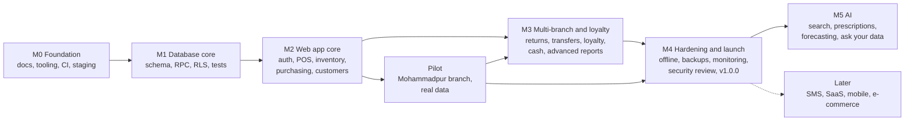
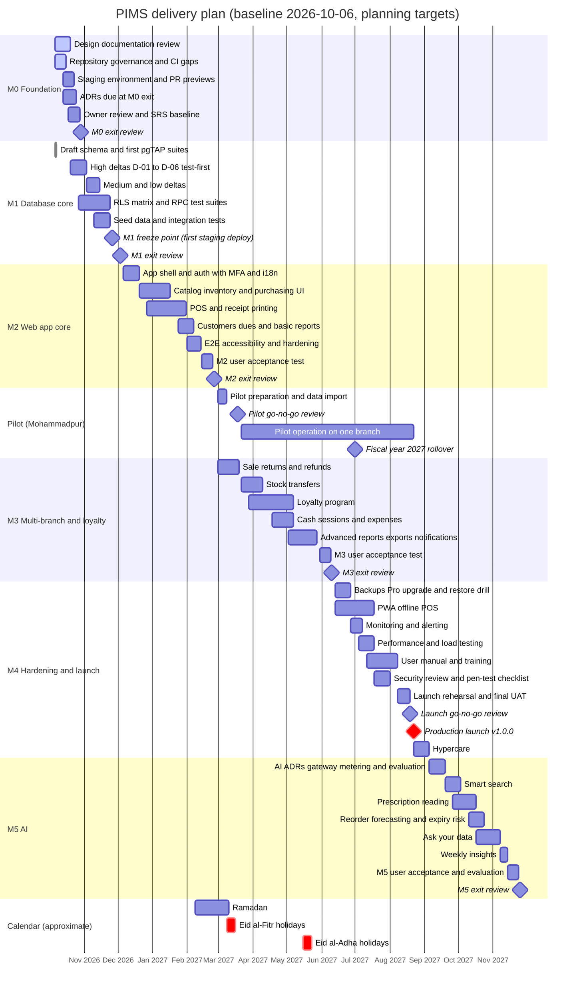

# PIMS Roadmap

Milestones, deliverables, exit criteria, dependencies and target dates for the Pharmacy Inventory
Management System (PIMS), from the foundation milestone M0 to the AI milestone M5 and beyond.

| Field             | Value                                                                                        |
| ----------------- | -------------------------------------------------------------------------------------------- |
| Document ID       | PIMS-RMP-001                                                                                 |
| Version           | 1.1                                                                                          |
| Status            | Draft for M0 review                                                                          |
| Owner             | Engineering lead                                                                             |
| Approver          | Product owner (pharmacy owner)                                                               |
| Planning baseline | 2026-10-06                                                                                   |
| Last updated      | 2026-10-06                                                                                   |
| Review cadence    | At every milestone exit review, and at least monthly while a milestone is in progress        |
| Change control    | Pull request approved by the Owner; date changes of more than two weeks re-baseline the plan |

## Contents

1. [Purpose and canonical ownership](#1-purpose-and-canonical-ownership)
2. [Planning assumptions](#2-planning-assumptions)
3. [Milestone overview](#3-milestone-overview)
4. [Timeline](#4-timeline)
5. [Milestones in detail](#5-milestones-in-detail)
6. [Requirement-to-milestone mapping](#6-requirement-to-milestone-mapping)
7. [Owner decisions needed by milestone](#7-owner-decisions-needed-by-milestone)
8. [Milestone governance](#8-milestone-governance)
9. [Schedule risks](#9-schedule-risks)
10. [Roadmap decisions and open issues](#10-roadmap-decisions-and-open-issues)
11. [Revision history](#11-revision-history)

---

## 1. Purpose and canonical ownership

This roadmap is the **canonical source** for milestones: their goals, deliverables, exit criteria,
dependencies, sequencing and target dates. It deliberately does not restate requirements or design:

| Topic                                                   | Canonical document                                                                                          |
| ------------------------------------------------------- | ----------------------------------------------------------------------------------------------------------- |
| What the system must do; requirement IDs and priorities | [SRS](requirements/SRS.md) (`FR-*`, `NFR-*`, open decisions `OD-*`, parameters `CFG-*`)                     |
| Which milestone each requirement targets                | SRS, column "MS" of every requirement table; summarized in [section 6](#6-requirement-to-milestone-mapping) |
| Structure, environments, delivery pipeline              | [Architecture](architecture/architecture.md)                                                                |
| Tables, functions, migration deltas                     | [Database design](database/database-design.md)                                                              |
| Roles, permissions, security gaps                       | [Security model](security/security-model.md)                                                                |
| Definition of Done, release process, versioning         | [Engineering standards](engineering/engineering-standards.md)                                               |
| Test levels and gates                                   | [Testing strategy](engineering/testing-strategy.md)                                                         |
| Deployment, backup, restore and incident procedures     | [Runbook](operations/runbook.md)                                                                            |

Where this roadmap cites an ID (for example FR-POS-030, OD-21, D-01, SEC-GAP-04), the owning document
defines it. Terms follow the [glossary](glossary.md).

## 2. Planning assumptions

| ID    | Assumption                                                                                                                                                                                                                                                                             |
| ----- | -------------------------------------------------------------------------------------------------------------------------------------------------------------------------------------------------------------------------------------------------------------------------------------- |
| PA-01 | **Team:** one full-time engineer (the constraint recorded in [ADR-0002](adr/0002-supabase-postgresql-over-firebase.md)), working Sunday to Thursday, with the Owner as product owner. A second engineer would shorten M2 to M4 but is not assumed.                                     |
| PA-02 | **Owner availability:** reviews and decisions within 3 business days of a request; the Owner, one Branch Manager and one Salesman are available for user acceptance testing (UAT) at the end of M2 to M5 (SRS 4.5).                                                                    |
| PA-03 | **Estimates are planning targets, not commitments.** Each milestone's duration includes design review, tests, documentation and the Definition of Done. Dates are re-baselined at every exit review.                                                                                   |
| PA-04 | **Calendar:** Bangladesh public holidays are absorbed in the durations. The Ramadan and Eid windows shown in the chart are approximate (they depend on moon sighting) and are corrected when the government gazette is published. No go-live, launch or UAT is planned in an Eid week. |
| PA-05 | **Scope rule:** Must requirements of a milestone gate its exit; Should requirements may slip to the next milestone only with a recorded Owner decision; Could requirements are delivered as capacity allows (SRS 1.5).                                                                 |
| PA-06 | **Cost:** free tiers until the production launch (constraint C-09), except where an exit criterion requires a paid service and the Owner approves it.                                                                                                                                  |
| PA-07 | **No real pharmacy data without a tested backup.** Real data enters PIMS for the first time at the pilot go-live, and only after the nightly encrypted backup runs and one restore into staging has succeeded (see [decision RD-02](#101-roadmap-decisions)).                          |
| PA-08 | **Continuous delivery inside milestones:** accepted work is released with semantic-version tags as it is ready; a milestone ends with a release tag and an exit review, not with a single "big bang" deployment.                                                                       |

## 3. Milestone overview

| Milestone | Theme                               | Target start | Target exit                     | Closing release (indicative) | SRS scope (FR / NFR) | Status                                    |
| --------- | ----------------------------------- | ------------ | ------------------------------- | ---------------------------- | -------------------- | ----------------------------------------- |
| M0        | Foundation                          | 2026-10-06   | 2026-10-29                      | `v0.1.0`                     | 0 / 5                | **In progress**                           |
| M1        | Database core                       | 2026-10-20   | 2026-12-03                      | `v0.2.0`                     | 59 / 22              | Started early (draft schema under review) |
| M2        | Web application core                | 2026-12-06   | 2027-02-25                      | `v0.3.0`                     | 98 / 36              | Planned                                   |
| Pilot     | Live use at the Mohammadpur branch  | 2027-03-21   | Becomes production at M4 launch | Every tag from `v0.3.x`      | n/a                  | Planned                                   |
| M3        | Multi-branch operations and loyalty | 2027-02-28   | 2027-06-10                      | `v0.4.0`                     | 124 / 8              | Planned                                   |
| M4        | Hardening, operations and launch    | 2027-06-13   | 2027-08-22 (production launch)  | `v1.0.0`                     | 19 / 39              | Planned                                   |
| M5        | AI features                         | 2027-09-05   | 2027-11-25                      | `v1.1.0`                     | 29 / 1               | Planned                                   |
| Later     | SMS, SaaS, mobile app, e-commerce   | Unscheduled  | n/a                             | n/a                          | 4 / 1                | Backlog                                   |

The SRS scope column counts requirements by target milestone as published in
[SRS Appendix D](requirements/SRS.md#appendix-d-requirement-statistics) (SRS 0.1.0); the SRS is
authoritative and the counts change when requirements change. `v1.0.0` marks the production launch as
required by the [engineering standards](engineering/engineering-standards.md) (section 20.1); the other
versions are indicative because intermediate releases are allowed.

**Release labels.** The informal labels used in conversations map to milestones as defined in SRS 1.2:

| Label | Content                                                                                                    | Milestones                |
| ----- | ---------------------------------------------------------------------------------------------------------- | ------------------------- |
| v1    | Must and Should requirements of M1 to M4; production launch                                                | M1 to M4                  |
| v2    | PWA offline sales (planned in M4, may ship shortly after the launch) and SMS through a Bangladeshi gateway | M4 (offline), Later (SMS) |
| v3    | AI features                                                                                                | M5                        |

**Dependency chain.** Each arrow is a hard dependency: the target cannot exit before the source has
exited (or, for the pilot, gone live).

## 4. Timeline

The chart starts at the planning baseline, 2026-10-06. Bars are calendar spans, so a bar that crosses an
Eid window includes the holiday. Workstreams inside a milestone overlap because they share one engineer
in sequence of priority, not in parallel at full speed.

Key dates:

| Date       | Event                                                                                    |
| ---------- | ---------------------------------------------------------------------------------------- |
| 2026-10-29 | M0 exit review; SRS baseline approved                                                    |
| 2026-11-26 | M1 freeze point: M1 migrations first applied to staging; afterwards only new migrations  |
| 2026-12-03 | M1 exit review                                                                           |
| 2027-02-25 | M2 exit review after UAT (UAT falls in Ramadan; sessions are held in the morning)        |
| 2027-03-18 | Pilot go/no-go review, after the Eid al-Fitr holidays                                    |
| 2027-03-21 | Pilot go-live at the Mohammadpur branch (Sunday)                                         |
| 2027-06-10 | M3 exit review, after the Eid al-Adha holidays                                           |
| 2027-07-01 | Start of FY 2027: first live fiscal-year rollover of document series (`MPR-2027-000001`) |
| 2027-08-19 | Launch go/no-go review                                                                   |
| 2027-08-22 | Production launch `v1.0.0` (Sunday, deployment window 01:00 to 06:00 Asia/Dhaka)         |
| 2027-11-25 | M5 exit review                                                                           |

---

## 5. Milestones in detail

Each milestone lists its goal, deliverables (`Mn-Dk`), exit criteria (`Mn-Xk`) and dependencies.
Deliverables name the canonical document or ID that specifies them; they do not redefine it.

### 5.1 M0 Foundation

**Target:** 2026-10-06 to 2026-10-29. **Status:** in progress.

**Goal.** A reviewed design baseline and a working delivery pipeline, so that every M1 change lands on a
protected `main` through green CI, in environments that exist.

| ID    | Deliverable                                                                                                                                                                                                                                                                                  | State at baseline                                                                                         |
| ----- | -------------------------------------------------------------------------------------------------------------------------------------------------------------------------------------------------------------------------------------------------------------------------------------------- | --------------------------------------------------------------------------------------------------------- |
| M0-D1 | Documentation set: SRS, architecture, database design, security model, engineering standards, testing strategy, runbook, ADR-0001 to ADR-0008, glossary, this roadmap, root README, CONTRIBUTING, SECURITY (index: [docs/README.md](README.md))                                              | Drafted; all in review                                                                                    |
| M0-D2 | Repository tooling: TypeScript strict, ESLint (flat config, jsx-a11y), Prettier, Vitest with coverage, Playwright, Husky with lint-staged and commitlint, `.editorconfig`, `.nvmrc`, `engine-strict`                                                                                         | Done                                                                                                      |
| M0-D3 | CI: `ci.yml` (quality, database with pgTAP, e2e, gitleaks, dependency review), `codeql.yml`, Dependabot                                                                                                                                                                                      | Done; the CodeQL licence question for a private repository is open (architecture OI-04)                   |
| M0-D4 | Repository governance: branch protection and required checks on `main` (ENG-03), pull request template sections (ENG-01, resolved in the template), `CHANGELOG.md` (ENG-02), commitlint scope `adr` (ENG-09), secret-scanning push protection and allowed-actions setting (SEC-GAP-19, part) | Open                                                                                                      |
| M0-D5 | Environments: local stack (Supabase CLI), `pims-staging` Supabase project in Singapore, Cloudflare Pages project with PR previews and the staging alias, GitHub Environments `staging` and `production` with a required reviewer, Sentry project                                             | Local done; others open. `pims-prod` is created at pilot preparation, see [RD-03](#101-roadmap-decisions) |
| M0-D6 | ADRs due at M0 exit ([ADR backlog](adr/README.md#8-decision-backlog)): testing stack; trunk-based development, Conventional Commits, semantic versioning and CI; static analysis on a private repository                                                                                     | Open                                                                                                      |
| M0-D7 | Owner review: SRS approval (becomes the requirements baseline); decisions needed by M1 (section 7) resolved or defaults accepted                                                                                                                                                             | Open                                                                                                      |
| M0-D8 | Account ownership: Supabase, Cloudflare, GitHub, Sentry and domain accounts registered to a business email, with TOTP, and the Owner holding administrator access to each (reduces risk R-08)                                                                                                | Open                                                                                                      |

**Exit criteria**

| ID    | Criterion                                                                                                                                                                                      |
| ----- | ---------------------------------------------------------------------------------------------------------------------------------------------------------------------------------------------- |
| M0-X1 | The five M0 requirements are verified: NFR-MAINT-001, NFR-MAINT-006, NFR-MAINT-007, NFR-SEC-006 and NFR-SEC-016.                                                                               |
| M0-X2 | The SRS approval table records the Owner's and the lead engineer's approval; every other document listed in M0-D1 has been reviewed and its review comments resolved or logged as open issues. |
| M0-X3 | `main` is protected: a pull request cannot merge unless every required check is green and a review is approved.                                                                                |
| M0-X4 | A pull request produces a Cloudflare Pages preview URL; `pims-staging` exists in Singapore; the GitHub Environments exist with protection rules.                                               |
| M0-X5 | A person who has not set up the project before reaches a running application and green `pnpm check` within 30 minutes by following [CONTRIBUTING.md](../CONTRIBUTING.md) (NFR-MAINT-006).      |
| M0-X6 | The ADRs listed in M0-D6 are Accepted.                                                                                                                                                         |
| M0-X7 | `v0.1.0` is tagged with its `CHANGELOG.md` entry.                                                                                                                                              |

**Dependencies.** Owner time for the SRS review (PA-02). Account creation and any payment method needed
for the domain name. The CodeQL decision depends on the GitHub plan (architecture OI-04).

### 5.2 M1 Database core

**Target:** 2026-10-20 to 2026-12-03 (overlaps the end of M0). **Status:** started early.

**Goal.** A complete, secure and tested database for the core flows (tenancy, roles, catalog, inventory
ledger with FEFO, purchasing, sales, customers and dues, audit), so that the M2 user interface only
composes existing RPCs and never implements business rules itself.

**Current state.** Seven migrations under `supabase/migrations/` and 13 pgTAP files with 1,488
assertions under `supabase/tests/database/` (as of commit `32d65ba`: test helpers, platform guards,
tenancy, purchase-to-sale flow, five regression suites, `dblink` concurrency interleavings, the RLS and
privilege matrix, and area suites for inventory, purchasing, loyalty and sales edge cases) were written
ahead of plan; renaming them into the prefix scheme of the testing strategy (section 5.1) is TST-05. The
[database design](database/database-design.md) (section 21) lists the implementation deltas against the
first migrations (D-01 to D-28; High: D-01 to D-06, D-24 and D-27), part of which commit `32d65ba` already
resolved, and the [security model](security/security-model.md) (section 22) lists the related gaps. Until the M1 freeze point these are folded into the existing files;
afterwards each change is a new migration.

| ID     | Deliverable                                                                                                                                                                                                                     |
| ------ | ------------------------------------------------------------------------------------------------------------------------------------------------------------------------------------------------------------------------------- |
| M1-D1  | High deltas D-01 to D-06 and D-24 fixed test-first: a failing pgTAP test per delta, then the fix.                                                                                                                               |
| M1-D2  | Medium deltas D-07 to D-16 fixed; Low deltas D-17 to D-23 fixed or re-targeted to the milestone that needs them, with the new target recorded in database design section 21; D-25 to D-28 follow the milestones recorded there. |
| M1-D3  | Database-level security gaps closed: SEC-GAP-01, -02, -03, -05, -06, -09, -13, -14, -16 and -17 (security model section 22).                                                                                                    |
| M1-D4  | RLS isolation matrix for every table, role and operation, including cross-organization and cross-branch cases, and extended platform guards ([testing strategy](engineering/testing-strategy.md) section 6).                    |
| M1-D5  | pgTAP suites for every M1 RPC, including concurrency tests for FEFO allocation, gapless numbering and idempotent replay.                                                                                                        |
| M1-D6  | Development seed `supabase/seed.sql` with the accounts documented in CONTRIBUTING.md, plus test factories.                                                                                                                      |
| M1-D7  | Integration test harness (Vitest with supabase-js) and the requirement traceability script and CI report (SRS 4.3).                                                                                                             |
| M1-D8  | CI additions: migration linting with squawk, type-drift check (`pnpm gen:types` produces no diff), generated `src/lib/database.types.ts` committed.                                                                             |
| M1-D9  | `deploy.yml` applying migrations to staging on merge to `main`; first application to staging is the **M1 freeze point** (target 2026-11-26).                                                                                    |
| M1-D10 | Naming and fiscal-year alignment closed across documents: architecture OI-01 and OI-02, database design DB-OI-01 and DB-OI-02.                                                                                                  |

**Exit criteria**

| ID    | Criterion                                                                                                                                                                                                                                                                           |
| ----- | ----------------------------------------------------------------------------------------------------------------------------------------------------------------------------------------------------------------------------------------------------------------------------------- |
| M1-X1 | Every Must requirement targeting M0 or M1 is verified; the traceability report shows none without a test or a recorded alternative verification method.                                                                                                                             |
| M1-X2 | Every RPC and every RLS policy has pgTAP tests; the isolation matrix passes for Owner, Branch Manager and Salesman (AAL1 and AAL2 variants), an authenticated non-member, a deactivated member, the Owner of another tenant and `anon` (Accountant and Auditor are added in M4-D6). |
| M1-X3 | No High delta (except D-27, due with M4-D6) and no database-level security gap from M1-D3 remains open.                                                                                                                                                                             |
| M1-X4 | Migrations apply from scratch in CI and incrementally on staging; `supabase db lint` reports no warnings; squawk and the type-drift check pass.                                                                                                                                     |
| M1-X5 | The integrity checks (gapless numbering, ledger equals projection, controlled-drug register balance) run and pass on the seed data.                                                                                                                                                 |
| M1-X6 | The Owner has decided OD-14, OD-15 and OD-24 or accepted their defaults, and the invoice number format matches FR-POS-030 (`MPR-2026-000123`).                                                                                                                                      |
| M1-X7 | A release tag closes the milestone.                                                                                                                                                                                                                                                 |

**Dependencies.** M0-X3 (protected `main`) and M0-X4 (staging). Owner decisions OD-14, OD-15, OD-24.

### 5.3 M2 Web application core

**Target:** 2026-12-06 to 2027-02-25. **Status:** planned.

**Goal.** Staff can run one branch end to end in the browser, in English or Bangla: sign in with MFA,
receive goods, sell at the counter, manage customers and dues, see basic reports and print receipts.

| ID     | Deliverable                                                                                                                                                                                                                                                          |
| ------ | -------------------------------------------------------------------------------------------------------------------------------------------------------------------------------------------------------------------------------------------------------------------- |
| M2-D1  | Application foundation: routing, layout, sign-in, TOTP enrolment and verification, idle lock (CFG-31), active-branch selection, English and Bangla resources, `Result` and `AppError` handling with the RPC wrapper (ENG-06), module-boundary lint rules (ENG-05).   |
| M2-D2  | Observability and headers: Sentry with hidden source maps (architecture OI-03, SEC-GAP-10), per-environment CSP with violation reporting (SEC-GAP-11).                                                                                                               |
| M2-D3  | Administration: organization settings, branches, users and invitations through the `admin-users` Edge Function, approval requests and decisions (SEC-GAP-04).                                                                                                        |
| M2-D4  | UX specification for the POS: wireframes and the final keyboard map (SRS Appendix C), reviewed with a Salesman before the POS is built.                                                                                                                              |
| M2-D5  | Catalog screens and CSV/XLSX import with a dry-run report; internal barcode and shelf labels.                                                                                                                                                                        |
| M2-D6  | Inventory screens: stock by medicine and lot, quarantine, adjustments, blind stock counts, expiry (30, 60, 90 days) and low-stock lists.                                                                                                                             |
| M2-D7  | Purchasing: suppliers, purchase orders, goods receipt, supplier invoices and payments, supplier dues.                                                                                                                                                                |
| M2-D8  | POS: search by brand, generic, barcode and fuzzy name; cart with pack units; discounts within role limits; split payments (Cash, bKash, Nagad, Rocket, Card, Credit); held bills; void with approval; controlled-drug sale capture; receipts on 58 mm, 80 mm and A4. |
| M2-D9  | Customers and dues: profiles, credit limits, collections, statements and purchase history.                                                                                                                                                                           |
| M2-D10 | Basic reports and the Owner dashboard as targeted to M2 in the SRS (FR-RPT).                                                                                                                                                                                         |
| M2-D11 | End-to-end tests for sign-in with MFA, sale (cash, MFS, credit), void with approval and goods receipt, with axe accessibility checks; the `e2e` CI job runs against a local Supabase stack.                                                                          |
| M2-D12 | Pilot readiness kit: import templates for catalog, opening stock, customers with dues and supplier dues (assumption A-05); a Bangla quick guide for counter staff; the pilot fallback procedure in the runbook.                                                      |
| M2-D13 | Bundle-size report in CI as a non-blocking check (decision [RD-01](#101-roadmap-decisions)).                                                                                                                                                                         |

**Exit criteria**

| ID    | Criterion                                                                                                                                                                                |
| ----- | ---------------------------------------------------------------------------------------------------------------------------------------------------------------------------------------- |
| M2-X1 | Every Must requirement targeting M0 to M2 is verified; rules enforced in the database in M1 are re-verified end to end where the SRS marks them "M1 (DB), M2 (UI)" (SRS 4.4).            |
| M2-X2 | The M2-D11 journeys are green in CI; axe reports no serious or critical violations on the tested screens.                                                                                |
| M2-X3 | On staging, with a seeded catalog of 30,000 medicines, POS search is under 200 ms p95 server time and `create_sale` under 500 ms p95 (NFR-PERF-001, NFR-PERF-002; full load test in M4). |
| M2-X4 | A thermal receipt prints correctly on the Mohammadpur counter printer in English and Bangla (demonstration).                                                                             |
| M2-X5 | UAT on staging is signed off by the Owner with no open Blocker or Major defect (SRS 4.5).                                                                                                |
| M2-X6 | Owner decisions needed by M2 (section 7) are recorded, including OD-28, acceptance of hosting in Singapore, which is required before real data is loaded.                                |

**Dependencies.** M1 exit. An SMTP provider configured in Supabase Auth for invitation and reset e-mails.
Access to one counter PC, barcode scanner and thermal printer of the type used in the shop (OE-03, A-10).

### 5.4 Pilot at the Mohammadpur branch

**Target:** preparation from 2027-02-28, go/no-go review on 2027-03-18, go-live on 2027-03-21, operation
until the production launch, when the pilot environment simply becomes production.

**Goal.** Validate PIMS with real transactions at one branch before more branches and the formal launch,
and measure the real workload (architecture OI-07, database design DB-OI-04).

**Entry criteria (go/no-go on 2027-03-18)**

| ID    | Criterion                                                                                                                                                                |
| ----- | ------------------------------------------------------------------------------------------------------------------------------------------------------------------------ |
| PL-E1 | M2 accepted (M2-X5) and OD-28 recorded.                                                                                                                                  |
| PL-E2 | `pims-prod` created in Singapore with the production configuration baseline (SEC-GAP-07) and no data other than the organization's own.                                  |
| PL-E3 | The nightly encrypted backup job runs against `pims-prod`, and one backup has been restored into staging with the integrity checks passing (PA-07).                      |
| PL-E4 | Catalog, opening stock (counted, not copied from old records), customers with dues and supplier dues imported and reconciled with the Owner, using the M2-D12 templates. |
| PL-E5 | Sale returns (M3-D1) released, so that the pilot does not need a paper return process.                                                                                   |
| PL-E6 | Counter staff and the Branch Manager trained; each has an individual account; MFA enrolled for the Owner and the Branch Manager.                                         |
| PL-E7 | The fallback procedure (pre-numbered paper invoices during an outage, entered after recovery) is printed and kept at the counter.                                        |

**During the pilot.** A weekly 30-minute review with the Owner; defects triaged within one business day;
M3 deliverables released to the pilot as each one is accepted; daily integrity checks monitored. The
pilot crosses the start of FY 2027 on 2027-07-01, which exercises the fiscal-year rollover of every
document series (FR-POS-030) under real conditions.

**Exit.** The pilot ends at the M4 launch (M4-X8). It is stopped and rolled back to the old paper process
only on the Owner's decision after a SEV-1 incident or an unreconciled stock or cash difference that
cannot be explained within two business days.

### 5.5 M3 Multi-branch operations and loyalty

**Target:** 2027-02-28 to 2027-06-10. **Status:** planned.

**Goal.** Run several branches as one business and launch the loyalty card program, with the controls
(returns, cash sessions, approvals, reports) that a growing pharmacy needs.

| ID    | Deliverable                                                                                                                                                                                                                                                                                                                                          |
| ----- | ---------------------------------------------------------------------------------------------------------------------------------------------------------------------------------------------------------------------------------------------------------------------------------------------------------------------------------------------------- |
| M3-D1 | Sale returns and refunds against the original invoice, with credit notes and approvals; scheduled first so that it is live for the pilot go-live (PL-E5).                                                                                                                                                                                            |
| M3-D2 | Stock transfers between branches: request, dispatch by lot, in transit, receive, reject, cancel and recall, including controlled-drug register entries at both branches.                                                                                                                                                                             |
| M3-D3 | Loyalty card program: plans (3-month and 6-month seeded, any duration), enrollment and renewal with fee (which may be ৳0), cards with QR and Code 128, lookup by card or phone, discount and points at the POS, exclusions, in-app expiry reminders, abuse rules R1 to R7 with exceptions, loyalty reports. Every rule is configuration (SRS 3.3.8). |
| M3-D4 | Cash sessions (opening float, closing count, variance) and branch expenses with approval limits; remote approvals from the approver's own session (security model 6.5).                                                                                                                                                                              |
| M3-D5 | Advanced reports: profit on batch cost, slow and fast movers, branch comparison, supplier and customer dues ageing, loyalty reports, full controlled-drug register, exceptions report; exports to CSV, XLSX and PDF.                                                                                                                                 |
| M3-D6 | In-app notifications: expiry, low stock, loyalty expiry, pending transfers and the daily digest (CFG-26).                                                                                                                                                                                                                                            |
| M3-D7 | End-to-end tests for return, transfer, loyalty enrollment and loyalty application.                                                                                                                                                                                                                                                                   |

**Exit criteria**

| ID    | Criterion                                                                                                                                          |
| ----- | -------------------------------------------------------------------------------------------------------------------------------------------------- |
| M3-X1 | Every Must requirement targeting M0 to M3 is verified.                                                                                             |
| M3-X2 | The M3-D7 journeys are green in CI.                                                                                                                |
| M3-X3 | A second branch is configured on staging, by configuration only and in 30 minutes or less, and completes a transfer with the first branch (BO-07). |
| M3-X4 | UAT is signed off with no open Blocker or Major defect.                                                                                            |
| M3-X5 | Loyalty decisions OD-01 to OD-13 and decisions OD-17, OD-20 and OD-23 are recorded or their defaults accepted before the M3 UAT.                   |
| M3-X6 | The pilot has run for at least eight weeks with all daily integrity checks green and no unexplained stock or cash difference.                      |

**Dependencies.** M2 exit; pilot feedback; Owner loyalty decisions. If the Owner chooses PVC loyalty
cards instead of the default printed slip (OD-11), a card printer or vendor with a confirmed lead time.

### 5.6 M4 Hardening, operations and launch

**Target:** 2027-06-13 to 2027-08-22 (production launch), followed by two weeks of hypercare.
**Status:** planned.

**Goal.** Make PIMS dependable enough to be the system of record for every branch: recoverable, observable,
fast under load, reviewed for security, documented for its users, and launched as `v1.0.0`.

| ID    | Deliverable                                                                                                                                                                                                                                                                                    |
| ----- | ---------------------------------------------------------------------------------------------------------------------------------------------------------------------------------------------------------------------------------------------------------------------------------------------- |
| M4-D1 | Backup and recovery: Owner decision on the production tier (OD-21; Supabase Pro at launch is recommended); managed daily backups or the continuing nightly dump; monthly offline copy; backup-failure alerts; first quarterly restore drill with measured RPO and RTO recorded in the runbook. |
| M4-D2 | PWA offline POS: installable PWA, terminal registration, IndexedDB outbox, idempotent replay and exception queue, within the scope of architecture section 15; preceded by its ADR.                                                                                                            |
| M4-D3 | Monitoring: uptime checks on the web app and the `health` Edge Function, Sentry and Supabase usage alerts, SLO tracking, audit-log hash chain (FR-AUD-008).                                                                                                                                    |
| M4-D4 | Performance: volume dataset (30,000 medicines, 10 branches, one year of sales), load tests at three times the reference peak (NFR-PERF-010), Lighthouse CI and blocking bundle budgets.                                                                                                        |
| M4-D5 | Security: pre-launch security review (security model 18.4), penetration-test checklist, DAST scan, SBOM, closure of every "before launch" gap, outcome of the legal review (OD-22), privacy notice in English and Bangla (NFR-PRIV-009).                                                       |
| M4-D6 | Accountant and Auditor roles (security model 6.1), after the `sales.view` predicate on customer-linked tables (database design delta D-27); isolation matrix extended to Accountant and Auditor, including their AAL1 variants.                                                                |
| M4-D7 | User manual in English and Bangla, counter quick-reference cards, training for every live branch; runbook completed with the incident playbooks required by the security model (17.3).                                                                                                         |
| M4-D8 | Launch: rehearsal on staging, go/no-go review on 2027-08-19, production release `v1.0.0` on 2027-08-22 in the 01:00 to 06:00 window, then two weeks of hypercare with daily check-ins.                                                                                                         |

**Exit criteria**

| ID    | Criterion                                                                                                                                                                                                |
| ----- | -------------------------------------------------------------------------------------------------------------------------------------------------------------------------------------------------------- |
| M4-X1 | Every Must requirement targeting M0 to M4 is verified; from this release the traceability check is blocking (SRS 4.3); the isolation matrix passes for all five roles, including Accountant and Auditor. |
| M4-X2 | A restore drill has restored production backups into staging within the RTO of 4 hours and the applicable RPO (NFR-BACKUP-001 or NFR-BACKUP-002), with the result in the runbook log.                    |
| M4-X3 | Load test results meet the performance budgets of the SRS (NFR-PERF) at three times the reference peak.                                                                                                  |
| M4-X4 | The security review is passed: no open Critical or High finding, all "before launch" gaps closed, the ASVS Level 2 checklist completed with deviations accepted by the Owner.                            |
| M4-X5 | Monitoring and alerting are live; availability during business hours was at least 99.5 % over the last four weeks of the pilot (NFR-AVAIL-001).                                                          |
| M4-X6 | The user manual and the privacy notice are published in English and Bangla, and the staff of every live branch are trained.                                                                              |
| M4-X7 | Offline sales (Should, FR-POS-055 to FR-POS-059 except the Must rule FR-POS-057) are released, or their slip to a post-launch `v1.x` release is recorded as an Owner decision (v2 label).                |
| M4-X8 | The Owner's written launch approval is recorded and `v1.0.0` is tagged and deployed.                                                                                                                     |

**Dependencies.** M3 exit and the pilot. OD-21 (production tier and its monthly cost, about USD 25 to 30
for one to three branches per architecture section 20) and OD-22 (legal review, needed before the
launch).

### 5.7 M5 AI features

**Target:** 2027-09-05 to 2027-11-25. **Status:** planned.

**Goal.** Assistive AI that saves the Owner and the counter time and reduces expiry losses, without
giving medical advice, writing data, exposing personal data or exceeding the budget.

| ID    | Deliverable                                                                                                                                                                                                 |
| ----- | ----------------------------------------------------------------------------------------------------------------------------------------------------------------------------------------------------------- |
| M5-D1 | ADRs before implementation: AI gateway with read-only, row-level-secured data access; AI provider data-handling terms and retention (FR-AI-028) ([ADR backlog](adr/README.md#8-decision-backlog)).          |
| M5-D2 | `ai-gateway` Edge Function: authorization, per-organization and per-feature switches (off by default, CFG-29), monthly budget (CFG-30), metering, personal-data minimization, logging, kill switch.         |
| M5-D3 | Evaluation harness and sets for every feature, including safety cases (no dosing or medical advice, no writes, prompt injection) with pass thresholds recorded in the AI ADR before any feature is enabled. |
| M5-D4 | Smart search from symptoms or generic names to in-stock brands.                                                                                                                                             |
| M5-D5 | Prescription reading that proposes cart lines which a pharmacist must confirm line by line.                                                                                                                 |
| M5-D6 | Reorder forecasting and expiry-risk detection, as suggestions only.                                                                                                                                         |
| M5-D7 | Ask your data for the Owner through the `ai_reader` role on allow-listed reporting views, with validated, read-only SQL.                                                                                    |
| M5-D8 | Weekly business insight summaries (CFG-33).                                                                                                                                                                 |

**Exit criteria**

| ID    | Criterion                                                                                                               |
| ----- | ----------------------------------------------------------------------------------------------------------------------- |
| M5-X1 | Every Must requirement of FR-AI is verified, including the safety constraints (SRS 3.3.15.3).                           |
| M5-X2 | Every feature meets the thresholds of its evaluation set; any safety violation blocks that feature.                     |
| M5-X3 | Tests prove that the AI path cannot read outside the requesting user's organization and branches and cannot write data. |
| M5-X4 | Metered AI cost reconciles with the provider's usage report and stays within the configured budget during UAT.          |
| M5-X5 | UAT is signed off; the Owner enables each feature individually (OD-26, OD-27).                                          |

**Dependencies.** M4 exit. Owner approval of the AI budget (OD-26) and of the provider's data-handling
terms. Anthropic API account held by the business. Core functions must keep working when the AI provider
is unavailable (NFR-AVAIL-003).

### 5.8 Later

Not scheduled. Each item is scheduled through a roadmap change when its trigger occurs. The design
already makes room for each one (SRS section 5).

| Item                                                 | Trigger to schedule                                | Provision already in the design                                                |
| ---------------------------------------------------- | -------------------------------------------------- | ------------------------------------------------------------------------------ |
| SMS reminders through a Bangladeshi SMS gateway (v2) | Owner decision OD-03 and a gateway contract        | Marketing consent flag (FR-CUS-015), notification types, Edge Function pattern |
| SaaS onboarding and billing for other pharmacies     | Decision to sell PIMS to other pharmacies          | Multi-tenancy from M1, FR-ORG-012, per-organization export                     |
| Per-organization restore                             | First external tenant                              | FR-BKP-009 design note; organization export (FR-BKP-007)                       |
| Native mobile application                            | Needs the installable PWA cannot meet              | Same API, RLS and RPCs                                                         |
| E-commerce, online ordering and home delivery        | Owner decision                                     | Catalog and ledger reusable by another sales channel; customer address         |
| Supplier EDI and government reporting integrations   | Availability of a supplier or government interface | Exportable purchase orders, controlled-drug register and VAT reports           |
| Supabase Realtime for notifications                  | Polling every 60 seconds proves insufficient       | Architecture section 5.1                                                       |
| Monthly partitioning of large tables                 | Scalability stage S3 (architecture section 19)     | Partition-ready keys (database design section 14)                              |

---

## 6. Requirement-to-milestone mapping

Every SRS requirement has exactly one target milestone, the first milestone in which it is verifiable
(SRS 1.5 and 4.4). Requirements whose database part ships in M1 and whose screen ships later (for
example voids, "M1 (DB), M2 (UI)", and returns, "M1 (DB), M3 (UI)") count under M1 and are verified
again when their screens arrive (SRS 4.4). The roadmap does not assign requirements; it groups them into the deliverables above.
The tables below summarize SRS 0.3.0 and must be regenerated when the SRS changes (the traceability script
of SRS 4.3 produces the same figures).

**Functional requirements by module and target milestone**

| Module                                | M1     | M2     | M3      | M4     | M5     | Later | Total   |
| ------------------------------------- | ------ | ------ | ------- | ------ | ------ | ----- | ------- |
| Organization and branches (FR-ORG)    | 6      | 3      | 2       | 0      | 0      | 1     | 12      |
| Users, roles, authentication (FR-IAM) | 4      | 11     | 1       | 2      | 0      | 0     | 18      |
| Catalog (FR-CAT)                      | 8      | 5      | 1       | 0      | 0      | 0     | 14      |
| Inventory (FR-INV)                    | 7      | 13     | 0       | 0      | 0      | 0     | 20      |
| Purchases (FR-PUR)                    | 6      | 8      | 7       | 0      | 0      | 0     | 21      |
| Sales and POS (FR-POS)                | 30     | 27     | 3       | 5      | 0      | 0     | 65      |
| Customers (FR-CUS)                    | 5      | 6      | 3       | 1      | 0      | 0     | 15      |
| Loyalty (FR-LOY)                      | 0      | 0      | 52      | 0      | 0      | 1     | 53      |
| Stock transfers (FR-TRF)              | 1      | 0      | 12      | 0      | 0      | 0     | 13      |
| Cash sessions and expenses (FR-CSH)   | 0      | 0      | 15      | 0      | 0      | 0     | 15      |
| Reports (FR-RPT)                      | 0      | 15     | 10      | 0      | 0      | 0     | 25      |
| Audit (FR-AUD)                        | 3      | 3      | 1       | 1      | 0      | 0     | 8       |
| Notifications (FR-NTF)                | 0      | 4      | 6       | 1      | 0      | 1     | 12      |
| Backup and export (FR-BKP)            | 0      | 0      | 0       | 8      | 0      | 1     | 9       |
| AI (FR-AI)                            | 0      | 0      | 0       | 0      | 29     | 0     | 29      |
| Controlled drugs (FR-CDR)             | 4      | 3      | 6       | 1      | 0      | 0     | 14      |
| **Total**                             | **74** | **98** | **119** | **19** | **29** | **4** | **343** |

**Non-functional requirements by target milestone** (SRS Appendix D): M0 5, M1 22, M2 36, M3 8, M4 39,
M5 1, Later 1; 112 in total. Most quality requirements are first verifiable in M2 (when the user
interface exists) or M4 (load, recovery, security review).

**Traceability chain.** GitHub milestones mirror this roadmap (`M0 Foundation` to `M5 AI`). Every issue
lists the requirement IDs it implements and belongs to the GitHub milestone of those requirements; every
pull request lists the IDs it changes; tests carry the IDs; the CI traceability report shows, for each
milestone, which Must and Should requirements are verified. That report is attached to the milestone's
release and reviewed at the exit review (SRS 4.3).

## 7. Owner decisions needed by milestone

Open decisions are defined, with their configured defaults, in SRS Appendix B and SRS 3.3.8.8. A
decision not taken by its milestone leaves the default in force (dependency D-07 of the SRS).

| Needed by       | Decisions                                                                                                                                                                                                     |
| --------------- | ------------------------------------------------------------------------------------------------------------------------------------------------------------------------------------------------------------- |
| M0              | Static analysis on a private repository: CodeQL licence or alternative (architecture OI-04)                                                                                                                   |
| M1              | OD-14 fiscal year start month; OD-15 rounding to the nearest taka; OD-24 VAT rate on medicines                                                                                                                |
| M2              | OD-16 discount limits; OD-18 who may dispense controlled drugs; OD-19 prescription validity and maximum quantities; OD-25 approval limits; OD-28 hosting in Singapore; OD-29 "prescription seen" confirmation |
| M3 (before UAT) | OD-01 to OD-13 loyalty program; OD-17 return policy; OD-20 prescription image retention; OD-23 mandatory cash session                                                                                         |
| M4              | OD-21 Supabase tier for production; OD-22 legal review (before the launch); architecture OI-05                                                                                                                |
| M5              | OD-26 AI enablement and budget; OD-27 weekly insight schedule; architecture OI-06 model per feature                                                                                                           |

## 8. Milestone governance

**Exit review.** Held on the target exit date, or earlier when the criteria are met. Participants: the
Owner and the engineering lead; a Branch Manager joins for M2 to M5. Inputs: the exit criteria checklist,
the traceability report, open defects by severity, the risk list and pending decisions. Outcome: one of
_accepted_, _accepted with conditions_ (each condition has an owner and a date) or _not accepted_ (a new
target date is set). The outcome is recorded in the GitHub release notes of the closing tag and in the
revision history of this document.

**Status reporting.** Every two weeks the engineering lead sends the Owner a short status: progress
against this plan, risks, and the decisions needed in the next two weeks with their defaults.

**Re-planning triggers.** The plan is re-baselined through a pull request when any of the following
occurs: a milestone is forecast to slip by more than two weeks; team capacity changes; the Owner changes
the scope of a Must requirement (which also re-baselines the SRS, SRS 4.6); or a production incident
requires more than one week of unplanned work.

**Scope protection.** New ideas go to the backlog with a proposed milestone; they enter a milestone in
progress only by replacing work of equal size, agreed by the Owner.

## 9. Schedule risks

Architecture risks are in [architecture section 22](architecture/architecture.md#22-risks-technical-debt-and-open-issues);
the risks below concern the schedule.

| ID     | Risk                                                                                      | Likelihood | Impact | Mitigation                                                                                                                       |
| ------ | ----------------------------------------------------------------------------------------- | ---------- | ------ | -------------------------------------------------------------------------------------------------------------------------------- |
| RMP-01 | Single engineer: illness or departure stops delivery (architecture R-08)                  | Medium     | High   | Documentation and ADRs kept current; managed services; automated tests; Owner holds all account access (M0-D8)                   |
| RMP-02 | M2 is the largest user-interface milestone (98 functional requirements) and slips         | High       | Medium | POS and goods receipt first; Should items deferred with Owner decisions; pilot date moves with M2, not the reverse               |
| RMP-03 | Owner decisions arrive late (loyalty, tier, legal review)                                 | Medium     | Medium | Every decision has a working default (SRS Appendix B); decisions requested two weeks before they are needed                      |
| RMP-04 | Data preparation for the pilot (catalog, opening stock, dues) takes longer than one week  | High       | Medium | Templates delivered in M2 (M2-D12); catalog import starts during M2 UAT; opening stock counted in sections over several evenings |
| RMP-05 | Ramadan and Eid reduce staff availability for UAT, training and go-live                   | High       | Low    | Morning UAT sessions; no go-live or launch in an Eid week (PA-04)                                                                |
| RMP-06 | Loyalty scope grows while decisions are pending                                           | Medium     | Medium | Everything is configuration with defaults; new loyalty ideas go to the backlog                                                   |
| RMP-07 | Offline mode is more complex than estimated                                               | Medium     | Medium | Narrow scope (architecture section 15); it is a Should, so the launch does not wait for it (M4-X7)                               |
| RMP-08 | Free-tier limits or pausing disrupt staging or the pilot                                  | Medium     | Medium | Weekly usage review; upgrade triggers (architecture section 20.3); Pro recommended at the launch                                 |
| RMP-09 | Counter hardware (printer drivers, scanner configuration) behaves differently in the shop | Medium     | Low    | Test on the shop's own hardware in M2 (M2-X4)                                                                                    |
| RMP-10 | Legal review (OD-22) requires changes to the controlled-drug register or retention        | Low        | High   | Configurable register fields (FR-CDR-014); review started in M3 so that findings land in M4                                      |

## 10. Roadmap decisions and open issues

### 10.1 Roadmap decisions

| ID    | Decision                                                                                                                                                                                            | Rationale                                                                                                                                          |
| ----- | --------------------------------------------------------------------------------------------------------------------------------------------------------------------------------------------------- | -------------------------------------------------------------------------------------------------------------------------------------------------- |
| RD-01 | The client bundle-size check (NFR-PERF-007) is introduced in M2 as a non-blocking CI report and becomes blocking in M4 together with Lighthouse CI. This closes engineering standards issue ENG-08. | Meets the Should requirement in M2 without blocking merges before real screens stabilize, matching the debt accepted in architecture section 22.2. |
| RD-02 | The nightly encrypted backup job and one restore test are pulled forward from M4 to the pilot entry (PL-E3). M4 keeps the production backup decision, monitoring and the formal quarterly drill.    | No real data without a tested backup (PA-07); the architecture makes the nightly backup mandatory while on the free tier (section 20.3).           |
| RD-03 | `pims-prod` is created at pilot preparation, not in M0.                                                                                                                                             | A Free-tier project pauses after one week of inactivity; an empty production project would pause repeatedly for five months.                       |
| RD-04 | Sale returns (M3-D1) are the first M3 deliverable and are released before the pilot go-live.                                                                                                        | A live branch cannot run without returns; voids (M2) cover only same-day cancellations.                                                            |
| RD-05 | The pilot runs on the production project and becomes production at the launch; there is no data migration between pilot and production.                                                             | Avoids a second data import and keeps the pilot's history, including the FY 2027 rollover.                                                         |

### 10.2 Open issues

| ID        | Issue                                                                                                                    | Owner            | Needed by  |
| --------- | ------------------------------------------------------------------------------------------------------------------------ | ---------------- | ---------- |
| RMP-OI-01 | Replace the approximate Ramadan and Eid dates with the gazetted dates when published                                     | Engineering lead | 2027-01-31 |
| RMP-OI-02 | Reflect RD-02 and RD-03 in the architecture (sections 10.1 and 20) and the runbook                                       | Engineering lead | M0 exit    |
| RMP-OI-03 | **Closed.** SRS NFR-PERF-007 and architecture section 22.2 reference RD-01; ENG-08 is closed in engineering standards 25 | Engineering lead | M0 exit    |
| RMP-OI-04 | Confirm the pilot dates and the go-live day of the week with the Owner and the Branch Manager (busy days at the counter) | Owner            | M2 exit    |
| RMP-OI-05 | Create the GitHub milestones `M0 Foundation` to `M5 AI` with the target dates of section 3                               | Engineering lead | M0 exit    |

## 11. Revision history

| Version | Date       | Author           | Change                                                                                                                                        |
| ------- | ---------- | ---------------- | --------------------------------------------------------------------------------------------------------------------------------------------- |
| 1.0     | 2026-10-06 | Engineering lead | First roadmap: milestones M0 to M5, pilot, Later items, timeline from the 2026-10-06 baseline                                                 |
| 1.1     | 2026-10-06 | Engineering lead | Section 6 regenerated from SRS 0.3.0; M1 current state at commit `32d65ba` (13 pgTAP files); RMP-OI-03 closed; M0-D1 and M0-D4 states updated |
