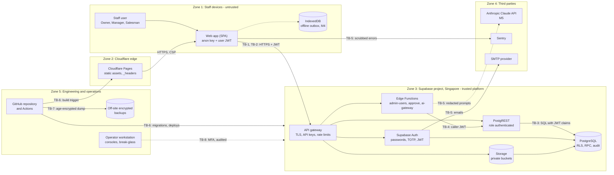
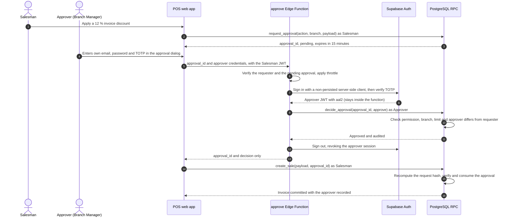
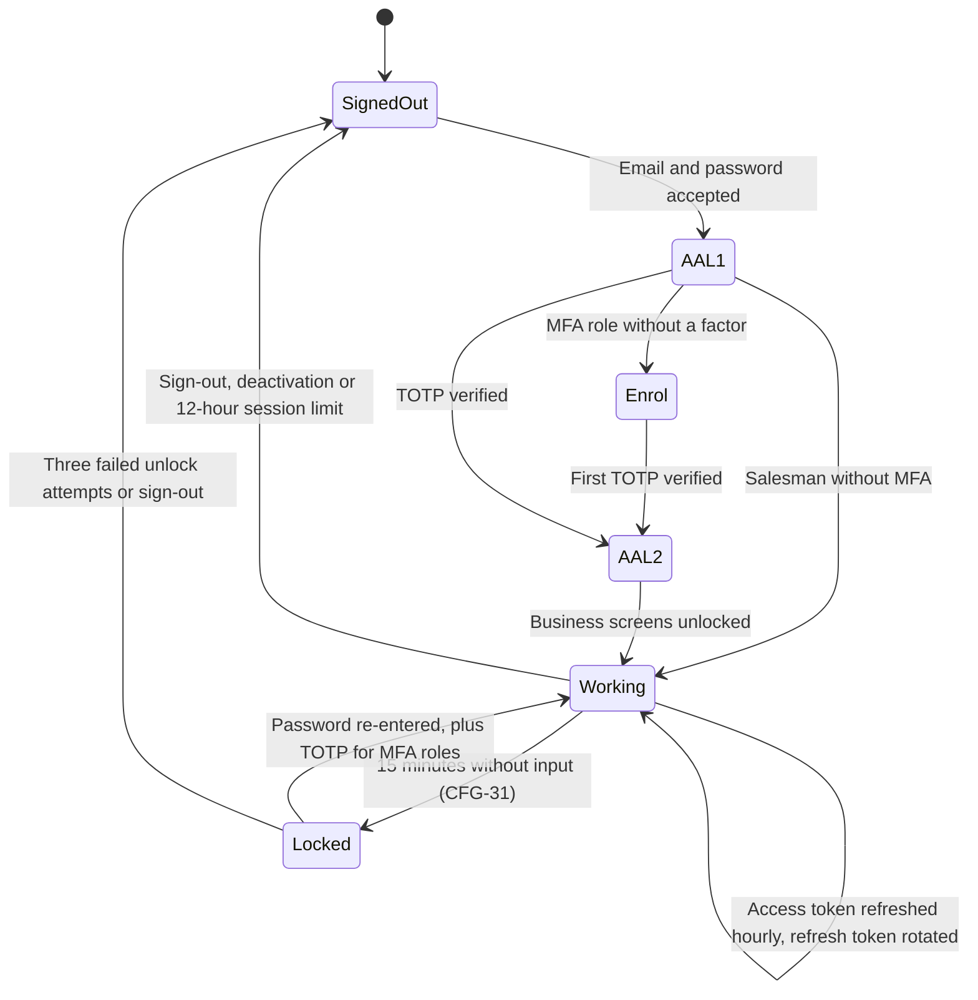
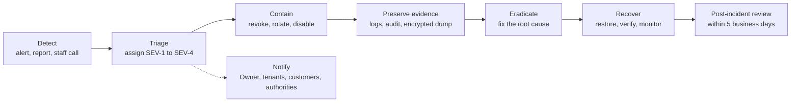

# PIMS Security Model

Security objectives, data classification, trust boundaries, threat model, the canonical role and
permission matrix, and the controls, tests and residual risks of the Pharmacy Inventory Management
System (PIMS).

| Field        | Value                                                                                      |
| ------------ | ------------------------------------------------------------------------------------------ |
| Document ID  | PIMS-SEC-001                                                                               |
| Version      | 1.2                                                                                        |
| Status       | Draft for M0 review                                                                        |
| Owner        | Engineering lead (security owner)                                                          |
| Approver     | Product owner (pharmacy owner)                                                             |
| Last updated | 2026-10-06                                                                                 |
| Applies to   | Milestones M0 to M5 (see [roadmap](../roadmap.md))                                         |
| Change rule  | Changes to the permission matrix or to a control marked "Must" need review by the approver |

## Table of contents

1. [Introduction](#1-introduction)
2. [Security objectives and principles](#2-security-objectives-and-principles)
3. [Assets and data classification](#3-assets-and-data-classification)
4. [Trust boundaries and data flows](#4-trust-boundaries-and-data-flows)
5. [Threat model (STRIDE)](#5-threat-model-stride)
6. [Roles and permissions (canonical)](#6-roles-and-permissions-canonical)
7. [Authentication](#7-authentication)
8. [Authorization](#8-authorization)
9. [Input validation and error handling](#9-input-validation-and-error-handling)
10. [Output encoding and browser security](#10-output-encoding-and-browser-security)
11. [Secrets management](#11-secrets-management)
12. [Supply-chain and CI/CD security](#12-supply-chain-and-cicd-security)
13. [Data protection and privacy](#13-data-protection-and-privacy)
14. [Audit logging and monitoring](#14-audit-logging-and-monitoring)
15. [AI-specific security (M5)](#15-ai-specific-security-m5)
16. [Backup security](#16-backup-security)
17. [Incident response summary](#17-incident-response-summary)
18. [Security testing and assurance](#18-security-testing-and-assurance)
19. [OWASP Top 10 (2021) mapping](#19-owasp-top-10-2021-mapping)
20. [OWASP ASVS 4.0.3 Level 2 target](#20-owasp-asvs-403-level-2-target)
21. [Residual risks](#21-residual-risks)
22. [Open issues and implementation gaps](#22-open-issues-and-implementation-gaps)
23. [Document maintenance](#23-document-maintenance)

---

## 1. Introduction

### 1.1 Purpose

PIMS holds the stock, money, customer and prescription records of a multi-branch pharmacy business
in Dhaka, Bangladesh, and is designed to be offered later to other pharmacies as a multi-tenant
service. This document states what must be protected, from whom, and how. It is the reference for
engineers implementing and reviewing changes, for the owner when accepting risk, and for anyone
assessing the system before production launch (M4).

### 1.2 Scope

In scope: the React web application and its offline mode (M4), the Supabase backend (Auth, PostgREST,
PostgreSQL with Row Level Security and RPC functions, Edge Functions, Storage), Cloudflare Pages
hosting, the GitHub repository and CI/CD, backups, the AI features (M5) and the people and processes
that operate them, including counter staff.

Out of scope: the security of the third-party platforms themselves (Supabase, Cloudflare, GitHub,
Anthropic, Sentry), which is addressed by selecting reputable providers and configuring them
correctly; payment card processing (card payments are taken on separate bank terminals and only a
reference is recorded); and the internal security of mobile financial services (bKash, Nagad, Rocket).

### 1.3 Canonical ownership

This document is the single source of truth for the topics in the first table. It summarizes and
links to other documents for everything else.

| Topic owned by this document                                            | Section |
| ----------------------------------------------------------------------- | ------- |
| Data classification and the personal data inventory (NFR-PRIV-001)      | 3       |
| Trust boundaries (extends TB-1 to TB-5 of the architecture) and threats | 4, 5    |
| Roles, the role and permission matrix, approval limits, permission keys | 6       |
| Who may change each configuration parameter (SRS Appendix A)            | 6.6     |
| Authentication, session and authorization rules                         | 7, 8    |
| Security headers policy (implemented in `public/_headers`)              | 10.2    |
| Secrets inventory and rotation policy                                   | 11      |
| Security alert rules                                                    | 14.4    |
| Security testing plan and residual risk register                        | 18, 21  |

| Topic                                                      | Canonical document                                               |
| ---------------------------------------------------------- | ---------------------------------------------------------------- |
| Requirement IDs (FR-\*, NFR-\*) and configuration (CFG-\*) | [SRS](../requirements/SRS.md)                                    |
| Containers, runtime flows, AI gateway design               | [Architecture](../architecture/architecture.md)                  |
| Tables, columns, functions, error codes                    | [Database design](../database/database-design.md)                |
| Coding conventions, review checklist, Definition of Done   | [Engineering standards](../engineering/engineering-standards.md) |
| Test levels, fixtures and coverage                         | [Testing strategy](../engineering/testing-strategy.md)           |
| Operational and incident procedures                        | [Runbook](../operations/runbook.md)                              |
| Milestones                                                 | [Roadmap](../roadmap.md)                                         |
| Decisions and rationale                                    | [ADR index](../adr/README.md)                                    |
| Vulnerability reporting policy                             | [SECURITY.md](../../SECURITY.md)                                 |
| Terms (RLS, RPC, AAL, FEFO, বাকি)                          | [Glossary](../glossary.md)                                       |

Function and table names in this document illustrate the design; where they differ from the
[database design](../database/database-design.md), the database design is authoritative for names and
this document is authoritative for who may do what.

### 1.4 References

| ID   | Reference                                                                                      |
| ---- | ---------------------------------------------------------------------------------------------- |
| [S1] | OWASP Application Security Verification Standard (ASVS) 4.0.3                                  |
| [S2] | OWASP Top 10, 2021 edition                                                                     |
| [S3] | OWASP Top 10 for Large Language Model Applications, 2025 edition                               |
| [S4] | NIST SP 800-63B, Digital Identity Guidelines: Authentication and Lifecycle Management          |
| [S5] | Microsoft STRIDE threat modeling categories                                                    |
| [S6] | Supabase documentation: Row Level Security, Auth (MFA, sessions, rate limits), Storage, Vault  |
| [S7] | OWASP Cheat Sheet Series: Content Security Policy, Secrets Management, Logging                 |
| [S8] | Bangladesh legislation relevant to the business (see section 13.6; to be confirmed by counsel) |

### 1.5 Conventions and identifiers

| Prefix     | Meaning                                                                  | Defined in |
| ---------- | ------------------------------------------------------------------------ | ---------- |
| SO-nn      | Security objective                                                       | 2.1        |
| AS-nn      | Asset                                                                    | 3.3        |
| PD-nn      | Personal data category                                                   | 3.4        |
| TB-n       | Trust boundary (TB-1 to TB-5 as in the architecture, TB-6 to TB-8 added) | 4.2        |
| T-XXX-nn   | Threat (component code, number)                                          | 5          |
| P-nn       | Row of the permission matrix                                             | 6.3        |
| AL-nn      | Security or fraud alert rule                                             | 14.4       |
| SEC-TC-nn  | Security test case                                                       | 8.6, 18    |
| DEV-nn     | Accepted deviation from ASVS                                             | 20.3       |
| RR-nn      | Residual risk                                                            | 21         |
| SEC-GAP-nn | Gap between this model and the current implementation, or open issue     | 22         |

"Must", "Should" and "May" follow RFC 2119. Roles are written as in the UI (Owner, Branch Manager,
Salesman, Accountant, Auditor); the database enum values are `owner`, `manager`, `salesman`,
`accountant` and `auditor`.

---

## 2. Security objectives and principles

### 2.1 Objectives

| ID    | Objective                                                                                                                                                                        | Measured by                                                                          |
| ----- | -------------------------------------------------------------------------------------------------------------------------------------------------------------------------------- | ------------------------------------------------------------------------------------ |
| SO-01 | **Tenant confidentiality.** No user can read or change another organization's data.                                                                                              | Isolation suite (SEC-TC-05 to SEC-TC-07) passes on every pull request; NFR-SEC-003   |
| SO-02 | **Least privilege by role and branch.** Users can do only what section 6 allows, only in their branches.                                                                         | Permission matrix tests (SEC-TC-08); quarterly access review                         |
| SO-03 | **Integrity of money, stock and regulated records.** Prices, totals, stock and the controlled-drug register cannot be manipulated from the client and are never edited in place. | Server-computed totals, append-only ledgers, nightly integrity checks (NFR-REL-003)  |
| SO-04 | **Accountability.** Every sensitive action is attributable to one named person and cannot be repudiated or erased.                                                               | Individual accounts (FR-IAM-001), audit log coverage (FR-AUD-001 to FR-AUD-008)      |
| SO-05 | **Confidentiality of personal and health data.** Customer, patient and prescription data are seen only by those who need them and never leave the system unnecessarily.          | Personal data inventory (3.4), masking (NFR-PRIV-003), no PII in logs (NFR-PRIV-005) |
| SO-06 | **Availability at the counter.** Security controls do not stop a legitimate sale; attacks on availability are contained.                                                         | NFR-AVAIL-001; idle lock keeps the cart; rate limits sized for shared shop IPs       |
| SO-07 | **Recoverability.** Data can be restored after deletion, corruption or ransomware, without exposing backups.                                                                     | Encrypted backups, quarterly restore drill (NFR-BACKUP-003, NFR-BACKUP-007)          |
| SO-08 | **Safe AI.** AI never writes data, never gives medical advice, never sees more data than needed (M5).                                                                            | AI guardrails and evaluation gates (FR-AI-011 to FR-AI-025)                          |
| SO-09 | **Verifiable security.** Every control that can be tested automatically is tested in CI.                                                                                         | Security testing plan (section 18)                                                   |

### 2.2 Principles

1. **Deny by default.** No role has access to a table, column, function or bucket until a migration
   grants it explicitly; RLS without a matching policy returns nothing.
2. **The database is the enforcement point.** The browser is untrusted. UI checks exist for usability
   only; every authorization, price, limit and stock rule is enforced again in PostgreSQL.
3. **Defense in depth.** Grants, RLS, explicit checks inside functions, constraints and audit each
   catch what another layer misses.
4. **Least privilege and separation of duties.** Approvals are given by a different person than the
   requester; nobody approves their own exception.
5. **Immutable records.** Ledgers, the controlled-drug register and the audit log are append-only;
   corrections are compensating entries.
6. **Minimize data.** Collect only what a process needs, mask it in lists, never put it in logs, URLs,
   telemetry or AI prompts.
7. **Secure defaults, explicit exceptions.** Sign-up disabled, MFA enforced, AI off; any relaxation is
   an audited Owner decision.
8. **Assume breach; detect and recover.** Alerts on abnormal behavior, tamper-evident audit,
   encrypted off-site backups and rehearsed restores.
9. **Prefer managed, boring technology.** A small team relies on hardened managed services and
   standard PostgreSQL features instead of custom security code.

### 2.3 Traceability to security requirements

| Requirement (SRS)                        | Where addressed in this document |
| ---------------------------------------- | -------------------------------- |
| NFR-SEC-001 ASVS 4.0.3 Level 2           | 20                               |
| NFR-SEC-002 RLS on every table           | 8.2, 8.6                         |
| NFR-SEC-003 Tenant and branch isolation  | 8.6                              |
| NFR-SEC-004 MFA enforced in the database | 7.3                              |
| NFR-SEC-005 HTTP security headers        | 10.2                             |
| NFR-SEC-006 Secrets                      | 11                               |
| NFR-SEC-007 Known vulnerabilities        | 12, 18                           |
| NFR-SEC-008 Server-side input validation | 9                                |
| NFR-SEC-009 SECURITY DEFINER hardening   | 8.3                              |
| NFR-SEC-010 Least privilege              | 6, 8                             |
| NFR-SEC-011 Rate limiting                | 7.5, 15                          |
| NFR-SEC-012 Safe file uploads            | 10.5, 13.7                       |
| NFR-SEC-013 Encryption                   | 13.1, 13.2, 16                   |
| NFR-SEC-014 Continuous threat analysis   | 5.1, 23                          |
| NFR-SEC-015 No standing operator access  | 7.7                              |
| NFR-SEC-016 Vulnerability disclosure     | [SECURITY.md](../../SECURITY.md) |
| NFR-PRIV-001 to NFR-PRIV-011             | 3.4, 13                          |
| FR-IAM-001 to FR-IAM-018                 | 6, 7                             |
| FR-AUD-001 to FR-AUD-008                 | 14                               |
| FR-AI-011 to FR-AI-029                   | 15                               |
| NFR-BACKUP-001 to NFR-BACKUP-009         | 16                               |

---

## 3. Assets and data classification

### 3.1 Classification scheme

| Class                    | Label | Definition                                                                                        | Examples                                                                                                 |
| ------------------------ | ----- | ------------------------------------------------------------------------------------------------- | -------------------------------------------------------------------------------------------------------- |
| Restricted               | C4    | Secrets whose disclosure gives control over the system or all its data                            | Service role or secret API keys, database password, JWT signing keys, backup private key, TOTP seeds     |
| Confidential - sensitive | C3    | Health-related personal data; disclosure can harm a person and carries the highest legal exposure | Prescriptions, prescription images, controlled-drug register, purchase history of an identified customer |
| Confidential             | C2    | Personal data and commercially sensitive business data                                            | Customer and staff contact details, costs and margins, supplier terms, dues, cash variances, audit log   |
| Internal                 | C1    | Business data whose disclosure causes limited harm                                                | Catalog, MRP, stock levels, branch list, aggregated reports without personal data, source code           |
| Public                   | C0    | Intended for anyone                                                                               | Built web bundle, anon or publishable key, Supabase project URL, privacy notice, SECURITY.md             |

Two rules follow from the definitions:

- **Purchase history is health data.** A list of medicines bought by an identified person reveals their
  conditions (for example insulin, antiretrovirals, psychiatric drugs). Sales linked to a customer or
  loyalty card are therefore C3, even though a sale without a customer is C1.
- **Derived stores inherit the highest class they contain.** The audit log stores before and after row
  images, so it contains C3 data whenever an audited table does. Database backup bundles, evidence dumps
  and restored drill or recovery projects are **C4**, because the dump includes the `auth` schema
  ([runbook 5.4](../operations/runbook.md#54-nightly-backup-job) step 2): password hashes and the TOTP
  secrets in `auth.mfa_factors`, which would let a holder pass MFA in production. The age-encrypted
  ciphertext of a bundle may be kept in the backup store and on offline media because only the C4
  private key opens it; the plaintext and anything restored from it are handled as C4 (section 16).

### 3.2 Handling rules

| Rule               | C4 Restricted                               | C3 Confidential - sensitive                                                               | C2 Confidential                        | C1 Internal                    | C0 Public |
| ------------------ | ------------------------------------------- | ----------------------------------------------------------------------------------------- | -------------------------------------- | ------------------------------ | --------- |
| Access             | Named administrators only (section 11)      | Need-to-know roles in section 6; every image view audited                                 | Roles in section 6                     | Any member of the organization | Anyone    |
| Storage            | Secret stores only, never in the repository | Database or private bucket; never in browser storage (except the M4 outbox rules in 13.3) | Database; minimized in browser storage | Database, browser cache        | Anywhere  |
| Transit            | TLS only, never in URLs or email            | TLS only; never in URLs, query strings or email bodies                                    | TLS only; never in URLs                | TLS                            | Any       |
| Logs and telemetry | Never                                       | Never                                                                                     | Never (IDs only)                       | Allowed                        | Allowed   |
| AI provider (M5)   | Never                                       | Only prescription images, with the Owner's recorded acceptance (FR-AI-023)                | Tokenized or removed                   | Allowed when needed            | Allowed   |
| Export and print   | Never                                       | Owner, Branch Manager or Auditor; audited                                                 | Roles with report access; audited      | Members                        | Any       |
| Disposal           | Rotate and revoke                           | Retention schedule (13.4), anonymization, secure purge                                    | Retention schedule                     | With the organization          | n/a       |

### 3.3 Asset inventory

| ID    | Asset                                                  | Class | Location                                             | Primary threats                              | Key protections (section)                           |
| ----- | ------------------------------------------------------ | ----- | ---------------------------------------------------- | -------------------------------------------- | --------------------------------------------------- |
| AS-01 | Stock ledger, batches and on-hand quantities           | C1/C2 | `inventory_movements`, `batches`                     | Theft concealed by adjustments, tampering    | RPC-only writes, approvals, alerts (6, 14)          |
| AS-02 | Sales, returns, voids, payments, invoice series        | C1/C3 | `sales` and related tables                           | Fraudulent voids, discounts, refunds         | Server totals, approvals, audit (6, 14)             |
| AS-03 | Costs, margins, supplier prices and dues               | C2    | `batches` cost columns, purchase and supplier tables | Disclosure to staff or competitors           | Column grants, `reports.view_cost` (6, 8)           |
| AS-04 | Customer profiles, dues (বাকি) and loyalty data        | C2    | `customers`, `customer_ledger_entries`, `loyalty_*`  | Bulk extraction, credit abuse, loyalty abuse | RLS, masking, limits, alerts (6, 13, 14)            |
| AS-05 | Prescriptions and controlled-drug register             | C3    | `prescriptions`, `controlled_drug_register`          | Disclosure, diversion of controlled drugs    | Need-to-know access, append-only, alerts (6, 14)    |
| AS-06 | Prescription images                                    | C3    | Storage bucket `prescriptions`                       | Disclosure, malicious uploads                | Private bucket, signed URLs, audit (13.7)           |
| AS-07 | Staff identities, passwords, TOTP factors, sessions    | C4/C2 | Supabase Auth                                        | Account takeover                             | MFA, rate limits, rotation (7)                      |
| AS-08 | Audit log                                              | C3    | `audit.log`                                          | Tampering, deletion, disclosure              | Append-only, hash chain, restricted reads (14)      |
| AS-09 | Secrets (keys, passwords, tokens)                      | C4    | Secret stores (section 11)                           | Leakage, misuse                              | Secret inventory, scanning, rotation (11)           |
| AS-10 | Backups (database bundles, Storage copies, evidence)   | C4    | Off-site object storage, offline copy                | Theft, deletion, ransomware                  | Encryption, immutability, drills (16)               |
| AS-11 | Source code, migrations, CI workflows                  | C1    | GitHub                                               | Malicious change, supply-chain compromise    | Branch protection, pinned actions (12)              |
| AS-12 | Production configuration (Auth, API, Storage settings) | C2    | Supabase and Cloudflare dashboards                   | Misconfiguration, unauthorized change        | MFA on consoles, drift checks (7.7, 12)             |
| AS-13 | AI gateway, prompts, AI budget (M5)                    | C2    | Edge Function, `ai` schema                           | Prompt injection, cost abuse, data leakage   | Guardrails (15)                                     |
| AS-14 | Availability of the POS                                | n/a   | Whole system                                         | Outages, lockouts, denial of service         | Managed hosting, offline mode M4, rate limits (7.5) |

### 3.4 Personal data inventory

This inventory satisfies NFR-PRIV-001. A schema change that adds a personal data field must update
this table in the same pull request; NFR-PRIV-002 forbids fields not listed here (for example national
ID numbers or dates of birth).

| ID    | Data subjects     | Fields                                                                                           | Store                                           | Purpose                                      | Basis                                                | Access (section 6)                                                                                                   | Retention (13.4)                                    | Leaves the system to                            |
| ----- | ----------------- | ------------------------------------------------------------------------------------------------ | ----------------------------------------------- | -------------------------------------------- | ---------------------------------------------------- | -------------------------------------------------------------------------------------------------------------------- | --------------------------------------------------- | ----------------------------------------------- |
| PD-01 | Customers         | Name, mobile number, address (optional), notes, credit limit, marketing consent and date         | `customers`                                     | Identification, credit, loyalty, receipts    | Contract, legitimate interest; consent for marketing | Holders of `sales.view` (P-52; phone masked in lists, NFR-PRIV-003); Accountant only through masked report functions | While active; anonymized on request (NFR-PRIV-006)  | Nobody; tokens only to AI (FR-AI-023)           |
| PD-02 | Customers         | Purchase history linked to a customer or loyalty card (C3)                                       | `sales`, `sale_items`, `loyalty_point_ledger`   | Receipts, returns, dues, loyalty             | Contract                                             | Holders of `sales.view` in their branches (P-52); Accountant only aggregated or tokenized (6.2 rule 8)               | At least 6 years (business records)                 | Nobody                                          |
| PD-03 | Patients          | Patient name, age (optional), phone or address on controlled sales (FR-CDR-002)                  | `prescriptions`, `controlled_drug_register`     | Lawful dispensing, controlled-drug register  | Legal obligation                                     | P-47, P-48                                                                                                           | At least 6 years (OD-22)                            | Regulator on lawful request                     |
| PD-04 | Prescribers       | Doctor name, BMDC registration number, prescription date                                         | `prescriptions`, `controlled_drug_register`     | Lawful dispensing, duplicate detection       | Legal obligation                                     | P-47, P-48                                                                                                           | At least 6 years                                    | Regulator on lawful request                     |
| PD-05 | Patients          | Prescription images (may show diagnosis and other personal details)                              | Storage bucket `prescriptions`                  | Controlled-drug evidence, AI reading (M5)    | Legal obligation; Owner-accepted disclosure for AI   | P-48; signed URLs, every view audited                                                                                | 6 years (controlled) or 2 years (CFG-28)            | AI provider only when FR-AI-023 conditions hold |
| PD-06 | Staff             | Email, full name, mobile number, preferred language, pharmacist registration number (FR-IAM-015) | `auth.users`, `profiles`                        | Accounts, attribution, controlled dispensing | Employment                                           | Self; names visible to members; Owner manages                                                                        | Never deleted (attribution); deactivated on leaving | SMTP provider (email address only)              |
| PD-07 | Staff             | Sign-in events, IP address, user agent, actions performed                                        | Auth audit log, `audit.log`, Edge Function logs | Security monitoring, accountability          | Legitimate interest                                  | Owner, Auditor                                                                                                       | Audit 6 years; platform logs per plan               | Nobody                                          |
| PD-08 | Supplier contacts | Contact person name, phone, email                                                                | `suppliers`                                     | Purchasing                                   | Legitimate interest                                  | Owner, Branch Manager, Accountant, Auditor                                                                           | While supplier is active                            | Nobody                                          |
| PD-09 | Any               | Error context (scrubbed), anonymous performance metrics                                          | Sentry                                          | Reliability                                  | Legitimate interest                                  | Engineering                                                                                                          | Per Sentry plan (target 90 days)                    | Sentry (no PII by design, NFR-PRIV-005)         |

PD-07 (IP addresses and user agents) and PD-08 (supplier contacts) are personal data that NFR-PRIV-001
does not yet list; SEC-GAP-15 tracks updating the SRS.

---

## 4. Trust boundaries and data flows

### 4.1 Trust boundary diagram



### 4.2 Trust boundaries

TB-1 to TB-5 are defined in the [architecture](../architecture/architecture.md#53-trust-boundaries);
this document adds TB-6 to TB-8 and the controls at each boundary.

| ID   | Boundary                                       | What crosses it                                 | Trust assumption                                                                               | Controls at the boundary                                                                   |
| ---- | ---------------------------------------------- | ----------------------------------------------- | ---------------------------------------------------------------------------------------------- | ------------------------------------------------------------------------------------------ |
| TB-1 | Browser and everything else                    | User input, API calls, files, tokens            | The browser, its storage and its requests can be fully controlled by the user or by malware    | No secrets in the bundle; server re-validates everything; CSP; idle lock                   |
| TB-2 | Internet and the Supabase API gateway          | HTTPS requests with API key and JWT             | Any request may be forged or replayed                                                          | TLS 1.2+, JWT signature and expiry, Auth rate limits, anon has no business access          |
| TB-3 | PostgREST and PostgreSQL                       | SQL executed as `authenticated` with JWT claims | PostgREST faithfully passes claims; the query itself is attacker-chosen within the API surface | Grants, RLS on every table, explicit checks in every RPC, constraints, statement timeout   |
| TB-4 | Edge Functions and their secrets               | Requests from the app and the scheduler         | Function code is trusted; its callers are not                                                  | JWT verification, AAL and permission checks, Zod validation, secrets only here             |
| TB-5 | PIMS and third parties (AI, Sentry, SMTP, SMS) | Prompts, error reports, emails                  | Third parties may retain or expose what they receive                                           | Minimization, redaction, tokenization, contractual terms, no secrets sent                  |
| TB-6 | Source control and CI/CD to production         | Code, migrations, function deployments          | Contributors, dependencies and actions may be malicious or compromised                         | Branch protection, required checks, pinned actions, environment protection, CODEOWNERS     |
| TB-7 | PIMS and the off-site backup store             | Database dumps                                  | The store and its operator are not trusted with plaintext                                      | Encryption before upload (age), bucket lock on every object, upload credentials only in CI |
| TB-8 | Operators and administrative consoles          | Dashboard and SQL access to production          | Operator accounts are high-value phishing targets; operators bypass RLS                        | MFA on every console, no standing data access, break-glass with reason and notification    |

### 4.3 Key data flows

| ID    | Flow                             | Boundaries       | Data class | Security-relevant steps                                                                                                                                                                                                           |
| ----- | -------------------------------- | ---------------- | ---------- | --------------------------------------------------------------------------------------------------------------------------------------------------------------------------------------------------------------------------------- |
| DF-01 | Sign-in with MFA                 | TB-1, TB-2       | C4         | Password over TLS to Auth; TOTP challenge; JWT with `aal2`; database re-reads membership on every request (7.3)                                                                                                                   |
| DF-02 | POS sale commit                  | TB-1 to TB-3     | C1 to C3   | Client sends medicine IDs, quantities, requested discounts and idempotency key only; `create_sale` computes prices, totals and limits                                                                                             |
| DF-03 | Approval override                | TB-1 to TB-4     | C2, C4     | Approver's password and TOTP code go to the `approve` Edge Function, which signs in, decides and revokes the session; the approver's JWT never reaches the counter browser; approval bound to the request and consumed once (6.5) |
| DF-04 | Prescription capture and viewing | TB-1, TB-2       | C3         | Client strips EXIF and re-encodes; upload to a private path checked by storage RLS; viewing through a 300-second signed URL, audited                                                                                              |
| DF-05 | User administration              | TB-1, TB-2, TB-4 | C2, C4     | `admin-users` verifies caller, AAL2 and `users.manage` in the database before using the service role for Auth admin calls                                                                                                         |
| DF-06 | Ask-your-data (M5)               | TB-4, TB-5, TB-3 | C1, C2     | Question and view catalog to the model; generated SQL parsed and allow-listed; executed read-only as `ai_reader` under the caller's identity                                                                                      |
| DF-07 | Deployment                       | TB-6             | C1, C4     | Only through CI from protected `main` (staging) or release tags `v*.*.*` cut from `main` or a `release/v*` branch (production); production environment approval; secrets scoped to environments                                   |
| DF-08 | Nightly backup (free tier)       | TB-6, TB-7       | C4         | `pg_dump` on the runner, encrypted with the age public key before upload; checksum recorded                                                                                                                                       |
| DF-09 | Error reporting                  | TB-5             | C1         | Sentry with `sendDefaultPii: false` and a scrubbing hook; request ID instead of personal data                                                                                                                                     |

---

## 5. Threat model (STRIDE)

### 5.1 Method

Threats are identified per component with STRIDE: **S**poofing, **T**ampering, **R**epudiation,
**I**nformation disclosure, **D**enial of service and **E**levation of privilege. Each threat lists
the mitigations already designed (and where they are implemented) and the residual risk after those
mitigations. Business-process abuse by insiders, the most likely threat in a retail pharmacy, has its
own table (5.12).

The model is a living artifact (NFR-SEC-014). A pull request that touches authentication,
authorization, money, stock, personal data, file handling, Edge Functions, AI or CI must either update
the relevant table or state in the pull request that no threat changed. The pull request template
already contains this checkbox.

### 5.2 Rating scale

| Rating | Likelihood                                           | Impact                                                                                  |
| ------ | ---------------------------------------------------- | --------------------------------------------------------------------------------------- |
| Low    | Requires unusual skill, access or coincidence        | Limited, local and recoverable; no personal data of more than a few people              |
| Medium | Plausible for a motivated insider or common attacker | Financial loss or disclosure within one branch or organization; recoverable with effort |
| High   | Expected to be attempted                             | Cross-tenant disclosure, health data breach, systemic fraud or prolonged outage         |

Residual risk is the combination after mitigations. Residual risks rated Medium or High are carried
into the register in section 21.

### 5.3 Browser application (SPA, service worker, IndexedDB)

| ID       | STRIDE | Threat                                                                                                                                                                                                                              | Mitigations                                                                                                                                                                                                                                                                                                                                                                                                                                                                    | Residual       |
| -------- | ------ | ----------------------------------------------------------------------------------------------------------------------------------------------------------------------------------------------------------------------------------- | ------------------------------------------------------------------------------------------------------------------------------------------------------------------------------------------------------------------------------------------------------------------------------------------------------------------------------------------------------------------------------------------------------------------------------------------------------------------------------ | -------------- |
| T-WEB-01 | S      | A colleague uses a session left open on a shared counter PC                                                                                                                                                                         | Individual accounts (FR-IAM-001); idle lock after 15 minutes (CFG-31) that keeps the cart; sign-out at shift end; approvals need the approver's own credentials, checked server-side by the `approve` Edge Function (6.5)                                                                                                                                                                                                                                                      | Medium (RR-03) |
| T-WEB-02 | S, I   | Cross-site scripting steals the session tokens held in `localStorage`                                                                                                                                                               | CSP `script-src 'self'` with no inline scripts; React escaping; `dangerouslySetInnerHTML` banned by lint; 1-hour access tokens; refresh rotation with reuse detection                                                                                                                                                                                                                                                                                                          | Low            |
| T-WEB-03 | T      | User edits prices, discounts, totals or role flags in the browser or replays modified requests                                                                                                                                      | The client sends only identifiers, quantities and requested discounts; `create_sale` computes every amount and enforces limits; idempotency keys bind replays to the original                                                                                                                                                                                                                                                                                                  | Low            |
| T-WEB-04 | T      | A modified JavaScript bundle is served                                                                                                                                                                                              | Deployments only through CI from protected `main` and release tags (12); Cloudflare and GitHub accounts with MFA; same-origin scripts only                                                                                                                                                                                                                                                                                                                                     | Low            |
| T-WEB-05 | R      | A user denies having made a sale, discount or void                                                                                                                                                                                  | Actor is taken from the JWT inside the database (`created_by = auth.uid()`), never from the request body; audit log; approval records                                                                                                                                                                                                                                                                                                                                          | Low            |
| T-WEB-06 | I      | Personal data exposed on screen, receipts, URLs or error reports                                                                                                                                                                    | Phone masking (NFR-PRIV-003); no personal data in URLs or Sentry (NFR-PRIV-005); receipts print only masked phone numbers                                                                                                                                                                                                                                                                                                                                                      | Low            |
| T-WEB-07 | I      | Offline data read from a stolen or shared PC (M4)                                                                                                                                                                                   | Offline data minimized (no names, addresses, phone numbers or phone-derived values such as hashes, architecture 15.5); cleared at sign-out; registered terminals with OS passwords; controlled drugs never offline (FR-CDR-009)                                                                                                                                                                                                                                                | Medium (RR-08) |
| T-WEB-08 | T      | Clickjacking of approval or settings screens                                                                                                                                                                                        | `frame-ancestors 'none'` and `X-Frame-Options: DENY`                                                                                                                                                                                                                                                                                                                                                                                                                           | Low            |
| T-WEB-09 | T      | Formula injection in CSV or XLSX exports opened in Excel                                                                                                                                                                            | Cells starting with `=`, `+`, `-`, `@`, tab or carriage return are prefixed with an apostrophe on export (10.5)                                                                                                                                                                                                                                                                                                                                                                | Low            |
| T-WEB-10 | E      | Hidden admin routes reached by typing the URL                                                                                                                                                                                       | Route guards are cosmetic; every admin action is checked in the database                                                                                                                                                                                                                                                                                                                                                                                                       | Low            |
| T-WEB-11 | S, E   | During a same-terminal approval, a requester with devtools or a tampered page captures the approver's token, or the password and current TOTP code typed into the dialog, and reuses them for Owner-only actions (P-01, P-03, P-06) | The approver's credentials go only to the `approve` Edge Function, which signs in server-side, records the decision and revokes that session, so no approver JWT ever reaches the counter browser; the database rejects JWTs of revoked sessions (7.4), so the approval session ends at once; per-approver throttling and AL-11; Owners approve remotely from their own device (FR-IAM-013) and do not type their credentials on counter PCs; AL-12 on every privileged change | Medium (RR-16) |
| T-WEB-12 | S      | A forged or cloned terminal submits offline sales (M4): a script replays the outbox format from another browser or an unregistered PC                                                                                               | `create_sale` accepts `p_offline` only with a valid device proof: HMAC-SHA-256 under a 256-bit per-terminal secret held server-side (Supabase Vault) and in the browser only as a non-extractable WebCrypto key; unknown, inactive, offline-disabled or other-branch terminals and missing or wrong proofs are rejected (`device_proof_invalid`) and audited; deactivating a terminal revokes its key (architecture 15.3)                                                      | Low            |
| T-WEB-13 | S, R   | Offline sales are attributed to another user: the device-reported Salesman is edited, or a Manager syncs another Salesman's entries                                                                                                 | `created_by` is always `auth.uid()` of the submitting session; the device-reported Salesman is stored only in `offline_reported_by`, labelled unverified and never used for permissions, commissions or audit attribution; Manager submission of another user's entries is explicit and audited (architecture 15.3)                                                                                                                                                            | Low            |
| T-WEB-14 | T      | An offline sale is backdated into an earlier cash session or business date by changing the device clock or the queued timestamp                                                                                                     | Five-condition device-time window (at most 5 minutes ahead of and 72 hours behind server time, not before `terminals.last_seen_at`, which only the online heartbeat advances, not before the open session's start, on that session's business date); otherwise `offline_time_rejected`; never posted into a closed session; every accepted offline sale is listed on the Manager's offline sales review (architecture 15.4)                                                    | Low            |
| T-WEB-15 | I      | Customer phone numbers are recovered from the offline store of a stolen or shared PC                                                                                                                                                | No phone number or phone-derived value (not even a hash) is stored offline; offline loyalty works only by card number, with the last three phone digits sent to the server for checking at sync (architecture 15.2, 15.5)                                                                                                                                                                                                                                                      | Low            |

### 5.4 Supabase Auth

| ID        | STRIDE | Threat                                                                                 | Mitigations                                                                                                                                                                                                                                                                                                                                 | Residual       |
| --------- | ------ | -------------------------------------------------------------------------------------- | ------------------------------------------------------------------------------------------------------------------------------------------------------------------------------------------------------------------------------------------------------------------------------------------------------------------------------------------- | -------------- |
| T-AUTH-01 | S      | Password guessing or credential stuffing against staff accounts                        | Minimum length and breached-password check (7.2); per-IP rate limits (7.5); TOTP mandatory for the Owner (staff are password-only, 6.2 rule 5); alerts on repeated failures (AL-11)                                                                                                                                                         | Medium (RR-12) |
| T-AUTH-02 | S      | Phishing of the Owner, including real-time relay of the TOTP code                      | MFA raises the cost; one official app URL communicated to staff; alerts on MFA and privilege changes (AL-12); phishing-resistant passkeys evaluated for M4                                                                                                                                                                                  | Medium (RR-12) |
| T-AUTH-03 | S      | Takeover through the password-reset email                                              | A reset gives only an `aal1` session; privileged roles still need TOTP; links are single-use and expire after 1 hour; users are notified of password changes                                                                                                                                                                                | Low            |
| T-AUTH-04 | S      | Interception or reuse of an invitation link                                            | Single-use invitation valid 72 hours, bound to the email (FR-IAM-003); PKCE flow; invitee must set a password and enroll MFA where required                                                                                                                                                                                                 | Low            |
| T-AUTH-05 | S      | Self-registration or anonymous accounts                                                | `enable_signup = false` and anonymous sign-ins disabled in every environment                                                                                                                                                                                                                                                                | Low            |
| T-AUTH-06 | T      | Forged or altered JWT claims (role, organization)                                      | Signature verified by Supabase (asymmetric signing keys preferred); roles and branches are never read from JWT claims but from `memberships` on every request                                                                                                                                                                               | Low            |
| T-AUTH-07 | R      | A user claims "someone else signed in as me"                                           | Individual accounts; Auth audit events retained and visible to the Owner (FR-AUD-003)                                                                                                                                                                                                                                                       | Low            |
| T-AUTH-08 | I      | Account enumeration through sign-in, reset or membership responses                     | Generic sign-in and reset responses; `add_member` records an invitation and answers the same whether or not the email has an account                                                                                                                                                                                                        | Low            |
| T-AUTH-09 | D      | One branch's shared public IP is rate-limited, or the Owner is deliberately locked out | Limits sized for a branch behind one NAT address; no hard per-account lockout, only delays (7.5); operator can adjust limits                                                                                                                                                                                                                | Low            |
| T-AUTH-10 | E      | A deactivated user keeps using a still-valid access token                              | Every helper re-reads the active membership, so access ends on the next request (FR-IAM-010); refresh tokens revoked by `admin-users`                                                                                                                                                                                                       | Low            |
| T-AUTH-11 | E      | Owner uses the API with a password-only (`aal1`) session                               | `app.mfa_satisfied` inside every membership helper (`user_org_ids`, `user_branch_ids`, `user_role`, `permitted_org_ids`, hence `has_permission`) ignores an `aal1` Owner membership, so such a session reads and does nothing; other roles are password-only by owner decision (6.2 rule 5) (pgTAP `010_tenancy`, `030_regressions_access`) | Low            |

### 5.5 PostgREST and Row Level Security

| ID       | STRIDE | Threat                                                                                       | Mitigations                                                                                                                                                              | Residual       |
| -------- | ------ | -------------------------------------------------------------------------------------------- | ------------------------------------------------------------------------------------------------------------------------------------------------------------------------ | -------------- |
| T-API-01 | I      | Cross-tenant or cross-branch read through a missing or wrong policy                          | RLS on every table, deny by default, helper-based policies, platform guard tests and the isolation matrix on every pull request (8.6)                                    | Low            |
| T-API-02 | I      | Salesman reads cost or supplier price columns                                                | Column-level `SELECT` grants exclude cost columns; cost is returned only by permission-checked report functions (`reports.view_cost`)                                    | Low            |
| T-API-03 | T      | Direct `INSERT`, `UPDATE` or `DELETE` on ledgers, documents or the register                  | No DML grants to `authenticated` on these tables (NFR-SEC-010); append-only triggers as a second barrier                                                                 | Low            |
| T-API-04 | T      | Mass assignment of protected columns (`organization_id`, `created_by`, `credit_limit_paisa`) | Column-level `INSERT` and `UPDATE` grants; `WITH CHECK` policies; immutable-field triggers; credit limits only through an RPC                                            | Low            |
| T-API-05 | I      | Bulk extraction of the customer list by a staff member                                       | `max_rows = 1000`; customer listing for Salesmen through a lookup RPC with masked results (SEC-GAP-16); export alerts (AL-13)                                            | Medium (RR-07) |
| T-API-06 | D      | Expensive queries slow the POS for everyone                                                  | Statement timeout on `authenticated` (Supabase default 8 s, to be reviewed in M4); `max_rows`; indexes on all policy and filter columns; heavy reads through report RPCs | Low            |
| T-API-07 | E      | A view bypasses RLS because it runs with its owner's rights                                  | All views in `public` use `security_invoker = true`; lint and review rule                                                                                                | Low            |
| T-API-08 | S      | Data access with only the public anon key                                                    | `anon` has no privileges on business tables, views or functions (`app.harden_privileges()`)                                                                              | Low            |
| T-API-09 | I      | Schema discovery through the GraphQL endpoint                                                | `pg_graphql` not used; `graphql_public` removed from exposed schemas in staging and production (SEC-GAP-07)                                                              | Low            |

### 5.6 RPC functions (SECURITY DEFINER)

| ID       | STRIDE | Threat                                                                                                             | Mitigations                                                                                                                                        | Residual |
| -------- | ------ | ------------------------------------------------------------------------------------------------------------------ | -------------------------------------------------------------------------------------------------------------------------------------------------- | -------- |
| T-RPC-01 | E      | A `SECURITY DEFINER` function forgets its authorization check and bypasses RLS                                     | Mandatory template: first statement is `app.require_permission` or `app.require_branch_permission`; per-role denial tests for every function (8.3) | Low      |
| T-RPC-02 | E      | `search_path` hijacking makes a privileged function call an attacker's object                                      | `SET search_path = ''` and schema-qualified names; CI guard (`001_platform_guards`)                                                                | Low      |
| T-RPC-03 | T, I   | Another organization's IDs (medicine, batch, customer, card) are passed into a function                            | Every received ID is checked against the caller's organization and branch; composite foreign keys that include `organization_id`                   | Low      |
| T-RPC-04 | T      | Concurrent requests oversell stock, double-redeem points or skip invoice numbers                                   | Row locks in deterministic order; `CHECK` constraints on non-negative stock; gapless counters locked in the same transaction; idempotency keys     | Low      |
| T-RPC-05 | T      | Business rules bypassed (discount above limit, expired batch, credit above limit, controlled without prescription) | Rules enforced inside the function from database data, never from client flags                                                                     | Low      |
| T-RPC-06 | R      | Actions recorded under a name supplied by the caller                                                               | Actor always `auth.uid()`; no `p_user_id` parameters for attribution                                                                               | Low      |
| T-RPC-07 | I      | Errors disclose SQL, table names or other tenants' data                                                            | Business errors through `app.fail(code, message, hint)`; unexpected errors shown as a generic message with a correlation ID                        | Low      |
| T-RPC-08 | D      | Oversized payloads hold locks for a long time                                                                      | Payload caps (for example 200 lines and 10 payments per sale); statement timeout                                                                   | Low      |
| T-RPC-09 | T      | SQL injection through dynamic SQL                                                                                  | No dynamic SQL built from parameters; `format()` with `%I` and `%L` only in migrations                                                             | Low      |

### 5.7 Edge Functions

| ID      | STRIDE | Threat                                                                                                                          | Mitigations                                                                                                                                                       | Residual |
| ------- | ------ | ------------------------------------------------------------------------------------------------------------------------------- | ----------------------------------------------------------------------------------------------------------------------------------------------------------------- | -------- |
| T-EF-01 | S      | Unauthenticated invocation                                                                                                      | JWT verification enabled for every function except `health`; scheduler-only functions require a shared secret from Vault                                          | Low      |
| T-EF-02 | E      | Confused deputy: `admin-users` uses the service role on behalf of a caller who lacks the right, or against another organization | The function first calls a permission-checked RPC with the caller's JWT for the target organization; the service role is used only for the Auth admin call itself | Low      |
| T-EF-03 | I      | Secrets or tokens leak through logs, error responses or stack traces                                                            | Structured logs with an allow-list of fields; headers and bodies never logged; generic error envelope                                                             | Low      |
| T-EF-04 | T      | Malformed or oversized input                                                                                                    | Zod schemas with size limits on every request                                                                                                                     | Low      |
| T-EF-05 | I      | Server-side request forgery                                                                                                     | No user-supplied URLs are fetched; outbound hosts are fixed in code (Anthropic API, SMS gateway in v2)                                                            | Low      |
| T-EF-06 | D      | Cost or resource exhaustion through repeated calls                                                                              | Per-user and per-organization rate limits, budgets and timeouts (15)                                                                                              | Low      |
| T-EF-07 | T      | Cross-origin requests from a malicious site                                                                                     | CORS allow-list of the application's origins; bearer tokens are not sent automatically by browsers                                                                | Low      |

### 5.8 Storage

| ID       | STRIDE | Threat                                                                                                                                                                                        | Mitigations                                                                                                                                                                                                                                                                                                                                                                                                                           | Residual       |
| -------- | ------ | --------------------------------------------------------------------------------------------------------------------------------------------------------------------------------------------- | ------------------------------------------------------------------------------------------------------------------------------------------------------------------------------------------------------------------------------------------------------------------------------------------------------------------------------------------------------------------------------------------------------------------------------------- | -------------- |
| T-STO-01 | I      | Prescription images readable by other tenants, other branches or the public                                                                                                                   | Private buckets only; object path `{organization_id}/{branch_id}/...` checked by storage RLS; random UUID file names; signed URLs valid at most 300 s                                                                                                                                                                                                                                                                                 | Low            |
| T-STO-02 | T      | Malicious upload (script-bearing SVG, polyglot file, oversized file)                                                                                                                          | Bucket MIME allow-list (JPEG, PNG, WebP; no SVG) and size limits; client re-encodes images; `nosniff`; files served from the storage origin, not the app origin                                                                                                                                                                                                                                                                       | Low            |
| T-STO-03 | I      | Location or device metadata in photos                                                                                                                                                         | EXIF removed before upload (FR-AI-004)                                                                                                                                                                                                                                                                                                                                                                                                | Low            |
| T-STO-04 | R      | Unrecorded viewing of prescription images                                                                                                                                                     | Signed URLs issued only through a function that writes an audit entry per view (NFR-PRIV-004)                                                                                                                                                                                                                                                                                                                                         | Low            |
| T-STO-05 | T      | Overwriting or deleting stored evidence by staff                                                                                                                                              | No update or delete policy for staff; upsert disabled; through the API, deletion only by the retention job (the backup S3 key is the exception, T-STO-07)                                                                                                                                                                                                                                                                             | Low            |
| T-STO-06 | D      | Storage quota exhausted                                                                                                                                                                       | Per-object size limits; client compression; usage review (architecture section 20)                                                                                                                                                                                                                                                                                                                                                    | Low            |
| T-STO-07 | T, I   | Misuse of the Storage S3 key `backup-nightly` or a compromised `backup.yml` reads, deletes or replaces prescription evidence (S3 keys bypass Storage RLS and can read and write every bucket) | Key only in the GitHub environment `backup` (deployment ref `main`), used only by `backup.yml`; workflow changes need CODEOWNERS review (`/.github/`); the nightly storage manifest records each object's SHA-256 and is compared with `prescriptions.image_sha256` and with the previous manifest, and an object that disappears or changes raises AL-14; encrypted copies in R2 under bucket lock allow recovery; 12-month rotation | Medium (RR-17) |

### 5.9 CI/CD and source repository

| ID      | STRIDE | Threat                                                                                | Mitigations                                                                                                                                                                                  | Residual       |
| ------- | ------ | ------------------------------------------------------------------------------------- | -------------------------------------------------------------------------------------------------------------------------------------------------------------------------------------------- | -------------- |
| T-CI-01 | T      | Malicious or compromised npm dependency (typosquat, hijacked release, install script) | Frozen lockfile; dependency lifecycle scripts blocked by default in pnpm 10; minimum release age; dependency review; audit; Dependabot (12)                                                  | Medium (RR-11) |
| T-CI-02 | T      | Compromised third-party GitHub Action (moved tag)                                     | Every action pinned to a full commit SHA (already in `ci.yml` and `codeql.yml`); Dependabot updates for actions                                                                              | Low            |
| T-CI-03 | I      | Secrets exfiltrated by a pull request from a fork                                     | No `pull_request_target`; secrets only in jobs bound to protected environments whose deployment refs are `main`, release tags and `release/v*` (11.2); default `permissions: contents: read` | Low            |
| T-CI-04 | E      | Unreviewed change or migration reaches production                                     | Branch protection, required checks, CODEOWNERS on `/supabase/`, `/.github/` and `public/_headers`; production environment approval; migrations only via CI                                   | Medium (RR-10) |
| T-CI-05 | S      | Takeover of a GitHub, Supabase, Cloudflare or Anthropic account                       | MFA on every platform account, two administrators, least-privilege membership, recovery codes offline (7.7)                                                                                  | Medium (RR-02) |
| T-CI-06 | T      | Schema changed through the dashboard (drift)                                          | Dashboard schema edits forbidden; weekly drift detection against migrations                                                                                                                  | Low            |
| T-CI-07 | I      | A secret is committed                                                                 | gitleaks on every push and pull request with full history; GitHub push protection; `.env*` ignored                                                                                           | Low            |
| T-CI-08 | I      | Preview deployments expose data                                                       | Previews use staging, which holds synthetic data only                                                                                                                                        | Low            |

### 5.10 Backups

| ID       | STRIDE | Threat                                                           | Mitigations                                                                                                                                                                                                                                                                                                                                     | Residual       |
| -------- | ------ | ---------------------------------------------------------------- | ----------------------------------------------------------------------------------------------------------------------------------------------------------------------------------------------------------------------------------------------------------------------------------------------------------------------------------------------- | -------------- |
| T-BKP-01 | I      | Theft of backup files                                            | Encrypted with age (X25519) on the runner before upload; private R2 bucket; the upload token is "Object Read and Write" because R2 has no write-only token, so encryption (a stolen token yields only ciphertext) and bucket lock (no delete or overwrite within retention) are the compensating controls                                       | Low            |
| T-BKP-02 | T, D   | Ransomware or an attacker deletes or encrypts backups            | Object versioning or lock with retention; separate credentials; monthly offline copy (3-2-1, NFR-BACKUP-005)                                                                                                                                                                                                                                    | Low            |
| T-BKP-03 | D      | Backup private key lost, so backups cannot be restored           | Offline key with the Owner plus a sealed second copy; quarterly drill proves the key works                                                                                                                                                                                                                                                      | Low            |
| T-BKP-04 | I      | A restore made on an insecure machine exposes production data    | Restores only into an isolated project with the same controls; restored data handled as C4; drill projects destroyed afterwards; selective-recovery projects have `auth.mfa_factors`, `auth.refresh_tokens` and `auth.sessions` purged immediately after restore; every restore logged                                                          | Medium (RR-14) |
| T-BKP-05 | T      | Silent failure or corrupted dump                                 | Checksums, size-anomaly check, alert when no backup in 26 hours, quarterly restore drill                                                                                                                                                                                                                                                        | Low            |
| T-BKP-06 | E      | The backup job's database credential (`BACKUP_DB_URL`) is abused | Dedicated `backup_reader` role: read-only (`default_transaction_read_only = on`), connection limit 2, no write privileges; it has `BYPASSRLS` and `pg_read_all_data`, so it reads every tenant's data, and is therefore C4; stored only in the environments `backup` and `production` with restricted deployment refs (11.2); 12-month rotation | Medium (RR-02) |

### 5.11 AI provider and AI gateway (M5)

| ID      | STRIDE | Threat                                                                                                | Mitigations                                                                                                                                                                                                                                                  | Residual       |
| ------- | ------ | ----------------------------------------------------------------------------------------------------- | ------------------------------------------------------------------------------------------------------------------------------------------------------------------------------------------------------------------------------------------------------------ | -------------- |
| T-AI-01 | T, E   | Direct or indirect prompt injection (in a question, prescription text, catalog names, customer notes) | No write-capable tools; data delimited and declared untrusted; generated SQL parsed and allow-listed; read-only role; structured outputs validated (15)                                                                                                      | Low            |
| T-AI-02 | I      | Generated SQL reads another tenant's data                                                             | `ai_reader` can read only reporting views that filter by the caller's scope, taken from `ai.query_context` rather than from settings the query can change (section 15); no base-table privileges; pgTAP proves zero cross-tenant rows (SEC-TC-16, SEC-TC-22) | Low            |
| T-AI-03 | I      | Personal or health data disclosed to the provider                                                     | Reporting views exclude names, phones, addresses and prescription details; tokenization and redaction; images only with the Owner's acceptance; no training use                                                                                              | Medium (RR-09) |
| T-AI-04 | D      | Unbounded consumption (cost, database load)                                                           | Rate limits, monthly budget with hard stop, 5-second statement timeout, row limits, `max_tokens` caps                                                                                                                                                        | Low            |
| T-AI-05 | T      | Misinformation: wrong figures, hallucinated medicines, medical advice                                 | Numbers only from query results; suggestions matched to the catalog; pharmacist confirmation; refusal of medical advice (FR-AI-021)                                                                                                                          | Medium (RR-09) |
| T-AI-06 | I      | System prompt disclosure                                                                              | Prompts contain no secrets or personal data; disclosure is harmless by design                                                                                                                                                                                | Low            |
| T-AI-07 | R      | AI use cannot be attributed                                                                           | Request log with user, feature, prompt version and outcome (FR-AI-017)                                                                                                                                                                                       | Low            |
| T-AI-08 | S      | Theft and misuse of the Anthropic API key                                                             | Key only in Edge Function secrets; spend limit configured at the provider; rotation (11)                                                                                                                                                                     | Low            |
| T-AI-09 | T      | Model output rendered as HTML executes script                                                         | AI output rendered as plain text or through a renderer without raw HTML (10.1)                                                                                                                                                                               | Low            |

### 5.12 Business processes and insider abuse

| ID       | STRIDE | Threat                                                                      | Mitigations                                                                                                                                                                                                                           | Residual       |
| -------- | ------ | --------------------------------------------------------------------------- | ------------------------------------------------------------------------------------------------------------------------------------------------------------------------------------------------------------------------------------- | -------------- |
| T-BIZ-01 | E      | Excessive discounts to friends or in exchange for cash                      | Role limits enforced in the database (6.4); approvals by another person; discounts by salesman report (FR-RPT-023); AL-01                                                                                                             | Medium (RR-06) |
| T-BIZ-02 | T      | Sale voided after the cash was pocketed                                     | Void needs Manager or Owner (6.5); reason required; 24-hour void window; exceptions report (FR-POS-044); cash session variance; AL-02                                                                                                 | Medium (RR-06) |
| T-BIZ-03 | T      | Fictitious returns and refunds                                              | Returns only against the original invoice; quantity limits; return window; approval above ৳500 or for controlled drugs; AL-03                                                                                                         | Medium (RR-06) |
| T-BIZ-04 | T      | Stock theft hidden by adjustments or count corrections                      | Reason codes; value thresholds and approvals (CFG-12); blind counts; adjustment report; AL-04                                                                                                                                         | Medium (RR-06) |
| T-BIZ-05 | E      | Loyalty abuse (staff applying their own card to other customers' purchases) | Rules R1 to R7 (FR-LOY-041); last-three-digit verification for typed cards (CFG-20); per-salesman loyalty report; AL-05                                                                                                               | Medium (RR-06) |
| T-BIZ-06 | T      | Diversion of controlled drugs                                               | Mandatory prescription details; append-only register; duplicate-prescription detection (FR-CDR-011); per-sale maximum (CFG-17); never offline; AL-09                                                                                  | Medium (RR-06) |
| T-BIZ-07 | T      | Sale price lowered to sell cheaply to an accomplice                         | `pricing.manage` limited to Owner and Branch Manager; price changes audited; below-cost warning (CFG-35); AL-07                                                                                                                       | Low            |
| T-BIZ-08 | E      | Credit (বাকি) extended to fictitious or unreliable customers                | Default credit limit ৳0 (CFG-32); a Branch Manager sets limits and approves over-limit credit only up to the Manager credit cap (CFG-48, ৳5,000), above it the Owner; over-limit approval by another person; dues aging report; AL-08 | Low            |
| T-BIZ-09 | E      | Collusion between a Salesman and a Branch Manager                           | Owner reviews exceptions and approvals by approver; after-hours alert (AL-06); approver statistics in reports                                                                                                                         | Medium (RR-06) |

### 5.13 Platform operators and administrative access

| ID       | STRIDE | Threat                                                                         | Mitigations                                                                                                                             | Residual       |
| -------- | ------ | ------------------------------------------------------------------------------ | --------------------------------------------------------------------------------------------------------------------------------------- | -------------- |
| T-OPS-01 | I      | An operator browses tenant data in the production SQL editor                   | No standing data access; break-glass with recorded reason, Owner notification and review (7.7, NFR-SEC-015)                             | Medium (RR-02) |
| T-OPS-02 | T      | An operator alters business data or the audit log directly, bypassing triggers | Audit hash chain with its head anchored outside the database (14.3); nightly integrity checks of ledgers against balances (NFR-REL-003) | Medium (RR-02) |
| T-OPS-03 | T      | Production Auth, API or Storage settings changed without review                | Settings baseline in the runbook; quarterly comparison (18.3); console access limited to two administrators with MFA                    | Low            |

---

## 6. Roles and permissions (canonical)

This section is the **only** definition of who may do what in PIMS. The SRS, architecture and
database design refer to it. A change to this section must be made in the same pull request as the
migration that changes `app.role_permissions` (or the function that enforces the rule) and the pgTAP
test that proves it (SEC-TC-08).

### 6.1 Roles

| Role               | Enum value   | Milestone | Scope                                                                               | MFA (TOTP)                            | Summary                                                               |
| ------------------ | ------------ | --------- | ----------------------------------------------------------------------------------- | ------------------------------------- | --------------------------------------------------------------------- |
| Owner              | `owner`      | M1        | All branches of the organization                                                    | Mandatory                             | Full control, configuration, users, approvals, all reports            |
| Branch Manager     | `manager`    | M1        | Assigned branches                                                                   | Not used (owner decision, 6.2 rule 5) | Runs branch operations, approves counter exceptions within limits     |
| Salesman           | `salesman`   | M1        | Assigned branches, one active branch per session                                    | Not used (owner decision, 6.2 rule 5) | Sells, collects dues, enrolls loyalty members                         |
| Accountant (later) | `accountant` | M4        | All branches, read-only financial data; no raw customer-linked records (6.2 rule 8) | Not used (owner decision, 6.2 rule 5) | Reads financial reports and exports them; changes nothing             |
| Auditor (later)    | `auditor`    | M4        | All branches, read-only, time-boxed                                                 | Not used (owner decision, 6.2 rule 5) | Verifies records including the audit log and controlled-drug register |

System actors are not roles and cannot sign in:

| Actor             | Identity                                            | Allowed actions                                                                          |
| ----------------- | --------------------------------------------------- | ---------------------------------------------------------------------------------------- |
| Scheduler         | `pg_cron` jobs running as the database owner        | The scheduled jobs listed in the architecture (section 10.9), each idempotent and logged |
| AI assistant (M5) | The requesting user's identity, through `ai_reader` | Read allow-listed reporting views within the user's own scope; never write (FR-AI-022)   |
| Platform operator | Supabase organization member, not a tenant member   | Deployments through CI; break-glass access only under section 7.7                        |

### 6.2 Scope rules

1. A user has exactly one role per organization (FR-IAM-002) and may belong to several organizations.
2. Owner, Accountant and Auditor see every active branch; Branch Manager and Salesman see only branches
   in `branch_assignments` (`app.user_branch_ids()`).
3. Branch-scoped writes are made in the session's active branch (FR-ORG-007); the database checks branch
   access on every write, whatever branch the client claims.
4. Organization-wide master data (catalog, suppliers, customers, loyalty plans) is shared by all
   branches; who may change it is in the matrix.
5. For an Owner, every permission and every read requires an MFA-verified (`aal2`) session while
   `enforce_mfa` is on (the default and the production setting). Owner decision (migration
   `20261010120000_owner_only_mfa`): every other role, whatever permissions the Owner granted, signs in
   with email and password only. Accepted risk: a stolen staff password gives that member's access
   until the Owner deactivates them; it can never grant more, because users, roles, permissions,
   branches and organization settings are Owner-only (`aal2`). Mitigations: 10+ character passwords
   with mixed case and digits for staff sign-ins, per-member permissions kept minimal, and
   deactivation from Settings → Staff & access.
6. Inactive users, inactive organizations and inactive branches grant nothing.
7. Default delegation in the SRS (a Manager can do every Salesman use case in assigned branches; the
   Owner can do every Manager use case) holds unless a row below says otherwise.
8. Branch or organization scope alone never grants access to customer-linked records (C3, section 3.1).
   Direct `SELECT` on those tables also requires `sales.view` (P-52), which the Accountant does not
   hold. Direct read access of the Accountant and the Auditor, by table group of the
   [database design](../database/database-design.md) (section 10.2):

   | Table group                                                                                                                                                                                                                               | Accountant                              | Auditor                       |
   | ----------------------------------------------------------------------------------------------------------------------------------------------------------------------------------------------------------------------------------------- | --------------------------------------- | ----------------------------- |
   | Catalog and organization master data (class T, except `customers` and `loyalty_cards`)                                                                                                                                                    | Yes                                     | Yes                           |
   | Purchasing and suppliers (class D purchasing, `suppliers`, `supplier_ledger_entries`)                                                                                                                                                     | Yes (`purchases.view`)                  | Yes                           |
   | Stock and cash without customer links (`batches`, `inventory_movements`, `stock_adjustments`, `stock_counts`, `stock_count_lines`, transfers, `cash_sessions`, `cash_movements`, `expenses`, `daily_branch_sales`)                        | Yes                                     | Yes                           |
   | Customer-linked records (`customers`, `loyalty_cards`, `sales`, `sale_items`, `sale_item_batches`, `sale_payments`, `sale_returns`, `sale_return_items`, `customer_payments`, `loyalty_memberships`, `loyalty_usages`, `loyalty_point_*`) | No; only report functions (below)       | Yes (`sales.view`, read-only) |
   | `customer_ledger_entries`, `customer_receivables`, `customer_receivable_allocations`                                                                                                                                                      | Yes (`reports.view`; customer IDs only) | Yes                           |
   | `prescriptions`, `controlled_drug_register`                                                                                                                                                                                               | No                                      | Yes (P-47, P-48)              |
   | `audit.log`                                                                                                                                                                                                                               | No                                      | Through `list_audit_log()`    |

   The Accountant's sales, margin, dues and loyalty figures come from permission-checked report
   functions that return totals per day, branch, payment method or plan, and identify customers only by
   name and masked phone in the dues report, never with the medicines they bought.

### 6.3 Permission matrix

Legend:

| Code | Meaning                                                                                            |
| ---- | -------------------------------------------------------------------------------------------------- |
| Y    | Allowed in every branch of the organization                                                        |
| B    | Allowed only in assigned branches                                                                  |
| L    | Allowed up to a configured limit (section 6.4); above it an approval override is needed            |
| A    | May be requested; completes only with an approval override by an authorized approver (section 6.5) |
| R    | Read-only access                                                                                   |
| O    | Own records only (stated in the notes)                                                             |
| -    | Not allowed                                                                                        |

Permission keys marked † are planned and not yet seeded in `app.role_permissions` (SEC-GAP-20); keys
without the mark exist in the M1 migrations. The planned keys proposed by the
[database design](../database/database-design.md) (`catalog.restricted`, `stock.count`,
`transfers.*`, `cash.session`, `cash.manage`, `expenses.create`, `expenses.approve`,
`controlled.dispense`, `loyalty.adjust_points`, `customers.write_off`, `ai.use`) are ratified here
with the role assignments shown; the other † keys (including `sales.view`, P-52) are introduced by
this document. `controlled.register.view` is already seeded (Owner, Branch Manager, Auditor). Where the M1 seed differs from this matrix, the matrix is the target and the difference is
tracked in section 22.

**Administration**

| #    | Action                                                                                       | Permission key        | Owner | Branch Manager | Salesman | Accountant | Auditor | Notes                                                                                                        |
| ---- | -------------------------------------------------------------------------------------------- | --------------------- | ----- | -------------- | -------- | ---------- | ------- | ------------------------------------------------------------------------------------------------------------ |
| P-01 | Manage organization settings (SRS Appendix A, discount limits, AI flags and budget)          | `org.settings.manage` | Y     | -              | -        | -          | -       | Re-authentication within 5 minutes (FR-IAM-014); see 6.6                                                     |
| P-02 | Manage branches (create, edit, deactivate, reactivate)                                       | `branches.manage`     | Y     | -              | -        | -          | -       | Branches are never deleted                                                                                   |
| P-03 | Manage users (invite, role, branches, deactivate, reset another user's MFA, revoke sessions) | `users.manage`        | Y     | -              | -        | -          | -       | Re-authentication; an Owner cannot remove the last active Owner                                              |
| P-04 | View data of all branches and consolidated figures                                           | scope rule 6.2        | Y     | B              | B        | R          | R       | Manager and Salesman see assigned branches only; the Accountant sees no customer-linked records (6.2 rule 8) |
| P-05 | View audit log and security events                                                           | `audit.view`          | Y     | -              | -        | -          | R       |                                                                                                              |
| P-06 | Full organization data export (all tables, FR-BKP-007)                                       | `data.export`         | Y     | -              | -        | -          | -       | Re-authentication; at most 5 per hour (NFR-SEC-011); AL-13                                                   |

**Catalog and pricing**

| #    | Action                                                                               | Permission key         | Owner | Branch Manager | Salesman | Accountant | Auditor | Notes                                           |
| ---- | ------------------------------------------------------------------------------------ | ---------------------- | ----- | -------------- | -------- | ---------- | ------- | ----------------------------------------------- |
| P-07 | Edit catalog (medicines, generics, manufacturers, packs, barcodes); archive medicine | `catalog.manage`       | Y     | Y              | -        | -          | -       | Organization-wide because the catalog is shared |
| P-08 | Change a medicine's schedule (OTC, Rx, Controlled) or loyalty eligibility            | `catalog.restricted` † | Y     | -              | -        | -          | -       | FR-CAT-007, FR-CAT-012; audited                 |
| P-09 | Edit branch settings of a medicine (reorder level, rack and shelf location)          | `catalog.manage`       | Y     | B              | -        | -          | -       |                                                 |
| P-10 | Change the sale price of a batch (never above MRP)                                   | `pricing.manage`       | Y     | B              | -        | -          | -       | AL-07 on large reductions or below-cost prices  |

**Inventory and transfers**

| #    | Action                                                                     | Permission key         | Owner | Branch Manager | Salesman | Accountant | Auditor | Notes                                                                       |
| ---- | -------------------------------------------------------------------------- | ---------------------- | ----- | -------------- | -------- | ---------- | ------- | --------------------------------------------------------------------------- |
| P-11 | Receive goods (goods receipt creating batches)                             | `purchases.receive`    | Y     | B              | -        | -          | -       |                                                                             |
| P-12 | Adjust stock (damage, loss or theft, expiry write-off, found stock, other) | `stock.adjust`         | Y     | L              | -        | -          | -       | Manager up to ৳5,000 at cost per adjustment (CFG-12); above, Owner approval |
| P-13 | Enter counts in a stock count session                                      | `stock.count` †        | Y     | B              | B        | -          | -       | Blind counting by default (CFG-14)                                          |
| P-14 | Post a stock count (variance corrections)                                  | `stock.adjust`         | Y     | L              | -        | -          | -       | Same threshold as P-12 (FR-INV-014)                                         |
| P-15 | Quarantine or release a batch                                              | `stock.quarantine` †   | Y     | B              | -        | -          | -       | FR-INV-010                                                                  |
| P-16 | Request a transfer (as destination branch)                                 | `transfers.request` †  | Y     | B              | -        | -          | -       | FR-TRF-001                                                                  |
| P-17 | Dispatch or reject a transfer, or push a direct transfer (source branch)   | `transfers.dispatch` † | Y     | B              | -        | -          | -       | FR-TRF-002 to FR-TRF-004                                                    |
| P-18 | Receive a transfer (destination branch), record transfer loss              | `transfers.receive` †  | Y     | B              | -        | -          | -       | FR-TRF-005, FR-TRF-006                                                      |
| P-19 | Recall a transfer in transit                                               | `transfers.recall` †   | Y     | -              | -        | -          | -       | FR-TRF-008                                                                  |

**Sales and counter**

| #    | Action                                                                                                              | Permission key                                                                   | Owner     | Branch Manager | Salesman | Accountant | Auditor | Notes                                                                                                                                                                                                                     |
| ---- | ------------------------------------------------------------------------------------------------------------------- | -------------------------------------------------------------------------------- | --------- | -------------- | -------- | ---------- | ------- | ------------------------------------------------------------------------------------------------------------------------------------------------------------------------------------------------------------------------- |
| P-20 | Sell (create sale, hold and resume bills, reprint)                                                                  | `sales.create`                                                                   | Y         | B              | B        | -          | -       |                                                                                                                                                                                                                           |
| P-21 | Give a manual discount (line or invoice)                                                                            | limit from `app.max_discount_bp`                                                 | Y (100 %) | L (15 %)       | L (5 %)  | -          | -       | Defaults of CFG-05, configurable by the Owner; loyalty discounts do not count towards the limit                                                                                                                           |
| P-22 | Sell on credit (বাকি) within the customer's credit limit                                                            | `sales.credit`                                                                   | Y         | B              | L        | -          | -       | Above the customer's limit needs approval (FR-CUS-006); a Branch Manager approves only up to the Manager credit cap (6.4)                                                                                                 |
| P-23 | Dispense controlled drugs                                                                                           | `controlled.dispense` †                                                          | Y         | B              | B        | -          | -       | Salesman only when `memberships.can_dispense_controlled` is set, a pharmacist registration number is recorded and the session is `aal2` (7.3; FR-IAM-015, FR-CDR-003, OD-18)                                              |
| P-24 | Void a sale (within the void window, default 24 hours)                                                              | `sales.void`                                                                     | Y         | B              | A        | -          | -       | Reason required; voids appear in the exceptions report (FR-POS-044)                                                                                                                                                       |
| P-25 | Process a sale return (within the return window)                                                                    | `sales.return`                                                                   | Y         | B              | L        | -          | -       | Salesman up to ৳500 refund (CFG-07) without controlled drugs; otherwise approval. After the window (FR-POS-046): an Owner returns directly (audited, AL-03); anyone else needs a `late_return` approval by an Owner (6.4) |
| P-26 | Approve overrides (discount, void, return, credit, adjustment, count posting, cash variance, controlled exceptions) | the permission of the approved action (for example `sales.void`, `stock.adjust`) | Y         | L              | -        | -          | -       | Manager approves only up to the Manager limits (discount, adjustment, credit cap) and only in assigned branches (6.4, 6.5); nobody approves their own request                                                             |
| P-27 | Open and close own cash session; record expenses                                                                    | `cash.session` †, `expenses.create` †                                            | Y         | B              | L        | -          | -       | Expenses: Salesman up to ৳500, Manager up to ৳5,000 (CFG-15)                                                                                                                                                              |
| P-28 | Force-close a cash session; void an expense                                                                         | `cash.manage` †                                                                  | Y         | B              | -        | -          | -       | FR-CSH-010, FR-CSH-014                                                                                                                                                                                                    |
| P-29 | Approve expenses above the requester's limit                                                                        | `expenses.approve` †                                                             | Y         | L              | -        | -          | -       | Manager up to ৳5,000 (CFG-15); FR-CSH-013                                                                                                                                                                                 |

**Customers, credit and loyalty**

| #    | Action                                                  | Permission key             | Owner | Branch Manager | Salesman | Accountant | Auditor | Notes                                                                                                                                                             |
| ---- | ------------------------------------------------------- | -------------------------- | ----- | -------------- | -------- | ---------- | ------- | ----------------------------------------------------------------------------------------------------------------------------------------------------------------- |
| P-30 | Create and edit customer profiles                       | `customers.manage`         | Y     | Y              | Y        | -          | -       | Customers are organization-wide (FR-CUS-004)                                                                                                                      |
| P-31 | Set a customer's credit limit                           | `customers.credit_limit` † | Y     | L              | -        | -          | -       | Manager up to the Manager credit cap (CFG-48, ৳5,000); above it only the Owner. M1 enforces the role in `set_customer_credit_limit`; the cap is SEC-GAP-25; AL-08 |
| P-32 | Collect customer dues                                   | `customers.collect`        | Y     | B              | B        | -          | -       |                                                                                                                                                                   |
| P-33 | Write off a customer's due (bad debt)                   | `customers.write_off` †    | Y     | -              | -        | -          | -       | Reason required; audited; AL-08                                                                                                                                   |
| P-34 | Merge customers; export and anonymize a customer's data | `customers.privacy` †      | Y     | -              | -        | -          | -       | FR-CUS-013, FR-CUS-014, NFR-PRIV-006                                                                                                                              |
| P-35 | Manage loyalty plans                                    | `loyalty.manage_plans`     | Y     | -              | -        | -          | -       | FR-LOY-009                                                                                                                                                        |
| P-36 | Enroll, renew and look up loyalty members               | `loyalty.enroll`           | Y     | B              | B        | -          | -       |                                                                                                                                                                   |
| P-37 | Cancel a membership; replace a lost card                | `loyalty.cancel`           | Y     | B              | -        | -          | -       | FR-LOY-021. Cancel: only memberships enrolled in an assigned branch. Cards are organization-wide, so card replacement is not branch-scoped                        |
| P-38 | Review loyalty abuse exceptions; release a held benefit | `loyalty.review` †         | Y     | B              | -        | -          | -       | FR-LOY-043, FR-LOY-044                                                                                                                                            |
| P-39 | Adjust loyalty points manually                          | `loyalty.adjust_points` †  | Y     | -              | -        | -          | -       | Reason required (FR-LOY-034)                                                                                                                                      |

**Suppliers and purchasing**

| #    | Action                                    | Permission key     | Owner | Branch Manager | Salesman | Accountant | Auditor | Notes                                                                                                                                                                                |
| ---- | ----------------------------------------- | ------------------ | ----- | -------------- | -------- | ---------- | ------- | ------------------------------------------------------------------------------------------------------------------------------------------------------------------------------------ |
| P-40 | Manage suppliers                          | `suppliers.manage` | Y     | Y              | -        | -          | -       | Supplier master is organization-wide                                                                                                                                                 |
| P-41 | Record supplier payments                  | `suppliers.pay`    | Y     | B              | -        | -          | -       | Accountant is read-only (SEC-GAP-03). A payment without a branch (organization level) is Owner only                                                                                  |
| P-42 | Return goods to a supplier                | `purchases.return` | Y     | B              | -        | -          | -       |                                                                                                                                                                                      |
| P-43 | View purchases, supplier ledgers and dues | `purchases.view`   | Y     | B              | -        | R          | R       | Contains costs, so not for Salesmen. B covers goods receipts and purchase returns; the supplier ledger, payments and balances are organization-wide (a supplier's due is one figure) |

**Reports and regulated records**

| #    | Action                                                                                                                                    | Permission key                                                           | Owner | Branch Manager | Salesman | Accountant | Auditor | Notes                                                                                                                                                                   |
| ---- | ----------------------------------------------------------------------------------------------------------------------------------------- | ------------------------------------------------------------------------ | ----- | -------------- | -------- | ---------- | ------- | ----------------------------------------------------------------------------------------------------------------------------------------------------------------------- |
| P-44 | View operational reports (sales, stock, expiry, low stock, dues, loyalty, exceptions)                                                     | `reports.view`                                                           | Y     | B              | O        | R          | R       | Salesman: own sales and own cash session for the current business date (`reports.view_own` †)                                                                           |
| P-45 | View cost, gross profit, supplier prices and stock value at cost                                                                          | `reports.view_cost`                                                      | Y     | B              | -        | R          | R       | FR-RPT-021; seeded for all four roles                                                                                                                                   |
| P-46 | Export reports (CSV, XLSX, PDF) within the user's visible scope                                                                           | `reports.export` †                                                       | Y     | B              | -        | Y          | Y       | Every export audited (FR-RPT-020): C3 only through report functions in export mode with a server-written `report_export` row (10.5); Accountant: financial reports only |
| P-47 | View the controlled-drug register                                                                                                         | `controlled.register.view`                                               | Y     | B              | -        | -          | R       | Implemented in the register's `SELECT` policy                                                                                                                           |
| P-48 | View prescription details and images                                                                                                      | `controlled.register.view`; own captures through `controlled.dispense` † | Y     | B              | O        | -          | R       | Salesman: prescriptions they captured on the current business date (SEC-GAP-06); every image view audited                                                               |
| P-52 | Read customer-linked records directly (customers, loyalty cards, sales with their lines, payments and returns, loyalty usage; 6.2 rule 8) | `sales.view` †                                                           | Y     | B              | B        | -          | R       | C3 purchase history; the Accountant gets aggregated or masked figures from report functions only (SEC-GAP-22)                                                           |

**AI features (M5)**

| #    | Action                                                   | Permission key        | Owner | Branch Manager | Salesman | Accountant | Auditor | Notes                                                        |
| ---- | -------------------------------------------------------- | --------------------- | ----- | -------------- | -------- | ---------- | ------- | ------------------------------------------------------------ |
| P-49 | Smart search and prescription reading (suggestions only) | `ai.use` †            | Y     | B              | B        | -          | -       | Only when the organization and feature flags are on (CFG-29) |
| P-50 | Ask-your-data                                            | `ai.ask` †            | Y     | -              | -        | R          | -       | FR-AI-010; Accountant when that role is enabled              |
| P-51 | Enable or disable AI features; set the AI budget         | `org.settings.manage` | Y     | -              | -        | -          | -       | CFG-29, CFG-30                                               |

### 6.4 Limits and approval thresholds

Manual discount limits (CFG-05, stored in `organization_settings` and read by `app.max_discount_bp`):

| Role                | Maximum manual discount without approval (line or invoice, % of gross) | May approve overrides up to | Storage                                               |
| ------------------- | ---------------------------------------------------------------------- | --------------------------- | ----------------------------------------------------- |
| Salesman            | 5 %                                                                    | Not an approver             | `salesman_max_discount_bp = 500`                      |
| Branch Manager      | 15 %                                                                   | 15 %                        | `manager_max_discount_bp = 1500`                      |
| Owner               | 100 % (unlimited)                                                      | 100 %                       | Fixed at 10,000 basis points in `app.max_discount_bp` |
| Accountant, Auditor | 0 %                                                                    | Not approvers               | Fixed at 0                                            |

Rules: the limit applies to the effective discount of every line (line discount plus allocated invoice
discount) and of the invoice (FR-POS-017); loyalty discounts are computed by the server and excluded;
the Owner may change the Salesman and Manager limits, but the Salesman limit must not exceed the Manager
limit (enforced by a constraint, SEC-GAP-13); every change raises AL-12.

Other thresholds:

| Action                                         | Salesman                                    | Branch Manager                                                                                                  | Owner                                                                                                                                 | Parameter                |
| ---------------------------------------------- | ------------------------------------------- | --------------------------------------------------------------------------------------------------------------- | ------------------------------------------------------------------------------------------------------------------------------------- | ------------------------ |
| Stock adjustment or count posting              | Not allowed                                 | Up to ৳5,000 at cost per adjustment                                                                             | Unlimited; approves above                                                                                                             | CFG-12                   |
| Sale return within the window                  | Up to ৳500 refund, no controlled drugs      | Any value                                                                                                       | Any value                                                                                                                             | CFG-06, CFG-07           |
| Sale return after the window                   | Only with an Owner's `late_return` approval | Only with an Owner's `late_return` approval                                                                     | Performs directly with a reason: no approval record, because nobody approves their own request (2.2); audited and always raises AL-03 | CFG-06, FR-POS-046       |
| Void                                           | Request only                                | Within the void window                                                                                          | Within the void window                                                                                                                | `void_window_hours` (24) |
| Set a customer's credit limit                  | Not allowed                                 | Up to ৳5,000 per customer                                                                                       | Unlimited                                                                                                                             | CFG-48                   |
| Credit sale above the customer's limit         | Approval needed                             | Approves when the customer's resulting due is at most ৳5,000; above it the Owner approves; never their own sale | Approves; an Owner's own over-limit sale proceeds directly, audited (AL-08)                                                           | FR-CUS-006, CFG-48       |
| Expense                                        | Up to ৳500                                  | Up to ৳5,000                                                                                                    | Unlimited                                                                                                                             | CFG-15                   |
| Cash session variance above ৳100               | Explanation plus approval                   | Approves                                                                                                        | Approves                                                                                                                              | CFG-13                   |
| Controlled quantity above the medicine maximum | Approval needed                             | Approves                                                                                                        | Approves                                                                                                                              | CFG-17                   |
| Repeated prescription for a controlled drug    | Approval needed                             | Approves                                                                                                        | Approves                                                                                                                              | FR-CDR-011               |
| Loyalty benefit held by abuse rules            | Approval needed                             | Approves                                                                                                        | Approves                                                                                                                              | CFG-22                   |

The Manager credit cap (CFG-48, default ৳5,000, changed only by the Owner) is both the
highest credit limit a Branch Manager may set for one customer and the highest resulting customer due
(বাকি) a Branch Manager may approve in a credit override; above it only the Owner decides. Uncollected
dues extended at branch level are a common leakage, so this keeps large credit exposure an Owner
decision (SEC-GAP-25).

### 6.5 Approval override protocol

Approvals (FR-IAM-012, FR-IAM-013) let a Salesman complete an action beyond their rights, approved by a
Branch Manager or Owner either at the same terminal or remotely from the approver's own device (M3).
They are a common fraud path. The requester's browser is untrusted (TB-1): anything that reaches its
JavaScript, including an approver's token, can be copied with developer tools. The approver's token
therefore never reaches the requester's browser, and the protocol is strict:

1. The requester's client asks the database to create an approval request for a specific action,
   branch and operation (`request_approval()`). The database stores a SHA-256 hash of the canonical
   operation parameters, a display summary, the requester and the reason. A pending request expires
   after 15 minutes (`request_expires_at`).
2. **Preferred path: remote approval.** The approver opens the pending request on their own device and
   decides with their own session (FR-IAM-013, M3). This is the expected path for Owners: an Owner
   does not type their credentials on a counter PC once remote approval is available. Same-terminal
   approval is meant for a Branch Manager standing at the counter.
3. **Same-terminal path.** The approval dialog posts the approver's email, password and TOTP code, with
   the approval ID, to the `approve` Edge Function, called with the requester's JWT. The function:
   1. verifies the requester's JWT and that the approval is pending, unexpired and was requested by the
      caller;
   2. applies its own throttle, because Supabase Auth sees the function's address rather than the
      shop's: after 5 failures for one approver account or one requester within 15 minutes, further
      attempts are refused for 15 minutes, and failures raise AL-11;
   3. signs the approver in on the server with a non-persisted client (password, then TOTP challenge
      and verification) to obtain an `aal2` session;
   4. calls `decide_approval()` with that session's JWT;
   5. signs that session out, revoking it, in a `finally` block, so it ends whether or not the decision
      succeeded;
   6. returns only the approval ID and decision, never a token. The function holds no service role
      key and never logs the request body.
4. `decide_approval()` checks that the approver holds the permission of the approved action at that
   branch, that their limit covers the requested value (6.4), that the approver is a different person
   from the requester (also enforced by a `CHECK` constraint) and that the session is `aal2`.
5. Because the database rejects any JWT whose session no longer exists (7.4), the approver's access
   token is unusable as soon as step 3.5 completes, although it has not expired.
6. The requester resubmits the operation with the approval ID within 10 minutes of the decision
   (`consume_by` = decision time + 10 minutes, set by `decide_approval()`). The
   business function recomputes the hash from its own inputs, checks that the approval is approved,
   unexpired, unused and bound to the same requester, branch and action, and consumes it in the same
   transaction, so one approval authorizes exactly one operation.
7. The document stores the approver; the audit log and the exceptions report show requester, approver,
   action, reason and time.

Residual exposure: the dialog still runs in the requester's browser, so a deliberately tampered page
could capture the password and the current TOTP code as they are typed and use them within the code's
30-second time step. Remote approval removes this exposure; the remaining risk is RR-16 (T-WEB-11).



The `approvals` table and its functions are specified in the
[database design](../database/database-design.md), which is authoritative for names and columns; the
rules in this section are authoritative for who may approve what. Approvals are not implemented in the M1 migrations (SEC-GAP-04): until they are, the
database simply refuses actions above the caller's rights.

### 6.6 Configuration change authority

SRS Appendix A delegates to this section who may change each parameter. All changes are audited and
apply to new transactions only (FR-ORG-006).

| Parameters                                                   | IDs                                                         | Who may change        | Additional control                                                                               |
| ------------------------------------------------------------ | ----------------------------------------------------------- | --------------------- | ------------------------------------------------------------------------------------------------ |
| VAT, rounding, fiscal year, document number formats          | CFG-01 to CFG-04, CFG-34                                    | Owner                 | Re-authentication; CFG-04 only before the first document of a fiscal year                        |
| Discount limits                                              | CFG-05                                                      | Owner                 | Re-authentication; Salesman limit not above Manager limit; AL-12                                 |
| Returns, voids and approval thresholds                       | CFG-06, CFG-07, CFG-12, CFG-13, CFG-15, `void_window_hours` | Owner                 | Re-authentication; AL-12                                                                         |
| Inventory and expiry behavior                                | CFG-08, CFG-09, CFG-14, CFG-40                              | Owner                 |                                                                                                  |
| Controlled and prescription rules                            | CFG-16, CFG-17 (per medicine), CFG-41                       | Owner                 | Re-authentication                                                                                |
| Counter operations                                           | CFG-10, CFG-11, CFG-35 to CFG-37, CFG-39                    | Owner                 |                                                                                                  |
| Loyalty                                                      | CFG-18 to CFG-25                                            | Owner                 | Abuse thresholds (CFG-21, CFG-22) changes raise AL-12                                            |
| Notifications and language                                   | CFG-26, CFG-27, CFG-38                                      | Owner                 |                                                                                                  |
| Retention                                                    | CFG-28                                                      | Owner                 | Re-authentication; cannot go below the legal minimum confirmed under OD-22                       |
| AI                                                           | CFG-29, CFG-30, CFG-33                                      | Owner                 | Re-authentication                                                                                |
| Idle lock                                                    | CFG-31                                                      | Owner                 | Range 5 to 60 minutes                                                                            |
| Default customer credit limit                                | CFG-32                                                      | Owner                 |                                                                                                  |
| Manager credit cap (credit limit set and override approved)  | CFG-48 (SEC-GAP-25)                                         | Owner                 | Re-authentication; AL-12; default ৳5,000                                                         |
| MFA enforcement (`enforce_mfa`)                              | n/a                                                         | Nobody in production  | Fixed on by migration in staging and production; editable only in local development (SEC-GAP-13) |
| Branch business hours used by AL-06                          | proposed new CFG (SEC-GAP-15)                               | Owner                 | Default 08:00 to 24:00 Asia/Dhaka, aligned with NFR-AVAIL-001                                    |
| Branch settings of a medicine (reorder level, rack location) | n/a                                                         | Owner, Branch Manager | Branch Manager for assigned branches only                                                        |

### 6.7 Implementation in the database

| Element                      | Implementation (M1 migrations)                                                                                                                                                                                          |
| ---------------------------- | ----------------------------------------------------------------------------------------------------------------------------------------------------------------------------------------------------------------------- |
| Role per organization        | `public.memberships (organization_id, user_id, role, is_active)`, unique per organization and user                                                                                                                      |
| Branch scope                 | `public.branch_assignments`; `app.user_branch_ids()` returns every active branch for Owner, Accountant and Auditor                                                                                                      |
| Static matrix                | `app.role_permissions (role, permission)`, seeded by migration; not exposed through the API                                                                                                                             |
| MFA rule                     | `app.mfa_satisfied(organization_id, role)` inside every membership helper: Owner, Manager, Accountant and Auditor count only with an `aal2` session while `enforce_mfa` is on (dispensing Salesmen planned, SEC-GAP-24) |
| Live session rule (planned)  | The same helpers reject a JWT whose `session_id` claim no longer exists in `auth.sessions`, so sign-out, revocation and the end of an approval session take effect at once (7.4, SEC-GAP-23)                            |
| Permission check             | `app.has_permission(organization_id, permission)`: active membership, matrix lookup, both rules above                                                                                                                   |
| Branch plus permission check | `app.can(branch_id, permission)` in policies; `app.require_branch_permission(branch_id, permission)` in RPCs                                                                                                            |
| Discount limit               | `app.max_discount_bp(organization_id)`                                                                                                                                                                                  |
| Last-owner protection        | `app.assert_not_last_owner` inside `update_member`                                                                                                                                                                      |

Permissions are evaluated on every request from the memberships table rather than from JWT claims,
so a role change or deactivation takes effect on the next request (FR-IAM-010). Roles are fixed per
organization in v1; per-organization custom roles are a possible SaaS feature and would need an ADR.

### 6.7a Per-member access overrides

Roles are templates. The Owner can switch individual permissions on or off for one member
(`public.member_permissions`, written only by `set_member_permissions`, audited). `app.membership_has`
resolves a permission as _override if present, else role template_, and `app.permitted_org_ids` /
`app.has_permission` use it, so every RLS policy and RPC honours overrides without further changes.

| Rule                                                                       | Enforcement                                                                                                         |
| -------------------------------------------------------------------------- | ------------------------------------------------------------------------------------------------------------------- |
| Owners always hold every permission and carry no overrides                 | `set_member_permissions` refuses (`owner_has_all`); trigger `member_permissions_guard` blocks privileged writes too |
| `users.manage`, `branches.manage`, `org.settings.manage` cannot be granted | `app.permissions.grantable = false` (`not_grantable`)                                                               |
| Seeing purchases implies seeing cost (P-45)                                | `permission_dependency` when `purchases.view` is effective without `reports.view_cost`                              |
| A salesman with any granted permission needs a TOTP session                | `app.mfa_satisfied` treats such a salesman like a Manager                                                           |
| A role change starts from the new template                                 | trigger `memberships_reset_overrides` clears overrides                                                              |
| The app shows screens from the server's answer                             | `my_permissions(org)`; the UI never decides access on its own                                                       |

Staff sign-in accounts are created by the Edge Function `admin-users`. It looks up a pending,
unexpired invitation with the **caller's** JWT (RLS: `users.manage`), and only then uses the service-role
Admin API to create that one confirmed user with a policy-compliant temporary password. The invitee
still joins by accepting the invitation with their own session (FR-IAM-003). Tests: pgTAP
`150_member_access`, RLS matrix (`member_permissions`, cross-tenant and anon cases for the four RPCs),
and unit tests of the function handler.

### 6.8 Alignment with the M1 implementation

Reviewing the revised M1 migrations (section 22 baseline) against this matrix found these remaining
differences, all tracked in section 22: the Accountant has write permissions (SEC-GAP-03); Salesman
returns within limits need the approval mechanism (SEC-GAP-04); Branch Managers can change a
medicine's schedule and loyalty eligibility through column grants (SEC-GAP-05); a Salesman can read
every prescription they ever captured, not only those of the current business date (SEC-GAP-06);
customer-linked tables are readable by the Accountant (SEC-GAP-22); the Manager credit cap is not
enforced (SEC-GAP-25); and the planned keys marked † are not yet seeded (SEC-GAP-20). The MFA read
path and `reports.view_cost` for Branch Managers now match this matrix (former SEC-GAP-01 and
SEC-GAP-02).

---

## 7. Authentication

### 7.1 Accounts and onboarding

- Identity provider: Supabase Auth with email and password and TOTP MFA. Public sign-up and anonymous
  sign-in are disabled in every environment.
- Accounts are individual and belong to one named person; shared or generic accounts (for example
  `counter1@`) are prohibited (FR-IAM-001). This is the basis of accountability at shared counters.
- Users join only by invitation (FR-IAM-003): the Owner invites through the `admin-users` Edge Function,
  which records a pending invitation (organization, role, branches, inviter, expiry 72 hours) and asks
  Supabase Auth to send the invitation email. No membership exists until the invitee accepts. The
  invitation is **bound to the email address**, not to a bearer token: `accept_invitation()` runs under
  the invitee's own session and creates the membership only if `auth.users.email_confirmed_at` is set
  for the caller, the caller's account email equals the invitation email case-insensitively, and the
  invitation is pending and unexpired (the `email_confirmed_at` check is SEC-GAP-28). Because an attacker who could change an account's email to the
  invited address would inherit the invitation, the Auth setting "secure email change" (confirmation
  on both the old and the new address) stays on in every environment (runbook 2.4 baseline). The revised
  M1 migrations implement the database side: `add_member` (name kept for API compatibility) only records
  or refreshes a pending invitation and answers the same whether or not the email has an account, and
  `accept_invitation` creates the membership under the invitee's own session; the invitation email sent
  by `admin-users` arrives in M2.
- Email links use the PKCE flow (`flowType: 'pkce'` in `src/lib/supabase.ts`), so a link intercepted
  in transit cannot be exchanged for a session on another device.
- Production and staging use a custom SMTP provider with SPF, DKIM and DMARC configured on the sending
  domain, so that invitation and reset emails are not spoofable or marked as spam.

### 7.2 Password policy

| Rule                    | Policy                                                                                                                                                                                                                                                 |
| ----------------------- | ------------------------------------------------------------------------------------------------------------------------------------------------------------------------------------------------------------------------------------------------------ |
| Minimum length          | 10 characters (FR-IAM-007; `minimum_password_length = 10`). ASVS 4.0.3 requirement 2.1.1 asks for 12; see deviation DEV-01                                                                                                                             |
| Maximum length          | At least 64 characters accepted; Supabase Auth hashes with bcrypt, which uses at most 72 bytes, so the UI states a 72-byte limit (a Bangla character takes 3 bytes)                                                                                    |
| Composition rules       | None (NIST SP 800-63B). The local `password_requirements` setting must be emptied to match (SEC-GAP-07)                                                                                                                                                |
| Breached-password check | Supabase leaked-password protection (Have I Been Pwned) enabled in production on a plan that supports it; until then the UI checks new passwords with the k-anonymity range API, which receives only the first 5 characters of the SHA-1 hash (DEV-02) |
| Context block list      | The UI rejects passwords containing the organization or branch name, "pharmacy", the email local part or common sequences such as `12345678`                                                                                                           |
| Expiry                  | No periodic expiry; change required only on suspicion of compromise                                                                                                                                                                                    |
| Password managers       | Paste allowed; fields use `autocomplete="current-password"` and `autocomplete="new-password"`                                                                                                                                                          |
| Change                  | Requires a recent sign-in (`secure_password_change = true`); the user is notified by email                                                                                                                                                             |
| Storage and logging     | Hashed by Supabase Auth only; never stored, logged or sent to Sentry by PIMS                                                                                                                                                                           |

### 7.3 Multi-factor authentication

- **Factor:** TOTP (RFC 6238) through Supabase Auth MFA, with any standard authenticator app. SMS and
  phone factors are disabled (SIM-swap risk and cost).
- **Who:** mandatory for Owner and Branch Manager, for Accountant and Auditor when introduced
  (FR-IAM-005), and for any Salesman whose membership has `can_dispense_controlled = true`, because
  that user reads prescriptions and patient data (P-48, PD-03, PD-05) and creates controlled-drug
  register entries, the most sensitive data and process in the system (extends FR-IAM-005 by change
  request, SEC-GAP-24). Optional for other Salesmen, whose compensating controls are individual
  accounts, branch scope, low discount limits, approvals and the idle lock.
- **Enrollment:** at first sign-in, before any business screen. Users are encouraged to enroll a second
  factor on a backup device; Supabase allows several factors per user.
- **Enforcement in the database (NFR-SEC-004):** `app.mfa_satisfied` is evaluated inside every
  membership helper (`app.user_org_ids`, `app.user_branch_ids`, `app.user_role`,
  `app.permitted_org_ids`, and therefore `app.has_permission`). While `enforce_mfa` is on, a membership
  of Owner, Manager, Accountant or Auditor counts only when the JWT `aal` claim is `aal2`, so an `aal1`
  session of those roles reads no business data and holds no permission (implemented in the revised
  M1 migrations). The planned extension (SEC-GAP-24) makes `app.mfa_satisfied` exempt a Salesman only
  when `can_dispense_controlled` is false, and makes `app.can_dispense_controlled` also require `aal2`,
  so an `aal1` dispensing Salesman can neither sell controlled drugs nor read prescriptions.
- **Enforcement in the UI:** users of MFA roles are routed to MFA enrollment or verification before any
  other route; this is for usability, the database is the control.
- **Recovery (FR-IAM-006):** the Owner resets a Manager's or Salesman's factors through `admin-users`
  (re-authentication, audit, email notification to the user). The Owner's own reset follows the
  identity-verified runbook procedure by the platform operator, with two independent checks (in-person
  or video call, and a call-back to the registered phone number), audited and notified.
- **Removing a factor** requires an `aal2` session.
- **Phishing resistance:** TOTP can be relayed by a real-time phishing proxy (RR-12). WebAuthn passkeys
  as a second factor for the Owner are evaluated in M4.

### 7.4 Sessions and tokens



| Setting                                 | Value                                                              | Where enforced                                                                                                                                                        |
| --------------------------------------- | ------------------------------------------------------------------ | --------------------------------------------------------------------------------------------------------------------------------------------------------------------- |
| Access token (JWT) lifetime             | 1 hour                                                             | Auth `jwt_expiry = 3600`                                                                                                                                              |
| Refresh token                           | Single use, rotated; reuse after 10 seconds revokes the session    | `enable_refresh_token_rotation = true`, `refresh_token_reuse_interval = 10`                                                                                           |
| Absolute session lifetime               | 12 hours, then full sign-in (FR-IAM-011)                           | Auth session time-box `12h` on plans that support it; the database also rejects sessions whose first-factor sign-in (`amr` claim) is older than 12 hours (SEC-GAP-12) |
| Server inactivity timeout               | 2 hours without token refresh                                      | Auth session inactivity timeout on plans that support it                                                                                                              |
| Client idle lock                        | 15 minutes (CFG-31, range 5 to 60); keeps the cart                 | Web app; unlocking signs in again (TOTP again for MFA roles)                                                                                                          |
| Re-authentication for sensitive actions | Within the last 5 minutes (FR-IAM-014)                             | Database checks the `amr` timestamp in privileged functions (P-01, P-03, P-06, MFA reset); UI prompts                                                                 |
| Approval session                        | One decision, revoked immediately; the JWT never leaves the server | `approve` Edge Function (6.5); revoked sessions rejected by the database (below)                                                                                      |
| Email link and OTP validity             | 1 hour, single use                                                 | Auth `otp_expiry = 3600`                                                                                                                                              |
| Invitation validity                     | 72 hours, single use                                               | `admin-users` (FR-IAM-003)                                                                                                                                            |

Token handling:

- supabase-js keeps the session in `localStorage` (`persistSession: true`) so that reloads and
  multiple tabs work at the counter. The XSS controls in section 10 protect it; the residual exposure is
  RR-13 and deviation DEV-03.
- Tokens never appear in URLs (PKCE code exchange) and are never logged.
- Sign-out revokes the session (its refresh token and the `auth.sessions` row) and clears the query
  cache, session storage and, when no unsynced offline sales exist, IndexedDB. Revoking a session does
  not by itself invalidate an access token already issued: a copied JWT would stay valid until it
  expires (up to 1 hour). The database therefore also rejects any JWT whose `session_id` claim no
  longer exists in `auth.sessions`: `app.mfa_satisfied` (or a sibling `app.session_active()` called
  by the same helpers) checks the row, so the read helpers and `app.has_permission` return nothing for
  a revoked session. Sign-out, "sign out everywhere", deactivation and the end of an approval session
  then take effect on the next request (SEC-GAP-23, SEC-TC-20).
- Deactivation takes effect on the next request because helpers read the active membership; the
  `admin-users` function also revokes all refresh tokens of the user (FR-IAM-010). A still-valid access
  token reaches nothing because every data path checks membership.
- The Owner can list a user's sessions and sign the user out everywhere (FR-IAM-016, M4).

### 7.5 Brute-force protection and lockout

Supabase Auth applies per-IP rate limits. Branch PCs share one public IP address behind the shop
router, so limits must stop automated attacks without locking out a whole branch.

| Control                          | Setting                                                                                                                                                                                                                                                                                                                     |
| -------------------------------- | --------------------------------------------------------------------------------------------------------------------------------------------------------------------------------------------------------------------------------------------------------------------------------------------------------------------------- |
| Sign-in requests per IP          | 30 per 5 minutes (`sign_in_sign_ups`); the production value is set explicitly and recorded in the runbook settings baseline                                                                                                                                                                                                 |
| OTP and MFA verifications per IP | 30 per 5 minutes (`token_verifications`)                                                                                                                                                                                                                                                                                    |
| Token refreshes per IP           | 150 per 5 minutes (`token_refresh`)                                                                                                                                                                                                                                                                                         |
| Auth emails                      | Limited by Supabase per hour and by the SMTP provider; reset emails at most one per minute per address                                                                                                                                                                                                                      |
| Per-account throttling           | After 5 consecutive failures for one account within 15 minutes, further attempts are delayed for 15 minutes, using the Auth password-verification hook where the plan provides it; otherwise the UI applies exponential back-off and AL-11 alerts the Owner. No permanent lockout, so an attacker cannot lock the Owner out |
| CAPTCHA                          | Cloudflare Turnstile (supported by Supabase Auth) on sign-in and password reset, enabled when AL-11 shows automated attempts or before SaaS launch                                                                                                                                                                          |
| Failed sign-in visibility        | Failures, MFA failures and lockouts are security events for the Owner (FR-IAM-008, FR-AUD-003)                                                                                                                                                                                                                              |

### 7.6 Account lifecycle

| Event   | Procedure                                                                                                                                                                              |
| ------- | -------------------------------------------------------------------------------------------------------------------------------------------------------------------------------------- |
| Joiner  | Owner invites with role and branches; invitee accepts within 72 hours, sets a password, enrolls MFA where required                                                                     |
| Mover   | Owner changes role or branches; effective on the next request; audited; AL-12                                                                                                          |
| Leaver  | Owner deactivates the user on the last working day: membership inactive, refresh tokens revoked, open cash session closed by a Manager, shared credentials (none should exist) checked |
| Return  | Owner reactivates the existing account; the user record is never deleted, to preserve attribution                                                                                      |
| Auditor | Access granted with an end date and removed automatically (FR-IAM-018, SEC-GAP-09)                                                                                                     |
| Review  | The Owner reviews members, roles and branch assignments quarterly (18.3)                                                                                                               |

### 7.7 Platform accounts and break-glass access

Platform accounts (GitHub, Supabase organization, Cloudflare, Anthropic console, Sentry, domain
registrar, SMTP provider and the Owner's email account) are protected as follows:

- MFA on every account, preferably a passkey or hardware security key; recovery codes stored offline.
- At least two administrators (Owner and engineering lead) per platform, so that losing one person does
  not lock the business out; nobody else has administrator rights.
- Least-privilege membership roles; staff of the pharmacy do not get platform accounts.
- Billing alerts and spend limits on Supabase and Anthropic.

**Break-glass (NFR-SEC-015).** Nobody has standing access to tenant business data in production. The
dashboard SQL editor or a direct database connection may be used only to resolve an incident, perform a
restore or apply an approved data fix. The operator records the reason in an incident ticket before
starting (or within one hour in an emergency), notifies the Owner, keeps a log of statements executed,
and the Owner reviews it afterwards. Data fixes are written as reviewed SQL scripts, never typed ad hoc.

---

## 8. Authorization

### 8.1 Enforcement layers

| Layer                    | What it enforces                                                                                                           | Trusted for security?         |
| ------------------------ | -------------------------------------------------------------------------------------------------------------------------- | ----------------------------- |
| Web app                  | Hides menus and buttons the user cannot use; previews limits                                                               | No                            |
| API gateway              | Valid API key; routes requests                                                                                             | Partially (no business rules) |
| Grants                   | Which roles may touch which schemas, tables, columns and functions                                                         | Yes                           |
| Row Level Security       | Which rows a role may read or write                                                                                        | Yes                           |
| RPC functions            | Permission, branch, limits and business rules for every write                                                              | Yes                           |
| Constraints and triggers | Invariants that hold even if a function is wrong (non-negative stock, append-only ledgers, tenant-consistent foreign keys) | Yes                           |

### 8.2 Row Level Security rules

1. RLS is enabled on every table in `public`, `app`, `audit` and any future schema (NFR-SEC-002);
   `app` and `audit` tables have RLS even though they are not exposed.
2. Deny by default: a table has no policy for an operation unless that operation is intended, and no
   policy uses `USING (true)` for tenant data.
3. Every policy is written per operation (`SELECT`, `INSERT`, `UPDATE`, `DELETE`) and per role
   (`TO authenticated`); write policies always have `WITH CHECK`.
4. Policies call the `app` helpers; set-returning helpers are wrapped in sub-selects
   (`branch_id in (select app.user_branch_ids())`) so they run once per statement.
5. Roles and tenancy come from the memberships table, never from user-editable JWT metadata
   (`raw_user_meta_data` is user-writable and must never drive authorization).
6. Views in `public` are created `with (security_invoker = true)`; materialized views are not exposed
   to `authenticated` and are read through permission-checked functions.
7. Columns used by policies (`organization_id`, `branch_id`, `user_id`) are indexed.
8. `SECURITY DEFINER` functions bypass RLS because they run as the table owner, which is why rule 8.3
   requires explicit checks inside them.

### 8.3 SECURITY DEFINER function rules

Every `SECURITY DEFINER` function must:

1. Declare `SET search_path = ''` and schema-qualify every object (NFR-SEC-009; checked by
   `supabase/tests/database/001_platform_guards.test.sql`).
2. Start with an explicit authorization call: `app.require_permission(org, key)`,
   `app.require_branch_permission(branch, key)`, or an equivalent check documented in the function.
3. Derive the organization from the referenced rows, not from a parameter the caller controls, and
   verify that every ID it receives belongs to that organization and an accessible branch.
4. Take the actor from `auth.uid()` and never from a parameter.
5. Validate every input (section 9) and raise errors only through `app.fail`.
6. Have `EXECUTE` revoked from `PUBLIC` and `anon` and granted only to the roles that need it
   (`app.harden_privileges()` runs at the end of every migration).
7. Live in `public` only when it is an intended API function; helpers live in `app`, which PostgREST
   does not expose.
8. Contain no dynamic SQL built from parameters.
9. Be owned by the migration role, never by a role a client can assume.
10. Have pgTAP tests for the happy path, each validation error, denial for every role without the
    permission, cross-tenant IDs and, where relevant, concurrency.
11. Obtain membership, role and branch scope only through the shared `app` helpers, never by querying
    `memberships` directly, so that the MFA rule and the live-session rule (a JWT whose `session_id`
    no longer exists in `auth.sessions` is rejected, 7.4) apply to every function without exception.

### 8.4 API keys and the service role

- The anon (publishable) key and the project URL are public by design (C0). Security never depends on
  keeping them secret: `anon` has no privileges on business data.
- The service role key (or a Supabase secret API key) bypasses RLS. It never appears in the browser
  bundle, Cloudflare Pages variables, the repository, CI logs or client-side code. It exists only in the
  Edge Functions runtime and is used only for Auth administration in `admin-users`, the storage
  retention purge, and in `storage-sign` for one signing call per read, after a permission-checked,
  audited RPC (`authorize_prescription_image()` or `authorize_data_export_download()`) has authorized
  that exact object ([database design 10.6](../database/database-design.md#106-storage-policies)).
- The project should move from the legacy JWT-based `anon` and `service_role` keys to Supabase's
  publishable and secret API keys, which can be rotated and revoked individually, and then disable the
  legacy keys (SEC-GAP-07).
- CI scans the built bundle and fails if it contains a service role key, a secret API key prefix
  (`sb_secret_`) or an Anthropic key prefix (`sk-ant-`) (SEC-GAP-19).

### 8.5 Edge Function authorization pattern

1. JWT verification is on for every function except `health`.
2. The function creates a Supabase client with the caller's `Authorization` header and calls a
   permission-checked database function for the target organization (for example a check of
   `users.manage` for `admin-users`). The permission matrix is therefore evaluated only in the database.
3. It verifies `aal2` where the matrix requires MFA and recent authentication for sensitive actions.
4. Only after these checks does it use the service role, and only for the minimum Auth admin call.
5. Request bodies are validated with Zod; responses use the shared error envelope; CORS allows only the
   application's origins.

The `approve` function (M2, 6.5) follows the same pattern with one difference: it acts with the
approver's identity, obtained by signing the approver in on the server, never with the service role.
It verifies the requester's JWT and the pending approval first, throttles failed approver sign-ins
itself (Supabase Auth sees the function's address, not the shop's), calls `decide_approval()` with the
approver's `aal2` JWT, always signs that session out, returns no token and never logs the request
body. It is listed in the Edge Function catalogue of the
[architecture](../architecture/architecture.md#107-edge-functions).

The `storage-sign` function (M3) serves the private buckets that no client role may read directly
(`prescriptions`, `exports`). It calls the authorizing RPC with the caller's JWT, so RLS, the
permission helpers and P-48 apply and the audit row (`prescription_image_viewed` or
`data_export_downloaded`) is written in the same transaction; only if that RPC succeeds does it use
the service role to sign a URL valid for 300 seconds for exactly the returned path. It never signs a
path taken from the request body.

### 8.6 Tenant and branch isolation tests

Isolation is proven by pgTAP tests that run on every pull request (`supabase test db`); a failure blocks
the merge (NFR-SEC-003).

**Fixture.** Organization A with branches MPR and DHN; organization B with branch MIR. Users: Owner A,
Manager A (MPR), Salesman A (MPR), Salesman A (DHN), a dispensing Salesman A (MPR,
`can_dispense_controlled`), Accountant A (M4), Auditor A (M4), Owner B, a deactivated member of A, and
`aal1` variants of Owner A, Manager A, Accountant A (M4) and the dispensing Salesman. The Accountant
and Auditor fixtures arrive with those roles' screens (testing strategy 6.1, roadmap M1-X2 and M4-D6). Each table holds at least one row per branch.

**Table classification.** A test-only metadata table records, for every table, its class from
[database design 4.4](../database/database-design.md#44-table-classes-and-write-paths) (P, T, C, D, L,
A, U, I) and its row scope (organization, branch, or none), as mapped in the
[testing strategy, section 6.1](../engineering/testing-strategy.md#61-dimensions). A test fails when a
table in an exposed schema has no classification, so a new table cannot be added without declaring its
class and scope and receiving isolation tests automatically.

| ID        | Test                                                                                                                                                                                                                                                                                                                                                                                                           | Status (M1)                                                                                                                                                                                           |
| --------- | -------------------------------------------------------------------------------------------------------------------------------------------------------------------------------------------------------------------------------------------------------------------------------------------------------------------------------------------------------------------------------------------------------------- | ----------------------------------------------------------------------------------------------------------------------------------------------------------------------------------------------------- |
| SEC-TC-01 | Every table in every schema has RLS enabled and at least one policy, or is explicitly listed as having no client access                                                                                                                                                                                                                                                                                        | Partial: RLS enabled in `public` is checked (SEC-GAP-17)                                                                                                                                              |
| SEC-TC-02 | Every `SECURITY DEFINER` function pins `search_path` and is not executable by `PUBLIC` or `anon`                                                                                                                                                                                                                                                                                                               | Partial: `search_path` checked                                                                                                                                                                        |
| SEC-TC-03 | `anon` has no privilege on any table, view, sequence or function in `public`                                                                                                                                                                                                                                                                                                                                   | Partial: write privileges checked                                                                                                                                                                     |
| SEC-TC-04 | `authenticated` has no `INSERT`, `UPDATE` or `DELETE` on ledger, document and audit tables                                                                                                                                                                                                                                                                                                                     | Planned                                                                                                                                                                                               |
| SEC-TC-05 | For every table and every user of organization B, rows of organization A are invisible, and the reverse                                                                                                                                                                                                                                                                                                        | Partial: organizations, branches, memberships                                                                                                                                                         |
| SEC-TC-06 | For every branch-scoped table, Manager and Salesman see no rows of unassigned branches                                                                                                                                                                                                                                                                                                                         | Partial: branch helpers                                                                                                                                                                               |
| SEC-TC-07 | Every RPC called with IDs from another organization or an unassigned branch fails with `forbidden` or an `invalid_*` code and changes nothing                                                                                                                                                                                                                                                                  | Planned                                                                                                                                                                                               |
| SEC-TC-08 | `app.has_permission` for every role and permission key equals the matrix in 6.3 (fixture reviewed against this document)                                                                                                                                                                                                                                                                                       | Partial: selected permissions                                                                                                                                                                         |
| SEC-TC-09 | `aal1` sessions of Owner and Manager get no privileged permission and read no business data                                                                                                                                                                                                                                                                                                                    | Partial: Owner and Manager reads and permissions (`010_tenancy`, `030_regressions_access`, to be renamed `015_tenancy_access_regressions` under TST-05); Accountant and Auditor variants planned (M4) |
| SEC-TC-10 | Deactivated members, inactive organizations and inactive branches grant no access                                                                                                                                                                                                                                                                                                                              | Planned                                                                                                                                                                                               |
| SEC-TC-11 | Discount, return, adjustment and credit limits per role are enforced by the business functions                                                                                                                                                                                                                                                                                                                 | Partial                                                                                                                                                                                               |
| SEC-TC-12 | `UPDATE` and `DELETE` on ledgers, the controlled-drug register and `audit.log` fail                                                                                                                                                                                                                                                                                                                            | Planned                                                                                                                                                                                               |
| SEC-TC-13 | Each audited table writes an audit row with the correct actor                                                                                                                                                                                                                                                                                                                                                  | Partial: settings change                                                                                                                                                                              |
| SEC-TC-14 | Storage: users cannot read or write objects under another organization's or unassigned branch's path; for every staff role (Owner, Manager, Salesman, Accountant, Auditor) a direct `createSignedUrl` or `download` on a `prescriptions` or `exports` object fails, while the `storage-sign` path succeeds for permitted callers and writes exactly one audit row per view (integration test with supabase-js) | Planned (M3)                                                                                                                                                                                          |
| SEC-TC-15 | `admin-users` rejects callers without `users.manage`, `aal1` callers and targets in another organization                                                                                                                                                                                                                                                                                                       | Planned (M2)                                                                                                                                                                                          |
| SEC-TC-16 | `ai_reader` cannot read base tables; the SQL validator rejects a corpus of at least 100 malicious queries                                                                                                                                                                                                                                                                                                      | Planned (M5)                                                                                                                                                                                          |
| SEC-TC-19 | Accountant A selecting `sale_items` joined to `sales` and `customers`, or `loyalty_usages`, `loyalty_cards` or `customers` directly, gets zero rows; Auditor A and Manager A get their rows; the Accountant's report functions return only aggregated or masked customer data                                                                                                                                  | Planned (SEC-GAP-22)                                                                                                                                                                                  |
| SEC-TC-20 | After a same-terminal approval through `approve`, the approver's access token (captured in the test harness) is rejected by PostgREST and every RPC, reads zero rows, and the response to the client contains no token; the same holds for any JWT whose session was signed out                                                                                                                                | Planned (M2, SEC-GAP-23)                                                                                                                                                                              |
| SEC-TC-21 | An `aal1` session of a Salesman with `can_dispense_controlled` reads no prescriptions or register rows and cannot sell a controlled medicine; at `aal2` both succeed                                                                                                                                                                                                                                           | Planned (SEC-GAP-24)                                                                                                                                                                                  |
| SEC-TC-22 | As `ai_reader`, `select set_config('request.jwt.claims', ...)` or `set_config('role', ...)` followed by a reporting-view query returns the same rows as before (scope comes from `ai.query_context`), and calling `ai.begin_query` fails                                                                                                                                                                       | Planned (M5)                                                                                                                                                                                          |
| SEC-TC-23 | An offline `create_sale` with a missing or wrong device proof, or from an unknown, inactive, offline-disabled or other-branch terminal, fails with `device_proof_invalid`, posts nothing and writes an audit row (T-WEB-12)                                                                                                                                                                                    | Planned (M4)                                                                                                                                                                                          |
| SEC-TC-24 | An offline entry submitted by Manager A whose `reported_by` names Salesman A is stored with `created_by` = Manager A and `offline_reported_by` = Salesman A; no permission, limit or report attributes it to Salesman A (T-WEB-13)                                                                                                                                                                             | Planned (M4)                                                                                                                                                                                          |
| SEC-TC-25 | Offline entries whose device time is more than 5 minutes ahead, more than 72 hours behind, before `terminals.last_seen_at`, before the open session's start or on another business date fail with `offline_time_rejected`; none is posted into a closed session; an offline sync call does not advance `last_seen_at` (T-WEB-14)                                                                               | Planned (M4)                                                                                                                                                                                          |
| SEC-TC-26 | After an offline session with loyalty sales, the IndexedDB stores contain no phone number, phone fragment or phone-derived hash (E2E inspection of `pims-offline`) (T-WEB-15)                                                                                                                                                                                                                                  | Planned (M4)                                                                                                                                                                                          |

SEC-TC-17 (security headers on preview deployments) and SEC-TC-18 (no secrets in the built bundle) are
non-database checks listed in section 18.1. SEC-TC-14, SEC-TC-15, SEC-TC-20 and SEC-TC-23 to
SEC-TC-25 are integration tests with supabase-js against the local stack; SEC-TC-26 is a Playwright test.

Example scenario, in the Gherkin style used by the SRS:

```gherkin
Scenario: A Salesman cannot read another branch's sales
  Given Salesman A is assigned only to branch MPR of organization A
  And branch DHN of organization A has 3 completed sales
  When Salesman A selects all rows from public.sales
  Then no row with branch DHN is returned
  And calling void_sale with a DHN sale ID fails with error code "forbidden"
```

---

## 9. Input validation and error handling

### 9.1 Validation layers

| Layer                    | Tool                                                                    | Purpose                                                                | Authoritative?        |
| ------------------------ | ----------------------------------------------------------------------- | ---------------------------------------------------------------------- | --------------------- |
| Web app forms            | Zod schemas with React Hook Form; schemas shared in `src/`              | Fast feedback and clear messages in English and Bangla                 | No                    |
| Edge Functions           | Zod on every request body and query parameter                           | Reject malformed input before any privileged call                      | Yes, for the function |
| Database functions (RPC) | Explicit checks raising `app.fail(code, message, hint)`                 | Types, ranges, lengths, enumerations, ownership of IDs, business rules | Yes                   |
| Database constraints     | `CHECK`, `NOT NULL`, enums, unique keys, tenant-consistent foreign keys | Last line of defense that holds even if a function is wrong            | Yes                   |
| Storage buckets          | Allowed MIME types and size limits per bucket                           | Reject unsafe files                                                    | Yes                   |

Client validation never replaces server validation (NFR-SEC-008); an action rejected by the database
for a rule the client did not know about is a correct outcome.

### 9.2 Rules

- **Identifiers:** UUID type; every ID is checked to belong to the caller's organization (and branch
  where relevant) before use.
- **Money and quantities:** integers only (paisa and base units); non-negative where the meaning
  requires it; totals are never accepted from the client.
- **Percentages:** integer basis points between 0 and 10,000, then limited by role (6.4).
- **Text:** trimmed; maximum lengths enforced by `CHECK` constraints (for example customer name 120,
  address 500, notes 1,000 characters); control characters rejected except line breaks in notes; Bangla
  text normalized to Unicode NFC before storage and search so that visually identical names compare
  equal.
- **Phone numbers:** normalized to E.164 by `app.normalize_bd_phone`; invalid numbers rejected with
  the hint "Use the format 01XXXXXXXXX".
- **Dates:** prescription dates not in the future and not older than the validity period (CFG-16);
  batch expiry dates later than the receipt date, with a short shelf-life warning (CFG-09); business
  dates computed in Asia/Dhaka by the database, never taken from the client.
- **JSON payloads:** `jsonb_typeof` checks, array length bounds (for example 1 to 200 sale lines, at
  most 10 payment lines), duplicate lines rejected, unknown keys ignored.
- **Enumerations:** PostgreSQL enum types (`payment_method`, `drug_schedule`, `adjustment_reason`).
- **Search input:** `LIKE` wildcards escaped (as in `search_medicines`); minimum query length 2.
- **Imports (CSV, XLSX):** at most 10 MB and 50,000 rows per file; parsed in the browser into a dry-run
  report; committed through RPC functions that apply the same server validation as manual entry
  (FR-CAT-011, FR-INV-011).
- **Idempotency keys:** required for every document-creating function; reuse with a different payload
  fails with `request_id_conflict`.

### 9.3 Error handling

- Business errors carry a stable code in `DETAIL` (SQLSTATE `P0001`), mapped by the client to a
  translated message; codes are catalogued in the [database design](../database/database-design.md).
- Unexpected errors show a generic message with the first 8 characters of the request ID; SQL text,
  constraint names and stack traces are never displayed.
- Sentry receives the error code and request ID, not the request payload.
- Failures fail closed: if a permission or limit cannot be evaluated, the action is refused.

---

## 10. Output encoding and browser security

### 10.1 Cross-site scripting

- React escapes all interpolated values. `dangerouslySetInnerHTML` is forbidden by an ESLint
  `no-restricted-syntax` rule in `eslint.config.js`; `eval`, `new Function` and string-based timers are
  forbidden by lint.
- Links rendered from data accept only `https:` and relative URLs.
- AI output, imported file contents, customer notes and supplier names are rendered as plain text. If
  Markdown is ever rendered, the renderer must not allow raw HTML.
- Receipts and printouts are React components, not HTML strings; PDFs are generated from data, not
  from HTML.
- The CSP (10.2) is the second barrier: even an injected script tag cannot run because only scripts
  from the application origin are allowed.

### 10.2 HTTP security headers

Headers are set for every response of the static site by `public/_headers` (NFR-SEC-005). Current
values (M0):

| Header                       | Value                                                                                  | Purpose and notes                                                                                  |
| ---------------------------- | -------------------------------------------------------------------------------------- | -------------------------------------------------------------------------------------------------- |
| `Content-Security-Policy`    | See the directive table below                                                          | Restricts where scripts, styles, images and connections may come from                              |
| `Strict-Transport-Security`  | `max-age=31536000; includeSubDomains`                                                  | HTTPS only for one year; `preload` added only after the custom domain is final                     |
| `X-Content-Type-Options`     | `nosniff`                                                                              | Stops MIME sniffing of uploads and assets                                                          |
| `X-Frame-Options`            | `DENY`                                                                                 | Legacy clickjacking protection alongside `frame-ancestors 'none'`                                  |
| `Referrer-Policy`            | `strict-origin-when-cross-origin`                                                      | No paths or query strings leak to other origins                                                    |
| `Permissions-Policy`         | `camera=(self), microphone=(), geolocation=(), payment=(), usb=(), interest-cohort=()` | Camera only for barcode and prescription capture; `interest-cohort` is obsolete and may be removed |
| `Cross-Origin-Opener-Policy` | `same-origin`                                                                          | Isolates the browsing context from cross-origin windows                                            |
| `Cache-Control`              | `no-cache` for `/index.html`; `public, max-age=31536000, immutable` for `/assets/*`    | Clients pick up new releases; hashed assets cached safely                                          |

| CSP directive                | Value                                                                         | Reason                                                               |
| ---------------------------- | ----------------------------------------------------------------------------- | -------------------------------------------------------------------- |
| `default-src`                | `'self'`                                                                      | Deny anything not listed                                             |
| `script-src`                 | `'self'`                                                                      | No inline scripts, no `eval`, no third-party scripts                 |
| `style-src`                  | `'self' 'unsafe-inline'`                                                      | Inline style attributes used by UI primitives; scripts remain strict |
| `img-src`                    | `'self' data: blob: https://*.supabase.co`                                    | Local images, captured photos, signed storage URLs                   |
| `font-src`                   | `'self'`                                                                      | Bundled fonts, including the Bangla font                             |
| `connect-src`                | `'self' https://*.supabase.co wss://*.supabase.co https://*.ingest.sentry.io` | API, Auth, Storage and error reporting only                          |
| `worker-src`, `manifest-src` | `'self'`                                                                      | Service worker and PWA manifest                                      |
| `object-src`                 | `'none'`                                                                      | No plugins                                                           |
| `base-uri`                   | `'self'`                                                                      | Prevents base-tag injection                                          |
| `form-action`                | `'self'`                                                                      | Forms cannot post elsewhere                                          |
| `frame-ancestors`            | `'none'`                                                                      | No framing                                                           |
| `upgrade-insecure-requests`  | (flag)                                                                        | Upgrades any stray `http:` reference                                 |

Planned hardening (SEC-GAP-11):

1. Replace the wildcards `*.supabase.co` and `*.ingest.sentry.io` with the exact project and Sentry
   ingest hosts per environment by generating `_headers` at build time. A wildcard would let injected
   code send data to an attacker's own Supabase project.
2. Add CSP violation reporting (`report-to` with a `Reporting-Endpoints` header pointing to Sentry's
   CSP endpoint) and alert on spikes (AL-15).
3. Narrow `'unsafe-inline'` to style attributes only (`style-src-attr 'unsafe-inline'`,
   `style-src-elem 'self'`) once verified with the UI library.
4. Evaluate Trusted Types (`require-trusted-types-for 'script'`) in M4.
5. Add `api.pwnedpasswords.com` to `connect-src` only if the client-side breached-password check of
   DEV-02 is used.

Pages served from `*.pages.dev` are already on the browser HSTS preload list because the whole `.dev`
top-level domain is preloaded; a custom domain needs its own HSTS and, after a stable period, preload
submission. An automated check verifies the headers on every preview deployment (SEC-TC-17, M2).

### 10.3 CSRF stance

Classic cross-site request forgery is not applicable to the API: supabase-js sends the access token in
the `Authorization: Bearer` header, which browsers never attach automatically, and PIMS uses no cookies
for authentication. Additional measures:

- No state-changing `GET` endpoints: write functions are `VOLATILE` and PostgREST accepts them only by
  `POST`; read functions are `STABLE`.
- Email links use PKCE, so a forged link cannot sign a victim into an attacker's account.
- `frame-ancestors 'none'` prevents UI redress attacks on approval and settings screens.
- If cookie-based sessions are ever introduced (for example server-side rendering), this stance must be
  revisited with `SameSite` cookies and anti-CSRF tokens; that change requires an ADR.

### 10.4 CORS

The Supabase REST, Auth and Storage APIs accept cross-origin requests by design because they are
protected by tokens, so CORS is not an access-control mechanism for them. Edge Functions return CORS
headers only for the application's own origins (production, staging and the Pages preview domain) and
never `Access-Control-Allow-Origin: *` together with credentials.

### 10.5 Files, exports and printing

- **Uploads:** private buckets; JPEG, PNG and WebP only for prescriptions (5 MB) and PNG or JPEG for
  organization assets (1 MB); no SVG anywhere; the browser re-encodes images, which removes EXIF data
  and most polyglot payloads; names are random UUIDs (architecture section 10.8).
- **Downloads:** files are served from the Supabase storage origin through short-lived signed URLs,
  never from the application origin, so a malicious file cannot run in the application's context.
- **Exports:** cells beginning with `=`, `+`, `-`, `@`, tab or carriage return are prefixed with an
  apostrophe to prevent formula injection; CSV files are UTF-8 with a byte-order mark. Files are
  formatted in the browser, but the data source depends on the class:
  - **C3 data** (controlled-drug register, prescription lists, customer purchase history and
    statements) is exported **only** through the report functions in export mode
    (`p_purpose = 'export'`), which require `reports.export` (P-46) and write a `report_export` audit
    row (report, parameters, row count, format) in the same transaction as the read, so the audit row
    exists whenever the data was returned
    ([database design 16.4](../database/database-design.md#164-report-functions)).
  - **C2 data** already on screen may be exported by the client, which reports it through
    `log_event('client_export')`; that row is marked `client_reported` and is evidence only that the
    client said so (FR-RPT-020). For C2 the real control is read access itself.
- **Printing:** receipts print masked phone numbers and no prescription details beyond medicine names;
  controlled-drug register printouts are stored in a locked cabinet and shredded at end of retention.

---

## 11. Secrets management

### 11.1 Secrets inventory

| Secret                                                                                                                                                                       | Class | Stored in                                                                                                           | Used by                                                       | Rotation                                                   |
| ---------------------------------------------------------------------------------------------------------------------------------------------------------------------------- | ----- | ------------------------------------------------------------------------------------------------------------------- | ------------------------------------------------------------- | ---------------------------------------------------------- |
| Service role key or secret API key                                                                                                                                           | C4    | Injected into the Edge Functions runtime only                                                                       | `admin-users`, retention purge, `storage-sign` (signing only) | 12 months and on any suspected exposure                    |
| JWT signing keys                                                                                                                                                             | C4    | Supabase Auth (managed)                                                                                             | Auth                                                          | Through Supabase key rotation (standby key)                |
| Database password (`postgres`)                                                                                                                                               | C4    | Password manager of the two administrators; GitHub Environments `staging` and `production` (`SUPABASE_DB_PASSWORD`) | `deploy.yml`, break-glass                                     | 12 months and when an administrator leaves                 |
| `BACKUP_DB_URL` (`backup_reader` password)                                                                                                                                   | C4    | Password manager; GitHub Environments `backup` and `production`                                                     | `backup.yml`, pre-deployment backup                           | 12 months; both copies together                            |
| `SUPABASE_ACCESS_TOKEN` (Management API)                                                                                                                                     | C4    | GitHub Environments `staging` and `production`                                                                      | `deploy.yml`                                                  | 90 days                                                    |
| Anthropic API key (M5)                                                                                                                                                       | C4    | Supabase Edge Function secrets                                                                                      | `ai-gateway`                                                  | 12 months; provider spend limit configured                 |
| `AI_GATEWAY_DB_URL` (M5, login role `ai_gateway`)                                                                                                                            | C4    | Supabase Edge Function secrets                                                                                      | `ai-gateway`                                                  | 12 months                                                  |
| Terminal device secrets (M4), one 256-bit HMAC key per registered counter terminal                                                                                           | C4    | Supabase Vault (referenced by `terminals.device_secret_id`); in the browser only as a non-extractable WebCrypto key | `create_sale` device-proof check (T-WEB-12)                   | On terminal re-registration; revoked on deactivation       |
| Scheduler shared secret                                                                                                                                                      | C4    | Supabase Vault and Edge Function secrets                                                                            | `pg_cron` calls through `pg_net`                              | 12 months                                                  |
| SMTP credentials                                                                                                                                                             | C4    | Supabase Auth settings                                                                                              | Auth emails                                                   | 12 months                                                  |
| SMS gateway credentials (v2)                                                                                                                                                 | C4    | Supabase Edge Function secrets                                                                                      | `notify-sms`                                                  | 12 months                                                  |
| Backup encryption private key (age)                                                                                                                                          | C4    | Offline with the Owner, sealed second copy                                                                          | Restores only                                                 | New key pair yearly; old keys kept offline for old backups |
| R2 upload token (`BACKUP_R2_ACCESS_KEY_ID`, `BACKUP_R2_SECRET_ACCESS_KEY`), "Object Read and Write" on `pims-prod-backups` only                                              | C4    | GitHub Environments `backup` and `production`                                                                       | `backup.yml`, pre-deployment backup                           | 12 months (token expiry); both copies together             |
| R2 restore token `pims-backups-restore-ro` ("Object Read only")                                                                                                              | C4    | `PIMS Operations` password vault only; never in GitHub                                                              | Restores and drills                                           | 12 months (token expiry)                                   |
| Storage S3 access key `backup-nightly` (`PROD_STORAGE_S3_ACCESS_KEY_ID`, `PROD_STORAGE_S3_SECRET_ACCESS_KEY`); bypasses Storage RLS with full read and write on every bucket | C4    | GitHub Environment `backup` only                                                                                    | `backup.yml` (Storage copy)                                   | 12 months and on any suspected exposure (T-STO-07)         |
| `SMOKE_USER_EMAIL`, `SMOKE_USER_PASSWORD` (synthetic staging user)                                                                                                           | C2    | GitHub Environment `staging`                                                                                        | Staging smoke tests, authenticated DAST                       | 12 months                                                  |
| `BACKUP_HEARTBEAT_URL`                                                                                                                                                       | C2    | GitHub Environment `backup`                                                                                         | Heartbeat pings (runbook MON-03)                              | When exposed                                               |
| `SENTRY_AUTH_TOKEN`                                                                                                                                                          | C4    | Cloudflare Pages build secret                                                                                       | Source map upload                                             | 12 months                                                  |
| TOTP seeds, password hashes                                                                                                                                                  | C4    | Supabase Auth (managed)                                                                                             | Auth                                                          | n/a                                                        |
| Backup encryption public key (age recipient)                                                                                                                                 | C0    | GitHub Environment variable in `backup` and `production`                                                            | `backup.yml`, pre-deployment backup                           | With the private key                                       |
| Anon or publishable key, project URL, Sentry DSN                                                                                                                             | C0    | Cloudflare Pages variables, bundled into the app                                                                    | Web app                                                       | With signing key rotation                                  |

### 11.2 Policy

1. **No secret in the repository**, in any branch or history. gitleaks scans every push and pull
   request with full history (`ci.yml`, job `secrets`); GitHub secret scanning with push protection is
   enabled on the repository.
2. **Environment variable policy:** every `VITE_*` variable is public because Vite bundles it.
   `src/lib/env.ts` validates the allowed public variables with Zod; any new variable is reviewed for
   class C0. `.env.example` carries a warning; `.env` and `.env.*` are ignored by Git.
3. **GitHub encrypted secrets** live in Environments, not repository-wide:
   - `staging`: deployment branch `main` only.
   - `production`: required reviewer; deployment refs limited to tags matching `v*.*.*`, branches
     `release/v*` (hotfixes, [engineering standards 20.5](../engineering/engineering-standards.md#205-hotfixes))
     and `main` (for `workflow_dispatch` runs). Production deployments are triggered by release tags
     ([runbook Appendix B.1](../operations/runbook.md)), so an environment limited to `main` would
     reject them. A tag ruleset lets only the two administrators create, move or delete `v*` tags.
   - `backup`: deployment branch `main` only, no reviewer so that the nightly schedule can run.

   The backup database URL, R2 upload token and age recipient exist in both `backup` (nightly job) and
   `production` (pre-deployment backup inside the deployment job, which can read only its own
   environment); both copies are rotated together. The Storage S3 key `backup-nightly` exists only in
   `backup`.

4. **Supabase Vault** holds secrets needed inside the database (for example the scheduler secret sent
   by `pg_net`); they are never stored in plain tables or migration files.
5. **Least exposure:** each secret is available only to the job or function that needs it; no secret is
   printed in logs (GitHub masks registered secrets, and scripts never `echo` them).
6. **Rotation** follows the table above (NFR-SEC-006 requires at most 12 months) and is recorded in the
   runbook; rotation dates are reviewed quarterly (18.3).
7. **Exposure response:** a leaked secret is revoked and rotated first, then investigated: check
   provider logs for use, rotate dependent secrets, and record the incident (section 17). Removing a
   secret from Git history is never a substitute for rotation.

---

## 12. Supply-chain and CI/CD security

| Control                    | Implementation                                                                                                                                                                                                    | Status                                                                          |
| -------------------------- | ----------------------------------------------------------------------------------------------------------------------------------------------------------------------------------------------------------------- | ------------------------------------------------------------------------------- |
| Lockfile                   | `pnpm-lock.yaml` committed; CI installs with `--frozen-lockfile`; `engine-strict=true`                                                                                                                            | In place                                                                        |
| Install scripts            | pnpm 10 does not run dependency lifecycle scripts unless allow-listed; the allow-list is reviewed like code                                                                                                       | In place (pnpm 10.28)                                                           |
| New-release quarantine     | pnpm `minimumReleaseAge` set to 3 days so that hijacked releases are usually detected before installation                                                                                                         | Planned (SEC-GAP-19)                                                            |
| Vulnerability audit        | `pnpm audit --prod --audit-level high` in CI                                                                                                                                                                      | In place                                                                        |
| Dependency review          | `actions/dependency-review-action` fails pull requests that add high-severity vulnerabilities                                                                                                                     | In place                                                                        |
| Automated updates          | Dependabot weekly for npm and GitHub Actions, grouped, Asia/Dhaka schedule; security updates as soon as alerts appear                                                                                             | In place                                                                        |
| Fix times                  | Critical 48 hours, high 7 days, medium 30 days (NFR-SEC-007)                                                                                                                                                      | Policy                                                                          |
| Static analysis            | CodeQL `security-extended` for JavaScript and TypeScript on pull requests, `main` and weekly                                                                                                                      | In place; licensing for a private repository is SEC-GAP-18 (architecture OI-04) |
| Secret scanning            | gitleaks in CI; GitHub push protection                                                                                                                                                                            | In place (CI); push protection to enable                                        |
| Pinned actions             | Every third-party action pinned to a full commit SHA with the version in a comment                                                                                                                                | In place                                                                        |
| Workflow permissions       | Top-level `permissions: contents: read`; jobs elevate only what they need (for example `security-events: write` for CodeQL)                                                                                       | In place                                                                        |
| Untrusted triggers         | `pull_request` only; `pull_request_target` and `workflow_run` with untrusted code are forbidden; fork pull requests receive no secrets                                                                            | Policy                                                                          |
| Allowed actions            | Repository setting limits Actions to GitHub-owned, verified creators and an explicit list (pnpm, Supabase, gitleaks, ZAP)                                                                                         | To configure                                                                    |
| Branch protection          | `main` requires pull requests, passing checks (quality, database, e2e, secrets, dependency review, CodeQL), resolved conversations and linear history; force pushes and deletion blocked; administrators included | To configure                                                                    |
| Code owners                | `.github/CODEOWNERS` covers `/supabase/`, `/.github/` and `/public/_headers`                                                                                                                                      | In place                                                                        |
| Production deployment      | Migrations and Edge Functions deployed only by CI from release tags `v*.*.*` cut from `main` (or from a `release/v*` hotfix branch), through the `production` environment with a required reviewer (11.2)         | Planned (M2)                                                                    |
| Tool versions              | Supabase CLI pinned (2.120.0 in CI); Node 24 LTS; pnpm version fixed in `packageManager`                                                                                                                          | In place                                                                        |
| Edge Function dependencies | `npm:` and `jsr:` specifiers with exact versions and a committed `deno.lock`; no imports from arbitrary URLs                                                                                                      | Planned (M2)                                                                    |
| SBOM                       | SPDX SBOM exported from the GitHub dependency graph and attached to each release tag                                                                                                                              | Planned (M4)                                                                    |
| Migration linting          | `supabase db lint` (plpgsql_check) in CI; dangerous-migration lint (squawk) planned                                                                                                                               | Partial                                                                         |

Single-maintainer caveat: while one person maintains the repository, GitHub cannot require an approving
review from someone else. Until a second reviewer exists, required CI checks, CODEOWNERS notifications,
a 24-hour cooling-off period for changes under `/supabase/` and the quarterly review in 18.3 are the
compensating controls (RR-10).

---

## 13. Data protection and privacy

### 13.1 Encryption in transit

- All browser traffic uses HTTPS with TLS 1.2 or later (Cloudflare and Supabase); HTTP redirects to
  HTTPS and HSTS is sent (NFR-SEC-013, IF-COM-001).
- Edge Functions connect to PostgreSQL through the pooler with TLS (`sslmode=verify-full` where the
  driver supports it).
- Calls to Anthropic, Sentry and the SMTP and SMS providers use TLS; certificate validation is never
  disabled.

### 13.2 Encryption at rest

- Supabase encrypts databases, storage objects and platform backups at rest (AES-256).
- PIMS backups are encrypted with age before they leave the CI runner (section 16).
- No application-level column encryption is used in v1: it would prevent searching and reporting, and
  RLS plus platform encryption meet the risk. This is reconsidered if the legal review (OD-22) requires
  stronger protection of health data.
- Counter PCs should use full-disk encryption where the operating system edition provides it (13.8).

### 13.3 Data minimization

- Only the fields in the personal data inventory (3.4) are collected; no national ID numbers, dates of
  birth or diagnoses as structured fields.
- Patient age is optional; patient phone or address is collected only for controlled sales.
- Phone numbers are masked in lists and on receipts (`017XX-XXX344`) and shown in full only on profile
  or exact-match lookup screens (NFR-PRIV-003).
- Personal data never appears in URLs, query strings, logs, analytics or error reports (NFR-PRIV-005);
  phone lookups use request bodies.
- The offline store (M4) holds no names, addresses, phone numbers or phone-derived values (not even
  hashes, because the Bangladeshi mobile number space is small enough to brute-force), only card numbers
  with plan benefits, prices and stock snapshots; it is cleared at sign-out unless unsynced sales exist
  (architecture section 15.5).
- AI prompts receive tokens instead of customer identifiers (section 15).

### 13.4 Retention and disposal

The SRS retention summary is authoritative for business data; security-relevant items are listed here.

| Data                                                   | Retention                                                                  | Disposal                                                                     |
| ------------------------------------------------------ | -------------------------------------------------------------------------- | ---------------------------------------------------------------------------- |
| Business records (sales, purchases, ledgers, register) | At least 6 years; never hard-deleted while the organization is active      | Organization offboarding procedure (later)                                   |
| Customer profiles                                      | While active; anonymized on request (NFR-PRIV-006)                         | Anonymization keeps transactions, removes identity                           |
| Audit log                                              | At least 6 years (FR-AUD-007)                                              | Partition drop after legal confirmation only                                 |
| Prescription images                                    | 6 years for controlled sales, 2 years otherwise (CFG-28)                   | Weekly purge job, logged                                                     |
| Auth audit events                                      | Copied nightly into `audit` and kept 6 years                               | With the audit log                                                           |
| Platform logs (Supabase, Edge Functions)               | Per plan (1 day on Free, 7 days on Pro)                                    | Automatic; security events are copied before expiry                          |
| Sentry events                                          | 90 days target                                                             | Automatic                                                                    |
| AI request logs (M5)                                   | 90 days (FR-AI-017)                                                        | Weekly clean-up job                                                          |
| Backups                                                | NFR-BACKUP-004 (daily 30 days, monthly 12 months, fiscal year-end 6 years) | Expired objects deleted by lifecycle rules; offline media wiped or destroyed |

The 6-year periods are conservative defaults pending the legal review in OD-22.

### 13.5 Data subject requests

Customers may ask for a copy of their data or for erasure (NFR-PRIV-006, FR-CUS-014). The Owner
exports the customer's profile, purchases, dues and loyalty records, then anonymizes the profile (name
replaced, phone and address removed, loyalty card blocked) while keeping transactions and regulated
records that the law requires. Requests are completed within 30 days and logged; the procedure is in the
[runbook](../operations/runbook.md).

### 13.6 Bangladesh legal context

This section records considerations for the Owner's legal adviser; it is not legal advice.

- **Personal data protection.** Bangladesh's personal data protection legislation has been issued in
  draft and ordinance form in recent years. Its final obligations, including consent, purpose limitation,
  breach notification and any data-localization requirement for sensitive data such as health data, must
  be confirmed before launch (OD-22, NFR-PRIV-011). PIMS already follows the common core of such laws:
  a data inventory, minimization, access control, retention limits, subject access and erasure.
- **Hosting outside Bangladesh.** Data is hosted in Singapore (A-04). The Owner's acceptance must be
  recorded before real data is loaded (OD-28, NFR-PRIV-010) and disclosed in the privacy notice. If the
  applicable law requires health data to be stored in Bangladesh, the exit path is to move the
  organization to a self-hosted Supabase stack or a Bangladesh data center; the design supports this
  because all data is in standard PostgreSQL and every row carries `organization_id` (RR-05).
- **Cyber security legislation.** The cyber security law in force (at the time of writing, an ordinance
  issued in 2025 that replaced the Cyber Security Act 2023) is to be reviewed for incident reporting and
  data-handling obligations.
- **Pharmacy and narcotics regulation.** The Drugs and Cosmetics Act 2023, DGDA rules and the
  Narcotics Control Act 2018 drive the controlled-drug register, prescription retention and inspection
  access; the register is designed to be printable and exportable for inspectors.
- **Privacy notice.** A notice in Bangla and English describes the data collected, purposes,
  retention, hosting location and AI processing, displayed in the shop and in the app (NFR-PRIV-009).
- **Marketing consent.** No promotional SMS without recorded consent (FR-CUS-015, NFR-PRIV-008).
- **SaaS phase.** When PIMS serves other pharmacies, each pharmacy is the controller of its data and the
  PIMS operator is a processor; a data processing agreement, sub-processor list (Supabase, Cloudflare,
  Anthropic, Sentry, SMTP and SMS providers) and breach notification terms become required.

### 13.7 Prescription images

| Control      | Implementation                                                                                                          |
| ------------ | ----------------------------------------------------------------------------------------------------------------------- |
| Bucket       | `prescriptions`, private                                                                                                |
| Path         | `{organization_id}/{branch_id}/{yyyy}/{mm}/{uuid}.{ext}`                                                                |
| Upload       | Allowed for users who may sell in that branch; storage RLS checks the organization and branch path segments             |
| File checks  | JPEG, PNG or WebP; at most 5 MB; EXIF removed and image re-encoded in the browser                                       |
| Viewing      | Signed URL valid at most 300 seconds, issued by a function that checks P-48 and writes an audit entry (NFR-PRIV-004)    |
| Modification | No update or delete by staff; upsert disabled                                                                           |
| Retention    | 6 years when linked to a controlled-drug sale, 2 years otherwise, then purged by the weekly job                         |
| AI use (M5)  | Sent to the AI provider only when prescription reading is enabled and the Owner has accepted the disclosure (FR-AI-023) |

### 13.8 Endpoint and physical security at branches

Counter PCs and the shop network are part of the attack surface:

- One operating-system account per counter PC with a password and automatic screen lock; staff do not
  have administrator rights.
- Operating system and browser updates automatic; built-in anti-malware enabled.
- Remote-access tools (for example AnyDesk or TeamViewer) are not installed without the Owner's
  approval; staff are trained that nobody from "the software company" will ask for a remote session,
  an OTP or a password by phone.
- Only the PIMS app in a dedicated browser profile; no personal browsing or browser extensions on
  counter PCs.
- Shop Wi-Fi uses WPA2 or WPA3 with a changed router administrator password; customers use a separate
  guest network.
- Printed registers and reports with personal data are stored securely and shredded.
- A lost or stolen counter PC is reported to the Owner, who signs out the affected users (FR-IAM-016) and
  reviews recent activity.

---

## 14. Audit logging and monitoring

### 14.1 What is logged

| Source                                   | Events                                                                                                                                | Content                                                                                                                                                                            | Requirement            |
| ---------------------------------------- | ------------------------------------------------------------------------------------------------------------------------------------- | ---------------------------------------------------------------------------------------------------------------------------------------------------------------------------------- | ---------------------- |
| `audit.log` (generic trigger)            | Inserts, updates and archive operations on sensitive tables                                                                           | Table, record ID, action, organization, branch, actor, role, changed fields with before and after values, transaction ID, time; request ID, IP address and user agent (SEC-GAP-08) | FR-AUD-001             |
| Business event log                       | Approvals, voids, returns, discount overrides, FEFO overrides, reprints, exports, prescription image views, full data exports         | Event type, actor, approver, document, reason, values                                                                                                                              | FR-AUD-002             |
| Auth audit events                        | Sign-in success and failure, MFA enrollment, verification and reset, password reset, invitation, role and branch change, deactivation | User, IP address, user agent, time, outcome                                                                                                                                        | FR-AUD-003, FR-IAM-008 |
| Ledgers and the controlled-drug register | Every stock movement, payment, due, point change and controlled movement                                                              | Actor and timestamp columns on each row (an independent second record)                                                                                                             | FR-CDR-006             |
| Edge Function logs                       | Every invocation                                                                                                                      | Request ID, function, organization ID, latency, outcome                                                                                                                            | Architecture 17.1      |
| AI request log (M5)                      | Every AI call                                                                                                                         | User, feature, model, prompt version, generated SQL, validation result, tokens, cost                                                                                               | FR-AI-017              |

### 14.2 What is never logged

Passwords, TOTP codes and seeds, access and refresh tokens, API keys, full request or response bodies of
business functions, prescription images, AI query result rows, and personal data in platform logs,
Sentry or analytics. Card payment references never include full card numbers.

### 14.3 Tamper resistance

1. **Append-only:** no application role has `UPDATE`, `DELETE` or `TRUNCATE` on `audit.log` or the
   ledgers; trigger `app.forbid_mutation()` rejects updates and deletes (FR-AUD-004). Because a trigger
   does not bind a table's owner, immutability also rests on ownership separation: `audit.log`,
   `audit.log_chain` and the ledgers are owned by the `NOLOGIN` role `ledger_owner`, which owns no
   function; every `SECURITY DEFINER` function is owned by and runs as `pims_api`, which holds only
   `SELECT` and `INSERT` on them; the event trigger `app.protect_ledgers()` rejects disabling or
   dropping their triggers and ownership changes by any role other than the migration role; and a CI
   catalog check fails the build when a ledger's owner, privileges or append-only trigger drift
   ([database design 3.5, 4.2, delta D-24](../database/database-design.md#35-lifecycle-soft-delete-and-immutability)).
2. **Unforgeable attribution:** audit rows are written by the `SECURITY DEFINER` trigger `audit_row`
   and by `app.audit_event()` inside the server function that performs an action, both taking the
   actor from `auth.uid()`; clients cannot insert audit rows. The only client path,
   `public.log_event()`, accepts just two event types, `reprint` and `client_export`, takes actor,
   organization and branch from the session, and marks the row `client_reported = true`, which means
   only that the client reported the event. Every security-relevant event (approval decisions, MFA
   resets, data exports and downloads, prescription image views, C3 report exports) is written by the
   server function that performs the action, in the same transaction
   ([database design 7.11.1](../database/database-design.md#7111-auditlog)).
3. **Restricted reading:** only `audit.view` (Owner, Auditor) reads the log, through a filtered and
   paginated function (FR-AUD-005).
4. **Tamper evidence (FR-AUD-008, M4):** rows are not hashed at insert. The job
   `app.job_audit_chain()` (every 5 minutes, single instance) appends each organization's finished
   audit rows to `audit.log_chain` with a per-organization `chain_seq` and
   `row_hash = SHA-256(previous row_hash || canonical row content)`, so concurrent transactions cannot
   fork the chain and no lock sits on the counter's critical path
   ([database design 7.11.1](../database/database-design.md#7111-auditlog)). High-volume immutable
   tables (sale lines, movements, ledgers) are not audited row by row.
5. **Anchoring outside the database:** `app.job_integrity_checks()` (04:00 Asia/Dhaka,
   [database design 17.1](../database/database-design.md#171-jobs)) records each organization's chain
   head and includes it in the Owner's daily digest notification; the nightly backup (03:00) records
   the chain heads present at dump time in its manifest (section 16). An operator with database
   superuser rights could rewrite rows and recompute hashes inside the database, but not the copies
   held outside it, so tampering is detectable at the next verification (RR-02).
6. **Verification:** the same job recomputes the chain from the last anchored head (integrity check
   IC-12); a mismatch raises AL-14 and is handled as a SEV-1 incident.

### 14.4 Anomaly and fraud alerts

Thresholds are defaults, configurable per organization. Alerts appear in the Owner's in-app
notifications and daily digest; High severity alerts are also emailed immediately. Branch alerts also go
to the Managers of the branches involved.

| ID    | Alert                          | Default trigger                                                                                                                                                                                                    | Severity                         | Source                               |
| ----- | ------------------------------ | ------------------------------------------------------------------------------------------------------------------------------------------------------------------------------------------------------------------ | -------------------------------- | ------------------------------------ |
| AL-01 | Large discounts                | An invoice with manual discount of 10 % or more or ৳1,000 or more; a salesman's manual discounts above 3 % of their net sales in a day                                                                             | Medium                           | FR-POS-017, FR-RPT-023               |
| AL-02 | Voids                          | Every void listed in the exceptions report; alert when a user's voids exceed 2 per business date or a single void exceeds ৳5,000                                                                                   | Medium                           | FR-POS-044                           |
| AL-03 | Returns                        | More than 3 returns processed by one user in a business date; any return approved after the return window                                                                                                          | Medium                           | FR-POS-046 to FR-POS-048             |
| AL-04 | Stock adjustments              | Any adjustment with reason loss or theft; any adjustment above CFG-12; count variance above 2 % of counted value                                                                                                   | High for theft, otherwise Medium | FR-INV-007, FR-INV-008               |
| AL-05 | Loyalty abuse                  | Rules R1 to R7 (FR-LOY-041)                                                                                                                                                                                        | Medium                           | FR-LOY-042                           |
| AL-06 | After-hours activity           | Any sale, return, void, adjustment, price change or user change outside branch business hours (default 08:00 to 24:00 Asia/Dhaka)                                                                                  | High                             | Section 6.6 (new parameter)          |
| AL-07 | Price changes                  | Sale price lowered by more than 20 % in one change, or set below batch cost                                                                                                                                        | Medium                           | FR-POS-021                           |
| AL-08 | Credit                         | Credit limit raised to more than double; over-limit credit sale approved                                                                                                                                           | Medium                           | FR-CUS-005, FR-CUS-006               |
| AL-09 | Controlled drugs               | Duplicate-prescription override, quantity above maximum, any controlled return                                                                                                                                     | High                             | FR-CDR-004, FR-CDR-010, FR-CDR-011   |
| AL-10 | Cash variance                  | Closing variance above ৳100 (CFG-13)                                                                                                                                                                               | Medium                           | FR-CSH-008                           |
| AL-11 | Authentication failures        | 5 or more failures for one account, or 20 or more from one IP address, within 15 minutes; failed approver sign-ins in the `approve` function                                                                       | Medium                           | FR-IAM-008                           |
| AL-12 | Privilege and security changes | Role change, new Owner, branch assignment change, reactivation, MFA reset, discount or approval limits changed, abuse thresholds changed                                                                           | High                             | FR-AUD-003                           |
| AL-13 | Data export                    | Full organization export; any export above 10,000 rows; customer list export                                                                                                                                       | High                             | FR-RPT-020, NFR-SEC-011              |
| AL-14 | Integrity                      | Audit hash chain mismatch, ledger and balance mismatch, gap in a document series; a Storage object missing, or its SHA-256 differing from `prescriptions.image_sha256` or the previous storage manifest (T-STO-07) | High                             | FR-AUD-008, NFR-REL-003, NFR-REL-004 |
| AL-15 | Platform security              | Backup missing for 26 hours, CSP violation spike, new Supabase Security Advisor error, error spike                                                                                                                 | High                             | Architecture 17.3                    |
| AL-16 | AI misuse (M5)                 | More than 5 rejected generated queries per user per day; refusal spike; budget at 80 % and 100 %                                                                                                                   | Medium                           | FR-AI-016, FR-AI-017                 |

Alerts detect; they do not block. Blocking rules belong in the business functions (limits and
approvals). Each alert type links to a response procedure in the [runbook](../operations/runbook.md).

### 14.5 Review

- Daily: the Owner reviews the exceptions report and High alerts (a few minutes in the daily digest).
- Weekly: Branch Managers review their branch's exceptions; the engineering lead reviews platform alerts.
- Quarterly: review as part of section 18.3, including false-positive tuning of thresholds.

---

## 15. AI-specific security (M5)

The AI architecture and its 16 guardrails are specified in the
[architecture](../architecture/architecture.md#164-guardrails); this section states the security
requirements those guardrails must satisfy and maps them to the OWASP Top 10 for LLM Applications [S3].

**Invariants**

1. AI never writes data and has no tools that can change state; any action is taken by a user through
   the normal RPC with normal validation and audit (FR-AI-022).
2. AI never gives medical advice: no dosing, diagnosis, treatment or interaction advice (FR-AI-021).
3. AI never sees more than the requesting user may see, and never sees customer identities.
4. Every AI output is untrusted input to the rest of the system.
5. AI is off by default and can be switched off instantly per feature, per organization and globally.

**Read-only data access for ask-your-data**

| Control           | Requirement                                                                                                                                                                                                                                                                                                                                                                                                                                                                                                                                                                                                                                                                                                                                                                                                                                                                                                                                                                                                                                                                      |
| ----------------- | -------------------------------------------------------------------------------------------------------------------------------------------------------------------------------------------------------------------------------------------------------------------------------------------------------------------------------------------------------------------------------------------------------------------------------------------------------------------------------------------------------------------------------------------------------------------------------------------------------------------------------------------------------------------------------------------------------------------------------------------------------------------------------------------------------------------------------------------------------------------------------------------------------------------------------------------------------------------------------------------------------------------------------------------------------------------------------- |
| Database roles    | `ai_reader` (`NOLOGIN`): `USAGE` on the `reporting` schema only, `SELECT` on allow-listed views and `EXECUTE` on `ai.current_context()` only, no table privileges, no `EXECUTE` on `ai.begin_query`, `default_transaction_read_only = on`. The gateway logs in (`AI_GATEWAY_DB_URL`) as `ai_gateway`, a `LOGIN` role with no privileges of its own except `EXECUTE` on `ai.begin_query`, which is a `NOINHERIT` member of `ai_reader` and switches to it with `SET LOCAL ROLE ai_reader` before running generated SQL                                                                                                                                                                                                                                                                                                                                                                                                                                                                                                                                                            |
| Identity          | Scope never comes from a setting the query session can change (`set_config` is executable by `PUBLIC`, and the SQL validator must not be the only barrier). Per question, in one transaction, the gateway: (1) as `ai_gateway` calls `ai.begin_query(user_id, organization_id, request_id)`, a `SECURITY DEFINER` function that re-checks the verified caller's active membership and `ai.ask` and inserts a row into `ai.query_context` keyed by `txid_current()`; (2) runs `SET LOCAL transaction_read_only = on`, which cannot be turned off again in that transaction; (3) runs `SET LOCAL ROLE ai_reader`; (4) executes the validated `SELECT`; (5) rolls back. Reporting views filter with context-aware equivalents of the RLS helpers that read `ai.current_context()`, never `request.jwt.claims` or `auth.uid()`. Generated SQL that calls `set_config` on the claims or the role therefore changes nothing, and calling `ai.begin_query` fails because the transaction is read-only (SEC-TC-22). The architecture's guardrail 4 must be updated to match (SEC-GAP-26) |
| SQL allow-listing | Parsed with the PostgreSQL parser: exactly one `SELECT`; allow-listed views and functions only; no DDL, DML, locking clauses, system catalogs, `set_config` or `pg_sleep` (FR-AI-011)                                                                                                                                                                                                                                                                                                                                                                                                                                                                                                                                                                                                                                                                                                                                                                                                                                                                                            |
| Limits            | `statement_timeout = 5s`, `lock_timeout = 1s`; outer `LIMIT 200` for display; at most 50 rows and 64 KB returned to the model                                                                                                                                                                                                                                                                                                                                                                                                                                                                                                                                                                                                                                                                                                                                                                                                                                                                                                                                                    |
| Execution         | Read-only transaction through the pooler; the service role is never used for AI queries (FR-AI-012)                                                                                                                                                                                                                                                                                                                                                                                                                                                                                                                                                                                                                                                                                                                                                                                                                                                                                                                                                                              |
| Verification      | pgTAP proves `ai_reader` cannot read base tables or other tenants' rows; the validator is tested against at least 100 malicious queries (SEC-TC-16)                                                                                                                                                                                                                                                                                                                                                                                                                                                                                                                                                                                                                                                                                                                                                                                                                                                                                                                              |

**Mapping to the OWASP Top 10 for LLM Applications (2025)**

| Risk                                   | PIMS controls                                                                                                                                                           |
| -------------------------------------- | ----------------------------------------------------------------------------------------------------------------------------------------------------------------------- |
| LLM01 Prompt injection                 | User text, database rows and prescription text placed in delimited data blocks declared untrusted (FR-AI-024); no write tools; SQL validated regardless of model output |
| LLM02 Sensitive information disclosure | Reporting views exclude names, phones, addresses and prescription details; tokenization and regex redaction of phone numbers and emails before sending (FR-AI-023)      |
| LLM03 Supply chain                     | Official SDK pinned; model identifier configured and recorded per result (FR-AI-029); provider terms reviewed in an ADR (FR-AI-028)                                     |
| LLM04 Data and model poisoning         | No fine-tuning or retrieval index built from user content in v1; catalog suggestions must match existing catalog rows (FR-AI-002)                                       |
| LLM05 Improper output handling         | Structured outputs validated with Zod (FR-AI-025); output rendered as text; generated SQL treated as untrusted and validated                                            |
| LLM06 Excessive agency                 | Suggestions only; human confirmation for every prescription line (FR-AI-006); controlled drugs never added from AI suggestions (FR-AI-007)                              |
| LLM07 System prompt leakage            | Prompts contain no secrets, credentials or personal data; versioned and reviewed like code                                                                              |
| LLM08 Vector and embedding weaknesses  | Not applicable in v1 (no embeddings store); requires a threat model update before introduction                                                                          |
| LLM09 Misinformation                   | Numbers only from query results (FR-AI-013); "cannot answer" instead of guessing; AI content labelled (FR-AI-027); evaluation gates (FR-AI-018)                         |
| LLM10 Unbounded consumption            | Rate limits (20 per user per hour, 200 per organization per day), monthly budget with hard stop, timeouts, `max_tokens` caps (NFR-SEC-011, FR-AI-016)                   |

**Human in the loop.** Prescription suggestions show the source crop and a confidence value; lines below
0.80 are highlighted; nothing enters the cart until the pharmacist accepts, edits or rejects each line.
Forecasts become purchase orders and expiry actions become transfers only by explicit user action.

**Provider data handling.** The Anthropic API is used under commercial terms that exclude training on
submitted data; the terms and the provider's retention period are reviewed and recorded in an ADR before
M5 launch, and disclosed in the privacy notice. Zero-data-retention arrangements are considered if the
legal review requires them.

---

## 16. Backup security

| Control             | Requirement                                                                                                                                                                                                                                                                                                                                                                                                                                                                                                                                                                                           |
| ------------------- | ----------------------------------------------------------------------------------------------------------------------------------------------------------------------------------------------------------------------------------------------------------------------------------------------------------------------------------------------------------------------------------------------------------------------------------------------------------------------------------------------------------------------------------------------------------------------------------------------------- |
| Encryption          | `pg_dump` output encrypted on the runner with age (X25519) to the Owner's public key before upload (NFR-BACKUP-003); plaintext never written to the store or to artifacts                                                                                                                                                                                                                                                                                                                                                                                                                             |
| Key custody         | Private key offline with the Owner; a sealed second copy in a separate secure place; key-loss procedure in the runbook                                                                                                                                                                                                                                                                                                                                                                                                                                                                                |
| Store               | Private object storage with a different provider from Supabase; versioning and object lock (or equivalent retention lock) enabled                                                                                                                                                                                                                                                                                                                                                                                                                                                                     |
| Credentials         | R2 has no write-only token type, so the CI jobs hold an "Object Read and Write" token limited to the bucket `pims-prod-backups` (12-month expiry). Compensating controls: bucket lock on every prefix (no delete or overwrite within retention, runbook 5.2), encryption of every object (a stolen token yields only ciphertext), deletion by lifecycle rules only, and the token kept only in the `backup` and `production` environments. Restores use a separate read-only token held only in the operations vault                                                                                  |
| Database credential | `BACKUP_DB_URL` for the dedicated `backup_reader` role (read-only, connection limit 2, `pg_read_all_data` and `BYPASSRLS` because `pg_dump` must see every row; runbook 5.3.3); C4; stored in the `backup` and `production` environments with restricted deployment refs (11.2); the `postgres` password is not used by backups                                                                                                                                                                                                                                                                       |
| Storage copy        | The Storage S3 key `backup-nightly` (full read and write on Storage, C4) is only in the `backup` environment; the nightly storage manifest records each object's SHA-256, which is compared with `prescriptions.image_sha256` and the previous manifest, and a missing or changed object raises AL-14 (T-STO-07)                                                                                                                                                                                                                                                                                      |
| Integrity           | SHA-256 checksum and size recorded in a manifest next to each backup; size anomalies alert; the manifest carries the audit chain heads of the day (14.3)                                                                                                                                                                                                                                                                                                                                                                                                                                              |
| Retention           | Daily 30 days, monthly 12 months, fiscal year-end 6 years (NFR-BACKUP-004); 3-2-1 with a monthly offline copy (NFR-BACKUP-005)                                                                                                                                                                                                                                                                                                                                                                                                                                                                        |
| Monitoring          | Failure or no backup within 26 hours raises AL-15 (NFR-BACKUP-006)                                                                                                                                                                                                                                                                                                                                                                                                                                                                                                                                    |
| Restore drills      | Quarterly into an isolated project with the same security settings, never onto a laptop; the drill project is deleted as soon as the checks are recorded (NFR-BACKUP-007)                                                                                                                                                                                                                                                                                                                                                                                                                             |
| Restored data       | Classified C4 while it contains the `auth` schema (password hashes, TOTP secrets in `auth.mfa_factors`). A full restore that becomes production (runbook R2) preserves identities and numbering (NFR-BACKUP-008). Any other restored project (drill, selective recovery R3, incident analysis) has `auth.mfa_factors`, `auth.refresh_tokens` and `auth.sessions` purged immediately after the restore and every restored account banned from signing in (runbook 6.6 step 2; a drill adds only its own drill-only account, runbook 6.9), after which it is C3, and is deleted when its purpose is met |
| Pro tier            | Supabase-managed daily backups and optional point-in-time recovery complement, but do not replace, the off-site encrypted copies                                                                                                                                                                                                                                                                                                                                                                                                                                                                      |

---

## 17. Incident response summary

The step-by-step procedures are in the [runbook](../operations/runbook.md); this section defines
severity, the process and the playbooks the runbook must contain. Business days in Bangladesh are
Sunday to Thursday.

### 17.1 Severity

| Severity | Examples                                                                                                                                                                            | Response starts                                                        | Owner informed |
| -------- | ----------------------------------------------------------------------------------------------------------------------------------------------------------------------------------- | ---------------------------------------------------------------------- | -------------- |
| SEV-1    | Confirmed cross-tenant or cross-branch exposure; breach of prescription or customer data; leaked C4 secret; tampering with ledgers or the audit log; ransomware or data destruction | Within 1 hour, at any time                                             | Immediately    |
| SEV-2    | Compromised staff account; exploitable vulnerability without evidence of use; suspected organized fraud; no backup for 48 hours                                                     | Within 1 hour during business hours; otherwise within 4 business hours | Same day       |
| SEV-3    | Individual fraud alert to investigate; high-severity dependency vulnerability; misconfiguration without exposure                                                                    | Within 2 business days                                                 | Weekly summary |
| SEV-4    | Hardening suggestion; informational report                                                                                                                                          | Next planning cycle                                                    | Not required   |

### 17.2 Process



- **Containment options** prepared in advance: deactivate a user and revoke sessions; disable AI
  globally; rotate any secret in section 11; turn on Supabase network restrictions; roll back the
  frontend to the previous Cloudflare deployment; pause scheduled jobs.
- **Evidence** is preserved before remediation changes it: Supabase Auth and API logs are exported at
  once because the Free plan keeps them for one day; `audit.log` extracts; Edge Function logs; GitHub
  and Cloudflare audit logs; an encrypted database dump; a written timeline.
- **Notification:** the Owner is the data controller and decides on notifications with the legal
  adviser. Targets: affected tenants within 72 hours of confirming a personal data breach (SaaS phase);
  affected customers in Bangla and English when the breach is likely to harm them; authorities as the
  applicable law requires; law enforcement for theft or fraud; the relevant regulator for incidents
  affecting the controlled-drug register; Supabase, Cloudflare or Anthropic when their platform is
  involved.
- **Post-incident review:** blameless, written, within 5 business days; actions become tracked issues;
  this threat model and the residual risk register are updated.

### 17.3 Playbooks required in the runbook

| ID    | Playbook                                                         | First actions                                                                                             |
| ----- | ---------------------------------------------------------------- | --------------------------------------------------------------------------------------------------------- |
| IR-01 | Leaked secret                                                    | Revoke and rotate, check provider logs for use, rotate dependent secrets                                  |
| IR-02 | Compromised staff account                                        | Deactivate, revoke sessions, reset password and MFA, review the user's recent actions                     |
| IR-03 | Compromised Owner account                                        | Second administrator revokes sessions through the platform operator; verify identity; review AL-12 events |
| IR-04 | Cross-tenant or cross-branch data exposure                       | Disable the faulty function or policy by hot-fix migration; determine affected rows from logs             |
| IR-05 | Personal or health data breach                                   | Contain, scope the data subjects, legal adviser, notification decision                                    |
| IR-06 | Insider fraud                                                    | Preserve audit and cash records, suspend the account, involve the Owner before confronting staff          |
| IR-07 | Ransomware, data destruction or corruption                       | Isolate, restore from the latest verified backup, identify the data-loss window (NFR-BACKUP-009)          |
| IR-08 | Supply-chain compromise (dependency or action)                   | Pin or remove the package, rebuild from a clean lockfile, rotate secrets exposed to CI                    |
| IR-09 | AI misuse or prompt-injection success                            | Disable the feature, review AI request logs, fix validation, rerun the evaluation set                     |
| IR-10 | Vulnerability report received ([SECURITY.md](../../SECURITY.md)) | Acknowledge, triage severity, fix within the policy timeline, publish an advisory                         |

---

## 18. Security testing and assurance

### 18.1 Testing plan

| Activity                                | Tool                                                                                  | Trigger                                                     | Gate                                                 | Milestone |
| --------------------------------------- | ------------------------------------------------------------------------------------- | ----------------------------------------------------------- | ---------------------------------------------------- | --------- |
| RLS, privilege and isolation tests      | pgTAP (`supabase test db`), SEC-TC-01 to SEC-TC-13, SEC-TC-19, SEC-TC-21              | Every pull request                                          | Blocking                                             | M1        |
| Business-rule security tests            | pgTAP (limits, approvals, append-only, idempotency)                                   | Every pull request                                          | Blocking                                             | M1        |
| SQL lint                                | `supabase db lint` (plpgsql_check); squawk planned                                    | Every pull request                                          | Blocking                                             | M1        |
| Validation and money unit tests         | Vitest                                                                                | Every pull request                                          | Blocking                                             | M1        |
| Static analysis                         | CodeQL `security-extended`                                                            | Pull requests, `main`, weekly                               | Blocking on high and critical                        | M0        |
| Dependency scanning                     | `pnpm audit`, dependency review, Dependabot                                           | Pull requests, weekly                                       | Blocking on high and critical                        | M0        |
| Secret scanning                         | gitleaks (full history), GitHub push protection                                       | Every push and pull request                                 | Blocking                                             | M0        |
| Bundle secret scan (SEC-TC-18)          | Script over `dist/` for key patterns                                                  | Every build                                                 | Blocking                                             | M2        |
| Security header check (SEC-TC-17)       | Script requesting the preview deployment                                              | Every pull request with a preview                           | Blocking                                             | M2        |
| End-to-end security flows               | Playwright: MFA enforcement, idle lock, sign-out clearing storage, role-based screens | Every pull request                                          | Blocking                                             | M2        |
| Storage and Edge Function authorization | supabase-js integration tests (SEC-TC-14, SEC-TC-15, SEC-TC-20)                       | Every pull request                                          | Blocking                                             | M2, M3    |
| Offline sync trust tests                | supabase-js integration tests (SEC-TC-23 to SEC-TC-25); Playwright (SEC-TC-26)        | Every pull request                                          | Blocking                                             | M4        |
| DAST baseline                           | OWASP ZAP baseline scan against staging                                               | Weekly and before each production release                   | Blocking on High alerts                              | M2        |
| Authenticated DAST                      | OWASP ZAP full or API scan with a synthetic Salesman and Manager on staging           | Monthly and before launch                                   | Findings triaged within a week                       | M4        |
| AI red-team set                         | At least 30 adversarial prompts and 100 malicious SQL cases; SEC-TC-16, SEC-TC-22     | Before enabling or changing any AI feature, prompt or model | Zero unsafe outputs                                  | M5        |
| Supabase Security Advisor               | Database linter in the dashboard or Management API                                    | Before each production migration, weekly                    | No new errors                                        | M1        |
| Manual review                           | Checklist in 18.3                                                                     | Quarterly                                                   | Findings tracked                                     | M2        |
| Independent assessment                  | External penetration test or independent reviewer                                     | Before production launch and yearly                         | Critical and high closed before launch (NFR-SEC-014) | M4        |
| ASVS Level 2 verification               | Checklist (section 20)                                                                | Before production launch                                    | No failed applicable item (NFR-SEC-001)              | M4        |
| Restore drill                           | Runbook procedure                                                                     | Quarterly                                                   | Successful restore recorded                          | M4        |
| Incident tabletop exercise              | Two playbooks from 17.3 per session                                                   | Twice a year                                                | Lessons tracked                                      | M4        |

### 18.2 DAST in CI

A scheduled workflow (working name `dast.yml`) runs the OWASP ZAP baseline scan, using the
`zaproxy/action-baseline` action pinned to a commit SHA, against the staging deployment every Monday
and before each production release. The baseline scan is passive and safe to run against staging, which
holds synthetic data only. Accepted alerts are listed with a justification in a rules file reviewed like
code; any new High alert fails the run. Authenticated scans (M4) sign in as synthetic staging users
whose credentials are stored in the `staging` GitHub environment. Production is never scanned
actively.

### 18.3 Periodic manual review checklist (quarterly)

1. Members, roles and branch assignments of every organization reviewed with the Owner; leavers removed;
   auditor end dates checked.
2. Platform accounts (GitHub, Supabase, Cloudflare, Anthropic, Sentry, registrar, SMTP) reviewed for
   members, MFA and recovery codes.
3. Secrets due for rotation rotated (section 11) and rotation dates recorded.
4. Production Auth settings compared with the runbook baseline: sign-up disabled, rate limits, session
   time-box, leaked-password protection, SMTP, redirect URL allow-list, MFA settings.
5. API settings: exposed schemas (`public` only), `max_rows`, network restrictions, legacy keys
   disabled after migration to new API keys.
6. Supabase Security Advisor and Performance Advisor findings resolved or justified.
7. List of `SECURITY DEFINER` functions, policies and grants added since the last review read in full
   (queries in the runbook), including `EXECUTE` grants for `anon` and `authenticated`.
8. Alerts, exceptions and approvals of the quarter reviewed; thresholds tuned.
9. Audit chain verification history checked; a sample of anchored chain heads compared with the
   external copies.
10. Backups: latest drill successful, encryption verified, retention as specified, offline copy present.
11. Open dependency, CodeQL and DAST findings within their fix times.
12. CSP violation reports reviewed.
13. Retention jobs (prescription images, AI logs, notifications) ran and deleted what they should.
14. AI logs: validation failures, refusals and cost reviewed (M5).
15. This document's threat tables, residual risks and gaps updated; revision history entry added.

### 18.4 Pre-launch security review (M4)

Before real customer and prescription data is loaded in production: the ASVS Level 2 checklist is
complete; an independent assessment has no open critical or high findings; all SEC-GAP items marked
"before launch" are closed; a restore drill and an incident tabletop exercise have been held; the
production settings baseline is verified; the Owner has recorded acceptance of the residual risks in
section 21 and of hosting in Singapore (OD-28).

---

## 19. OWASP Top 10 (2021) mapping

| Category                                       | Main risk for PIMS                                                                         | Controls                                                                                                                              | Verification                                |
| ---------------------------------------------- | ------------------------------------------------------------------------------------------ | ------------------------------------------------------------------------------------------------------------------------------------- | ------------------------------------------- |
| A01 Broken Access Control                      | Cross-tenant or cross-branch access; Salesman performing Manager actions; IDOR via RPC IDs | Section 6 matrix; RLS on every table; explicit checks in every RPC; ID ownership checks; column grants; deny by default               | SEC-TC-01 to SEC-TC-15; manual review       |
| A02 Cryptographic Failures                     | Exposure of health data in transit, at rest or in backups                                  | TLS 1.2+ and HSTS; platform encryption at rest; age-encrypted backups; no custom cryptography; secrets in secret stores               | Header check; backup drill; settings review |
| A03 Injection                                  | SQL injection in RPCs or AI-generated SQL; XSS; formula injection                          | Parameterized PostgREST and PL/pgSQL; no dynamic SQL from input; AI SQL parsed and allow-listed; React escaping; CSP; export escaping | pgTAP; CodeQL; SEC-TC-16; ZAP               |
| A04 Insecure Design                            | Fraud through discounts, voids, returns, loyalty; client-trusted totals                    | Threat model (5.12); server-computed totals; approvals with separation of duties; limits; alerts; idempotency                         | Business-rule tests; threat model updates   |
| A05 Security Misconfiguration                  | Exposed GraphQL, permissive defaults, sign-up enabled, missing headers, public buckets     | Privilege hardening migration; `_headers`; private buckets; settings baseline; Security Advisor                                       | Platform guard tests; header check; 18.3    |
| A06 Vulnerable and Outdated Components         | Known-vulnerable npm or Deno packages                                                      | Lockfile; audit; dependency review; Dependabot; fix times (NFR-SEC-007)                                                               | CI gates                                    |
| A07 Identification and Authentication Failures | Credential stuffing, weak passwords, session theft at shared counters                      | Password policy; breached-password check; TOTP for privileged roles; rate limits; idle lock; token rotation; 12-hour sessions         | E2E auth tests; settings review             |
| A08 Software and Data Integrity Failures       | Compromised actions or packages; tampering with ledgers or audit                           | SHA-pinned actions; protected `main`; environment approvals; append-only ledgers; audit digest chain; integrity checks                | CI configuration review; AL-14              |
| A09 Security Logging and Monitoring Failures   | Fraud or intrusion unnoticed; logs lost after one day                                      | Audit trigger; business and auth events; alert rules AL-01 to AL-16; nightly copy of Auth events; 6-year retention                    | SEC-TC-13; alert tests; 18.3                |
| A10 Server-Side Request Forgery                | Edge Functions fetching attacker-chosen URLs                                               | No user-supplied URLs fetched; fixed outbound hosts; `pg_net` calls only the project's own functions                                  | Code review; CodeQL                         |

A 2025 edition of the OWASP Top 10 has been published; NFR-SEC-001 and this mapping use the 2021
edition, and the mapping will be refreshed against the newer edition at the M4 review.

---

## 20. OWASP ASVS 4.0.3 Level 2 target

### 20.1 Approach

PIMS targets ASVS 4.0.3 Level 2 for the whole application (NFR-SEC-001): it processes health-related
personal data and money for a business, which is the profile Level 2 is intended for. Verification is a
checklist kept with this document (working name `docs/security/asvs-l2-checklist.md`, created in M4)
listing every Level 2 requirement as Pass, Fail, Not applicable (with reason) or Deviation (20.3).
ASVS 5.0 was published in 2025; moving to it is a decision for the M4 review and requires an ADR,
because requirement numbers and some levels changed.

### 20.2 Key controls by chapter

| Chapter                                     | Key Level 2 expectations                                                                                                      | PIMS controls                                                               | Status                        |
| ------------------------------------------- | ----------------------------------------------------------------------------------------------------------------------------- | --------------------------------------------------------------------------- | ----------------------------- |
| V1 Architecture, design and threat modeling | Threat model per design change; trusted enforcement points; documented components                                             | This document; architecture; ADRs; PR template checkbox (5.1)               | In place (documents)          |
| V2 Authentication                           | Password length and breach checks (2.1.1, 2.1.7), no composition rules (2.1.9), anti-automation (2.2.1), MFA, secure recovery | Section 7; DEV-01 and DEV-02                                                | Partial (M2)                  |
| V3 Session management                       | Tokens invalidated on logout; periodic re-authentication (3.3.2); session listing and termination (3.3.4)                     | 1-hour access tokens, rotation, 12-hour limit, idle lock, FR-IAM-016        | Partial; 3.3.4 planned for M4 |
| V4 Access control                           | Server-side enforcement, least privilege, IDOR protection (4.2.1), MFA for administrative functions                           | Sections 6 and 8; `aal2` enforcement                                        | In place (M1), gaps in 22     |
| V5 Validation, sanitization and encoding    | Server-side validation, parameterized queries, output encoding                                                                | Section 9; section 10.1                                                     | In place (M1)                 |
| V6 Stored cryptography                      | Approved algorithms; secrets managed in a vault                                                                               | Platform encryption, bcrypt by Supabase Auth, age for backups, section 11   | In place                      |
| V7 Error handling and logging               | No secrets or sensitive data in logs; security events logged; log integrity; generic errors                                   | Section 14; section 9.3                                                     | Partial (SEC-GAP-08)          |
| V8 Data protection                          | Sensitive data not cached or stored in the browser (8.2.2); minimization; retention                                           | Section 13; DEV-03                                                          | Partial                       |
| V9 Communications                           | TLS for all connections                                                                                                       | Section 13.1                                                                | In place                      |
| V10 Malicious code                          | Integrity of the application and its dependencies                                                                             | Section 12                                                                  | Partial (SEC-GAP-19)          |
| V11 Business logic                          | Sequential flow, limits on business actions, anti-automation for high-value flows                                             | Server-side rules, approvals, limits, idempotency, alerts                   | In place (M1), approvals M2   |
| V12 Files and resources                     | Upload type and size checks, storage outside the web root, safe downloads                                                     | Sections 10.5 and 13.7                                                      | Planned (M3)                  |
| V13 API and web services                    | Authenticated APIs, schema validation, protection against mass assignment                                                     | PostgREST with RLS and column grants; RPC validation; Zod in Edge Functions | In place (M1)                 |
| V14 Configuration                           | Repeatable secure builds, dependency management, security headers (14.4.3 to 14.4.7), no debug information in production      | Sections 10.2 and 12; hidden source maps (SEC-GAP-10)                       | Partial                       |

### 20.3 Accepted deviations

| ID     | ASVS requirement                           | Deviation                                                                                                                         | Compensating controls                                                                                      | Decision needed                                                                         |
| ------ | ------------------------------------------ | --------------------------------------------------------------------------------------------------------------------------------- | ---------------------------------------------------------------------------------------------------------- | --------------------------------------------------------------------------------------- |
| DEV-01 | 2.1.1 Passwords at least 12 characters     | Minimum is 10 characters (FR-IAM-007) for counter usability                                                                       | Breached-password check, rate limits, TOTP for every privileged role, alerts on failures                   | Owner to confirm keeping 10 or raising to 12 before M4; recommendation: raise to 12     |
| DEV-02 | 2.1.7 Breached-password check              | On a Supabase plan without leaked-password protection, the check runs only in the UI and can be bypassed by calling Auth directly | Only the account holder can bypass it for their own password; MFA for privileged roles                     | Resolved by enabling leaked-password protection on a supporting plan (OD-21)            |
| DEV-03 | 8.2.2 No sensitive data in browser storage | Session tokens are kept in `localStorage` by supabase-js                                                                          | Strict CSP, no third-party scripts, 1-hour access tokens, refresh rotation with reuse detection, idle lock | Accepted for v1; revisit if a backend-for-frontend with HTTP-only cookies is introduced |

---

## 21. Residual risks

Risks that remain after the controls in this document. The Owner reviews this register at each
milestone and records acceptance before launch (18.4).

| ID    | Risk                                                                                                                                                                       | Likelihood | Impact | Treatment and remaining controls                                                                                                                                                                                                                                     | Owner              |
| ----- | -------------------------------------------------------------------------------------------------------------------------------------------------------------------------- | ---------- | ------ | -------------------------------------------------------------------------------------------------------------------------------------------------------------------------------------------------------------------------------------------------------------------- | ------------------ |
| RR-01 | A compromised or malicious Owner account can read and export everything and change limits                                                                                  | Low        | High   | Accept: TOTP, re-authentication, AL-12 and AL-13 alerts, export rate limit; a second Owner is recommended as a check                                                                                                                                                 | Owner              |
| RR-02 | Platform operators and administrators (and Supabase itself) can bypass RLS, read data and alter records with superuser rights                                              | Low        | High   | Accept: no standing access, break-glass procedure, audit digests anchored outside the database, two-person platform admin                                                                                                                                            | Owner, engineering |
| RR-03 | Shared counter PCs allow a colleague to act within the 15-minute idle window                                                                                               | Medium     | Medium | Accept: individual accounts, idle lock, approvals by credentials, alerts; staff policy to lock on leaving the counter                                                                                                                                                | Branch Managers    |
| RR-04 | Free-tier limits: no native breached-password check or session time-box, one-day platform logs, no point-in-time recovery                                                  | Medium     | Medium | Reduce: move production to Pro before launch (OD-21, OI-05); until then compensating controls in 7 and 16                                                                                                                                                            | Owner              |
| RR-05 | Data hosted outside Bangladesh while data protection law is still being finalized                                                                                          | Medium     | Medium | Accept with exit plan: legal review (OD-22), recorded acceptance (OD-28), portable PostgreSQL design                                                                                                                                                                 | Owner              |
| RR-06 | Insider fraud and collusion (discounts, voids, returns, adjustments, loyalty, controlled drugs) can only be detected, not fully prevented                                  | Medium     | Medium | Reduce: limits, approvals, alerts AL-01 to AL-10, daily exception review, cash reconciliation                                                                                                                                                                        | Owner              |
| RR-07 | Authorized staff can still look up and copy customer data they legitimately see                                                                                            | Medium     | Medium | Reduce: masked lookups (SEC-GAP-16), `max_rows`, export alerts, confidentiality clause in staff contracts                                                                                                                                                            | Owner              |
| RR-08 | Offline mode (M4) keeps unencrypted data in IndexedDB on counter PCs                                                                                                       | Low        | Medium | Reduce: data minimization (no phone numbers or phone-derived values), registered terminals, OS passwords, disk encryption, sign-out clearing                                                                                                                         | Engineering        |
| RR-09 | AI: novel prompt-injection techniques, wrong answers, and prescription images reaching the provider                                                                        | Medium     | Medium | Reduce: read-only design limits impact to wrong suggestions; evaluation gates; opt-in for images; kill switch                                                                                                                                                        | Owner, engineering |
| RR-10 | A single maintainer means no independent code review                                                                                                                       | High       | Medium | Reduce: blocking CI gates, cooling-off period for database changes, quarterly review, independent pre-launch assessment                                                                                                                                              | Engineering        |
| RR-11 | A malicious dependency release reaches the build before it is detected                                                                                                     | Low        | High   | Reduce: lockfile, release-age quarantine, no install scripts, minimal secrets in CI, review of Dependabot changes                                                                                                                                                    | Engineering        |
| RR-12 | Phishing or credential attacks, especially on Salesmen without MFA and through real-time TOTP relay for privileged users                                                   | Medium     | Medium | Reduce: training, breached-password check, alerts, passkeys evaluated in M4                                                                                                                                                                                          | Owner              |
| RR-13 | A successful XSS could steal session tokens from browser storage                                                                                                           | Low        | High   | Accept: strict CSP, React escaping, lint rules, short tokens (DEV-03)                                                                                                                                                                                                | Engineering        |
| RR-14 | Restore drills and incident analysis handle real production data, including C4 Auth secrets, outside normal paths                                                          | Low        | Medium | Reduce: isolated restore project, Auth secrets purged after non-production restores, destruction after drills, logging                                                                                                                                               | Engineering        |
| RR-15 | Physical theft of counter PCs, printed registers or receipts                                                                                                               | Medium     | Low    | Reduce: no data stored locally except the M4 outbox, OS passwords, locked storage of printouts, remote sign-out                                                                                                                                                      | Branch Managers    |
| RR-16 | A deliberately tampered counter browser captures an approver's password and current TOTP code during a same-terminal approval and uses them within the 30-second time step | Low        | High   | Reduce: `approve` Edge Function keeps tokens off the browser, revoked sessions rejected by the database, throttling and AL-11, AL-12 on privileged changes; Owners approve remotely (FR-IAM-013); dedicated browser profile without extensions on counter PCs (13.8) | Owner              |
| RR-17 | The Storage S3 key `backup-nightly` bypasses Storage RLS, so its misuse or a compromised `backup.yml` could delete or replace prescription evidence                        | Low        | High   | Reduce: key only in the `backup` environment, CODEOWNERS on workflows, SHA-256 comparison with `prescriptions.image_sha256`, AL-14 on missing or changed objects, locked encrypted copies in R2, rotation                                                            | Engineering        |

---

## 22. Open issues and implementation gaps

Gaps between this model and the M1 migrations as landed in commit `32d65ba` (defect fixes) and
`7ce5c5f` (lint fixes), re-baselined on 2026-10-06, plus open
documentation issues. Closed gaps stay listed, marked **Closed**, so that references remain valid.
"Before launch" items must be closed before section 18.4 can pass.

| ID         | Gap or issue                                                                                                                                                                                                                                                                                                                                                                                                                                                                          | Resolution                                                                                                                                                                                                                                                                                                                                                     | Responsible                                       | Needed by                              |
| ---------- | ------------------------------------------------------------------------------------------------------------------------------------------------------------------------------------------------------------------------------------------------------------------------------------------------------------------------------------------------------------------------------------------------------------------------------------------------------------------------------------- | -------------------------------------------------------------------------------------------------------------------------------------------------------------------------------------------------------------------------------------------------------------------------------------------------------------------------------------------------------------- | ------------------------------------------------- | -------------------------------------- |
| SEC-GAP-01 | **Closed.** The read helpers did not check `aal`, so Owner and Manager read business data at `aal1`. `app.mfa_satisfied` now runs inside every membership helper for Owner, Manager, Accountant and Auditor; `aal1` read tests exist for Owner and Manager (`010_tenancy`, `030_regressions_access`)                                                                                                                                                                                  | Extend SEC-TC-09 to Accountant and Auditor; close architecture OI-08 and ADR-0006 delta D-01                                                                                                                                                                                                                                                                   | Database design                                   | M2                                     |
| SEC-GAP-02 | **Closed.** `reports.view_cost` is now seeded for `manager` (P-45)                                                                                                                                                                                                                                                                                                                                                                                                                    | None                                                                                                                                                                                                                                                                                                                                                           | Database design                                   | Done                                   |
| SEC-GAP-03 | Accountant is seeded with `suppliers.pay`, `customers.collect` and `data.export`, contrary to the read-only role                                                                                                                                                                                                                                                                                                                                                                      | Remove from the seed before any Accountant exists; add `reports.export`                                                                                                                                                                                                                                                                                        | Database design                                   | Before launch                          |
| SEC-GAP-04 | Approval overrides (6.5) are not implemented; Salesman returns within limits (P-25) and void requests (P-24) depend on them                                                                                                                                                                                                                                                                                                                                                           | Implement approval requests, decision through the `approve` Edge Function or remote approval, and consumption; seed `sales.return` for Salesman with limits; an Owner's own late return needs no `late_return` approval (6.4), as database design 8.6.3 and 8.6.13 now specify                                                                                 | Database design, web app                          | M2                                     |
| SEC-GAP-05 | Column grants let Branch Managers update `medicines.schedule` and `medicines.loyalty_eligible` (P-08 is Owner only)                                                                                                                                                                                                                                                                                                                                                                   | Guard the restricted columns with `catalog.restricted` (trigger `medicines_guard_restricted` in the database design)                                                                                                                                                                                                                                           | Database design                                   | M2                                     |
| SEC-GAP-06 | The `prescriptions` policy now uses `controlled.register.view`, and the register is gated correctly (P-47); but own captures are readable by any `sales.create` holder for ever, without P-48's current-business-date limit and without requiring `controlled.dispense`                                                                                                                                                                                                               | Limit own captures to rows created on the current Asia/Dhaka business date by holders of `controlled.dispense` (with `aal2`, SEC-GAP-24) once the key is seeded; tests                                                                                                                                                                                         | Database design                                   | M3                                     |
| SEC-GAP-07 | Supabase configuration: `graphql_public` exposed; `password_requirements` sets composition rules; session time-box not set; legacy API keys; no production settings baseline                                                                                                                                                                                                                                                                                                          | Align `supabase/config.toml` and hosted settings; record the baseline in the runbook; migrate to publishable and secret keys                                                                                                                                                                                                                                   | Engineering                                       | M2                                     |
| SEC-GAP-08 | `audit.log` lacks request ID, IP address and user agent (FR-AUD-001) and the hash chain with external anchoring (FR-AUD-008)                                                                                                                                                                                                                                                                                                                                                          | Capture PostgREST request headers in the trigger; implement 14.3                                                                                                                                                                                                                                                                                               | Database design                                   | M3                                     |
| SEC-GAP-09 | `aal2` for Accountant and Auditor is implemented (`app.mfa_satisfied` exempts only Salesmen). Still open: Auditor access expiry (FR-IAM-018) is designed (`memberships.access_expires_at`) but not implemented                                                                                                                                                                                                                                                                        | Implement access expiry in the helpers; tests                                                                                                                                                                                                                                                                                                                  | Database design                                   | M4                                     |
| SEC-GAP-10 | Public source maps (`sourcemap: true` in `vite.config.ts`, architecture OI-03)                                                                                                                                                                                                                                                                                                                                                                                                        | Hidden source maps uploaded to Sentry                                                                                                                                                                                                                                                                                                                          | Engineering                                       | M2                                     |
| SEC-GAP-11 | CSP uses wildcard Supabase and Sentry hosts and has no violation reporting                                                                                                                                                                                                                                                                                                                                                                                                            | Build-time `_headers` per environment; `report-to` (10.2)                                                                                                                                                                                                                                                                                                      | Engineering                                       | M2                                     |
| SEC-GAP-12 | No database check for the 12-hour session limit or for recent authentication (FR-IAM-011, FR-IAM-014)                                                                                                                                                                                                                                                                                                                                                                                 | Helper that reads `amr` timestamps from the JWT; call it from sensitive functions                                                                                                                                                                                                                                                                              | Database design                                   | M2                                     |
| SEC-GAP-13 | `enforce_mfa` can be turned off by the Owner through the API; no constraint keeps the Salesman discount limit at or below the Manager limit                                                                                                                                                                                                                                                                                                                                           | Remove `enforce_mfa` from the update grant outside local development; add a `CHECK` constraint                                                                                                                                                                                                                                                                 | Database design                                   | M2                                     |
| SEC-GAP-14 | `create_organization` can be called by any authenticated user (up to 5 organizations each). The `add_member` part is closed: it records an invitation that the invitee accepts with their own session and answers the same whether or not the email has an account                                                                                                                                                                                                                    | Restrict organization creation to the operator until SaaS onboarding (FR-ORG-012)                                                                                                                                                                                                                                                                              | Database design, Edge Functions                   | M2                                     |
| SEC-GAP-15 | SRS updates: NFR-PRIV-001 lacks PD-07 and PD-08; Appendix A lacks the void window and branch business hours parameters; DEV-01 conflicts with NFR-SEC-001                                                                                                                                                                                                                                                                                                                             | Raise SRS change requests                                                                                                                                                                                                                                                                                                                                      | Requirements owner                                | M2                                     |
| SEC-GAP-16 | Salesmen can select the whole `customers` table with full phone numbers                                                                                                                                                                                                                                                                                                                                                                                                               | Customer search for Salesmen through a lookup function returning masked results (NFR-PRIV-003)                                                                                                                                                                                                                                                                 | Database design, web app                          | M2                                     |
| SEC-GAP-17 | Platform guard tests cover RLS enablement in `public`, `search_path` and `anon` writes only                                                                                                                                                                                                                                                                                                                                                                                           | Extend to SEC-TC-01 to SEC-TC-04 in full, including policies, all schemas and `EXECUTE` grants                                                                                                                                                                                                                                                                 | Database design                                   | M1                                     |
| SEC-GAP-18 | CodeQL needs a licence for private repositories (architecture OI-04)                                                                                                                                                                                                                                                                                                                                                                                                                  | Decide on the licence or an alternative SAST tool                                                                                                                                                                                                                                                                                                              | Owner, engineering                                | M0                                     |
| SEC-GAP-19 | Not yet configured: pnpm minimum release age, bundle secret scan, ZAP workflow, header check, push protection, allowed-actions setting, SBOM                                                                                                                                                                                                                                                                                                                                          | Implement per sections 12 and 18                                                                                                                                                                                                                                                                                                                               | Engineering                                       | M2 to M4                               |
| SEC-GAP-20 | Permission keys marked † in section 6.3 are not seeded                                                                                                                                                                                                                                                                                                                                                                                                                                | Seed each key with the migration that introduces its feature, with tests                                                                                                                                                                                                                                                                                       | Database design                                   | With features                          |
| SEC-GAP-21 | Legal review of data protection, data localization, retention and breach notification (OD-22)                                                                                                                                                                                                                                                                                                                                                                                         | Owner's legal adviser; outcomes recorded as requirements                                                                                                                                                                                                                                                                                                       | Owner                                             | Before launch                          |
| SEC-GAP-22 | Customer-linked tables (`sales` and their lines, payments and returns, `loyalty_*`, `customers`, `loyalty_cards`) are readable on branch or organization scope alone, so an Accountant (all branches) can read C3 purchase history                                                                                                                                                                                                                                                    | Seed `sales.view` (Owner, Manager, Salesman, Auditor) and add it to the `SELECT` policies of the tables in 6.2 rule 8 ([database design](../database/database-design.md) 10.2); aggregated or masked report functions for the Accountant; SEC-TC-19                                                                                                            | Database design                                   | M4, before the Accountant role is used |
| SEC-GAP-23 | No `approve` Edge Function exists, and the helpers do not check that the JWT's session still exists, so a copied access token outlives sign-out by up to 1 hour                                                                                                                                                                                                                                                                                                                       | Implement 6.5 step 3 and the live-session rule of 7.4; SEC-TC-20; `approve` is in the architecture's Edge Function catalogue (10.7) and the rule in database design 10.3                                                                                                                                                                                       | Database design, Edge Functions                   | M2                                     |
| SEC-GAP-24 | `app.mfa_satisfied` exempts every Salesman, including those with `can_dispense_controlled`; FR-IAM-005 does not require MFA for them. SRS 0.3.0 updates FR-IAM-005; database design 8.3 and 10.3 specify the change                                                                                                                                                                                                                                                                   | Change `app.mfa_satisfied` and `app.can_dispense_controlled` (7.3); SRS change request for FR-IAM-005; SEC-TC-21                                                                                                                                                                                                                                               | Database design, requirements owner               | M2                                     |
| SEC-GAP-25 | Manager credit cap (6.4) is not in SRS Appendix A and not enforced; a Branch Manager can set any credit limit. SRS 0.3.0 adds the cap as CFG-48 (CFG-42 was already taken by cross-branch returns) and updates FR-CUS-005 and FR-CUS-006; database design 8.6.13 specifies enforcement                                                                                                                                                                                                | SRS change adding CFG-48 and updating FR-CUS-005, FR-CUS-006 and Appendix A (done in SRS 0.3.0); enforce in `set_customer_credit_limit()` and in `decide_approval()` for `credit_limit_override`; tests                                                                                                                                                        | Requirements owner, database design               | M2                                     |
| SEC-GAP-26 | Ask-your-data scope in architecture 16.4 (guardrail 4) relies on JWT claims set as a setting that the query session can change with `set_config`. Architecture 16.4 and database design 4.2 and 16.5 now describe this design; implementation remains for M5                                                                                                                                                                                                                          | Update the architecture and database design to the `ai_gateway` login role, `ai.query_context`, `ai.begin_query` and read-only switch of section 15; SEC-TC-22                                                                                                                                                                                                 | Architecture, database design                     | M5                                     |
| SEC-GAP-27 | **Closed (documentation).** Backup documents disagree: runbook 5.1 classes backups C3 and does not purge Auth secrets from non-production restores; architecture 14.2 places backup credentials only in `production`; database design 4.2 does not list `backup_reader`. Resolved on 2026-10-06: runbook 5.1 classes bundles, evidence dumps and restores C4 and 6.6 and 6.9 purge Auth secrets; architecture 14.2 names both environments; database design 4.2 lists `backup_reader` | Runbook: class bundles, evidence dumps and restores C4 and add the Auth purge to R3 and the drill (16); close OPS-OI-01, OPS-OI-04, OPS-OI-07 and OPS-OI-10, which this document now resolves (11.1, 11.2, 16). Architecture 14.2: "GitHub Environments `backup` (nightly) and `production` (pre-deployment backup)". Database design 4.2: add `backup_reader` | Runbook, architecture and database design authors | M4                                     |
| SEC-GAP-28 | `accept_invitation()` in the M1 migrations matches the caller's email to the invitation case-insensitively but does not check `auth.users.email_confirmed_at` (7.1)                                                                                                                                                                                                                                                                                                                   | Refuse acceptance while the caller's email is unconfirmed; pgTAP test with an unconfirmed account; keep "secure email change" on (runbook 2.4)                                                                                                                                                                                                                 | Database design                                   | M2                                     |

---

## 23. Document maintenance

- **Owner:** the engineering lead maintains this document; the Owner approves changes to sections 6 and 21.
- **Update triggers:** any pull request that changes authentication, authorization, money, stock,
  personal data, files, Edge Functions, AI, CI/CD or infrastructure (5.1); every security incident;
  every independent assessment; each milestone exit.
- **Scheduled review:** quarterly, together with the checklist in 18.3, and a full review before
  production launch (18.4).
- **Consistency:** the permission matrix here, the seed in `app.role_permissions` and the pgTAP fixture
  for SEC-TC-08 must always agree; a difference is a defect.

### Revision history

| Version | Date       | Author           | Change                                                                                                                                                                                                                                                                                                                                                                                                                                                                                                                                                                                                           |
| ------- | ---------- | ---------------- | ---------------------------------------------------------------------------------------------------------------------------------------------------------------------------------------------------------------------------------------------------------------------------------------------------------------------------------------------------------------------------------------------------------------------------------------------------------------------------------------------------------------------------------------------------------------------------------------------------------------- |
| 1.0     | 2026-10-06 | Engineering lead | First complete security model for M0 review                                                                                                                                                                                                                                                                                                                                                                                                                                                                                                                                                                      |
| 1.1     | 2026-10-06 | Engineering lead | Review fixes: server-side `approve` function and live-session rule (6.5, 7.4); Accountant kept from customer-linked records (`sales.view`, P-52); backup secrets, C4 backups and S3 key threat (11, 16, T-STO-07); production deploy refs; AI scope from `ai.query_context`; MFA for dispensing Salesmen; late-return and Manager credit cap rules; gap register re-baselined                                                                                                                                                                                                                                    |
| 1.2     | 2026-10-06 | Engineering lead | Cross-document alignment: offline threats T-WEB-12 to T-WEB-15 and SEC-TC-23 to SEC-TC-26; no phone-derived data offline; email-bound invitations (7.1, SEC-GAP-28); `storage-sign` use of the service role (8.4, 8.5, 11.1); C3 exports only in export mode (10.5, P-46); audit attribution, ownership separation and asynchronous chain with anchoring in the integrity job (14.3); approval column names (6.5); SEV-2 response target (17.1); Manager credit cap is SRS CFG-48; table classification by database design 4.4; Accountant and Auditor fixtures in M4; gap register baseline at commit `32d65ba` |
